# 第六章：领域深度探索——加速数据库查询与图分析

> **学习目标：** 深入理解两个功能最丰富的领域——通过 GQE 实现 SQL 风格的哈希连接与聚合，以及图算法（PageRank、BFS、Louvain 社区发现）——亲眼看看 L3 API 如何隐藏多设备调度和分区-合并的复杂性。

---

## 6.1 为什么这两个领域值得"深挖"？

想象你是一名图书馆管理员。

**数据库查询**就像你要在两个巨大的图书目录之间做交叉比对——找出哪些书同时出现在"读者借阅记录"和"馆藏清单"里。当目录有数百万条时，一页一页翻对是不现实的，你需要一套聪明的索引系统。

**图分析**则像你要理解图书馆里所有读者之间的借阅关系网络——谁的借书品味影响了最多的人？哪些读者群体品味相似、形成了"阅读圈子"？这需要在海量的关系网中找到规律。

这两个任务都有一个共同的敌人：**数据量大到无法一次装进内存**，而且计算模式复杂到 CPU 难以高效并行。这正是 Vitis Libraries 的 GQE（数据库）和图分析模块大显身手的地方。

---

## 6.2 数据库加速：GQE 通用查询引擎

### 6.2.1 核心挑战：为什么 CPU 做 SQL 会"卡"？

考虑一个典型的 SQL 查询：

```sql
SELECT orders.customer_id, SUM(orders.amount)
FROM orders
JOIN customers ON orders.customer_id = customers.id
WHERE customers.region = 'Asia'
GROUP BY orders.customer_id;
```

这背后涉及三个重量级操作：
- **Filter（过滤）**：找出 region = 'Asia' 的行
- **Hash Join（哈希连接）**：把 orders 和 customers 两张表"配对"
- **Aggregation（聚合）**：按 customer_id 求和

在 CPU 上，这些操作是串行的，而且 Hash Join 需要构建一个巨大的哈希表，频繁的随机内存访问会让 CPU 缓存失效。这就像你在一个杂乱的仓库里找东西，每次都要来回跑。

### 6.2.2 GQE 的核心思想："万能加工机"

GQE 全称 **Generic Query Engine（通用查询引擎）**。把它想象成一台有很多旋钮的万能加工机器。

普通的 FPGA 加速思路是：为每一个 SQL 查询单独设计一块芯片电路，性能极致但耗时极长（每次编译 FPGA 需要数小时）。

GQE 的聪明之处是：**设计一个固定的通用电路，通过软件旋转不同的"配置旋钮"来改变硬件行为**。就像同一台洗衣机，你拨到"棉织品"和"合成纤维"档次，它的内部机械动作就会不同，但硬件本身没有改变。

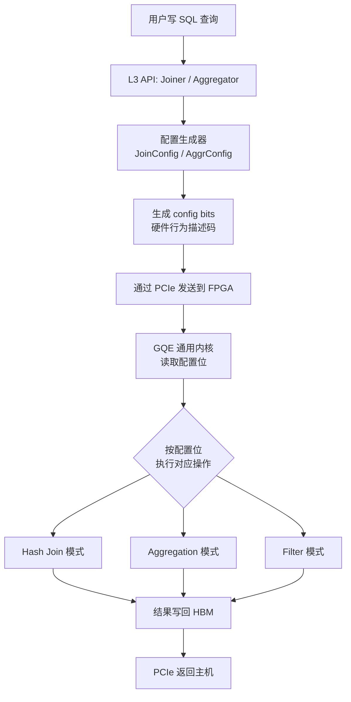

**走读这张图：** 用户的 SQL 意图经过 L3 API 解析，变成一串"硬件可读的配置位码"（就像机器语言指令）。这串码通过 PCIe 总线发往 FPGA，GQE 内核读到它之后，就知道"这次要做哈希连接，第 0 列和第 1 列配对，过滤条件是第 2 列大于 100"。整个过程**不需要重新烧录 FPGA**，切换查询只需毫秒级。

### 6.2.3 数据的"身份证"：Table 与 MetaTable

在 GQE 的世界里，数据有两个层次的描述：

**Table** 是数据的逻辑容器。想象它是一个 Excel 表格，但数据是**按列存储**的（而不是按行）。这叫做列式存储（Columnar Storage）。为什么按列存？因为 SQL 查询通常只需要几列，列式存储可以只读需要的列，大幅减少 I/O。

**MetaTable** 是给硬件看的"说明书"。它用硬件能理解的方式描述：这张表有几行？每列在内存的哪个地址？有没有被分成多个分区？就像快递包裹上的运单，告诉运输系统如何处理这个包裹。

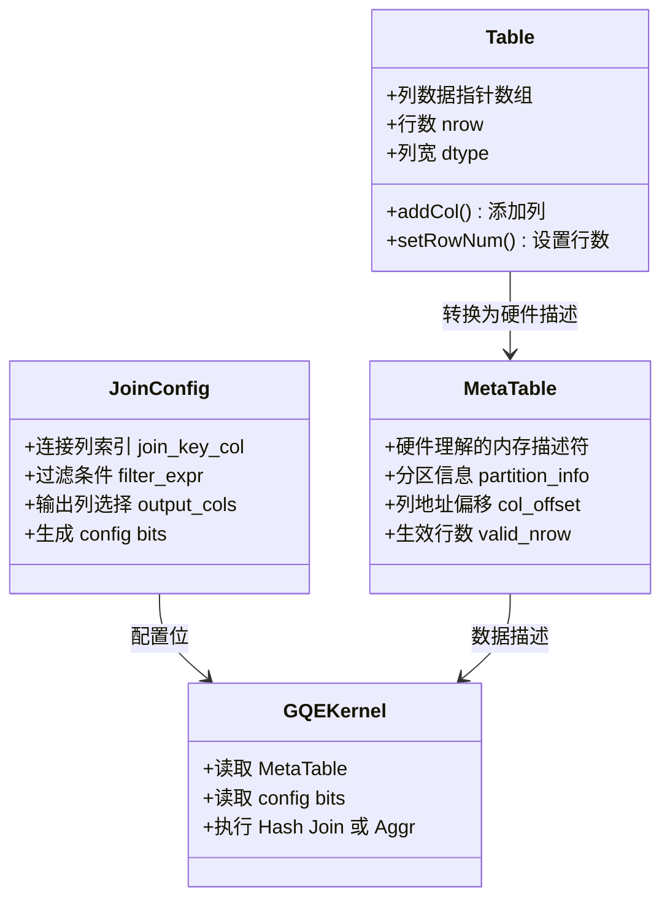

**走读这张图：** 用户操作 `Table` 对象（熟悉的软件接口），L3 框架自动把它转换成 `MetaTable`（硬件描述符）和 `JoinConfig`（配置位），然后喂给 GQE 内核。这就是 L3 API "隐藏复杂性"的核心体现。

### 6.2.4 三种执行策略：根据数据量选择战术

GQE 面对的数据量可能从几 MB 到数百 GB 不等。一把锁解决不了所有问题，于是 L3 设计了三种执行策略（Solution）：

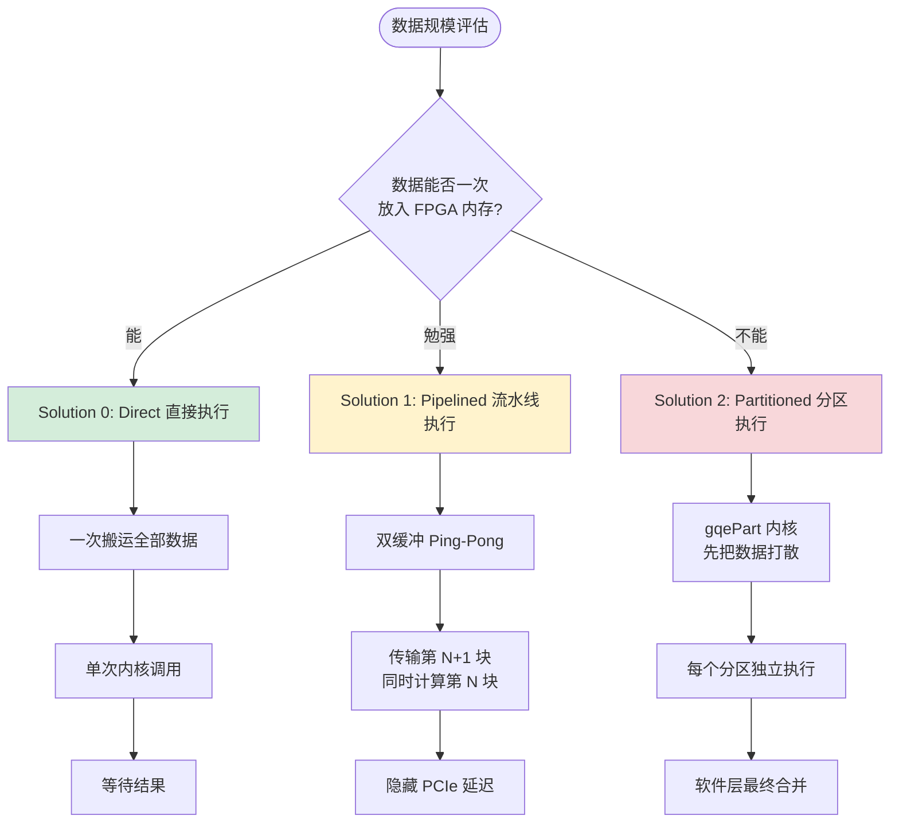

**走读这张图：**

- **Solution 0（直接执行）**：就像你一次性把所有食材都放进锅里炒，简单直接，适合小份量。
- **Solution 1（流水线执行）**：像工厂流水线，切菜和翻炒同时进行。利用"乒乓缓冲"（Ping-Pong Buffer），在 FPGA 处理第 N 块数据时，CPU 同时把第 N+1 块数据准备好传输。这样 FPGA 永远不会"闲着等数据"。
- **Solution 2（分区执行）**：适合数据量远超 FPGA 内存的场景。就像大型仓库搬迁，你先把货物按类别装箱（分区），再一箱一箱地处理，最后汇总。

### 6.2.5 线程池：让硬件不闲着

L3 层的核心秘密武器是**线程池（Threading Pool）**。

想象一个高效的快递分拣中心：有人专门负责接收包裹（数据传输到 FPGA），有人专门负责扫描和分拣（FPGA 计算），有人专门负责发货（数据从 FPGA 传回）。这三组人同时工作，互不等待。

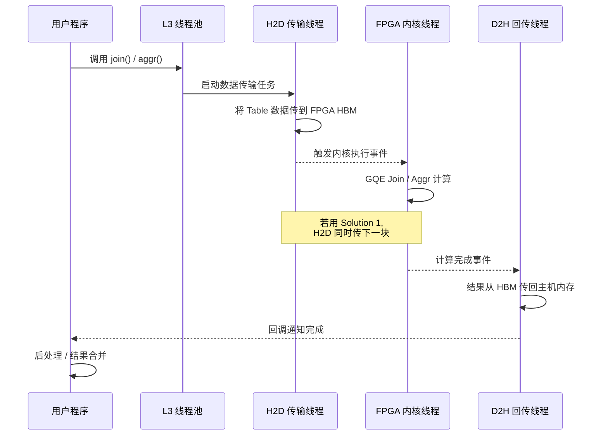

**走读这张图：** 三个线程（H2D 传输、内核执行、D2H 回传）通过 OpenCL 事件（`cl_event`）形成依赖链，自动流水线化。对用户来说，调用一个 `join()` 函数就完成了全部工作，底层的并发复杂性被 L3 完全封装。

> **开发者避坑提示 🚧**  
> OpenCL 事件依赖链就像多米诺骨牌——如果某个事件依赖关系写错，要么程序死锁（互相等待），要么读到"还没算完的脏数据"。修改线程池逻辑时，务必画出完整的事件依赖图再动手。

### 6.2.6 一个完整的 Hash Join 流程

让我们把上面所有概念串起来，看一次完整的哈希连接是怎么发生的：

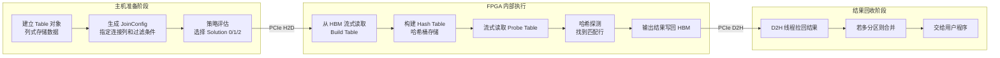

**走读这张图：** 整个过程分三段。主机准备阶段是纯软件工作；FPGA 执行阶段是真正的硬件加速，数据像工厂流水线一样流过哈希构建、探测、输出各个环节；最后结果回收阶段由 D2H 线程自动完成。用户只感知到第一段（准备）和最后的结果，中间的硬件细节完全透明。

---

## 6.3 图分析加速：从 PageRank 到社区发现

### 6.3.1 图：关系的语言

**图**是描述"谁和谁有关系"的数据结构。每个实体是一个**顶点（Vertex）**，关系是一条**边（Edge）**。

- **PageRank**：衡量每个网页（顶点）的重要性，一个被很多重要页面链接的页面，自身也重要。这就是 Google 搜索排名的基础原理。
- **BFS（广度优先搜索）**：从一个起点出发，像水波一样向外扩散，找出所有可达的顶点及其最短距离。
- **Louvain 社区发现**：在一个大型社交网络中，找出哪些用户形成了"圈子"——圈子内部联系紧密，圈子之间联系稀疏。

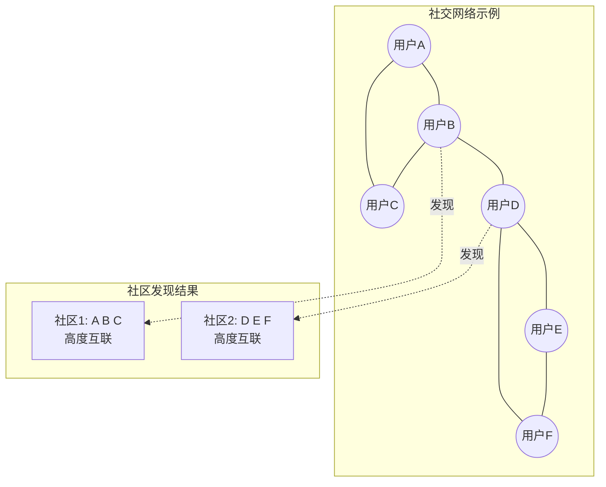

**走读这张图：** 左边是原始的社交网络，用户之间有好友关系。Louvain 算法会发现：A、B、C 相互之间联系紧密，可以归为一个社区；D、E、F 也是。这对推荐系统、反欺诈检测等场景极为重要。

### 6.3.2 图分析的计算挑战：内存带宽的噩梦

图算法有个让 CPU 很头疼的特点：**访问模式极度不规则**。

想象你要统计一个城市里所有十字路口的交通流量。每次你从路口 A 走到下一个路口，下一个路口的位置是不确定的（取决于道路结构），你无法提前预测。这导致 CPU 的高速缓存（Cache）频繁"猜错"，大量时间浪费在等待内存数据上。

FPGA 的 HBM（高带宽内存）能提供高达 **460 GB/s**（U50）乃至 **820 GB/s**（U55C）的内存带宽，是普通 DDR4 的 10 倍以上，这正是对付不规则图访问的利器。

### 6.3.3 L3 API 的门面：xf::graph::L3 操作类

Vitis Libraries 的图分析 L3 层遵循了一个统一的"操作类"模式。每种图算法对应一个操作类（如 `op_PageRank`、`op_BFS`、`op_LouvainModularity`），它们都通过 **XRM（Xilinx Runtime Manager）** 管理 FPGA 资源。

把 XRM 想象成一个"硬件停车场管理员"。你要使用 FPGA 资源，先向他报到，他给你分配一个空位（计算单元 CU）；用完了还给他，他记录在册。这样多个算法、甚至多个程序，就可以安全地共享同一块 FPGA 板卡。

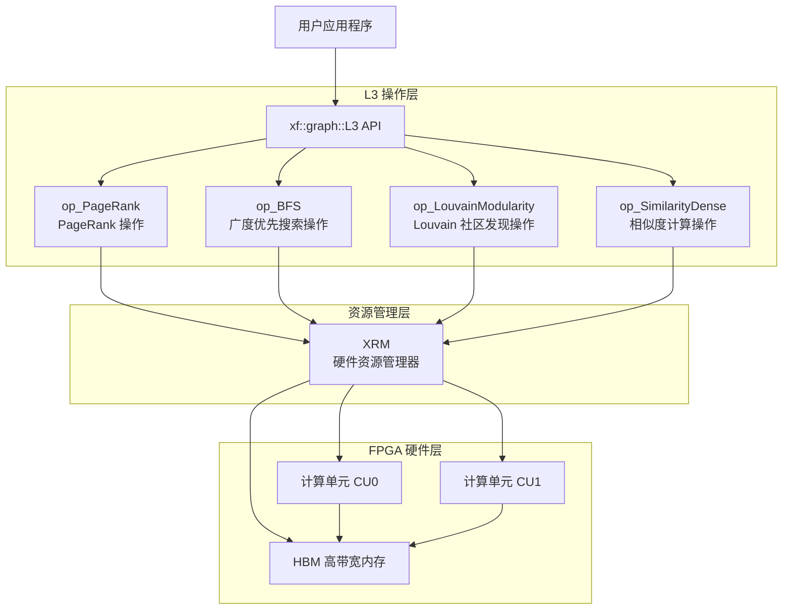

**走读这张图：** 用户只需调用 `op_PageRank::run()` 这样简洁的接口，L3 层会自动向 XRM 申请 FPGA 计算单元，执行内核，然后释放资源。多个操作类可以并行运行在不同的计算单元上，实现真正的多算法并发。

### 6.3.4 PageRank：衡量节点的"影响力"

PageRank 的数学思想可以这样理解：**一个页面的重要性 = 所有指向它的页面的重要性之和的加权平均**。

这是一个典型的**迭代算法**：先给每个顶点赋一个初始分数，然后反复更新（每次都根据邻居的分数更新自己），直到分数不再变化（收敛）。

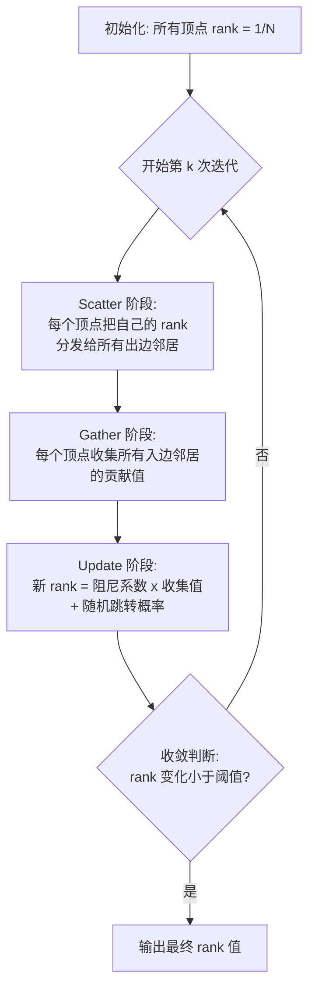

**走读这张图：** 每一轮迭代包含 Scatter（向外广播）和 Gather（向内收集）两个阶段。FPGA 的并行架构让数以亿计的顶点同时进行这些操作，而 CPU 只能排队处理。

在 Vitis Libraries 中，`l2_pagerank_and_centrality_benchmarks` 模块提供了多个 PageRank 变体：
- **基础版**：标准 PageRank，适合中等规模图
- **缓存优化版**：重排顶点访问顺序，提升 HBM 访问局部性
- **多通道扩展版**：利用多个 HBM 通道并行读写，突破单通道带宽瓶颈

### 6.3.5 BFS：水波式的图探索

BFS（Breadth-First Search，广度优先搜索）就像把一块石头扔进水里，水波一圈一圈向外扩散。

从起点顶点出发：
- **第 1 圈**：找到所有直接相连的顶点（距离 = 1）
- **第 2 圈**：找到所有距离为 2 的顶点
- 以此类推，直到所有可达顶点都被访问

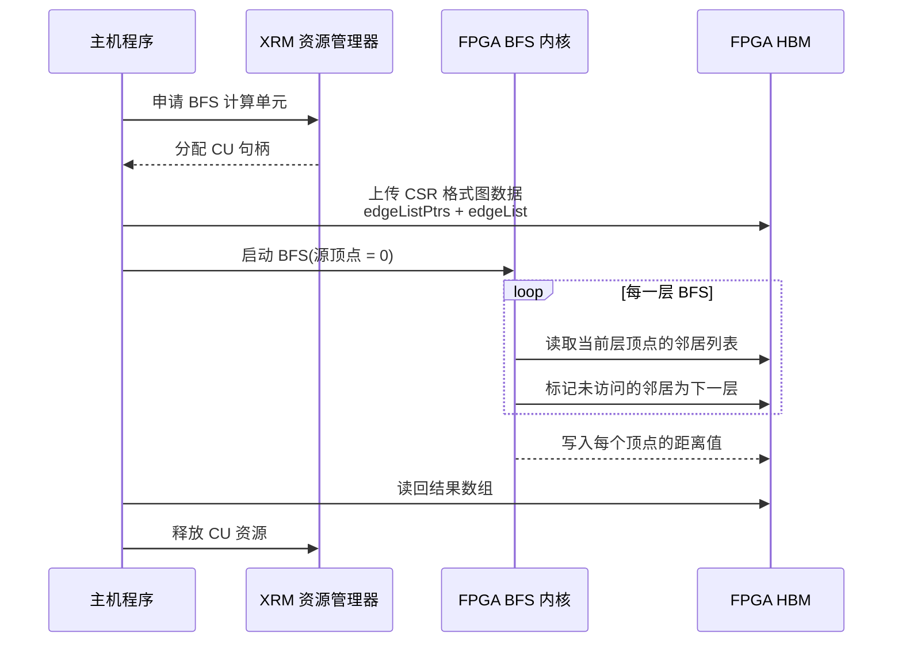

**走读这张图：** 整个过程被清晰地封装在 `op_BFS` 操作类内。用户只需提供图数据（CSR 格式，即压缩稀疏行格式）和起点顶点编号，L3 API 自动完成 XRM 资源申请、数据上传、内核执行和结果读取。

> **CSR 格式**（Compressed Sparse Row，压缩稀疏行）是存储图的标准方式。  
> 想象一个通讯录：`edgeListPtrs[v]` 告诉你"顶点 v 的好友列表从第几个位置开始"，`edgeList` 存储所有好友的编号。通过这两个数组，你可以在 O(1) 时间内找到任意顶点的所有邻居。

### 6.3.6 Louvain 社区发现：大图聚类的艺术

Louvain 是目前最流行的图社区发现算法之一，它能从数十亿条边的图中找出社区结构。

其核心思想基于**模块度（Modularity）**这个指标——模块度衡量一种社区划分有多"好"：圈子内部边越多、圈子之间边越少，模块度越高。

Louvain 算法通过两个交替进行的阶段不断提升模块度：

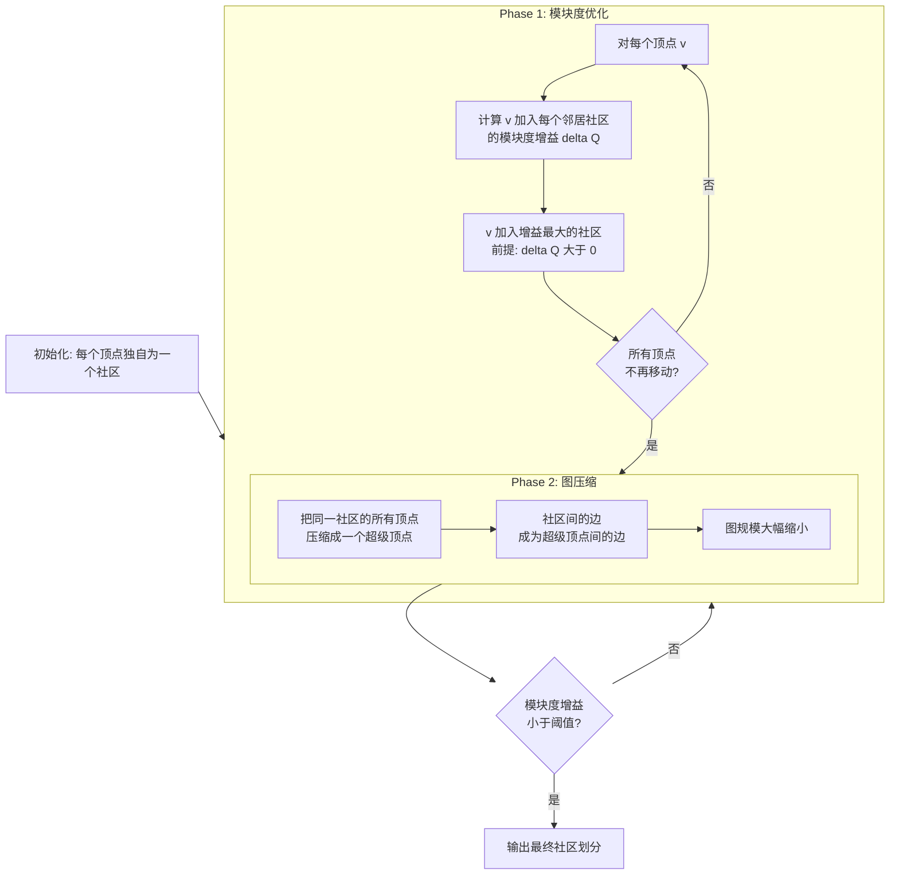

**走读这张图：** Phase 1 是"微调"阶段，每个顶点都在找对自己最有利的归宿。Phase 2 是"粗化"阶段，把结论固化下来，把图压缩得更小，为下一轮迭代做准备。这两个阶段交替进行，图越来越小，算法越来越快收敛。

### 6.3.7 Louvain 的最大挑战：大图装不下

对于拥有数十亿条边的真实图（如整个 Twitter 的关注关系），FPGA 的板载内存（U50 仅有 16GB HBM）根本装不下。

Vitis Libraries 的解决方案是**图分区（Graph Partitioning）**。把它想象成把一幅超大地图剪成小块，每块可以放进 FPGA，处理完再拼回去。

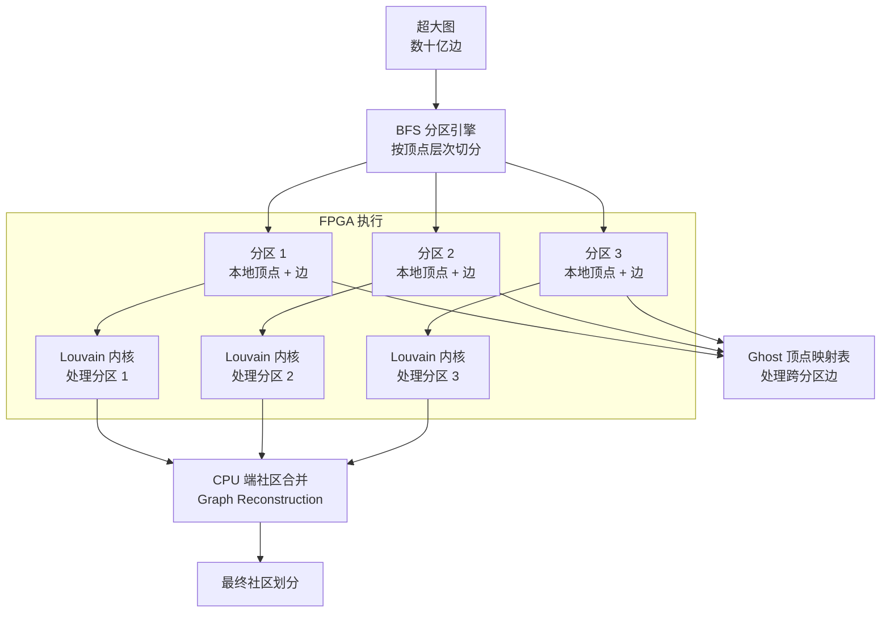

**走读这张图：** 分区引擎使用 BFS 遍历把大图切成小块，每块都能装进 FPGA 的 HBM。跨分区的边通过"Ghost 顶点"（幽灵顶点）来处理——就像地图分块后，边界线两侧的城市需要在两张地图上都标注出来，这样计算才不会出错。

### 6.3.8 CPU 与 FPGA 的任务分工

Louvain 的混合架构是精心设计的：

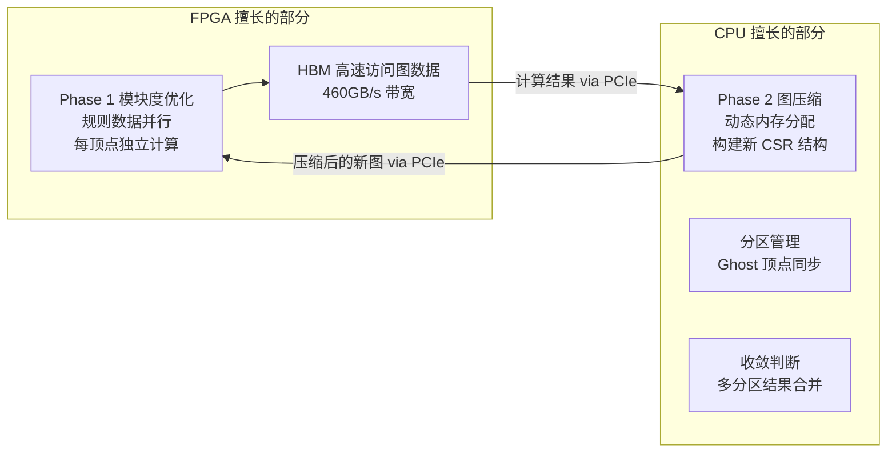

**走读这张图：** Phase 1（每个顶点独立计算模块度增益）天然适合 FPGA 的大规模并行；Phase 2（动态构建新的图结构）需要灵活的内存管理，更适合 CPU。这种分工让系统总体吞吐量最大化。

---

## 6.4 两个领域的 L3 API 对比

虽然数据库查询和图分析看起来很不同，但它们的 L3 API 设计理念高度一致：

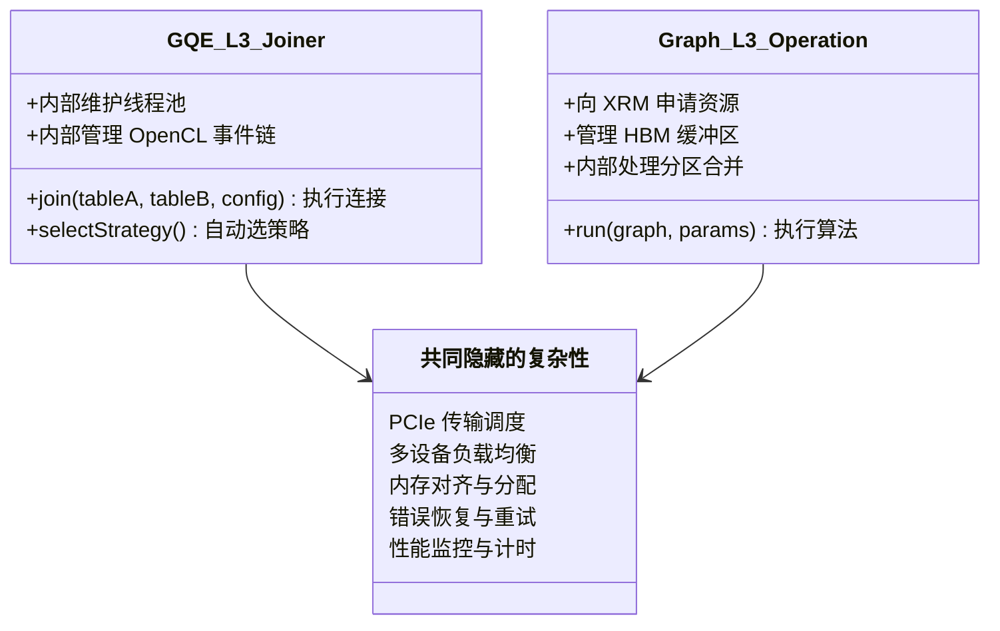

**走读这张图：** 无论是 GQE 的 `Joiner` 还是图分析的 `op_PageRank`，它们对外呈现的接口都极简（一个 `run()` 或 `join()` 调用），对内隐藏了大量相同类型的复杂性：PCIe 调度、内存管理、多设备协调。这正是 L3 层存在的价值。

---

## 6.5 与 TigerGraph 的集成：图数据库的"加速插件"

Vitis Libraries 的图分析能力不仅可以独立使用，还能作为**用户自定义函数（UDF）**插件集成到 TigerGraph 这样的商业图数据库中。

把它想象成给 Excel 装一个自定义函数插件——原本 Excel 只能做基础计算，装了你的插件后，一个函数调用就能触发 FPGA 的海量并行计算。

TigerGraph 使用 GSQL（类 SQL 的图查询语言）。集成了 FPGA 插件后：

```
# GSQL 中调用 FPGA 加速的 Louvain
SELECT louvainModularity(graph) FROM MyGraph
```

这一行 GSQL 背后，会触发 `xf::graph::L3::louvainModularity` 这个 C++ UDF，进而调用整个 FPGA 加速的分区-计算-合并流程。用户感知到的只是一个"快得多的 GSQL 函数"。

---

## 6.6 性能关键：为什么要用 HBM？

在第四章中我们已经学习了 HBM 的物理接线，这里我们从算法角度理解为什么图分析和数据库操作都对 HBM 有强烈需求：

| 算法操作 | 内存访问特点 | HBM 的优势 |
|---------|------------|-----------|
| Hash Join 的 Probe 阶段 | 随机访问哈希桶，访问模式不规则 | 高带宽抵消延迟 |
| PageRank 的 Gather 阶段 | 按邻接表随机读取邻居的 rank 值 | 并行通道隐藏延迟 |
| Louvain 边遍历 | 对所有边反复扫描，顺序但量大 | 460 GB/s 带宽满足需求 |
| BFS 的层次扩展 | 随机访问顶点状态，极度不规则 | 多 bank 并行访问 |

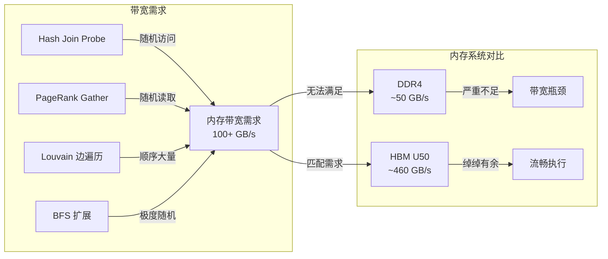

**走读这张图：** 所有的大数据算法操作都对内存带宽有极高需求，HBM 以 DDR4 近 10 倍的带宽彻底解决了这个瓶颈。这也解释了为什么 Louvain 和 GQE 都被设计为只运行在配备 HBM 的 Alveo U50/U55C 加速卡上。

---

## 6.7 开发者视角：如何开始使用这两个模块？

### 使用 GQE 进行哈希连接

```cpp
// 1. 创建表对象（列式存储）
xf::database::gqe::Table tableA, tableB, tableResult;
tableA.addCol(col0_ptr, XF_DATA_W_32, nrow_A);
tableA.addCol(col1_ptr, XF_DATA_W_32, nrow_A);

// 2. 生成连接配置（相当于设置 GQE 旋钮）
xf::database::gqe::JoinConfig jcfg(tableA, tableB);
jcfg.setJoinKey(0);        // 用第 0 列做连接键
jcfg.setFilter("a.col1 > 100");  // 过滤条件

// 3. 调用 L3 API（内部自动选择策略、管理线程池）
xf::database::gqe::Joiner joiner(device_id);
joiner.join(tableA, tableB, jcfg, tableResult);
// 就这么简单！PCIe 传输、内核调用、结果回收全部自动完成
```

### 使用 L3 API 运行 PageRank

```cpp
// 1. 准备 CSR 格式图数据
xf::graph::L3::Handle handle;
handle.initOpPageRank();          // 初始化 PageRank 操作类

// 2. 上传图并执行
xf::graph::L3::pageRank(
    handle,
    num_vertices, num_edges,
    edgeListPtrs,    // CSR 行指针数组
    edgeList,        // CSR 列索引数组
    pagerank_result  // 输出: 每个顶点的 rank 值
);
// XRM 资源申请、HBM 分配、内核执行全部隐藏
```

两个 API 的共同特点：**用户代码极简，复杂性全部在库内部**。

---

## 6.8 本章小结：L3 API 隐藏了什么？

通过本章的深入探索，我们可以总结 L3 API 到底帮我们藏起了哪些"冰山以下"的复杂性：

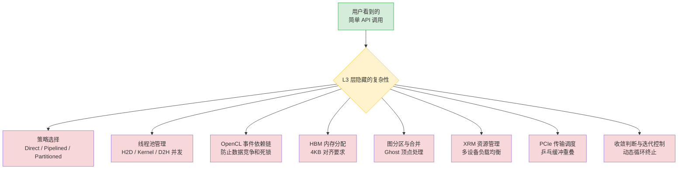

**走读这张图：** 用户代码（绿色）只是冰山一角。L3 层（黄色）承担了所有复杂的底层工作（红色），让领域专家（数据库工程师、图算法工程师）能够专注于业务逻辑，而不必成为 FPGA 硬件专家。

---

在下一章（第七章），我们将把视野转向另外两个领域——**图像编解码（JPEG/WebP/JXL）和量化金融（Monte Carlo 定价模型）**——看看 Vitis Libraries 如何在完全不同的应用场景下应用同样的 L1/L2/L3 设计哲学。

---

> **本章关键词速查**
>
> | 术语 | 含义 |
> |------|------|
> | **GQE** | Generic Query Engine，通用查询引擎，无需重新烧录 FPGA 即可切换查询逻辑 |
> | **Hash Join** | 哈希连接，通过构建哈希表实现两张表的高效匹配 |
> | **MetaTable** | 给硬件看的"数据说明书"，描述列的内存位置和分区信息 |
> | **列式存储** | 按列存储数据，查询时只读需要的列，减少 I/O |
> | **Solution 0/1/2** | GQE 三种执行策略：直接/流水线/分区，按数据量选择 |
> | **乒乓缓冲** | Ping-Pong Buffer，双缓冲技术，让传输和计算并行进行 |
> | **CSR 格式** | Compressed Sparse Row，存储稀疏图的标准格式 |
> | **PageRank** | 通过迭代传播衡量图中顶点重要性的算法 |
> | **BFS** | Breadth-First Search，广度优先搜索，层层向外扩展 |
> | **Louvain** | 基于模块度优化的图社区发现算法 |
> | **模块度 Q** | 衡量社区划分质量的指标，越高越好 |
> | **Ghost 顶点** | 跨分区边端点的副本，用于处理分区间的数据依赖 |
> | **XRM** | Xilinx Runtime Manager，FPGA 计算单元资源的"停车场管理员" |
> | **HBM** | High Bandwidth Memory，高带宽内存，U50 提供约 460 GB/s 带宽 |