# 第六章：领域深度探索——图分析与大规模分区

> **学习目标：** 了解 PageRank、连通分量、Louvain 社区检测等图算法如何映射到 FPGA 硬件上，以及当图数据太大无法放入单张 FPGA 时，多卡分区方案如何解决这一挑战。

---

## 6.1 图是什么？为什么它很难算？

想象一张巨大的城市地图，每个路口是一个**节点（Node）**，每条道路是一条**边（Edge）**。图（Graph）就是这样一种数据结构——用来描述"谁和谁有关系"。

社交网络里，节点是用户，边是好友关系。网页世界里，节点是网页，边是超链接。生物信息学里，节点是蛋白质，边是相互作用。

图计算的难点在于：**数据之间的依赖关系像蜘蛛网一样交织**。你想知道节点 A 的重要性，就得先知道所有指向 A 的节点的重要性；而那些节点的重要性，又依赖于更多节点……这种"牵一发而动全身"的特性，让 CPU 的缓存命中率极低，内存访问变得像在黑暗中随机摸索。

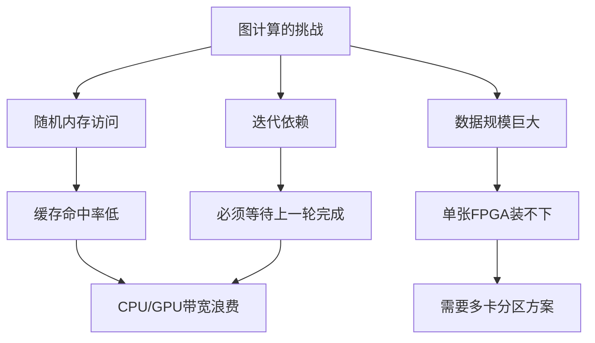

上图展示了图计算面临的三大核心挑战：随机内存访问导致缓存失效、迭代依赖要求严格的轮次同步、超大规模图需要跨设备分区。这三个挑战共同指向了 FPGA 加速的必要性。

---

## 6.2 图分析模块的整体架构

Vitis Libraries 的图分析模块（`graph_analytics_and_partitioning`）同样遵循我们在第二章学过的 L1/L2/L3 三层架构。把它想象成一家餐厅：

- **L1（厨房底层设备）**：HLS 原语，稀疏矩阵乘法单元、标签传播电路
- **L2（厨师工作台）**：PageRank、WCC、Louvain 等算法的 FPGA 内核 + 主机基准测试
- **L3（前台服务员）**：`openXRM` 高层 API，统一调度多卡资源

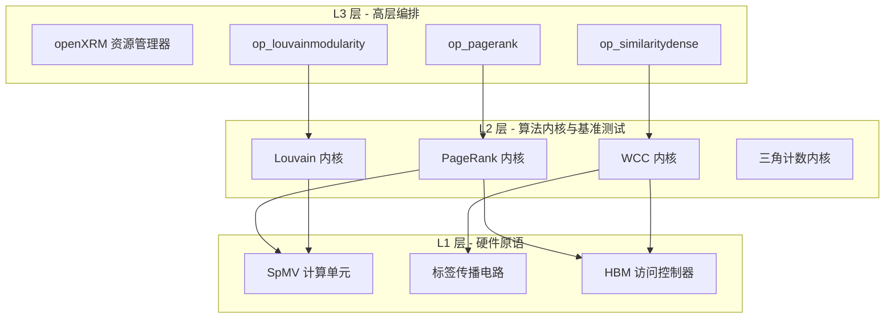

这张图展示了三层之间的调用关系：L3 层的高层操作对象（如 `op_pagerank`）调用 L2 层的具体算法内核，而 L2 层的内核又依赖 L1 层的硬件原语（如稀疏矩阵向量乘法单元 SpMV）来完成实际计算。

---

## 6.3 PageRank：给网页打分的算法

### 6.3.1 PageRank 是什么？

PageRank 是 Google 最初用来给网页排名的算法。它的核心思想很直觉：**一个网页越重要，指向它的重要网页就越多**。

想象一场学术引用游戏：如果《自然》杂志引用了你的论文，你的论文就比被一本无名小刊引用更有价值。PageRank 就是把这个直觉数学化——每个节点的分数，等于所有指向它的节点的分数之和（按出度归一化）。

这个计算需要**反复迭代**，直到每个节点的分数不再变化（收敛）。

### 6.3.2 CSC 格式：为 PageRank 量身定制的存储方式

PageRank 的核心操作是"收集所有入边的贡献"。这对应数学上的**转置矩阵乘向量**（$A^T \cdot x$）。

为了让这个操作在 FPGA 上高效运行，图数据被存储为 **CSC 格式（Compressed Sparse Column，压缩稀疏列）**。

把 CSC 想象成一本按"被引用者"整理的参考文献索引：

```
原始图（谁指向谁）：
  节点0 → [节点1, 节点2]
  节点1 → [节点0]
  节点2 → [节点1]

CSC 格式（按"被指向者"整理）：
  columnOffset = [0, 1, 3, 4]   ← 每列（被指向节点）的起始位置
  rowIndex     = [1, 0, 2, 1]   ← 指向该节点的源节点列表
```

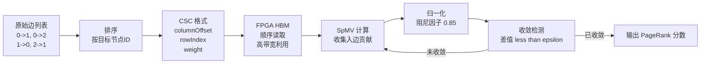

这个流程图展示了从原始边列表到最终 PageRank 分数的完整计算路径。关键在于 CSC 格式让 FPGA 可以顺序扫描内存，而不是随机跳跃，从而充分利用 HBM 的高带宽。

### 6.3.3 Ping-Pong 双缓冲：让迭代不停歇

PageRank 每一轮迭代都需要"旧分数"来计算"新分数"。这就像做饭时需要一个碗装原料、一个碗装成品——不能用同一个碗。

FPGA 内核使用 **Ping-Pong 双缓冲**机制：

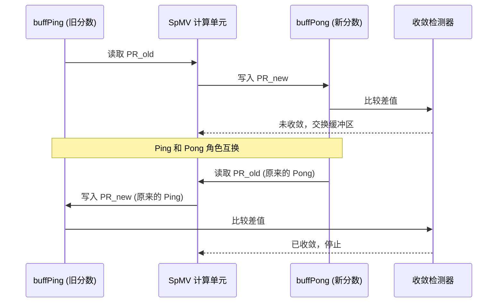

这个时序图展示了双缓冲的工作原理：每一轮迭代，Ping 和 Pong 的角色互换，避免了读写同一块内存的冲突。收敛检测器在每轮结束后比较新旧分数的差值，当差值足够小时停止迭代。

### 6.3.4 多通道扩展：突破带宽瓶颈

单个 HBM 通道的带宽约为 14.4 GB/s。对于超大规模图，这远远不够。

`pagerank_multi_channel_scaling_benchmark` 模块提供了 **2 通道和 6 通道**并行版本。把它想象成高速公路从单车道扩展到六车道——数据可以同时在多条"车道"上流动。

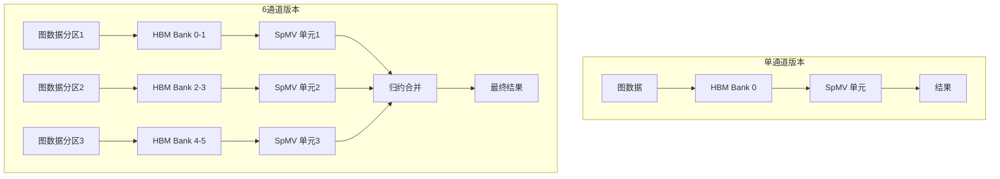

6 通道版本将图数据分成多个分区，每个分区映射到不同的 HBM Bank 组，对应独立的 SpMV 计算单元并行处理。最后通过归约合并得到完整的 PageRank 分数。代价是 FPGA 资源消耗增加约 4-5 倍。

---

## 6.4 连通分量（WCC）：找出图中的"孤岛"

### 6.4.1 什么是弱连通分量？

想象一张铁路网络地图。**弱连通分量（Weakly Connected Components, WCC）** 就是找出所有"互相可以到达"的车站集合。如果从上海出发，经过若干次换乘，能到达北京，那上海和北京就在同一个连通分量里。

在社交网络分析中，WCC 可以发现孤立的用户群体；在网络安全中，可以识别被隔离的子网。

### 6.4.2 标签传播：FPGA 上的"传话游戏"

WCC 在 FPGA 上通常用**标签传播算法**实现：

1. 每个节点初始时有自己的 ID 作为标签
2. 每一轮，每个节点把自己的标签传给邻居
3. 每个节点取所有收到的标签中最小的那个
4. 重复直到标签不再变化

这就像一场"传话游戏"——最终，同一个连通分量里的所有节点都会持有相同的标签（最小节点 ID）。

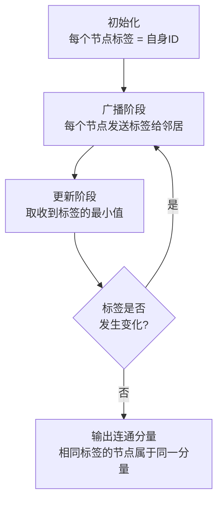

### 6.4.3 HBM Bank 映射：让数据住对"房间"

WCC 的主机代码中有一个关键细节——使用 `cl_mem_ext_ptr_t` 和 `XCL_BANK` 宏将不同数组分配到不同的 HBM Bank：

```cpp
// 把 column 数组分配到 HBM Bank 2
mext_o[0] = {2, column32, wcc()};

// 把 offset 数组分配到 HBM Bank 4  
mext_o[1] = {4, offset32, wcc()};
```

为什么要这样做？想象 HBM 的 32 个 Bank 是超市的 32 个收银台。如果把所有数据都堆在收银台 1，其他 31 个收银台空闲，整体效率极低。通过把 `column`（边索引）和 `offset`（顶点偏移）分配到不同 Bank，两个数组可以**同时被读取**，带宽翻倍。

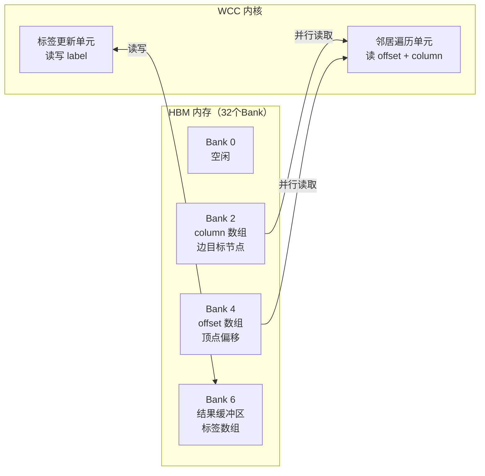

这张图展示了 WCC 内核如何同时从两个不同的 HBM Bank 读取数据。`offset` 和 `column` 数组被分配到不同 Bank，使得邻居遍历单元可以并行读取两个数组，避免了 Bank 冲突导致的带宽瓶颈。

---

## 6.5 Louvain 社区检测：图中的"物以类聚"

### 6.5.1 什么是社区检测？

社区检测（Community Detection）就是在图中找出"抱团"的节点群体。想象一所大学的社交网络：同一个宿舍的同学互相认识的概率远高于跨院系的同学——这些高度互联的子群就是"社区"。

**Louvain 算法**是目前最流行的社区检测算法之一，它通过最大化**模块度（Modularity）**来衡量社区划分的质量。模块度越高，说明社区内部连接越紧密、社区之间连接越稀疏。

### 6.5.2 Louvain 的两个阶段

Louvain 算法交替执行两个阶段，就像整理一个乱糟糟的书架：

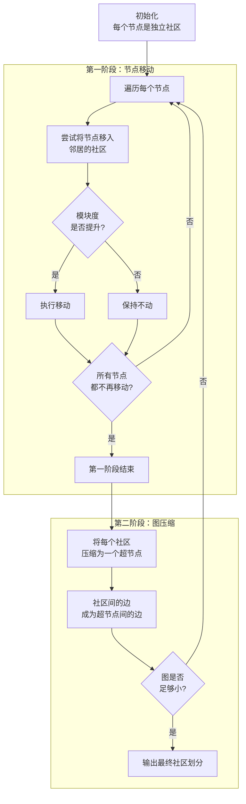

**第一阶段**像是整理书架：把每本书（节点）放到最合适的分类（社区）里，只要这样做能让整体更整齐（模块度提升）就执行。

**第二阶段**像是把整理好的一摞书用橡皮筋捆起来，变成一个"超级书本"，然后对这个更小的图重复第一阶段。

### 6.5.3 Louvain 的 FPGA 实现架构

`community_detection_louvain_partitioning` 模块的架构比 PageRank 更复杂，因为 Louvain 需要处理**动态变化的社区结构**：

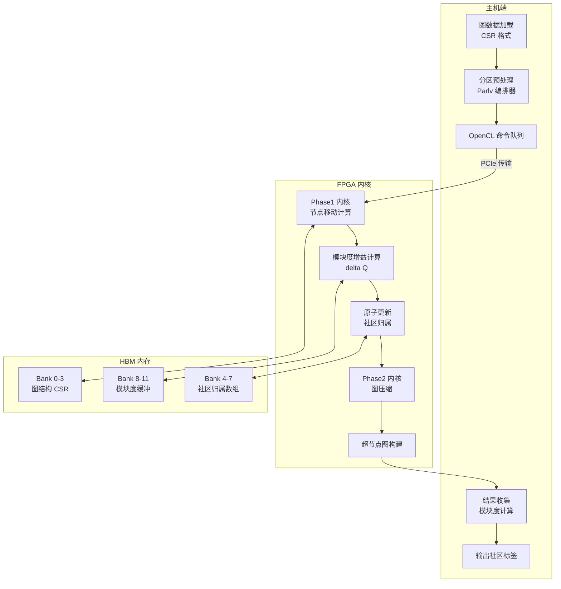

这张架构图展示了 Louvain 算法在 FPGA 上的完整执行流程。主机端的 `Parlv 编排器` 负责协调多轮迭代，FPGA 内核分别处理节点移动（Phase1）和图压缩（Phase2），两个阶段的中间结果都存储在不同的 HBM Bank 中以避免冲突。

### 6.5.4 模块度：衡量社区质量的"尺子"

模块度（Modularity）是 Louvain 算法的核心指标。直觉上，它衡量的是"实际社区内部的边数"比"随机图中期望的边数"多多少。

$$Q = \frac{1}{2m} \sum_{i,j} \left[ A_{ij} - \frac{k_i k_j}{2m} \right] \delta(c_i, c_j)$$

不用被公式吓到——它的意思就是：**如果两个节点在同一社区，且它们之间的连接比随机情况下更多，那就是好的社区划分**。模块度 Q 越接近 1，社区结构越清晰。

---

## 6.6 大图的终极挑战：当图装不进一张 FPGA

### 6.6.1 问题的规模

现实世界的图有多大？

- Facebook 社交图：约 30 亿节点，数千亿条边
- 网页链接图：约 500 亿节点
- 蛋白质相互作用网络：数百万节点

Alveo U50 的 HBM 只有 8 GB。一个有 10 亿条边的图，仅边数据就需要约 8 GB（每条边 8 字节）。这还没算顶点数据、中间结果缓冲……

**结论：大图根本装不进单张 FPGA。**

### 6.6.2 图分区：把大拼图切成小块

解决方案是**图分区（Graph Partitioning）**——把大图切成若干个小子图，分别放到不同的 FPGA 上处理。

这就像把一幅巨大的拼图分给多个人同时拼：每个人负责一块区域，但边界处的拼块需要和邻居协调。

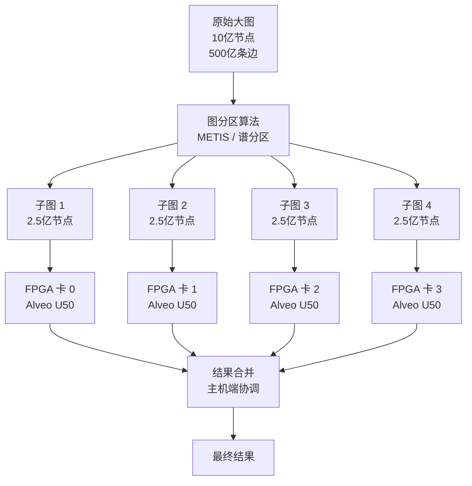

图分区的核心挑战是**最小化跨分区的边数**——跨分区的边意味着不同 FPGA 之间需要通信，这会成为性能瓶颈。好的分区算法（如 METIS）会尽量让每个子图内部连接紧密，子图之间连接稀疏。

### 6.6.3 Louvain 的分区方案：`Parlv` 编排器

`community_detection_louvain_partitioning` 模块中的 `parlv_orchestration` 组件就是专门处理大图分区的编排器。

它的工作流程可以类比为**多人协作翻译一本书**：

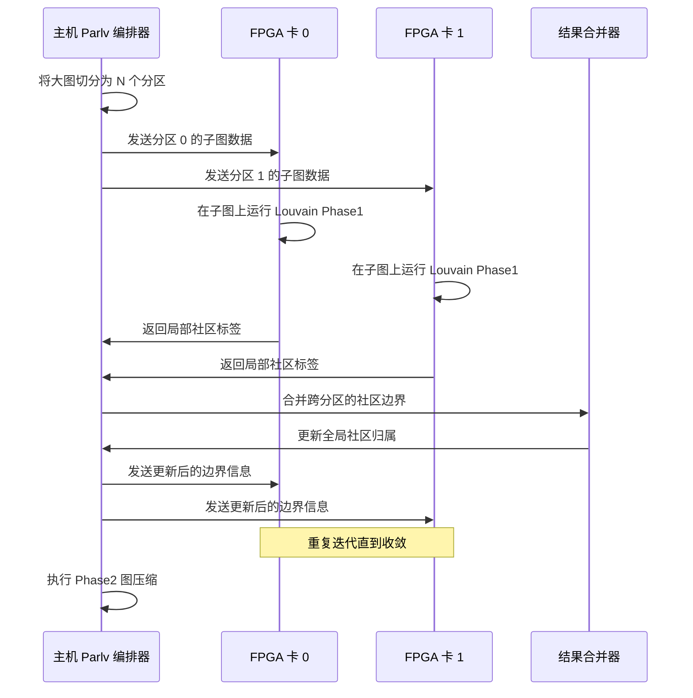

这个时序图展示了多卡 Louvain 的协作流程。关键在于**边界节点的处理**：位于两个分区交界处的节点，其社区归属需要在每轮迭代后由主机端协调更新，然后再广播给各个 FPGA 卡。

### 6.6.4 分区质量的权衡

图分区不是免费的午餐，它带来了几个权衡：

| 分区策略 | 优点 | 缺点 |
|---------|------|------|
| 随机分区 | 实现简单，预处理快 | 跨分区边多，通信开销大 |
| METIS 分区 | 跨分区边少，通信少 | 预处理时间长（$O(E \log E)$） |
| 流式分区 | 支持动态图 | 分区质量不如离线算法 |

对于 Louvain 这类需要多轮迭代的算法，**一次好的预处理分区可以节省大量迭代通信开销**，因此 METIS 风格的离线分区通常是值得的。

---

## 6.7 L3 层：openXRM 统一调度多卡资源

### 6.7.1 XRM 是什么？

**XRM（Xilinx Resource Manager）** 就像是 FPGA 世界的"操作系统调度器"。当你有多张 FPGA 卡，每张卡上有多个计算单元（Compute Units, CU），XRM 负责：

- 追踪哪些 CU 正在被使用，哪些空闲
- 当你请求一个 PageRank 计算单元时，自动找到一个空闲的 CU 分配给你
- 计算完成后，自动释放 CU 供其他任务使用

这就像酒店的前台——你不需要知道哪个房间空着，只需要说"我要一间双人间"，前台帮你安排。

### 6.7.2 L3 算法操作对象

`l3_openxrm_algorithm_operations` 模块提供了一系列高层操作对象，每个对象封装了一种图算法：

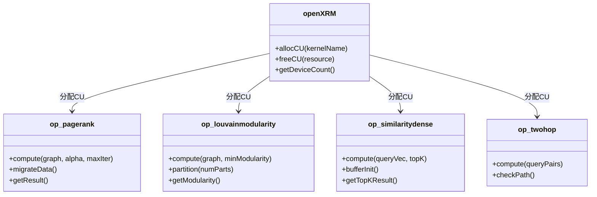

这个类图展示了 L3 层的核心抽象。`openXRM` 是资源管理器，负责 CU 的分配与释放。各个算法操作对象（`op_pagerank`、`op_louvainmodularity` 等）通过 XRM 获取计算资源，然后执行具体的图算法。

### 6.7.3 Handle 三级寻址：找到正确的计算单元

当你有多张 FPGA 卡、每张卡有多个 CU、每个 CU 还有多个逻辑副本（dupNm）时，如何找到正确的计算单元？

L3 层使用**三级索引**：

```
Handle 索引 = deviceID × cuPerBoard × dupNm
            + cuID × dupNm
            + channelID
```

把它想象成一个三维坐标系：
- **deviceID**：第几张 FPGA 卡（楼层）
- **cuID**：这张卡上的第几个 CU（房间号）
- **channelID**：这个 CU 的第几个逻辑副本（床位号）

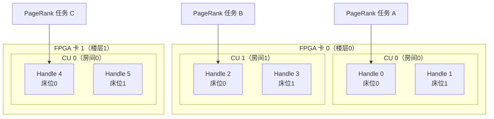

这张图展示了三级寻址的直觉：不同的计算任务被分配到不同的 Handle，Handle 对应具体的物理计算单元。通过这种方式，多个 PageRank 任务可以在不同的 FPGA 卡和 CU 上并行执行。

### 6.7.4 双缓冲 Handle：流水线不停歇

`dupNm`（Duplicate Number）的一个重要用途是实现**双缓冲执行**：

- **Handle 0**：正在执行计算（FPGA 内核运行中）
- **Handle 1**：正在传输下一批数据（PCIe DMA 进行中）

这就像工厂的流水线——当一台机器在加工零件时，另一台机器已经在接收下一批原料，两者并行进行，整体吞吐量翻倍。

---

## 6.8 相似性搜索与二跳查询

### 6.8.1 向量相似性：找到"最像你的人"

`op_similaritydense` 和 `op_similaritysparse` 模块解决的是另一类图问题：**在海量向量中找到最相似的 Top-K 个**。

想象你有 10 亿个用户的兴趣向量（每个用户用一个 128 维的浮点数向量表示），现在要为某个用户找到最相似的 100 个人——这就是推荐系统的核心计算。

Dense（稠密）和 Sparse（稀疏）两种模式对应不同的数据特征：

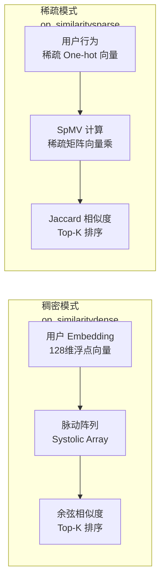

### 6.8.2 二跳查询：你的朋友的朋友

**二跳查询（Two-Hop Query）** 回答的问题是："节点 A 和节点 B 之间，是否存在一条长度为 2 的路径？"

在社交网络中，这就是"你们有共同好友吗？"在知识图谱中，这是"这两个实体是否通过某个中间实体相关联？"

`op_twohop` 模块在 FPGA 上并行处理大量这样的查询对，每个查询对 $(u, v)$ 检查是否存在节点 $x$ 使得 $u \to x \to v$。

---

## 6.9 完整数据流：从磁盘到 FPGA 再到结果

让我们把本章所有内容串联起来，看一个完整的 PageRank 计算流程：

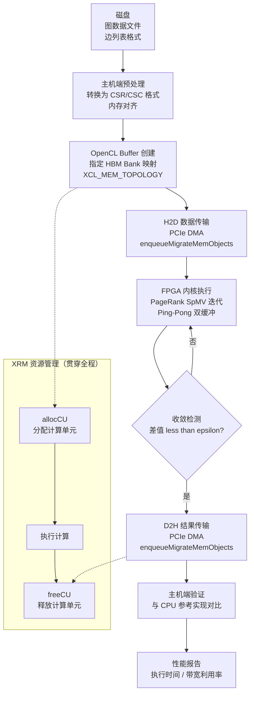

这个完整流程图展示了从磁盘数据到最终结果的每一步。注意 XRM 资源管理贯穿整个过程——在创建 OpenCL Buffer 之前分配 CU，在结果传输完成后释放 CU，确保多任务环境下的资源不泄漏。

---

## 6.10 性能调优：让图算法跑得更快

### 6.10.1 HBM Bank 分配的黄金法则

记住这三条原则：

1. **分散热点**：把频繁访问的数组（如 `offset` 和 `column`）放到不同的 Bank，让它们可以并行读取
2. **隔离读写**：只读数据（图结构）和读写数据（标签/分数缓冲）放到物理隔离的 Bank 区域
3. **匹配计算单元**：每个 SpMV 计算单元对应一组专属的 HBM Bank，避免多个计算单元争抢同一 Bank

### 6.10.2 精度与带宽的权衡

对于超大规模图（超过 1 亿节点），使用 `float`（4 字节）而非 `double`（8 字节）存储 PageRank 分数，可以：
- 将内存占用减半
- 将 HBM 有效带宽翻倍
- 通常对最终排名结果影响极小（PageRank 的相对顺序比绝对值更重要）

### 6.10.3 早停策略

设置合理的 `maxIter`（最大迭代次数）。实践中，大多数图在 50-100 次迭代后就已收敛。继续迭代只是在浪费时钟周期。

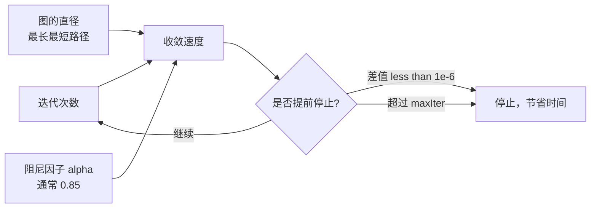

---

## 6.11 本章小结

本章我们深入探索了图分析领域的三大核心算法及其 FPGA 实现：

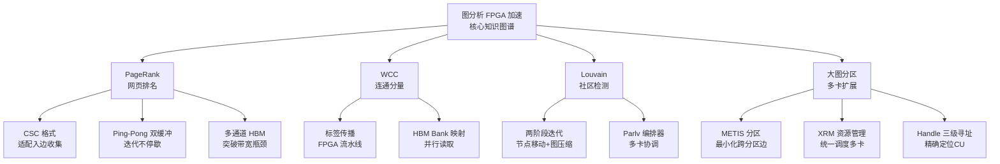

**关键思维转变**：图算法在 FPGA 上的实现，要求我们从"时间复用"思维（CPU 顺序执行指令）切换到"空间并行"思维（数据在物理电路上同时流动）。CSC 格式、Ping-Pong 缓冲、HBM Bank 映射——这些设计决策都是围绕"如何让数据流动得更顺畅"展开的。

当图太大装不进单张 FPGA 时，分区方案将问题分而治之，XRM 资源管理器则像一个智能调度员，确保多张 FPGA 卡的计算资源被充分利用。

在下一章，我们将转向两个截然不同的领域——图像编解码加速和量化金融引擎，看看同样的主机-内核模式如何适应完全不同的数学工作负载。

---

> **延伸阅读**
> - 第四章：连接硬件——内核连接配置、HBM 内存库与平台配置文件（了解 `.cfg` 文件如何控制 HBM Bank 映射）
> - 第三章：数据如何流动——主机-内核流水线与 OpenCL 运行时（深入理解 OpenCL Event 依赖链）