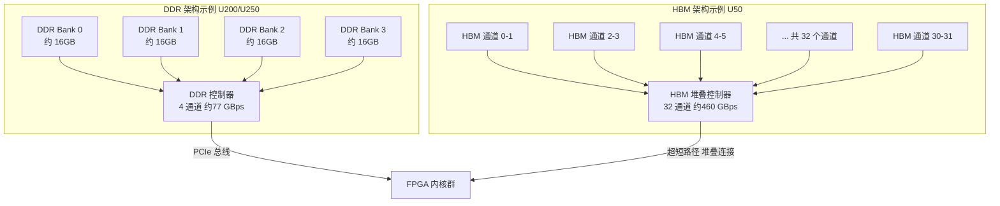
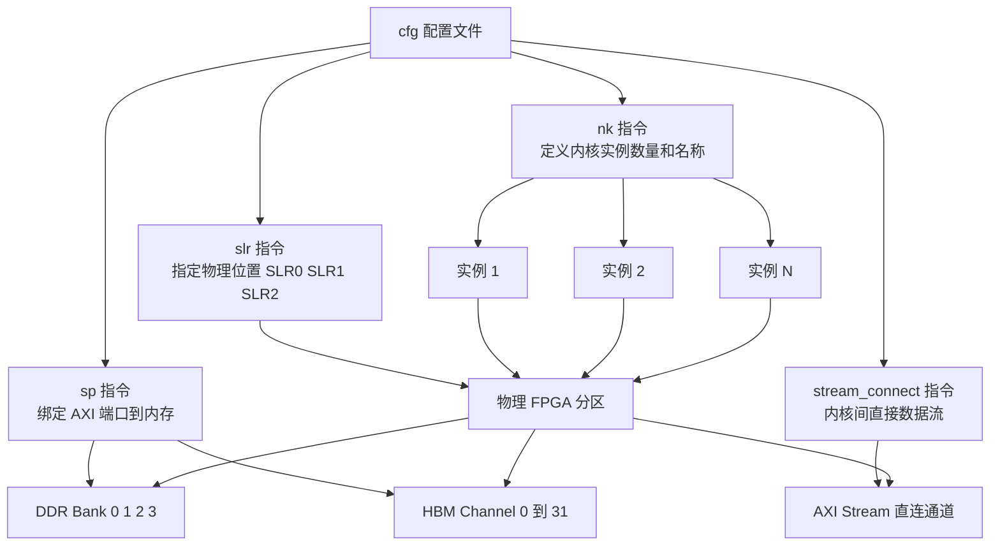
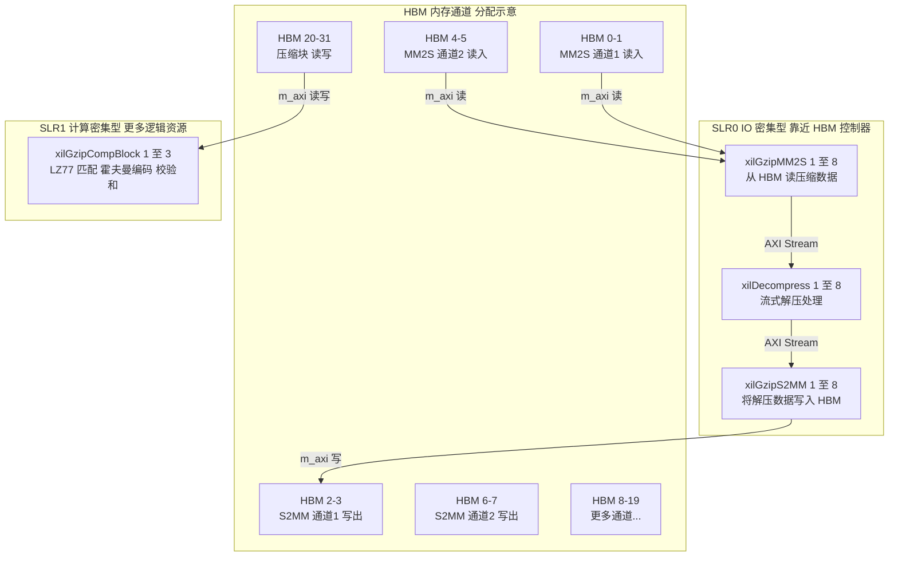
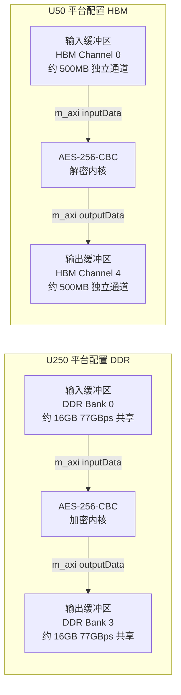
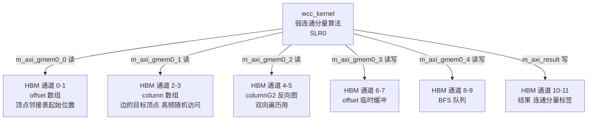
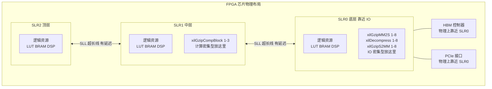
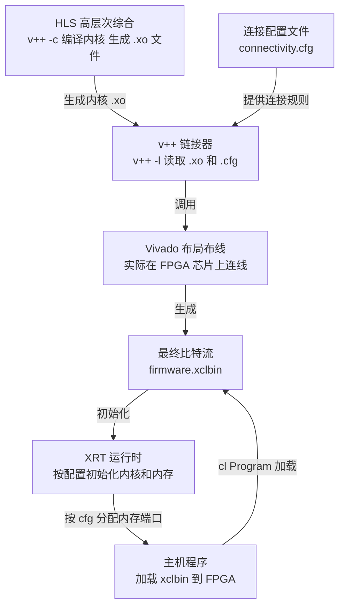
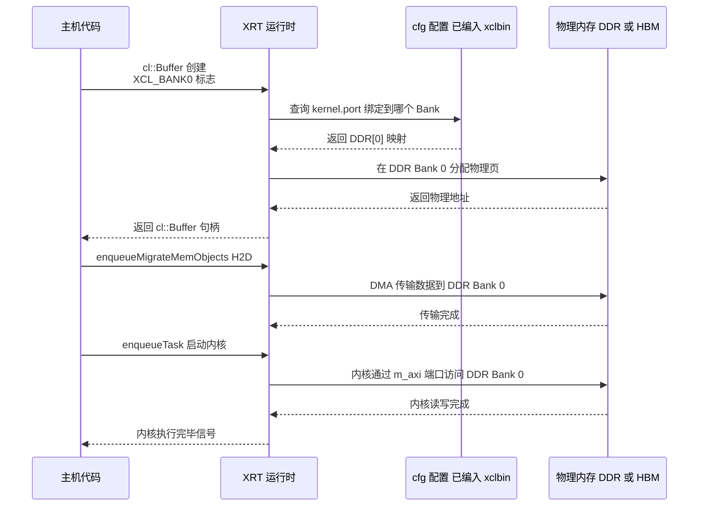
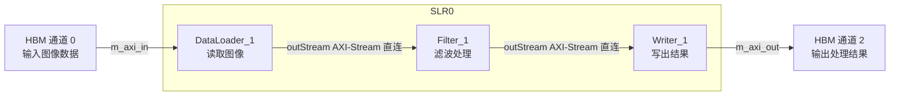
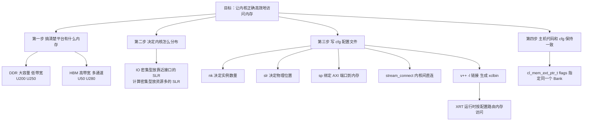

# 第四章：连接硬件——内核连接配置、HBM 内存库与平台配置文件

## 本章你将学到什么

在前三章里，我们已经了解了 Vitis Libraries 的整体架构、分层设计，以及数据如何从主机内存流进 FPGA 内核。但有一个关键问题还没解答：**数据到底存在 FPGA 上的哪里？内核又是怎么找到它的？**

这一章就来揭开 `.cfg` 连接配置文件的神秘面纱——正是这些看似简单的文本文件，决定了每个内核的 AXI 端口连接到哪块物理内存，以及为什么在 U50、U200、U280 等不同型号的 FPGA 卡上，这些配置会截然不同。

---

## 4.1 一个让人困惑的问题：内核怎么知道往哪里读写？

想象你在一个巨大的图书馆里工作。图书馆有好几个书库（内存），书库之间用不同宽度的走廊（数据总线）连接。你（内核）需要去取书（读数据）、还书（写数据）。

**问题来了**：你不能随便走进任何一个书库——每个内核的"通行证"（AXI 端口）必须提前登记在哪个书库有效。这个"通行证登记表"，就是 `.cfg` 连接配置文件。

在 Vitis 的世界里，这个过程叫做**内核连接配置（Kernel Connectivity Configuration）**。没有它，编译工具就不知道把内核的内存端口接到哪块 DDR 或 HBM，编译会直接报错。

---

## 4.2 物理内存的种类：DDR 和 HBM

在深入 `.cfg` 文件之前，我们先要弄清楚 FPGA 卡上有哪些"书库"可用。

### DDR 内存——大容量的普通书库

**DDR（Double Data Rate）内存**就像一个容量巨大的普通书库，书架多、存得下，但走廊只有几条，同时进出的人数有限。

- 典型带宽：每通道约 19 GB/s，4 通道合计约 77 GB/s
- 容量：单卡可达 64 GB（如 U200、U250）
- 适合：需要大存储空间、访问模式相对顺序的任务

### HBM 内存——高速专属快车道

**HBM（High Bandwidth Memory，高带宽内存）**则完全不同——想象它是一栋紧贴 FPGA 芯片旁边建的超高速立体车库，有 32 个独立入口，每个入口都能同时进出车辆。

- 典型带宽：32 个通道合计约 460 GB/s（Alveo U50）
- 容量：通常 16 GB（U50）或 32 GB（U280）
- 适合：随机访问密集、需要极高并发带宽的任务（如图遍历、压缩/解压）



**图表解读**：左边的 DDR 架构里，4 个内存库共享一个控制器，带宽是"共用"的；右边的 HBM 架构里，32 个独立通道各自直连 FPGA，就像 32 条独立的超速公路。HBM 物理上直接堆叠在 FPGA 旁边，走线极短，这也是它带宽极高的原因之一。

---

## 4.3 什么是 AXI 端口？

**AXI（Advanced eXtensible Interface）**是 ARM 定义的一种标准总线协议——你可以把它理解成 FPGA 内核和内存之间的"标准接口插口"，就像 USB 口之于电脑外设。

每个需要访问内存的内核，都会有一个或多个 **`m_axi_*`** 端口（`m` 代表 master，即"主动发起读写的一方"）。这些端口就是内核伸向内存的"手"。

`.cfg` 文件做的事情，就是把这些"手"连接到具体的内存插座（DDR Bank 或 HBM 通道）上。

---

## 4.4 解剖一个 `.cfg` 文件

让我们来读一个真实的配置文件。下面是 GZIP 压缩加速系统中，针对 HBM 平台（U50/U280）的连接配置片段：

```ini
[connectivity]

# 指定内核实例数量和名称
# 格式：nk=<内核名>:<实例数>:<实例名称>
nk=xilGzipMM2S:8:xilGzipMM2S_1.xilGzipMM2S_2.xilGzipMM2S_3.xilGzipMM2S_4.xilGzipMM2S_5.xilGzipMM2S_6.xilGzipMM2S_7.xilGzipMM2S_8
nk=xilDecompress:8:xilDecompress_1.xilDecompress_2.xilDecompress_3.xilDecompress_4.xilDecompress_5.xilDecompress_6.xilDecompress_7.xilDecompress_8
nk=xilGzipS2MM:8:xilGzipS2MM_1.xilGzipS2MM_2.xilGzipS2MM_3.xilGzipS2MM_4.xilGzipS2MM_5.xilGzipS2MM_6.xilGzipS2MM_7.xilGzipS2MM_8
nk=xilGzipCompBlock:3:xilGzipCompBlock_1.xilGzipCompBlock_2.xilGzipCompBlock_3

# 指定内核放置在哪个 SLR（超级逻辑区域）
# 格式：slr=<内核实例名>:<SLR编号>
slr=xilGzipMM2S_1:SLR0
slr=xilDecompress_1:SLR0
slr=xilGzipS2MM_1:SLR0
slr=xilGzipCompBlock_1:SLR1

# 连接内核端口到 HBM 通道
# 格式：sp=<内核实例名>.<端口名>:<内存资源>[通道范围]
sp=xilGzipMM2S_1.m_axi_gmem:HBM[0:1]
sp=xilGzipS2MM_1.m_axi_gmem:HBM[2:3]
sp=xilGzipMM2S_2.m_axi_gmem:HBM[4:5]
sp=xilGzipS2MM_2.m_axi_gmem:HBM[6:7]

# AXI Stream 内核间直连（不经过内存）
# 格式：stream_connect=<发送方>.<端口>:<接收方>.<端口>
stream_connect=xilGzipMM2S_1.outStream:xilDecompress_1.inStream
stream_connect=xilDecompress_1.outaxistreamd:xilGzipS2MM_1.inStream
```

这个文件包含四类关键指令，我们逐一拆解。

---

## 4.5 四类关键指令详解

### 指令一：`nk` —— 我要几台机器？

```
nk=xilGzipMM2S:8:xilGzipMM2S_1.xilGzipMM2S_2...
```

**`nk`（Number of Kernels）**告诉编译器：把这个内核实例化几份，每份叫什么名字。

类比：就像你在工厂里说"我要 8 台 A 型机器，分别命名为 A1 到 A8"。每台机器都是独立的硬件复制，可以同时工作。

### 指令二：`slr` —— 把机器放在工厂哪个车间？

```
slr=xilGzipMM2S_1:SLR0
slr=xilGzipCompBlock_1:SLR1
```

**SLR（Super Logic Region，超级逻辑区域）**是高端 FPGA 的物理分区。想象 FPGA 是一栋三层楼的工厂，每层叫一个 SLR。

跨楼层传递信号需要走楼梯（跨 SLR 布线），会增加延迟。所以聪明的设计会把需要频繁通信的内核放在同一层，把 I/O 密集型的放在靠近"装卸口"（PCIe/HBM 接口）的 SLR。

### 指令三：`sp` —— 把机器的输入输出接口接到哪个仓库？

```
sp=xilGzipMM2S_1.m_axi_gmem:HBM[0:1]
sp=aes256CbcEncryptKernel.inputData:DDR[0]
```

**`sp`（Stream Port）**是最核心的指令——它把内核的某个 AXI 内存端口，绑定到具体的物理内存区域。

格式解读：
- `xilGzipMM2S_1.m_axi_gmem`：内核实例名 + 端口名
- `HBM[0:1]`：HBM 的第 0 号和第 1 号通道（绑定为一个逻辑端口，带宽翻倍）
- `DDR[0]`：DDR 的第 0 号存储库

`HBM[0:1]` 表示把两个相邻通道"绑在一起"用，就像把两条车道合并成一条更宽的车道——理论带宽翻倍。

### 指令四：`stream_connect` —— 内核之间直接"打电话"

```
stream_connect=xilGzipMM2S_1.outStream:xilDecompress_1.inStream
```

**`stream_connect`** 让两个内核之间用 AXI Stream（流式接口）直接通信，完全绕过内存。

类比：这就像两位同事坐在相邻工位，直接口头传话，不需要把信息先写进共享文档再让对方去读。速度极快，但双方必须是"邻居"（同 SLR 或相邻 SLR）。

---

## 4.6 完整的配置指令全景图



**图表解读**：一个 `.cfg` 文件包含四类指令，分别解决"多少个内核"、"放在哪里"、"连接哪块内存"、"如何直接传数据"四个问题。编译工具（`v++` 链接器）读取这个文件，生成最终的硬件比特流。

---

## 4.7 案例一：GZIP 压缩系统的 HBM 布线

现在我们把前面学到的知识，应用到一个真实的复杂案例：GZIP 压缩/解压系统的 HBM 配置。

这个系统总共有 **30 个内核实例**：
- 8 个 `xilGzipMM2S`（内存到流，"搬运工"）
- 8 个 `xilDecompress`（解压，"拆包工"）  
- 8 个 `xilGzipS2MM`（流到内存，"打包工"）
- 3 个 `xilGzipCompBlock`（压缩，"重型压缩机"）



**图表解读**：解压路径（上方流）全部在 SLR0，内核间通过 AXI Stream 直接传数据，不走内存。每对 MM2S + S2MM 各自占用独立的 HBM 通道对，互不干扰。压缩块（COMP）在 SLR1，使用更靠后的 HBM 通道。

### 为什么解压要 8 路，压缩只要 3 路？

这是一个经典的**并行度不对称设计**：

- **解压**：计算简单，主要是 I/O 密集型。需要 8 路并行来"喂饱" HBM 的带宽。
- **压缩**：计算复杂（LZ77 字符串匹配 + 霍夫曼编码），每个 CompBlock 需要大量 FPGA 资源（LUT、DSP、BRAM）。3 个已经足够处理 8 路解压通道的吞吐量。

就像一个工厂里，8 个搬货工人的速度恰好能喂饱 3 台重型压缩机——再加机器就浪费了，再减搬运工就会让机器空转。

---

## 4.8 案例二：AES-256-CBC 加密——从 DDR 到 HBM 的平台迁移

现在来看一个对比鲜明的案例：AES-256-CBC 加密内核在两个平台上的配置差异。

### U250 平台（DDR 版本）

```ini
[connectivity]
sp=aes256CbcEncryptKernel.inputData:DDR[0]
sp=aes256CbcEncryptKernel.outputData:DDR[3]
```

**就两行**。简单直接：输入数据放 DDR[0]，加密后的输出放 DDR[3]。

为什么输入和输出要放不同的 DDR Bank？因为如果放同一个 Bank，读和写会竞争同一个内存控制器的带宽，就像两辆车同时要过一个单行道隧道。分开放就像开了两个隧道，各走各的。

### U50 平台（HBM 版本）

```ini
[connectivity]
sp=aes256CbcDecryptKernel.inputData:HBM[0]
sp=aes256CbcDecryptKernel.outputData:HBM[4]
```

**形式相同，但内容天差地别**：从 DDR Bank 换成了 HBM Channel，而且输入和输出也刻意分开（HBM[0] 和 HBM[4]），避免在同一个 HBM 伪通道（pseudo-channel）内产生冲突。



**图表解读**：两个配置在功能上等价，但硬件特性完全不同。U250 的 DDR 容量大（适合大批量消息），U50 的 HBM 带宽高（适合高频流式加解密）。主机代码完全不用修改，只需换一个 xclbin 文件和对应的 cfg。

---

## 4.9 案例三：图分析内核——HBM 多通道绑定的艺术

图分析算法（如 WCC 弱连通分量）是随机访问内存的典型场景——遍历图的邻居节点时，内存访问模式完全不规律，像在一个巨大停车场里随机找车位。

这类场景对内存并发度要求极高，所以 U50 的 WCC 内核配置看起来像这样：

```ini
[connectivity]
nk=wcc_kernel:1:wcc_kernel
slr=wcc_kernel:SLR0

sp=wcc_kernel.m_axi_gmem0_0:HBM[0:1]    # offset 数组
sp=wcc_kernel.m_axi_gmem0_1:HBM[2:3]    # column 数组（高频访问）
sp=wcc_kernel.m_axi_gmem0_2:HBM[4:5]    # columnG2 反向图
sp=wcc_kernel.m_axi_gmem0_3:HBM[6:7]    # offset 临时
sp=wcc_kernel.m_axi_gmem0_4:HBM[8:9]    # queue BFS 队列
# ... 共 11 个端口，分布在 HBM[0:19]
```

注意到了吗？每个端口绑定的是 `HBM[X:Y]`——两个通道合并为一个逻辑端口。这意味着：

$$\text{单端口带宽} = 2 \times \text{单通道带宽} \approx 2 \times 15 \text{ GB/s} = 30 \text{ GB/s}$$

而 11 个端口同时工作，理论上可以利用的总带宽高达数百 GB/s。



**图表解读**：WCC 内核同时开了 6 条（甚至更多）独立的 HBM 通道，每条通道都在并行处理不同数组的读写请求。这就像同时打开 12 个书库门，6 组搬运工各自独立工作——随机访问的惩罚被多路并行彻底摊薄。

---

## 4.10 平台对比：U50、U200、U280 选哪个？

到这里，你可能想问：面对一个具体任务，我该选哪个平台、用哪种内存配置？

```mermaid
graph TD
    START[选择目标平台]

    START --> Q1{需要超大内存容量?<br/>单任务数据超过 32GB}
    Q1 -->|是| U200_250[推荐 U200 或 U250<br/>DDR 64GB<br/>sp= DDR 0 到 3]
    Q1 -->|否| Q2{随机访问密集?<br/>如图遍历 加密流]

    Q2 -->|是 极高并发带宽| U50[推荐 U50<br/>HBM 16GB 460GBps<br/>sp= HBM 0 到 31]
    Q2 -->|需要在高带宽和大容量之间平衡| U280[推荐 U280<br/>HBM 32GB 460GBps 加 DDR 64GB<br/>可混用 HBM 和 DDR]

    U200_250 --> CFG_DDR[cfg 配置<br/>sp=kernel.port DDR 0]
    U50 --> CFG_HBM[cfg 配置<br/>sp=kernel.port HBM 0 到 1]
    U280 --> CFG_MIX[cfg 配置<br/>热数据用 HBM 冷数据用 DDR]
```

**图表解读**：选择平台的核心依据是**数据访问模式**和**数据规模**。随机访问密集选 HBM，大容量顺序访问选 DDR，两者都需要就选 U280（两种内存都有）。

### 各平台关键参数速查表

| 平台 | 内存类型 | 总带宽 | 总容量 | HBM 通道数 | DDR Bank 数 | 典型 cfg 语法 |
|------|---------|--------|--------|-----------|------------|--------------|
| **U50** | HBM2 | ~460 GB/s | 16 GB | 32 | 0 | `HBM[0]` 至 `HBM[31]` |
| **U200** | DDR4 | ~77 GB/s | 64 GB | 0 | 4 | `DDR[0]` 至 `DDR[3]` |
| **U250** | DDR4 | ~77 GB/s | 64 GB | 0 | 4 | `DDR[0]` 至 `DDR[3]` |
| **U280** | HBM2 + DDR4 | ~460+34 GB/s | 32+8 GB | 32 | 2 | `HBM[0:31]` 或 `DDR[0:1]` |

---

## 4.11 SLR：FPGA 的楼层分配

我们已经多次提到 SLR，现在来深入理解一下。

**SLR（Super Logic Region）**是高端 FPGA（如 Virtex UltraScale+）的物理分区。想象 FPGA 芯片是一栋三层楼的大楼：

- 每层楼（SLR）都有自己的逻辑资源（门、走廊、插座）
- 楼层之间靠"楼梯"（SLL, Super Long Line）连接
- 走楼梯有延迟——信号从 SLR0 传到 SLR2 需要多几个时钟周期
- 一层楼最多有限的"房间"——逻辑资源不是无限的



**图表解读**：GZIP 系统的 I/O 密集型内核（MM2S、S2MM）放在 SLR0，因为 HBM 控制器物理上更靠近 SLR0，走线短、延迟低。计算密集型的 CompBlock 放在 SLR1，那里有更多空闲的逻辑资源可以用。这是一个**物理感知的布局决策**。

---

## 4.12 `.cfg` 文件从哪来，又到哪里去？

理解了文件内容，现在来看它在整个编译流程中扮演的角色。



**图表解读**：`.cfg` 文件在 `v++ -l`（链接阶段）被读取，告诉 Vivado 如何在芯片上布线。一旦生成了 `.xclbin`，运行时（XRT）就按照这个配置初始化内存映射。主机代码里通过 `cl::Buffer` 申请的内存，会根据这个配置被路由到正确的物理 DDR Bank 或 HBM 通道。

---

## 4.13 主机代码与 `.cfg` 的"默契"

`.cfg` 文件不是孤立存在的——它必须和主机代码保持一致。这个"默契"体现在 `cl_mem_ext_ptr_t` 的 `flags` 字段上。

```cpp
// 主机代码中指定内存要落在哪个 Bank（必须和 .cfg 一致）
cl_mem_ext_ptr_t mext_o;

// U250 DDR 方式：指定 DDR Bank 0
mext_o = {XCL_BANK0, inputData, aesKernel()};

// U50 HBM 方式：指定 HBM 通道 0
mext_o = {XCL_MEM_EXT_P2P_BUFFER, inputData, aesKernel()};
// 或者使用 Xilinx 扩展的 HBM 标志
mext_o = {XCL_BANK(0), inputData, aesKernel()};  // HBM channel 0

cl::Buffer buf(context, 
    CL_MEM_EXT_PTR_XILINX | CL_MEM_USE_HOST_PTR | CL_MEM_READ_WRITE,
    size, &mext_o);
```

**关键点**：如果主机代码说"把这块内存放 DDR[0]"，但 `.cfg` 文件里内核端口连的是 DDR[1]，数据就对不上了。两边必须讲同一种语言。



**图表解读**：这是一次完整的内存申请-传输-计算序列图。注意 XRT 在创建 Buffer 时就查询了 `.cfg`（已编入 xclbin）中的映射关系，并据此分配物理内存。后续的数据传输和内核访问都基于这个物理地址映射。

---

## 4.14 常见错误与调试技巧

### 错误一：Bank 超界

```
Error: HBM bank index 32 is out of range [0:31]
```

**原因**：U50/U280 的 HBM 最多 32 个通道（编号 0-31），写 `HBM[32]` 就越界了。

**解决**：检查目标平台的 HBM 通道数量，U50 最大 `HBM[31]`。

### 错误二：端口名拼错

```
Error: Port 'm_axi_gmen' not found in kernel 'wcc_kernel'
```

**原因**：`.cfg` 里的端口名和 HLS 代码里声明的 `m_axi` 接口名不一致。

**解决**：用 `v++ --report_level 2` 查看内核实际导出的端口名，严格对照。

### 错误三：Stream 连接形成环路

```
Error: Circular stream connection detected
```

**原因**：`stream_connect` 写成了 A→B→A 的环，数据会死锁。

**解决**：画出数据流方向图，确保是有向无环图（DAG）。

### 错误四：跨 SLR 的 Stream 连接

这不是报错，但会严重影响时序。AXI Stream 跨 SLR 走线需要额外的寄存器打拍（pipeline register），工具会自动插入，但如果跨 SLR 的信号太多，可能导致时序收敛失败（Timing Violation）。

**最佳实践**：尽量让通过 `stream_connect` 相连的内核放在同一个 SLR。

---

## 4.15 动手写一个 `.cfg` 文件

假设你有一个简单的图像处理流水线：
1. `DataLoader` 内核：从内存读入图像数据
2. `Filter` 内核：对数据做滤波处理
3. `Writer` 内核：把结果写回内存

你的目标平台是 U50（HBM），要求：
- `DataLoader` 读写用 HBM[0]
- `Writer` 写出用 HBM[2]（避免和读竞争）
- `DataLoader` 和 `Filter` 之间用 Stream 直连
- `Filter` 和 `Writer` 之间用 Stream 直连
- 所有内核放在 SLR0

答案：

```ini
[connectivity]

# 实例化各内核
nk=DataLoader:1:DataLoader_1
nk=Filter:1:Filter_1
nk=Writer:1:Writer_1

# 全部放在 SLR0（靠近 HBM 控制器）
slr=DataLoader_1:SLR0
slr=Filter_1:SLR0
slr=Writer_1:SLR0

# 内存端口绑定
sp=DataLoader_1.m_axi_in:HBM[0]
sp=Writer_1.m_axi_out:HBM[2]

# 内核间 Stream 直连（不过内存）
stream_connect=DataLoader_1.outStream:Filter_1.inStream
stream_connect=Filter_1.outStream:Writer_1.inStream
```



**图表解读**：数据从 HBM[0] 进入 `DataLoader`，经过两个 Stream 直连（完全不碰内存）传递到 `Writer`，最终写入 HBM[2]。整条流水线在 SLR0 内部运行，跨 SLR 延迟为零。

---

## 4.16 本章总结：用一张图串起所有概念



**图表解读**：整个配置流程分四步：了解平台内存 → 规划内核布局 → 编写 `.cfg` 文件 → 主机代码对齐。这四步缺一不可，共同构成了"硬件连线"的完整闭环。

---

## 关键术语速查

| 术语 | 一句话解释 |
|------|-----------|
| **`.cfg` 文件** | 告诉编译器"把内核的哪个端口接到哪块内存"的配置文本 |
| **DDR** | 大容量普通内存，带宽有限，适合顺序大文件处理 |
| **HBM** | 高带宽堆叠内存，32个独立通道并行，适合随机访问密集任务 |
| **AXI 端口（m_axi）** | 内核伸向内存的"手"，每个手只能连一块内存区域 |
| **`nk` 指令** | 指定同一内核实例化几份（并行工作的复制体数量） |
| **`slr` 指令** | 指定内核实例放在 FPGA 哪个物理分区（楼层） |
| **`sp` 指令** | 把内核的某个 AXI 端口绑定到具体的 DDR Bank 或 HBM 通道 |
| **`stream_connect`** | 让两个内核直接通过 AXI Stream 通信，完全绕过内存 |
| **SLR** | FPGA 的物理楼层分区，跨 SLR 走线有延迟代价 |
| **HBM[0:1]** | 把 HBM 第 0 和第 1 号通道绑在一起用，带宽翻倍 |

---

## 下一章预告

在第五章，我们将进入一个具体的领域深度探索——**数据分析、文本处理与机器学习**。你将看到正则表达式编译如何在 FPGA 上变成硬件状态机、模糊文本去重如何利用 HBM 多通道并行大规模运行，以及决策树推理如何被量化压缩进 FPGA 的 BRAM 中。我们会把这一章学到的连接配置知识应用到实际的数据分析场景里，看看端到端的 L1-L2-L3 栈是如何协同工作的。