# 第四章：硬件接线：连接配置文件、HBM 内存槽与 SLR 物理布局

## 本章学习目标

读完本章，你将能够：
- 读懂 `.cfg` 连接配置文件的每一行含义
- 理解为什么要把内核"锁"在特定的 SLR 区域
- 解释 DDR 和 HBM 的区别，以及如何选择正确的内存槽
- 知道这些"接线决策"如何直接影响系统带宽和时序收敛

---

## 从一个比喻开始：你是城市电网规划师

想象你是一座大型工厂园区的电气规划师。园区里有几十台机器（内核/Kernels），每台机器需要稳定的电力供应（内存带宽）。你手里有四个变电站（DDR/HBM 内存控制器），园区被分成三个独立的厂区（SLR 区域）。

你的工作就是：**决定哪台机器接哪个变电站，哪台机器放在哪个厂区**。

如果你把所有机器都接到同一个变电站，那个变电站会过载，整条生产线速度下降。如果你把密切配合的两台机器放在距离很远的不同厂区，它们之间传递信号的电缆就会变得非常长，信号延迟增大，整条流水线的节拍就跟不上了。

这就是 `.cfg` 连接配置文件要解决的核心问题。

---

## 第一节：`.cfg` 文件是什么？

在 Vitis Libraries 的每个硬件加速项目里，你都会看到一个或几个后缀为 `.cfg` 的文件，比如：

```
conn_u280.cfg
conn_u50.cfg  
conn_u200.cfg
```

这些文件不是普通的软件配置文件。它们是**硬件链接阶段的声明式指令集**——告诉 Vitis 工具链（具体是 `v++` 链接器）如何把编译好的内核"物理地"连接到 FPGA 芯片上的各种资源。

你可以把它类比成：如果说 HLS C++ 代码是"设计一台机器的图纸"，那 `.cfg` 文件就是"工厂里的设备布置图和接线图"。

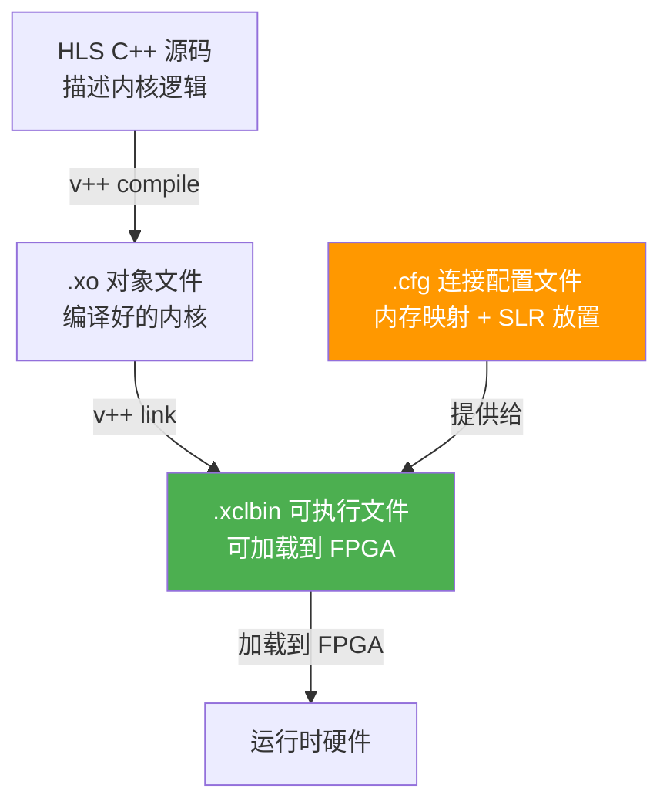

**图示说明**：`.cfg` 文件作为 `v++` 链接阶段的输入，和编译好的 `.xo` 内核文件一起，被合并成最终的 `.xclbin` 可执行文件。这个文件包含了完整的硬件布局信息，可以直接加载到 FPGA 上运行。

---

## 第二节：拆解一个真实的 `.cfg` 文件

我们以 GZIP 压缩加速器的配置文件为例，逐行学习。

```cfg
[connectivity]
nk=xilGzipMM2S:8:xilGzipMM2S_1.xilGzipMM2S_2.xilGzipMM2S_3.xilGzipMM2S_4.xilGzipMM2S_5.xilGzipMM2S_6.xilGzipMM2S_7.xilGzipMM2S_8

stream_connect=xilGzipMM2S_1.outStream:xilDecompress_1.inaxistreamd
stream_connect=xilDecompress_1.outaxistreamd:xilGzipS2MM_1.inStream

sp=xilGzipS2MM_1.out:DDR[0]
sp=xilGzipS2MM_1.encoded_size:DDR[0]

slr=xilGzipCompBlock_1:SLR0
slr=xilGzipCompBlock_2:SLR2
```

这个文件里有四种关键指令，我们一一拆解。

---

### 指令一：`nk` — 克隆内核实例

```cfg
nk=xilGzipMM2S:8:xilGzipMM2S_1.xilGzipMM2S_2...xilGzipMM2S_8
```

**`nk` = Number of Kernels（内核数量）**

想象你有一个乐高积木模具（HLS 内核模板）。`nk` 指令就是告诉工厂："用这个模具，复制出 8 个一模一样的实体积木，分别叫 `_1`、`_2`... `_8`。"

格式是：`nk=<内核模板名>:<实例数>:<实例名列表>`

这些实例名称**非常重要**——后续的 `stream_connect`、`sp`、`slr` 指令都要引用这些精确的名称。任何拼写错误都会导致链接失败。

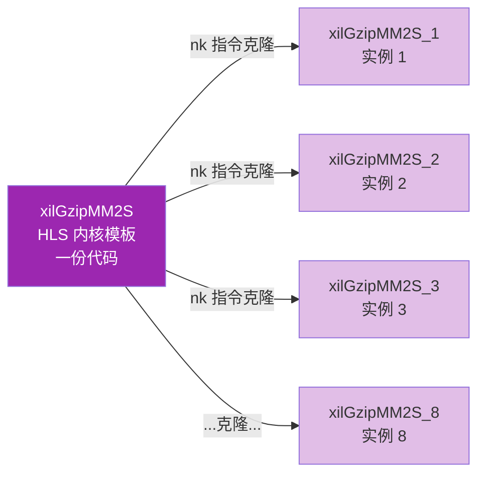

**图示说明**：一份 HLS 内核代码可以被实例化为多个硬件副本，每个副本在 FPGA 上占据独立的逻辑资源，可以同时并行运行。这就是 FPGA 加速中"空间并行"的核心体现。

---

### 指令二：`stream_connect` — 点对点数据管道

```cfg
stream_connect=xilGzipMM2S_1.outStream:xilDecompress_1.inaxistreamd
stream_connect=xilDecompress_1.outaxistreamd:xilGzipS2MM_1.inStream
```

**`stream_connect` 建立 AXI4-Stream 流式连接**

想象工厂里的传送带。`stream_connect` 就是在两台机器之间架设一条专用传送带，让数据像水流一样直接从一个内核流向下一个内核，不需要在中途暂存到内存里。

这里引入一个重要概念：**AXI4-Stream（AXI 流式协议）**。这是 ARM 和 Xilinx 定义的一种数据流传输标准，类似于水管里的水流：
- 数据生产者（上游内核）向管道里"注水"
- 数据消费者（下游内核）从管道里"取水"
- 管道里有 `TVALID`（有数据）和 `TREADY`（准备好接收）两个握手信号，自动调节流速

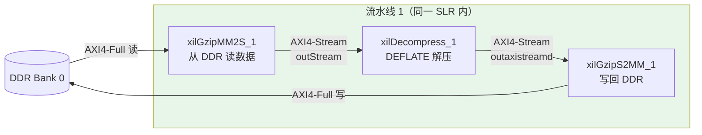

**图示说明**：一条完整的解压流水线由三个内核串联组成。MM2S 从 DDR 读数据，通过 `stream_connect` 直接传给 Decompress，Decompress 解压后再通过 `stream_connect` 传给 S2MM，最后写回 DDR。整条传送带不需要中途落地，延迟极低。

**为什么用流式连接而不是让两个内核都读写同一块内存？**

如果两个内核通过共享内存通信，就像两个工人共用同一张桌子——一个人写完，另一个人才能读，桌子成了瓶颈。而 `stream_connect` 就像给它们架了一条专用传送带，数据边生产边消费，吞吐量大幅提升。

---

### 指令三：`sp` — AXI 端口到内存槽的映射

```cfg
sp=xilGzipS2MM_1.out:DDR[0]
sp=xilGzipS2MM_1.encoded_size:DDR[0]
sp=xilGzipS2MM_1.status_flag:DDR[0]
```

**`sp` = Scalar Port（端口映射）**

这个指令回答了一个问题：**当内核需要读写"全局内存"（DDR/HBM）时，具体写到哪个物理内存控制器？**

想象你在一栋大楼里工作，楼里有四个电梯（DDR 控制器）。`sp` 指令就是给每个员工（内核端口）分配一部专用电梯。如果所有员工都挤同一部电梯，效率极低；分散到四部电梯，并行效率最高。

格式是：`sp=<内核实例名>.<端口名>:<内存类型>[<索引>]`

GZIP 配置中，8 个 S2MM 实例被均匀分配到 4 个 DDR Bank：

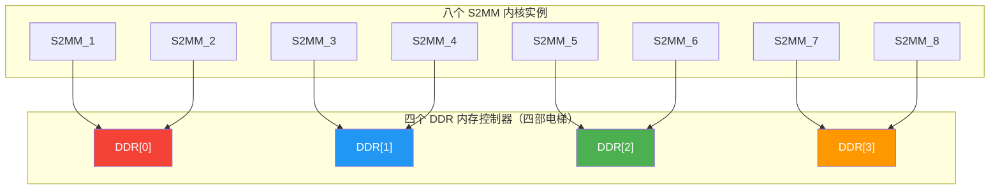

**图示说明**：8 个 S2MM 实例被均匀分配到 4 个 DDR Bank，每个 Bank 服务 2 个实例。如果全部指向 DDR[0]，单个内存控制器的带宽就会成为整个系统的瓶颈。通过分散，系统聚合带宽可以接近 4 倍于单 Bank 的峰值。

---

### 指令四：`slr` — 把内核锁定到物理区域

```cfg
slr=xilGzipCompBlock_1:SLR0
slr=xilGzipCompBlock_2:SLR2
```

**`slr` = Super Logic Region（超级逻辑区域）放置约束**

这是本章最核心、也最容易被初学者忽视的概念。让我们先理解 SLR 是什么。

---

## 第三节：SLR 是什么？为什么要关心它？

### FPGA 芯片的物理结构

现代大型 FPGA（比如 Xilinx UltraScale+ 系列的 U280、U200）并不是一块单一的硅片。为了制造超大规模 FPGA，Xilinx 采用了**硅中介层（Silicon Interposer）技术**——把多块 FPGA 芯粒（Die）拼接在一起，就像把几块积木板拼成一张大桌子。

每一块芯粒就是一个 **SLR（Super Logic Region，超级逻辑区域）**。

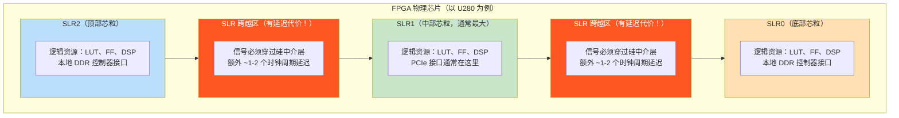

**图示说明**：U280 这类大型 FPGA 由三个 SLR 拼接而成。SLR 内部的信号传输非常快，但**跨越 SLR 边界**的信号必须穿过硅中介层，会引入额外的 1-2 个时钟周期延迟。对于运行在 300MHz 的设计，1 个时钟周期 = 3.3 纳秒，这种延迟累积起来会导致时序无法收敛。

### 为什么 SLR 放置如此重要？

**类比：城市交通规划**

想象北京、天津、河北三个城市（三个 SLR）组成一个经济圈。每个城市内部交通很快（SLR 内部信号传输），但跨城市需要走高速公路（SLR 跨越信号）。

如果你把一个工厂的生产线分布在三个城市，零部件每天在城市间运输，物流成本和时间就会大幅增加。明智的做法是：**把紧密协作的生产单元放在同一个城市**。

对于 FPGA 设计：
- **SLR 内部的流水线**：时序收敛容易，可以跑到更高频率
- **跨 SLR 的流水线**：需要插入额外的"流水线寄存器"（Register Slice）来缓冲时序，相当于在高速公路上设中转站

---

## 第四节：理解 HBM——比 DDR 快 10 倍的内存

### DDR vs HBM：两种不同的内存架构

到目前为止我们讨论的都是 DDR（Double Data Rate，双倍数据速率）内存，就是普通服务器里的那种内存条。

但在高端 FPGA 卡（比如 Alveo U280、U50）上，还有另一种内存：**HBM（High Bandwidth Memory，高带宽内存）**。

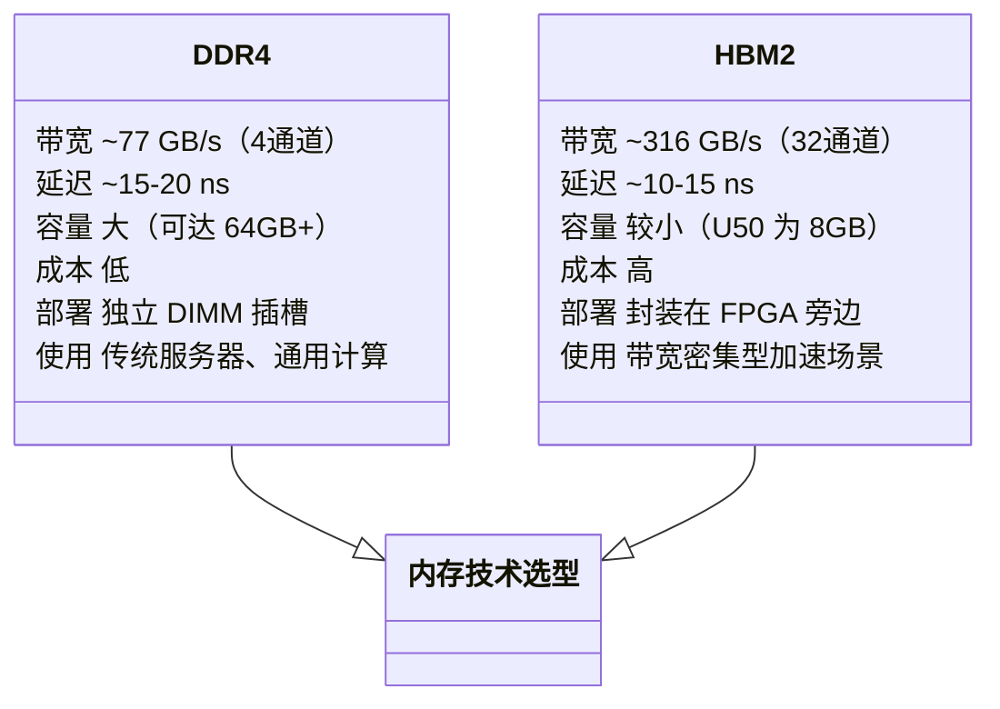

**图示说明**：HBM2 的关键优势是带宽——约为 DDR4 的 4 倍。这是因为 HBM2 把多个 DRAM 芯粒直接堆叠在 FPGA 旁边，通过数千条并行细线连接，而不是像 DDR4 那样通过 PCB 走线连接到远处的内存插槽。

### HBM Bank 的编号方式

HBM 的内存被划分成许多小的"伪通道（Pseudo Channel）"，在 `.cfg` 文件里用 `HBM[N]` 来引用。

以 U50（8GB HBM2）为例：

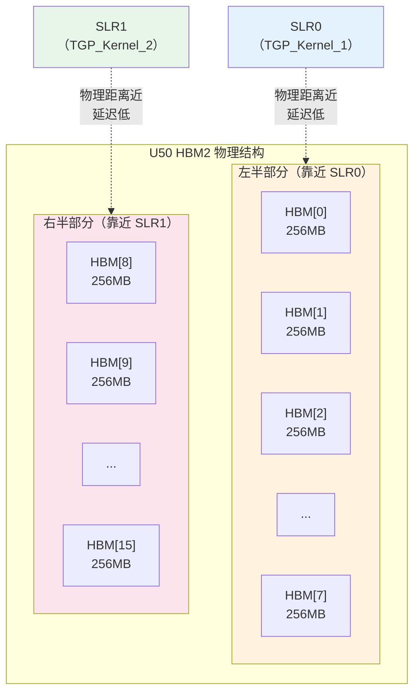

**图示说明**：HBM2 的物理布局和 SLR 的位置是对应的。HBM 左半部分（Bank 0-7）在物理上更靠近 SLR0，右半部分（Bank 8-15）更靠近 SLR1。因此，放置在 SLR0 的内核应该优先访问 HBM[0-7]，而不是 HBM[8-15]。这种"本地性"原则在文本匹配 demo 的配置文件中体现得非常清楚：`TGP_Kernel_1` 在 SLR0，访问 HBM[0-5]；`TGP_Kernel_2` 在 SLR1，访问 HBM[10-15]。

---

## 第五节：完整案例分析——GZIP 解压加速器的接线图

现在把前面学到的四种指令放在一起，看一个完整的设计是如何被"接线"的。

### GZIP 的硬件拓扑全图

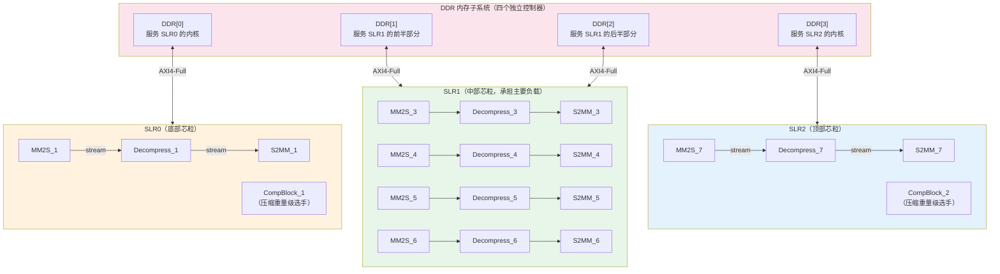

**图示说明**：整张图揭示了一个精心设计的"就近原则"——SLR0 的内核访问 DDR[0]，SLR1 的内核访问 DDR[1] 和 DDR[2]，SLR2 的内核访问 DDR[3]。每条 MM2S→Decompress→S2MM 流水线都被完整地封装在同一个 SLR 内部，没有任何流式连接需要跨越 SLR 边界。这是时序收敛的最优布局。

### 为什么只有 2 个 CompBlock，却有 8 个 Decompress？

这是这张接线图里最有趣的设计决策。

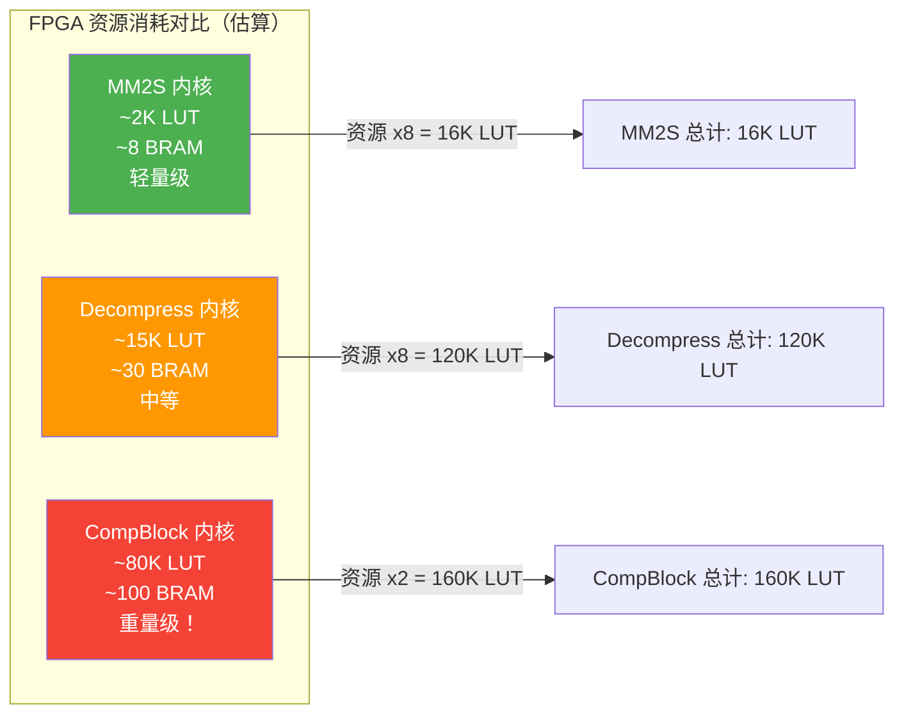

**图示说明**：一个 CompBlock（压缩内核）的资源消耗相当于 4-5 个 Decompress（解压内核）。如果配置 8 个 CompBlock，仅压缩内核就会把整个 FPGA 的 LUT 资源耗尽，其他什么都做不了。这个配置明确地选择了"偏向解压密集型工作负载"——适合处理大量已压缩文件（如数据库、日志、Parquet 文件）的场景。

---

## 第六节：DDR 接线的三种策略与选择

当你设计自己的 `.cfg` 文件时，面对"内核 AXI 端口应该接哪个 DDR Bank"这个问题，通常有三种策略。

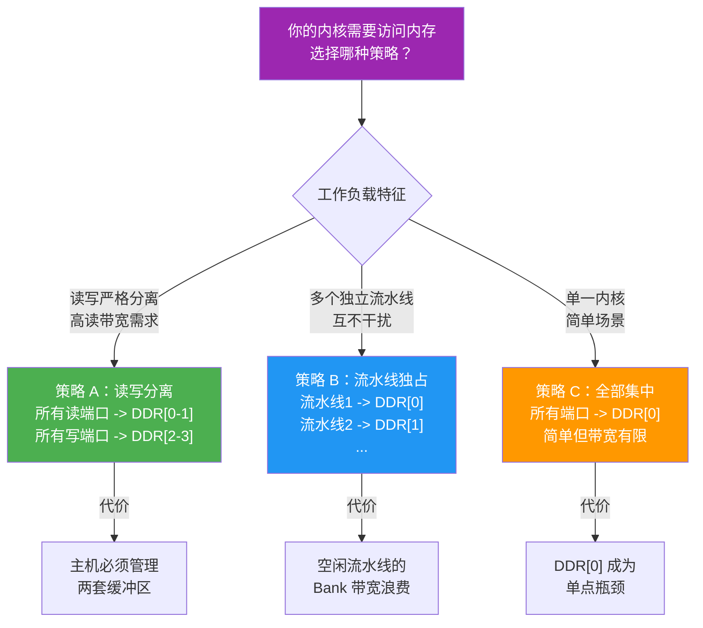

**图示说明**：GZIP 配置采用的是"策略 B——流水线独占"，每条解压流水线独占自己对应的 DDR Bank。这样每条流水线都有独立的内存带宽保证，互不干扰，是多并行流水线场景的最佳选择。

---

## 第七节：跨平台配置差异——U200 vs U280 vs U50

同一个排序内核（SortKernel），在不同平台上的 `.cfg` 文件看起来差别很大。这体现了不同硬件平台的物理约束。

### 三种平台的接线方案对比

```mermaid
graph TD
    subgraph U200_250 ["Alveo U200/U250\nconn_u200.cfg / conn_u250.cfg"]
        A1["sp=SortKernel.m_axi_gmem0:DDR[0]"]
        A2["sp=SortKernel.m_axi_gmem1:DDR[0]"]
        A3["多 SLR，需要 SSI 布局策略"]
        A4["Vivado: SSI_HighUtilSLRs"]
    end

    subgraph U280 ["Alveo U280\nconn_u280.cfg"]
        B1["sp=SortKernel.m_axi_gmem0:DDR[0]"]
        B2["sp=SortKernel.m_axi_gmem1:DDR[0]"]
        B3["HBM 可选，DDR 为主"]
        B4["Vivado: Explore 深度优化"]
    end

    subgraph U50 ["Alveo U50\nconn_u50.cfg"]
        C1["sp=SortKernel.m_axi_gmem0:HBM[0]"]
        C2["sp=SortKernel.m_axi_gmem1:HBM[0]"]
        C3["单 SLR，无跨区延迟"]
        C4["Vivado: 简化参数即可"]
    end

    A1 & A2 & A3 & A4 --> Perf_A["性能：平衡型\n功耗：~225W\n场景：数据中心主力"]
    B1 & B2 & B3 & B4 --> Perf_B["性能：高性能\n功耗：~200W\n场景：内存密集型"]
    C1 & C2 & C3 & C4 --> Perf_C["性能：接近 U280\n功耗：~75W\n场景：边缘部署"]

    style U200_250 fill:#e1f5fe
    style U280 fill:#f3e5f5
    style U50 fill:#e8f5e9
```

**图示说明**：三种平台的配置文件揭示了根本性的硬件差异。U50 是纯 HBM 架构，没有 DDR4，所以所有内存引用都是 `HBM[N]`；而 U200/U250/U280 混合使用 DDR4 和 HBM。U50 是单 SLR 芯片，因此不需要 SSI 跨区域布局策略，Vivado 参数也大幅简化。

### 平台选择的决策树

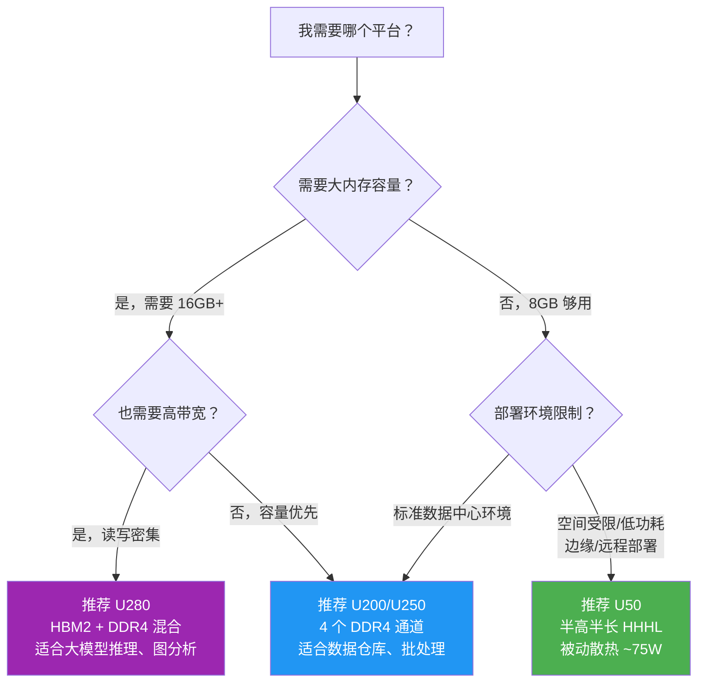

---

## 第八节：时序收敛——接线为什么影响时钟频率

到这里，你可能会问：内存接线和 SLR 放置，怎么会影响内核能跑多高的时钟频率？

### 时序收敛的本质

**时序收敛（Timing Closure）**就是确保每条信号在一个时钟周期内能从出发点走到目的地。时钟频率越高，每个周期时间越短，信号能走的路就越短。

想象一场接力跑：每个运动员（逻辑门）传递接力棒（信号），裁判（时钟）每隔固定时间打一声哨（时钟周期）。如果两个相邻运动员之间的距离太远，裁判打哨时棒子还没传到，就会出现"时序违例（Timing Violation）"。

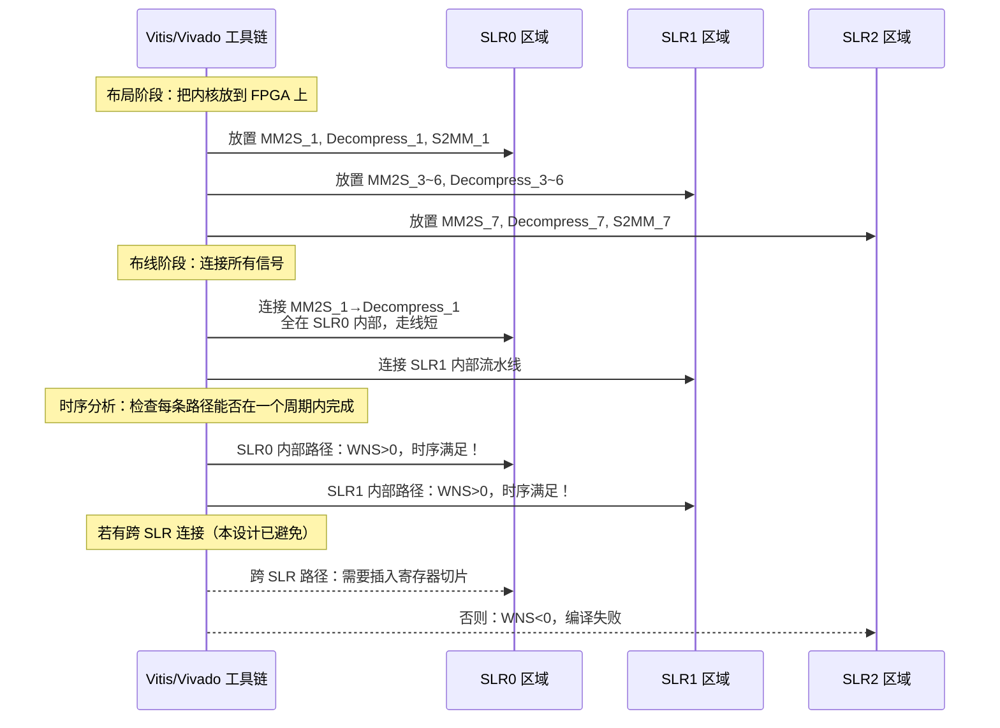

**图示说明**：WNS（Worst Negative Slack，最差负裕量）是时序分析的核心指标。WNS > 0 表示时序满足；WNS < 0 表示某条路径太长，信号来不及在一个周期内到达，设计无法工作。通过把紧密耦合的内核放在同一 SLR，并通过 `slr` 指令告诉工具，可以有效避免跨 SLR 的长路径。

### SLR 放置与时序的关系

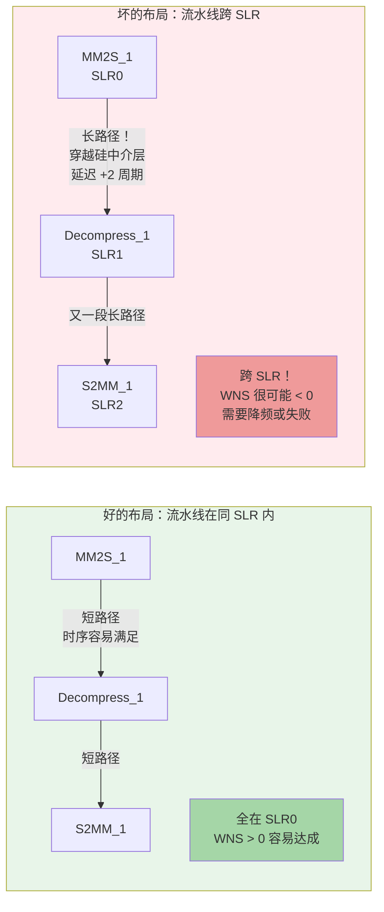

---

## 第九节：动手实践——如何写一个新的 `.cfg` 文件

假设你要在 Alveo U280 上部署一个新的加速器，有 2 个内核实例，每个内核有一个读端口和一个写端口。以下是从零开始写 `.cfg` 的步骤。

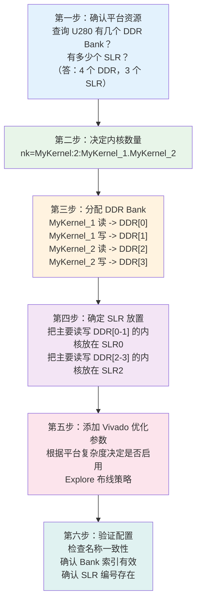

对应的 `.cfg` 文件模板：

```cfg
[connectivity]
# 第二步：实例化内核
nk=MyKernel:2:MyKernel_1.MyKernel_2

# 第三步：分配内存 Bank
sp=MyKernel_1.m_axi_read:DDR[0]
sp=MyKernel_1.m_axi_write:DDR[1]
sp=MyKernel_2.m_axi_read:DDR[2]
sp=MyKernel_2.m_axi_write:DDR[3]

# 第四步：锁定 SLR
slr=MyKernel_1:SLR0
slr=MyKernel_2:SLR2

[vivado]
# 第五步：优化参数（U280 多 SLR 推荐）
param=compiler.addOutputTypes=hw_export
```

---

## 第十节：常见陷阱与调试指南

在写和调试 `.cfg` 文件时，初学者最容易遇到以下三种问题。

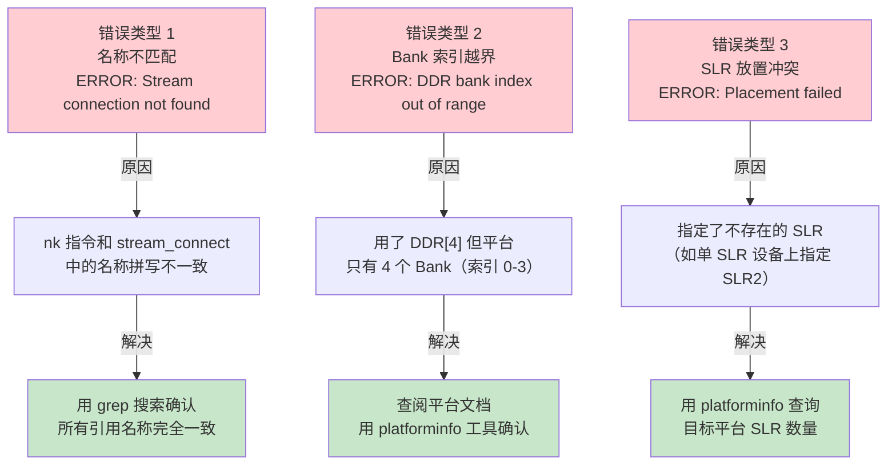

**图示说明**：三种最常见错误都有明确的错误信息和解决路径。在修改配置文件后，最好先用 `platforminfo -p <platform.xpfm>` 确认平台的实际资源数量，再开始编写映射指令。

---

## 本章总结：四条核心接线规则

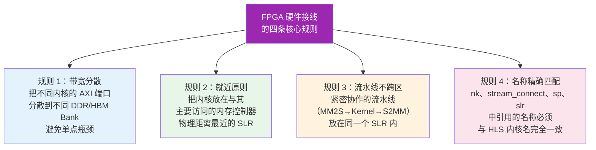

---

## 补充阅读：图分析加速器的 HBM 配置

如果你想看一个更复杂的 HBM 使用案例，可以参考 Louvain 社区检测算法的连接配置（`conn_u50.cfg` 和 `conn_u55c.cfg`）。这些图分析内核的特点是：

- 图数据是**不规则访问模式**（随机读写，而非顺序访问）
- HBM 的 32 个伪通道可以并行服务不同的随机访问请求
- 通过把图的不同分区分配到不同 HBM Bank，可以实现**分区级并行**

这与 GZIP 的顺序流式访问模式形成了鲜明对比——不同的数据访问模式需要不同的内存接线策略，这正是 `.cfg` 文件存在的意义：让你精确控制每一根"电线"的走向，榨干硬件的最后一滴性能。

---

**下一章预告**：现在你已经理解了硬件是如何接线的。但接下来的问题是——如何知道你的接线是否真的发挥了最大性能？第五章将介绍 Vitis Libraries 中使用的性能测量模式：Ping-Pong 双缓冲、OpenCL 事件时间戳，以及如何用基准测试找到真正的瓶颈。