# 第三章：数据如何流动——从 CPU 到 FPGA 再返回的主机-设备管道

> **学习目标：** 追踪单个数据缓冲区的完整生命周期——内存分配、PCIe 传输、内核执行、结果回收——建立一个关于主机代码如何通过 OpenCL/XRT 协调 FPGA 计算的具体心智模型。

---

## 3.1 从一个比喻开始：快递仓库

想象一家超级高效的快递仓库：

- **CPU 主机**就像仓库的**调度员**，负责打包货物、发出指令、接收成品。
- **FPGA**就像仓库里的**专用加工机器**，只做一件事但做得飞快（比如：极速压缩数据）。
- **PCIe 总线**就像连接调度室和加工区的**传送带**，货物（数据）在上面来回流动。
- **内存缓冲区**就像**货物托盘**，数据必须先装上托盘，托盘才能放上传送带。

整个 FPGA 加速的过程，就是：**调度员把货物装箱→传送带运到机器→机器加工→传送带运回→调度员取货**。

本章将把这个过程拆解为每一个具体步骤，让你看清每个字节是怎么走完这段旅程的。

---

## 3.2 大局观：四个阶段的生命周期

一个数据缓冲区从诞生到消亡，经历四个明确的阶段：


- **阶段 1 - 内存分配**：在主机端申请特殊内存，让 FPGA 和 CPU 都能"看到"这块内存。
- **阶段 2 - H2D 传输（Host to Device）**：把数据从主机内存通过 PCIe 传送带搬运到 FPGA 板载内存（HBM/DDR）。
- **阶段 3 - 内核执行**：FPGA 上的专用硬件电路（内核，Kernel）开始真正处理数据。
- **阶段 4 - D2H 回传（Device to Host）**：把处理好的结果通过 PCIe 传送带搬回主机内存，供 CPU 读取。

接下来我们逐一深入每个阶段。

---

## 3.3 阶段 1：内存分配——准备特殊的"托盘"

### 为什么不能用普通的 `malloc`？

你可能会问：我直接用 `new` 申请内存不行吗？**不行**，原因如下：

普通的 `malloc`/`new` 分配的内存，操作系统可以随时把它从物理内存里"换出"到硬盘（虚拟内存机制）。而 PCIe 传输需要数据待在固定的物理地址上，就像快递员必须知道你家的**固定门牌号**，不能是"你今天在哪就送哪"。

因此，我们需要**页锁定内存（Page-Locked Memory / Pinned Memory）**——这块内存被"钉"在物理地址上，操作系统不能把它换出去。

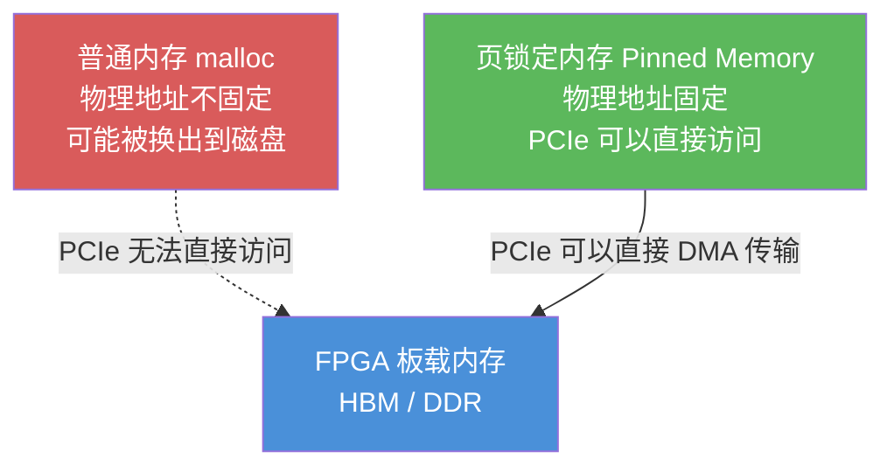

### OpenCL 的 `cl::Buffer`：托盘的标准规格

在 Vitis Libraries 的主机代码中，内存分配通过 OpenCL 的 `cl::Buffer` 完成。你可以把 `cl::Buffer` 想象成**一种标准规格的货物托盘**：它同时被 CPU 调度员和 FPGA 机器"认可"，两边都知道怎么处理这种托盘。

```cpp
// 典型的 OpenCL 缓冲区分配
cl::Buffer buffer_input(
    context,                           // OpenCL 上下文（谁的地盘）
    CL_MEM_READ_ONLY | CL_MEM_USE_HOST_PTR,  // 标志：只读，用主机指针
    data_size,                         // 数据大小（字节）
    host_ptr                           // 主机内存指针
);
```

来自 `gzip_host_library_core` 的实际代码使用了更复杂的内存分配，配合 `memoryManager`（内存管理器）进行缓冲区池化管理：

```cpp
// gzip_host_library_core 的缓冲区创建（概念简化版）
// memoryManager 维护 freeBuffers 和 busyBuffers 两个队列
// 优先从空闲队列回收，避免反复分配和销毁
buffer* buf = memoryManager.createBuffer(data_size);
```

### Xilinx 特有：`aligned_allocator` 和内存对齐

Xilinx FPGA 对内存对齐有严格要求——数据必须从特定字节边界开始（通常是 4096 字节）。这就像装货集装箱时，货物必须摆放整齐，不能斜着放。

```cpp
// Vitis Libraries 提供的对齐内存分配器
#include "xcl2.hpp"
std::vector<int, aligned_allocator<int>> source_input(data_size);
```

`aligned_allocator` 确保分配的内存起始地址是 4096 字节的整数倍，HBM（高带宽内存）访问才能达到最优吞吐量。

---

## 3.4 阶段 2：H2D 传输——数据上传到 FPGA

### 两种传输方式：搬货 vs 直达

Vitis Libraries 支持两种主机-设备内存交互模式，就像两种不同的快递方式：

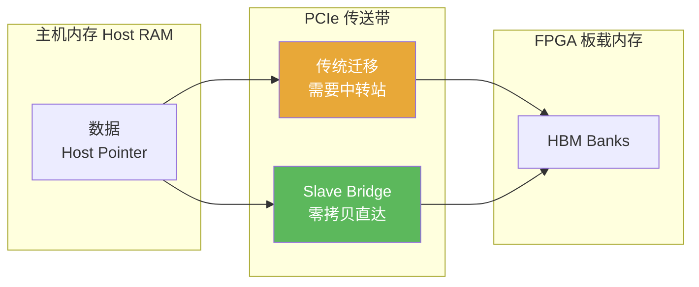

**方式一：传统缓冲区迁移（普通快递）**

数据从主机 RAM 复制到 FPGA 的 HBM，中间需要一次显式的"迁移"调用：

```cpp
// 把数据从主机搬到设备（H2D）
queue.enqueueMigrateMemObjects(
    {buffer_input},                    // 要搬的缓冲区列表
    0,                                 // 0 = 方向从主机到设备
    nullptr,                           // 等待这些事件完成后再传
    &event_h2d                         // 完成后记录到这个事件
);
```

**方式二：Slave Bridge（零拷贝直达快递）**

FPGA 直接通过 PCIe "看到"主机内存，无需中间复制，延迟降低 5-10 倍：

```cpp
// Slave Bridge 模式：FPGA 直接访问主机内存
cl_mem_ext_ptr_t ext_ptr;
ext_ptr.flags = XCL_MEM_EXT_HOST_ONLY;  // 标记为主机端专用
ext_ptr.obj = nullptr;
ext_ptr.param = 0;

cl::Buffer buffer_slave(
    context,
    CL_MEM_READ_WRITE | CL_MEM_EXT_PTR_XILINX,
    data_size,
    &ext_ptr
);
// 通过 enqueueMapBuffer 获取可写的主机指针
void* host_ptr = queue.enqueueMapBuffer(buffer_slave, CL_TRUE, 
                                         CL_MAP_WRITE, 0, data_size);
```

来自 `gzip_ocl_host` 的代码通过 `isSlaveBridge()` 方法在运行时自动选择合适的模式，对上层调用者完全透明。

### OpenCL 事件：传送带的"收据系统"

每次数据传输和内核启动都会返回一个 `cl::Event`（事件对象），就像快递公司给你的**快递单号**。你可以用这个号码查询状态，或者告诉 FPGA "等这个事件完成了再开始下一步"。

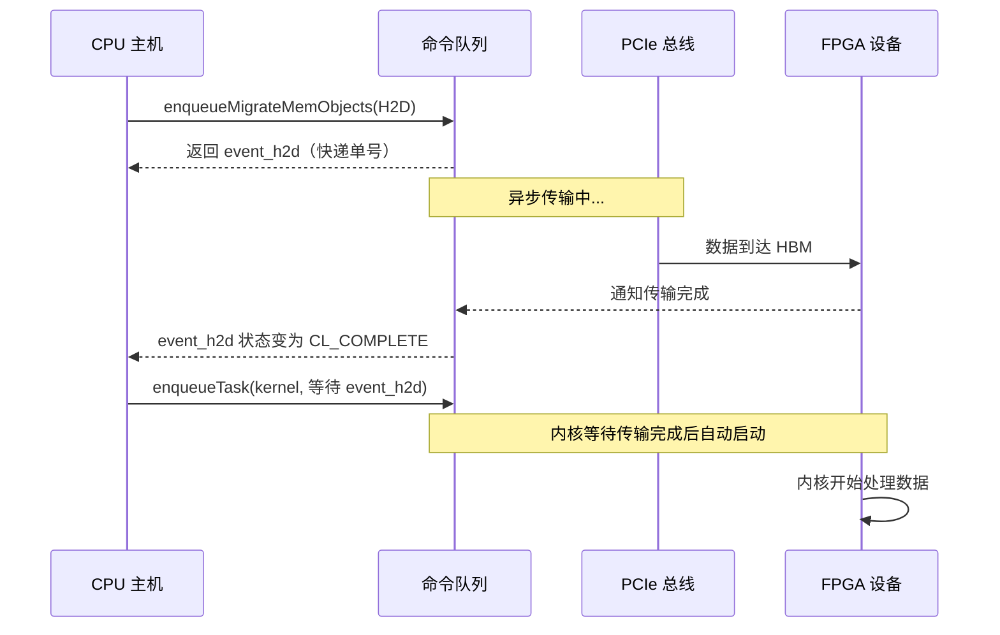

这张图展示了 OpenCL 的核心特性：**所有操作都是异步的，通过事件链串联**。CPU 提交命令后立刻继续执行，不需要干等。

---

## 3.5 阶段 3：内核执行——FPGA 专用电路开始运转

### 什么是内核（Kernel）？

FPGA 内核（Kernel）不是操作系统的"内核"，而是**烧录在 FPGA 上的专用硬件电路**，专门执行某一类计算任务。

把它想象成：工厂里**专门为某种产品设计的模具**。这个模具只能做一种产品，但速度极快，精度极高，而且可以同时开多条生产线。

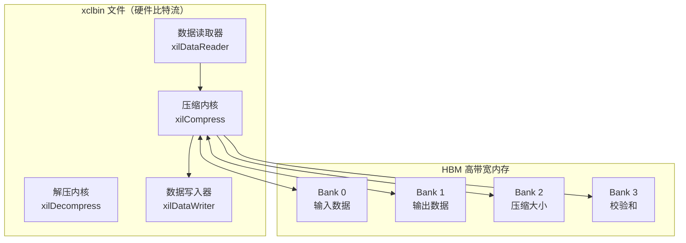

### 加载 xclbin：给机器安装"程序"

在执行前，必须把 FPGA 的"硬件程序"（xclbin 文件）加载到设备上。xclbin 就像 FPGA 的**可执行文件**，包含了所有内核的硬件描述：

```cpp
// 加载 xclbin 文件
std::string xclbin_path = "gzip.xclbin";
cl::Program::Binaries bins = xcl::import_binary_file(xclbin_path);
cl::Program program(context, {device}, bins);

// 从程序中提取内核（像从工厂里找到对应的机器）
cl::Kernel kernel_compress(program, "xilCompressStream");
```

来自 `gzip_ocl_host` 模块的初始化代码完整演示了这个过程：

```cpp
void gzipOCLHost::init(const std::string& binaryFileName) {
    // 1. 找到 Xilinx 平台（工厂在哪）
    cl_int err;
    std::vector<cl::Platform> platforms;
    cl::Platform::get(&platforms);
    
    // 2. 找到加速器设备（找到机器）
    std::vector<cl::Device> devices;
    platforms[0].getDevices(CL_DEVICE_TYPE_ACCELERATOR, &devices);
    m_device = devices[0];
    
    // 3. 创建上下文（签合同，建立管理关系）
    m_context = cl::Context(m_device, nullptr, nullptr, nullptr, &err);
    
    // 4. 创建命令队列（传送带）
    m_q = cl::CommandQueue(m_context, m_device, 
                           CL_QUEUE_OUT_OF_ORDER_EXEC_MODE_ENABLE |
                           CL_QUEUE_PROFILING_ENABLE, &err);
    
    // 5. 加载并编译程序（安装模具）
    auto fileBuf = xcl::read_binary_file(binaryFileName);
    cl::Program::Binaries bins{{fileBuf.data(), fileBuf.size()}};
    m_program = cl::Program(m_context, {m_device}, bins, nullptr, &err);
}
```

### 设置内核参数：告诉机器处理什么

内核就像一个函数，调用前需要传参数：

```cpp
// 设置内核参数（告诉压缩内核：输入在哪，输出放哪，数据多大）
int arg_idx = 0;
kernel_compress.setArg(arg_idx++, buffer_input);    // 输入缓冲区
kernel_compress.setArg(arg_idx++, buffer_output);   // 输出缓冲区
kernel_compress.setArg(arg_idx++, buffer_size_info); // 压缩后大小的存放位置
kernel_compress.setArg(arg_idx++, buffer_checksum);  // 校验和存放位置
kernel_compress.setArg(arg_idx++, (uint32_t)input_size); // 输入数据大小

// 启动内核（按下机器的开始按钮）
queue.enqueueTask(kernel_compress, &wait_events, &event_kernel);
```

注意 `enqueueTask` 的第二个参数 `&wait_events`：**内核会等到 H2D 传输完成后才真正启动**，这是事件链机制的精妙之处。

---

## 3.6 阶段 4：D2H 回传——结果从 FPGA 返回

内核执行完毕后，结果还在 FPGA 的 HBM 里。我们需要把它"传送带运回"主机内存：

```cpp
// 把结果从设备搬回主机（D2H）
std::vector<cl::Event> kernel_done_events = {event_kernel};

queue.enqueueMigrateMemObjects(
    {buffer_output, buffer_size_info, buffer_checksum}, // 要取回的缓冲区
    CL_MIGRATE_MEM_OBJECT_HOST,          // 方向：从设备到主机
    &kernel_done_events,                 // 等待内核完成后再取
    &event_d2h                           // 完成后记录到这个事件
);

// 等待所有操作完成（阻塞直到数据到手）
queue.finish();

// 现在可以安全读取结果了
uint32_t compressed_size = *(uint32_t*)buffer_size_info.map_ptr;
```

---

## 3.7 完整流程：一次 gzip 压缩的生命周期

现在把四个阶段串起来，追踪一个 10MB 文件被压缩的完整旅程：

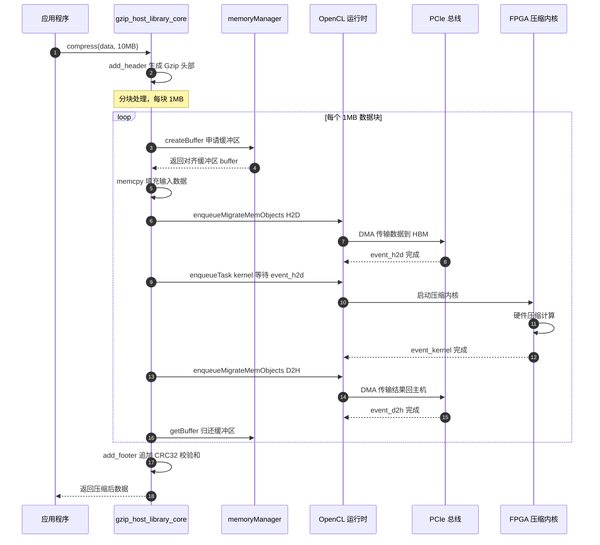

这张时序图展示了关键细节：**每个数据块的 H2D 传输、内核执行、D2H 回传是串行依赖的**（通过事件链保证顺序），但不同数据块之间可以**重叠流水**（下一章会深入讲解）。

---

## 3.8 深入理解：命令队列——异步世界的交通管理员

### 什么是命令队列？

OpenCL 命令队列（`cl::CommandQueue`）是主机与 FPGA 通信的**核心调度机制**。想象它是快递公司的**调度中心**：你把任务（命令）扔进去，调度中心负责安排执行顺序，你不需要一直盯着。

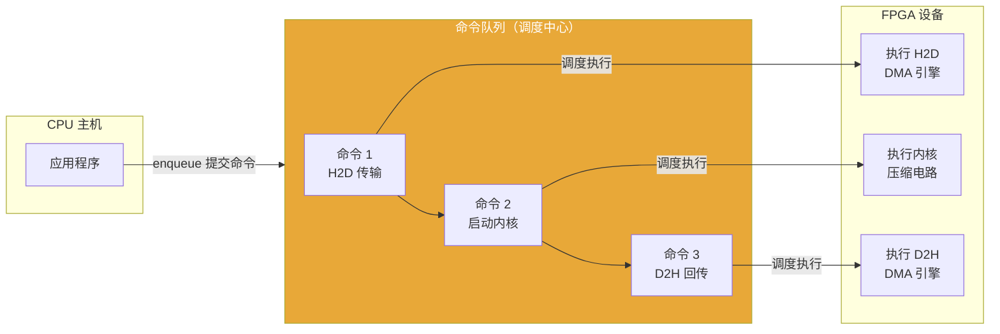

### 顺序队列 vs 乱序队列

Vitis Libraries 中常见两种命令队列配置：

| 队列类型 | 标志 | 类比 | 适用场景 |
|---------|------|------|---------|
| **顺序队列** | 默认（无特殊标志） | 单车道公路，先来先到 | 简单、调试友好 |
| **乱序队列** | `CL_QUEUE_OUT_OF_ORDER_EXEC_MODE_ENABLE` | 多车道高速公路，按依赖关系并行 | 高性能、Overlap 模式 |

`gzip_ocl_host` 使用的是乱序队列（`CL_QUEUE_OUT_OF_ORDER_EXEC_MODE_ENABLE`），配合事件依赖关系实现最大并行度。

---

## 3.9 内存管理器：缓冲区池的艺术

`gzip_host_library_core` 中的 `memoryManager` 是一个典型的**对象池（Object Pool）模式**实现。

想象你在机场行李传送带旁：与其每次都去商店买新行李箱（`new cl::Buffer`），不如租用机场的标准行李箱（从池子里取），用完归还（放回池子），下次直接再取。

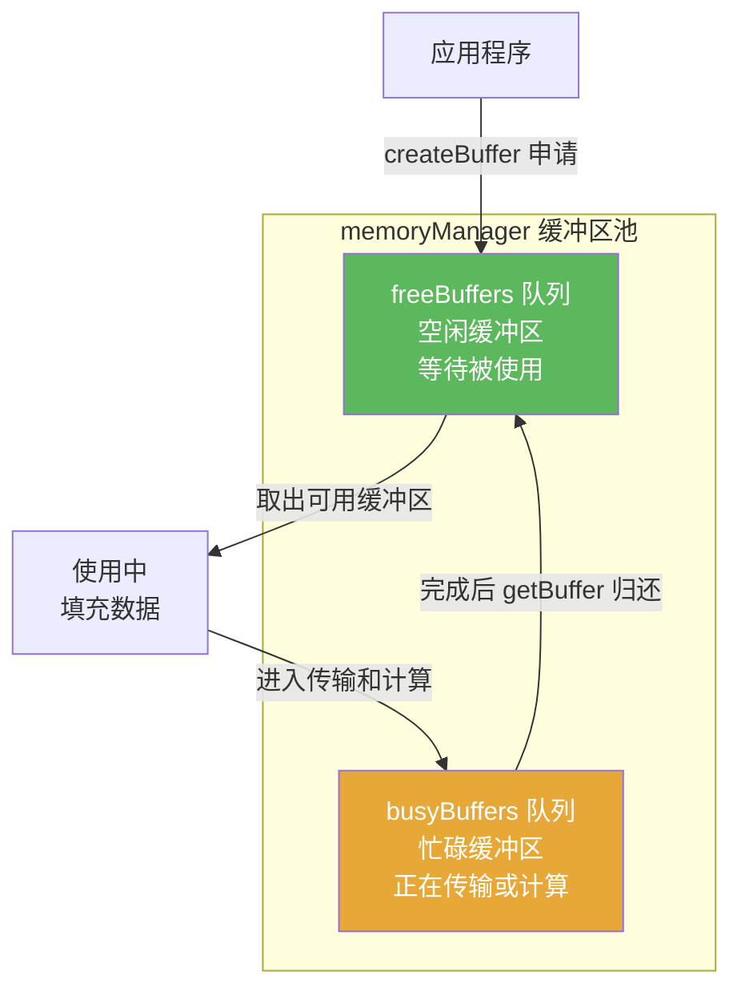

这个设计的核心价值：**避免了反复申请和释放 `cl::Buffer` 的开销**（每次 `cl::Buffer` 的创建都需要与 XRT 运行时交互，代价高昂），同时通过 `busyBuffers` 跟踪每个缓冲区的状态，确保不会在缓冲区还在 DMA 传输途中时就被覆盖写入。

### HBM Bank 随机化：分散热点的小技巧

在使用 HBM（高带宽内存）时，`memoryManager` 的 `getBuffer` 方法会**随机选择 0-31 号 Bank**：

```cpp
// gzip_ocl_host 内部实现（简化版）
std::uniform_int_distribution<int> dist(0, 31);
int bank_id = dist(random_engine);  // 随机选 Bank
```

这就像超市开了 32 个收银台，顾客随机排队，而不是所有人挤一个收银台。随机分配避免了单个 HBM Bank 成为带宽瓶颈。

---

## 3.10 数据格式转换：`data_mover_runtime` 的角色

在某些场景下，数据在进入 FPGA 之前还需要经历**格式转换**。`data_mover_runtime` 模块就是专门做这件事的工具。

### 问题：FPGA 说"我不认识你的数据"

FPGA 内核通常期望接收**固定宽度的 AXI 流数据**，以十六进制比特流的形式打包。但来自外部的数据往往是文本格式（CSV、浮点数文件等）。

这就好比：你有一份以英语写的合同，但 FPGA 机器只认识二进制摩尔斯电码。`data_mover_runtime` 就是这个**翻译官**。

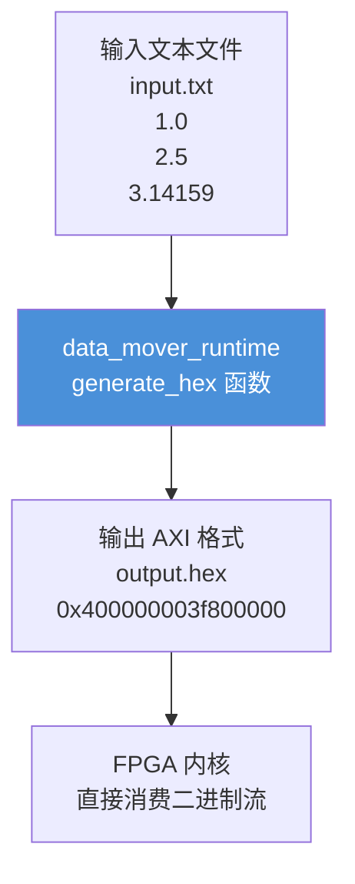

### 核心转换机制

`generate_hex<T>()` 函数是模块的心脏，它做了三件关键的事：


**步骤 1：读取文本**

用 C++ 的 `>>` 操作符把文本解析成对应的 C++ 类型（`float`、`double`、`int32_t` 等）。特殊的是 `half`（16 位浮点），标准库不支持直接解析，所以先读成 `float` 再转换：

```cpp
// read_type<T> 的魔法：half 类型特殊处理
template <> struct read_type<half> { typedef float type; };

typename read_type<T>::type tmp;
fin >> tmp;        // 如果 T=half，实际读的是 float
vec[i++] = tmp;    // 这里做 float→half 的精度转换
```

**步骤 2：位提取（最关键的一步）**

`get_bits()` 函数不做任何计算，只是"重新解释"那些比特是什么：

```cpp
// 1.0f 在 IEEE-754 中的位模式是 0x3F800000
// get_bits 就是把浮点数的"外衣"扒掉，只看底层比特
uint32_t get_bits(float v) {
    union { float f; uint32_t u; } u;
    u.f = v;
    return u.u;  // 0x3F800000
}
```

这就像把一个写着"1.0"的信封拆开，取出里面的密文（`0x3F800000`），直接交给 FPGA。

**步骤 3：打包成 AXI 宽度**

多个数值被打包成一个宽数据字（如 128 位 = 4 个 32 位 float）：

```
输入: vec[0]=1.0, vec[1]=2.0, vec[2]=3.14, vec[3]=1.618

输出（大端，高位在前）:
"0x{vec[3]bits}{vec[2]bits}{vec[1]bits}{vec[0]bits}"
= "0x3fcf1aa740490fd94000000040490fd9"...
```

---

## 3.11 AIE 数据搬运：另一种范式

对于搭载 AI Engine（AIE）阵列的 Versal 平台，数据流动还有第三种模式——通过 `aie_data_mover_configuration` 模块实现的**分块-搬运**（Tiling）模式。

### 为什么需要分块？

AIE 本地内存只有几十 KB，但要处理的图像可能有几十 MB。这就好比：你的办公桌（AIE 内存）只放得下 5 份文件，但你需要处理 1000 份文件。

解决方案是**分批处理**：每次从仓库（DDR）取 5 份，处理完放回去，再取下 5 份。

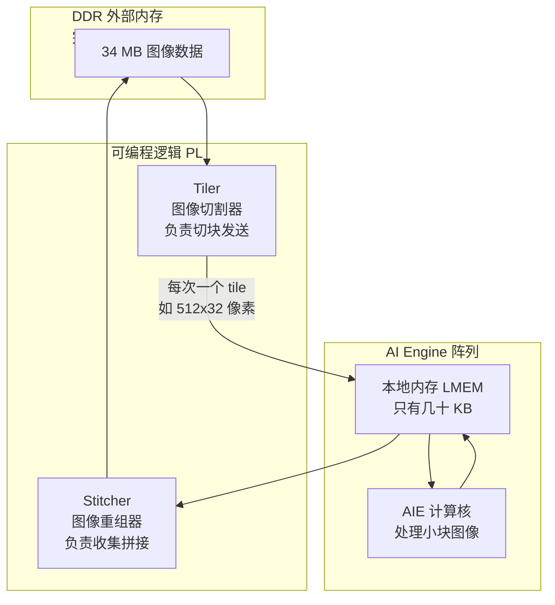

### `xfcvDataMoverParams`：配置切块参数

主机代码通过 `xfcvDataMoverParams` 配置切块尺寸，就像在便利贴上写清楚"每次取多大一块"：

```cpp
// 配置输入和输出图像尺寸
xF::xfcvDataMoverParams params(
    cv::Size(3840, 2160),   // 输入：4K 图像
    cv::Size(3840, 2160)    // 输出：同尺寸（无缩放）
);

// 如果输出尺寸不同（如缩放操作）
xF::xfcvDataMoverParams resize_params(
    cv::Size(3840, 2160),   // 输入：4K
    cv::Size(1920, 1080)    // 输出：1080P（缩小一半）
);
```

而 `EmulAxiData<BITWIDTH>` 则在编译时确定 AXI 总线宽度（如 512 位），确保每次搬运的数据都符合硬件接口规格：

```cpp
// 512 位 AXI 总线的数据容器（在编译时确定大小，零开销）
EmulAxiData<512> axi_data(pixel_value);
// 等价于：char data[64] 的原始字节，但带有类型安全的访问接口
```

---

## 3.12 两种执行模式：顺序 vs 流水线重叠

`gzip_host_library_core` 提供了两种执行模式，代表了性能优化的两种哲学：

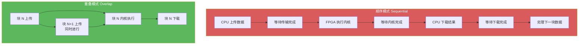

**顺序模式**：就像流水线停摆——机器处理时，传送带停着；传送带运行时，机器闲着。实现简单，适合调试。

**重叠模式（Overlap）**：就像真正的工厂流水线——上一个零件还在机器里加工，下一个零件已经在传送带上了，机器永不空闲。这是生产环境的首选，吞吐量提升 2-5 倍。

重叠模式的实现依赖三重缓冲（Triple Buffering）：至少 3 个缓冲区轮换使用，确保"当前在传输的"、"当前在计算的"、"当前在回传的"互不干扰。

---

## 3.13 完整的类关系图：各组件如何协作

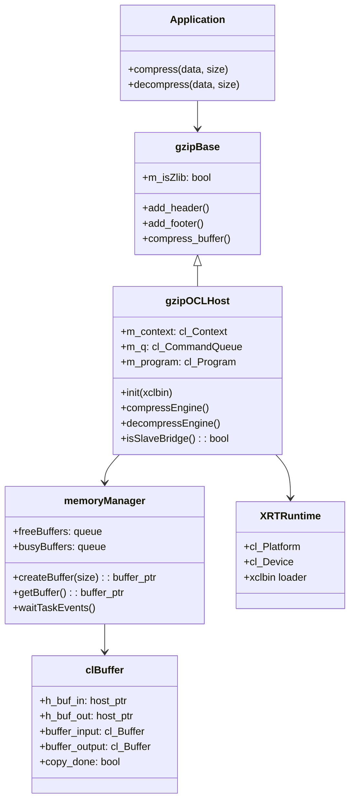

这张类图展示了层次关系：`gzipBase` 负责 Gzip/Zlib 协议，`gzipOCLHost` 继承它并增加 FPGA 控制能力，`memoryManager` 提供高效的缓冲区池服务，最终都落地到 `cl::Buffer` 这个 OpenCL 标准对象上。

---

## 3.14 常见陷阱与调试指南

### 陷阱 1：Slave Bridge 的"先 Map 后写"顺序

**错误做法**（数据根本不会到达设备）：
```cpp
buffer = createBuffer(size);
memcpy(buffer->h_buf_in, data, size);  // 错！h_buf_in 还是野指针！
```

**正确做法**（enqueueMapBuffer 之后指针才有效）：
```cpp
buffer = createBuffer(size);  // 内部已调用 enqueueMapBuffer
// 现在 buffer->h_buf_in 是由 XRT 分配的合法主机指针
memcpy(buffer->h_buf_in, data, size);  // 正确
```

### 陷阱 2：数据对齐的隐形杀手

HBM 访问要求 4096 字节对齐，如果你的数据不对齐，不会有报错，但性能会急剧下降：

```cpp
// 错误：普通 vector，地址可能不对齐
std::vector<int> data(1024);

// 正确：使用 aligned_allocator
std::vector<int, aligned_allocator<int>> data(1024);
```

### 陷阱 3：在缓冲区还在传输时修改它

```cpp
// 提交了 H2D 传输
queue.enqueueMigrateMemObjects({buffer_input}, 0);

// 错误！传输可能还在进行，此时修改数据会导致数据损坏
memcpy(host_ptr, new_data, size);  // 不要在 queue.finish() 之前做！

// 正确：先等待完成
queue.finish();  // 或者用事件等待
```

### 陷阱 4：data_mover_runtime 的位宽对齐约束

```cpp
// 错误：float 是 32 位，128 位输出宽度是合法的（128/32=4，整除）
generate_hex<float>(input, output, 128, 1000);  // 正确

// 错误：48 位不是 32 的整数倍，assert 失败
generate_hex<float>(input, output, 48, 1000);  // 断言失败！
```

---

## 3.15 小结：数据流的完整心智模型

让我们用一张终极图把本章所有内容串联起来：

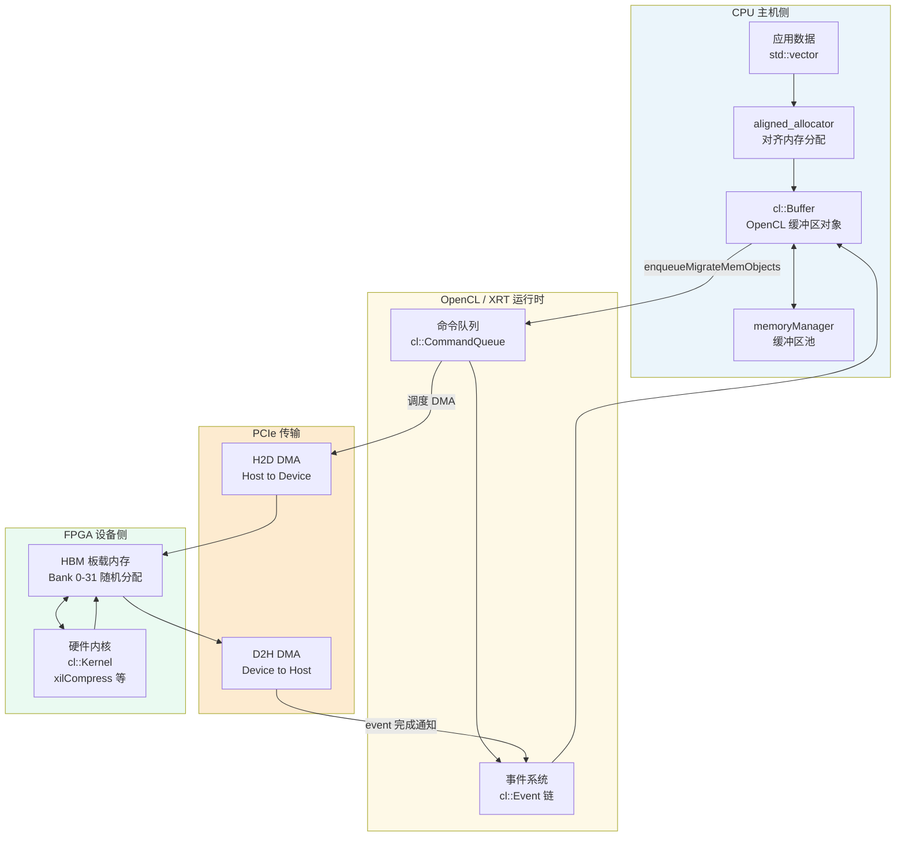

**关键记忆点：**

1. **内存分配** = 准备"特殊托盘"（对齐的 `cl::Buffer`）
2. **H2D 传输** = 通过 PCIe 传送带把货物（数据）运到 FPGA
3. **内核执行** = FPGA 上的专用电路进行高速处理
4. **D2H 回传** = 通过传送带把成品运回 CPU
5. **事件链** = 保证步骤顺序的"快递单号"系统
6. **命令队列** = 异步调度中心，CPU 提交后无需等待

理解了这个流程，你就掌握了 Vitis Libraries 中所有加速应用的基本运转方式——无论是 gzip 压缩、图像处理、还是数据库查询，底层的数据流动模式都是这四个阶段的组合与变体。

---

## 3.16 深入阅读

- **第 4 章**将深入讲解硬件连接配置（`.cfg` 文件），揭示如何把内核的 AXI 端口连接到具体的 HBM Bank 上。
- **第 5 章**将介绍 Ping-Pong 双缓冲和性能测量，告诉你如何量化本章所描述的传输和计算时间。
- **`gzip_host_library_core` 源码**是本章所有概念的最佳实践参考，建议配合本章重读其 `compressEngine` 和 `decompressEngine` 函数。