# 第三章：数据如何流动——主机-内核流水线与 OpenCL 运行时

> **本章学习目标：** 追踪数据从 CPU 主机内存出发，穿越 PCIe 总线和 DMA 引擎，进入 FPGA 内核，再返回主机的完整旅程。沿途你将认识 OpenCL 缓冲区、命令队列、乒乓缓冲，以及计时测量的方法。

---

## 3.1 大局观：为什么数据搬运是个难题？

想象你在一家大型餐厅工作。厨房（FPGA）里有一位超级厨师，能同时炒十道菜；但食材仓库（CPU 内存）在楼上，每次取货都要走一段楼梯（PCIe 总线）。如果厨师每炒完一道菜才去取下一批食材，楼梯就成了瓶颈——厨师大部分时间都在等待，而不是在炒菜。

这就是 FPGA 加速系统面临的核心挑战：**计算速度远快于数据搬运速度**。本章要学的，就是如何让"取货"和"炒菜"同时进行，让厨师永远不闲着。

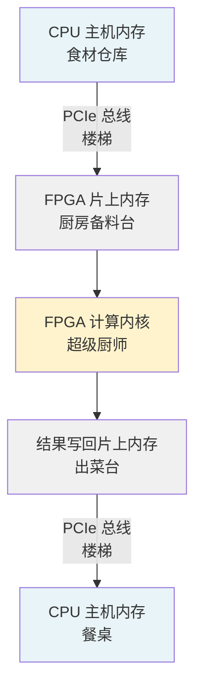

这张图展示了数据的完整旅程：从 CPU 内存出发，经过 PCIe 总线到达 FPGA 片上内存，再由计算内核处理，最后原路返回。每一段都有代价，我们的目标是让这些代价尽量重叠、互相隐藏。

---

## 3.2 OpenCL：FPGA 加速的"通用语言"

在深入数据流之前，我们需要认识一个关键角色：**OpenCL（Open Computing Language）**。

把 OpenCL 想象成一个**翻译官**。你的 C++ 程序说的是"CPU 语言"，FPGA 说的是"硬件语言"，OpenCL 站在中间，把你的指令翻译成 FPGA 能理解的操作。它定义了一套标准词汇：

- **Context（上下文）**：整个加速系统的"工作空间"，包含设备、内存、程序等所有资源
- **CommandQueue（命令队列）**：你向 FPGA 发送指令的"传送带"，指令按顺序（或乱序）执行
- **Buffer（缓冲区）**：在主机和设备之间共享的"货箱"，数据装在里面传输
- **Kernel（内核）**：运行在 FPGA 上的"程序单元"，就是真正干活的那个函数

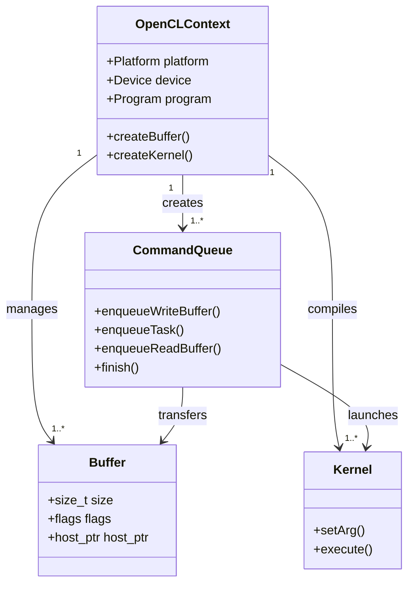

这张类图展示了 OpenCL 各组件的关系：Context 是总管，它创建并管理 CommandQueue、Buffer 和 Kernel。CommandQueue 负责实际的数据传输和内核启动。

---

## 3.3 数据旅程第一站：OpenCL 缓冲区的创建

数据上路之前，需要先准备好"货箱"——OpenCL Buffer。

想象你要寄一个包裹：你需要先找一个合适的箱子（分配内存），把东西装进去（填充数据），然后贴上地址标签（告诉系统这个箱子要去哪里）。OpenCL Buffer 就是这个箱子。

在 gzip 压缩加速库的代码中，缓冲区创建是这样工作的：

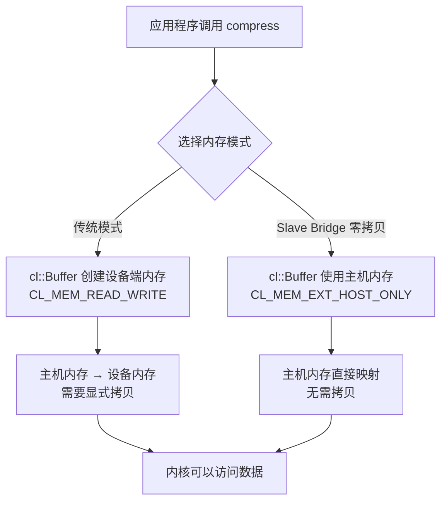

**传统模式**就像快递：你把东西装箱，快递员（DMA 引擎）把箱子从你家（主机内存）搬到目的地（FPGA 片上内存），然后 FPGA 才能使用。

**Slave Bridge 零拷贝模式**就像外卖员直接来你家取菜：FPGA 通过 PCIe 直接读取主机内存，省去了中间的搬运步骤。这需要特殊的硬件支持（如 Alveo U50/U280），但延迟可以降低 5-10 倍。

---

## 3.4 数据旅程第二站：命令队列与数据迁移

有了货箱，下一步是把货箱送上"传送带"——CommandQueue。

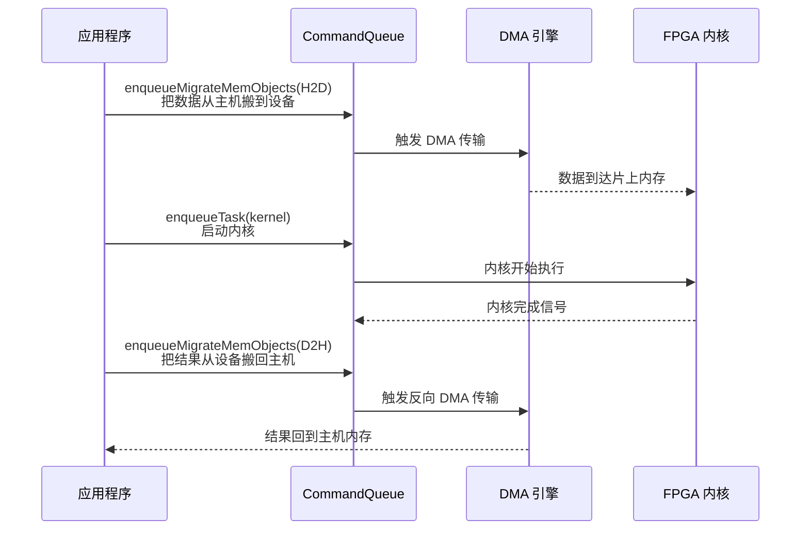

这个时序图展示了一次完整的"顺序执行"流程：先搬数据进去（H2D，Host to Device），再启动内核，等内核跑完，再把结果搬回来（D2H，Device to Host）。

注意这里的关键词：**enqueue（入队）**。你不是直接执行这些操作，而是把它们放进队列，让 OpenCL 运行时按顺序执行。这就像你在超市收银台排队——你把商品放上传送带，收银员（运行时）按顺序处理。

---

## 3.5 数据旅程的核心挑战：顺序执行的浪费

顺序执行有一个致命问题：**FPGA 在等数据时是空闲的，数据在传输时 FPGA 也是空闲的**。

用餐厅的比喻：厨师炒完一道菜，等服务员端走，再等新食材送来，才能开始炒下一道。这中间有大量等待时间。

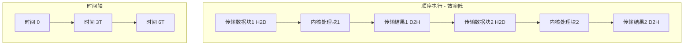

在顺序模式下，处理 N 个数据块需要 3N 个时间单位（每块：传输进 + 计算 + 传输出）。FPGA 的利用率只有 33%。

---

## 3.6 解决方案：乒乓缓冲（Ping-Pong Buffering）

这就是**乒乓缓冲**登场的时刻。

想象一个更聪明的餐厅：有两个备料台（两组缓冲区）。当厨师在用备料台 A 的食材炒菜时，助手已经在往备料台 B 装下一批食材了。厨师炒完 A 的菜，立刻切换到 B，助手再去补充 A。两个台子交替使用，厨师永远不用等待。

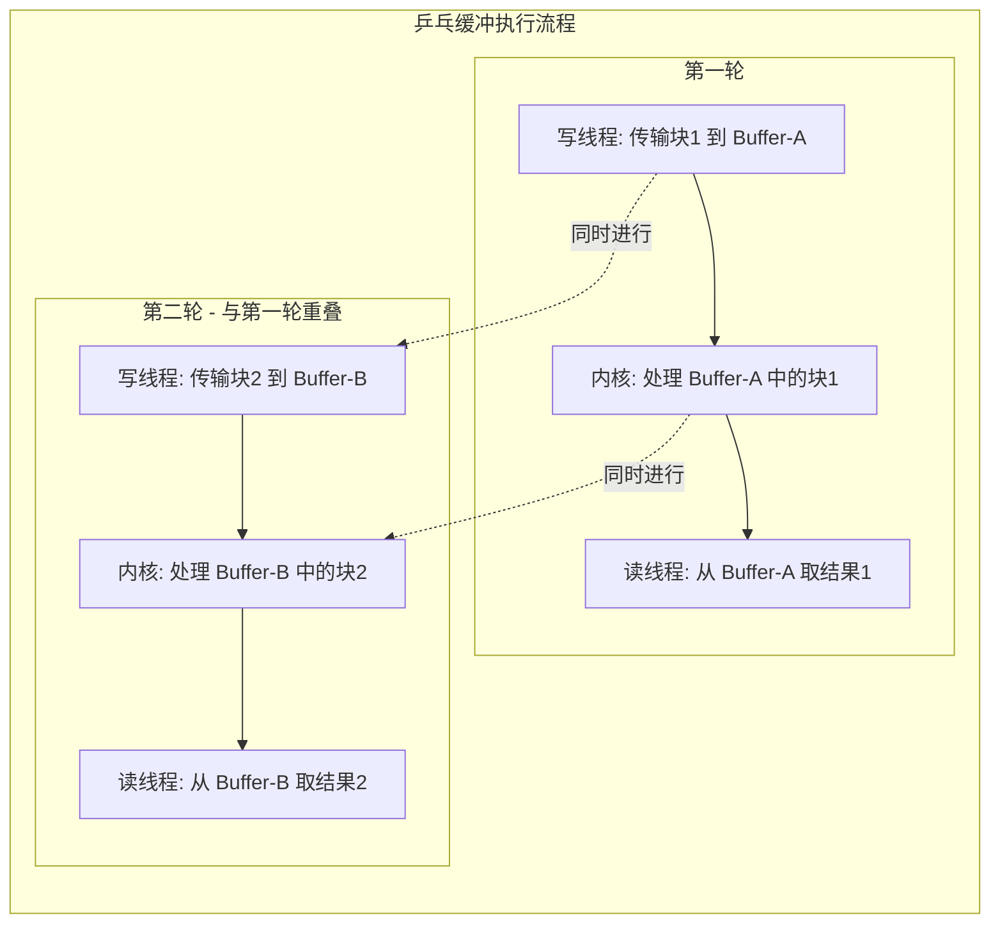

乒乓缓冲的核心思想：**用空间换时间**。多准备一组缓冲区，让数据传输和计算同时进行，互相隐藏延迟。

在 gzip 压缩库中，这个模式被称为 **Overlap 模式**，通过三个独立线程实现：
- **写线程（`_enqueue_writes`）**：持续把新数据送进 FPGA
- **内核线程**：持续处理数据
- **读线程（`_enqueue_reads`）**：持续把结果取回来

---

## 3.7 深入 gzip 压缩库：Overlap 模式的实现

让我们用 gzip 压缩库的真实代码来理解这个流程。

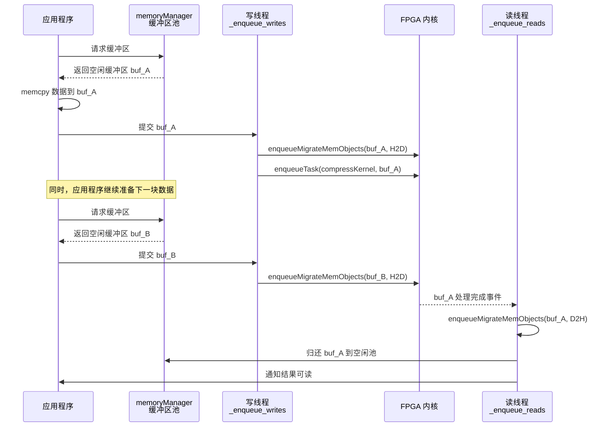

这个时序图展示了 Overlap 模式的精髓：写线程、内核、读线程三者并行工作，通过 `memoryManager` 的缓冲区池协调资源。

### memoryManager：缓冲区池的工作原理

`memoryManager` 就像一个**货箱租赁公司**：

- 维护两个队列：`freeBuffers`（空闲货箱）和 `busyBuffers`（使用中的货箱）
- 当你需要缓冲区时，从 `freeBuffers` 取一个
- 用完后归还到 `freeBuffers`，供下次使用
- 如果空闲队列为空，等待直到有货箱归还

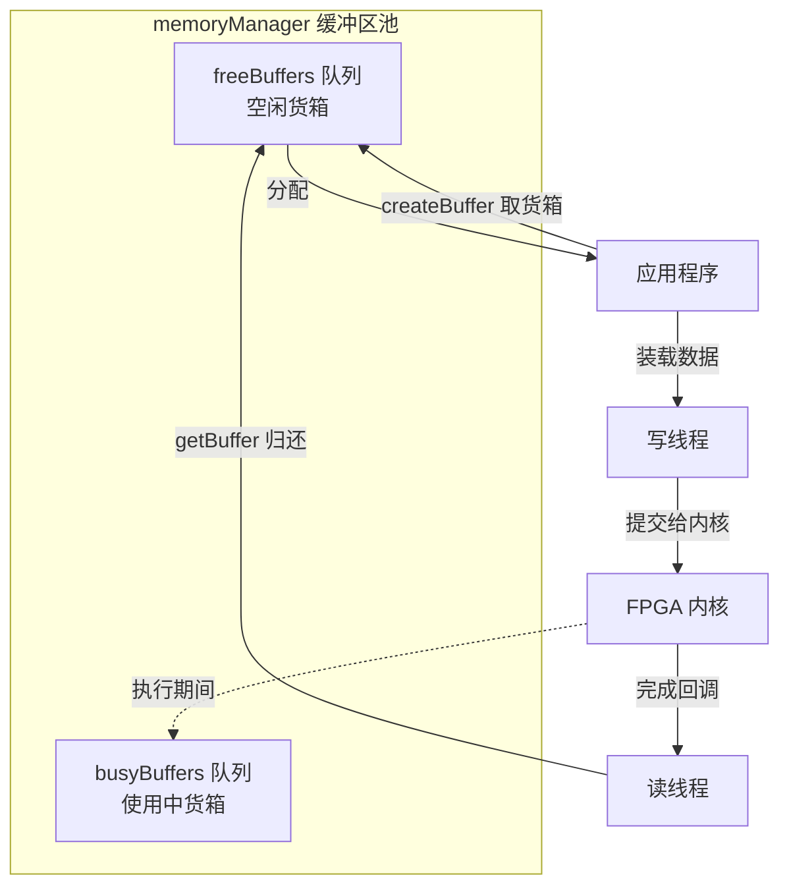

这个设计的妙处在于：缓冲区被**循环复用**，避免了频繁的内存分配和释放，同时通过队列机制自然地实现了流量控制——如果 FPGA 处理速度跟不上，`freeBuffers` 会耗尽，应用程序自动等待，不会把 FPGA 淹没。

---

## 3.8 数据格式转换：data_mover_runtime 的角色

在数据进入 FPGA 之前，还有一个常被忽视的步骤：**格式转换**。

FPGA 内核期望的数据格式往往不是人类友好的文本，而是固定宽度的二进制位流。`data_mover_runtime` 模块就是这个"翻译官"。

想象你要把一份菜谱（文本数据）转换成机器人厨师能读懂的指令码（二进制格式）：

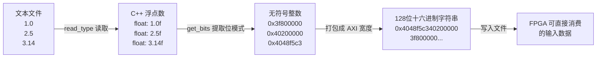

这个流程展示了 `data_mover_runtime` 的核心工作：把人类可读的浮点数文本，转换成 FPGA AXI 总线能直接消费的固定宽度十六进制位流。

### 关键技术：类型双关（Type Punning）

`get_bits()` 函数使用了一个巧妙的技巧——**union 类型双关**：

```cpp
// 把 float 的内存表示直接读作 uint32_t
uint32_t get_bits(float v) {
    union { float f; uint32_t u; } u;
    u.f = v;
    return u.u;  // 同样的 32 位，换一种解读方式
}
```

这就像同一张纸，从正面看是一幅画（浮点数 1.0），从背面看是一串数字（0x3F800000）。内存里的比特没有变，只是换了一种解读方式。

---

## 3.9 完整数据流：从应用到 FPGA 再回来

现在我们把所有环节串联起来，看一次完整的 gzip 压缩请求的生命周期：

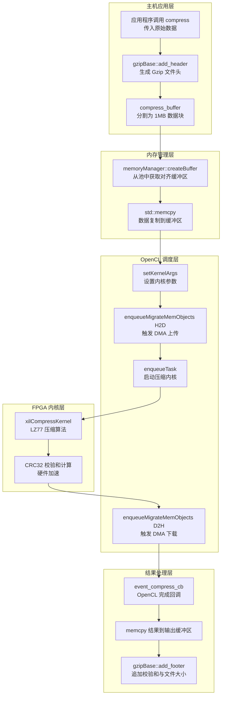

这张流程图展示了数据的完整旅程，分为五个层次：

1. **主机应用层**：接收原始数据，添加 Gzip 格式头部，分割成适合 FPGA 处理的数据块
2. **内存管理层**：从缓冲区池获取对齐内存，把数据复制进去
3. **OpenCL 调度层**：设置内核参数，触发 DMA 传输，启动内核，等待结果
4. **FPGA 内核层**：真正的压缩计算发生在这里，同时计算 CRC32 校验和
5. **结果处理层**：通过回调函数收集结果，追加 Gzip 文件尾部

---

## 3.10 数据库查询中的多线程队列：GQE 的例子

乒乓缓冲的思想不只用于压缩，在数据库查询加速（GQE，General Query Engine）中同样关键。

GQE 的 L3 层使用了更复杂的**多线程队列**架构：

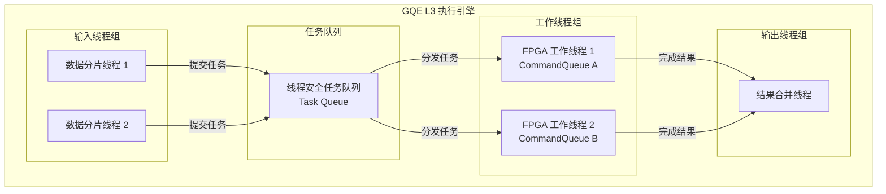

这个架构就像一个**流水线工厂**：输入线程负责把大表切成小片（分片），任务队列负责调度，工作线程各自持有一个 CommandQueue 独立操作 FPGA，输出线程负责把结果拼回来。

多个 CommandQueue 的好处是：每个工作线程可以独立地向 FPGA 发送命令，互不干扰，最大化 FPGA 的利用率。

---

## 3.11 计时测量：如何知道哪里最慢？

优化之前，你需要知道时间花在哪里。Vitis Libraries 提供了两种计时方式：

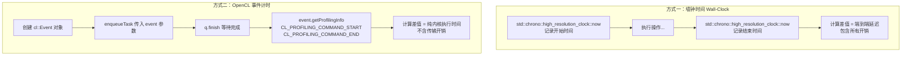

**墙钟时间**就像用秒表计时：从你按下"开始"到按下"停止"，包含了所有的等待、传输、计算时间。适合测量用户感受到的端到端延迟。

**OpenCL 事件计时**就像给内核装了一个精密的内置计时器：只记录内核在 FPGA 上真正运行的时间，排除了数据传输和调度的干扰。适合分析纯计算性能。

在量化金融引擎（如 Hull-White 利率模型）的基准测试中，代码同时使用两种方式：

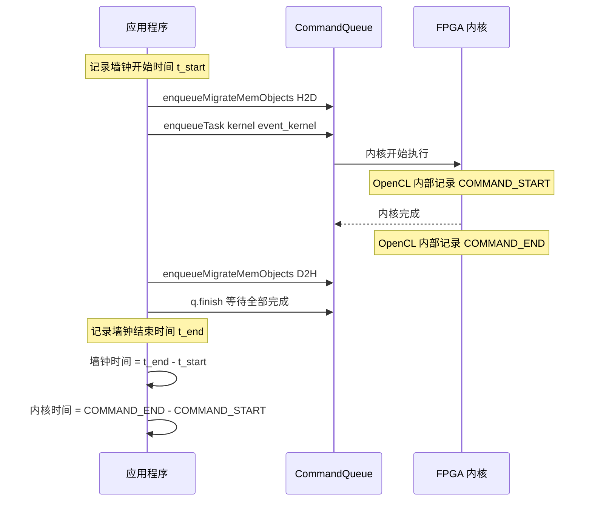

两种时间的差值，就是数据传输和调度的开销。如果这个差值很大，说明 PCIe 传输是瓶颈；如果差值很小，说明计算本身是瓶颈。

---

## 3.12 Slave Bridge：零拷贝的终极优化

对于延迟极度敏感的场景，Vitis Libraries 支持 **Slave Bridge** 模式——让 FPGA 直接读写主机内存，完全跳过 DMA 拷贝。

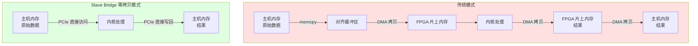

传统模式需要三次数据拷贝（主机→对齐缓冲区→FPGA→FPGA→主机），而 Slave Bridge 模式只需要 FPGA 通过 PCIe 直接访问主机内存，延迟降低 5-10 倍。

代价是：需要特定硬件支持（Alveo U50/U280），且内存必须严格对齐（4KB 边界）。

---

## 3.13 把所有概念串联：一张完整的架构图

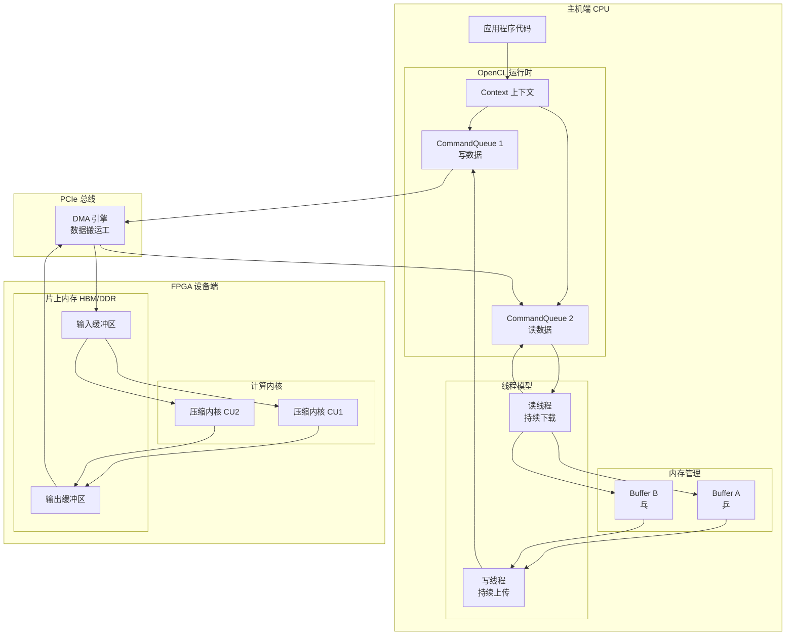

这张完整的架构图展示了所有组件如何协同工作：

- **主机端**：应用程序通过 OpenCL 运行时管理两个 CommandQueue（一个专门写数据，一个专门读数据），配合乒乓缓冲区（Buffer A 和 B）实现流水线
- **PCIe 总线**：DMA 引擎是数据搬运的执行者，负责主机内存和 FPGA 片上内存之间的高速传输
- **FPGA 设备端**：片上内存（HBM/DDR）作为数据暂存区，多个计算单元（CU）并行处理数据

---

## 3.14 常见陷阱与最佳实践

学完了原理，让我们看看实际开发中最容易踩的坑：

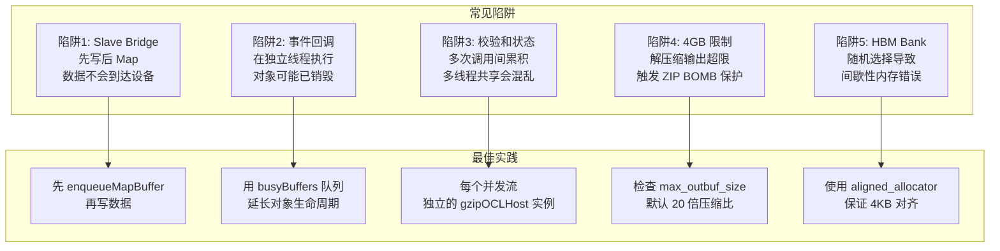

**陷阱 1：Slave Bridge 的"先写后 Map"**

在 Slave Bridge 模式下，你必须先调用 `enqueueMapBuffer` 获取有效的主机指针，再往里写数据。如果你先写数据再 Map，数据不会到达设备——就像你先把东西放进一个还没打开的箱子，当然放不进去。

**陷阱 2：事件回调的生命周期**

OpenCL 的完成回调函数在独立的 OpenCL 线程中执行。如果你的缓冲区对象在回调触发前就被销毁了，回调函数访问的是悬空指针，程序会崩溃。`memoryManager` 通过 `busyBuffers` 队列延长缓冲区的生命周期来解决这个问题。

**陷阱 3：校验和状态的隐式累积**

CRC32/Adler32 校验和在 FPGA 内核中计算，状态在多次调用间累积。如果多个线程共享同一个 `gzipOCLHost` 实例，校验和状态会互相干扰。**每个并发压缩流必须有独立的实例**。

---

## 3.15 本章小结：数据旅程的关键里程碑

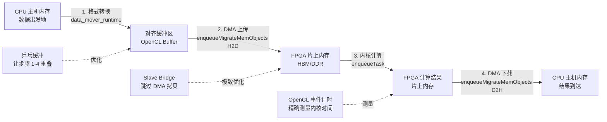

本章我们追踪了数据从 CPU 到 FPGA 再回来的完整旅程，学到了：

1. **OpenCL 是桥梁**：Context、CommandQueue、Buffer、Kernel 四个核心概念构成了主机-设备通信的基础
2. **顺序执行效率低**：数据传输和计算串行进行，FPGA 利用率只有 33%
3. **乒乓缓冲是关键**：用多组缓冲区让传输和计算重叠，FPGA 利用率接近 100%
4. **memoryManager 是协调者**：通过缓冲区池实现资源复用和流量控制
5. **Slave Bridge 是终极优化**：让 FPGA 直接访问主机内存，彻底消除 DMA 拷贝开销
6. **两种计时方式各有用途**：墙钟时间测端到端延迟，OpenCL 事件计时测纯内核性能

下一章，我们将深入硬件连接层，学习如何通过 `.cfg` 配置文件把内核的 AXI 端口映射到物理 HBM/DDR 内存 Bank，理解为什么内存拓扑对性能至关重要。

---

> **动手练习：** 如果你有 Xilinx Alveo 开发板，可以尝试运行 `data_compression/L2/demos/gzip` 目录下的示例，用 `-overlap` 和不加该参数两种模式分别运行，对比吞吐量的差异。你会直观地看到乒乓缓冲带来的性能提升。