# 第二章：库的组织结构——领域、层次与 L1/L2/L3 模式

> **学习目标**：理解代码库如何按领域划分（压缩、图计算、金融等），以及每个领域如何遵循一致的 L1（原语）→ L2（内核）→ L3（编排 API）分层模式。

---

## 2.1 从"一个大箱子"到"有序的货架"

想象你走进一家超大型五金店。如果所有工具——螺丝刀、电钻、油漆刷、管道接头——全都扔在地板中央的一个大堆里，你根本找不到你要的东西。但如果按照**"家具区 → 水电区 → 油漆区"**这样的领域划分，再在每个区域内按工具类型排列，一切就变得井然有序。

Vitis_Libraries 做的事情完全相同。它把几十个 FPGA 加速算法，按照**应用领域**分组，再在每个领域内部用**统一的三层架构**组织代码。

---

## 2.2 顶层结构：按领域划分的"专区"

整个仓库的顶层是一个个独立的领域目录，每个目录就是一个"专区"：

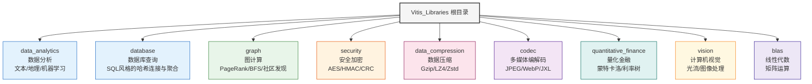

**图解说明**：每一个彩色节点代表一个独立的领域库。它们彼此平行，互不干扰，就像超市里的不同货架区。你在做图计算时，不需要了解量化金融库里的任何细节。

这种设计的好处是：**你只需要关心你用的那个领域**。不同领域的团队可以独立开发、独立测试、独立发布。

---

## 2.3 关键发现：所有领域共享同一套"内部装修"

现在走进任何一个领域目录，你会看到一个惊喜——**它们的内部结构几乎一模一样**。

以 `security`（安全加密）为例：

```
security/
├── L1/          ← 最底层：原始的硬件构建块
├── L2/          ← 中间层：可以在 FPGA 上跑起来的完整内核
└── L3/          ← 最上层：面向应用开发者的高级 API
```

再看 `graph`（图计算）：

```
graph/
├── L1/          ← 图算法的底层原语
├── L2/          ← PageRank、BFS 等完整算法内核
└── L3/          ← 多设备调度、分区合并的高级接口
```

还有 `data_analytics`（数据分析）：

```
data_analytics/
├── L1/          ← 正则表达式编译器、基础指令集
├── L2/          ← 朴素贝叶斯、决策树、日志分析内核
└── L3/          ← 文本引擎 API、地理空间查询接口
```

这不是巧合。这是一个**刻意设计的、贯穿整个库的架构约定**：**L1/L2/L3 三层模式**。

---

## 2.4 三层模式的本质：乐高积木的三个粒度

理解 L1/L2/L3，最好的类比是**乐高积木的不同粒度**。

- **L1 = 基础积木块**：单个 2×4 的标准砖、圆形旋转件、连接销。它们是最小的、最通用的构建单元。单独看，一块砖头没什么用；但你可以用它们拼出任何东西。

- **L2 = 预组装的模块**：比如一扇门、一扇窗、一段墙。它们已经是有意义的功能单元，可以直接"插入"到更大的建筑中。

- **L3 = 完整的建筑设计服务**：建筑师根据你的需求（"我要一栋三居室"），自动调用多个门窗模块，按照最优方案组装，交付给你一个完整的家。

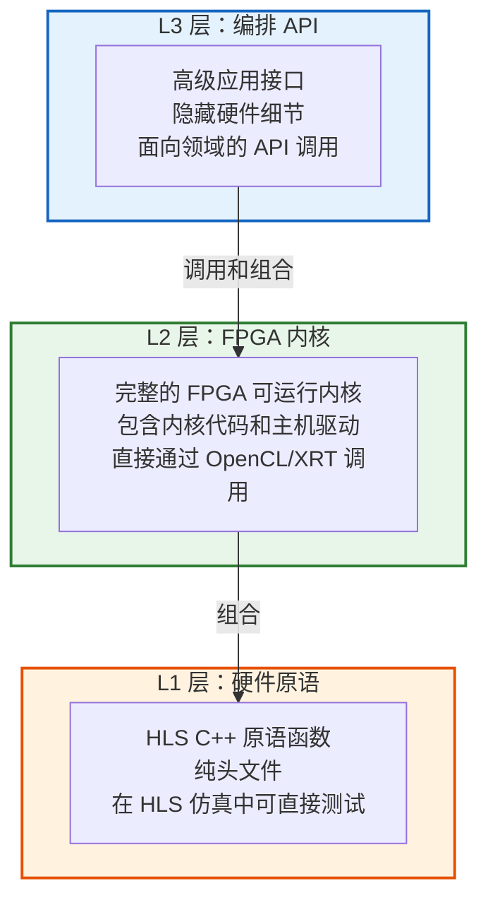

**图解说明**：箭头方向是"依赖"关系——L3 依赖 L2 的内核，L2 的内核依赖 L1 的原语。越往下，越接近硬件；越往上，越接近用户。

---

## 2.5 L1 层：最小的硬件积木

**L1 是"可综合的 HLS C++ 函数集合"**。

"可综合"的意思是：这些 C++ 代码不只是在 CPU 上跑的普通程序——它们经过专门编写，可以被 Vitis HLS 工具翻译成实际的 FPGA 硬件电路（RTL 描述）。

你可以把 L1 想象成**CPU 的指令集（ISA）**，但它是为 FPGA 定制的。AES 加密的一轮（round）变换、SHA-1 的一个压缩步骤、一次哈希表查找——这些都是 L1 原语。

**L1 的三个特征**：

1. **纯头文件（Header-Only）**：通常只有 `.hpp` 文件，没有需要单独编译的 `.cpp`。包含头文件就能用，像 C++ 标准模板库一样。

2. **HLS 指令标注**：代码里充满了 `#pragma HLS PIPELINE`、`#pragma HLS DATAFLOW` 这样的指令。这些是给硬件编译器看的"优化提示"，就像 C++ 的 `inline` 关键字，但作用是控制 FPGA 流水线的并行度。

3. **可在 C 仿真中验证**：不需要真实 FPGA，就能用普通 C++ 编译器测试逻辑正确性。

**一个具体例子**：`security` 库的 L1 层包含 AES 的 S-Box 查找、字节替换、行移位等单步操作。每个操作只有几十行 HLS C++ 代码，但组合起来就能构成完整的 AES 加密算法。

---

## 2.6 L2 层：可以直接"跑起来"的 FPGA 内核

**L2 是"开箱即用的 FPGA 加速内核"**。

你可以把 L2 想象成**npm 包**（Node.js 的包管理器里的模块）。你不需要知道它内部怎么实现的，只需要知道它的接口（输入、输出是什么），就能调用它。

一个完整的 L2 模块通常包含四个文件，就像一个"四件套"：

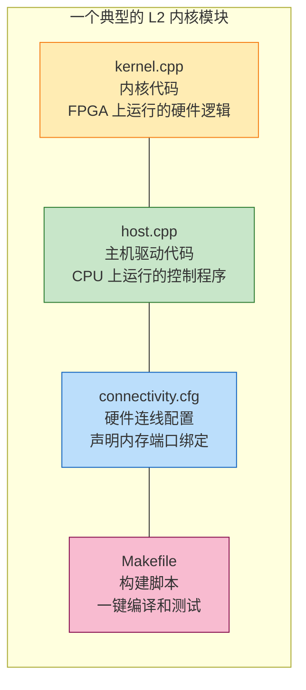

**图解说明**：这四个文件共同构成一个完整的可运行单元。`kernel.cpp` 是"在 FPGA 上运行的程序"，`host.cpp` 是"在 CPU 上控制 FPGA 的程序"，`connectivity.cfg` 是"告诉工具链如何连接内存和内核端口的配置"，`Makefile` 是"一键构建和测试的脚本"。

**一个具体例子**：`security/L2/benchmarks/hmac_sha1/` 目录里，有一个完整的 HMAC-SHA1 认证内核。你直接运行 `make run TARGET=hw`，它会自动编译内核、生成 FPGA 比特流、在 Alveo 加速卡上跑基准测试，并把结果与 OpenSSL 的参考输出对比。

---

## 2.7 L3 层：为应用开发者设计的"管家服务"

**L3 是"高级编排 API"**，类似 React 框架对于网页开发者的意义——你不需要手动操作 DOM，React 帮你管理。

L3 的核心价值是**隐藏复杂性**：

- 你不需要知道数据被分成了几个 FPGA 分区
- 你不需要手动管理 PCIe 传输的时序
- 你不需要协调多个内核之间的依赖关系
- 你只需要调用一个像 `engine.run(myGraph)` 这样的高级函数

**L3 的典型形态**：

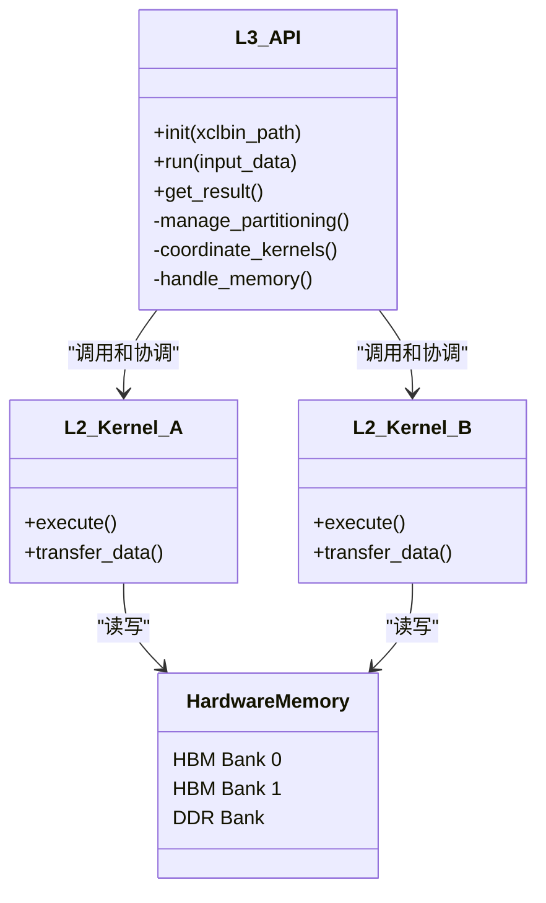

**图解说明**：L3 API 是应用开发者唯一需要打交道的对象。它在内部协调多个 L2 内核，管理底层内存，对用户完全透明。

**一个具体例子**：`graph` 库的 L3 层提供了 `opLouvainModularity` 这样的类。用户只需要传入图数据，`opLouvainModularity` 会自动：
1. 判断图是否需要分区（太大一块 FPGA 装不下）
2. 把图切成若干片，分发给多块 FPGA
3. 在每块 FPGA 上运行 Louvain 社区发现内核
4. 收集各片的结果，合并成全局社区划分

---

## 2.8 用三个真实案例看透三层模式

### 案例一：安全加密库（security）

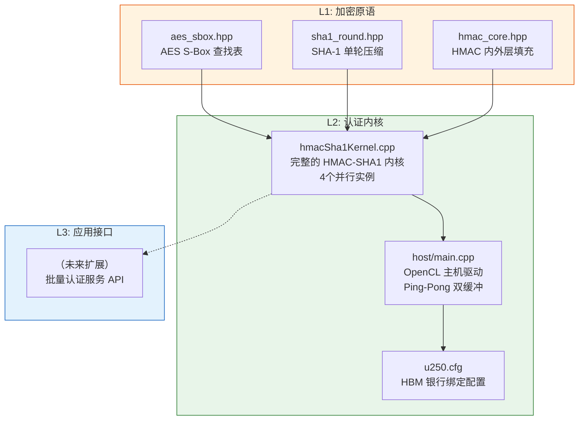

**图解说明**：AES S-Box、SHA-1 单轮等 L1 原语，像积木一样被拼进 `hmacSha1Kernel` 这个 L2 内核。L2 内核又配合主机驱动和连接配置，形成完整可跑的基准测试。

---

### 案例二：图分析库（graph）

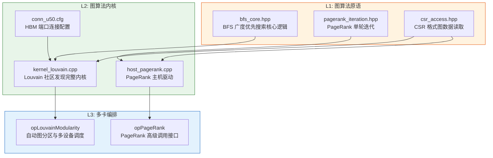

**图解说明**：图算法的 L3 层特别强大——当图太大、一块 FPGA 放不下时，`opLouvainModularity` 会自动把图切成多个分区，分给多块 FPGA 并行计算，用户完全感知不到这个复杂过程。

---

### 案例三：数据分析库（data_analytics）

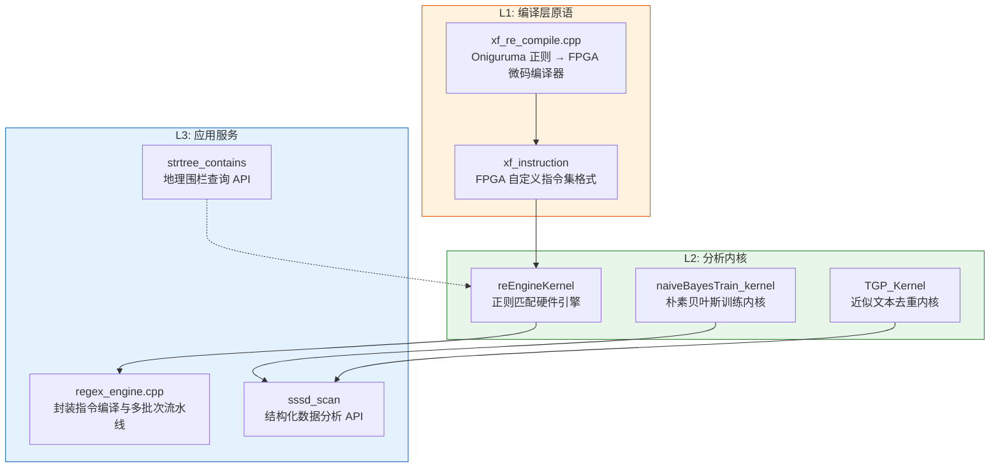

**图解说明**：数据分析库的 L1 层做了一件特别有趣的事——它包含一个**编译器**（`xf_re_compile`），把用户写的正则表达式翻译成 FPGA 能懂的"微指令"。这体现了 L1 原语的多样性：不一定是算法步骤，也可以是工具链组件。

---

## 2.9 三层之间的接口：数据如何"流过"各层

理解了三层的定位，下一个问题是：数据和控制信息如何在层间流动？

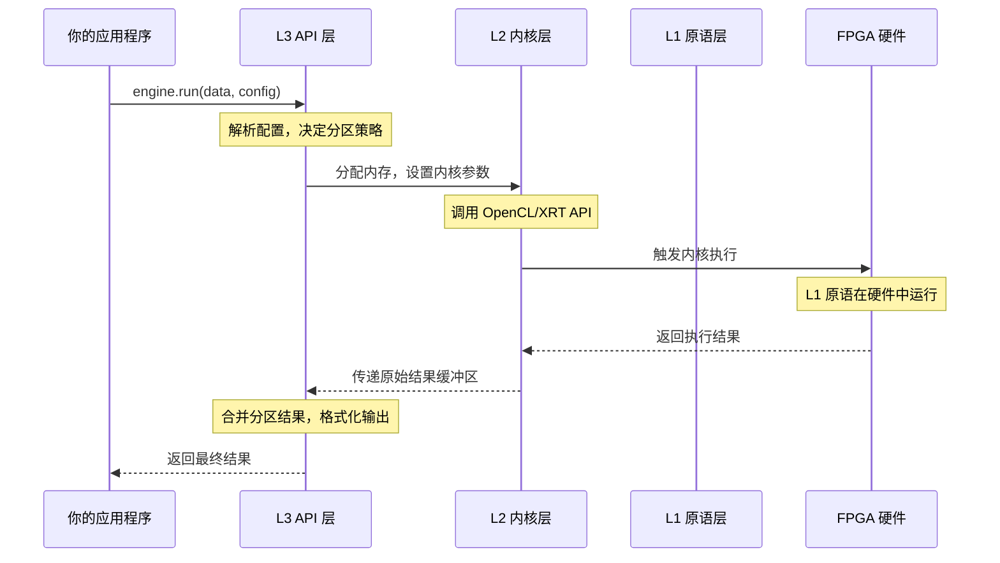

**图解说明**：注意 L1 原语在这里"隐身"了——它们在设计阶段（写代码时）被嵌入到 L2 内核中，在运行阶段已经变成了 FPGA 硬件逻辑的一部分，不存在独立的运行时调用。

**关键理解**：L1/L2/L3 是**代码组织的层次**，而不是**运行时的调用堆栈**。L1 在编译时被"吸收"进 L2 内核；L3 在运行时调用 L2 内核。

---

## 2.10 为什么要设计成三层？

这种分层不是"为了分层而分层"，而是解决了 FPGA 开发中的一个真实矛盾：

> **FPGA 最擅长执行固定的、流水线化的计算；但用户需要的是灵活的、可组合的功能。**

分层架构是这个矛盾的解决方案：

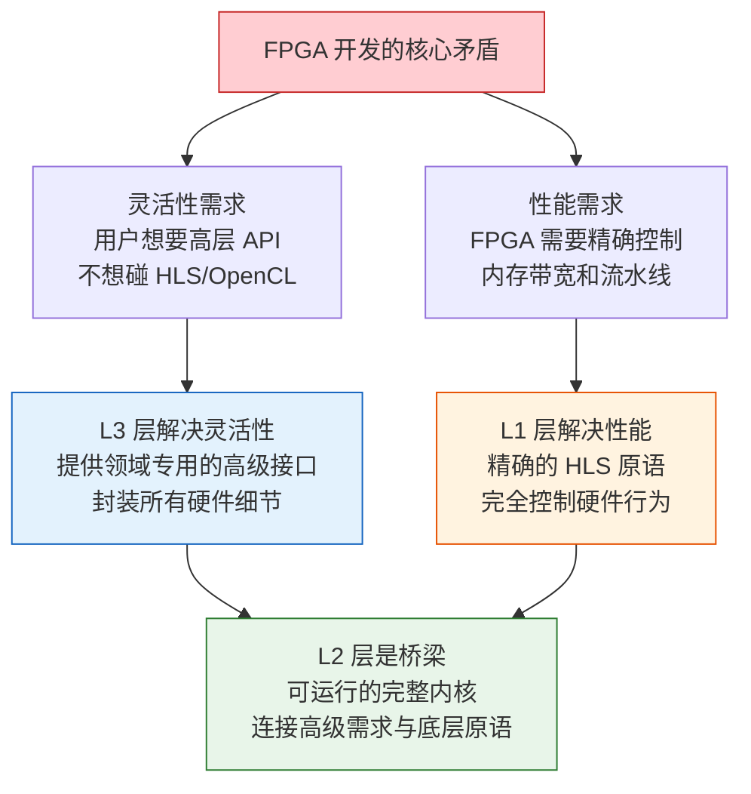

**图解说明**：L3 解决了"我不想学 FPGA 编程"的问题，L1 解决了"我需要最高性能"的问题，L2 是把两者连接起来的桥梁。三层共同存在，才能服务不同层次的用户。

---

## 2.11 不同用户，进入不同的层

这三层对应三类不同的用户，就像餐厅有不同的"入口"：

| 你是谁 | 你进入哪一层 | 你需要了解什么 |
|--------|------------|--------------|
| 应用开发者（想快速用加速功能） | **L3** | 领域 API 的函数签名，输入/输出格式 |
| 系统工程师（想定制内核或调优） | **L2** | OpenCL/XRT 编程模型，内存管理 |
| FPGA 硬件工程师（想添加新算法） | **L1** | HLS 编程，流水线设计，时序约束 |

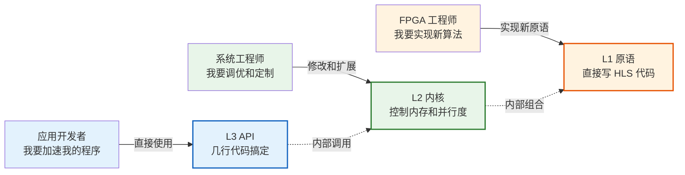

**图解说明**：三类用户从三个不同的"入口"进入同一套系统。重要的是，他们不需要了解自己层级以下的细节——应用开发者不需要懂 HLS，就像你不需要懂汽车发动机原理才能开车。

---

## 2.12 领域内部也有子结构：以图计算为例深入一层

为了让这个概念更具体，我们以 `graph_analytics_and_partitioning` 为例，看看一个领域内部的完整结构：

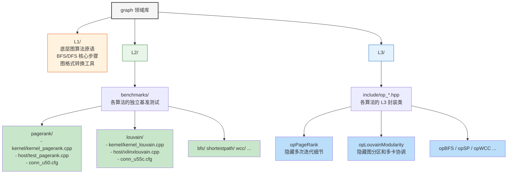

**图解说明**：`L2/benchmarks/` 下的每个子目录都是一个独立的"内核包"，包含内核代码、主机代码和连接配置。`L3/include/` 下的 `op_*.hpp` 文件则是对应这些内核的高级封装类。

---

## 2.13 四件套模式：每个 L2 内核的标准配置

现在我们深入 L2 层，看一个具体内核的文件结构。以 HMAC-SHA1 认证基准测试为例：

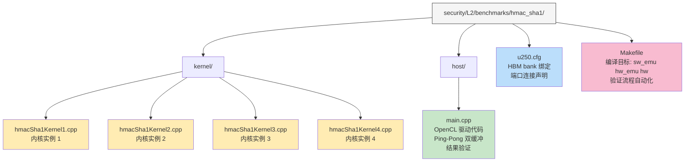

**图解说明**：这个"四件套"（内核代码 + 主机代码 + 连接配置 + 构建脚本）是整个 Vitis_Libraries 中**最高频出现的模式**。你在几乎每一个 L2 基准测试里都能看到这个结构。理解了这个模式，你就理解了 Vitis_Libraries 90% 的代码组织逻辑。

---

## 2.14 领域之间也有连接：跨域依赖

最后一个重要概念：虽然领域之间是平行的"专区"，但它们并不是完全孤立的。某些领域的输出会作为另一个领域的输入。

```mermaid
graph LR
    Compress["data_compression\nGzip 解压缩"]
    Analytics["data_analytics\n文本分析 / 决策树"]
    Database["database\n哈希连接 / 聚合"]
    Security["security\nCRC32 完整性校验"]
    Graph["graph\n图算法"]

    Compress -->|"解压后的 CSV 数据\n流入 sssd_scan API"| Analytics
    Security -->|"CRC32 校验\n用于压缩数据完整性"| Compress
    Analytics -->|"决策树可作为 UDF\n嵌入数据库查询"| Database
    Database -->|"查询结果可作为\n图的边权重输入"| Graph

    style Compress fill:#fce4ec,stroke:#880e4f
    style Analytics fill:#e3f2fd,stroke:#1565c0
    style Database fill:#e8f5e9,stroke:#2e7d32
    style Security fill:#fff3e0,stroke:#e65100
    style Graph fill:#f3e5f5,stroke:#4a148c
```

**图解说明**：这些跨域依赖通常发生在 **L3 层**——高级 API 把两个领域的功能组合成一个端到端流水线。比如，`data_analytics` 的 `gunzip_csv` 子模块就先调用 `data_compression` 的 Gzip 内核解压，再把结果送给分析 API。

---

## 2.15 本章小结：一张图记住所有核心概念

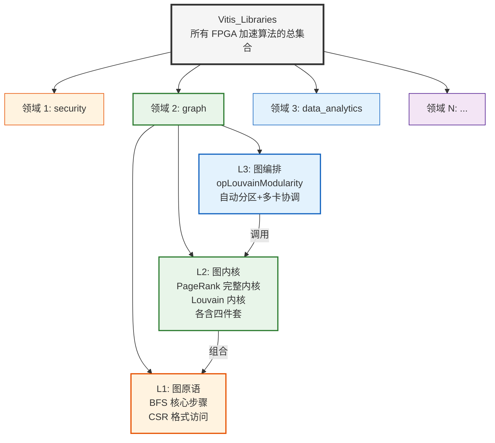

**三句话总结本章**：

1. **横向**：Vitis_Libraries 按应用领域（安全、图计算、数据分析……）分成独立的"专区"，领域之间互不干扰。

2. **纵向**：每个领域内部都遵循统一的 **L1 → L2 → L3** 三层架构——L1 是硬件原语，L2 是可运行的完整内核（含四件套），L3 是面向应用开发者的高级编排 API。

3. **连接**：L1 在编译时被嵌入 L2，L3 在运行时调用 L2。选择从哪一层进入，取决于你是应用开发者、系统工程师还是 FPGA 硬件工程师。

---

> **下一章预告**：我们已经理解了代码是如何**组织**的。接下来，第三章将追踪一块数据缓冲区的完整生命周期——它如何从 CPU 内存出发，穿越 PCIe 总线，到达 FPGA 上的内核，再把结果送回来。这是理解 Vitis_Libraries 如何**真正工作**的关键一步。