# 第二章：Vitis Libraries 的组织方式——领域、层次与 L1/L2/L3 模式

## 2.1 从"一盘散沙"到"井然有序"

在第一章里，我们了解了 Vitis Libraries 是什么——一个覆盖压缩、密码学、数据库查询、图分析、机器学习、量化金融等多个领域的 FPGA 加速库。但如果你打开它的代码仓库，第一眼看到的是几十个文件夹、数百个源文件，很容易感到迷失。

这一章要解决的问题就是：**这些代码是怎么组织的？有没有一个统一的规律？**

答案是：有，而且非常清晰。整个 Vitis Libraries 遵循一个贯穿所有领域的三层架构——**L1 / L2 / L3**。一旦你理解了这个模式，任何一个新领域的代码结构对你来说都会变得一目了然。

---

## 2.2 大局观：领域 × 层次的矩阵

想象一栋大型写字楼。每一列是一个**业务部门**（领域），每一层楼是一个**职能层级**（L1/L2/L3）。不同部门的员工做着不同的业务，但每个部门内部的层级结构是相同的：底层做基础工作，中层做具体实现，高层做统筹协调。

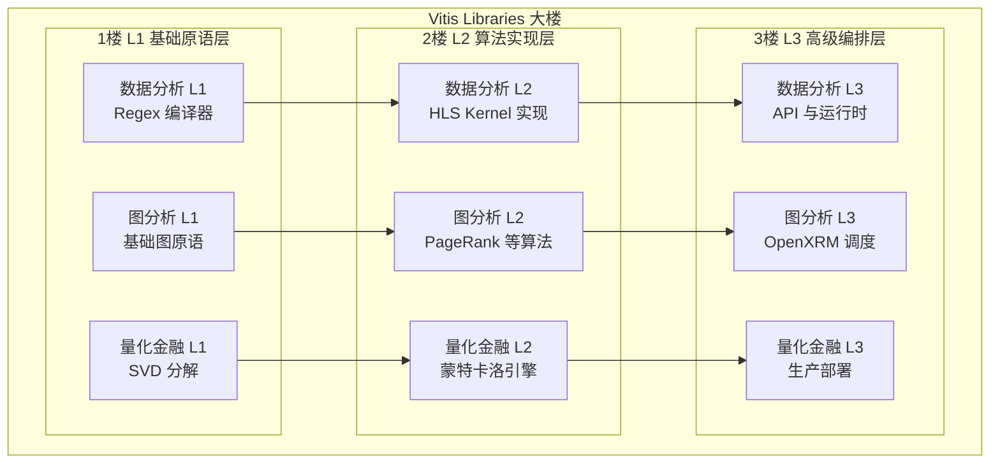

这张图展示了核心思想：**每个领域都是一列，每列都有三层**。层与层之间是依赖关系——上层建立在下层的基础之上。

---

## 2.3 三层的含义：用厨房来类比

在深入代码之前，让我们用一个日常类比来建立直觉。

想象你要开一家餐厅：

- **L1（食材与刀具）**：这是最基础的东西——锋利的刀、新鲜的食材、基本的调料。它们本身不是菜，但没有它们什么菜都做不出来。
- **L2（厨师与菜谱）**：这是具体的烹饪过程——厨师按照菜谱，用 L1 的食材和工具，做出一道道完整的菜。你可以直接点这道菜来品尝（基准测试）。
- **L3（餐厅管理系统）**：这是前台、点餐系统、排班表——它不亲自炒菜，但负责协调多个厨师、管理订单队列、处理多桌同时用餐的情况。

在 Vitis Libraries 里：

| 层级 | 厨房类比 | 技术含义 |
|------|---------|---------|
| **L1** | 食材与刀具 | 底层 HLS 原语，可综合为 FPGA 硬件逻辑的基础函数 |
| **L2** | 厨师与菜谱 | 完整的 HLS Kernel 实现 + 主机端基准测试程序 |
| **L3** | 餐厅管理系统 | 高级 API，负责多 Kernel 调度、资源管理、跨设备协调 |

---

## 2.4 L1：基础原语层——"乐高的基础砖块"

L1 是整个库的地基。你可以把它想象成**乐高积木里最基础的那些小方块**——单独看它们很简单，但正是这些小方块让你能搭出任何复杂的结构。

L1 的代码通常是：
- 用 **HLS（High-Level Synthesis，高层次综合）** 写的 C++ 函数
- 可以被 Vitis 工具直接编译成 FPGA 硬件逻辑
- 专注于**单一、可复用的计算原语**

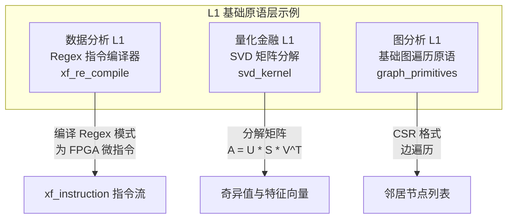

**以数据分析领域的 L1 为例**：`regex_compilation_core_l1` 模块实现了一个**正则表达式编译器**。它的工作是把人类写的正则表达式（比如 `\d{3}-\d{4}`）翻译成 FPGA 能理解的微指令序列（`xf_instruction`）。

这就像 LLVM 编译器把 C++ 代码翻译成机器码——L1 把高级模式描述翻译成硬件能直接执行的指令。

**L1 的关键特征**：
- 通常**没有**完整的主机端程序（不能独立运行）
- 专注于**算法正确性**，不关心系统集成
- 是 L2 的"零件供应商"

---

## 2.5 L2：算法实现层——"可以独立运行的完整菜肴"

L2 是 Vitis Libraries 中**内容最丰富**的一层。如果说 L1 是零件，L2 就是用这些零件组装好的**完整机器**，而且附带了一份**使用说明书和性能测试报告**。

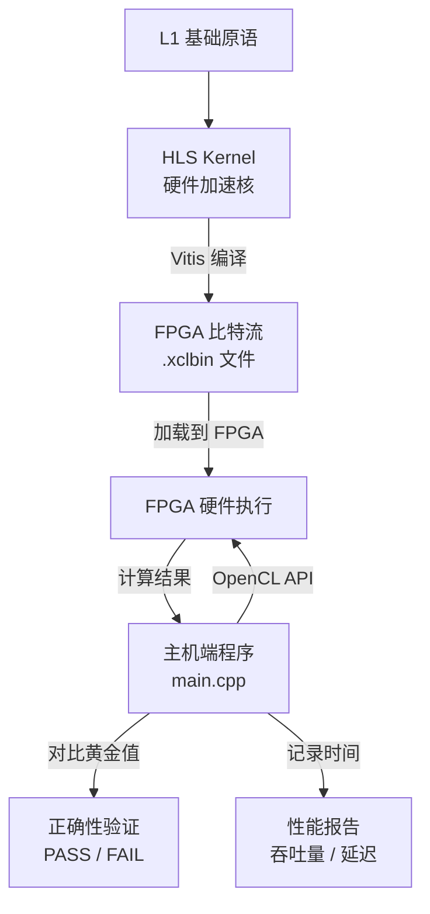

**L2 的典型目录结构**（以图分析的 PageRank 为例）：

```
graph/L2/benchmarks/pagerank/
├── kernel/          ← HLS Kernel 代码（硬件逻辑）
│   └── pagerank_kernel.cpp
├── host/            ← 主机端程序（CPU 控制代码）
│   └── test_pagerank.cpp
├── Makefile         ← 构建脚本
└── conn_u50.cfg     ← 硬件连接配置（告诉工具如何接线）
```

**L2 的三个核心组成部分**：

1. **HLS Kernel**：用 C++ 写的硬件逻辑，加上 `#pragma HLS` 指令告诉编译器如何优化。这是真正在 FPGA 上运行的代码。

2. **主机端基准程序**：运行在 CPU 上的 C++ 程序，负责加载 FPGA 比特流、传输数据、启动 Kernel、收集结果。

3. **连接配置文件（.cfg）**：告诉 Vitis 工具如何把 Kernel 的内存端口连接到物理内存（DDR 或 HBM）。这就像电路图，规定了哪根线接哪个插座。

---

## 2.6 L3：高级编排层——"餐厅的调度大脑"

L3 是面向**生产应用**的高级接口。它不直接操作硬件，而是提供一个**更友好、更强大的 API**，让你不需要关心底层的 OpenCL 细节。

想象你在用 React 开发网页——你不需要手动操作 DOM，React 帮你管理了所有的更新逻辑。L3 对于 FPGA 编程的作用，就像 React 对于 DOM 操作一样。

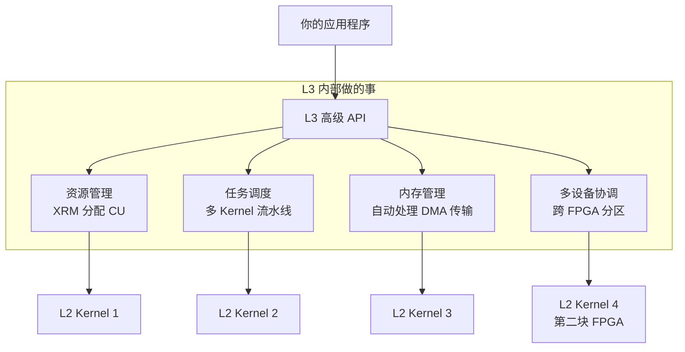

**以图分析领域的 L3 为例**：`l3_openxrm_algorithm_operations` 模块提供了 `opPageRank`、`opLouvainModularity` 等高级操作对象。你只需要调用 `addwork(graph)` 提交一个图分析任务，L3 会自动：
- 通过 **XRM（Xilinx Resource Manager，Xilinx 资源管理器）** 找到空闲的 FPGA 计算单元
- 把图数据切分成合适的分区（如果图太大放不进一块 FPGA）
- 在多块 FPGA 上并行执行
- 合并结果并返回给你

**L3 的关键特征**：
- 提供**异步 API**（提交任务后不阻塞，可以继续做其他事）
- 处理**多设备、多任务**的复杂调度
- 隐藏 OpenCL 的底层细节

---

## 2.7 三层之间的关系：数据如何流动

现在让我们把三层放在一起，看看数据是如何从用户的输入，一路流经 L3 → L2 → L1（硬件），再把结果返回的。

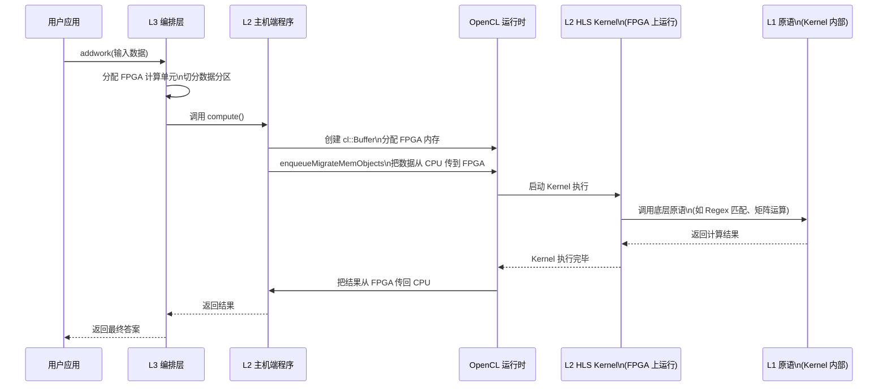

这个流程图展示了一次完整的 FPGA 加速计算之旅：用户在 L3 层提交任务，L3 协调 L2 的主机端程序，主机端程序通过 OpenCL 驱动 FPGA 上的 L2 Kernel，Kernel 内部调用 L1 原语完成实际计算，结果再沿原路返回。

---

## 2.8 这个模式在三个领域中的体现

理解了抽象模式之后，让我们看看它在三个具体领域中是如何体现的。

### 2.8.1 数据分析领域

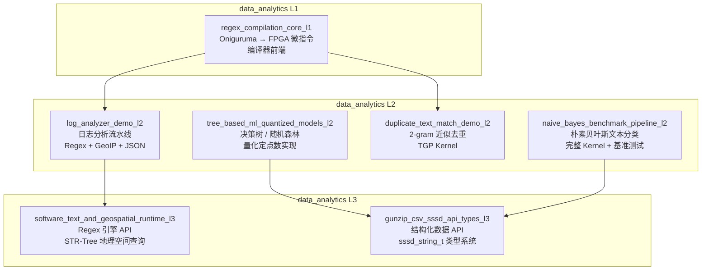

**数据分析领域的 L1** 是一个正则表达式编译器——它把人类写的 Regex 模式翻译成 FPGA 能执行的微指令。这个编译器是整个文本处理能力的基石。

**L2** 包含了多个独立的算法实现：朴素贝叶斯分类、决策树训练、文本去重、日志分析流水线。每个都是一个完整的 FPGA 加速方案，可以独立运行和测试。

**L3** 提供了面向应用的高级接口：一个完整的 Regex 引擎 API（隐藏了指令编译、内存管理的细节），以及一个类似 PostgreSQL 类型系统的结构化数据 API。

### 2.8.2 图分析领域

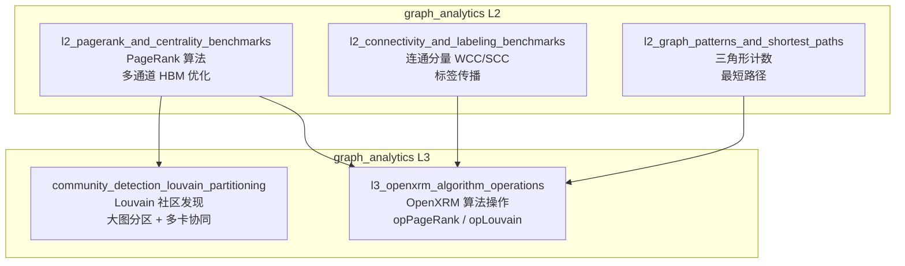

图分析领域的 L3 有一个特别有趣的功能：**大图分区**。当一个图太大，放不进单块 FPGA 的内存时，L3 的 `LouvainPar::partitionDataFile` 会把图切成多个分区，分发给多块 FPGA 并行处理，最后合并结果。这个复杂的协调工作完全由 L3 处理，L2 的 Kernel 完全不需要知道自己处理的只是图的一部分。

### 2.8.3 量化金融领域

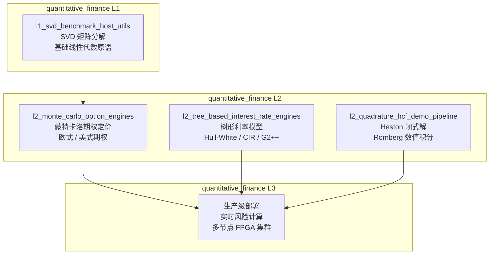

量化金融领域展示了 L2 的另一个重要特征：**黄金值验证**。每个 L2 引擎都有一个来自 QuantLib 等权威金融库的参考答案（黄金值），FPGA 计算结果必须与之在误差容限内吻合（比如 0.1%）。这确保了硬件加速不会牺牲计算精度。

---

## 2.9 为什么要这样分层？——设计哲学

你可能会问：为什么不把所有代码放在一起？分三层有什么好处？

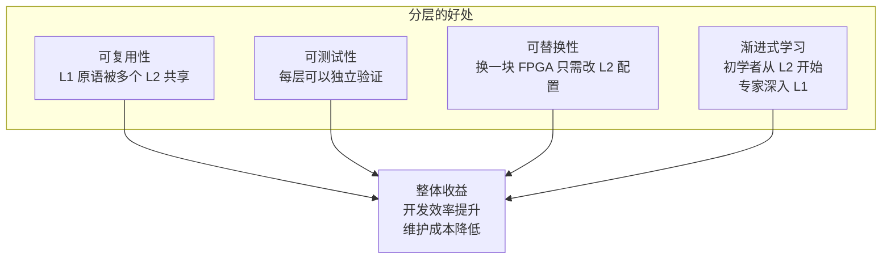

**可复用性**：数据分析领域的 Regex 编译器（L1）被日志分析（L2）和文本去重（L2）两个完全不同的应用共享。如果没有分层，这段代码就会被复制两份，维护起来是噩梦。

**可测试性**：你可以单独测试 L1 的 Regex 编译器是否正确，不需要启动整个 FPGA 系统。L2 的基准测试可以验证 Kernel 的性能，不需要 L3 的复杂调度逻辑。

**可替换性**：当 Xilinx 推出新一代 FPGA（比如从 U200 升级到 U280），通常只需要修改 L2 的连接配置文件（`.cfg`），L1 的算法代码和 L3 的应用代码可以保持不变。

**渐进式学习**：如果你是初学者，从 L2 的基准测试程序开始——它是一个完整的、可运行的例子。如果你是专家，深入 L1 去优化底层原语。L3 则是你准备把加速能力集成到生产系统时的入口。

---

## 2.10 一个具体的例子：追踪 Louvain 社区发现

让我们用图分析领域的 Louvain 社区发现算法，完整地走一遍 L1 → L2 → L3 的路径。

> **Louvain 算法**是一种用于发现网络中"社区"（紧密连接的节点群）的算法。想象在一个社交网络里，它能自动找出哪些人是一个圈子的。

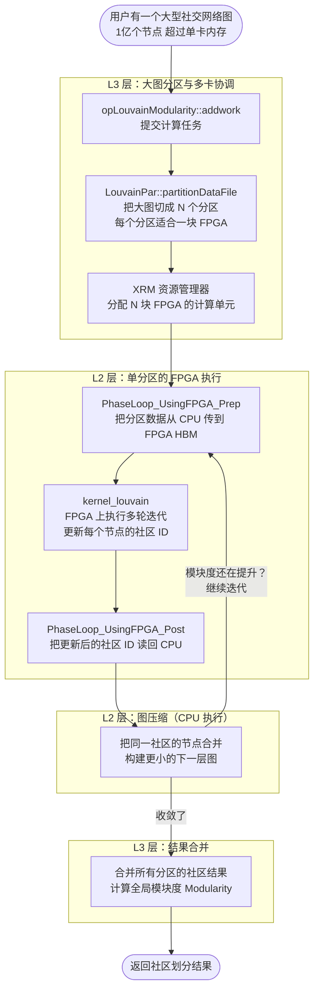

这个流程图展示了分层架构的威力：

- **L3** 处理了"图太大放不进一块 FPGA"这个工程难题，用户完全不需要关心分区逻辑
- **L2** 专注于单个分区在 FPGA 上的高效执行，不需要知道自己是整个大图的一部分
- 两层各司其职，组合起来解决了单层无法解决的问题

---

## 2.11 量化金融的 L2：三阶段流水线的精妙设计

量化金融领域的美式期权定价引擎（`MCAmericanEngineMultiKernel`）展示了 L2 层内部的另一种模式：**多 Kernel 流水线**。

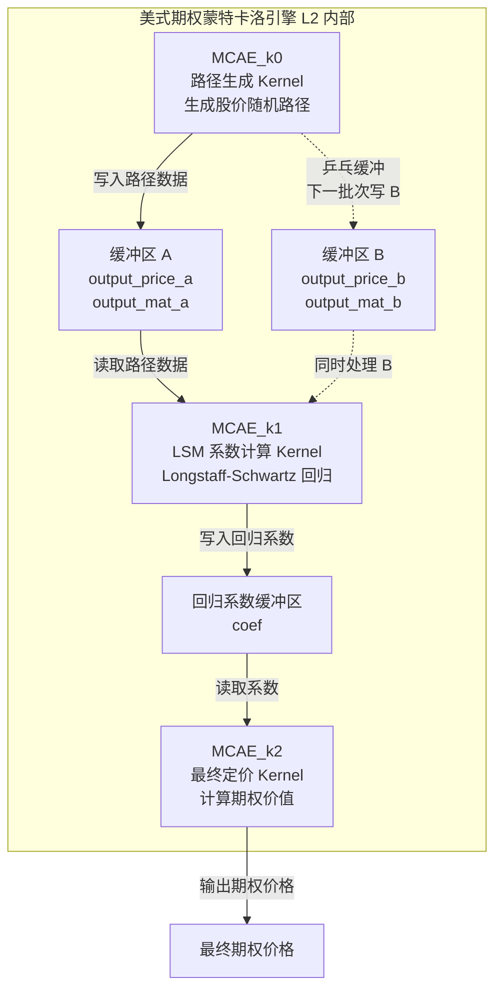

这里有一个聪明的设计：**乒乓缓冲（Ping-Pong Buffering）**。就像两个乒乓球台——当 K0 在往缓冲区 A 写数据时，K1 同时在从缓冲区 B 读数据处理上一批次。两个操作并行进行，互不干扰，大幅提升了整体吞吐量。

这种设计完全在 L2 层内部实现，L3 层看到的只是一个"美式期权定价"的黑盒。

---

## 2.12 如何在代码仓库中找到对应的层

现在你已经理解了 L1/L2/L3 的概念，让我们看看如何在实际的代码仓库中找到它们。

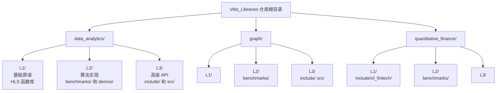

**规律总结**：

- 每个领域的顶层目录下都有 `L1/`、`L2/`、`L3/` 三个子目录
- `L1/` 通常包含 `include/` 和 `src/`，里面是 HLS 头文件和实现
- `L2/` 通常包含 `benchmarks/` 或 `demos/`，每个子目录是一个独立的算法实现
- `L3/` 通常包含 `include/` 和 `src/`，里面是高级 API 的头文件和实现

---

## 2.13 新手路线图：从哪里开始？

了解了三层架构之后，你可能想知道：**作为一个新手，我应该从哪里开始探索？**

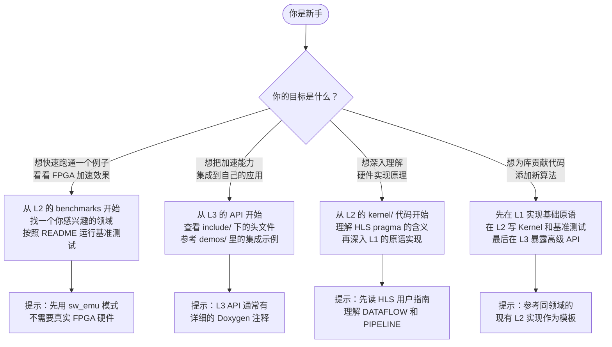

---

## 2.14 小结：L1/L2/L3 模式的核心要点

让我们用一张概念地图来总结本章的核心内容：

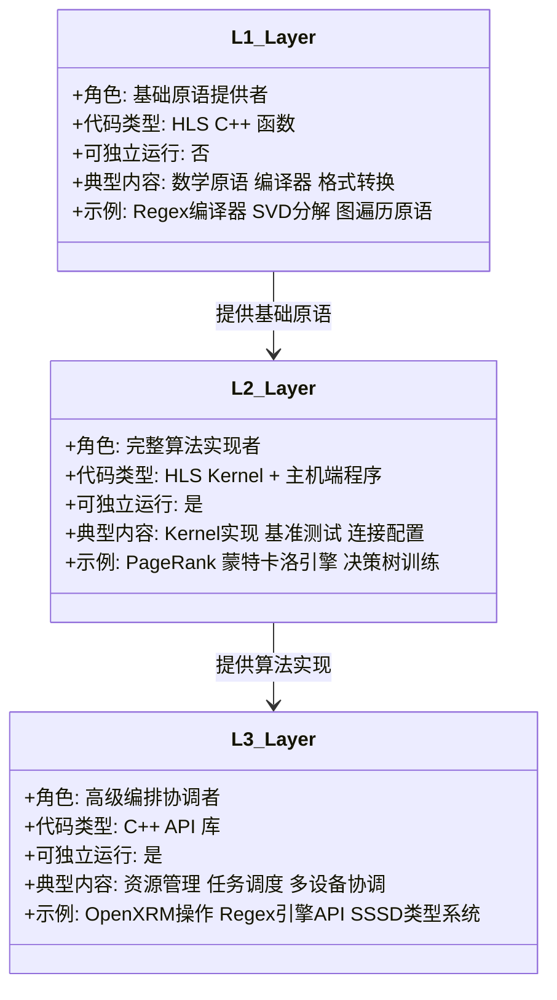

**三句话记住核心**：

1. **L1 是零件**：HLS 原语，不能独立运行，是 L2 的原材料
2. **L2 是产品**：完整的 FPGA 加速方案，可以独立运行和测试，是学习的最佳起点
3. **L3 是服务**：高级 API，处理复杂的调度和协调，是集成到生产系统的入口

这个 L1/L2/L3 模式在 Vitis Libraries 的**每一个领域**中都严格遵循。无论你在看数据压缩、密码学、数据库查询、图分析、机器学习还是量化金融，都能找到这三层结构。这种一致性是 Vitis Libraries 最重要的设计决策之一——它让你学会一个领域之后，能够快速上手任何其他领域。

---

在下一章，我们将深入探讨数据是如何在主机（CPU）和 FPGA 之间流动的——包括 OpenCL 缓冲区、命令队列、乒乓缓冲等关键机制。这些知识将帮助你理解为什么 L2 的主机端程序要那样写，以及如何优化数据传输效率。