# 第一章：什么是 Vitis Libraries？FPGA 加速计算的全局视角

---

## 1.1 从一个真实的痛点开始

想象你是一家数据中心的工程师。每天，你的服务器需要：

- 把数 TB 的日志文件**压缩**后存入对象存储
- 对每一条网络请求做 **AES 加密**，确保数据安全
- 对海量用户行为数据跑 **SQL 聚合查询**，生成实时报表

你的 CPU 服务器拼命工作，但还是跟不上数据的洪流。就像试图用一根吸管喝完一整个游泳池的水——工具本身没问题，但它根本不是为这种规模设计的。

这就是 **FPGA 加速**存在的原因，也是 **Vitis Libraries** 要解决的问题。

---

## 1.2 什么是 FPGA？用一个工厂来理解

在深入 Vitis Libraries 之前，我们先搞清楚 FPGA 是什么。

**CPU** 就像一个**万能工人**：他什么都会做，但每次只能做一件事，做完一件再做下一件。你让他压缩文件，他就压缩；你让他加密数据，他就加密。灵活，但速度有限。

**FPGA（现场可编程门阵列）** 则像一个**可以重新布局的工厂车间**：你可以根据需要，把车间里的机器重新排列，专门为某一种任务打造一条**专用流水线**。一旦流水线搭好，数据就像在传送带上一样，以极高的速度流过每一道工序，同时处理成千上万个数据块。

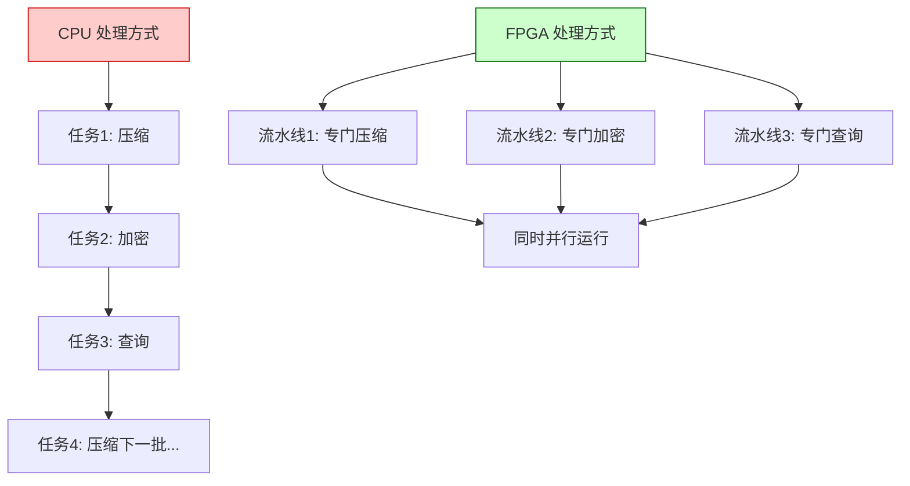

上图展示了核心差异：CPU 是**串行**的万能工人，FPGA 是**并行**的专用工厂。对于固定的、计算密集型任务，FPGA 的吞吐量可以比 CPU 高出 10 倍到 100 倍。

---

## 1.3 那么，Vitis Libraries 是什么？

好，现在你知道 FPGA 很强大。但有一个问题：**搭建这条专用流水线非常困难**。

传统上，为 FPGA 编程需要用 Verilog 或 VHDL——一种描述硬件电路的语言，就像你需要亲手画出每一根电线的走向。这需要数年的专业训练。

**Vitis Libraries 就是解决这个问题的工具箱。**

你可以把它想象成 FPGA 世界的 **npm 包管理器** 或 **PyPI**：它提供了一大批**预先构建好的、经过优化的硬件加速模块**，覆盖了数据压缩、密码学、数据库查询、图计算、机器学习、量化金融等多个领域。

你不需要从零开始画电路图。你只需要：
1. 选择你需要的模块（比如"Gzip 压缩加速器"）
2. 按照文档配置参数
3. 把它集成到你的应用中

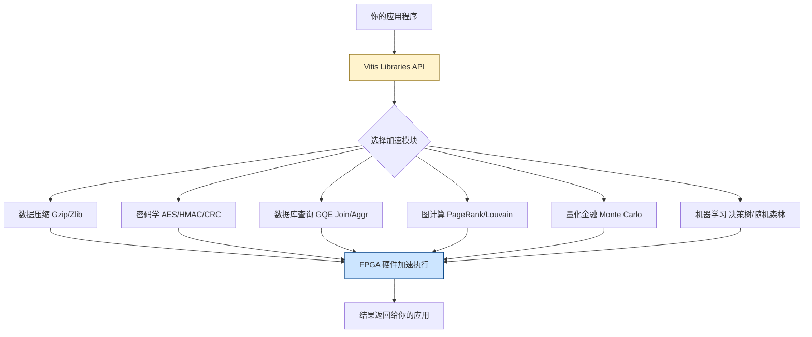

这张图展示了 Vitis Libraries 的核心价值：它是你的应用程序和 FPGA 硬件之间的**桥梁**。你用熟悉的 C++ 或 Python 写应用逻辑，Vitis Libraries 负责把计算任务"翻译"成 FPGA 能理解的硬件指令。

---

## 1.4 Vitis Libraries 覆盖哪些领域？

Vitis Libraries 不是一个单一的库，而是一个**按领域组织的库集合**。每个领域都有独立的模块，专门解决该领域的性能瓶颈。

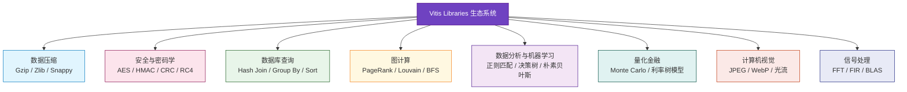

每个领域都像一个独立的"专业工厂车间"，针对该领域的计算特点做了深度优化。让我们通过三个具体例子来感受一下。

---

## 1.5 三个真实场景：Vitis Libraries 如何解决实际问题

### 场景一：数据压缩——让 Gzip 快 10 倍

**问题**：你的日志系统每秒产生 5GB 数据，需要实时压缩后存储。CPU 上的 Gzip 最多跑到 500MB/s，完全跟不上。

**Vitis Libraries 的解法**：`data_compression_gzip_system` 模块把 Gzip 的核心算法（DEFLATE = LZ77 + Huffman 编码）固化成 FPGA 上的硬件流水线。

想象一下这个流水线：

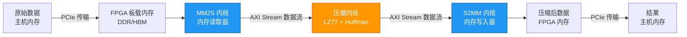

这条流水线中：
- **MM2S 内核**（Memory-to-Stream）就像仓库里的自动装卸机器人，把数据从内存搬上"传送带"（AXI Stream）
- **压缩内核**是流水线的核心，数据流过它时被实时压缩，每个时钟周期都在处理新数据
- **S2MM 内核**（Stream-to-Memory）是出口处的打包机器人，把压缩好的数据存回内存

关键洞察：**数据从不停下来等待**。就像工厂流水线上的产品，一直在移动，一直在被加工。这就是 FPGA 能达到 CPU 10 倍吞吐量的秘密。

---

### 场景二：密码学——让 AES 加密不再是瓶颈

**问题**：你的 HTTPS 网关需要处理 100Gbps 的流量，每个数据包都要做 AES-256 加密。单核 CPU 的 AES 吞吐量约为 1-2Gbps，你需要 50 个以上的物理核心——这既昂贵又耗电。

**Vitis Libraries 的解法**：`security_crypto_and_checksum` 模块提供了 AES-256-CBC、HMAC-SHA1、CRC32 等算法的 FPGA 实现。

这里有一个聪明的设计：**批处理（Batching）**。

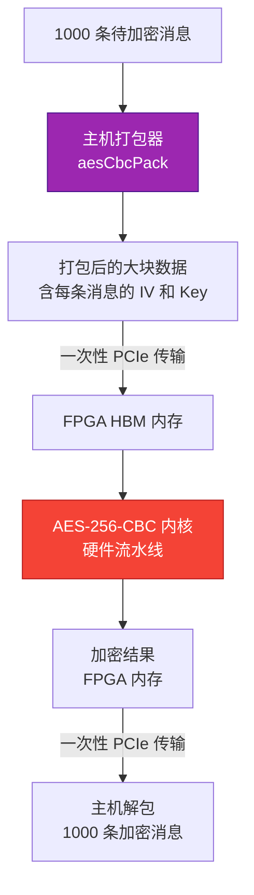

为什么要批处理？因为每次 PCIe 传输（CPU 和 FPGA 之间的数据搬运）都有固定的"过路费"（延迟）。把 1000 条消息打包成一次传输，比发送 1000 次单条消息要高效得多——就像一辆大卡车运货比 1000 辆自行车运货更划算。

---

### 场景三：数据库查询——让 SQL Join 飞起来

**问题**：你的数据仓库需要对两张各有 10 亿行的表做 Hash Join，在 CPU 上需要几分钟，但业务要求秒级响应。

**Vitis Libraries 的解法**：`database_query_and_gqe` 模块提供了**通用查询引擎（GQE，Generic Query Engine）**。

GQE 有一个独特的设计哲学：**运行时可配置**。

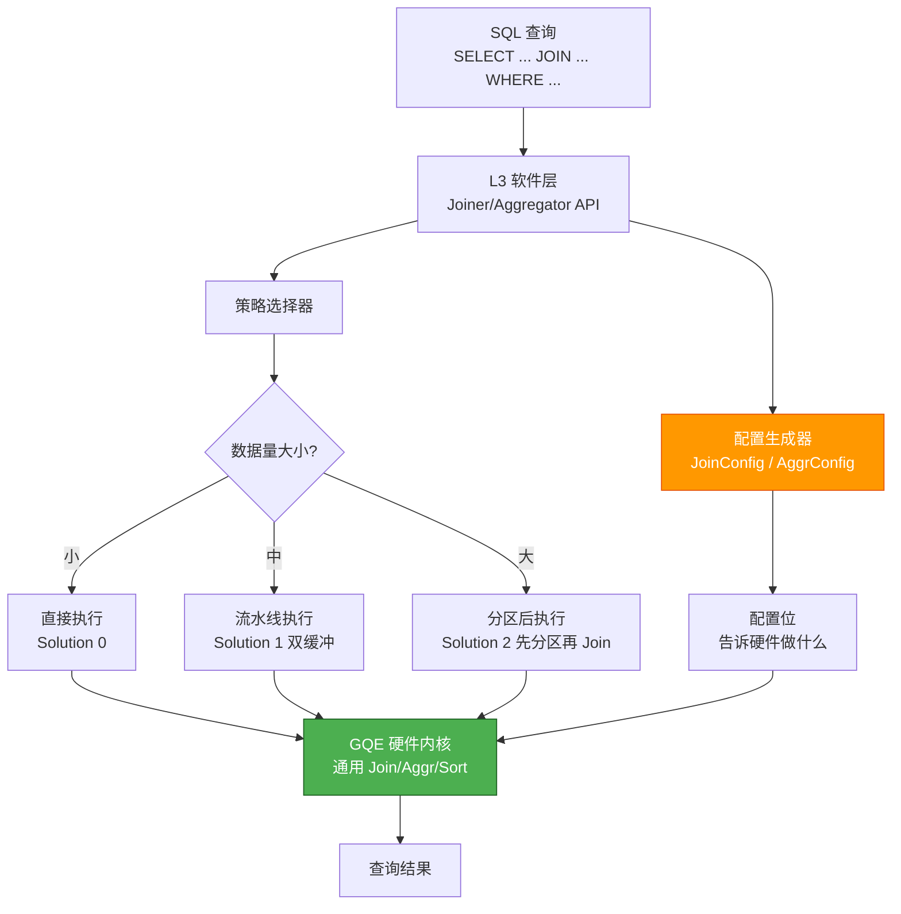

想象 GQE 内核是一台**多功能加工机**，上面有很多旋钮。`JoinConfig` 就是操作手册，告诉机器："把第 0 列和第 1 列做 Hash Join，过滤条件是第 2 列大于 100"。你不需要为每个查询重新烧录 FPGA——只需要发送不同的配置，硬件就会改变行为。

---

## 1.6 FPGA 加速的工作原理：主机与 FPGA 的协作

现在你已经看了三个例子，让我们退一步，理解 FPGA 加速的通用工作模式。

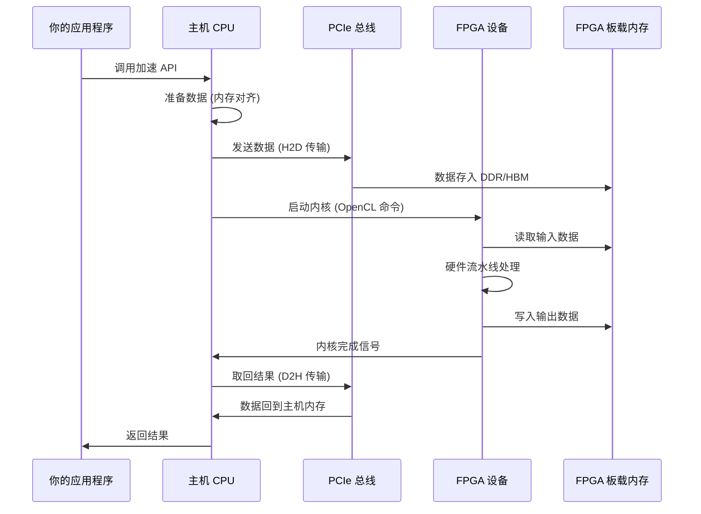

这个流程有几个关键角色：

- **主机 CPU**：负责调度和协调，就像项目经理。它不做繁重的计算，但负责把任务分配给 FPGA，并收集结果。
- **PCIe 总线**：CPU 和 FPGA 之间的"高速公路"。数据必须通过这条路来回传输，这是整个系统的带宽瓶颈之一。
- **FPGA 板载内存（DDR/HBM）**：FPGA 的"工作台"。数据必须先搬到这里，FPGA 内核才能处理它。
- **FPGA 内核**：真正干活的"工人"，以硬件流水线的方式高速处理数据。
- **OpenCL**：主机和 FPGA 之间的"通用语言"，让 CPU 能够控制 FPGA 的执行。

---

## 1.7 为什么不直接用 GPU？

你可能会问：GPU 也能并行计算，为什么还需要 FPGA？

这是一个很好的问题。让我们用一个类比来理解：

- **CPU** 是**瑞士军刀**：什么都能做，但每件事都只是"够用"
- **GPU** 是**大型工厂**：有成千上万个相同的工人（CUDA 核心），特别擅长做**相同的操作**（如矩阵乘法）
- **FPGA** 是**定制化工厂**：你可以根据任务需求，设计完全不同的流水线，每条流水线都针对特定任务极度优化

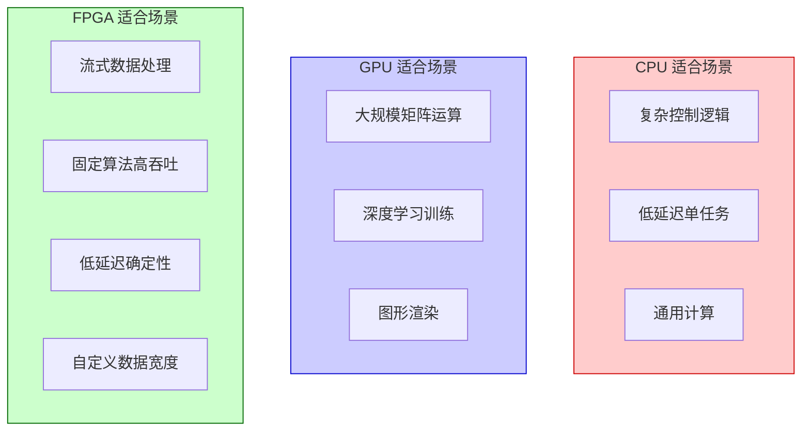

FPGA 的独特优势在于：
1. **流式处理**：数据可以像水流一样连续流过，不需要等待整批数据到齐
2. **确定性延迟**：每次处理的时间几乎完全相同，没有 GPU 的调度抖动
3. **自定义数据宽度**：可以处理 512 位宽的数据，而 GPU 通常是 32 位或 64 位
4. **低功耗**：对于特定任务，FPGA 的能效比 GPU 高得多

---

## 1.8 Vitis Libraries 的设计哲学：三层架构

Vitis Libraries 不是把所有东西堆在一起的大杂烩。它有一个清晰的**三层架构**，就像一栋建筑的地基、主体和装修：

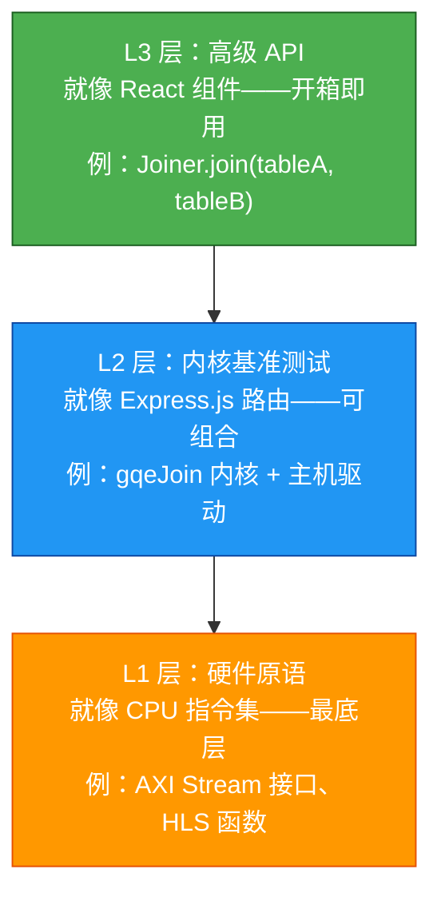

- **L1（硬件原语层）**：最底层的积木块。这里是 HLS（高层次综合）代码，直接描述硬件行为。就像 CPU 的汇编指令，功能强大但需要专业知识。

- **L2（内核与基准测试层）**：把 L1 的积木组合成完整的功能模块，并提供测试框架。就像 Express.js 的路由——你可以直接用，也可以在它基础上定制。

- **L3（高级 API 层）**：最友好的接口，隐藏了所有硬件细节。就像 React 组件——你只需要传入数据，它帮你处理一切。

这个三层设计让不同背景的开发者都能找到合适的切入点：
- **应用开发者**：直接用 L3，几行代码就能享受 FPGA 加速
- **系统工程师**：在 L2 层定制内核配置和执行策略
- **硬件专家**：在 L1 层优化底层算法实现

---

## 1.9 一个完整的心智模型：把 Vitis Libraries 想象成一座城市

让我们用一个更宏观的类比来总结：

把整个 Vitis Libraries 生态系统想象成一座**高度自动化的工业城市**：

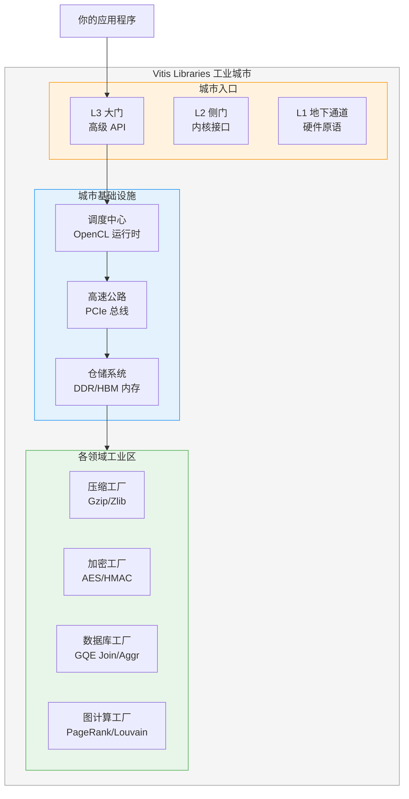

- **各领域工业区**：每个领域（压缩、加密、数据库等）都是一个专业工厂，有自己的生产线和工艺
- **城市基础设施**：PCIe 总线是高速公路，DDR/HBM 是仓储系统，OpenCL 是调度中心——这些是所有工厂共享的基础设施
- **城市入口**：L1/L2/L3 是进入城市的不同入口，根据你的需求选择合适的入口

你的应用程序是这座城市的**客户**：你告诉调度中心你需要什么服务，调度中心安排货物运输（PCIe 传输），工厂完成加工（FPGA 计算），最后把成品送回给你。

---

## 1.10 本章小结：你已经掌握的核心概念

让我们用一张概念地图来回顾本章的核心内容：

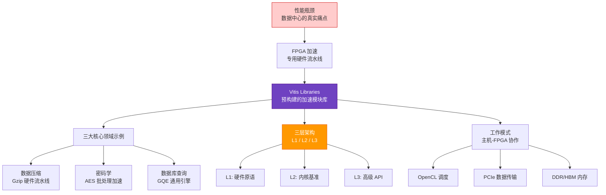

**你现在应该理解的核心概念：**

| 概念 | 一句话解释 |
|------|-----------|
| **FPGA** | 可重新布局的专用计算工厂，擅长流式并行处理 |
| **Vitis Libraries** | FPGA 世界的 npm——预构建的加速模块集合 |
| **L1/L2/L3 架构** | 从硬件原语到高级 API 的三层抽象 |
| **主机-FPGA 协作** | CPU 负责调度，FPGA 负责计算，PCIe 负责传输 |
| **OpenCL** | CPU 控制 FPGA 的通用语言 |
| **DDR/HBM** | FPGA 的"工作台"，数据必须先放到这里才能被处理 |
| **AXI Stream** | FPGA 内核之间的"传送带"，数据在内核间流动的方式 |

---

## 1.11 下一章预告

现在你已经理解了 Vitis Libraries 的大局观——它是什么、为什么存在、以及它如何解决真实问题。

但你可能还有疑问：这些模块是如何组织的？L1、L2、L3 之间的边界在哪里？为什么每个领域都遵循相同的模式？

**第二章**将带你深入 Vitis Libraries 的内部组织结构，揭示 L1/L2/L3 这个贯穿所有领域的统一架构模式，以及为什么这种设计让整个项目既灵活又强大。

---

> **💡 关键记忆点**
> 
> Vitis Libraries = **FPGA 世界的工具箱**
> 
> 它把复杂的硬件加速封装成易用的 API，让你用 C++ 代码就能享受 FPGA 的并行计算能力，而不需要了解底层的电路设计。
> 
> 核心工作模式：**数据从 CPU 内存 → PCIe → FPGA 内存 → 硬件流水线处理 → FPGA 内存 → PCIe → CPU 内存**