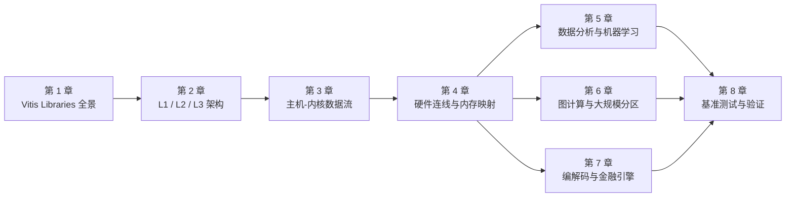

# Vitis Libraries 初学者指南

欢迎来到 **Vitis Libraries 初学者指南**！本指南专为刚刚接触 FPGA 加速计算的开发者量身打造——无论你是来自软件工程、数据科学，还是嵌入式系统领域，只要你对"如何用 FPGA 让程序跑得更快"感到好奇，这里就是你的起点。我们不预设你已经熟悉 HLS、OpenCL 或 Xilinx 工具链，只需要你带着求知欲与耐心，一步一步跟着走。

在这八个章节里，你将从宏观到微观、从概念到实践，系统地理解 Vitis Libraries 的设计哲学与工程细节。你会学到：FPGA 加速为何存在、数据如何在主机与芯片之间流动、硬件连线配置文件背后的逻辑，以及压缩、图计算、机器学习、编解码和金融定价等真实领域是如何借助这套框架落地的。读完本指南，你将具备独立阅读源码、搭建自己的加速管线并编写基准测试的能力。

---

## 学习路线图

下图展示了八个章节的阅读顺序与逻辑递进关系，建议按序阅读，也可以根据兴趣跳转到特定领域深潜章节。

---

## 章节目录

### 第 1 章 · [Vitis Libraries 是什么？FPGA 加速计算全景](guide-beginners-guide-what-is-vitis-libraries.md)

了解 Vitis Libraries 的诞生背景与核心价值——为什么 FPGA 加速能够解决压缩、密码学、数据库查询等领域的真实性能瓶颈，以及这个项目在整个 Xilinx/AMD 工具链中所扮演的角色。

---

### 第 2 章 · [项目如何组织：域、层次与 L1/L2/L3 模式](guide-beginners-guide-how-the-project-is-organized.md)

深入理解贯穿所有领域的三层架构——从底层 HLS 内核（L1）到基准演示（L2）再到高层编排 API（L3）——并看清这一模式是如何在每个库域中一致复现的。

---

### 第 3 章 · [数据如何流动：主机-内核管线与 OpenCL 运行时](guide-beginners-guide-host-kernel-data-flow.md)

追踪数据从 CPU 主机内存出发，经由 PCIe 与 DMA 进入 FPGA 内核再返回的完整旅程，理解 OpenCL 缓冲区、命令队列、乒乓缓冲以及计时测量各自的作用。

---

### 第 4 章 · [连接硬件：内核连通性、HBM Bank 与平台配置文件](guide-beginners-guide-hardware-connectivity-and-memory-mapping.md)

揭开 `.cfg` 连接配置文件的神秘面纱，理解如何将内核 AXI 端口映射到物理 DDR/HBM 内存 Bank，以及 U50、U200、U280 等不同平台的配置差异如何影响带宽与布局决策。

---

### 第 5 章 · [领域深潜：数据分析、文本处理与机器学习](guide-beginners-guide-domain-deep-dive-data-and-ml.md)

探索数据分析域如何在 FPGA 上加速正则表达式匹配、模糊文本去重与量化决策树训练，通过一个完整的具体问题，亲历 L1 到 L3 全栈协作的实际效果。

---

### 第 6 章 · [领域深潜：图计算与大规模分区](guide-beginners-guide-domain-deep-dive-graph-analytics.md)

了解 PageRank、连通分量、Louvain 社区发现等图算法是如何映射到 FPGA 硬件的，以及当图规模超出单卡容量时，多卡分区策略如何应对这一挑战。

---

### 第 7 章 · [领域深潜：编解码加速与量化金融引擎](guide-beginners-guide-domain-deep-dive-codecs-and-finance.md)

对比两个截然不同的加速领域——图像编解码管线（JPEG、WebP、JXL）与金融定价引擎（蒙特卡洛期权、Hull-White 三叉树）——看同一套主机-内核模式如何适配迥异的数学负载。

---

### 第 8 章 · [基准测试与验证：每个域如何检验正确性与衡量性能](guide-beginners-guide-benchmarking-and-validation-patterns.md)

掌握贯穿所有域的验证惯例——黄金参考对比、双模式计时（挂钟时间 vs OpenCL 事件）以及多轮预热策略——让你有信心编写属于自己的基准测试程序。

---

> 💡 **建议**：第 1 至 4 章构成核心基础，请务必顺序阅读；第 5、6、7 章为并列的领域深潜，可根据你的业务方向自由选择；第 8 章是对前七章的综合收尾，适合在动手实践前集中阅读。祝学习愉快！