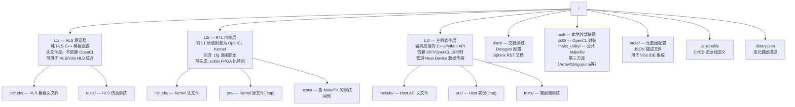
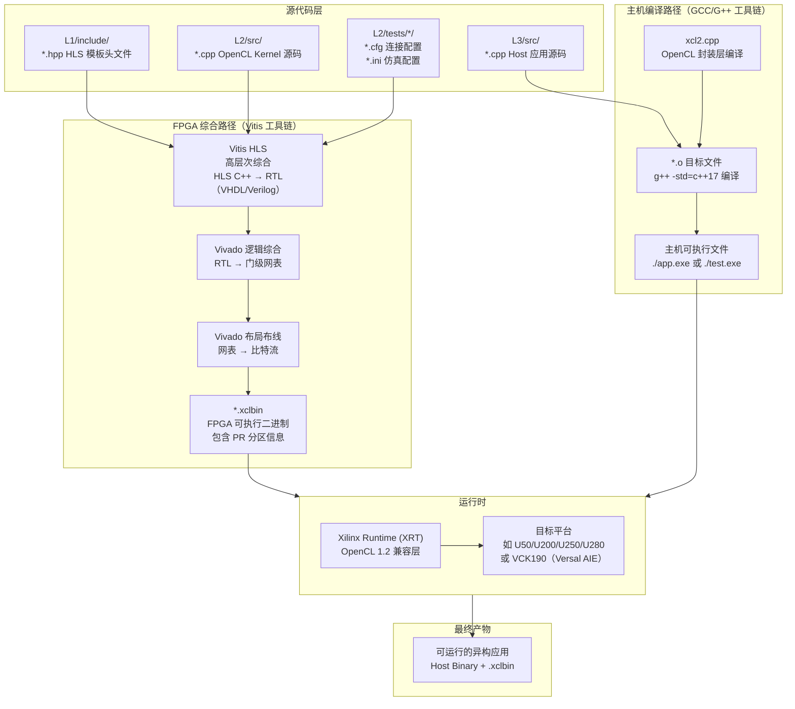
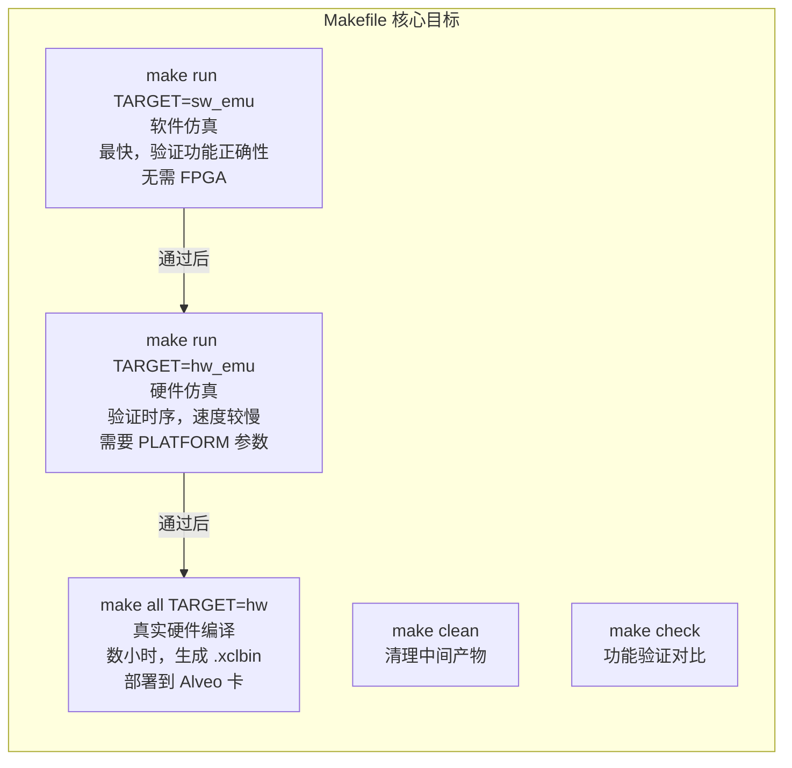
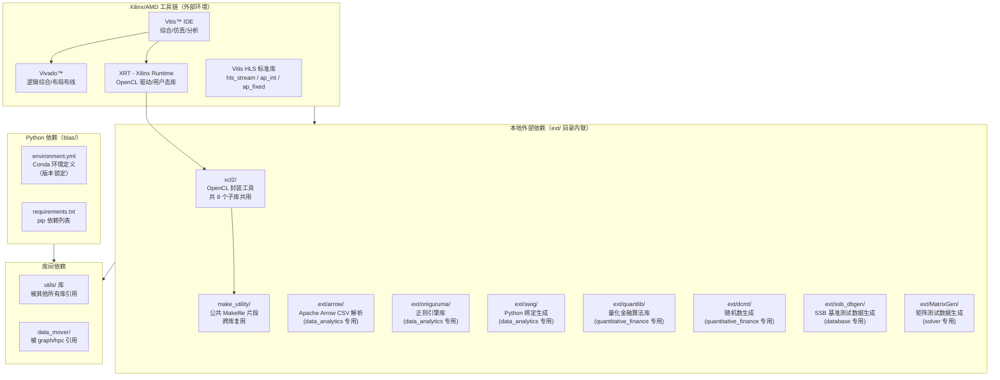
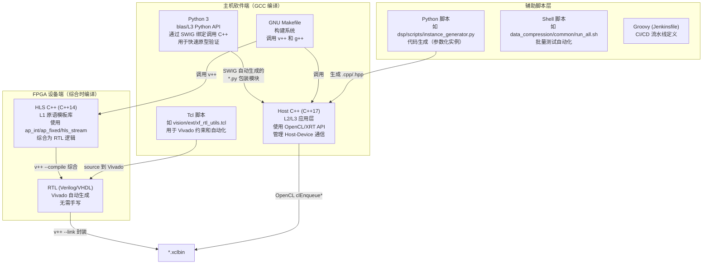
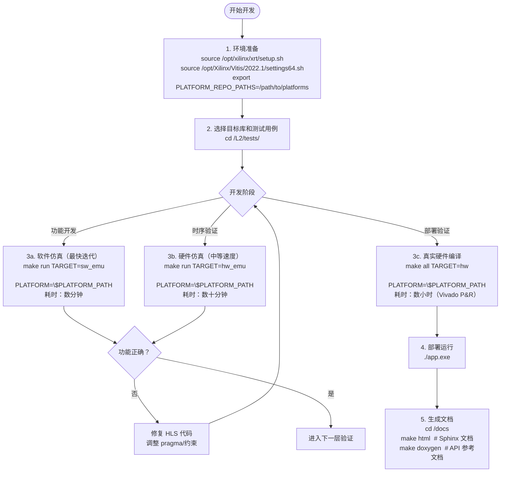
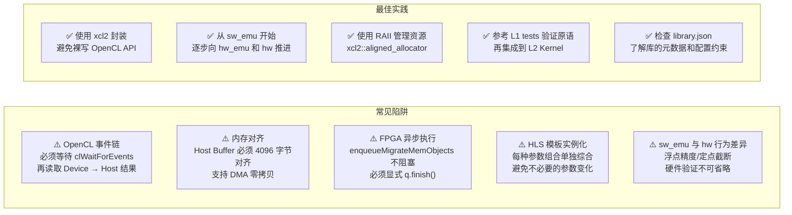

# Vitis_Libraries 构建与代码组织分析

> **目标读者**：希望理解项目构建方式、源码树组织结构及依赖管理的开发者。

---

## 1. 项目目录结构

Vitis_Libraries 是一个由 AMD/Xilinx 维护的**超大型多库单仓（Monorepo）**，按照**功能领域**进行顶层划分，每个子库（domain library）再按照**硬件抽象层级（L1/L2/L3）**进行内部划分。

### 1.1 顶层目录职责图

```mermaid
graph TD
    Root["Vitis_Libraries/"]

    Root --> blas["blas/\n线性代数加速库\nBLAS Level 1/2/3"]
    Root --> codec["codec/\n图像编解码加速\nJPEG/WebP/JXL/Lepton"]
    Root --> data_analytics["data_analytics/\n数据分析加速\n正则/GeoSpatial/ML"]
    Root --> data_compression["data_compression/\n数据压缩加速\nGzip/Zlib/LZ4/Snappy"]
    Root --> data_mover["data_mover/\n数据搬运原语\nDMA/Stream 工具"]
    Root --> database["database/\n数据库查询加速\nGQE/Hash Join/Sort"]
    Root --> dsp["dsp/\n数字信号处理\nFIR/FFT/DFT"]
    Root --> graph["graph/\n图计算加速\nPageRank/BFS/Louvain"]
    Root --> hpc["hpc/\n高性能计算\n迭代求解器"]
    Root --> motor_control["motor_control/\n电机控制算法"]
    Root --> quantitative_finance["quantitative_finance/\n量化金融\nMonte Carlo/树模型"]
    Root --> security["security/\n安全加密\nAES/SHA/RC4"]
    Root --> solver["solver/\n数值求解器\nSVD/线性方程组"]
    Root --> sparse["sparse/\n稀疏矩阵运算\nSpMV"]
    Root --> ultrasound["ultrasound/\n超声成像算法"]
    Root --> utils["utils/\n通用工具原语\n跨库复用"]
    Root --> vision["vision/\n计算机视觉\nOpenCV HLS 加速"]

    Root --> RootFiles["根级元文件\nJenkinsfile\ndependency.json\nREADME.md\nLICENSE.txt"]
```

### 1.2 单个子库的内部分层结构

每个领域库都遵循统一的 **L1 → L2 → L3** 三层抽象架构：



---

## 2. 构建与编译流水线

Vitis_Libraries 涉及两条完全不同的编译路径：**FPGA 硬件综合路径**和**主机软件编译路径**，两者最终通过 XRT 运行时对接。

### 2.1 完整编译流水线（从源码到可运行产物）



### 2.2 Makefile 目标体系

每个 L2/L3 测试用例目录下都包含一个 `Makefile`，其目标体系如下：



### 2.3 典型 Makefile 变量与编译标志

```makefile
# 通用编译变量（以 data_compression 为例）
PLATFORM      ?= xilinx_u50_gen3x16_xdma_201920_3   # 目标 Alveo 平台
TARGET        ?= sw_emu                               # 编译目标类型
VPP_FLAGS     += --config <lib>.cfg                   # Vitis++ 连接配置
CXXFLAGS      += -std=c++17 -O3                       # Host 编译标准
CXXFLAGS      += -I$(XILINX_XRT)/include              # XRT 头文件路径
CXXFLAGS      += -I$(XILINX_VIVADO)/include           # Vivado HLS 头文件
LDFLAGS       += -lOpenCL -lpthread -lrt              # 链接库
LDFLAGS       += -L$(XILINX_XRT)/lib -lxilinxopencl  # XRT 运行时库
```

---

## 3. 依赖管理

### 3.1 依赖层次总览



### 3.2 依赖版本锁定策略

| 依赖类型 | 锁定机制 | 文件位置 | 说明 |
|---------|---------|---------|------|
| Vitis 工具链 | README/Jenkinsfile 硬编码版本号 | 各库 `README.md` | 例如 `Vitis: 2022.1` |
| FPGA Shell（平台） | Makefile `PLATFORM` 变量 | `Makefile` | 例如 `u50_gen3x16_xdma` |
| Python 环境 | Conda environment.yml | `blas/environment.yml` | 包含精确版本约束 |
| Python pip | requirements.txt | `blas/requirements.txt` | 固定版本号 |
| 第三方 C++ 库 | Git Submodule 或本地复制 | `ext/` 目录 | 以 xcl2、Arrow 等为代表 |
| 根级元数据 | dependency.json | `Vitis_Libraries/dependency.json` | 声明跨库依赖关系 |

### 3.3 `ext/xcl2` 的特殊地位

`xcl2` 是被**最多子库共用**的内部依赖（codec、data_analytics、data_compression、database、dsp、graph、quantitative_finance、security、solver、utils、vision 等均内联了一份），其功能是对原始 OpenCL C API 进行 C++ RAII 封装，简化：

- `cl::Context` / `cl::CommandQueue` 的创建
- `.xclbin` 文件的加载与 `cl::Program` 的构建
- OpenCL Buffer 的对齐分配（4096 字节对齐，支持 DMA 零拷贝）

---

## 4. 多语言协作

Vitis_Libraries 是一个典型的**多语言异构系统**，不同层次使用不同语言，通过明确的 ABI 边界协作。

### 4.1 语言分工架构图



### 4.2 HLS C++ 与 Host C++ 的协作边界

| 维度 | HLS C++（设备端） | Host C++（主机端） |
|------|-----------------|-----------------|
| 编译器 | `vitis_hls` / `v++` | `g++ -std=c++17` |
| C++ 标准 | C++14 | C++17 |
| 头文件路径 | `$(XILINX_VIVADO)/include` | `$(XILINX_XRT)/include` |
| 内存模型 | FPGA 片上 BRAM / HBM | DDR4 主机内存 |
| 通信方式 | AXI4-Stream / AXI4-MM | OpenCL Buffer / DMA |
| 典型数据类型 | `ap_uint<N>`, `hls::stream<T>` | `cl::Buffer`, `std::vector<T>` |

### 4.3 Python 与 C++ 协作（blas 库）

```mermaid
sequenceDiagram
    participant User as Python 用户代码
    participant SWIG as SWIG 生成的 .py 模块
    participant CPP as L3 C++ 库 (.so)
    participant XRT as XRT 运行时
    participant FPGA as FPGA 设备

    User->>SWIG: import xf_blas; xf_blas.gemm(A, B)
    SWIG->>CPP: 调用 C++ 封装函数
    CPP->>XRT: clCreateBuffer / clEnqueueMigrateMemObjects
    XRT->>FPGA: DMA 数据传输
    FPGA-->>XRT: 计算完成中断
    XRT-->>CPP: clEnqueueReadBuffer
    CPP-->>SWIG: 返回结果指针
    SWIG-->>User: 转换为 numpy array 返回
```

---

## 5. 开发工作流

### 5.1 标准开发流程



### 5.2 常用开发命令速查

#### 环境配置

```bash
# 设置 Xilinx 工具链环境
source /opt/xilinx/xrt/setup.sh
source /opt/Xilinx/Vitis/2022.1/settings64.sh

# 设置平台路径
export PLATFORM_REPO_PATHS=/opt/xilinx/platforms
export PLATFORM=xilinx_u50_gen3x16_xdma_201920_3

# Python 环境（blas 库）
conda env create -f blas/environment.yml
conda activate xf_blas
pip install -r blas/requirements.txt
```

#### 构建与仿真

```bash
# ============================================================
# 软件仿真（验证功能，无需 FPGA，数分钟内完成）
# ============================================================
cd data_compression/L2/tests/lz4_compress
make run TARGET=sw_emu PLATFORM=$PLATFORM

# ============================================================
# 硬件仿真（验证时序行为，需要 XSim，数十分钟）
# ============================================================
make run TARGET=hw_emu PLATFORM=$PLATFORM

# ============================================================
# 真实硬件编译（生成 .xclbin，需数小时）
# ============================================================
make all TARGET=hw PLATFORM=$PLATFORM
# 运行：
./app.exe -xclbin <testcase>.xclbin <input_file>

# ============================================================
# data_compression L3 示例：Zlib SO Demo
# ============================================================
cd data_compression/L3/demos/libzso
source scripts/setup.csh
make run TARGET=sw_emu PLATFORM=$PLATFORM    # 仿真
make all TARGET=hw PLATFORM=$PLATFORM        # 硬件
./xzlib input_file           # 压缩
./xzlib -d input_file.zlib   # 解压
./xzlib -t input_file        # 测试流程
./xzlib -t input_file -n 0   # 不用加速（纯软件）
```

#### 测试与验证

```bash
# 运行特定测试用例的功能验证
make check TARGET=sw_emu PLATFORM=$PLATFORM

# 批量运行所有测试（data_compression 示例）
cd data_compression/common
./run_all.sh

# DSP 库：生成参数化实例（Python 代码生成器）
cd dsp
python3 scripts/instance_generator.py \
    --kernel fir_decimate_asym \
    --params config.json

# 数据移动器：生成实例
cd data_mover
python3 scripts/instance_generator.py
```

#### 文档构建

```bash
# 构建 Sphinx HTML 文档
cd <library>/docs
make html -f Makefile.sphinx

# 构建 Doxygen API 参考
cd <library>/docs
doxygen Doxyfile_L1   # L1 层 API
doxygen Doxyfile_L2   # L2 层 API
doxygen Doxyfile_L3   # L3 层 API（若存在）

# 完整文档（Sphinx + Doxygen 联合）
make all -f Makefile.sphinx
```

#### 清理构建产物

```bash
# 清理单个测试用例
make clean

# 清理特定目标的产物
make cleanall TARGET=hw_emu

# 清理整个库的所有产物（谨慎操作）
find <library>/ -name "_x" -type d | xargs rm -rf
find <library>/ -name "*.xclbin" | xargs rm -f
find <library>/ -name "*.xo" | xargs rm -f
```

### 5.3 开发注意事项速查



---

## 附录：关键文件角色速查

| 文件/目录 | 作用 |
|----------|------|
| `<lib>/library.json` | Vitis IDE 集成元数据，描述库能力、目标平台、版本 |
| `Vitis_Libraries/dependency.json` | 根级跨库依赖声明 |
| `<lib>/ext/xcl2/` | OpenCL C++ 封装（RAII），所有 Host 代码的基础设施 |
| `<lib>/ext/make_utility/` | 公共 Makefile 片段，`include` 到各测试用例的 Makefile |
| `<lib>/L*/meta/*.json` | 参数约束元数据，用于 Vitis IDE 的参数化配置向导 |
| `<lib>/docs/Makefile.sphinx` | Sphinx 文档构建入口 |
| `<lib>/Jenkinsfile` | Jenkins CI 流水线，定义自动化测试矩阵 |
| `blas/environment.yml` | Conda 环境定义，Python 依赖版本锁定 |