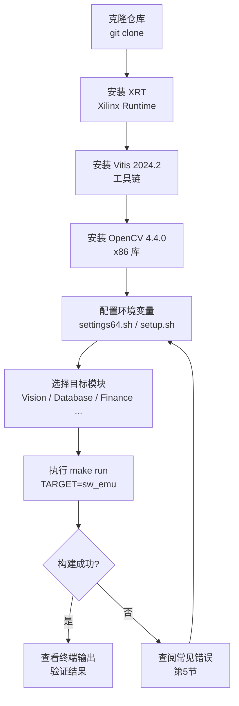
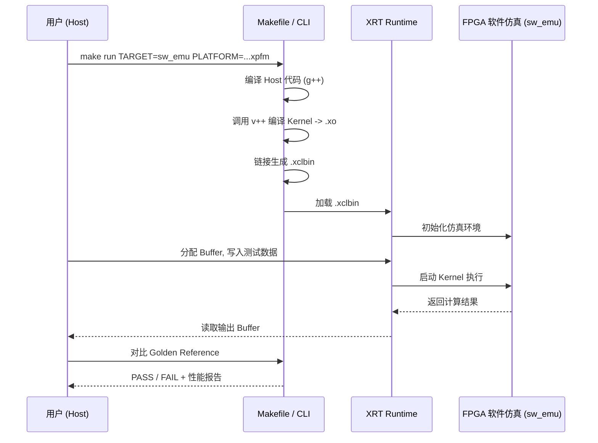

# Vitis Libraries 快速入门教程

> **目标读者：** 刚刚发现本项目、希望在 15 分钟内在本地跑通第一个示例的开发者。

---

## 目录

1. [前置条件](#1-前置条件)
2. [安装流程](#2-安装流程)
3. [第一次运行](#3-第一次运行)
4. [配置说明](#4-配置说明)
5. [常见错误与修复](#5-常见错误与修复)
6. [下一步](#6-下一步)

---

## 安装流程总览



---

## 第一次运行交互时序图



---

## 1. 前置条件

在开始之前，请确认以下软件和硬件均已就绪。

### 1.1 操作系统

| 操作系统 | 支持版本 |
|---|---|
| Ubuntu | 20.04 LTS / 22.04 LTS |
| CentOS / RHEL | 7.8 及以上 |

> **注意：** Windows 和 macOS **不受支持**。所有命令均在 Linux bash 环境下执行。

### 1.2 必需工具

| 工具 | 版本要求 | 获取地址 |
|---|---|---|
| Vitis 统一软件平台 | **2024.2** 或更高 | [AMD 下载中心](https://www.xilinx.com/support/download/index.html) |
| Xilinx Runtime (XRT) | 与 Vitis 版本匹配 | [XRT GitHub](https://github.com/Xilinx/XRT) |
| OpenCV | **4.4.0**（x86） | [OpenCV GitHub](https://github.com/opencv/opencv/tree/4.4.0) |
| CMake | 3.5 或更高 | 系统包管理器 |
| GCC / G++ | 6.2.0+（推荐使用 Vitis 内置版本） | Vitis 安装目录内置 |
| Git | 任意现代版本 | `sudo apt install git` |

### 1.3 硬件要求（可选，sw_emu 无需实体卡）

| 场景 | 硬件要求 |
|---|---|
| 软件仿真 (`sw_emu`) | 仅需 x86 Linux 主机，**无需 FPGA 卡** |
| 硬件仿真 (`hw_emu`) | 仅需 x86 Linux 主机，**无需 FPGA 卡** |
| 实机运行 (`hw`) | Alveo U50 / U200 / U280 / U55C 等加速卡 |

### 1.4 必需环境变量

| 变量名 | 是否必需 | 说明 |
|---|---|---|
| `XILINX_VITIS` | 必需 | 由 `settings64.sh` 自动设置 |
| `XILINX_XRT` | 必需 | 由 XRT `setup.sh` 自动设置 |
| `PLATFORM` | 必需 | 目标平台 `.xpfm` 文件的完整路径 |
| `OPENCV_INCLUDE` | Vision 模块必需 | OpenCV 头文件目录 |
| `OPENCV_LIB` | Vision 模块必需 | OpenCV 库文件目录 |
| `LD_LIBRARY_PATH` | Vision 模块必需 | 需包含 OpenCV 库路径 |

---

## 2. 安装流程

### 步骤 1：克隆仓库

```bash
git clone https://github.com/Xilinx/Vitis_Libraries.git
cd Vitis_Libraries
```

**预期输出：**
```
Cloning into 'Vitis_Libraries'...
remote: Enumerating objects: ...
Receiving objects: 100% (xxxxx/xxxxx), xxx MiB | xx MiB/s, done.
```

> **此步骤最常见错误：** 网络超时导致克隆中断。
> **修复：** 使用 `git clone --depth=1 https://github.com/Xilinx/Vitis_Libraries.git` 进行浅克隆，仅获取最新提交，大幅减少下载量。

---

### 步骤 2：安装 Vitis 2024.2

从 [AMD 下载中心](https://www.xilinx.com/support/download/index.html) 下载 Vitis 统一安装包后执行：

```bash
# 假设安装包已下载至当前目录
chmod +x Xilinx_Unified_2024.2_*.run
./Xilinx_Unified_2024.2_*.run
```

安装完成后，激活 Vitis 环境：

```bash
source /tools/Xilinx/Vitis/2024.2/settings64.sh
```

**预期输出：**（无报错，命令提示符正常返回）

验证安装：
```bash
vitis --version
```

**预期输出：**
```
Vitis v2024.2 (64-bit)
```

> **此步骤最常见错误：** `vitis: command not found`
> **修复：** 确认 `settings64.sh` 路径正确，并重新执行 `source` 命令。

---

### 步骤 3：安装 XRT

```bash
# Ubuntu 示例
sudo apt install ./xrt_202420.2.18.x_20.04-amd64-xrt.deb

# 激活 XRT 环境
source /opt/xilinx/xrt/setup.sh
```

验证安装：
```bash
xbutil --version
```

**预期输出：**
```
Xilinx Board Utility (xbutil) version 2.18.x
```

> **此步骤最常见错误：** `source /opt/xilinx/xrt/setup.sh: No such file or directory`
> **修复：** XRT 默认安装路径为 `/opt/xilinx/xrt/`，若自定义了安装路径，请相应修改 `source` 命令中的路径。

---

### 步骤 4：安装 OpenCV 4.4.0（Vision 模块必需）

```bash
# 安装系统依赖
sudo apt update && sudo apt upgrade -y
sudo apt install -y cmake build-essential libgtk2.0-dev pkg-config

# 克隆 OpenCV 源码
mkdir -p ~/opencv_build && cd ~/opencv_build
git clone --branch 4.4.0 https://github.com/opencv/opencv.git source
git clone --branch 4.4.0 https://github.com/opencv/opencv_contrib.git source_contrib
mkdir -p build install

# 配置编译（使用 Vitis 内置 g++）
cd build
export LIBRARY_PATH=/usr/lib/x86_64-linux-gnu/

cmake -D CMAKE_BUILD_TYPE=RELEASE \
      -D CMAKE_INSTALL_PREFIX=$HOME/opencv_build/install \
      -D CMAKE_CXX_COMPILER=/tools/Xilinx/Vitis/2024.2/tps/lnx64/gcc-6.2.0/bin/g++ \
      -D OPENCV_EXTRA_MODULES_PATH=$HOME/opencv_build/source_contrib/modules/ \
      -D WITH_V4L=ON -D BUILD_TESTS=OFF -D BUILD_ZLIB=ON \
      -D BUILD_JPEG=ON -D WITH_JPEG=ON -D WITH_PNG=ON \
      -D BUILD_EXAMPLES=OFF -D INSTALL_C_EXAMPLES=OFF \
      -D INSTALL_PYTHON_EXAMPLES=OFF -D WITH_OPENEXR=OFF \
      -D BUILD_OPENEXR=OFF \
      $HOME/opencv_build/source

# 编译并安装（约需 10-20 分钟）
make all -j8
make install
```

**预期输出（make install 末尾）：**
```
-- Installing: /home/<user>/opencv_build/install/lib/libopencv_core.so.4.4.0
-- Installing: /home/<user>/opencv_build/install/lib/libopencv_imgproc.so.4.4.0
...
```

> **此步骤最常见错误：** `cmake` 找不到 Vitis 内置 `g++`。
> **修复：** 确认 Vitis 安装路径，将 `CMAKE_CXX_COMPILER` 替换为实际路径，例如 `find /tools/Xilinx -name "g++" 2>/dev/null`。

---

### 步骤 5：配置环境变量

将以下内容追加到 `~/.bashrc`（或每次新开终端时手动执行）：

```bash
# Vitis 环境
source /tools/Xilinx/Vitis/2024.2/settings64.sh

# XRT 环境
source /opt/xilinx/xrt/setup.sh

# 目标平台（以 U200 为例，sw_emu 可使用通用仿真平台）
export PLATFORM=/opt/xilinx/platforms/xilinx_u200_xdma_201830_2/xilinx_u200_xdma_201830_2.xpfm

# OpenCV 路径
export OPENCV_INCLUDE=$HOME/opencv_build/install/include
export OPENCV_LIB=$HOME/opencv_build/install/lib
export LD_LIBRARY_PATH=$LD_LIBRARY_PATH:$HOME/opencv_build/install/lib
```

使配置立即生效：
```bash
source ~/.bashrc
```

验证关键变量：
```bash
echo $XILINX_VITIS
echo $XILINX_XRT
echo $PLATFORM
```

**预期输出：**
```
/tools/Xilinx/Vitis/2024.2
/opt/xilinx/xrt
/opt/xilinx/platforms/xilinx_u200_xdma_201830_2/xilinx_u200_xdma_201830_2.xpfm
```

---

## 3. 第一次运行

我们以**数值积分（Quadrature）**示例为入门案例。该示例无需实体 FPGA 卡，使用软件仿真（`sw_emu`）即可完整运行，是验证环境配置的最佳起点。

### 运行数值积分示例

```bash
# 进入示例目录
cd $HOME/Vitis_Libraries/quantitative_finance/L2/tests/Quadrature

# 激活环境（若尚未激活）
source /tools/Xilinx/Vitis/2024.2/settings64.sh
source /opt/xilinx/xrt/setup.sh

# 以软件仿真模式构建并运行
make check TARGET=sw_emu PLATFORM=xilinx_u200_xdma_201830_2
```

**构建过程预期输出（约需 3-8 分钟）：**
```
g++ -o host.exe host.cpp ...
v++ -c -t sw_emu --platform xilinx_u200_xdma_201830_2 -k quadrature ...
v++ -l -t sw_emu --platform xilinx_u200_xdma_201830_2 ...
[100%] Linking complete.
```

**运行结果预期输出：**
```
===================== Numerical Integration Test =====================
Running Adaptive Trapezoidal Rule...
  Kernel Result : 0.333333
  Golden Result : 0.333333
  PASS

Running Adaptive Simpson Rule...
  Kernel Result : 0.333333
  Golden Result : 0.333333
  PASS

Running Romberg Rule...
  Kernel Result : 0.333333
  Golden Result : 0.333333
  PASS

All tests PASSED.
=====================================================================
```

> **此步骤最常见错误：** `ERROR: [v++ 60-300] Failed to open platform file`
> **修复：** 检查 `PLATFORM` 变量是否指向有效的 `.xpfm` 文件，执行 `ls $PLATFORM` 确认文件存在。

---

### （可选）运行 Vision L1 C 仿真示例

如果你对视觉处理更感兴趣，可以运行 L1 级别的 C 仿真（无需 FPGA 平台文件）：

```bash
cd $HOME/Vitis_Libraries/vision/L1/tests/accumulate/

# 设置 Vision 专用环境变量
export OPENCV_INCLUDE=$HOME/opencv_build/install/include
export OPENCV_LIB=$HOME/opencv_build/install/lib
export LD_LIBRARY_PATH=$LD_LIBRARY_PATH:$HOME/opencv_build/install/lib

# 运行 C 仿真
make run TARGET=csim
```

**预期输出：**
```
INFO: [HLS 200-10] Running C simulation ...
Test Passed
INFO: [HLS 200-111] Finished C simulation ...
```

---

## 4. 配置说明

以下是构建系统中最关键的配置参数，适用于大多数模块的 `make` 命令：

| 参数名 | 是否必需 | 默认值 | 说明 |
|---|---|---|---|
| `TARGET` | 必需 | 无 | 构建目标：`csim`（C仿真）/ `sw_emu`（软件仿真）/ `hw_emu`（硬件仿真）/ `hw`（实机运行） |
| `PLATFORM` | L2/L3 必需 | 无 | 目标平台 `.xpfm` 文件的完整路径，或平台名称字符串 |
| `OPENCV_INCLUDE` | Vision 必需 | 无 | OpenCV 4.4.0 头文件目录路径 |
| `OPENCV_LIB` | Vision 必需 | 无 | OpenCV 4.4.0 库文件目录路径 |
| `LD_LIBRARY_PATH` | Vision 必需 | 系统默认 | 需追加 OpenCV 库路径，否则运行时找不到 `.so` |
| `XILINX_VITIS` | 必需 | 由 `settings64.sh` 设置 | Vitis 安装根目录，构建脚本依赖此变量定位工具链 |
| `XILINX_XRT` | 必需 | 由 `setup.sh` 设置，通常为 `/opt/xilinx/xrt` | XRT 安装目录，运行时加载 OpenCL/XRT 驱动依赖此变量 |
| `XCL_EMULATION_MODE` | sw_emu/hw_emu 时自动设置 | 无 | 仿真模式标识，由 `emconfigutil` 生成的 `emconfig.json` 配合使用 |
| `JOBS` / `-j` | 可选 | 1 | 并行编译线程数，推荐设为 CPU 核心数，例如 `make -j8` |

### 平台名称速查

| 加速卡型号 | 平台名称示例 |
|---|---|
| Alveo U200 | `xilinx_u200_xdma_201830_2` |
| Alveo U280 | `xilinx_u280_xdma_201920_3` |
| Alveo U50 | `xilinx_u50_gen3x16_xdma_201920_3` |
| Alveo U55C | `xilinx_u55c_gen3x16_xdma_3_202210_1` |
| 软件仿真（通用） | 使用任意已安装平台的 `.xpfm` 路径 |

---

## 5. 常见错误与修复

### 错误 1：`vitis: command not found` 或 `v++: command not found`

**现象：** 执行 `make` 时提示找不到 `v++` 或 `vitis` 命令。

**原因：** Vitis 环境变量未激活。

**修复：**
```bash
source /tools/Xilinx/Vitis/2024.2/settings64.sh
```

---

### 错误 2：`ERROR: [v++ 60-300] Failed to open platform file`

**现象：** `make run` 时报告无法打开平台文件。

**原因：** `PLATFORM` 变量未设置，或指向的 `.xpfm` 文件不存在。

**修复：**
```bash
# 查找已安装的平台文件
find /opt/xilinx/platforms -name "*.xpfm" 2>/dev/null
# 设置正确路径
export PLATFORM=/opt/xilinx/platforms/<platform_name>/<platform_name>.xpfm
```

---

### 错误 3：`error while loading shared libraries: libopencv_core.so.4.4`

**现象：** 运行 host 可执行文件时，提示找不到 OpenCV 动态库。

**原因：** `LD_LIBRARY_PATH` 未包含 OpenCV 库路径。

**修复：**
```bash
export LD_LIBRARY_PATH=$LD_LIBRARY_PATH:$HOME/opencv_build/install/lib
```

---

### 错误 4：`XRT build failed` 或 `xclbin load failed`

**现象：** 加载 `.xclbin` 文件时失败，或 XRT 相关函数调用报错。

**原因：** XRT 环境未激活，或 XRT 版本与 Vitis 版本不匹配。

**修复：**
```bash
# 重新激活 XRT 环境
source /opt/xilinx/xrt/setup.sh
# 确认版本匹配
xbutil --version
vitis --version
```

> XRT 版本号应与 Vitis 版本年份一致（例如 Vitis 2024.2 对应 XRT 2024.2.x）。

---

### 错误 5：`LD_LIBRARY_PATH` 冲突导致 Vitis GUI 构建失败（RHEL/CentOS）

**现象：** 在 RHEL 8.3 或 CentOS 8.2 上使用 Vitis GUI 时，构建失败并提示库冲突。

**原因：** Vitis GUI 项目环境设置中的 `${env_var:LD_LIBRARY_PATH}` 与系统库冲突。

**修复：** 在 Vitis GUI 的项目环境设置中，手动移除 `${env_var:LD_LIBRARY_PATH}` 条目，改用命令行 `make` 方式构建。

---

## 6. 下一步

恭喜你完成了第一次运行！以下资源将帮助你深入探索 Vitis Libraries：

### 官方文档

| 资源 | 链接 | 说明 |
|---|---|---|
| **完整文档中心** | [docs.xilinx.com/Vitis_Libraries](https://docs.xilinx.com/r/en-US/Vitis_Libraries/index.html) | 所有模块的 API 参考、设计指南 |
| **Vitis 安装指南** | [UG1393](https://docs.xilinx.com/r/en-US/ug1393-vitis-application-acceleration/Installing-the-Vitis-Software-Platform) | Vitis 平台完整安装说明 |
| **XRT 安装指南** | [XRT 文档](https://docs.xilinx.com/r/en-US/ug1393-vitis-application-acceleration/Installing-Xilinx-Runtime-and-Platforms) | XRT 运行时安装与配置 |
| **Alveo 卡安装指南** | [UG1301](https://docs.xilinx.com/r/en-US/ug1301-getting-started-guide-alveo-accelerator-cards) | 实体加速卡的安装与配置 |

### 按领域深入

根据你的应用场景，选择对应模块的入门路径：

| 应用领域 | 推荐入口 | 说明 |
|---|---|---|
| **视觉与图像处理** | `vision/L1/README.md` | 90+ OpenCV 兼容内核，支持 AI Engine |
| **数据库加速** | `database/L2/tests/gqeJoin_bloomfilter/` | 通用查询引擎（GQE），支持 Hash Join |
| **量化金融** | `quantitative_finance/L2/tests/` | 蒙特卡洛、树形定价等金融模型 |
| **图分析** | `graph/docs/src/guide_L3/` | PageRank、Louvain 社区发现 |
| **数据压缩** | `data_compression/` | Gzip/Zlib FPGA 加速 |
| **线性代数 (BLAS)** | `blas/` | Python API 验证层 + 硬件加速 |
| **DSP 信号处理** | `dsp/` | 交互式参数配置向导 |
| **安全与加密** | `security/` | AES、HMAC、CRC 硬件原语 |

### 社区支持

遇到问题？欢迎在官方论坛提问：

- **AMD 自适应 SoC 与 FPGA 社区论坛：** [adaptivesupport.amd.com](https://adaptivesupport.amd.com/s/topic/0TO2E000000YKXhWAO/vitis?language=en_US)

---

> **提示：** 如果你是第一次接触 FPGA 加速开发，建议先阅读 `data_mover_runtime` 模块文档，了解数据是如何从主机内存流入 FPGA 硬件的——这是理解整个加速框架的关键第一步。