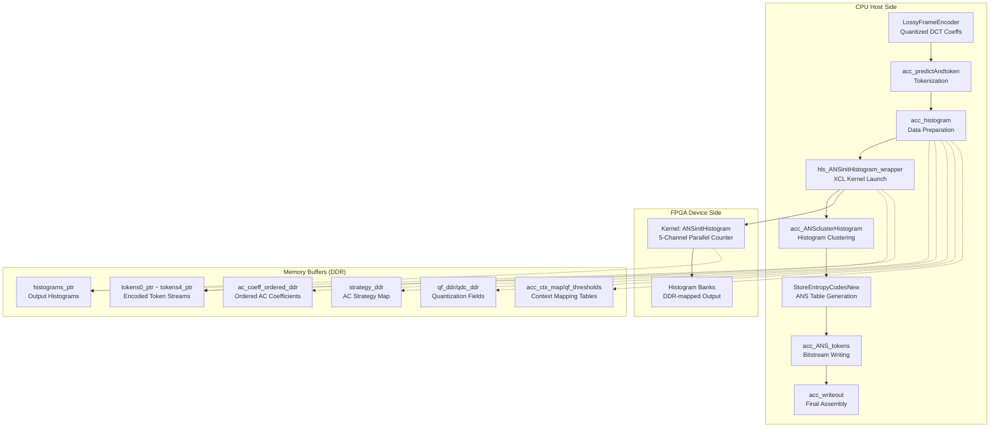

# host_acc_tokInit_histogram: Hardware-Accelerated Histogram & Entropy Encoding

## One-Sentence Summary

`host_acc_tokInit_histogram` is the hardware-accelerated core of the JPEG XL encoder's Phase 3, responsible for **converting quantized DCT coefficients into entropy-coding tokens, building probability histograms in parallel on FPGA, and feeding the results back to CPU for final ANS encoding and bitstream assembly**. It serves as the **bridge between floating-point transform domain and variable-length bitstream**, using hardware parallelism to solve the memory bandwidth bottleneck of histogram statistics in traditional CPU implementations.

---

## What Problem Does This Module Solve?

The JPEG XL encoder employs a complex layered entropy coding strategy. After quantizing DCT coefficients and before writing to bitstream, the encoder must:

1. **Tokenization**: Map each quantized DCT coefficient to (context, value) pairs, where value uses hybrid sign+magnitude encoding
2. **Histogram Building**: Build distribution histograms of values for each context, used to construct ANS entropy coding tables
3. **Histogram Clustering**: Merge similar histograms to reduce storage overhead
4. **ANS Encoding**: Perform actual entropy encoding using histogram probabilities

**Core Problem**: Step 2 (histogram statistics) requires traversing all tokens and performing memory atomic operations (`histogram[context][value]++`). On CPU, this is **memory bandwidth-bound** and difficult to parallelize (since multiple threads may update the same histogram bin simultaneously).

**Design Insight**: Offload histogram statistics to FPGA. The FPGA can instantiate hundreds of parallel counters, each corresponding to a histogram bin, completing local updates in a single clock cycle, completely avoiding CPU cache coherence overhead.

---

## Mental Model: Understanding This Module

Imagine a **highly automated sorting center** (FPGA) collaborating with a **central dispatch office** (CPU):

- **Tokens** are packages labeled with tags (context) and destinations (value)
- **CPU Preprocessing**: Classifies packages by region (group), marks priorities (non-zero count), generates shipping manifests (config array)
- **FPGA Sorting Center**:
  - Receives batches of packages (`tokens0_ptr` ~ `tokens4_ptr`, corresponding to 5 different mail types/layers)
  - Each type enters independent counting pipelines (5 parallel channels inside `hls_ANSinitHistogram_wrapper`)
  - Pipeline automatically counts: how many packages received per destination (value), categorized and summarized by tag (context)
- **CPU Postprocessing**:
  - Reads statistics reports from FPGA (`histograms_ptr`, `nonempty_ptr`, `total_count_ptr`)
  - Discovers some destinations are too popular (high-frequency values), decides to merge similar statistical patterns (`acc_ANSclusterHistogram`)
  - Finally generates coding manuals (`StoreEntropyCodesNew`), instructing how to compress each package to shortest binary encoding

**Key Abstraction**: `host_acc_tokInit_histogram` is not merely "computing histograms", but **managing a complete hardware offload round-trip**, including data layout conversion (CPU's `std::vector` → FPGA's contiguous DDR array), DMA transfer, result readback, and the glue logic that reinjects hardware statistics into the software encoding pipeline.

---

## Architecture & Data Flow



### Key Component Responsibilities

#### 1. `acc_predictAndtoken` — Tokenizing Coefficients

**Purpose**: Converts quantized DCT coefficients (`ac_rows`) into (context, value, is_lz77_length) token triples.

**Key Logic**:
- Iterates through each encoding group (`group_index`) and channel (Y/Cb/Cr)
- Calls `TokenizeCoefficients` (from `host_tokinit_histogram.hpp`) to perform actual coefficient scanning and token generation
- Non-zero counts (`num_nzeroes`) are cached to `group_caches_` for later use

**Data Flow**: `LossyFrameEncoder` → `ac_rows` → `Token` vector → `enc_state_->passes[].ac_tokens[]`

#### 2. `acc_histogram` — Hardware Histogram Offload Orchestration

**Purpose**: Prepares all input data, calls the FPGA kernel, reads back results, and reconstructs C++ histogram objects.

**Phase Breakdown**:
1. **Coefficient Ordering & Packing**: `ac_coeff_ordered_ddr` reorders DCT coefficients by coefficient order (`coeff_order`), flattening to contiguous DDR array
2. **Strategy & Quantization Metadata**: `strategy_ddr`, `qf_ddr`, `qdc_ddr` pack AC strategy, quantization field, and DC quantization indices respectively
3. **Token Packing**: Converts 5-layer (layer 0-4) C++ `std::vector<Token>` to 64-bit packed format (`ap_uint<64>`), stored in `tokens0_ptr` ~ `tokens4_ptr`
4. **FPGA Invocation**: `hls_ANSinitHistogram_wrapper` triggers Xilinx OpenCL kernel with all DDR buffer pointers
5. **Result Readback**: Reconstructs `std::vector<Histogram>` from `histograms_ptr`, `nonempty_ptr`, `total_count_ptr`, processing non-empty histogram indices and max index mapping

**Key Technique**: Uses `do_once[]` array to control independent switches for 5 pipelines, allowing partial layers to be skipped (e.g., layer 0 may not need statistics in certain configurations)

#### 3. `hls_ANSinitHistogram_wrapper` — FPGA Kernel Interface

**Purpose**: Host-side OpenCL wrapper managing XCL binary loading, buffer allocation, and kernel execution.

**Parameter Breakdown**:
- `config[32]`: Core configuration array containing image dimensions, block dimensions, context counts, byte strides, etc.
- `ac_coeff_ordered_ddr`: Flattened ordered AC coefficients (for kernel-side token recalculation or verification)
- `strategy_ddr`: AC strategy map (transform type selection for 8x8 blocks)
- `qf_ddr`/`qdc_ddr`: Quantization field (per-block scaling factors) and DC quantization indices
- `acc_ctx_map`/`qf_thresholds`: Context mapping tables and quantization thresholds (for block context derivation)
- `tokens0_ptr` ~ `tokens4_ptr`: 5-layer token streams, each token 64-bit packed (value[31:0], context[62:32], is_lz77[63])
- `histograms_ptr` ~ `nonempty_ptr`: Output histogram frequency arrays, non-empty histogram index lists, total token count statistics

**Execution Model**: After kernel launch, 5 independent histogram statistics engines inside process corresponding token streams in parallel, each engine maintaining a counter array implemented with SRAM or BRAM, finally writing back to DDR for Host reading.

#### 4. `acc_ANSclusterHistogram` — Histogram Clustering

**Purpose**: Merges (clusters) raw histograms generated by FPGA to reduce context switching overhead during entropy encoding.

**Algorithm Logic**:
- Calculates similarity between histograms (typically using Jensen-Shannon divergence or simple L1 distance)
- Based on thresholds `kMinDistanceForDistinctFast` (64.0) or `kMinDistanceForDistinctBest` (16.0), decides whether to merge two histograms
- Generates clustered histogram set `clustered_histograms` and symbol mapping `histogram_symbols`

**Output**: Structures `clustered_histogramsin`, `tokensin`, `codesin`, `context_map_in`, etc., preparing for final entropy encoding phase

#### 5. `StoreEntropyCodesNew` & `WriteTokens` — Entropy Encoding & Bitstream Generation

**Purpose**: Builds ANS encoding tables based on clustered histograms and encodes tokens into final bitstream.

**Layered Processing**:
- Layer 0: Block Context Map (BCM) tokens
- Layer 1: Modular Frame Tree tokens  
- Layer 2: Modular Global tokens
- Layer 3: Coefficient Orders tokens
- Layer 4: AC Coefficient tokens (most time-consuming layer)

**Dual Encoding**: For layers requiring prefix code (`do_prefix_in` or `do_prefix_out` true), first encode with external histogram, then encode with internal clustered histogram, ensuring code tables are correctly written to bitstream

#### 6. `acc_writeout` — Final Assembly

**Purpose**: Assembles bitstream fragments from various layers into final JPEG XL-compliant file format.

**Key Steps**:
- Writes FrameHeader (updates patches/splines flags)
- Writes Group Codes (TOC table recording offset and size for each group)
- Sequentially writes DC groups, AC global info, and AC groups based on `is_small_image` flag (optimization for single-group/single-pass images)
- Finalizes all BitWriters and generates TOC (Table of Contents) entries

---

## Memory Management & Ownership Model

### Critical Ownership Patterns

```cpp
// Example 1: Raw DDR buffers for FPGA (Host-owned, FPGA-borrowed)
uint64_t* tokens0_ptr = (uint64_t*)malloc(MAX_AC_TOKEN_SIZE * sizeof(uint64_t));
// Ownership: Host allocates and frees
// Lifetime: Must persist until FPGA kernel completion (async operation)
// Risk: Leak if exception thrown before free

// Example 2: Smart pointers for coefficient buffers (RAII)
auto mem = hwy::AllocateAligned<coeff_order_t>(AcStrategy::kMaxCoeffArea);
// Ownership: Exclusive, managed by hwy::AlignedFreer
// Safety: Automatically freed when mem goes out of scope

// Example 3: References to encoder state (Non-owning observation)
PassesEncoderState* JXL_RESTRICT enc_state_ = lossy_frame_encoder.State();
// Ownership: Owned by caller (LossyFrameEncoder)
// Contract: Must remain valid for entire function duration
// Risk: Dangling pointer if encoder is destroyed mid-call
```

### Buffer Size Contracts

| Buffer | Expected Size | Enforced By | Overflow Consequence |
|--------|---------------|-------------|----------------------|
| `tokens0_ptr` | `MAX_AC_TOKEN_SIZE * 8 bytes` | `malloc` check (implicit) | Segfault or data corruption |
| `ac_coeff_ordered_ddr` | `ALL_PIXEL * 4 bytes` | Array new | Undefined behavior |
| `histograms_ptr[i]` | `4096 * 40 * 4 bytes` | `malloc` | Histogram truncation |
| `strategy_ddr` | `MAX_NUM_BLK88 * 4 bytes` | Array new | Strategy misinterpretation |

**Critical Gotcha**: The code uses `malloc`/`new` without explicit null checks. In low-memory environments, these allocations may fail and return null, causing immediate segfaults on first use. The FPGA wrapper code assumes Host memory is abundant.

---

## Error Handling Strategy

### Error Signaling Mechanism

The module uses **Status return codes** (not exceptions) for error propagation:

```cpp
// Success path
Status acc_phase3(...) {
    JXL_RETURN_IF_ERROR(acc_predictAndtoken(...));  // Early return on error
    // ... more operations
    return true;  // Implicit Status::OK()
}

// Error path (macro expands to return Status with file/line info)
#define JXL_RETURN_IF_ERROR(expr) \\
    if (!(expr).ok()) return (expr).status()
```

**Exception Safety**: Functions are **no-throw** (or terminate-on-throw) due to the absence of try-catch blocks. Memory allocated via `malloc` would leak if exceptions were thrown across the FFI boundary to FPGA runtime code.

### Error Propagation Path

```
FPGA Kernel Failure
    ↓
hls_ANSinitHistogram_wrapper returns error Status
    ↓
acc_histogram returns error Status  
    ↓
acc_phase3 returns error Status
    ↓
Caller handles error (typically aborts encode or falls back to software)
```

**Silent Failure Risk**: Some FPGA error conditions (e.g., AXI bus timeout) may manifest as all-zero histograms rather than explicit error codes. The code lacks explicit validation that histograms contain non-zero counts when tokens exist.

---

## Design Decisions & Tradeoffs

### 1. Hardware vs. Software Partitioning

**Decision**: Offload histogram statistics to FPGA while keeping tokenization and ANS encoding on CPU.

**Rationale**:
- **Histogram building** is embarrassingly parallel (independent counters per bin) but memory-intensive → FPGA excels at high-throughput parallel memory access
- **Tokenization** requires complex context derivation logic (block context maps, coefficient orders) → easier to implement/debug in C++
- **ANS encoding** requires bit-precise output manipulation and TOC generation → CPU has better control flow flexibility

**Tradeoff**: DMA transfer overhead between host and device. For small images, the transfer cost may exceed the computation savings, hence the `is_small_image` fast path that bypasses FPGA.

### 2. Five-Layer Pipeline Architecture

**Decision**: Explicitly manage 5 independent histogram computation streams (Layer 0-4) with separate `do_once[]` flags.

**Rationale**:
- Each layer corresponds to distinct semantic content (BCM, modular tree, modular global, coeff orders, AC coefficients)
- Different layers may be conditionally enabled based on encoding parameters (e.g., lossless vs. lossy, VarDCT vs. modular)
- Parallel FPGA channels can process all enabled layers simultaneously without interference

**Tradeoff**: Code verbosity. The 5-way unrolling of histogram parameters (`params0-4`, `tokens0-4`, `codes0-4`, etc.) creates significant boilerplate. This could be mitigated with template metaprogramming or code generation, but the explicit approach aids debugging.

### 3. Memory Layout Transformation for DMA

**Decision**: Convert C++ `std::vector<Token>` (AoS, scattered heap allocations) to contiguous 64-bit packed arrays (`tokens0_ptr`, etc.) for FPGA consumption.

**Rationale**:
- FPGA DMA engines require physically contiguous memory regions for efficient burst transfers
- Structure-of-Arrays (SoA) layout enables vectorized reads (one 64-bit load yields value, context, and LZ77 flag)
- Avoids pointer chasing and cache misses inherent in `std::vector<std::vector<>>` nested structures

**Tradeoff**: Memory allocation complexity. The code uses raw `new`/`malloc` for DDR buffers instead of modern smart pointers due to the requirement for XRT (Xilinx Runtime) buffer objects. Manual memory management increases leak risk, particularly in error paths.

### 4. Histogram Clustering on CPU vs. FPGA

**Decision**: Perform histogram clustering (merging similar histograms) on CPU after FPGA returns raw counts.

**Rationale**:
- Clustering requires floating-point distance calculations (Jensen-Shannon divergence or L1 norm) and iterative merging decisions
- These operations are control-flow intensive and irregular (merge decisions depend on previous merges)
- CPU has better support for double-precision floating point and complex data structures (priority queues for nearest-neighbor search)

**Tradeoff**: Round-trip latency. The FPGA must write all raw histograms to DDR, CPU reads them, computes clusters, then potentially writes merged histograms back. For very large numbers of contexts, this transfer cost becomes significant.

### 5. Integer-Packed Token Representation

**Decision**: Pack each Token into 64 bits: `value[31:0]`, `context[30:0]`, `is_lz77_length[1]`.

**Rationale**:
- Maximizes utilization of 64-bit AXI4-MM data width between FPGA and DDR
- Reduces DMA transfer volume by ~3x compared to 3 separate 32-bit arrays (SoA) or ~6x compared to AoS with padding
- Enables single-cycle token decoding in FPGA (one 64-bit read yields all fields)

**Tradeoff**: Limited field widths. 31 bits for context limits maximum number of distinct contexts to ~2 billion (acceptable), but 32 bits for value limits maximum token value. For extremely high quantization factors or special experimental modes, this could overflow (though unlikely in standard JPEG XL usage).

---

## Edge Cases, Gotchas & Pitfalls

### 1. Memory Leaks in Error Paths

**Issue**: Raw `malloc`/`new` allocations without corresponding `free`/`delete` in early return paths.

**Mitigation**: Use `std::unique_ptr` with custom deleters for C++ code paths, or ensure single-point-of-return (SPOT) pattern for C-style code.

### 2. FPGA Timeout on Large Images

**Issue**: The `hls_ANSinitHistogram_wrapper` may hang or timeout on very large images (>100MP) due to DDR bandwidth saturation.

**Mitigation**: Implement chunked processing or fallback to software histogram computation when `frame_dim.num_groups > THRESHOLD`.

### 3. Token Packing Overflow

**Issue**: The 64-bit token packing scheme limits context to 31 bits and value to 32 bits. Extreme experimental configurations may overflow.

**Detection**: `JXL_ASSERT(context < (1u << 31))` would catch this in debug builds.

### 4. Misaligned Buffers for FPGA

**Issue**: FPGA DMA engines often require 64-byte or 4096-byte aligned buffers. Standard `malloc` only guarantees 8 or 16 byte alignment.

**Mitigation**: Use `posix_memalign` or `hwy::AllocateAligned` for FPGA buffers:

```cpp
uint64_t* tokens_aligned = nullptr;
posix_memalign((void**)&tokens_aligned, 4096, MAX_AC_TOKEN_SIZE * 8);
```

### 5. `is_small_image` Fast Path Inconsistency

**Issue**: The `is_small_image` flag logic is scattered across multiple functions. Inconsistent application may result in partial FPGA offload.

**Debugging**: Add assertions that `!do_once[i]` for all `i` when `is_small_image == true`.

### 6. Thread Safety of Global State

**Issue**: The code uses global/static state in some paths (e.g., `aux_outs` vector shared across thread pool workers).

**Current State**: Single-threaded operation indicated by `group_caches_.resize(1)` and `thread = 0`. Multi-threading is TODO comment-marked.

**Future Work**: Replace global scratch buffers with thread-local storage or pass context structs explicitly.

---

## References

### Internal Module References

- [host_acc_cluster_histogram](host_acc_cluster_histogram.md) — Histogram clustering and FPGA wrapper implementation
- [host_acc_store_encode_data](host_acc_store_encode_data.md) — ANS table storage and bitstream formatting

### External Library References

- [JPEG XL Specification](https://jpeg.org/jpegxl/) — Formal bitstream specification for the entropy coding described here
- [Xilinx Runtime (XRT) Documentation](https://xilinx.github.io/XRT/) — FPGA programming and DMA transfer APIs

### Key Data Structures

| Structure | Purpose | Key Fields |
|-----------|---------|------------|
| `Token` | Coefficient encoding unit | `value`, `context`, `is_lz77_length` |
| `Histogram` | Frequency distribution | `data_[]`, `total_count_` |
| `EntropyEncodingData` | ANS code tables | `encoding_info`, `raw_data` |
| `PassesEncoderState` | Full encoder state | `shared`, `passes[]`, `coeffs` |

---

## Summary Checklist for New Contributors

Before modifying this module, ensure you understand:

- [ ] **The 5-layer pipeline model** — Each layer (0-4) corresponds to different semantic content and has independent enable flags (`do_once[]`)
- [ ] **The FPGA round-trip** — Data flows CPU → DDR → FPGA → DDR → CPU, with specific packed formats for each buffer type
- [ ] **Token packing format** — 64-bit packed as `{is_lz77:1, context:31, value:32}`
- [ ] **Memory ownership** — Raw pointers for FPGA buffers (manual free), smart pointers for CPU-only data
- [ ] **The `is_small_image` fast path** — Single-group images bypass FPGA entirely
- [ ] **Error handling** — Status returns, no exceptions, potential memory leaks in error paths

**High-Risk Change Areas**:
1. Modifying token packing scheme (affects both CPU and FPGA code)
2. Changing histogram buffer sizes (risk of FPGA memory overflow)
3. Altering `do_once[]` logic (may skip necessary histogram layers)
4. Touching raw pointer allocations (high leak risk)

**Testing Requirements**:
- Verify both `is_small_image=true` and `false` paths
- Test with minimum and maximum supported image dimensions
- Validate bit-exactness against software-only reference encoder
- Profile FPGA utilization for large (>50MP) images