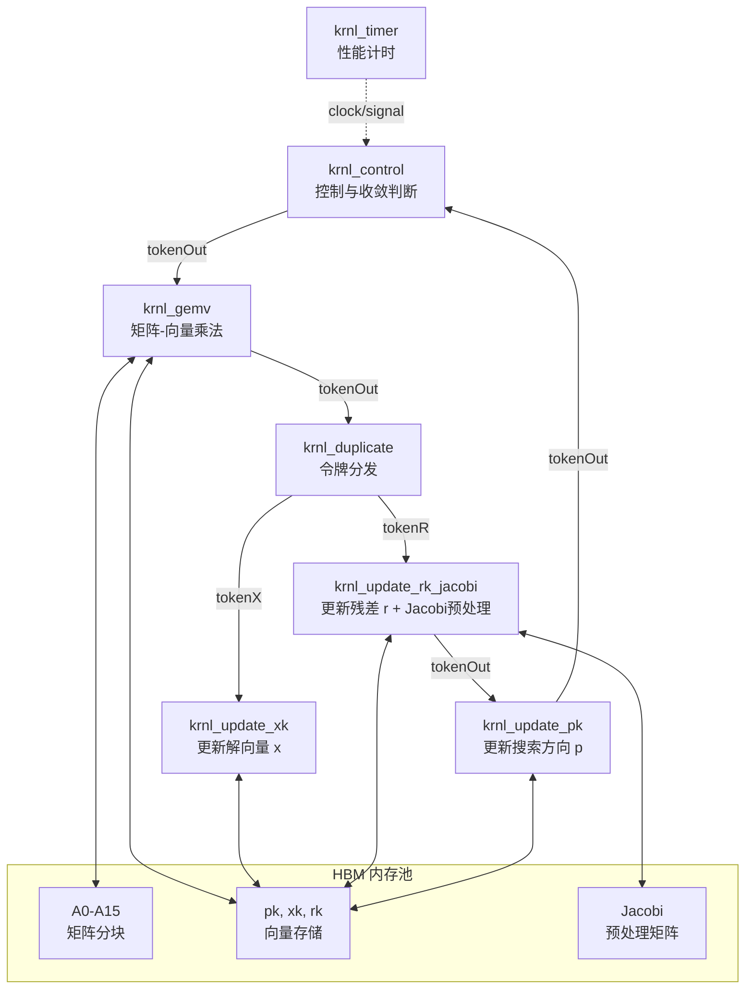

# HPC 迭代求解器流水线（Iterative Solver Pipeline）

## 概述：为什么需要这个模块？

在高性能计算（HPC）领域，**求解大规模稀疏线性系统** $Ax = b$ 是科学计算的核心瓶颈之一。这类问题出现在有限元分析、流体动力学模拟、电磁场求解等无数场景中。当矩阵 $A$ 的维度达到百万甚至千万级时，传统的直接求解器（如 LU 分解）在计算复杂度和内存需求上都变得不可接受。

**共轭梯度法（Conjugate Gradient, CG）** 是一种针对对称正定矩阵的迭代算法，它通过反复执行矩阵-向量乘法（GEMV）和向量更新操作，逐步逼近解向量 $x$。理论上，CG 最多需要 $n$ 次迭代（$n$ 为矩阵维度），但通常远少于这个数值就能达到机器精度。

**本模块的核心使命** 是将 CG 算法映射到 FPGA 异构加速平台上，通过**流水线化（pipelining）** 和 **数据并行化** 来隐藏延迟、提升吞吐。它不是一个简单的算法移植，而是一个完整的**生产级求解流水线**，处理内存带宽瓶颈、浮点精度管理、迭代收敛判断、以及不同 FPGA 平台（U280 vs U50）的硬件差异。

想象这个模块就像一条**精密装配线**：矩阵-向量乘法是"重型机械"，负责大部分计算；向量更新操作是"精密组装工"，调整解向量和搜索方向；控制逻辑是"生产线调度员"，决定何时开始下一轮迭代；而高速 HBM 内存则是"原料仓库"，必须以精确的时序 feeding 这条流水线。

---

## 架构全景：流水线的心脏

### 核心设计理念

本架构采用**数据流驱动（Dataflow-Driven）** 设计，而非传统的控制流（Control-Flow）架构。这意味着计算不是由中央控制器逐步驱动，而是由**令牌（Tokens）** 在核间传递来触发。当一个核完成计算，它向下游发送一个令牌，下游核接收到令牌后立即开始工作。

这种设计的核心优势是**天然流水线化**：不需要复杂的线程同步或锁机制，数据依赖性通过令牌流的拓扑结构显式表达。这非常契合 FPGA 的细粒度并行特性——每个内核是一个独立的硬件状态机，通过 AXI4-Stream 接口进行确定性通信。

### 内核拓扑与数据流

下图展示了 CG 迭代求解流水线的内核拓扑结构。每个方框代表一个 Vitis HLS 生成的内核，箭头代表 AXI4-Stream 令牌流或 AXI4-Full 内存访问。

### 内核职责详解

**1. krnl_control（控制内核）**
这是流水线的"指挥中心"。它维护迭代计数器，监控残差范数以判断收敛，并向 krnl_gemv 发送初始令牌启动新一轮迭代。当接收到 krnl_update_pk 返回的令牌时，它检查收敛条件：如果已收敛，则停止发送新令牌；否则继续下一轮 CG 迭代。它还连接 krnl_timer 以测量 wall-clock 执行时间。

**2. krnl_gemv（矩阵-向量乘法内核）**
这是计算最密集的内核，执行稀疏或密集矩阵-向量乘法 $Ap$（其中 $p$ 是搜索方向向量）。从内存架构看，它通过 16 个独立的 AXI4-Full 接口（m_axi_gmem_A0 到 m_axi_gmem_Af）并行访问矩阵的不同分块，这些接口映射到 HBM 的不同通道以实现最大化带宽。这是**分块并行（blocked parallelism）**策略的核心体现。

**3. krnl_duplicate（令牌分发内核）**
这是一个简单的流复制节点，将 krnl_gemv 的输出令牌广播到两个下游分支：一个流向 krnl_update_xk（更新解向量），另一个流向 krnl_update_rk_jacobi（更新残差）。这实现了数据流图中的**分叉（fork）**模式，允许两个更新操作并行执行。

**4. krnl_update_xk（解向量更新内核）**
执行 CG 算法中的解更新步骤：$x_{k+1} = x_k + \alpha_k p_k$。其中 $\alpha_k$ 是上一步计算的步长。该内核从 HBM 读取当前解 $x_k$ 和搜索方向 $p_k$，计算更新后的 $x_{k+1}$，然后写回内存。

**5. krnl_update_rk_jacobi（残差更新与 Jacobi 预处理内核）**
这是 CG 流水线中最复杂的更新内核，执行两个关键操作：
- 残差更新：$r_{k+1} = r_k - \alpha_k A p_k$
- **Jacobi 预处理**：计算预处理后的向量 $z_{k+1} = M^{-1} r_{k+1}$，其中 $M^{-1}$ 是 Jacobi 预处理矩阵（即 $A$ 的对角线元素的逆）

预处理是 CG 加速收敛的关键技术，Jacobi 是最简单的预处理形式，在每次迭代中将残差按对角线元素缩放。

**6. krnl_update_pk（搜索方向更新内核）**
执行 CG 算法的关键步骤：$p_{k+1} = z_{k+1} + \beta_k p_k$，其中 $\beta_k$ 是 Polak-Ribière 或 Fletcher-Reeves 公式计算的系数，确保新的搜索方向与之前所有方向共轭。这是 CG 相比最速下降法效率更高的核心原因。

**7. krnl_timer（性能计时内核）**
简单的辅助内核，通过 AXI4-Lite 接口暴露时钟计数器，供 krnl_control 读取以测量总执行时间和每轮迭代耗时。这对于性能调优和 roofline 分析至关重要。

---

## 关键注意事项与常见陷阱

### 1. 令牌顺序与死锁风险

**陷阱**：`krnl_duplicate` 将单个输入令牌复制为两个输出令牌。如果下游的 `krnl_update_xk` 和 `krnl_update_rk_jacobi` 处理速度不同，流的反压（back-pressure）可能导致 `krnl_duplicate` 阻塞。虽然 DATAFLOW 的 FIFO 缓冲可以缓解，但如果后续 `krnl_update_pk` 和 `krnl_control` 形成反馈环，任何阶段的对齐（misalignment）都可能导致**死锁**。

**应对**：确保所有内核的 `hls::stream` 有足够的深度（通常为 2-4）来吸收瞬态的速度差异。在仿真阶段使用 Vitis 的死锁检测工具验证令牌守恒。

### 2. HBM 通道的伪通道（Pseudo-Channel）陷阱

**陷阱**：虽然配置文件中使用了 HBM[0] 到 HBM[31] 的编号，但物理上 U280 的 HBM 由多个堆叠（stack）组成，每个堆叠有独立的控制器。如果连续的 HBM 编号实际上映射到同一物理堆叠的不同伪通道，**跨堆叠的访问并行性**可能不如预期。

**应对**：在 U280 上，HBM[0]-HBM[15] 通常映射到不同的伪通道以确保真正的并行。但需要通过实际的内存带宽测试（如 Xilinx 的 xbutil 工具）验证每个通道的独立带宽。对于 U50，通道数更少，更应关注避免通道争用。

### 3. 双缓冲的索引计算错误

**陷阱**：双缓冲逻辑（ping-pong）依赖于迭代次数 $k$ 的奇偶性来选择读取/写入的 HBM 基址。如果 `krnl_control` 中的 $k$ 计数与更新内核中的 $k$ 出现不同步（例如，由于令牌丢失或重复），将导致**读取未初始化的内存区域（pong 区域在第 0 轮时仍是垃圾值）**，产生静默的错误结果而非崩溃。

**应对**：在硬件仿真（Hardware Emulation）模式下启用内存检查器（Memory Checker），验证每个 HBM 访问的地址是否在预期的 ping 或 pong 范围内。在控制内核中加入调试寄存器暴露当前的 $k$ 值，与软件参考模型对比。

### 4. Jacobi 预处理矩阵的初始化遗漏

**陷阱**：`krnl_update_rk_jacobi` 依赖预先计算并存储在 HBM[28]（U280）或 HBM[27]（U50）的 Jacobi 预处理矩阵 $M^{-1}$（即 $A$ 的对角线元素的逆）。如果主机程序在启动内核前**未正确初始化该矩阵**（例如，遗漏了对角线元素的求逆，或使用了错误的存储格式），CG 迭代仍会进行，但**收敛速度将大幅减慢**（甚至不收敛），且不会触发明显的错误。

**应对**：在主机代码中加入 `xclbin` 加载后的验证步骤，读取预处理矩阵的几个样本元素，验证其等于 $1/A_{ii}$。在内核中加入可选的调试模式，将 $M^{-1}$ 的对角线元素输出到日志。

### 5. 浮点精度与收敛判据的微妙关系

**陷阱**：CG 算法对浮点舍入误差敏感。在 FPGA 上，使用单精度浮点（float）而非双精度（double）时，**残差范数的计算可能因累加顺序不同而与 CPU 参考实现产生微小差异**。如果收敛阈值设置得过于激进（接近机器精度），可能导致"虚假不收敛"（迭代次数超过理论值）或"虚假收敛"（残差范数在阈值附近震荡）。

**应对**：建立 FPGA 结果与 CPU 参考实现的对比框架，验证在相同矩阵和初值下，两者达到相同残差范数所需的迭代次数差异在 5% 以内。使用 Kahan 求和或更高精度的累加器（如 DSP48 的宽累加模式）计算残差范数。

---

## 平台配置子模块

本模块针对不同 FPGA 平台的硬件特性，提供了专门的连接配置：

- **[U280 平台配置](hpc_iterative_solver_pipeline-conn_u280_cfg.md)**：针对 Alveo U280 卡的高带宽内存（HBM）架构优化，利用 32GB HBM 和 32 个伪通道实现最大化矩阵带宽。

- **[U50 平台配置](hpc_iterative_solver_pipeline-conn_u50_cfg.md)**：针对 Alveo U50 卡的资源受限环境优化，在 8GB HBM 和较少通道数约束下平衡性能与资源使用。
