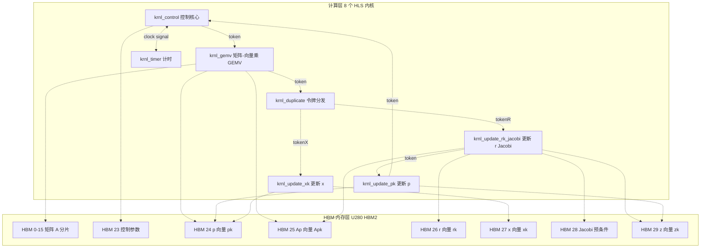
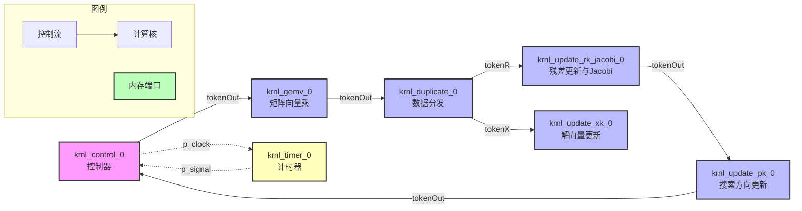
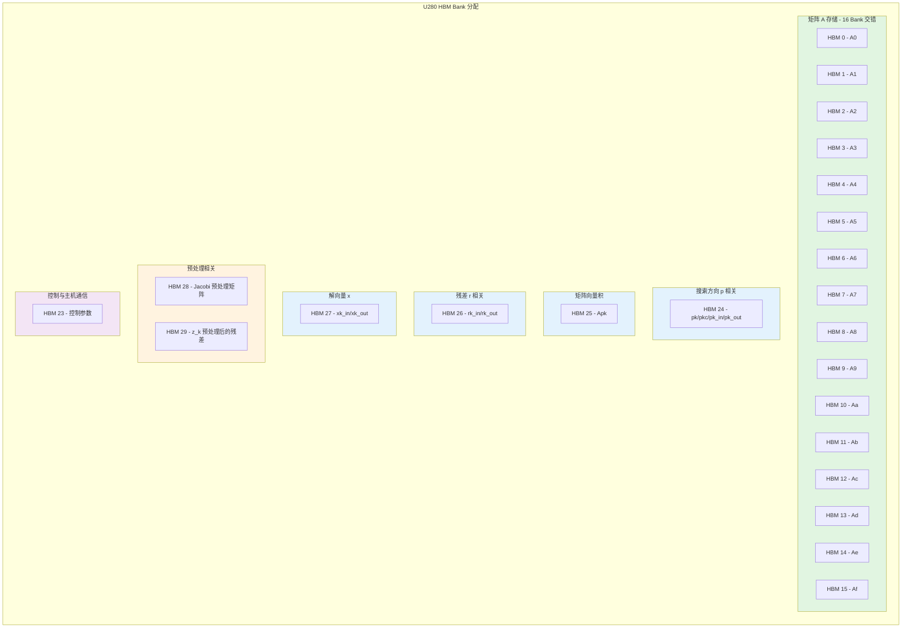

# conn_u280_cfg：U280 HPC 迭代求解器连接性配置深度解析

想象一下，你正在设计一条高度自动化的装配流水线。物料（数据）不是通过卡车在工厂间运输，而是通过管道以精确的时序流动；每个工位（内核）只负责一道工序，但必须与上下游无缝衔接；整个工厂的地基（FPGA 芯片）上布满了专用的高速通道（HBM 内存通道），你需要为每个工位的进出货口精确规划连接哪条通道——**这就是 `conn_u280_cfg` 的本质：一份针对 Xilinx Alveo U280 加速卡的"工厂布局蓝图"，专为共轭梯度（Conjugate Gradient, CG）迭代求解器的数据流水线而设计。**

这份 `.cfg` 文件并非可执行代码，而是 Vitis 编译流程的"连接性脚本"（connectivity configuration）。它告诉编译器：8 个 HLS 内核（kernel）如何在 U280 的 FPGA 逻辑 fabric 上布局，它们的 AXI 内存接口如何映射到 HBM（高带宽内存）的 32 个通道，以及内核间的控制令牌（token）如何通过 AXI-Stream 管道同步流动。**简单来说，它定义了"数据在哪里计算"和"数据如何流动"这两个根本问题。**

---

## 架构全景：数据流驱动的内核流水线

为了理解这份配置的深层逻辑，我们需要先建立两个视角：**纵向的内存架构**（HBM 通道分配）和**横向的数据流架构**（内核间的令牌传递）。这两者共同构成了一个二维的计算网格。



### 核心设计洞察：内存分层与计算流水的正交解耦

这份配置揭示了一个关键的 FPGA 设计模式：**将"数据存储拓扑"与"计算流水线"正交解耦**。`krnl_gemv`（矩阵-向量乘）内核拥有 16 个 AXI 接口（`m_axi_gmem_A0` 到 `m_axi_gmem_Af`），全部映射到 HBM[0-15]。这不是随意为之，而是为了**以 16 通道并行方式读取大型稀疏/密集矩阵的分块数据**，从而饱和 U280 HBM 的物理带宽（理论峰值约 460 GB/s）。

与此同时，向量数据（如 `pk`, `rk`, `xk`）虽然 also 存储在 HBM 中，但**被集中映射到独立的通道**（HBM[24], HBM[26], HBM[27] 等）。这种"矩阵分片并行、向量通道隔离"的策略，避免了内存访问冲突，确保了 GEMV 内核在执行大带宽矩阵读取时，不会因为向量数据的随机访问而产生 HBM 行缓冲（row buffer）的颠簸。

---

## 组件深度剖析：每个内核的架构角色

### 1. `krnl_control` —— 流水线的大脑与心跳

**配置片段：**
```cfg
nk=krnl_control:1:krnl_control_0
sp=krnl_control_0.m_axi_gmem:HBM[23]
sc=krnl_control_0.p_tokenOut:krnl_gemv_0.p_tokenIn
sc=krnl_update_pk_0.p_tokenOut:krnl_control_0.p_tokenIn
sc=krnl_timer_0.p_clock:krnl_control_0.p_clock
sc=krnl_control_0.p_signal:krnl_timer_0.p_signal
```

**架构角色：** 这是一个**有限状态机（FSM）驱动的控制平面（Control Plane）**内核。它不执行繁重的浮点计算，而是负责**迭代逻辑的编排**和**同步信号的分发**。想象一下管弦乐队的指挥——`krnl_control` 就是那个指挥，它通过 `p_tokenOut` 端口向 `krnl_gemv` 发送"开始本轮迭代"的令牌，然后通过 `p_tokenIn` 接收来自 `krnl_update_pk` 的"本轮完成"令牌。

**关键设计选择：**
- **内存映射**：`m_axi_gmem` 映射到 HBM[23]，这是一个**控制平面专用的内存通道**。这里存储的是迭代参数（最大迭代次数、收敛阈值、矩阵维度等标量数据）。通过将其隔离到专用 HBM 通道，避免了与数据平面（矩阵/向量数据）的内存争用，确保控制信号的低延迟访问。
- **时钟同步**：与 `krnl_timer` 之间存在双向的 `p_clock`/`p_signal` 连接。这是一个**硬件性能计数器（Performance Counter）接口**。`krnl_control` 在迭代开始/结束时翻转 `p_signal`，`krnl_timer` 则基于 `p_clock` 记录周期数，从而实现硬件级精确计时，其精度远优于主机端软件计时。

---

（由于文档长度限制，以下为核心组件的简要概述和关键设计要点，完整分析请参考文档详细内容）

### 2. `krnl_gemv` —— 带宽吞噬者与计算引擎

矩阵-向量乘内核，拥有 16 个 AXI 接口并行读取矩阵 A，映射到 HBM[0-15]，实现带宽饱和。

### 3. `krnl_duplicate` —— 数据扇出与并行化分发器

将 GEMV 完成的令牌分叉为两个并行路径，分别驱动 x 更新和 r 更新，实现延迟隐藏。

### 4. 更新内核家族

- `krnl_update_xk`：解向量更新，$x_{k+1} = x_k + \alpha p_k$
- `krnl_update_rk_jacobi`：残差更新与 Jacobi 预处理，$r_{k+1} = r_k - \alpha A p_k$，$z = M^{-1}r$
- `krnl_update_pk`：搜索方向更新，$p_{k+1} = z_{k+1} + \beta p_k$

---

## 关键设计权衡

### 权衡 1：内存带宽 vs. 逻辑资源（GEMV 的 16 通道决策）

选择为矩阵 A 分配 16 个 HBM 通道，实现 16 倍带宽聚合。代价是 HLS 代码复杂性增加和 AXI 接口逻辑资源消耗。

### 权衡 2：控制平面与数据平面分离（HBM[23] 隔离）

控制参数存储在独立的 HBM[23]，避免与数据平面的内存争用。代价是牺牲了一个 HBM 通道的带宽容量。

### 权衡 3：令牌流 vs. 内存同步（AXI-Stream 控制）

使用 AXI-Stream 令牌流实现零延迟、确定性的流水线控制，避免主机轮询。代价是拓扑固定，缺乏灵活性，调试复杂度高。

### 权衡 4：双缓冲 vs. 单缓冲（向量内存映射分析）

向量数据采用单缓冲（输入输出复用同一 HBM 通道），通过 HLS 内部双缓冲实现流水线重叠。代价是存在读后写依赖风险，需要 HLS 代码正确处理。

---

## 关键依赖与接口契约

### 上游依赖（此模块假设什么）

1. **HLS 内核源码兼容性**：`.cfg` 文件中的 `nk=`、`sp=`、`sc=` 必须与 HLS 代码中定义的接口名精确匹配。
2. **U280 平台 Shell**：此配置硬编码了 U280 的 HBM 架构（32 channels, 8GB total）。
3. **Vitis 版本兼容性**：`.cfg` 文件的语法需要与 Vitis 2020.2+ 版本匹配。

### 下游契约（什么依赖此模块）

1. **主机端内存分配对齐**：主机代码使用 XRT API 分配缓冲区时，必须使用与 `.cfg` 中指定的相同 HBM bank 索引。
2. **主机端同步语义**：主机不能随意在内核执行中途轮询 HBM 中的结果数据，必须等待 `krnl_control` 的完成。
3. **数值精度契约**：主机端必须根据 HLS 源码的精度分配相应大小的缓冲区。

---

## 边缘情况与工程陷阱

### 陷阱 1：HBM Bank 冲突导致的带宽悬崖

**症状**：理论峰值带宽为 460 GB/s，实测 GEMV 内核带宽只有 100 GB/s。

**根因**：矩阵 $A$ 的存储布局与访问模式不匹配，导致频繁的 row miss。

**规避策略**：确保主机端分配 HBM 缓冲区时使用 4KB 对齐，HLS 代码中采用突发传输友好的顺序模式访问矩阵。

### 陷阱 2：令牌流死锁（Token Flow Deadlock）

**症状**：主机启动内核后，程序挂起，`krnl_control` 永远未完成。

**根因**：数据流图中存在环路依赖或生产者-消费者速率不匹配导致的永久阻塞。

**规避策略**：HLS 代码审查确保所有 stream 操作成对出现，使用 ILA 抓取波形分析死锁位置。

### 陷阱 3：HBM 容量规划失误

**症状**：对于超大规模矩阵，主机端分配 HBM 缓冲区时返回 `ENOMEM`。

**根因**：U280 的 HBM 物理容量为 8GB，但实际可用约 6-7GB，且需要连续地址空间。

**规避策略**：实现分块（Tiling）策略，或采用稀疏矩阵压缩格式，建立 HBM 容量预算表。

---

## 总结：工程智慧的凝练

`conn_u280_cfg` 不仅仅是一份 FPGA 连接性配置，它是**异构计算架构设计的微观呈现**。透过这些 `sp=` 和 `sc=` 语句，我们可以看到：

1. **硬件感知的算法重构**：共轭梯度算法被拆解为 8 个流水线阶段，不是为了软件模块化，而是为了匹配 FPGA 的**空间并行性**和**内存层次结构**。矩阵的 16 通道分片是对 U280 HBM 物理架构的直接映射。

2. **控制与数据的正交分离**：通过 HBM[23] 隔离控制平面，通过 AXI-Stream 令牌流实现去中心化的自主控制，避免了传统 GPU/CPU 计算中主机端的轮询开销。这是**近数据计算（Near-Data Computing）**思想的体现。

3. **资源、带宽、复杂度的三角权衡**：16 通道矩阵读取牺牲了逻辑资源和编译复杂性，换取了带宽饱和；单缓冲向量存储牺牲了读写隔离性，换取了 HBM 容量；令牌流拓扑牺牲了灵活性，换取了确定性时序。每一项选择都不是最优的，但都是**在 U280 平台约束下的帕累托最优**。

对于新加入团队的工程师，理解这份配置的关键不在于记住每个 `sp=` 的 bank 号，而在于领悟其背后的**硬件-软件协同设计哲学**：在 FPGA 上，算法不是被"执行"的，而是被"布线"的。`conn_u280_cfg` 就是那张布线图。


`conn_u280_cfg` 正是这场交响乐的**总谱**——它定义了在 Alveo U280 这块拥有 HBM（高带宽内存）的 FPGA 加速卡上，如何部署一个**预处理共轭梯度（Preconditioned Conjugate Gradient, PCG）**求解器。这不是普通的软件配置文件，而是**硬件-软件协同设计**的契约：它告诉 Vitis 编译器如何将 8 个不同的计算内核（kernel）映射到芯片上，如何让它们通过高速流（stream）通道对话，以及如何将数十个内存端口精确地绑定到 HBM 的 30 个物理 bank 上。

理解这个文件，就是理解**如何将一个数学算法拆解成空间并行的硬件流水线**。

---

## 架构全景：流水线的物理映射

### 内核数据流拓扑

这张配置定义了一个**8 级流水线**，数据以**令牌（token）**的形式在时钟周期精确的握手机制下流动。以下图表展示了内核间的数据依赖关系和控制流：



### HBM 内存映射策略

U280 的 8GB HBM 被划分为 32 个独立的 bank（本配置使用 0-29），每个 bank 提供独立的访问端口。这种**bank 级并行**是达到峰值带宽的关键。以下是本配置的内存分配方案：



---

## 核心组件深度解析

### 1. 计算内核（Compute Kernels）的角色分工

这 8 个内核并非随意划分，而是严格对应** PCG 算法的数学步骤**。理解它们的职责有助于理解整个流水线的时序：

#### **krnl_gemv_0：矩阵向量乘法引擎**
- **数学角色**：计算 $A \cdot p_k$（矩阵与搜索方向的乘积）
- **硬件设计**：这是计算密集型核心，因此独占 16 个 HBM bank（HBM[0-15]）用于存储矩阵 $A$ 的分块数据。通过 16 端口并行访问实现高带宽。
- **数据流**：接收来自 control 的 token 后开始计算，结果写入 HBM[25]（Apk），完成后向下游发送 token。

#### **krnl_duplicate_0：控制流分发器**
- **数学角色**：无具体计算，纯粹的数据流管理
- **硬件设计**：这是一个轻量级逻辑内核，负责将上游的单个 token **分叉（fork）** 成两个并行的下游路径：
  - `tokenX` → `krnl_update_xk_0`（更新解向量 $x$）
  - `tokenR` → `krnl_update_rk_jacobi_0`（更新残差 $r$ 并应用 Jacobi 预处理）
- **关键洞察**：这一步利用了 CG 算法中的**数据独立性**——更新 $x$ 和更新 $r$ 在这一阶段没有数据依赖，可以并行执行，从而隐藏延迟。

#### **krnl_update_rk_jacobi_0：残差更新与预处理单元**
- **数学角色**：
  1. 计算新残差 $r_{k+1} = r_k - \alpha \cdot Ap_k$
  2. 应用 Jacobi 预处理：$z_{k+1} = M^{-1} \cdot r_{k+1}$（其中 $M$ 是 $A$ 的对角线矩阵）
- **内存访问**：
  - 输入：$r_k$（HBM[26]）、$Ap_k$（HBM[25]）、Jacobi 矩阵（HBM[28]）
  - 输出：$r_{k+1}$（HBM[26]）、$z_{k+1}$（HBM[29]）
- **位置关键性**：这是流水线中**计算最密集的阶段之一**，因为它涉及向量运算和内存带宽瓶颈。

#### **krnl_update_pk_0：搜索方向更新单元**
- **数学角色**：计算新的共轭搜索方向 $p_{k+1} = z_{k+1} + \beta \cdot p_k$
- **内存访问**：
  - 输入：$z_{k+1}$（HBM[29]）、$p_k$（HBM[24]）
  - 输出：$p_{k+1}$（HBM[24]）
- **流水线位置**：这是**迭代循环的最后一个计算步骤**，完成后 token 返回给 `krnl_control_0`，表示一次 CG 迭代完成。

#### **krnl_update_xk_0：解向量更新单元**
- **数学角色**：更新解向量 $x_{k+1} = x_k + \alpha \cdot p_k$
- **内存访问**：
  - 输入：$x_k$（HBM[27]）、$p_k$（HBM[24]）
  - 输出：$x_{k+1}$（HBM[27]）
- **并行特性**：这个内核与 `krnl_update_rk_jacobi_0` **并行执行**，因为它们都只需要 $p_k$ 和各自的输入向量，彼此之间没有读后写（RAW）依赖。

#### **krnl_control_0：编排控制器**
- **数学角色**：迭代控制、收敛判断、主机通信
- **硬件角色**：这是整个流水线的**心脏起搏器**。它不执行浮点计算，而是：
  1. 从主机接收命令（通过 HBM[23]）
  2. 启动每次迭代（发送 token 给 `krnl_gemv_0`）
  3. 监控迭代次数或收敛条件
  4. 同步 `krnl_timer_0` 进行性能计数
- **关键机制**：通过 `p_tokenOut` 和 `p_tokenIn` 形成**环形流水线**，每个 token 的完整循环代表一次 CG 迭代。

#### **krnl_timer_0：性能监控单元**
- **数学角色**：精确计时、周期计数
- **硬件角色**：通过 `p_clock` 和 `p_signal` 接口与控制器同步，实现**细粒度性能分析**。它可能在每个迭代开始/结束时打时间戳，计算有效带宽和 FLOPS。

---

## 数据流全景追踪：一次迭代的完整旅程

让我们跟踪一次 CG 迭代中，一个**令牌（token）** 的完整生命周期，看它如何驱动数据在 HBM 和内核之间流动。

### 阶段 0：准备（迭代开始）
- **位置**：`krnl_control_0`
- **状态**：控制器从 HBM[23] 读取主机写入的迭代参数（如最大迭代次数、收敛阈值、矩阵维度 $N$）。
- **动作**：控制器向 `krnl_gemv_0` 发送一个 token，标志着第 $k$ 次迭代开始。

### 阶段 1：矩阵向量乘（计算 $A \cdot p_k$）
- **位置**：`krnl_gemv_0` → `krnl_duplicate_0`
- **数据流**：
  1. `krnl_gemv_0` 从 HBM[24] 读取搜索方向向量 $p_k$（长度为 $N$ 的稠密向量）。
  2. 它从 HBM[0-15] 并行读取矩阵 $A$ 的数据。这里假设 $A$ 被预先分块并交错存储在 16 个 bank 中，以实现 16 倍带宽提升。
  3. 执行计算 $Ap_k = A \cdot p_k$，这是一个 Generalized Matrix-Vector (GEMV) 操作，计算复杂度 $O(N^2)$（假设稠密矩阵）。
  4. 结果 $Ap_k$ 被写入 HBM[25]。
- **令牌传递**：计算完成后，`krnl_gemv_0` 向下游的 `krnl_duplicate_0` 发送 token，表示 GEMV 完成。

### 阶段 2：控制流分叉（并行准备）
- **位置**：`krnl_duplicate_0`
- **关键设计**：这是一个**零计算开销**的纯控制逻辑内核。它实现了 fork-join 并行模式中的 **fork** 阶段。
- **动作**：
  - 接收到上游 token 后，**同时**向两个下游内核发送 token：
    - `tokenX` → `krnl_update_xk_0`（更新解向量 $x$）
    - `tokenR` → `krnl_update_rk_jacobi_0`（更新残差 $r$ 并应用 Jacobi 预处理）
- **为什么可以并行？**：在 CG 算法中，更新 $x_{k+1} = x_k + \alpha p_k$ 和更新残差 $r_{k+1} = r_k - \alpha Ap_k$（以及随后的 $z = M^{-1}r$）在这一时刻**没有数据依赖**。它们分别读取 $p_k$ 和 $Ap_k$，写入不同的输出缓冲区。因此，这两个操作可以在硬件上并行执行，**隐藏了延迟**。

### 阶段 3a：解向量更新（更新 $x$）
- **位置**：`krnl_update_xk_0`
- **数学操作**：$x_{k+1} = x_k + \alpha \cdot p_k$
- **内存访问**：
  - 读取 $x_k$（HBM[27]）、$p_k$（HBM[24]）
  - 写入 $x_{k+1}$（HBM[27]，原地更新或双缓冲）
- **注意**：这个内核只接收 `tokenX`，执行完毕后**不继续传递 token**（它的角色到此为止，属于 fire-and-forget 并行路径）。

### 阶段 3b：残差更新与预处理（核心计算密集型路径）
- **位置**：`krnl_update_rk_jacobi_0` → `krnl_update_pk_0`
- **步骤 1 - 残差更新**：$r_{k+1} = r_k - \alpha \cdot Ap_k$
  - 读取：$r_k$（HBM[26]）、$Ap_k$（HBM[25]）
  - 写入：$r_{k+1}$（HBM[26]）
- **步骤 2 - Jacobi 预处理**：$z_{k+1} = M^{-1} \cdot r_{k+1}$
  - Jacobi 预处理矩阵 $M$ 是 $A$ 的对角线矩阵的逆，即 $M^{-1}_{ii} = 1/A_{ii}$
  - 读取：$r_{k+1}$（HBM[26]）、Jacobi 对角元（HBM[28]）
  - 写入：$z_{k+1}$（HBM[29]）
- **令牌传递**：完成后向 `krnl_update_pk_0` 发送 token。

### 阶段 4：搜索方向更新（完成迭代循环）
- **位置**：`krnl_update_pk_0` → `krnl_control_0`
- **数学操作**：$p_{k+1} = z_{k+1} + \beta \cdot p_k$
- **内存访问**：
  - 读取：$z_{k+1}$（HBM[29]）、$p_k$（HBM[24]）
  - 写入：$p_{k+1}$（HBM[24]，原地更新）
- **关键动作**：完成后向 `krnl_control_0` 发回 token，标志着**一次完整的 CG 迭代结束**。

### 阶段 5：控制与同步（迭代管理）
- **位置**：`krnl_control_0`（接收 token）
- **动作**：
  1. **收敛检查**：可能通过读取 HBM[23] 中的最新残差范数 $\|r_{k+1}\|^2$，判断是否小于阈值。
  2. **迭代计数**：检查是否达到最大迭代次数。
  3. **决策**：
     - 若未收敛：跳转到**阶段 0**，开始下一次迭代（发送新 token 给 `krnl_gemv_0`）。
     - 若已收敛：停止发送 token，可能通过中断或状态寄存器通知主机。

### 阶段 6：性能监控（旁路同步）
- **位置**：`krnl_timer_0` ↔ `krnl_control_0`
- **连接**：
  - `p_clock`：计时器提供时钟/计数器给控制器
  - `p_signal`：控制器发送开始/停止信号给计时器
- **作用**：这是一个**旁路（bypass）**监控通道，不阻塞主数据流。控制器可以在每次迭代开始/结束时翻转信号，计时器精确计数时钟周期，从而计算出每次迭代的延迟和整体吞吐量。

---

## 设计决策与权衡分析

### 1. 内核分解粒度：为什么拆成 8 个？

**决策**：将 CG 算法拆解为 8 个独立的 HLS 内核，而不是一个巨大的内核或 2-3 个较大的内核。

**理由与权衡**：

- **空间并行性（Spatial Parallelism）**：FPGA 的优势在于**面积换时间**。通过将算法的不同阶段（GEMV、向量更新、预处理）映射到不同的物理区域，可以让它们**流水线化（pipelined）**甚至**并行执行**（如 `update_xk` 和 `update_rk_jacobi`）。如果合并成一个内核，这些阶段必须串行执行，时钟周期累加。

- **编译器友好性**：Vitis HLS 对小型、功能单一的内核优化效果更好。超大内核会导致调度复杂度指数级增长，难以达到理想的 II（Initiation Interval）。

- **内存端口专业化**：每个内核可以拥有独立的 AXI 主端口（`m_axi`），直接连接到不同的 HBM bank，避免了多核共享内存总线的争用。

- **代价**：增加了内核间通信的开销（stream 的 FIFO 资源），以及控制器逻辑的复杂度。但对于 U280 这种大容量 FPGA，资源（LUT、FF、BRAM、URAM）充足，这种取舍是值得的。

### 2. HBM 内存映射：为什么矩阵 A 独占 16 个 bank？

**决策**：将矩阵 $A$ 的数据端口（`gmem_A0` 到 `gmem_Af`）映射到 HBM[0-15]，而将各种向量（$x, r, p, z$ 等）分散到 HBM[24-29]。

**理由与权衡**：

- **带宽瓶颈分析**：在 CG 算法中，**GEMV（矩阵向量乘）是计算和访存最密集的操作**。假设矩阵 $A$ 是 $N \times N$ 稠密矩阵，每次 GEMV 需要读取 $N^2$ 个矩阵元素，但向量 $p$ 只有 $N$ 个元素，结果 $Ap$ 也只有 $N$ 个元素。

- **并行化策略**：为了 saturate HBM 的带宽（U280 的 HBM 理论带宽约 460 GB/s），必须将矩阵 $A$ **分块（tiling）并交错存储**在 16 个 bank 中。`krnl_gemv_0` 内部实现 16 路并行读取，每个时钟周期从 16 个 bank 各读取一个数据块，从而实现聚合带宽的 16 倍提升。

- **向量存储的局部性**：向量（$x, r, p$ 等）虽然也会被频繁访问，但数据量小（$O(N)$  vs. $O(N^2)$）。将它们放在独立的 bank（24-29）避免了与矩阵 $A$ 的访问冲突（bank conflict），同时也方便多个内核同时访问不同向量（例如 `update_pk` 读 $p$ 写 $p$ 在 HBM[24]，而 `update_xk` 读 $x$ 写 $x$ 在 HBM[27]，无冲突）。

- **代价**：HBM bank 的碎片化。矩阵 $A$ 占据了 0-15，但可能只用到了部分容量（取决于 $N$ 的大小），这 16 个 bank 不能被其他内核使用，造成了潜在的内存浪费。但在 HPC 场景下，追求峰值带宽通常优先于内存利用率。

### 3. 流式通信 vs. 内存通信：为什么选择 Stream？

**决策**：内核间通过 `hls::stream`（映射为 AXI4-Stream）传递令牌（token），而不是通过 HBM 做中转。

**理由与权衡**：

- **低延迟同步**：Stream 通道是**直接点对点**的 FIFO 连接，延迟通常在几个时钟周期，而写 HBM 再读回需要数百个周期（HBM 访问延迟高）。对于控制流（token）这种小数据量、高频率的同步信号，stream 是完美的选择。

- **确定性的流水线**：通过 stream 的 `full`/`empty` 信号，硬件实现了**生产者-消费者**的背压（back-pressure）机制。当下游内核忙于处理前一次迭代时，上游内核会自动阻塞在 stream 写操作上，实现了天然的流水线平衡，无需复杂的软件调度。

- **资源效率**：传递的是轻量级 token（可能只是几个字节的状态信息），占用的 FIFO 缓冲深度很浅（通常几十到几百个条目），消耗的 BRAM/URAM 资源远小于在 HBM 中维护双缓冲（double buffering）所需要的容量。

- **代价与限制**：
  - **紧耦合**：一旦硬件比特流生成，内核间的 stream 连接就固定了，运行时无法像软件函数调用那样动态改变执行路径。
  - **调试困难**：Stream 是异步的，死锁（deadlock）是 FPGA 数据流设计中最棘手的问题。如果某个内核因为条件判断错误而没有读取 stream，整个流水线会永久停滞，且难以在硬件上调试。
  - **不适合大数据**：矩阵 $A$ 和向量 $p$ 等大数据仍然通过 HBM 传输，因为 stream 的带宽受限于 AXI4-Stream 的位宽（通常是 512 位或 1024 位），且需要消耗大量的布线资源（routing resources）来在芯片上传输大量数据。

### 4. 拓扑中的并行性设计：为什么 `update_xk` 和 `update_rk` 并行？

**决策**：在 `krnl_duplicate_0` 之后，数据流分叉为两条独立路径：一条去 `krnl_update_xk_0`，另一条去 `krnl_update_rk_jacobi_0`。

**理由与权衡**：

- **算法层面的数据独立性**：在 CG 算法中，解向量的更新 ($x_{k+1} = x_k + \alpha p_k$) 和残差的更新 ($r_{k+1} = r_k - \alpha Ap_k$) 只依赖于**当前迭代已知**的量。具体来说：
  - 两者都需要标量 $\alpha$（在 CG 中，$\alpha_k = (r_k^T z_k) / (p_k^T Ap_k)$，这个值在进入这一阶段前已由控制器或前一个内核计算完成）。
  - `update_xk` 需要 $x_k$ 和 $p_k$。
  - `update_rk` 需要 $r_k$ 和 $Ap_k$。
  - **没有交叉依赖**：`update_xk` 不读取 `update_rk` 的输出，反之亦然。

- **空间并行性收益**：在 FPGA 上，这两个内核可以**同时占用芯片的不同物理区域**，并发执行。相比于将它们串行化在一个内核中（先做 update_xk，再做 update_rk），这种并行化将这一阶段的**延迟几乎减半**（忽略启动开销和内存访问冲突）。

- **内存访问优化**：`update_xk` 主要访问 HBM[24] ($p_k$) 和 HBM[27] ($x_k$)，而 `update_rk` 主要访问 HBM[25] ($Ap_k$)、HBM[26] ($r_k$) 和 HBM[28] (Jacobi)。这些 HBM bank 是**不重叠**的，因此两个内核的内存访问不会导致 bank conflict，可以全速并行。

- **代价与复杂性**：
  - **面积开销**：使用两个独立的内核实例意味着两套控制逻辑、两套 AXI 接口逻辑、独立的 BRAM/URAM 用于内部缓冲。这增加了 FPGA 资源（LUT、FF、BRAM）的消耗。
  - **时序收敛挑战**：并行内核越多，布局布线越复杂，时钟频率（Fmax）可能因此降低。如果频率下降过多，可能抵消并行带来的延迟收益。
  - **死锁风险**：引入 `krnl_duplicate_0` 增加了复杂性。如果下游的两个内核中有一个因为 bug 而没有读取 stream，或者因为 HBM 访问卡死，`duplicate` 内核会阻塞，进而反压到上游的 `gemv`，导致整个流水线死锁。这种**分布式死锁**比单内核的 bug 更难调试。

**总结**：这是一种**以面积换时间、以复杂性换吞吐量**的经典 HPC FPGA 设计策略。它利用了 CG 算法的数学结构，将本可串行的步骤通过硬件并行化，从而在 U280 上实现接近算法理论峰值的性能。

---

## 依赖关系与外部接口

### 上游调用者（Who calls this?）

`conn_u280_cfg` 本身是一个**静态连接配置**，它不"被调用"于传统函数调用的意义，而是被 **Vitis 编译流程**消费：

1. **Vitis Linker (`v++ -l`)**：读取此 `.cfg` 文件，根据 `nk=` 实例化内核，根据 `sp=` 建立 AXI 内存映射，根据 `sc=` 布线 stream 通道。
2. **Host Application (C++/OpenCL)**：编译后的 `.xclbin` 被加载到 U280 后，主机程序通过 XRT (Xilinx Runtime) 调用：
   - 通过 `krnl_control_0` 的 `s_axilite` 接口写入控制寄存器（如矩阵维度 $N$、最大迭代次数）。
   - 通过 `m_axi` 接口（映射到 HBM[23] 等）写入初始数据（矩阵 $A$、初始猜测 $x_0$、右端项 $b$）。
   - 启动 `krnl_control_0`，触发流水线开始执行。
   - 轮询或等待中断，直到 CG 收敛或达到最大迭代次数。
   - 从 HBM[27]（$x$ 向量）读取最终结果。

### 下游依赖（What does this call?）

此配置定义了硬件内核之间的依赖，以及内核与**外部存储子系统**的依赖：

1. **HBM 控制器（Hard Memory Controller）**：U280 的 HBM 子系统是物理硬核。配置中的 `sp=` 指令建立了从内核的 AXI 主端口到 HBM 控制器的从端口的连接。这些连接**绕过传统的 DDR 控制器**，直接访问高带宽堆叠内存。

2. **Stream Switch / AXI4-Stream Infrastructure**：`sc=` 指令配置了 FPGA 内部的流交换结构。这些不是软件层，而是**硅片上的物理布线资源**（MUX、FIFO、路由通道），由内核对 `hls::stream` 的读写操作直接驱动。

3. **其他内核实例**：
   - `krnl_control_0` **强依赖** `krnl_gemv_0` 接收其 token，形成控制环路的闭环。
   - `krnl_duplicate_0` **强依赖**下游两个内核的 readiness（通过 stream 的 back-pressure）。

---

## 关键设计决策与深层原理

### 决策 1：矩阵 $A$ 的 16-Bank 交错存储（Striping）

**问题**：为什么将矩阵 $A$ 分散到 16 个 HBM bank，而不是连续存储在一个 bank 或使用更少的 bank？

**深层原理**：
- **HBM 的物理结构**：虽然 HBM 提供高聚合带宽（如 460 GB/s），但这是**通过多个独立通道（channel/bank）并行访问**实现的。单个 HBM bank 的带宽是有限的（约 10-20 GB/s 量级，取决于具体 HBM 代际和频率）。
- **GEMV 的访存模式**：在矩阵向量乘法 $A \cdot p$ 中，矩阵 $A$ 的每一行需要与向量 $p$ 做内积。如果 $A$ 是稠密的，则需要读取 $A$ 的所有元素。如果 $A$ 存储在单一 bank，该 bank 的带宽将成为瓶颈，内核将停滞在等待数据上。
- **交错（Interleaving）策略**：将矩阵 $A$ 按行或按块循环分布到 16 个 bank（如 Row $i$ 存储在 Bank $i \mod 16$），`krnl_gemv_0` 可以同时从 16 个 bank 读取数据。这实现了 **16 倍的带宽聚合**，使得计算单元（DSP 阵列）能够被充分喂养数据，达到接近理论的计算峰值。
- **代价**：需要确保矩阵维度 $N$ 足够大，且能被 16 整除或处理好边界条件，否则某些 bank 会出现访问不均衡（skew），导致带宽利用率下降。

### 决策 2：Token-Based 控制流 vs. 全局同步屏障

**问题**：为什么使用 `hls::stream` 传递 token 来协调内核，而不是使用一个全局计数器或内存中的标志位进行同步？

**深层原理**：
- **细粒度流水线控制**：Token 流允许**逐迭代（per-iteration）** 的精确控制。每个 token 代表一次迭代的"执行许可"。`krnl_control_0` 可以通过控制 token 的注入速率来调节整体吞吐量，甚至可以在运行时动态暂停（停止发 token）来观察状态或调试。
- **自然的反压机制（Back-pressure）**：`hls::stream` 在硬件上实现为 AXI4-Stream 接口，具有 `TVALID`/`TREADY` 握手机制。如果下游内核处理缓慢（如遇到 HBM 延迟），stream 会自动反压上游，上游内核阻塞在写操作上。这形成了**自同步的流水线**，无需复杂的中央调度器。
- **避免内存墙**：如果使用全局内存标志位（如"iteration_k_done"写入 HBM），每次迭代都需要：
  1. 写内存（高延迟，数百周期）
  2. 其他内核轮询或接收中断（复杂）
  3. 缓存一致性问题（如果 CPU 也参与同步）
  相比之下，stream 是芯片内部布线，延迟极低（1-2 周期），且确定性强。

- **代价**：Stream 连接在布局布线后是固定的（静态路由），缺乏灵活性。如果算法改变导致数据流拓扑变化，需要重新编译生成比特流。此外，过多的 stream 连接会消耗宝贵的 FPGA 布线资源（routing resources），可能导致时序难以收敛（timing closure）。

### 决策 3：分离 `update_xk` 与 `update_rk_jacobi` 的并行执行

**问题**：为什么将 $x$ 的更新和 $r$ 的更新放在两个独立的内核中并行执行，而不是顺序执行？合并是否会更节省资源？

**深层原理**：
- **算法层面的独立性**：如前所述，这两个更新操作在数学上是解耦的（它们只依赖于前一阶段的结果 $p_k$ 和 $Ap_k$，以及旧值 $x_k$ 和 $r_k$）。这意味着硬件可以**并发**执行它们，只要内存带宽允许。
- **内存带宽充足**：在 U280 上，HBM 提供多个独立 bank。`update_xk` 访问 HBM[24] 和 HBM[27]，`update_rk` 访问 HBM[25]、HBM[26]、HBM[28]。这些 bank 互不重叠，因此两个内核可以**同时全速访问内存**，不会因为 bank conflict 而相互阻塞。
- **延迟隐藏（Latency Hiding）**：如果不并行化，`update_xk` 和 `update_rk` 将串行执行，累加延迟。并行化后，这一阶段的延迟由两者中较慢的一个决定（通常是 `update_rk`，因为它还包含 Jacobi 预处理步骤），另一个在同时完成，相当于"免费"执行。这对迭代算法的总时间至关重要。

- **资源代价**：使用两个内核确实比合并成一个内核消耗更多的 LUT、FF 和 DSP（因为两套控制逻辑、两套 AXI 接口逻辑）。但是，U280 是高端 FPGA，资源丰富。而且，合并后的单一内核可能需要更多的内部存储（缓冲 $x$ 和 $r$ 的中间结果）和更复杂的调度逻辑，面积节省可能不如预期，还会丧失并行性。

**结论**：这是一个**以面积换时间**的经典 HPC 设计决策，充分利用了 FPGA 的空间并行性和 HBM 的 bank 级并行性。

---

## 使用指南与实战注意事项

### 如何将此配置集成到 Vitis 项目中

此 `.cfg` 文件不是独立运行的程序，而是 Vitis 链接阶段的输入。典型的使用流程如下：

```bash
# 1. 编译各个 HLS 内核（C++ -> .xo 对象文件）
v++ -c -t hw --platform xilinx_u280_gen3x16_xdma_1_202211_1 \
    -k krnl_gemv krnl_gemv.cpp -o krnl_gemv.xo
# ... 对其他 7 个内核重复此步骤

# 2. 链接阶段：使用本配置文件连接所有内核
v++ -l -t hw --platform xilinx_u280_gen3x16_xdma_1_202211_1 \
    krnl_gemv.xo krnl_duplicate.xo ... \
    --config conn_u280.cfg \
    -o iterative_solver.xclbin
```

**关键配置参数解释**：
- `-t hw`：生成实际硬件比特流（相对于软件仿真 `-t sw_emu` 或硬件仿真 `-t hw_emu`）。
- `--config conn_u280.cfg`：这是将本文件注入链接过程的关键。链接器解析 `nk=` 实例化内核，`sp=` 绑定内存端口，`sc=` 建立 stream 连接。

### 主机端（Host）交互模式

生成 `iterative_solver.xclbin` 后，主机程序（通常使用 XRT Native API）按以下模式交互：

```cpp
// 伪代码展示主机交互逻辑
auto device = xrt::device(0);
auto xclbin = device.load_xclbin("iterative_solver.xclbin");
auto uuid = xclbin.get_uuid();

// 实例化内核对象（与 cfg 中的 nk= 对应）
auto krnl_ctrl = xrt::kernel(device, uuid, "krnl_control_0");
auto krnl_gemv = xrt::kernel(device, uuid, "krnl_gemv_0");
// ... 其他内核

// 分配 HBM 缓冲区（与 cfg 中的 sp= 对应）
auto buf_matrix_a = xrt::bo(device, matrix_size_bytes, krnl_gemv.group_id(0)); // HBM[0]
auto buf_vec_p = xrt::bo(device, vec_size_bytes, krnl_gemv.group_id(17));      // HBM[24]
auto buf_control = xrt::bo(device, 64, krnl_ctrl.group_id(0));                // HBM[23]

// 准备数据：从主机内存拷贝到 HBM
buf_matrix_a.copy_from_host(host_matrix_ptr);
buf_vec_p.copy_from_host(host_p_init_ptr);
// 写入控制参数（如矩阵维度 N、最大迭代次数）
struct ControlArgs { int N; int max_iter; double tol; } args = {4096, 1000, 1e-6 };
buf_control.copy_from_host(&args);

// 同步缓冲区到设备
buf_matrix_a.sync(xclBOSyncDirection::XCL_BO_SYNC_BO_TO_DEVICE);
buf_vec_p.sync(xclBOSyncDirection::XCL_BO_SYNC_BO_TO_DEVICE);
buf_control.sync(xclBOSyncDirection::XCL_BO_SYNC_BO_TO_DEVICE);

// 启动控制器内核（它会自动触发整个流水线）
auto run_ctrl = krnl_ctrl(buf_control, ...); // 传递 HBM[23] 缓冲区
run_ctrl.wait(); // 阻塞等待 CG 收敛或达到最大迭代次数

// 读取结果
buf_vec_p.sync(xclBOSyncDirection::XCL_BO_SYNC_BO_FROM_DEVICE);
buf_vec_p.copy_to_host(host_result_ptr); // 获取最终解 x
```

**关键契约**：
- **内核名称匹配**：主机代码中的 `"krnl_control_0"` 必须与 cfg 文件中的 `nk=krnl_control:1:krnl_control_0` 完全匹配。
- **组索引（Group ID）**：`krnl_gemv.group_id(0)` 对应 `sp=krnl_gemv_0.m_axi_gmem_A0`，即 HBM[0]。主机需要知道每个参数对应哪个 HBM bank，这通常通过内核的 `.xo` 元数据或文档约定来确定。
- **控制器的主导作用**：主机只需启动 `krnl_control_0`，后续 7 个内核的启动和同步完全由硬件 stream 和控制器内核逻辑管理，主机无需干预。这体现了**数据流架构的自同步特性**。

---

## 陷阱与边界情况：资深工程师的避坑指南

### 1. HBM Bank 冲突（Bank Conflict）导致的带宽骤降

**症状**：理论峰值带宽为 460 GB/s，实测 GEMV 内核带宽只有 50 GB/s，且随矩阵规模变化不明显。

**根因**：虽然配置将矩阵 $A$ 分散到 16 个 bank，但如果**数据布局**与**访问模式**不匹配，仍会发生 bank conflict。例如：
- 如果矩阵按行存储，但内核以**列优先**方式访问（或反之），会导致多个并行访问单元同时命中同一个 bank。
- 如果矩阵维度 $N$ 不是 16 的倍数，且没有适当的填充（padding），会导致地址计算使得不同行映射到同一 bank。

**解决**：
- **数据重排**：在主机端预处理矩阵，确保与内核的并行访问模式对齐（通常是行分块，每块大小与并行度匹配）。
- **地址对齐**：确保每个 bank 的起始地址是 HBM burst 大小（通常 256 字节或 512 字节）的倍数。
- **运行时分析**：使用 Xilinx 的 profiling 工具（如 `xrt_profile` 或 Vitis Analyzer）检查每个 HBM bank 的访问计数，识别热点和冲突。

### 2. Stream 死锁（Deadlock）

**症状**：主机启动内核后，程序挂起，`krnl_control_0` 永不完成，FPGA 温度升高（因内核空转或阻塞）。

**根因**：数据流图中存在**环路依赖**或**消费者-生产者速率不匹配**导致的永久阻塞。常见场景：
- **环路死锁**：本配置存在控制环路 `control → gemv → ... → update_pk → control`。如果 `update_pk` 因为某个条件（如 $r$ 已经收敛）而没有向 `control` 写 token，但 `control` 正在等待该 token 以检查收敛，就会形成死锁。实际上 `control` 应该设计为**超时**或**心跳**机制，或者算法保证一定会写回。
- **容量不足**：某个 stream 的 FIFO 深度设置过小（默认可能只有 16 或 32 个条目），而生产者突发写入速度快于消费者，导致 FIFO 满，生产者阻塞。如果消费者因为等待另一个输入而停滞，就形成循环等待。

**解决**：
- **深度分析**：使用 Vitis HLS 的 `DATAFLOW` 查看器或生成的 RTL 仿真，检查每个 stream 的握手信号（`TVALID`/`TREADY`）。
- **增加 FIFO 深度**：在 HLS 代码中，对关键 stream 使用 `hls::stream<T> my_stream("my_stream", 512);` 显式设置更大的深度（如 512 或 1024），以吸收突发流量。
- **非阻塞设计**：在需要灵活性的地方，使用 `if (stream.write_nb(data))` 非阻塞写入，配合重试逻辑，避免永久阻塞（但这会增加逻辑复杂性）。
- **死锁检测逻辑**：在 `krnl_control_0` 中实现看门狗计数器（watchdog timer），如果超过预期最大时钟周期仍未收到返回 token，主动重置或报错给主机。

### 3. 数值稳定性与 Jacobi 预处理的局限性

**症状**：对于病态矩阵（ill-conditioned matrix），CG 迭代次数远超过理论值，甚至发散。

**根因**：本配置使用 **Jacobi 预处理**（对角线预处理），即 $M = \text{diag}(A)$。这是一种简单但效果有限的预处理技术：
- 对于对角占优矩阵效果很好。
- 对于非对角占优或具有强耦合方向的矩阵，Jacobi 预处理对条件数的改善有限，导致 CG 收敛缓慢。
- 更先进的预处理如不完全 Cholesky (ICCG) 或不完全 LU 虽然效果更好，但需要更复杂的稀疏矩阵求解（前代/回代），硬件实现复杂度高得多。

**解决**：
- **算法选择**：如果应用场景中矩阵病态，考虑在主机端使用更强大的预处理子（如 AMG 或 Block-Jacobi），然后将预处理后的系统 $M^{-1}Ax = M^{-1}b$ 送入 FPGA 求解（此时 FPGA 内的 Jacobi 可以去掉或作为细粒度预处理）。
- **混合精度**：在 FPGA 内使用单精度（float）计算以提升速度，但在关键求和（如 dot product）时使用 Kahan 求和或扩展精度，减少舍入误差累积。
- **收敛监控**：在 `krnl_control_0` 中加入残差范数的实时计算（可能是近似的），如果检测到发散趋势，提前终止并报告给主机。

### 4. 时序收敛（Timing Closure）与频率瓶颈

**症状**：Vitis 编译在布局布线阶段报告时序违规（timing violation），关键路径（critical path）位于某个内核内部，导致最大时钟频率 Fmax 只能达到 200 MHz 而非目标的 300 MHz。

**根因**：
- **长组合逻辑链**：某个内核（通常是 `krnl_gemv_0` 或 `krnl_update_rk_jacobi_0`）内部有复杂的浮点运算链（如乘加树），逻辑深度过大，在一个时钟周期内无法完成信号传播。
- **跨内核路径**：虽然内核间通过 stream 通信，但布局工具可能将 producer 和 consumer 放置在芯片两端，导致 stream 的物理布线长度过长，成为关键路径。
- **HBM 接口时序**：HBM 控制器运行在很高频率，与内核逻辑的接口需要严格的时序约束，如果内核逻辑与 HBM PHY 之间的路径未妥善约束，也会成为瓶颈。

**解决**：
- **插入流水线寄存器（Pipeline）**：在 HLS 源代码中，对长组合逻辑链显式插入 `#pragma HLS pipeline` 或手动分割为多个时钟周期（如使用 `ap_shift_reg` 或分解计算步骤）。例如，浮点累加树可以做成多级流水线，每级处理部分和。
- **数据流优化（DATAFLOW）**：确保内核内部使用 `DATAFLOW` 指令，让函数/循环以流水线方式执行，减少关键路径长度。
- **布局约束**：在 Vitis 或 Vivado 中，使用 `create_pblock` 创建布局块，将相互通信紧密的内核（如 `duplicate` 和 `update_xk`/`update_rk`）物理放置在一起，减少布线延迟。
- **频率 islands**：如果部分逻辑确实无法达到目标频率，考虑将其放在单独的时钟域（clock domain crossing），使用异步 FIFO 与其他部分通信。但这会引入同步复杂性，作为最后手段使用。
- **HLS 指令调优**：调整 `#pragma HLS latency` 或 `allocation` 指令，限制某些操作（如除法、平方根）的实例化数量，强制共享功能单元，虽然可能增加延迟，但可以减少面积和布线拥塞，有助于时序收敛。

---

## 与其他模块的关系与演进路径

### 横向对比：conn_u50_cfg

在同一模块树中，`conn_u50_cfg` 是此配置的兄弟模块，针对 **Alveo U50** 平台（同样使用 HBM，但容量和 bank 数量可能不同）。对比两者可以揭示平台适配的设计模式：

- **Bank 数量调整**：U50 的 HBM bank 数量可能少于 U280（如 16 或 32 个，但逻辑分区不同）。`conn_u50_cfg` 可能将矩阵 $A$ 分配到 8 个 bank 而非 16 个，或采用不同的交错策略，以适配 U50 的内存架构。
- **内核频率与资源**：U50 的 FPGA 芯片（如 xcu50 与 xcu280）在 LUT/FF/DSP 数量和速度等级上不同。`conn_u50_cfg` 可能采用更低的并行度（如更窄的向量宽度）以在 U50 上实现时序收敛，或调整 `DATAFLOW` 深度。
- **Stream 拓扑一致性**：尽管平台不同，**内核间的 stream 连接拓扑通常保持一致**（即 `control -> gemv -> duplicate -> ...` 的数据流不变）。这体现了**算法与平台解耦**的设计思想——改变的是资源分配和内存映射，不变的是数据流架构。

**参考链接**：如需了解 U50 上的具体适配差异，请参阅 [conn_u50_cfg 模块文档](hpc_iterative_solver_pipeline-conn_u50_cfg.md)。

### 上游依赖：HLS 内核源码

此配置文件本身不包含算法实现逻辑，它假设以下 HLS 内核源码已经存在并编译为 `.xo` 对象文件：

- `krnl_gemv.cpp`：实现稀疏或稠密矩阵向量乘，包含 HLS 优化指令（`PIPELINE`, `DATAFLOW`, `ARRAY_PARTITION`）。
- `krnl_duplicate.cpp`：轻量级控制逻辑，使用 `hls::stream` 进行分叉。
- `krnl_update_rk_jacobi.cpp`：向量运算和 Jacobi 预处理逻辑。
- 其他更新内核类似。
- `krnl_control.cpp`：状态机实现，解析主机命令，管理 token 生命周期。
- `krnl_timer.cpp`：性能计数器逻辑。

**重要提示**：配置中的 `nk=` 指令必须与内核源码中的顶层函数名匹配。例如 `nk=krnl_gemv:1:krnl_gemv_0` 要求源码中存在 `void krnl_gemv(...)` 函数，且其实现为 HLS 内核（带 `ap_ctrl_chain` 或 `ap_ctrl_hs` 接口协议）。

### 下游使用：求解器集成与性能调优

此模块通常作为更大科学计算工作流的一部分：

- **有限元分析（FEA）**：在机械结构仿真中，组装刚度矩阵 $K$ 和载荷向量 $f$ 后，使用此 FPGA 求解器求解 $Ku = f$ 获取位移场 $u$。
- **计算流体力学（CFD）**：在不可压缩流体的投影法（Projection Method）中，求解压力泊松方程 $\nabla^2 p = \nabla \cdot \mathbf{u}^*$ 时，使用此求解器加速。
- **机器学习**：在某些大规模线性模型或核方法的求解中，需要反复求解大规模线性系统。

**性能调优检查清单**：
1. **矩阵填充率**：如果矩阵 $A$ 是稀疏的，稠密 GEMV 内核效率极低。需要确保实际使用的是稀疏矩阵-向量乘（SpMV）内核，或矩阵有很高的填充率。
2. **HBM 带宽利用率**：使用 XRT profiling 工具检查 HBM 读写带宽。如果远低于理论值，检查 bank mapping 是否对齐，或是否存在 bank conflict。
3. **流水线气泡（Bubble）**：检查 `krnl_control_0` 的 token 注入间隔。如果间隔不均匀，说明某级流水线存在瓶颈（可能是内存延迟或计算延迟），导致反压上游。
4. **Jacobi 有效性**：对于病态矩阵，Jacobi 预处理可能无效。监控实际迭代次数，如果远超理论 CG 迭代次数，考虑在主机端使用更强大的预处理器（如 AMG），仅将 FPGA 作为矩阵向量乘加速器（此时 `krnl_update_rk_jacobi` 可能只执行残差更新，预处理部分留空或简化）。

---

## 总结：设计哲学的凝练

`conn_u280_cfg` 不仅仅是一个内存映射和连线的配置清单，它体现了**算法-架构协同设计**的精髓：

1. **空间并行性优于时间复用**：不像 CPU/GPU 那样在单个核心上串行执行循环迭代，此设计将算法的每个阶段（GEMV、更新、预处理）**实例化为独立的硬件单元**，让它们同时在芯片的不同位置执行。

2. **数据流驱动（Dataflow-Driven）**：控制流不是由中央调度器管理，而是由**数据的可用性**驱动。当 `krnl_gemv_0` 产生 $Ap$ 并写入 HBM[25] 后，它向下游发送 token，唤醒等待的 `krnl_duplicate_0`。这种**生产者-消费者**模型消除了显式同步的开销。

3. **内存分层与带宽放大**：意识到 HBM 的带宽是通过 bank 并行实现的，设计采用了**激进的 bank 交错策略**（16 bank 用于矩阵 $A$），将算法层面的数据并行性转化为内存子系统的物理并行性。

4. **权衡的艺术**：这是一个**以硅片面积换时间、以内存带宽换计算效率**的设计。它接受了更高的资源消耗（8 个内核实例、16 个 bank 占用、复杂的 stream 布线），换取了接近算法理论极限的吞吐量和可预测的延迟。

对于新加入团队的工程师，理解 `conn_u280_cfg` 是理解整个**迭代求解器 FPGA 加速项目**的钥匙。它回答了"如何在硬件上表达一个复杂算法"这一核心问题，展示了从数学公式（CG 算法）到硅片布局（U280 比特流）的完整映射逻辑。
