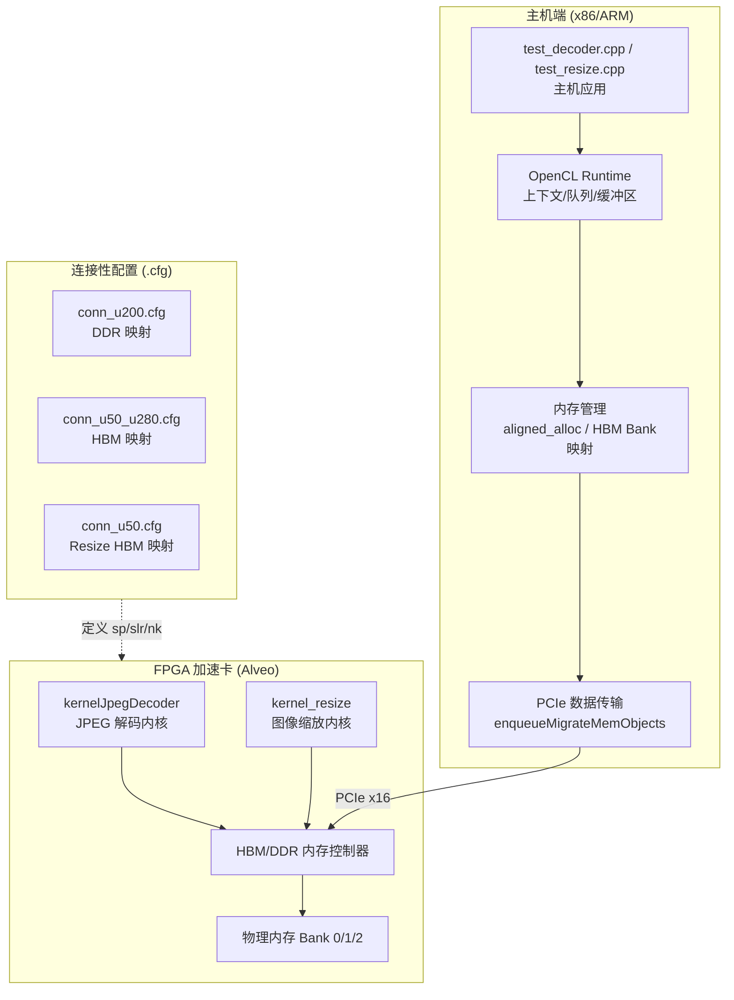

# jpeg_and_resize_demos 技术深度解析

## 概述：这是做什么的？

`jpeg_and_resize_demos` 模块是一套面向 **Xilinx Alveo 加速卡** 的端到端图像处理演示环境，专注于 FPGA 加速的 **JPEG 解码** 和 **图像缩放** 操作。

想象你正在开发一个图像处理流水线，但面对的是海量高分辨率图片的处理需求。CPU 解码和缩放很快成为瓶颈。这个模块就像是连接"算法原型"与"生产级硬件部署"之间的桥梁——它提供了平台特定的硬件连接配置、主机端 OpenCL 编排代码、以及精细的时序测量工具，让开发者能够在 **U200**（DDR 架构）、**U50/U280**（HBM 架构）等不同硬件平台上快速验证和部署图像编解码加速方案。

---

## 架构全景：系统如何运作

这个模块采用典型的 **主机-设备异构计算架构**，数据在 CPU 主机与 FPGA 加速器之间流动，经过精心设计的内存映射和流水线处理。



### 核心组件角色解析

| 组件 | 架构角色 | 职责描述 |
|------|---------|---------|
| **test_decoder.cpp** | 主机编排器 | 管理 OpenCL 上下文、加载 xclbin、分配对齐内存、编排 H2D/D2H 数据传输、执行内核启动、收集时序统计 |
| **test_resize.cpp** | 主机编排器 | 类似 decoder，但针对图像缩放内核，处理不同的数据布局（RAW 像素 vs JPEG 比特流） |
| **conn_u200.cfg** | 硬件拓扑映射 | 为 U200 卡定义 kernelJpegDecoder 的物理连接：JPEG 输入指针→DDR[0]，YUV 输出→DDR[1]，信息结构→DDR[1]，SLR0 放置 |
| **conn_u50_u280.cfg** | 硬件拓扑映射 | 为 U50/U280 的 HBM 架构优化：三个缓冲区分别映射到 HBM[0]、HBM[1]、HBM[2]，利用 HBM 的高带宽特性 |
| **conn_u50.cfg** | 硬件拓扑映射 | Resize 内核的 HBM 连接：三个 m_axi 端口分别映射到 HBM[0/1/2]，实现并行内存访问 |

---

## 关键设计决策与权衡

### 1. 内存架构适配策略：DDR vs HBM

**决策**：为不同 Alveo 卡提供平台特定的 `.cfg` 连接配置文件，而非通用配置。

**权衡分析**：
- **U200** 使用传统 **DDR** 内存（conn_u200.cfg）：成本低，但带宽受限。配置中将输入 JPEG 数据、输出 YUV 数据、信息结构分别映射到 DDR[0] 和 DDR[1]，利用双通道并行性。
- **U50/U280** 使用 **HBM**（conn_u50_u280.cfg）：提供更高带宽（最高 460 GB/s），但物理连接更复杂。配置中将三个缓冲区分布到 HBM[0]、HBM[1]、HBM[2]，最大化内存并行访问能力。

**为什么选择这种方案**：避免"一刀切"的性能损失。HBM 需要特定的 bank 分配策略来避免端口争用，而 DDR 系统则需要不同的布局来最大化双通道效率。分离配置文件允许为每种硬件拓扑优化物理布局。

### 2. 主机-设备数据流编排：双缓冲与流水线

**决策**：在 `test_decoder.cpp` 中实现 **10 轮迭代流水线**，使用 OpenCL 事件链 (`events_write`, `events_kernel`, `events_read`) 重叠数据传输与计算。

**代码模式分析**：
```cpp
for (int i = 0; i < num_runs; ++i) {
    // 数据迁移 (H2D) 依赖前一轮的读取完成
    q.enqueueMigrateMemObjects(ob_in, 0, &events_read[i-1], &events_write[i][0]);
    // 内核执行依赖数据迁移完成
    q.enqueueTask(kernel_jpegDecoder, &events_write[i], &events_kernel[i][0]);
    // 数据回传 (D2H) 依赖内核完成
    q.enqueueMigrateMemObjects(ob_out, 1, &events_kernel[i], &events_read[i][0]);
}
```

**权衡分析**：
- **优点**：最大化吞吐量，隐藏 PCIe 传输延迟（通常 1-5ms）在内核执行时间（通常 10-50ms）之后。
- **代价**：增加代码复杂度，需要仔细管理事件依赖关系；内存占用增加（需要维护多个缓冲区的状态）。

**为什么是 10 轮**：平衡统计显著性（获取平均执行时间）与测试时间。首轮通常较慢（冷缓存），后续轮次显示稳态性能。

### 3. YUV 数据重建与 MCU 重排

**决策**：在主机端实现复杂的 `rebuild_raw_yuv()` 函数，将内核输出的 MCU（最小编码单元）顺序数据重排为标准 YUV 平面格式。

**架构背景**：
- FPGA 内核以 **MCU 顺序**输出数据（JPEG 编码的自然顺序：按 8x8 块处理）。
- 标准图像处理工具期望 **平面 YUV**（所有 Y 样本连续，然后所有 U，然后所有 V）或 **打包格式**。

**代码复杂性分析**：
函数处理多种色度子采样格式（C420, C422, C444），每种都有特定的块到平面映射逻辑：
- **C420**：每个 2x2 Y 块共享一个 U 和一个 V 样本，需要复杂的 dpos 指针递增逻辑处理行边界。
- **C422**：水平子采样，每两个 Y 对应一个 UV。
- **C444**：无子采样，直接映射。

**权衡**：为何不在 FPGA 内完成？
- **主机端优势**：FPGA 内核保持简单高效（只做解码），灵活性高（容易修改输出格式而不重新综合 FPGA 比特流）。
- **代价**：PCIe 传输 MCU 顺序数据需要更多带宽（相比压缩的 JPEG 输入），主机 CPU 进行重排计算（但对于非实时应用可接受）。

### 4. 内存对齐与 bank 分配策略

**决策**：使用 `aligned_alloc(4096)` 或 `posix_memalign` 分配主机内存，并根据 HBM/DDR bank 拓扑显式映射缓冲区。

**技术细节**：
```cpp
// U200 DDR 配置
mext_in[0].flags = XCL_MEM_DDR_BANK0;  // JPEG 输入
mext_in[1].flags = XCL_MEM_DDR_BANK1;  // YUV 输出
mext_in[2].flags = XCL_MEM_DDR_BANK1;  // 信息结构

// U50 HBM 配置
mext_in[0].flags = XCL_BANK0;  // HBM[0]
mext_in[1].flags = XCL_BANK1;  // HBM[1]
mext_in[2].flags = XCL_BANK2;  // HBM[2]
```

**为什么重要**：
- **对齐要求**：Xilinx OpenCL 扩展要求缓冲区至少 4KB 对齐才能使用 `XCL_MEM_USE_HOST_PTR` 零拷贝模式。
- **Bank 分离**：将读写缓冲区放在不同 bank（DDR0 vs DDR1，或 HBM0 vs HBM1）允许并行内存访问，避免 bank 争用导致的流水线停顿。

---

## 数据流追踪：端到端的旅程

让我们追踪一个 JPEG 图像通过解码系统的完整生命周期，以理解各组件如何协作。

### 阶段 1：主机端初始化与数据准备 (`test_decoder.cpp`)

**输入**：JPEG 文件路径 (`-JPEGFile`)、xclbin 路径 (`-xclbin`)

**关键操作**：
1. **内存分配**：`aligned_alloc<uint8_t>` 分配 4KB 对齐的主机缓冲区存储 JPEG 比特流；`aligned_alloc<ap_uint<64>>` 为 YUV 输出分配空间。
2. **文件加载**：`load_dat()` 使用 `fread` 将 JPEG 文件读入主机缓冲区，检查 `MAX_DEC_PIX` 限制。
3. **OpenCL 上下文建立**：`xcl::get_xil_devices()` 发现 FPGA，`cl::Context` 和 `cl::CommandQueue` 创建，启用性能分析 (`CL_QUEUE_PROFILING_ENABLE`) 和乱序执行模式。

**状态转移**：主机内存现在持有压缩的 JPEG 数据，OpenCL 运行时已准备就绪。

### 阶段 2：设备缓冲区设置与数据传输

**关键操作**：
1. **扩展指针配置**：`cl_mem_ext_ptr_t` 结构将主机缓冲区绑定到特定内存 bank（U200 用 `XCL_MEM_DDR_BANK0/1`，U50 用 `XCL_BANK0/1/2`）。
2. **设备缓冲区创建**：`cl::Buffer` 使用 `CL_MEM_EXT_PTR_XILINX | CL_MEM_USE_HOST_PTR` 标志，启用零拷贝（zero-copy）或页锁定传输优化。
3. **数据迁移 (H2D)**：`enqueueMigrateMemObjects` 将 JPEG 数据从主机内存通过 PCIe 传输到 FPGA 的 DDR/HBM。第一轮迭代启动，后续轮次使用事件依赖实现流水线。

**状态转移**：JPEG 数据现在位于 FPGA 设备内存，内核等待启动。

### 阶段 3：FPGA 内核执行 (`kernelJpegDecoder`)

**输入**：`jpeg_pointer` (设备内存中的 JPEG 比特流), `size` (数据长度)
**输出**：`yuv_mcu_pointer` (MCU 顺序的 YUV 数据), `infos` (解码元数据)

**内部数据流**（基于主机端 `rebuild_infos` 推断的内核行为）：
1. **熵解码**：JPEG 比特流经过 Huffman 解码，恢复 8x8 DCT 系数块。
2. **反量化与 IDCT**：应用量化表，执行逆离散余弦变换，得到空间域的 YUV 样本。
3. **MCU 组装**：按 JPEG 的 MCU (Minimum Coded Unit) 结构组织输出数据。对于 YUV420，每个 MCU 包含 4 个 Y 块、1 个 U 块、1 个 V 块。
4. **元数据提取**：填充 `infos` 数组，包含图像尺寸、块数量、量化表、采样格式 (`bas_info`) 等关键参数。

**性能特征**：内核执行时间取决于图像分辨率和复杂度。通过 `CL_PROFILING_COMMAND_START/END` 测量，典型解码延迟在微秒到毫秒级。

### 阶段 4：数据回传与后处理

**关键操作**：
1. **数据回传 (D2H)**：`enqueueMigrateMemObjects` 将 `yuv_mcu_pointer` 和 `infos` 从 FPGA 内存传回主机。
2. **元数据重建**：`rebuild_infos()` 解析 `infos` 数组，恢复 C++ 结构体 (`bas_info`, `cmp_info`, `img_info`)，提取图像格式 (C420/C422/C444)、尺寸、量化表等。
3. **YUV 重排**：`rebuild_raw_yuv()` 执行关键的格式转换：
   - **输入**：MCU 顺序的数据（按 8x8 块组织，符合 JPEG 处理顺序）。
   - **处理**：根据色度子采样格式（C420/C422/C444），计算每个 8x8 块在最终 YUV 平面图像中的位置，处理行边界和块间偏移。
   - **输出**：标准平面 YUV 文件（`.yuv`），Y/U/V 分量连续存储，可被 `ffplay` 或图像处理工具直接解析。

### 阶段 5：时序统计与验证

**关键操作**：
1. **时间戳记录**：`gettimeofday` 记录端到端时间 (`startE2E`, `endE2E`)；OpenCL 事件记录细粒度时序：H2D 传输时间、内核执行时间、D2H 传输时间。
2. **性能报告**：打印平均内核执行时间（10 轮迭代平均）、端到端延迟、各阶段带宽利用率。
3. **正确性验证**：比较输出图像尺寸与预期，检查解码错误码 (`rtn`, `rtn2`)，确保 JPEG marker 和 Huffman 表解析正确。

---

## 子模块指南

本模块由三个紧密协作的子模块构成，分别处理硬件连接性、主机端解码逻辑和图像缩放功能：

### [jpeg_decoder_kernel_connectivity_profiles](codec_acceleration_and_demos-jpeg_and_resize_demos-jpeg_decoder_kernel_connectivity_profiles.md)

**职责**：管理 `kernelJpegDecoder` 在不同 Alveo 平台上的物理连接配置（`.cfg` 文件）。

**关键内容**：
- **U200 DDR 配置**：针对传统 DDR 内存的双 bank 分配策略
- **U50/U280 HBM 配置**：利用高带宽内存的三 bank 并行访问模式
- **Vivado 实现策略**：`Explore`、`AggressiveExplore` 等物理优化指令，确保时序收敛

**设计洞察**：这些配置文件是硬件拓扑与内核逻辑之间的"契约"，决定了数据在 FPGA 芯片上的物理流动路径。

### [jpeg_decoder_host_timing_support](codec_acceleration_and_demos-jpeg_and_resize_demos-jpeg_decoder_host_timing_support.md)

**职责**：主机端 JPEG 解码测试应用，涵盖 OpenCL 编排、精细时序测量和 YUV 后处理。

**关键内容**：
- **OpenCL 流水线架构**：命令队列配置（乱序执行、性能分析启用）、零拷贝缓冲区设置
- **事件驱动的流水线**：10 轮迭代中的双缓冲与事件链依赖（`events_write` → `events_kernel` → `events_read`）
- **YUV 重建算法**：MCU 顺序到平面格式的转换，支持 C420/C422/C444 色度子采样
- **时序分析框架**：OpenCL 事件时间戳提取（H2D/内核/D2H 细分）与端到端延迟测量

**设计洞察**：主机代码不仅是"胶水"，而是完整的生产级参考实现，展示了如何在异构计算环境中管理内存一致性、流水线和性能分析。

### [resize_demo_kernel_and_host_timing](codec_acceleration_and_demos-jpeg_and_resize_demos-resize_demo_kernel_and_host_timing.md)

**职责**：图像缩放演示的硬件连接配置和主机端实现，展示与 JPEG 解码不同的内存访问模式。

**关键内容**：
- **HBM 三端口配置**：`m_axi_gmem0/1/2` 分别映射到 HBM[0/1/2]，实现读配置、读图像、写结果的全并行访问
- **RAW 像素处理**：与 JPEG 的比特流处理不同，resize 处理解码后的 RAW 像素（通常是 8-bit 灰度或 YUV）
- **参数化设计**：通过 `ap_uint<32>` 配置寄存器动态设置源/目标图像尺寸，支持运行时分辨率调整

**设计洞察**：Resize 演示展示了如何针对流式像素处理优化内存架构——使用多个 HBM bank 避免读写竞争，而 JPEG 解码演示则优化了变长编码数据的突发传输效率。

---

## 跨模块依赖关系

### 上游依赖（父模块与基础设施）

- **[codec_acceleration_and_demos](codec_acceleration_and_demos.md)**：本模块的直接父模块，提供 FPGA 图像编解码加速的整体框架和构建基础设施。
- **Xilinx Runtime (XRT)**：底层 OpenCL 运行时依赖，提供 `xcl::get_xil_devices()`、`cl::Buffer` 扩展等硬件抽象。
- **Vitis Vision Library**：`xf::codec` 命名空间中的类型定义（`bas_info`, `cmp_info`, `COLOR_FORMAT`）暗示了对 Vitis Vision 库的数据结构依赖。

### 横向依赖（同级模块）

- **[jxl_and_pik_encoder_acceleration](codec_acceleration_and_demos-jxl_and_pik_encoder_acceleration.md)**：提供 JPEG XL 和 PIK 格式的编码加速，与本模块的 JPEG 解码形成编解码对（Codec Pair）。
- **[webp_encoder_host_pipeline](codec_acceleration_and_demos-webp_encoder_host_pipeline.md)**：WebP 编码流水线，展示了不同的图像格式加速策略，其主机端流水线设计模式（`kernel_encoding_parameter_models`）可作为本模块 resize 演示的参考。
- **lepton_encoder_demo**：Xilinx 的 Lepton 无损 JPEG 重压缩演示，与本文档的 JPEG 解码器共享类似的熵解码架构。

### 下游依赖（被使用方）

- **集成测试框架**：本模块的主机应用 (`test_decoder`, `test_resize`) 通常被上层持续集成系统调用，作为硬件健康检查和性能回归测试的基准。
- **应用示例**：下游应用开发者参考本模块的 OpenCL 编排模式（特别是 `enqueueMigrateMemObjects` 与 `enqueueTask` 的事件链模式）实现自己的图像预处理流水线。

---

## 给新贡献者的实战指南

### 环境准备与构建流程

1. **硬件前提**：确保 Alveo 卡（U200/U50/U280）已正确安装，XRT 驱动加载正常（`xbutil examine` 显示卡状态正常）。
2. **获取 xclbin**：本模块不包含内核源码（仅演示配置），需从 `codec_acceleration_and_demos` 父模块构建 `kernelJpegDecoder.xclbin` 和 `kernel_resize.xclbin`。
3. **编译主机代码**：
   ```bash
   g++ -std=c++11 test_decoder.cpp -o test_decoder \
       -I$XILINX_XRT/include -L$XILINX_XRT/lib -lOpenCL -lpthread
   ```

### 常见陷阱与调试技巧

#### 1. 内存对齐违规（Segmentation Fault on `enqueueMigrateMemObjects`）

**症状**：程序在第一次数据传输时崩溃。

**根因**：未使用 `aligned_alloc(4096, ...)` 分配主机内存。Xilinx OpenCL 扩展要求使用 `CL_MEM_USE_HOST_PTR` 时缓冲区必须页对齐。

**解决方案**：始终使用代码中提供的 `#if __linux` 分支的 `aligned_alloc` 实现，而非标准 `malloc`。

#### 2. HBM Bank 索引越界（`Invalid memory bank` 错误）

**症状**：U50/U280 平台上运行 U200 的配置文件导致编译或运行时错误。

**根因**：U200 配置使用 `XCL_MEM_DDR_BANK0/1`，而 U50 使用 `XCL_BANK0/1/2`（HBM 语义）。混用会导致 `cl::Buffer` 创建失败。

**解决方案**：
- 始终根据目标卡选择正确的 `.cfg` 文件进行 v++ 链接。
- 主机代码中通过 `#ifdef USE_HBM` 宏切换 `mext_in[i].flags` 赋值逻辑。

#### 3. YUV 输出格式误解（图像显示异常）

**症状**：解码后的 `.yuv` 文件用 `ffplay` 播放时出现颜色混乱或条纹。

**根因**：`rebuild_raw_yuv()` 输出的是特定格式的平面 YUV（Y 后接 U 后接 V），但 `ffplay` 需要正确的 `-s` (尺寸) 和 `-pix_fmt` 参数。用户常混淆 C420/C422/C444 格式。

**解决方案**：模块生成的 `.yuv.h` 文件包含关键元数据（`fmt=%d`, `width`, `height`）。正确播放命令示例：
```bash
ffplay -s 1920x1080 -pix_fmt yuv420p output.yuv
```
注意：如果 `bas_info.format` 是 `C422`，需使用 `-pix_fmt yuv422p`。

#### 4. 时序测量事件依赖死锁（程序挂起）

**症状**：程序在内核启动后无限期挂起，无输出。

**根因**：OpenCL 事件链配置错误，例如 `enqueueMigrateMemObjects` 依赖于尚未完成的事件，或事件数组越界。

**调试方法**：
- 在 `q.enqueueTask` 和 `q.finish()` 调用前后添加 `std::cout` 日志。
- 使用 `xbutil top` 查看 FPGA 卡是否忙碌。
- 检查事件等待列表：`&events_write[i]` 必须在同一轮迭代中已入队，不能引用未来的轮次。

### 扩展与修改建议

#### 添加新的 Alveo 平台支持（如 U55C）

1. 在 `conn_u50_u280.cfg` 基础上复制创建 `conn_u55c.cfg`。
2. 调整 `sp` 映射到 U55C 的 HBM 架构（可能只有 2 个 HBM 堆栈，需要复用 bank）。
3. 修改主机代码，添加 `XCL_BANK` 定义的平台检测逻辑。
4. 使用 `v++` 重新链接 xclbin，指定新的 `--config conn_u55c.cfg`。

#### 集成到更大的图像处理流水线

当前模块的主机代码是独立可执行文件。要集成到更大应用：

1. **库封装**：将 `main()` 逻辑重构为类 `JpegDecoderAccelerator`，封装 OpenCL 上下文管理。
2. **零拷贝优化**：当前代码使用 `CL_MEM_USE_HOST_PTR`，适合流式处理，但要求主机内存持续有效。如需异步处理，改用 `CL_MEM_ALLOC_HOST_PTR` + `map/unmap` 模式。
3. **批处理扩展**：修改内核启动逻辑，从单图像处理改为批量提交（queue multiple kernels before finish），提高 PCIe 吞吐量利用率。

---

## 总结

`jpeg_and_resize_demos` 模块不仅仅是一组测试程序，它是 **FPGA 异构计算架构的完整参考实现**。从硬件连接性配置（`.cfg`）的物理层细节，到主机端 OpenCL 事件链的精妙编排，再到 YUV 数据重建的算法复杂性，这个模块展示了如何在真实硬件约束（DDR vs HBM、PCIe 延迟、内存对齐）下构建高性能图像处理系统。

对于新加入的开发者，理解这个模块的关键在于把握 **"分层解耦"** 的设计哲学：内核做最擅长的并行解码（FPGA），主机做灵活的编排与格式转换（CPU），配置文件桥接物理硬件差异。当你准备修改或扩展这个系统时，始终问自己：这个操作应该发生在 FPGA 内核（并行、吞吐）、主机端（灵活、控制），还是配置层（拓扑、物理）？正确的分层选择将决定你的实现是高效优雅，还是陷入性能泥潭。
