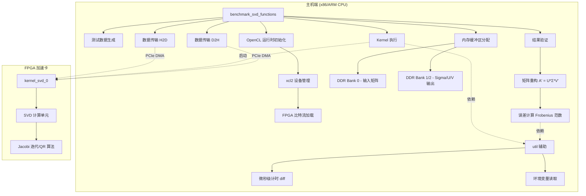
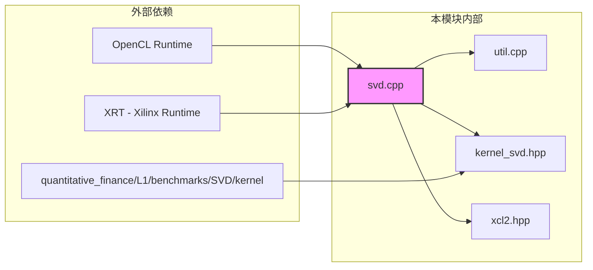

# l1_svd_benchmark_host_utils 模块详解

## 一句话概括

本模块是 **Xilinx FPGA 加速库中 L1 级 SVD（奇异值分解）基准测试的主机端"驾驶舱"** —— 它负责在主机 CPU 上 orchestrate（编排）整个测试流程：准备输入数据、驱动 OpenCL 运行时与 FPGA 板卡通信、执行内核、回收结果并进行数值正确性验证。

想象一下：FPGA 上的 SVD 内核是一位技艺精湛的"数学 specialist"，但它需要一位" lab assistant"来递送样本、记录实验时间、核对结果。这个模块就是那位 assistant。

---

## 问题空间：为什么需要这个模块？

### 背景：SVD 的计算挑战

奇异值分解（SVD）是数值线性代数中的"瑞士军刀"，在量化金融（如主成分分析 PCA、风险管理、协方差矩阵特征分解）中无处不在。然而，对于大规模矩阵，SVD 的计算复杂度高达 $O(\min(mn^2, m^2n))$，在 CPU 上成为严重瓶颈。

### FPGA 加速的复杂性

Xilinx FPGA 通过高度并行的数据路径和专用 DSP 单元可以显著加速 SVD，但这引入了新的复杂性：

1. **异构编程模型**：开发者必须同时管理主机端 C++ 代码和设备端 HLS/OpenCL 内核
2. **数据传输开销**：PCIe 往返和 DDR 内存搬移可能成为瓶颈，需要精心设计的内存布局
3. **正确性验证**：FPGA 实现必须与参考算法（如 LAPACK 的 dgesvd）数值一致
4. **性能基准**：需要精确的微秒级计时来评估 kernel 执行时间 vs 数据传输时间

### 模块的定位

`l1_svd_benchmark_host_utils` 正是为解决这些**主机端的 orchestration 和验证问题**而存在的。它是 [量化金融引擎](quantitative-finance-engines.md) 中 L1 级（底层内核级）基准测试基础设施的一部分。

> **L1 基准测试的哲学**：在 Xilinx 的库结构里，L1 级测试验证单个内核的功能正确性和原始性能，不涉及端到端应用逻辑。本模块严格遵循此哲学：它测试 SVD 内核本身，而非某个具体的金融应用场景。

---

## 架构与数据流

### 整体架构图



### 核心抽象：把 FPGA 当作"协处理器"

本模块的核心心智模型是 **"主机主导的协处理"**（Host-Orchestrated Coprocessing）。想象 FPGA 是一块专门的"数学加速器卡"，而主机代码是"指挥中心"：

- **指挥中心**（本模块）制定作战计划：准备数据、选择算法参数、下达执行命令
- **加速器卡**（FPGA 内核）只负责计算：接收指令、执行数值运算、返回结果
- **通信链路**（OpenCL/XRT）是两者之间的专用热线，但带宽有限，因此数据搬运需要精心规划

### 数据流详解：一次完整基准测试的旅程

让我们追踪 `benchmark_svd_functions` 函数中一个 4×4 矩阵的完整生命周期：

#### 阶段 1：战前准备（初始化）
1. **设备发现**：通过 `xcl2::get_xil_devices()` 扫描 PCIe 总线，找到 Xilinx FPGA 卡
2. **上下文创建**：建立 OpenCL Context 和 CommandQueue，启用性能剖析（`CL_QUEUE_PROFILING_ENABLE`）和乱序执行模式
3. **比特流加载**：将编译好的 `.xclbin` 文件加载到 FPGA，实例化 `kernel_svd_0`

#### 阶段 2：营地部署（内存分配）
模块采用 **显式内存银行分配策略**（Explicit Memory Banking）：
- **Bank 0**：存放输入矩阵 A（4×4 的 double 数组）
- **Bank 1**：存放输出 Σ（奇异值向量，4 个 double）和 U 矩阵（4×4）
- **Bank 2**：存放输出 V 矩阵（4×4）

这种布局基于 SVD 内核的硬件接口设计：输入和输出物理上分离到不同 DDR 银行以最大化带宽。

#### 阶段 3：物资运输（H2D 数据传输）
1. 主机准备测试数据：硬编码的 4×4 协方差矩阵（模拟金融数据的相关性结构）
2. 通过 `enqueueMigrateMemObjects` 将输入缓冲区从主机内存（页锁定/对齐分配）异步传输到 FPGA DDR
3. 调用 `q.finish()` 阻塞等待传输完成 —— **这是一个设计权衡点**（见后文）

#### 阶段 4：核心计算（Kernel 执行）
1. 设置 Kernel 参数：输入/输出缓冲区对象和矩阵维度（dataAN=4）
2. 启动 Kernel：`enqueueTask` 提交执行命令到 FPGA
3. **精确计时**：使用 `gettimeofday` 在 Kernel 启动前后获取时间戳，计算执行时间（微秒级精度）
4. 阻塞等待完成：`q.finish()` 确保 Kernel 执行完毕

#### 阶段 5：战果回收（D2H 数据传输）
通过 `enqueueMigrateMemObjects` 将三个输出缓冲区（Sigma、U、V）从 FPGA DDR 传回主机内存。

#### 阶段 6：质量检验（数值验证）
这是确保 FPGA 实现正确性的关键步骤：
1. **重构原始矩阵**：计算 $A' = U \times \Sigma \times V^T$
   - 首先将 U 的列乘以对应的奇异值（缩放）
   - 然后与 V 的转置相乘
2. **Frobenius 范数误差**：计算 $\|A - A'\|_F = \sqrt{\sum_{i,j} (A_{ij} - A'_{ij})^2}$
3. 将误差值返回给调用者进行阈值判断

---

## 关键设计决策与权衡

### 1. 同步 vs 异步执行模型

**观察到的选择**：代码中广泛使用 `q.finish()` 进行阻塞同步（H2D 传输后、Kernel 执行前后、D2H 传输前）。

**权衡分析**：
- **当前方案（同步）**：代码简单、易于调试、时间测量精确（无重叠执行干扰）。代价是 GPU/FPGA 利用率低：设备可能在等待主机准备下一批数据时空闲。
- **替代方案（异步/流水线）**：使用 `cl::Event` 建立依赖链，允许 H2D → Compute → D2H 形成流水线。可提升吞吐，但代码复杂度显著增加（需要管理事件依赖、双缓冲、时序竞争）。

**为什么这样选择**：作为 **L1 级基准测试**，首要目标是**精确测量内核的原始性能**（执行时间、数值正确性），而非最大化系统吞吐。同步模型消除了调度不确定性，使测量结果可复现、可解释。

### 2. 内存分配策略：显式对齐与银行绑定

**观察到的选择**：使用 `aligned_alloc<double>` 分配页面对齐的主机内存，并通过 `cl_mem_ext_ptr_t` 显式指定 DDR 银行（Bank 0, 1, 2）。

**权衡分析**：
- **显式银行分配**：直接控制 FPGA 物理内存布局，最大化带宽（不同银行可并行访问）。代价是硬编码了特定平台的内存架构（U200/U250 有特定银行映射），降低了可移植性。
- **自动内存管理**：让 OpenCL 运行时决定内存布局，代码更通用，但可能无法利用多银行并行性，性能下降。

**为什么这样选择**：L1 基准测试的核心目标是**榨取特定平台（Alveo 卡）的峰值性能**。显式控制是获得确定性高性能的必要条件。这种"平台感知"（Platform-Aware）编程是 Xilinx 异构计算生态的惯用模式。

### 3. 硬编码矩阵尺寸（4×4）与 L1 哲学

**观察到的选择**：代码中 `#define dataAN 4`，测试固定大小的 4×4 矩阵 SVD。

**权衡分析**：
- **固定小尺寸**：代码简单、验证快速、资源占用可预测，适合作为**单元测试/内核基准**。但无法反映大规模矩阵的实际性能特征（缓存行为、内存带宽瓶颈不同）。
- **参数化大尺寸**：更贴近实际应用，但需要复杂的内存分块（Tiling）、流水线调度，L1 代码会变得复杂难以维护。

**为什么这样选择**：明确遵循 **L1/L2/L3 分层方法论**：
- **L1**（本模块）：验证单个内核的功能正确性和**原始计算能力**（Raw Compute），不关心系统级优化。
- L2/L3：在此基础上构建端到端应用，处理分块、流式、多内核并行等系统级问题。

4×4 虽小，但足以验证 SVD 算法的数值正确性（覆盖 Jacobi 旋转或 QR 迭代的收敛逻辑），同时保持构建和运行速度极快（秒级）。

### 4. 误差验证策略：重构而非直接比较

**观察到的选择**：验证阶段不是直接比较 U、Σ、V 与软件参考实现，而是重构 $A' = U\Sigma V^T$ 并与原始输入 A 比较 Frobenius 范数误差。

**权衡分析**：
- **重构验证**：数学上严密（若 SVD 正确，则 $A = U\Sigma V^T$ 必须成立），对符号歧义和排列歧义（U 和 V 的列符号可翻转，奇异值通常按降序排列但实现可能不同）不敏感。缺点是计算开销（矩阵乘法）。
- **直接比较**：需要处理符号模糊（U 和 V 的列可以独立乘以 -1 仍构成有效 SVD），容易因实现细节差异产生误报。

**为什么这样选择**：SVD 的数学定义允许 U 和 V 的列存在符号不确定性（$U \Sigma V^T = (-U) \Sigma (-V)^T$）。直接逐元素比较 U 或 V 矩阵会因符号翻转而产生巨大差异，尽管这是数学上等价的有效分解。重构验证巧妙地绕过了这个问题：只要 $U \Sigma V^T$ 能还原原始矩阵，无论 U 和 V 的具体符号如何，SVD 都被视为正确。这是验证异构计算结果（FPGA 实现 vs 软件参考）的稳健工程实践。

---

## 新贡献者必读：陷阱、契约与隐含假设

### 1. 内存所有权与生命周期契约

**主机内存分配**：
```cpp
double* dataA_svd = aligned_alloc<double>(input_size);
```
- **所有权**：`aligned_alloc` 分配的内存由调用者（`benchmark_svd_functions`）拥有
- **释放责任**：当前代码中**没有显式 free**！这是一个潜在内存泄漏。作为基准测试短期运行可能不在意，但在循环测试中会成为问题。
- **对齐要求**：`aligned_alloc` 确保页面对齐，这是 Xilinx OpenCL 运行时 `CL_MEM_USE_HOST_PTR` 的强制要求。未对齐内存将导致运行时错误或性能崩溃。

**设备缓冲区生命周期**：
```cpp
cl::Buffer input_buffer(context, CL_MEM_EXT_PTR_XILINX | CL_MEM_USE_HOST_PTR | CL_MEM_READ_ONLY, ...);
```
- `cl::Buffer` 对象遵循 RAII：析构时释放 OpenCL 对象
- **关键契约**：`input_buffer` 必须在 `dataA_svd` 被释放**之前**销毁，因为 `CL_MEM_USE_HOST_PTR` 意味着设备缓冲区直接映射到主机内存，提前释放主机内存会导致设备访问悬空指针。

### 2. 环境变量隐含契约

代码通过 `read_verify_env_int` 和 `read_verify_env_string` 读取环境变量（在 util.cpp 中定义）。虽然当前 `svd.cpp` 中没有直接调用这些函数，但**这是模块提供的公共 API**，其他主机测试代码可能依赖。

**陷阱**：
- 环境变量不存在时打印警告但**使用默认值**，这可能导致难以察觉的配置错误（静默失败）
- `atoi` 转换失败时返回 0，无法区分 "变量未设置" 和 "设置为 0" 的情况

### 3. 硬编码平台假设

**矩阵尺寸硬编码**：
```cpp
#define dataAN 4
```
- 这是一个**编译时常量**，改变它需要重新编译
- 内核 `kernel_svd_0` 在编译时也固定了处理 4×4 矩阵的逻辑（基于宏定义同步）
- **风险**：如果主机和内核的 `dataAN` 定义不一致，将导致内存越界或静默数据损坏

**DDR 银行硬编码**：
```cpp
mext_i[0] = {0, dataA_svd, kernel_svd_0()};  // Bank 0
mext_o[0] = {1, sigma_kernel, kernel_svd_0()}; // Bank 1
mext_o[1] = {2, U_kernel, kernel_svd_0()};   // Bank 2
mext_o[2] = {2, V_kernel, kernel_svd_0()};   // Bank 2
```
- 这是针对 **Alveo U200/U250** 的 DDR 拓扑（4 个物理 bank）设计的
- Bank 2 被复用给 U 和 V 两个矩阵（通过 OpenCL 子缓冲区或连续偏移实现，尽管这里看起来是独立分配）
- **可移植性风险**：在只有 2 个 DDR bank 的平台（如 U50）或 HBM 平台（如 U280）上，此代码将失败或需要修改

### 4. 计时精度与测量偏差

**计时方法**：
```cpp
gettimeofday(&tstart, 0);
// ... kernel launch ...
q.finish();
gettimeofday(&tend, 0);
```

**微妙之处**：
- `gettimeofday` 测量的是**挂钟时间**（wall-clock time），受 CPU 调度、中断、上下文切换影响
- `q.finish()` 阻塞直到 kernel 完成，但**不包含**数据传输时间（H2D 在 tstart 之前，D2H 在 tend 之后）
- **当前测量仅反映 kernel 执行时间**，不包括端到端（数据准备 → 结果回收）延迟

**设计意图**：这是 L1 基准测试的刻意选择 —— 隔离测量 kernel 的**原始计算性能**，排除数据传输可变性的干扰。

### 5. 数值验证的阈值隐含假设

误差计算：
```cpp
errA = std::sqrt(errA);  // Frobenius 范数
```

**注意**：代码计算了误差但没有**断言检查**！`errA` 通过引用参数返回给调用者，由上层决定阈值。

**隐含契约**：
- 对于 4×4 double 精度矩阵，典型阈值可能在 $10^{-6}$ 到 $10^{-9}$ 范围
- 如果 FPGA 实现使用低精度近似（如单精度或定点数），阈值需要相应放宽
- 当前代码**没有处理 NaN 或 Inf** 的显式逻辑，如果 SVD 不收敛，误差计算将传播异常值

---

## 子模块导航

本模块包含两个紧密协作的子模块：

1. **[svd - SVD 基准测试主程序](quantitative-finance-l1-benchmarks-svd-host-svd.md)**：
   - 包含 `benchmark_svd_functions` 函数，是测试流程的 orchestrator
   - 处理 OpenCL 设备初始化、内存管理、内核启动、结果验证的完整生命周期
   - 包含硬编码的 4×4 测试矩阵（金融协方差矩阵的简化模型）

2. **[util - 通用主机工具函数](quantitative-finance-l1-benchmarks-svd-host-util.md)**：
   - 提供微秒级计时函数 `diff`（基于 `gettimeofday`）
   - 提供环境变量读取辅助函数 `read_verify_env_int` 和 `read_verify_env_string`
   - 这些工具被本模块和其他 L1 基准测试共享

---

## 跨模块依赖关系



### 关键外部依赖

1. **[kernel_svd.hpp](../kernel/kernel_svd.hpp)**（设备端接口）：
   - 定义了 FPGA 内核的函数签名和参数布局
   - 主机代码通过此头文件了解内核的期望数据格式（4×4 double 矩阵）
   - **隐式契约**：如果内核实现改变了矩阵维度或数据类型，此模块必须同步更新 `dataAN` 宏

2. **xcl2.hpp（Xilinx OpenCL 包装器）**：
   - 位于 [common 库](common-utilities-xcl2-wrapper.md) 中（假设路径）
   - 提供简化的 OpenCL 设备发现、比特流加载、错误处理
   - 本模块依赖其 `get_xil_devices()` 和 `import_binary_file()` 等辅助函数

3. **OpenCL/XRT 运行时**：
   - 底层依赖 Xilinx Runtime (XRT) 和 OpenCL 1.2/2.0 规范
   - 特定于 Alveo 平台的 DDR 银行映射通过 `CL_MEM_EXT_PTR_XILINX` 扩展实现

### 依赖方向性分析

本模块是**叶节点**（Leaf Module）—— 它被上层测试框架（如 L2 系统集成测试或 CI/CD 流水线）调用，但本身不调用其他 L1 基准测试模块。它的稳定性依赖于：

- **向下**：FPGA 比特流（.xclbin）的接口稳定性
- **向上**：需要为调用者提供清晰的错误码和性能指标

---

## 性能调优提示（高级）

对于需要在此模块基础上进行性能扩展的开发者：

1. **增大矩阵尺寸**：当前 4×4 仅用于功能验证。对于实际金融矩阵（如 100×100 协方差矩阵），需要：
   - 修改 `dataAN` 并重新编译内核
   - 考虑分块（Tiling）策略，因为大矩阵无法一次性放入 FPGA 片上缓存
   - 主机端改用双缓冲（Double Buffering）实现数据传输与计算的流水线重叠

2. **HBM 平台适配**：对于使用 HBM（高带宽内存）的 Alveo 卡（如 U280）：
   - 当前硬编码的 DDR Bank 0/1/2 映射不再适用
   - 需要使用 `xclbinutil` 查询内存拓扑，并使用 XRT 的 `xrt::kernel` 新 API（本代码使用旧版 OpenCL C++ 绑定）

3. **精度与资源权衡**：当前使用 `double` 类型。对于资源受限的 FPGA 或更大规模矩阵，可考虑：
   - `float` 单精度：节省 DSP 单元，提升并行度，但需重新验证数值稳定性
   - 定点数（Fixed-Point）：针对已知动态范围的金融数据，进一步节省资源

---

## 总结

`l1_svd_benchmark_host_utils` 是 Xilinx 量化金融库中一个**小而精的 L1 基准测试基础设施**。它体现了异构计算开发的典型模式：

- **关注点分离**：主机负责 orchestration 和验证，FPGA 专注数值计算
- **平台感知编程**：显式内存银行映射、对齐分配，换取确定性性能
- **分层验证哲学**：L1 层追求内核级功能正确性，通过重构验证绕过符号歧义

对于新加入的开发者，理解这个模块不仅是为了维护 SVD 测试，更是掌握整个 L1 基准测试方法论的关键入口。当你需要为新的数值内核（如 QR 分解、矩阵求逆）编写主机测试时，这个模块就是你的模板。
