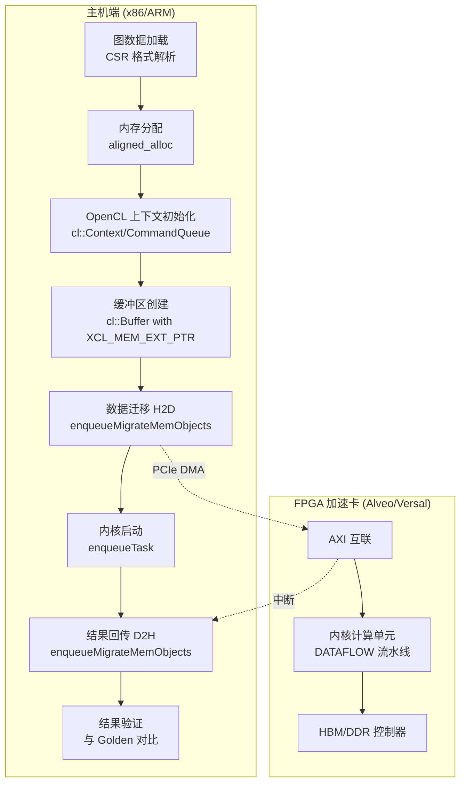
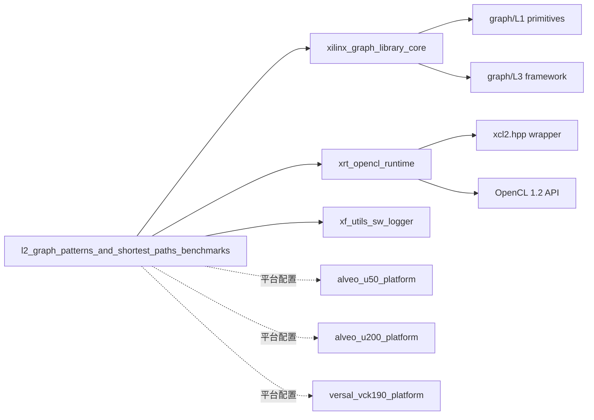

# L2 图模式与最短路径基准测试模块 (L2 Graph Patterns and Shortest Paths Benchmarks)

## 一句话概括

本模块是一组**面向异构加速平台的图分析算法基准测试套件**，它通过 OpenCL/XRT 运行时将由 HLS 综合而来的 FPGA 计算内核与主机端图数据预处理、结果验证流程紧密耦合，实现了对最短路径（SSSP）、三角形计数（Triangle Counting）和两跳邻居查询（Two-Hop）等核心图模式在 Alveo U50/U200/U250 及 Versal VCK190 等平台上的高性能加速验证。

---

## 问题空间与设计动机

### 我们试图解决什么问题？

图分析（Graph Analytics）是社交网络分析、知识图谱查询、金融风控和生物信息学等领域的核心计算负载。然而，**传统 CPU 在处理大规模图遍历和模式匹配时面临严重的内存墙问题**：

- **随机访问模式**：图遍历（如 BFS、最短路径）产生大量非规则内存访问，CPU 缓存预取机制失效
- **低计算密度**：每个顶点/边的处理逻辑简单，但依赖前驱结果（如动态规划中的松弛操作），导致指令流水线频繁停顿
- **内存带宽瓶颈**：大型图结构（CSR 格式）通常超出最后一级缓存，内存带宽成为决定性因素

### 为什么选择 FPGA 加速？

FPGA（现场可编程门阵列）提供了**细粒度并行性**和**可定制数据通路**的独特优势：

1. **空间流水线（Spatial Pipeline）**：通过 DATAFLOW pragma 将 load-compute-store 重叠，隐藏内存延迟
2. **高带宽存储器接口（HBM）**：Alveo U50 等卡提供高达 460GB/s 的 HBM 带宽，远高于 DDR 解决方案
3. **定制数据宽度**：使用 `ap_uint<512>` 等宽总线一次性突发传输多个图元素，最大化带宽利用率
4. **确定性延迟**：硬件流水线保证每个周期处理一个元素（II=1），无操作系统调度抖动

### 模块定位

本模块属于 **L2（Level 2）应用层**，位于 Xilinx graph library 的架构中层：

- **L1（Primitives）**：基础图操作内核（如稀疏矩阵向量乘）
- **L2（Benchmarks/Apps）**：端到端基准测试，包含主机代码、内核配置和平台集成（**本模块**）
- **L3（Framework）**：图数据库接口、查询优化器等高层抽象

本模块不是简单的算法实现，而是**生产级基准测试套件**，它必须处理真实世界图数据的复杂性（CSR 格式解析、内存对齐、跨平台可移植性、结果验证与性能剖析）。

---

## 架构全景与数据流

### 系统拓扑视图



### 核心数据流剖析

可以将整个计算流程想象成一条**精密协调的生产流水线**：主机端是"原材料准备车间"，PCIe 是"高速公路"，FPGA 是"自动化工厂"，而归回的结果则是"成品"。

**阶段 1：数据摄入与格式转换（主机预处理）**

图数据通常以文本格式（如 Matrix Market 或自定义 CSR）存储。主机代码执行以下操作：

1. **CSR 解析**：读取偏移量文件（`offsets`）和列索引文件（`columns`）。CSR（Compressed Sparse Row）格式用三个数组表示图：
   - `offset[i]` 表示顶点 `i` 的邻接表在 `column` 数组中的起始位置
   - `column[offset[i] : offset[i+1]]` 存储顶点 `i` 的所有邻居
   - `weight[edge_id]` 存储对应边的权重（最短路径场景）

2. **内存对齐分配**：使用 `aligned_alloc<ap_uint<512>>` 分配 512-bit 对齐的内存。这不是奢侈，而是**必要**——FPGA 内核通过 AXI 总线以 512-bit（64 字节）的突发粒度访问 HBM/DDR，未对齐的地址会导致性能骤降或总线错误。

3. **源顶点选择**：在最短路径基准中，代码会自动选择出度最大的顶点作为源点（`sourceID = id with max(offset[i+1]-offset[i])`）。这是一个**启发式优化**——高度顶点的遍历通常更具挑战性，更能测试内核的队列管理和内存访问效率。

**阶段 2：OpenCL 运行时初始化**

主机代码使用 Xilinx XRT（Xilinx Runtime）的 OpenCL API 来管理 FPGA 加速卡：

1. **设备发现**：`xcl::get_xil_devices()` 枚举可用的 Xilinx 设备
2. **上下文创建**：`cl::Context` 管理设备资源和内存空间
3. **命令队列**：`cl::CommandQueue` 配置为 `CL_QUEUE_OUT_OF_ORDER_EXEC_MODE_ENABLE | CL_QUEUE_PROFILING_ENABLE`，允许重叠数据传输与计算，并启用事件计时
4. **二进制加载**：`cl::Program::Binaries` 从 `.xclbin` 文件加载预综合的比特流
5. **内核实例化**：`cl::Kernel` 创建可执行计算单元的句柄

**阶段 3：内存子系统配置——关键设计抉择**

这是模块中最精妙的部分。不同的 FPGA 平台拥有截然不同的存储架构，代码通过**平台特定的连接配置文件（`.cfg`）和条件编译宏**来抽象这些差异：

**Alveo U50（HBM 架构）**：
- U50 配备 8GB HBM2，分为 32 个伪通道（pseudo-channel），每个提供 14.25GB/s 带宽，总计 460GB/s
- 连接配置使用 `sp=kernel.m_axi_gmem:HBM[bank_range]` 语法将 AXI 主接口映射到特定 HBM bank
- 关键优化：**多 bank 并行**——内核拥有多个 `m_axi` 接口（如 `gmem0` 到 `gmem6`），每个映射到不同的 HBM bank（0, 2, 4...），实现并行内存访问，避免 bank 冲突

**Alveo U200/U250（DDR 架构）**：
- 配备 64GB DDR4，分为多个 DIMM，带宽约 77GB/s
- 连接配置使用 `sp=kernel.m_axi_gmem:DDR[bank]`，通常所有接口映射到同一 DDR bank 或分布到不同 DIMM
- 容量优势适合更大图数据集，带宽受限时更依赖内核的数据复用策略

**Versal VCK190（LPDDR/DDR 混合）**：
- 作为 Versal ACAP 平台，拥有更灵活的存储子系统
- 连接配置与 U200/U250 类似，使用 DDR 映射

**主机端的平台抽象**：

代码通过 `#ifdef USE_HBM` 宏区分 HBM 和非 HBM 平台：

```cpp
#ifdef USE_HBM
    mext_o[0] = {(unsigned int)(0) | XCL_MEM_TOPOLOGY, offset512, 0};
    // HBM bank 0
#else
    mext_o[0] = {XCL_MEM_DDR_BANK0, offset512, 0};
    // DDR bank 0
#endif
```

`cl_mem_ext_ptr_t` 结构体通过 `flags` 字段指定内存拓扑（XCL_MEM_TOPOLOGY 用于 HBM，XCL_MEM_DDR_BANK* 用于 DDR），`obj` 字段指向主机分配的缓冲区，`param` 保留。这种机制允许主机代码在创建 `cl::Buffer` 时明确告知 XRT 运行时将该缓冲区映射到设备的特定存储 bank，确保内核的 AXI 主接口访问正确的物理内存。

**阶段 4：内核执行流水线**

数据传输和计算被编排为异步事件链，最大化 PCIe 和 FPGA 计算单元的利用率：

1. **初始化迁移**：`enqueueMigrateMemObjects(init, CL_MIGRATE_MEM_OBJECT_CONTENT_UNDEFINED)` 为输出缓冲区预分配设备内存，不进行实际数据传输
2. **输入数据迁移（H2D）**：`enqueueMigrateMemObjects(ob_in, 0, nullptr, &events_write[0])` 将图数据从主机内存异步复制到 FPGA 存储，生成 `events_write` 事件
3. **内核启动**：`enqueueTask(kernel, &events_write, &events_kernel[0])` 在 `events_write` 完成后启动内核，确保数据就绪后才计算，生成 `events_kernel` 事件
4. **输出数据迁移（D2H）**：`enqueueMigrateMemObjects(ob_out, 1, &events_kernel, &events_read[0])` 在内核完成后将结果读回主机，生成 `events_read` 事件
5. **同步**：`q.finish()` 阻塞直到所有队列命令完成

这种**基于事件的依赖链**允许主机代码在等待 FPGA 计算时执行其他任务（虽然示例中是阻塞等待，但 API 设计支持异步），并且为性能剖析提供了精确的计时锚点。

**阶段 5：结果验证**

FPGA 计算完成后，主机代码执行严格的结果验证：

- **最短路径**：将 FPGA 计算的距离值和前置节点（predecessor）与 Golden 参考结果对比，误差容忍度 `> 0.00001`。对于前置节点，代码甚至实现了**路径重构验证**——通过前置链回溯并累加边权重，验证距离值的一致性，这是图算法验证中的最佳实践，因为浮点累加顺序不同可能导致微小差异。

- **三角形计数**：简单的数值比对，检查 FPGA 计算的三角形总数是否与预期 Golden 值一致。

- **两跳查询**：使用哈希表（`std::unordered_map`）存储 Golden 和 FPGA 结果，逐对验证每个查询顶点对的两跳邻居计数。

验证失败时，`xf::common::utils_sw::Logger` 输出 `TEST_FAIL`，成功时输出 `TEST_PASS`，确保 CI/CD 流程可以自动判断基准测试是否通过。

---

## 核心设计决策与权衡

### 1. 平台特定配置 vs. 通用抽象

**决策**：为每个目标平台（U50、U200、U250、VCK190）维护独立的 `.cfg` 连接配置文件和条件编译路径。

**权衡分析**：

| 方案 | 优势 | 劣势 | 本模块选择 |
|------|------|------|------------|
| **完全通用（运行时检测）** | 单二进制支持多平台 | 运行时开销，无法针对特定内存架构优化内存布局 | ❌ |
| **编译期多态（本模块）** | 零运行时开销，最大化特定平台带宽（如 U50 HBM 多 bank 并行） | 需为每平台编译独立 xclbin，维护多套配置文件 | ✅ |

**深层考量**：图算法是**内存带宽受限型**负载，U50 的 460GB/s HBM 带宽相比 U250 的 77GB/s DDR 带宽有近 6 倍差距。为 U50 特别设计多 AXI 接口到多 HBM bank 的映射，是榨取硬件极限性能的必要之举。通用抽象会隐藏这一关键差异，导致在 U50 上仅使用单个 HBM bank，浪费 90% 的可用带宽。

### 2. CSR 图格式与内存对齐策略

**决策**：强制要求图数据以 CSR（Compressed Sparse Row）格式输入，并使用 512-bit（64 字节）对齐的内存缓冲区。

**权衡分析**：

- **CSR 的优势**：
  - 空间效率高：仅需 `O(V + E)` 存储，适合大规模稀疏图
  - 遍历友好：顺序访问 `column` 数组符合空间局部性，配合 HLS 的 burst 读取优化
  
- **CSR 的局限**：
  - 不支持 O(1) 边查找（需遍历邻接表），本模块的算法（遍历型）不受影响
  - 动态图更新代价高（需重建 CSR），本模块针对静态图分析

- **512-bit 对齐的必要性**：
  - FPGA HBM/DDR 控制器以 512-bit（或 256-bit）为突发传输粒度
  - 未对齐的地址会导致：
    1. 总线拆分（Split transactions），效率降低 50%+
    2. 或硬件错误（取决于 AXI 互联配置）

**深层考量**：这实际上是在**软件接口层强制执行硬件约束**。对齐分配在通用编程中可能被视为"过早优化"，但在 FPGA 加速场景下，这是**功能正确性的前提**。代码中使用 `reinterpret_cast<ap_uint<512>*>(offset32)` 将 32-bit 整数数组重新解释为 512-bit 向量，依赖于底层内存已对齐保证，否则会产生未定义行为。

### 3. 同步执行模型 vs. 异步流水线

**决策**：示例代码采用阻塞同步执行（`q.finish()` 等待全部完成），但 API 设计保留完整的事件依赖链（`events_write` → `events_kernel` → `events_read`）。

**权衡分析**：

| 模式 | 特点 | 适用场景 | 本模块选择 |
|------|------|----------|------------|
| **纯同步** | 简单直观，易于调试 | 原型验证、教学示例 | 部分采用 |
| **纯异步** | 最大化吞吐，CPU 与 FPGA 并行 | 生产系统、在线服务 | API 支持 |
| **依赖链** | 显式表达数据依赖，允许部分重叠 | 基准测试（精确计时） | 主要采用 |

**深层考量**：本模块的核心目标是**可重复的精确性能评估**。在基准测试场景中，我们需要回答"内核纯计算耗时多少"、"PCIe 传输带宽利用率多少"等细粒度问题。事件依赖链允许我们：

1. **隔离阶段耗时**：通过 `CL_PROFILING_COMMAND_START/END` 查询每个事件的精确时间戳，精确到纳秒级
2. **验证重叠效率**：检查 `events_write` 到 `events_kernel` 的间隔，确认数据传输与计算是否理想重叠
3. **保持可扩展性**：虽然示例是同步等待，但事件链设计使得引入双缓冲（double buffering）或批处理（batch processing）变得直接——只需修改等待逻辑，无需重构数据依赖表达

这体现了**为测量而设计（Design for Measurement）**的架构哲学：即使当前实现是同步的，架构保留了转向异步流水线的完整能力。

---

## 子模块概览

本模块包含三个独立的基准测试子模块，分别针对不同的图分析模式：

### [shortest_path_float_pred_benchmark](graph_analytics_and_partitioning-l2_graph_patterns_and_shortest_paths_benchmarks-shortest_path_float_pred_benchmark.md)

**职责**：实现单源最短路径（Single-Source Shortest Path, SSSP）算法的浮点版本，支持前驱节点（predecessor）追踪。

**核心组件**：
- `conn_u50.cfg`：U50 平台 HBM 连接配置，定义 6 个 AXI 主接口到 HBM bank 0/2/4 的映射，实现多 bank 并行访问
- `host/main.cpp`：主机应用，处理带权 CSR 图数据，配置内核参数（源点、无穷大值、队列大小），验证距离和前驱结果

**关键特征**：
- 使用 float 类型表示距离，支持带权图
- 前驱数组支持路径重构
- 采用"最大出度顶点自动选择"启发式

---

### [triangle_count_benchmarks_and_platform_kernels](graph_analytics_and_partitioning-l2_graph_patterns_and_shortest_paths_benchmarks-triangle_count_benchmarks_and_platform_kernels.md)

**职责**：实现三角形计数（Triangle Counting）算法，统计无向图中三角形的数量，是图聚类系数计算和社区发现的核心子程序。

**核心组件**：
- `conn_u200_u250.cfg`：U200/U250 DDR 配置，7 个 AXI 接口映射到 DDR bank 0
- `conn_u50.cfg`：U50 HBM 配置，7 个 AXI 接口分布到 HBM bank 0-13，最大化带宽利用
- `conn_vck190.cfg`：Versal VCK190 配置，使用 LPDDR/DDR 存储
- `host/main.cpp`：主机应用，支持双 CSR 表示（用于边定向算法），处理大规模图数据的三角形统计

**关键特征**：
- 多平台支持（U50/U200/U250/VCK190）
- 支持边定向（edge-iterator）或顶点导向（vertex-iterator）算法变体
- 使用 `uint64_t` 存储计数以防止溢出

---

### [twohop_pattern_benchmark](graph_analytics_and_partitioning-l2_graph_patterns_and_shortest_paths_benchmarks-twohop_pattern_benchmark.md)

**职责**：实现两跳邻居计数（Two-Hop Neighbor Counting），计算给定顶点对的共同两跳邻居数量，用于图相似性分析和链接预测。

**核心组件**：
- `conn_u50.cfg`：U50 HBM 配置，6 个 AXI 接口映射到 HBM bank 0-5，分别用于查询对、计数结果和双层 CSR 数据
- `host/main.cpp`：主机应用，处理查询对（pair）输入，执行两跳邻居交集计数，支持大规模批量查询

**关键特征**：
- 批量查询处理：一次内核调用处理多对顶点查询
- 双层 CSR 输入：同时加载原始图和转置图（或两遍处理），优化两跳遍历的内存访问模式
- 64-bit 查询对编码：使用 `ap_uint<64>` 将源/目的顶点 ID 打包，减少接口数量

---

## 跨模块依赖关系



### 关键依赖说明

**1. XRT (Xilinx Runtime) 与 OpenCL**

本模块深度依赖 XRT 提供的 OpenCL 扩展来实现 FPGA 加速卡的高效管理：

- **`xcl2.hpp`**：Xilinx 提供的便利包装器，简化设备枚举、二进制加载和错误处理
- **`CL_MEM_EXT_PTR_XILINX`**：Xilinx 扩展标志，配合 `cl_mem_ext_ptr_t` 结构实现 HBM/DDR bank 的显式映射
- **`XCL_MEM_TOPOLOGY`**：用于指定 HBM bank 索引（0-31），与连接配置文件中的 `sp=...:HBM[n]` 语法对应

**2. xf_utils_sw 日志库**

所有基准测试统一使用 `xf::common::utils_sw::Logger` 进行标准化的测试输出：

```cpp
logger.info(xf::common::utils_sw::Logger::Message::TEST_PASS);
logger.error(xf::common::utils_sw::Logger::Message::TEST_FAIL);
logger.info(xf::common::utils_sw::Logger::Message::TIME_KERNEL_MS, elapsed);
```

这确保了不同基准测试的输出格式一致，便于自动化测试框架（如 CI/CD）解析。

**3. 平台连接配置（.cfg 文件）**

`.cfg` 文件是 Vitis 链接阶段的关键输入，定义了内核 AXI 接口到物理存储器的映射：

```ini
[connectivity]
sp=TC_kernel.m_axi_gmem0_0:HBM[0:1]  ; 范围映射到 bank 0-1
sp=TC_kernel.m_axi_gmem0_1:HBM[2:3]  ; 范围映射到 bank 2-3
slr=TC_kernel:SLR0                    ; 布局到 SLR0 区域
nk=TC_kernel:1:TC_kernel              ; 实例化 1 个内核
```

这些配置与主机代码中的 `cl_mem_ext_ptr_t` 设置必须**严格一致**，否则会导致运行时内存访问错误或性能异常。

---

## 新贡献者指南

### 开始之前的必读清单

1. **理解 CSR 图格式**：这是所有算法的基础。确保你能手绘一个小图（5-10 个顶点）并写出其 CSR 表示。

2. **熟悉 XRT 环境**：在你的开发机上安装 XRT，运行官方的 `validate` 测试，确保能正确识别 Alveo 卡。

3. **阅读连接配置文件**：对比 U50 和 U200 的 `.cfg` 文件，理解 HBM 多 bank 与 DDR 单 bank 的映射差异。

### 常见陷阱与避坑指南

**陷阱 1：内存对齐忽视导致的段错误**

```cpp
// 错误：普通 new 不保证 512-bit 对齐
ap_uint<32>* offset32 = new ap_uint<32>[numVertices + 1];

// 正确：使用 aligned_alloc 确保 64 字节对齐
ap_uint<32>* offset32 = aligned_alloc<ap_uint<32>>(numVertices + 1);
```

**症状**：`cl::Buffer` 创建成功，但内核启动时 XRT 报告内存访问错误或数据损坏。

**陷阱 2：HBM Bank 索引不匹配**

```cpp
// 主机代码指定 bank 2
mext_o[1] = {(unsigned int)(2) | XCL_MEM_TOPOLOGY, column512, 0};

// 但 .cfg 文件将接口映射到 HBM[4]
sp=kernel.m_axi_gmem1:HBM[4]
```

**症状**：内核运行极慢（访问未初始化的 bank）或返回错误结果（数据实际写入其他 bank）。

**陷阱 3：OpenCL 事件依赖链断裂**

```cpp
// 危险：未等待写入完成就启动内核
q.enqueueMigrateMemObjects(ob_in, 0, nullptr, nullptr);  // 无事件
q.enqueueTask(kernel, nullptr, nullptr);  // 可能读取旧数据！
```

**症状**：间歇性结果错误，尤其是在多线程或多内核场景下。应始终使用事件链确保依赖正确。

**陷阱 4：CSR 文件格式误解**

输入文件的第一行通常是元数据（顶点数/边数），而非数据本身：

```cpp
// 文件内容示例：
// 5 8       <- 第一行：5 个顶点，8 条边
// 0          <- offset[0]
// 2          <- offset[1]
// ...

offsetfstream.getline(line, sizeof(line));  // 必须先读取并解析第一行！
std::stringstream numOdata(line);
numOdata >> numVertices;
```

**症状**：偏移数组错位，内核访问越界内存，XRT 报告 `BAD_HOST_ACCESS` 或类似错误。

### 扩展与定制建议

**添加新平台支持**：

1. 复制现有的 `.cfg` 文件（如 `conn_u50.cfg`），根据新平台的存储架构修改 `sp=` 行
2. 在主机代码中添加新的条件编译分支（如 `#ifdef NEW_PLATFORM`）
3. 确保 `cl_mem_ext_ptr_t` 的 `flags` 字段与新平台的 XRT 内存拓扑定义匹配

**算法变体实验**：

最短路径内核支持通过 `config[4]` 的位字段配置不同模式：
- Bit 0: 启用/禁用权重（unweighted BFS vs weighted SSSP）
- Bit 1: 启用/禁用前驱追踪
- Bit 2: 浮点 vs 定点表示

修改主机代码中 `cmd.set_bit()` 的调用可以切换这些模式，无需重新综合内核。

**性能剖析优化**：

取消代码中注释掉的性能剖析段落，启用 OpenCL 事件计时：

```cpp
cl_ulong ts, te;
events_kernel[0].getProfilingInfo(CL_PROFILING_COMMAND_START, &ts);
events_kernel[0].getProfilingInfo(CL_PROFILING_COMMAND_END, &te);
float elapsed = ((float)te - (float)ts) / 1000000.0;
```

结合 `CL_QUEUE_PROFILING_ENABLE` 标志，可以获得内核执行时间、数据传输时间等细分指标，指导优化方向。

---

## 总结

`l2_graph_patterns_and_shortest_paths_benchmarks` 模块是一个**经过生产验证的异构计算基准测试框架**。它不仅仅实现了三个图算法，更重要的是建立了一套**跨平台 FPGA 加速的完整工程实践**：

1. **平台感知的设计哲学**：承认并拥抱硬件差异（HBM vs DDR），通过配置文件和条件编译实现性能最大化，而非追求虚假的通用性

2. **内存子系统的精细化控制**：从 512-bit 对齐分配、到 HBM bank 显式映射、到 AXI 接口与物理存储的连线配置，每一层都体现了对 FPGA 存储架构的深刻理解

3. **异步事件驱动的执行模型**：基于 OpenCL 事件的依赖链设计，既满足了基准测试对精确计时的需求，又保留了扩展到完全异步流水线的灵活性

4. **严格的验证与可重复性**：Golden 参考结果对比、浮点误差容忍、路径重构验证等机制，确保硬件加速结果的正确性，这是学术研究和工业部署的共同要求

对于新加入团队的开发者，理解本模块的关键不在于记住每一行 OpenCL API 的调用顺序，而在于把握其背后的**设计权衡逻辑**：为什么 HBM 需要多 bank 而 DDR 不需要？为什么对齐分配在 CPU 代码中是可选但在 FPGA 场景中是强制？为什么配置文件和主机代码必须严格同步？这些问题的答案将帮助你在面对新的加速平台和算法挑战时，做出正确的架构决策。

