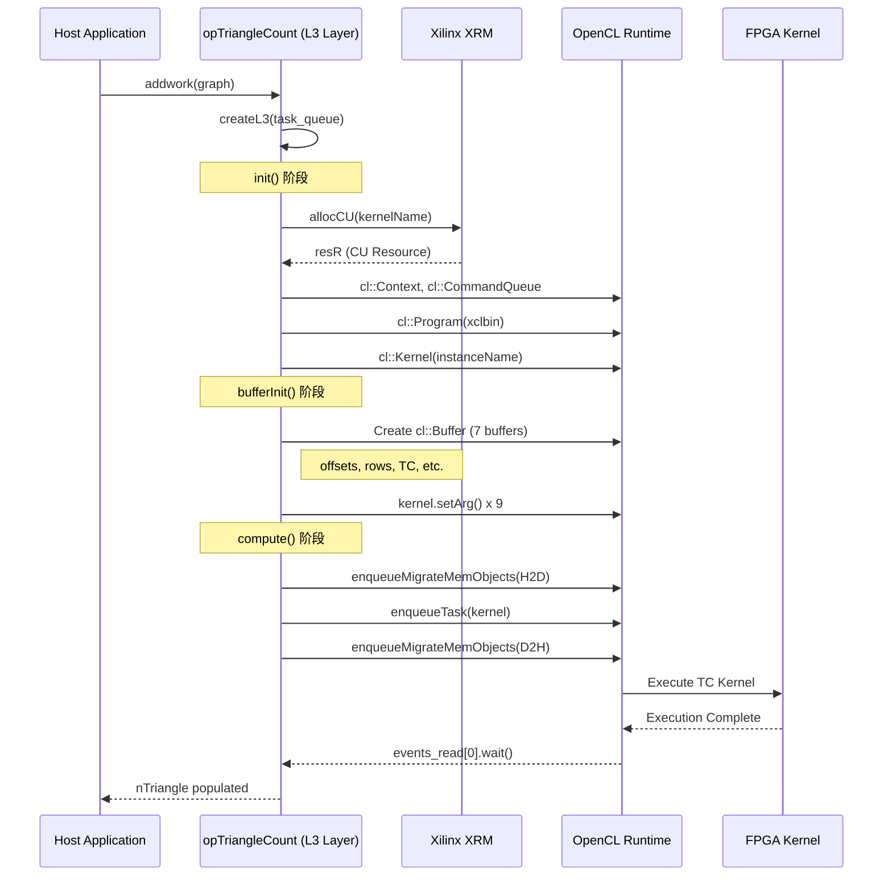
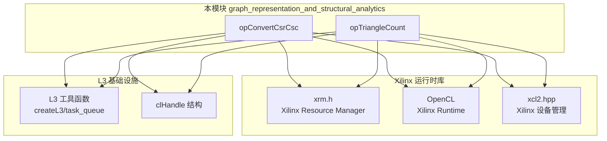

# graph_representation_and_structural_analytics 模块技术深度解析

## 一句话概括

本模块是 Xilinx FPGA 图分析加速库中的**图表示转换与结构分析引擎**，通过 OpenCL 在 FPGA 上高效执行 CSR/CSC 格式转换和三角形计数等基础图操作，为上层图算法提供硬件加速的底层原语。

---

## 为什么需要这个模块？

### 问题空间

在图神经网络和图分析领域，**图数据的表示格式**和**结构特征计算**是几乎所有算法的基石：

1. **格式转换需求**：CSR（Compressed Sparse Row）格式适合遍历节点的出边，CSC（Compressed Sparse Column）适合遍历入边。许多算法需要在这两种表示之间切换。

2. **结构特征提取**：三角形计数（Triangle Counting）是衡量图聚类系数、社区结构的核心指标，也是社交分析、欺诈检测的关键特征。

### 性能挑战

在 CPU 上处理大规模图数据时：
- CSR/CSC 转换需要随机访问大规模稀疏矩阵，缓存命中率低
- 三角形计数的计算复杂度为 $O(\sum d(v)^2)$，高度数节点成为瓶颈
- 内存带宽成为瓶颈，CPU 无法充分利用可用的 DRAM 带宽

### 为什么选择 FPGA 加速？

FPGA 提供了：
1. **可定制的内存访问模式**：针对稀疏矩阵的 gather-scatter 操作优化数据流
2. **高并行度**：同时处理多个边或顶点
3. **近存储计算**：减少数据搬运开销
4. **确定性延迟**：适合实时分析场景

---

## 核心抽象与思维模型

### 类比：图操作的"硬件编译器"

想象这个模块是一个**针对图数据结构的硬件编译器**。就像 LLVM 将高级语言编译为机器码，本模块将高层次的图操作描述（"统计三角形数量"、"转换矩阵格式"）编译为在 FPGA 上执行的 OpenCL 内核和数据流。

### 三层抽象架构

```
┌─────────────────────────────────────────────────────────┐
│  L3: 算法编排层 (本模块所在层)                             │
│  - 管理 FPGA 设备上下文和计算单元                           │
│  - 调度内核执行和数据传输                                   │
│  - 提供面向图数据结构的 API                                 │
├─────────────────────────────────────────────────────────┤
│  L2: 内核实现层                                           │
│  - 实际的 OpenCL/C++ 内核代码                              │
│  - 处理单个 CU (Compute Unit) 的计算逻辑                    │
├─────────────────────────────────────────────────────────┤
│  L1: 硬件平台层                                           │
│  - FPGA 板卡、DDR、PCIe 连接                               │
│  - Xilinx XRM 资源管理                                     │
└─────────────────────────────────────────────────────────┘
```

### 核心数据流抽象

**计算单元池（CU Pool）模型**：
- 将 FPGA 上的每个 Compute Unit 视为一个"工人"
- XRM（Xilinx Resource Manager）作为"调度中心"，负责分配/释放 CU
- 本模块维护一个 CU 句柄数组，管理它们的生命周期

**异步流水线**：
- Host → Device 数据传输（异步）
- 内核执行（与数据传输 overlap）
- Device → Host 结果回传（异步）
- 使用 OpenCL Event 对象进行同步点控制

---

## 数据流与执行流程

### 三角形计数（Triangle Counting）端到端流程



### CSR/CSC 转换（ConvertCsrCsc）执行流程

与三角形计数类似，但数据流略有不同：

1. **输入**: CSR 格式的图数据 (`offsetsCSR`, `indicesCSR`)
2. **输出**: CSC 格式的图数据 (`offsetsCSC`, `indicesCSC`)
3. **辅助数据**: `degree` (节点度数), `offsetsCSC2` (中间计算结果)

关键区别在于 `bufferInit` 阶段设置的参数不同，但执行流水线（数据传输 → 内核执行 → 结果回传）保持一致。

---

## 架构设计与关键决策

### 1. 三层架构的分层逻辑

**决策**: 将图算法实现分为 L1(硬件)/L2(内核)/L3(编排) 三层。

**权衡分析**:

| 选择 | 优势 | 劣势 |
|------|------|------|
| **三层架构** | 清晰的关注点分离；L3 可以复用多种 L2 内核；便于测试和模拟 | 跨层调用开销；需要严格定义接口契约 |
| **单层融合** | 最大性能（无抽象开销）；直接控制硬件 | 代码重复；难以维护和移植；测试困难 |

**本模块的选择**: 采用三层架构，本模块位于 L3 层。通过 OpenCL 抽象硬件差异，通过 XRM 管理资源分配，使上层应用无需关心底层 FPGA 细节。

### 2. OpenCL 与 XRM 的协作模式

**决策**: 使用 Xilinx XRM 管理 CU 分配，使用 OpenCL 管理执行。

**协作流程**:

```
┌─────────────────────────────────────────────────────┐
│  XRM (Xilinx Resource Manager)                       │
│  - 全局视角：知道所有 FPGA 上所有 CU 的状态            │
│  - 负责：allocCU() / cuRelease()                     │
│  - 输出：xrmCuResource (设备ID, CU ID, 通道ID等)       │
└─────────────────────────────────────────────────────┘
                          │
                          ▼
┌─────────────────────────────────────────────────────┐
│  OpenCL Runtime                                      │
│  - 局部视角：管理特定 FPGA 设备的上下文                │
│  - 负责：Context, CommandQueue, Kernel, Buffer         │
│  - 使用：xrmCuResource 中的信息定位具体 CU             │
└─────────────────────────────────────────────────────┘
```

**设计意图**: XRM 解决了多用户/多应用共享 FPGA 时的资源竞争问题。OpenCL 负责与硬件的实际交互。两者解耦使得资源管理策略可以独立演进（例如未来可能支持 Kubernetes 插件）。

### 3. 异步流水线与事件同步

**决策**: 使用 OpenCL Event 实现异步执行和精确同步点控制。

**执行流水线**:

```
时间轴 ──────────────────────────────────────────────────►

Host → Device 数据传输        [==========]
                                     │
                                     ▼ (events_write)
内核执行 (TC Kernel)                   [=============]
                                                  │
                                                  ▼ (events_kernel)
Device → Host 结果回传                              [========]
                                                                    │
                                                                    ▼ (events_read)
CPU 处理结果                                                          [====]

重叠区域：数据传输与计算可以并行
```

**关键代码模式**:

```cpp
// 异步启动数据传输
hds[0].q.enqueueMigrateMemObjects(ob, 0, evIn, &events_write[0]);

// 内核等待数据传输完成（通过 event 依赖）
hds[0].q.enqueueTask(kernel0, &events_write, &events_kernel[0]);

// 结果回传等待内核完成
hds[0].q.enqueueMigrateMemObjects(ob_out, 1, &events_kernel, &events_read[0]);

// 阻塞等待最终结果
events_read[0].wait();
```

**设计意图**: 最大化 FPGA 利用率。数据传输和计算在物理上是独立的（DMA vs. 计算单元），流水线化可以隐藏传输延迟。Event 机制提供了精确的依赖控制，避免过度同步。

### 4. 静态缓冲区与预分配策略

**决策**: 在 `init()` 阶段预分配最大可能需要的缓冲区，而非运行时动态分配。

**代码体现**:

```cpp
// 预定义最大容量
uint32_t V = 800000;  // 最大顶点数
uint32_t E = 800000;  // 最大边数

// init() 阶段创建 7 个缓冲区
handles[cnt].buffer = new cl::Buffer[bufferNm];

// 每个缓冲区按最大容量分配
hds[0].buffer[0] = cl::Buffer(context, ..., sizeof(uint32_t) * V, ...);
```

**权衡分析**:

| 策略 | 优势 | 劣势 |
|------|------|------|
| **预分配（本模块选择）** | 零运行时分配开销；确定性时延；避免内存碎片；FPGA 缓冲区可复用 | 内存占用固定为峰值；可能浪费内存（如果图很小） |
| **动态分配** | 内存按需使用，节省资源 | 分配开销不可预测；可能导致内存碎片；FPGA 需要重新配置缓冲区 |

**设计意图**: 针对 FPGA 加速场景，**确定性性能**通常比**内存效率**更重要。图分析工作负载通常在数据加载阶段就知道图的大小，预分配可以接受。避免运行时分配带来的抖动对保持 FPGA 流水线满载至关重要。

---

## 代码级设计模式

### 1. RAII 资源管理

**模式**: 使用构造函数/析构函数管理 OpenCL 资源生命周期。

```cpp
// 虽然没有显式析构函数，但 freeTriangleCount/freeConvertCsrCsc 承担了清理职责
void opTriangleCount::freeTriangleCount(xrmContext* ctx) {
    for (int i = 0; i < maxCU; ++i) {
        delete[] handles[i].buffer;  // 释放缓冲区数组
        xrmCuRelease(ctx, handles[i].resR);  // 释放 XRM 资源
    }
    delete[] handles;
}
```

**设计意图**: 避免资源泄漏，尤其是在 FPGA 场景下，CU 和缓冲区都是稀缺资源。虽然 C++ 代码中没有使用 `unique_ptr` 等现代 RAII 工具，但手动 cleanup 函数遵循了相同的哲学。

### 2. 句柄池模式（Handle Pool）

**模式**: 预先创建一组 `clHandle` 对象，按需分配使用。

```cpp
// init() 阶段创建所有句柄
handles = new clHandle[CUmax];

// compute() 阶段根据 deviceID/cuID/channelID 计算索引
clHandle* hds = &handles[
    channelID + 
    cuID * dupNmTriangleCount + 
    deviceID * dupNmTriangleCount * cuPerBoardTriangleCount
];
```

**设计意图**: 避免在关键路径（`compute()`）上进行动态内存分配。句柄池在初始化时分配，运行时只是简单的数组索引计算。这保证了确定性的执行延迟。

### 3. 异步任务封装（addwork 模式）

**模式**: 使用 `addwork()` 包装同步的 `compute()`，返回 `event<int>` 实现异步执行。

```cpp
// 同步接口（内部使用）
int compute(..., Graph g, uint64_t* nTriangle);

// 异步接口（对外暴露）
event<int> addwork(Graph g, uint64_t& nTriangle) {
    return createL3(task_queue[0], &(compute), handles, g, &nTriangle);
}
```

**设计意图**: 解耦"任务提交"和"任务完成"。上层应用可以批量提交多个图操作，然后统一等待结果，而不必为每个操作阻塞等待。这对于流水线化处理多个图或一个图上的多个操作非常关键。

---

## 依赖关系与系统交互

### 模块依赖图谱



### 关键外部依赖说明

| 依赖库 | 用途 | 版本要求 |
|--------|------|----------|
| **Xilinx XRM** | FPGA 计算单元 (CU) 的动态分配与释放 | 2020.2+ |
| **OpenCL 1.2+** | 主机与 FPGA 之间的编程接口 | Xilinx 定制版 |
| **xcl2.hpp** | Xilinx 特定的设备管理和二进制加载 | 随 XRT 发布 |
| **xf_utils_sw** | 软件端的日志和工具函数 | Vitis Library |

### 与 L3 框架的集成

本模块是 L3 (Level 3) 图算法库的一部分，遵循以下约定：

1. **任务队列集成**：通过 `createL3()` 函数将操作注册到全局任务队列，支持异步执行
2. **统一句柄管理**：使用 `clHandle` 结构体封装 OpenCL 上下文、命令队列、内核和缓冲区
3. **XRM 资源生命周期**：遵循 "allocCU → use → cuRelease" 的标准模式

---

## 新贡献者须知

### 常见陷阱与注意事项

#### 1. 内存对齐要求（关键！）

**问题**：FPGA 数据传输通常需要页对齐内存。

**代码体现**：
```cpp
// 使用 aligned_alloc 而非 malloc
uint32_t* offsets = aligned_alloc<uint32_t>(V * 16);
```

**后果**：未对齐的内存会导致 OpenCL `enqueueMigrateMemObjects` 失败或性能急剧下降。

#### 2. XRM 资源泄漏风险

**问题**：如果 `freeTriangleCount` 或 `freeConvertCsrCsc` 未被调用，CU 将被永久占用。

**调试技巧**：
```bash
# 检查当前 CU 分配状态
xrmadm -query
```

**缓解**：确保 RAII 或 try-catch-finally 模式正确清理资源。

#### 3. 缓冲区大小硬编码陷阱

**代码体现**：
```cpp
uint32_t V = 800000;  // 最大顶点数硬编码
uint32_t E = 800000;  // 最大边数硬编码
```

**风险**：如果输入图超过这些限制，会发生静默的缓冲区溢出。

**建议**：生产代码应该：
- 在 `init()` 阶段检查图大小
- 提供可配置的容量参数
- 或动态调整缓冲区大小（权衡性能）

#### 4. OpenCL Event 依赖链断裂

**代码模式**：
```cpp
// 正确：内核等待数据传输完成
hds[0].q.enqueueTask(kernel0, &events_write, &events_kernel[0]);

// 危险：如果 events_write 生命周期结束会怎样？
```

**陷阱**：OpenCL Event 对象必须在被等待期间保持有效。如果局部 `events_write` 在 `enqueueTask` 之后但在 `enqueueMigrateMemObjects` 之前离开作用域，将导致未定义行为。

**本模块的处理**：
```cpp
std::vector<cl::Event> events_write(1);  // 在 compute() 栈上分配
// ... 整个流水线使用引用 ...
events_read[0].wait();  // 确保所有前置事件完成
```

### 调试与性能分析

#### 启用详细日志

```cpp
// 在编译时定义 NDEBUG 以禁用调试输出
#ifndef NDEBUG
    std::cout << "DEBUG: ..." << std::endl;
#endif
```

#### OpenCL Profiling

命令队列创建时启用了 `CL_QUEUE_PROFILING_ENABLE`：
```cpp
handle.q = cl::CommandQueue(handle.context, handle.device,
    CL_QUEUE_PROFILING_ENABLE | CL_QUEUE_OUT_OF_ORDER_EXEC_MODE_ENABLE, &fail);
```

可以使用 `cl::Event::getProfilingInfo()` 获取内核执行时间和数据传输时间。

---

## 子模块文档

本模块包含两个核心操作实现，详见各自的子模块文档：

1. **[opConvertCsrCsc 子模块](l3_openxrm_algorithm_operations-graph_representation_and_structural_analytics-op_convertcsrcsc.md)** - CSR 到 CSC 格式转换的 FPGA 加速实现

2. **[opTriangleCount 子模块](l3_openxrm_algorithm_operations-graph_representation_and_structural_analytics-op_trianglecount.md)** - 三角形计数的 FPGA 加速实现

---

## 参考与进一步阅读

- [Xilinx Vitis 图分析库官方文档](https://xilinx.github.io/Vitis_Libraries/graph/)
- [Xilinx Runtime (XRT) 文档](https://xilinx.github.io/XRT/)
- [OpenCL 1.2 参考卡片](https://www.khronos.org/files/opencl-1-2-quick-reference-card.pdf)
- [L2 图算法基准测试模块](../l2_graph_patterns_and_shortest_paths_benchmarks/) - 使用本模块提供的原语构建的端到端算法

---

*文档版本: 1.0*  
*最后更新: 2024*  
*维护团队: Xilinx 图分析库开发团队*
