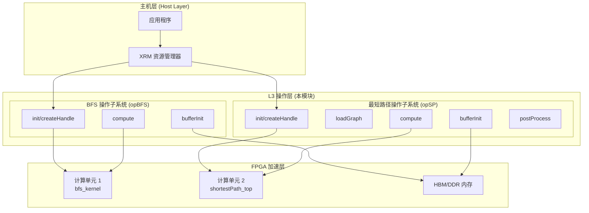

# 遍历与最短路径操作 (Traversal and Shortest Path Operations)

## 概述

本模块是 Xilinx 图分析加速库 (Xilinx Graph Library) 的 L3 层核心组件，为大规模图数据提供 **FPGA 硬件加速** 的图遍历与最短路径计算能力。它封装了两种基础且关键的图算法：

- **广度优先搜索 (BFS)**：用于连通性分析、层级遍历、无权最短路径
- **单源最短路径 (SSSP)**：支持有权图的最短路径计算（基于 Bellman-Ford 或类似算法）

> **核心思想**：将图计算中高度并行但访存不规则的计算任务卸载到 FPGA，利用定制的内存层次结构和流水线并行性，突破 CPU 的内存墙限制和 GPU 的线程发散瓶颈。

---

## 架构全景



### 架构角色定位

本模块在整体系统中扮演**计算加速器编排器 (Compute Orchestrator)** 的角色：

1. **资源协调层**：通过 XRM (Xilinx Resource Manager) 动态申请 FPGA 计算单元 (CU)，支持多租户场景下的资源隔离与调度
2. **内存管理器**：处理主机内存到 FPGA HBM/DDR 的数据迁移，管理复杂的内存拓扑 (Memory Topology) 映射
3. **执行流水线**：构建 "初始化 → 数据迁移 → 核函数执行 → 结果回传" 的异步流水线，通过 OpenCL 事件链管理依赖关系

---

## 核心设计决策

### 1. 为什么使用 OpenCL + XRM 而非独立内核驱动？

**选择的权衡**：
- **可移植性**：OpenCL 允许同一套代码在 Alveo U50/U200/U280 等不同平台运行，只需更换 xclbin
- **资源虚拟化**：XRM 提供了 FPGA 资源的池化管理，支持 "申请-使用-释放" 的生命周期，这对于多任务共享 FPGA 的云计算场景至关重要
- **代价**：相比裸机驱动，OpenCL 增加了约 5-10μs 的调度开销，但对于图计算这种毫秒级任务而言可忽略

### 2. 内存拓扑的显式控制 (XCL_MEM_TOPOLOGY)

**关键设计**：代码中通过 `XCL_MEM_TOPOLOGY` 标志显式指定每个缓冲区使用 HBM 的哪个 bank 或 DDR 的哪个通道：

```cpp
// HBM 配置示例
mext_in[0] = {(unsigned int)(3) | XCL_MEM_TOPOLOGY, info, 0}; // HBM bank 3
mext_in[1] = {(unsigned int)(0) | XCL_MEM_TOPOLOGY, config, 0}; // HBM bank 0
```

**为什么重要**：
- **带宽最大化**：将图的不同部分 (offsets, indices, weights) 映射到不同的 HBM bank，实现并行访问
- **避免 bank 冲突**：精心设计的拓扑映射可确保高并发访问不会集中在单一内存 bank
- **硬件约束**：如果不显式指定，OpenCL 运行时可能将缓冲区分配到 DDR，导致带宽瓶颈

### 3. 计算单元 (CU) 的复制与负载均衡

**设计模式**：
```cpp
dupNmBFS = 100 / requestLoad;  // 根据请求的负载百分比决定复制因子
cuPerBoardBFS /= dupNmBFS;
```

**解读**：
- **虚拟化**：XRM 允许以 "负载百分比" (requestLoad) 申请 CU，但底层物理 CU 是离散的。`dupNm` (duplicate number) 计算需要多少个逻辑 CU 实例来满足负载需求
- **索引计算**：`channelID + cuID * dupNm + deviceID * dupNm * cuPerBoard` 这个复杂的索引公式实现了跨设备、跨 CU、通道的三维寻址
- **权衡**：这种硬编码的索引逻辑提高了性能（无运行时查找开销），但增加了代码复杂度，且要求调用者严格遵循编号约定

---

## 数据流深度追踪

以 **单源最短路径 (SSSP)** 计算为例，追踪数据如何从主机内存流向 FPGA 并返回：

### 阶段 1：初始化与资源分配
```
App -> opSP::init(xrm, kernelName, ...)
    -> createHandle(xrm, handle, ...) [对每个 CU]
        -> xrm->allocCU(...)  // 向 XRM 申请物理 CU
        -> cl::Program(...)   // 加载 xclbin
        -> cl::Kernel(...)     // 实例化 kernel
```

**关键细节**：
- `createHandle` 是重资源操作，涉及 FPGA 比特流加载和内核编译，通常在应用启动时执行一次
- `clHandle` 结构体保存了上下文、命令队列、程序、内核、资源句柄等所有 OpenCL 状态

### 阶段 2：图数据加载 (Load Graph)
```
App -> opSP::loadGraph(g)
    -> 创建线程池 (每个物理 CU 一个线程)
    -> loadGraphCoreSP(handles[j], nrows, nnz, g)
        -> 创建 cl::Buffer [0..5] 映射到图结构
        -> enqueueMigrateMemObjects(...)  // H2D 传输
```

**内存布局策略**：
- `buffer[0]` -> `g.offsetsCSR` (行偏移，大小 nrows+1)
- `buffer[1]` -> `g.indicesCSR` (列索引，大小 nnz)
- `buffer[2]` -> `g.weightsCSR` (边权重，大小 nnz，float)
- `buffer[5]` -> `ddrQue` (算法内部队列，固定大小 10*300*4096)

**HBM 拓扑**：通过 `mext_in` 结构体显式指定每个缓冲区使用 HBM 的哪个 bank (0, 3, 5)，实现并行访问最大化。

### 阶段 3：计算执行 (Compute)
```
App -> opSP::addwork(...)
    -> createL3(task_queue, &compute, ...)  // 任务队列封装
        -> compute(deviceID, cuID, channelID, ..., g, result, pred)
            -> bufferInit(...)  // 创建输入/输出缓冲区
            -> migrateMemObj(hds, 0, ...)  // H2D: config, info
            -> cuExecute(...)              // 执行 kernel
            -> migrateMemObj(hds, 1, ...)  // D2H: result, pred
            -> events_read[0].wait()       // 同步等待
            -> postProcess(...)            // 错误检查
```

**执行流水线**：
1. **Config Buffer**：包含算法参数 (nrows, infinity value, source ID, command type)
2. **Info Buffer**：算法状态输出 (队列溢出标志、表溢出标志)
3. **Result/Pred Buffers**：计算结果 (距离数组、前驱节点数组)

**Kernel 参数绑定**：
```cpp
kernel0.setArg(0, config);
kernel0.setArg(1, offsets);  // buffer[0]
kernel0.setArg(2, indices);  // buffer[1]
kernel0.setArg(3, weights);  // buffer[2]
kernel0.setArg(4, ddrQue);   // buffer[5]
// ... result, pred, info
```

### 阶段 4：资源释放
```
App -> opSP::freeSP(ctx)
    -> msspThread.join()  // 等待后台线程
    -> for each CU:
        -> delete[] handles[i].buffer;
        -> xrmCuRelease(ctx, handles[i].resR)  // 释放 XRM 资源
    -> delete[] handles;
```

---

## 关键设计权衡与风险点

### 1. 内存所有权与生命周期管理

**风险**: 代码中混合使用了 `new`/`delete`、`aligned_alloc`/`free` 和 OpenCL 缓冲区映射，容易出错。

**具体模式**:
- `clHandle` 数组：`new clHandle[CUmax]`，在 `freeSP`/`freeBFS` 中 `delete[]`
- `cl::Buffer` 数组：`new cl::Buffer[bufferNm]`，每个 handle 独立释放
- 临时缓冲区：`aligned_alloc<uint32_t>(...)`，必须在函数退出前 `free`

**安全准则**:
- **RAII 缺失**：当前代码不使用 `unique_ptr` 或 `shared_ptr`，完全依赖手动管理。添加异常处理时必须确保异常安全，否则容易泄漏 OpenCL 资源。
- **对齐要求**：`aligned_alloc` 分配的内存用于 `CL_MEM_USE_HOST_PTR` 标志的 OpenCL 缓冲区，必须 4KB 对齐以满足 FPGA DMA 要求。

### 2. 并发与线程安全

**设计约束**:
- **单线程访问**：`opBFS`/`opSP` 实例内部不是线程安全的。`compute` 方法修改 `handles` 数组和 `isBusy` 状态，必须由外部调用者同步。
- **内部线程**：`loadGraph` 使用 `std::thread` 并行化多个 CU 的图加载，但主计算流程 (`compute`) 是阻塞式的（`events_read[0].wait()`）。
- **后台线程**：`opSP` 有一个 `msspThread` 成员，用于异步处理（代码中显示在 `freeSP` 中 join，但创建代码未在片段中显示）。

**风险**: 如果在多个线程中并发调用同一个 `opSP` 实例的 `compute`，会导致命令队列 (`cl::CommandQueue`) 的竞争和 OpenCL 对象的数据竞争。

### 3. 内存拓扑硬编码

**关键依赖**: 代码通过宏 `USE_HBM` 和硬编码的 bank ID (0, 2, 3, 4, 5, 6, 8, 9, 10) 控制内存分配。

```cpp
#ifdef USE_HBM
    mext_in[0] = {(unsigned int)(3) | XCL_MEM_TOPOLOGY, info, 0};
    mext_in[1] = {(unsigned int)(0) | XCL_MEM_TOPOLOGY, config, 0};
#else
    mext_in[0] = {(unsigned int)(0) | XCL_MEM_TOPOLOGY, info, 0};
    // ...
#endif
```

**硬件耦合**: 这些 bank ID 必须与实际 FPGA 平台的连接性 (connectivity) 配置文件一致。如果平台有 4 个 HBM 伪通道但代码尝试访问 bank 5，会导致运行时错误。

**可移植性成本**: 移植到新平台需要：
1. 重新编译 xclbin 以匹配新平台的内核连接性
2. 调整代码中的 bank ID 映射以匹配新平台的 HBM 拓扑
3. 验证 `USE_HBM` 宏定义是否与新平台内存类型匹配

### 4. 错误处理与调试

**错误传播**: 
- OpenCL 错误通过 `cl_int fail` 变量捕获，使用 `logger.logCreateContext(fail)` 等记录，但错误不会传播给调用者（`compute` 返回 int，但实现中始终返回 0 或 ret）
- `opSP::postProcess` 检查 `info` 缓冲区中的溢出标志（队列溢出、表溢出），但仅打印错误而不抛出异常

**调试支持**: 代码包含详细的 `NDEBUG` 调试输出，打印设备 ID、内核名、资源分配详情等。这有助于调试多设备、多 CU 配置下的资源分配问题。

**静默失败风险**: 如果 `xrm->allocCU` 失败，代码会回退到使用默认实例名 (`bfs_kernel` 或 `shortestPath_top`)，这可能在资源紧张时导致运行时内核创建失败，而非提前报告资源不足。

---

## 子模块详解

本模块由两个紧密相关但功能独立的子系统构成，分别对应 BFS 和最短路径算法：

### 1. BFS 操作子系统 (`op_bfs`)

负责无权图的广度优先遍历，适用于连通性检测、距离层级计算等场景。

**核心特性**:
- 支持 CSR (Compressed Sparse Row) 格式的图表示
- 输出：每个节点的发现时间、完成时间、前驱节点、距离（层级）
- 7 个 OpenCL 缓冲区管理（offsets, indices, queue, discovery, finish, predecent, distance）

**详细文档**: [bfs-operations](graph_analytics_and_partitioning-l3_openxrm_algorithm_operations-traversal_and_connectivity_operations-traversal_and_shortest_path_operations-bfs_operations.md)

### 2. 最短路径操作子系统 (`op_sp`)

负责有权图的单源最短路径计算，支持多种算法变体（根据配置可能是 Bellman-Ford 或 Delta-Stepping 的 FPGA 实现）。

**核心特性**:
- 支持带权图（float 类型的边权重）
- 可配置是否计算前驱节点 (predecessor)
- 支持加权/无权模式切换 (`weighted` 参数)
- 内部错误检测（队列溢出、表溢出）

**详细文档**: [shortest-path-operations](graph_analytics_and_partitioning-l3_openxrm_algorithm_operations-traversal_and_connectivity_operations-traversal_and_shortest_path_operations-shortest_path_operations.md)

---

## 跨模块依赖与交互

### 上游依赖 (本模块依赖)

1. **XRM (Xilinx Resource Manager)**
   - 用于：`xrm->allocCU()`, `xrmCuRelease()`
   - 作用：在 Alveo/Versal 平台上实现 FPGA 计算单元的动态分配
   - 位置：`l3_openxrm_algorithm_operations` 层级的资源管理

2. **OpenCL 运行时 (Xilinx 定制版)**
   - 用于：`cl::Context`, `cl::CommandQueue`, `cl::Buffer`, `cl::Kernel`
   - 作用：提供主机与 FPGA 之间的通信抽象
   - 依赖文件：`xcl.hpp` (Xilinx OpenCL 扩展)

3. **通用日志工具**
   - 用于：`xf::common::utils_sw::Logger`
   - 作用：统一记录 OpenCL 对象创建错误

4. **L3 任务调度基础设施**
   - 用于：`createL3()`, `task_queue`, `event<int>`
   - 作用：异步任务提交与结果获取（虽然当前实现是阻塞式的，但接口支持异步）

### 下游依赖 (依赖本模块)

本模块通常被更高层的图分析应用或特定领域的加速引擎调用：

1. **图数据库查询引擎**：使用 BFS 进行多跳邻居查询
2. **社交网络分析**：使用 SSSP 计算影响力传播的最短路径
3. **网络路由优化**：使用 SSSP 计算最优路由路径

---

## 新贡献者快速指南

### 开发环境准备

1. **硬件要求**：Alveo U50/U200/U280 或 Versal VCK190
2. **软件栈**：XRT (Xilinx Runtime), XRM, Vitis 202x.x
3. **编译宏**：注意 `USE_HBM` 宏的定义，这决定了内存拓扑配置是否使用 HBM

### 修改代码时的注意事项

1. **CU 索引计算**：如果修改了设备数量或 CU 复制因子 (`dupNm`)，必须同步修改索引计算公式：
   ```cpp
   hds = &handles[channelID + cuID * dupNmSP + deviceID * dupNmSP * cuPerBoardSP];
   ```

2. **缓冲区对齐**：所有使用 `CL_MEM_USE_HOST_PTR` 的主机内存必须通过 `aligned_alloc(4096, ...)` 分配，以确保 DMA 兼容性。

3. **内核参数顺序**：修改 `kernel0.setArg()` 调用时，必须与 FPGA 内核的 RTL 接口定义严格一致，顺序和类型都不能错。

### 调试技巧

1. **启用详细日志**：在编译时定义 `NDEBUG` 宏（实际上代码中检查 `#ifndef NDEBUG`，所以应该不定义 NDEBUG 来启用调试输出）
2. **XRM 资源检查**：使用 `xrmcheck` 工具检查 FPGA 上的 CU 分配情况，确认资源泄漏
3. **OpenCL 事件分析**：使用 Xilinx 的 `xclbin` 分析工具和 OpenCL 事件剖析功能，测量实际的 H2D/D2H 传输时间和内核执行时间

---

*本文档由架构师团队维护。如有疑问，请联系图分析加速引擎团队。*