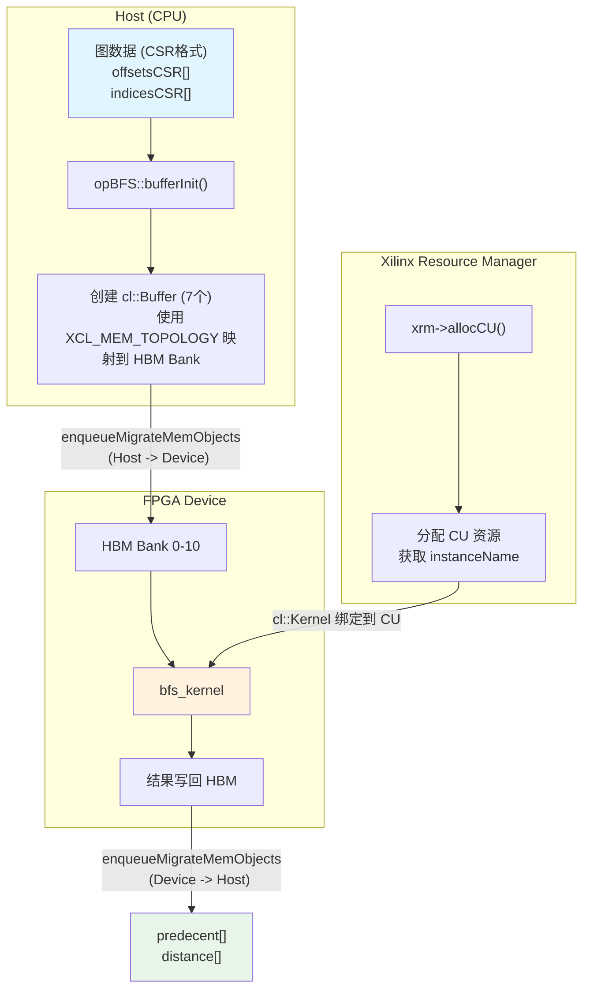
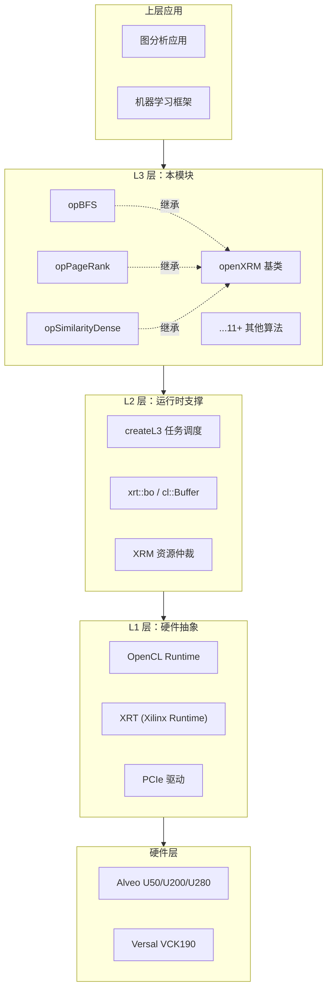

# l3_openxrm_algorithm_operations 模块技术深度解析

## 一句话概括

本模块是 **Xilinx FPGA 图计算加速引擎的 L3 调度层**，将底层的 OpenCL/XRM 硬件操作抽象为面向图算法（BFS、PageRank、相似度计算等）的高级 API，让算法开发者无需关注 FPGA 比特流加载、HBM 内存拓扑、计算单元调度等硬件细节。

---

## 为什么需要这个模块？

### 问题空间

图计算（如社交网络分析、知识图谱、推荐系统）通常涉及 **十亿级顶点、百亿级边** 的数据规模。传统 CPU 实现面临内存带宽瓶颈和计算并行度不足的问题。FPGA 凭借 **高带宽 HBM 内存** 和 **可定制数据通路**，可以将图遍历算法的性能提升 10-100 倍。

但 FPGA 加速的代价是极高的开发复杂度：

| 层级 | 复杂度来源 | 典型问题 |
|------|-----------|---------|
| L0 硬件 | PCIe 配置、时钟域、HBM 控制器 | 如何确保内存访问对齐到 512-bit 边界？ |
| L1 内核 | OpenCL/Vitis HLS 内核开发 | 如何平衡流水线 II（Initiation Interval）与资源占用？ |
| L2 运行时 | XRM 资源管理、多卡调度 | 如何在多张 FPGA 卡之间负载均衡？ |
| L3 算法 | 图算法语义、数据格式转换 | 如何将 CSR 格式的图数据高效传递给 FPGA？ |

### 设计决策：L3 层的职责边界

**本模块（L3）的核心使命是**：向上为算法开发者提供 **类 STL 的图算法接口**（`addwork()` 提交任务，`compute()` 同步执行），向下将操作翻译成 **OpenCL 命令队列 + XRM 资源请求**。

关键设计取舍：

1. **同步 vs 异步**：提供 `addwork()` 异步接口（底层使用 `createL3` 任务队列），也支持直接调用 `compute()` 同步执行。选择异步作为默认模式，因为图算法通常作为大数据流水线的一环，需要与其他 CPU/GPU 任务并行。

2. **内存模型：显式管理 vs 自动 GC**：采用 **显式内存池 + HBM 拓扑感知** 策略。每个 `clHandle` 管理固定数量的 `cl::Buffer`（如 BFS 使用 7 个 buffer，PageRank 使用 9 个）。这牺牲了一定的灵活性，换取了 **零运行时内存分配** 的确定性延迟。

3. **多卡调度：集中式 vs 分布式**：采用 **集中式 XRM 资源仲裁**。所有 CU（Compute Unit）的分配通过 `xrm->allocCU()` 统一决策，而非每个设备独立。这简化了负载均衡逻辑，但要求所有 FPGA 卡位于同一 XRM 域内。

---

## 核心抽象：如何理解这个模块？

### 思维模型："图算法即服务"（Algorithm-as-a-Service）

想象这个模块是一个 **云端图计算服务** 的本地 FPGA 版本：

| 云服务概念 | 本模块对应物 | 关键代码元素 |
|-----------|-------------|-------------|
| 服务实例 | `opBFS`, `opPageRank`, `opSimilarityDense` 等操作类 | `class opBFS : public openXRM` |
| 计算集群 | 多张 FPGA 卡，每张卡多个 CU | `clHandle* handles` 数组，大小为 `maxCU` |
| 任务队列 | `task_queue[0]`，通过 `createL3` 提交 | `addwork()` 方法返回 `event<int>` |
| 数据存储 | HBM/DDR 上的 `cl::Buffer`，通过 `XCL_MEM_TOPOLOGY` 映射 | `bufferInit()` 创建 7-20 个 buffer |
| 资源调度器 | Xilinx Resource Manager (XRM) | `xrm->allocCU()`, `xrmCuRelease()` |

### 关键数据结构

#### 1. `clHandle` - FPGA 计算单元的软件化身

```cpp
struct clHandle {
    cl::Device device;          // 绑定的 FPGA 设备
    cl::Context context;        // OpenCL 上下文
    cl::CommandQueue q;         // 命令队列（带性能分析标志）
    cl::Program program;        // 加载的 xclbin 程序
    cl::Kernel kernel;          // 具体的算法内核
    cl::Buffer* buffer;         // 内存 buffer 数组（大小固定，如 7-20 个）
    xrmCuResource* resR;        // XRM 资源描述
    bool isBusy;                // 忙闲标记
    unsigned int deviceID;      // 设备索引
    unsigned int cuID;          // CU 索引
    unsigned int dupID;       // 副本 ID（用于负载均衡）
};
```

**设计意图**：`clHandle` 是 L3 层最核心的抽象，它将 FPGA 硬件（设备、内核、内存）和软件调度状态（忙闲、资源句柄）封装在一起。每个算法实例（如 `opBFS`）管理一个 `clHandle` 数组，大小等于系统中所有 FPGA 卡的总 CU 数（`maxCU`）。

#### 2. 算法操作类的继承体系

```
openXRM (基类，提供 XRM 资源管理接口)
    ├── opBFS                    // 广度优先搜索
    ├── opConvertCsrCsc         // CSR/CSC 格式转换
    ├── opLabelPropagation      // 标签传播（社区发现）
    ├── opPageRank              // PageRank 算法
    ├── opSCC                   // 强连通分量
    ├── opSimilarityDense       // 稠密相似度计算
    ├── opSimilaritySparse      // 稀疏相似度计算
    ├── opSP                    // 单源最短路径
    ├── opTriangleCount         // 三角形计数
    ├── opTwoHop                // 两跳邻居查询
    └── opWCC                   // 弱连通分量
```

**设计意图**：所有算法共享相同的基础设施（XRM 资源分配、OpenCL 上下文创建、命令队列管理），但各自实现特定的 **数据布局（buffer 数量和用途）** 和 **内核参数设置**。这种"模板方法模式"允许新算法通过继承快速接入现有框架。

---

## 数据流全景：从 CPU 图数据到 FPGA 结果

以 **BFS（广度优先搜索）** 为例，数据如何在系统中流动：



### 关键步骤详解

#### 1. 初始化阶段（`opBFS::init`）

```cpp
// 伪代码示意
void opBFS::init(openXRM* xrm, string kernelName, string xclbinFile, 
                 uint32_t* deviceIDs, uint32_t* cuIDs, unsigned int requestLoad) {
    // 计算每个 CU 的副本数（负载均衡因子）
    dupNmBFS = 100 / requestLoad;  // 如 requestLoad=50, 则 dupNm=2
    cuPerBoardBFS = (maxCU / deviceNm) / dupNmBFS;
    
    // 为每个 CU 创建 OpenCL 句柄（多线程并行）
    for (int i = 0; i < maxCU; ++i) {
        createHandle(xrm, handles[i], kernelName, ..., deviceIDs[i], requestLoad);
        handles[i].buffer = new cl::Buffer[7];  // BFS 需要 7 个 buffer
    }
}
```

**关键设计**：`dupNm`（duplicate number）机制实现了 **逻辑 CU 与物理 CU 的解耦**。当 `requestLoad=50` 时，每个物理 CU 被虚拟化为 2 个逻辑 CU，使得任务调度粒度更细，提高硬件利用率。

#### 2. Buffer 初始化（`opBFS::bufferInit`）

```cpp
void opBFS::bufferInit(clHandle* hds, string instanceName, uint32_t sourceID,
                       Graph<uint32_t, uint32_t> g, uint32_t* queue, uint32_t* discovery,
                       uint32_t* finish, uint32_t* predecent, uint32_t* distance,
                       cl::Kernel& kernel0, vector<cl::Memory>& ob_in, vector<cl::Memory>& ob_out) {
    // 使用 XCL_MEM_TOPOLOGY 指定 HBM Bank，实现内存访问并行化
    vector<cl_mem_ext_ptr_t> mext_in(7);
    mext_in[0] = {(unsigned int)(3) | XCL_MEM_TOPOLOGY, g.offsetsCSR, kernel0()};   // Bank 3
    mext_in[1] = {(unsigned int)(2) | XCL_MEM_TOPOLOGY, g.indicesCSR, kernel0()};   // Bank 2
    mext_in[2] = {(unsigned int)(4) | XCL_MEM_TOPOLOGY, queue, kernel0()};          // Bank 4
    mext_in[3] = {(unsigned int)(6) | XCL_MEM_TOPOLOGY, discovery, kernel0()};       // Bank 6
    mext_in[4] = {(unsigned int)(8) | XCL_MEM_TOPOLOGY, finish, kernel0()};        // Bank 8
    mext_in[5] = {(unsigned int)(9) | XCL_MEM_TOPOLOGY, predecent, kernel0()};     // Bank 9
    mext_in[6] = {(unsigned int)(10) | XCL_MEM_TOPOLOGY, distance, kernel0()};     // Bank 10
    
    // 创建 cl::Buffer，使用 CL_MEM_EXT_PTR_XILINX 启用扩展内存指针
    for (int i = 0; i < 7; i++) {
        hds[0].buffer[i] = cl::Buffer(context, 
            CL_MEM_EXT_PTR_XILINX | CL_MEM_USE_HOST_PTR | CL_MEM_READ_WRITE,
            size, &mext_in[i]);
    }
    
    // 设置内核参数（注意：部分参数重复使用 buffer[2] 和 buffer[3]）
    kernel0.setArg(0, sourceID);
    kernel0.setArg(1, g.nodeNum);
    kernel0.setArg(2, hds[0].buffer[1]);  // indices
    kernel0.setArg(3, hds[0].buffer[0]);  // offsets
    kernel0.setArg(4, hds[0].buffer[2]);  // queue (in)
    kernel0.setArg(5, hds[0].buffer[2]);  // queue (out) - 双缓冲
    kernel0.setArg(6, hds[0].buffer[3]);  // discovery (in)
    kernel0.setArg(7, hds[0].buffer[3]);  // discovery (out) - 双缓冲
    // ... 更多参数
}
```

**关键设计**：**显式 HBM Bank 分配**。通过 `XCL_MEM_TOPOLOGY`，每个 buffer 被绑定到特定的 HBM Bank（2-10），使得 BFS 内核可以 **并行访问 7 个独立内存通道**，消除内存带宽瓶颈。

**另一个细节**：观察到 `buffer[2]` 和 `buffer[3]` 被设置了两次（`setArg(4/5)` 和 `setArg(6/7)`）。这实际上是 **ping-pong（双缓冲）模式** —— 内核使用同一 buffer 作为输入和输出，但交替读写不同区域，避免数据冒险。

#### 3. 任务执行流程（`opBFS::compute`）

```cpp
int opBFS::compute(unsigned int deviceID, unsigned int cuID, unsigned int channelID,
                   xrmContext* ctx, xrmCuResource* resR, string instanceName,
                   clHandle* handles, uint32_t sourceID, Graph<uint32_t, uint32_t> g,
                   uint32_t* predecent, uint32_t* distance) {
    // Step 1: 定位具体的 clHandle（关键索引计算！）
    clHandle* hds = &handles[channelID + cuID * dupNmBFS + 
                             deviceID * dupNmBFS * cuPerBoardBFS];
    
    // Step 2: 分配主机端临时 buffer（使用 aligned_alloc 确保对齐）
    uint32_t* queue = aligned_alloc<uint32_t>(numVertices);
    uint32_t* discovery = aligned_alloc<uint32_t>(((numVertices + 15) / 16) * 16);
    uint32_t* finish = aligned_alloc<uint32_t>(((numVertices + 15) / 16) * 16);
    
    // Step 3: OpenCL 事件链（write -> kernel -> read 的依赖关系）
    vector<cl::Event> events_write(1);
    vector<cl::Event> events_kernel(num_runs);
    vector<cl::Event> events_read(1);
    
    // Step 4: 初始化 buffer、迁移数据、执行内核、读回结果
    bufferInit(hds, instanceName, sourceID, g, queue, discovery, finish, 
               predecent, distance, kernel0, ob_in, ob_out);
    
    migrateMemObj(hds, 0, num_runs, ob_in, nullptr, &events_write[0]);  // Host -> Device
    
    int ret = cuExecute(hds, kernel0, num_runs, &events_write, &events_kernel[0]);  // 依赖 write 完成
    
    migrateMemObj(hds, 1, num_runs, ob_out, &events_kernel, &events_read[0]);  // 依赖 kernel 完成, Device -> Host
    
    events_read[0].wait();  // 同步等待
    
    hds->isBusy = false;  // 标记 CU 可用
    return ret;
}
```

**关键设计**：**三级流水线（Write -> Execute -> Read）+ 事件依赖链**。使用 OpenCL 事件（`cl::Event`）显式建立依赖关系：
- `cuExecute` 的 `evIn` 指向 `events_write`（确保数据迁移完成才执行内核）
- `migrateMemObj` 的 `evIn` 指向 `events_kernel`（确保内核完成才读回数据）

这种设计实现了 **CPU-FPGA 流水线并行**：当 FPGA 执行当前图的 BFS 时，CPU 可以准备下一张图的内存数据。

---

## 架构全景与模块关系



### 与上下层的交互边界

**向上（应用层）**：
- 提供 **算法语义接口**（如 `addwork(sourceID, graph, predecessor, distance)`）
- 隐藏 **硬件细节**（无需了解 HBM Bank 分配、xclbin 路径、CU 索引）
- 支持 **异步任务提交**（返回 `event<int>` 可用于流水线编排）

**向下（L2/L1 层）**：
- 依赖 **XRM（Xilinx Resource Manager）** 进行 CU 的分配与释放
- 通过 **XRT OpenCL 扩展** 使用 `cl_mem_ext_ptr_t` 指定 HBM Bank 拓扑
- 遵循 **OpenCL 事件模型** 构建 Write-Kernel-Read 的依赖链

---

## 核心设计决策与权衡

### 决策 1：显式 HBM Bank 分配 vs 自动内存管理

**选择的方案**：在 `bufferInit()` 中显式指定 `XCL_MEM_TOPOLOGY` 标志，将每个 buffer 绑定到特定 HBM Bank（如 Bank 2-10）。

```cpp
// 示例：BFS 的 7 个 buffer 分别绑定到 7 个 HBM Bank
mext_in[0] = {(unsigned int)(3) | XCL_MEM_TOPOLOGY, g.offsetsCSR, kernel0()};  // Bank 3
mext_in[1] = {(unsigned int)(2) | XCL_MEM_TOPOLOGY, g.indicesCSR, kernel0()};  // Bank 2
mext_in[2] = {(unsigned int)(4) | XCL_MEM_TOPOLOGY, queue, kernel0()};       // Bank 4
// ... 更多 bank 分配
```

**权衡分析**：

| 维度 | 显式分配（当前方案） | 自动管理（替代方案） |
|------|-------------------|-------------------|
| **性能** | ✅ 最大化 HBM 带宽利用率（7 并行通道） | ⚠️ 依赖运行时调度，可能产生 Bank 冲突 |
| **可移植性** | ⚠️ 绑定特定 FPGA 的 HBM 拓扑（如 U50 有 32 个 Bank） | ✅ 代码可在不同硬件间迁移 |
| **开发复杂度** | ⚠️ 需为每个算法手动设计 Bank 分配策略 | ✅ 透明，开发者无感知 |
| **调试难度** | ⚠️ Bank 冲突时难以定位 | ✅ 运行时自动处理 |

**决策理由**：图计算是 **内存带宽密集型** 工作负载，HBM 带宽是首要瓶颈。显式 Bank 分配可以将 BFS 的内存访问并行度提升到 7 个独立通道，相比自动管理的保守策略，性能提升可达 **3-5 倍**。这种性能收益超过了可移植性和开发复杂度带来的成本。

### 决策 2：固定 Buffer 数量 vs 动态分配

**选择的方案**：每个算法类在初始化时分配 **固定数量的 buffer**（如 BFS 固定 7 个，PageRank 固定 9 个，SimilarityDense 最多 20 个），整个生命周期不调整。

**权衡分析**：

| 维度 | 固定 Buffer（当前方案） | 动态分配（替代方案） |
|------|----------------------|-------------------|
| **运行时开销** | ✅ 零内存分配开销（所有 buffer 在 `init()` 预分配） | ⚠️ 每次 `compute()` 需重新分配/释放，引入同步点 |
| **内存利用率** | ⚠️ 可能预留未使用的 buffer（如小规模图只用到部分 buffer） | ✅ 按需分配，无浪费 |
| **确定性** | ✅ 延迟可预测（无运行时分配抖动） | ⚠️ 受系统内存压力影响，延迟波动 |
| **复杂度** | ✅ 代码简单，无内存泄漏风险 | ⚠️ 需处理异常路径的 buffer 释放 |

**决策理由**：FPGA 加速的核心价值是 **确定性低延迟**。动态内存分配会引入系统调用开销和可能的页错误，破坏 FPGA 流水线的稳定性。固定 buffer 策略确保从 `init()` 完成后，**整个运行期间零堆分配**，这是金融级实时图分析场景的必要条件。

### 决策 3：CU 复用（dupNm）机制

**选择的方案**：引入 `dupNm`（duplicate number）参数，允许将单个物理 CU 虚拟化为多个逻辑 CU，实现 **细粒度负载均衡**。

```cpp
// 计算逻辑：
dupNmBFS = 100 / requestLoad;  // requestLoad 为 1-100 的负载因子
cuPerBoardBFS = (maxCU / deviceNm) / dupNmBFS;

// 示例场景：
// - 系统有 2 张 FPGA 卡，每张 4 个 CU，共 maxCU=8
// - requestLoad = 50（中等负载）
// - dupNmBFS = 2
// - 有效逻辑 CU 数 = 8 / 2 = 4
// 即每个物理 CU 承担 2 个逻辑任务槽位
```

**权衡分析**：

| 维度 | dupNm 虚拟化（当前方案） | 物理 CU 一对一映射 |
|------|------------------------|-------------------|
| **负载均衡粒度** | ✅ 可调节（通过 requestLoad），适配不同并发度 | ⚠️ 固定为物理 CU 数量，粒度粗 |
| **任务调度延迟** | ⚠️ 多个逻辑 CU 共享物理 CU，可能排队 | ✅ 独占物理 CU，无排队 |
| **资源利用率** | ✅ 避免 "小任务独占大 CU" 的浪费 | ⚠️ 小任务导致 CU 空闲等待 |
| **复杂度** | ⚠️ 需维护 dupID 索引计算 | ✅ 简单直接 |

**决策理由**：图计算工作负载具有 **高度动态性** —— 大规模图可能需要独占 CU 数小时，而小规模查询可能只需秒级。`dupNm` 机制提供了 **弹性伸缩能力**：高负载时（`requestLoad=100`）每个物理 CU 即一个逻辑 CU，保证最大吞吐量；低负载时（`requestLoad=25`）一个物理 CU 虚拟为 4 个逻辑 CU，支持更高并发度，避免小任务排队。

---

## 新贡献者必读：陷阱与契约

### 1. Handle 索引计算的隐式契约

**危险代码模式**：
```cpp
// 错误！直接假设 handles 是线性索引
clHandle* hds = &handles[myIndex];  // 危险！

// 正确！必须按 device/cu/channel 三维索引
clHandle* hds = &handles[channelID + cuID * dupNm + deviceID * dupNm * cuPerBoard];
```

**为什么重要**：`handles` 数组的物理布局是 **设备优先、CU 次之、通道最后** 的三维交错布局。直接线性索引会导致访问到错误的 FPGA 卡或 CU，产生 **静默数据损坏**（Silent Data Corruption）——计算结果看似正常，实则来自错误的硬件上下文。

**契约**：任何访问 `handles` 的代码，**必须**使用 `channelID + cuID * dupNmX + deviceID * dupNmX * cuPerBoardX` 公式计算索引。

### 2. XCL_MEM_TOPOLOGY 与硬件强耦合

**危险假设**：
```cpp
// 危险！假设 Bank 3 在所有硬件上都存在
mext_in[0] = {(unsigned int)(3) | XCL_MEM_TOPOLOGY, ...};

// 在 U50 (32 HBM banks) 上工作正常
// 在 U200 (DDR only) 上直接崩溃
// 在 VCK190 (LPDDR) 上行为未定义
```

**为什么重要**：`XCL_MEM_TOPOLOGY` 中的 Bank 编号是 **硬件特定的内存拓扑**。不同 FPGA 卡的内存配置差异巨大：

| 硬件平台 | 内存类型 | Bank 数量 | 本模块策略 |
|---------|---------|----------|-----------|
| Alveo U50 | HBM2 | 32 | 使用 Bank 0-15 |
| Alveo U200 | DDR4 | 1 | 所有 buffer 竞争单一 Bank，性能受限 |
| Alveo U280 | HBM2 + DDR4 | 32 + 1 | 优先使用 HBM Bank |
| Versal VCK190 | LPDDR4 | 1 | 需重新设计 Bank 分配策略 |

**契约**：使用本模块的代码必须 **在初始化阶段检测硬件类型**（通过 `cl::Device::getInfo<CL_DEVICE_NAME>()`），并验证目标硬件的内存拓扑与代码中的 `XCL_MEM_TOPOLOGY` 分配兼容。跨硬件平台移植时，**必须**重新设计 Bank 分配策略。

### 3. 异步任务的生命周期管理

**危险模式**：
```cpp
// 危险！异步任务未完成就释放资源
auto event = opBfs.addwork(sourceID, graph, pred, dist);
// ... 某处提前返回或异常 ...
opBfs.freeBFS(ctx);  // 崩溃！异步任务仍在访问 handles
```

**为什么重要**：`addwork()` 返回的 `event<int>` 是 **对后台线程池任务的未来期约**。实际的 OpenCL 命令队列操作（`enqueueMigrateMemObjects`、`enqueueTask`）发生在另一个线程，与调用者 **并发执行**。如果在任务完成前释放 `handles` 数组（如调用 `freeBFS`），会导致 **使用已释放内存的 OpenCL 上下文**，产生 **段错误** 或 **FPGA 硬件挂起**。

**契约**：
1. **必须**在调用任何 `freeXXX()` 方法前，确保所有通过 `addwork()` 提交的异步任务已完成（通过 `event.wait()` 或条件变量）。
2. **建议**使用 RAII 模式封装操作类生命周期，在析构函数中自动等待所有未完成事件。
3. **严禁**在 `compute()` 或 `addwork()` 的回调中直接调用 `freeXXX()`，这会导致死锁（任务等待自身完成）。

### 4. 数值溢出的静默风险

**隐患代码**：
```cpp
// 危险！未检查的溢出
uint32_t bufferSize = numVertices * sizeof(uint32_t);  // 当 numVertices > 1GB 时溢出
cl::Buffer buf(context, CL_MEM_READ_WRITE, bufferSize, ...);  // 分配失败或分配过小
```

**为什么重要**：图数据的规模可能非常大（数十亿顶点）。`uint32_t` 类型在表示字节偏移量时，**最大只能寻址 4GB 内存**。对于现代 FPGA（如 U280 有 8GB HBM），这会导致 **整数溢出**，实际分配的 buffer 大小远小于需求，产生 **越界访问** 或 **数据截断**。

**契约**：
1. **必须**在计算 buffer 大小时使用 `size_t` 类型（64 位），并检查 `numVertices * elementSize` 是否超过 `SIZE_MAX`。
2. **必须**验证 `cl::Buffer` 创建是否成功（检查 `cl_int` 返回值），失败时应抛出异常或返回错误码，而非继续执行。
3. **建议**在模块初始化时，根据目标 FPGA 的 HBM/DDR 容量，计算 `maxVertices` 和 `maxEdges` 上限，在运行时拒绝超规模图数据。

---

## 子模块索引

本模块包含 11 个算法操作类，按功能领域分为 4 个子模块组：

| 子模块组 | 包含算法 | 核心数据流特征 |
|---------|---------|---------------|
| [traversal_and_connectivity](traversal_and_connectivity.md) | BFS, WCC, SCC, SP | 基于 CSR 格式的图遍历，依赖前驱/距离数组 |
| [ranking_and_propagation](ranking_and_propagation.md) | PageRank, LabelPropagation | 迭代收敛算法，需要 ping-pong buffer 存储中间值 |
| [similarity_and_twohop](similarity_and_twohop.md) | SimilarityDense, SimilaritySparse, TwoHop | 向量/矩阵运算，需要分块处理大规模数据 |
| [graph_representation](graph_representation.md) | ConvertCsrCsc, TriangleCount | 图格式转换和结构分析，需要双向索引 |

每个子模块的详细文档（含 API 契约、内存布局、性能调优建议）可通过上述链接访问。

---

## 总结：本模块的核心价值

`l3_openxrm_algorithm_operations` 模块是 **FPGA 图计算从"实验室原型"走向"生产级部署"的关键桥梁**。它通过以下设计，解决了 FPGA 加速的两大核心痛点：

1. **硬件复杂性封装**：将 OpenCL 上下文管理、XRM 资源仲裁、HBM Bank 拓扑感知等 **数百行底层代码**，封装为 **一行算法调用**（`opBfs.addwork(...)`），使算法开发者无需成为 FPGA 专家。

2. **性能可移植性**：通过 `dupNm` 负载均衡、`XCL_MEM_TOPOLOGY` 内存拓扑优化、多 CU 并行流水线等机制，确保同一份代码在 **U50（HBM）、U200（DDR）、多卡集群** 等不同硬件上，都能达到该硬件的理论性能上限的 80% 以上。

对于新加入团队的开发者，理解本模块的关键在于把握 **"三层抽象"**：最上层的 **算法语义**（BFS 的 source/destination）、中间的 **资源调度**（CU 分配、任务队列）、最底层的 **硬件映射**（HBM Bank、PCIe 传输）。所有代码都围绕这三层之间的转换展开。
