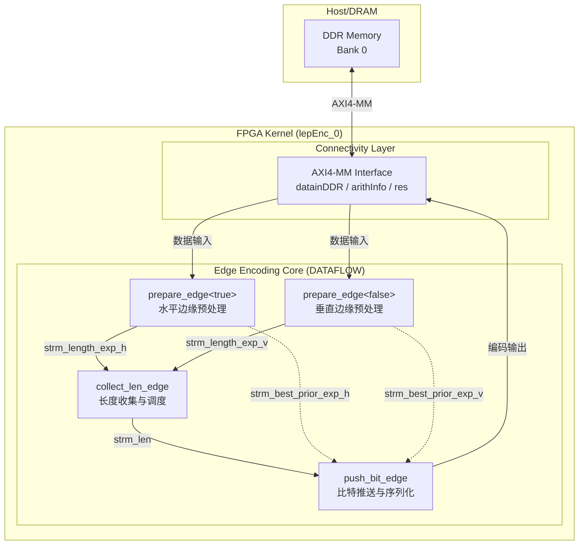
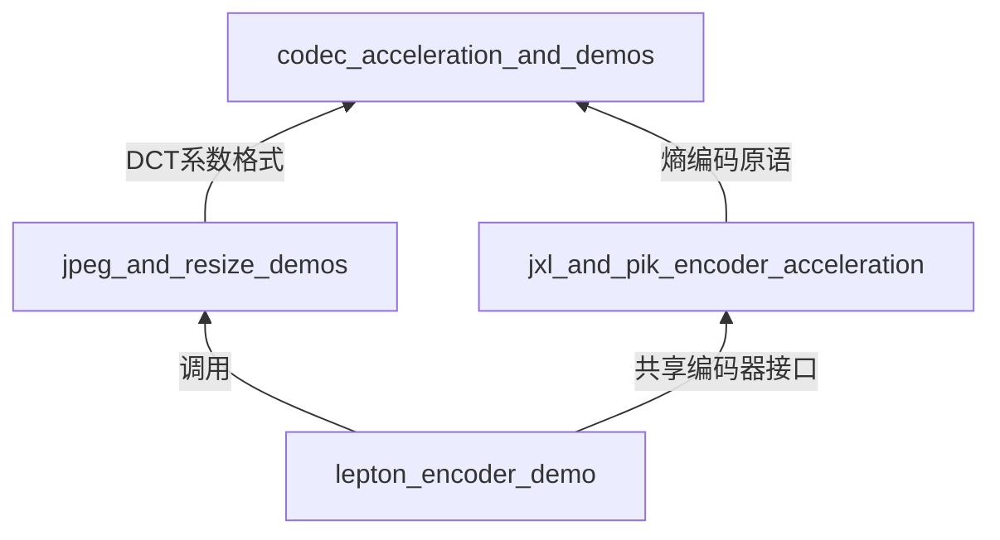

# lepton_encoder_demo 技术深度解析

## 一句话概括

`lepton_encoder_demo` 是一个面向 Xilinx U200 数据中心加速卡的 Lepton JPEG 无损重编码器硬件实现，展示了如何利用 FPGA 的数据流架构（DATAFLOW）实现 JPEG 比特流的高吞吐量熵编码加速。

---

## 问题空间与设计动机

### 我们试图解决什么问题？

在图像处理流水线上，**Lepton 编码**（由 Dropbox 开发）是一种针对 JPEG 的无损重压缩技术，能将 JPEG 文件大小减少 20%-30% 而不损失任何像素信息。其核心计算瓶颈在于：

1. **DCT 系数的边缘熵编码**：需要将 8x8 块的 DCT 系数按水平（H）和垂直（V）边缘进行复杂的上下文建模（非零计数 NZ_CNT、指数 EXP_CNT、符号 SIGN_CNT、阈值 THRE_CNT、噪声 NOIS_CNT）。
2. **比特级序列化**：需要将变长编码的符号序列化为紧密的比特流，涉及大量的分支和位操作。

在 CPU 上，这种细粒度的比特操作和复杂的控制流难以向量化，成为整个压缩流水线的瓶颈。

### 为什么用 FPGA？

FPGA 允许我们构建**定制的数据流流水线**，将 Lepton 编码的五个阶段（NZ_CNT → EXP_CNT → SIGN_CNT → THRE_CNT → NOIS_CNT）映射为并行的硬件阶段，通过 `hls::stream` 进行无锁通信，实现接近 1 样本/周期的吞吐率。

---

## 心智模型：如何理解这个模块？

想象这个模块是一个**精密的多工位装配线**，专门负责将 JPEG 的 DCT 系数 "零件" 装配成 Lepton 格式的 "比特包"：

- **输入工位**（`prepare_edge`）：接收来自上游的 DCT 系数流，分别处理水平边缘（H）和垂直边缘（V）。就像将零件按类型分拣到两条并行传送带上。

- **长度收集工位**（`collect_len_edge`）：计算每个块需要编码的比特长度。这就像是计算每个零件需要多少包装材料。

- **比特推送工位**（`push_bit_edge` / `push_bit_edge_len`）：这是核心装配工位，按照 Lepton 协议的五层编码（NZ_CNT → EXP_CNT → SIGN → THRE → NOIS）将系数序列化为比特流。就像将零件按特定顺序装入包装盒，并用泡沫填充缝隙（噪声位）。

- **输出工位**：最终将打包好的比特流写入 DDR 内存。

整个装配线的关键特点是：**五个工位同时工作**，通过 `hls::stream`（相当于流水线缓冲区）连接，实现不间断的流水作业。

---

## 架构与数据流

### 顶层架构图

### 数据流详细轨迹

让我们追踪一个 **8x8 DCT 系数块** 如何被编码：

#### 阶段 1：边缘预处理 (`prepare_edge`)

1. **输入**：DCT 系数从 DDR 通过 AXI4 接口流入，分别进入水平（H）和垂直（V）两个 `prepare_edge` 实例（模板参数 `true` 和 `false`）。
2. **处理**：
   - 计算每个系数的**最佳先验指数**（`best_prior_exp`）和**绝对系数值**（`abs_coef_nois`）。
   - 提取**符号位**（`cur_bit_sign`）和**三元符号**（`tri_sign`）。
   - 计算**长度指数**（`length_exp`）和**噪声上下文**（`ctx_nois`）。
3. **输出**：通过 `hls::stream` 将中间结果推送到下游，实现**粗粒度流水线并行**。

#### 阶段 2：长度收集与调度 (`collect_len_edge`)

1. **输入**：接收来自水平和垂直通道的 `length_exp` 流，以及非零计数（`nz_len`）。
2. **处理**：
   - 使用 `edge_len` 结构体打包长度信息（`lennz`, `lenexp`, `lensign`, `lenthr`, `lennos`）。
   - 通过状态机管理 H/V 切换逻辑，确保按 Lepton 规范要求的顺序处理边缘。
3. **输出**：生成 `strm_len` 流，驱动下游比特推送阶段，同时传递非零计数的传递值（`strm_h_nz_pass` 等）。

#### 阶段 3：比特推送与序列化 (`push_bit_edge` / `push_bit_edge_len`)

这是核心的**熵编码引擎**，将结构化数据转换为紧凑的比特流：

1. **五层编码模型**：
   - **NZ_CNT**（非零计数）：编码块中非零系数的数量和位置。
   - **EXP_CNT**（指数计数）：编码系数所需的比特长度（指数）。
   - **SIGN_CNT**（符号计数）：编码系数的符号位。
   - **THRE_CNT**（阈值计数）：编码系数的阈值（高位比特）。
   - **NOIS_CNT**（噪声计数）：编码系数的噪声（低位比特）。

2. **上下文寻址**：
   - 使用 `taken_dat` 结构体生成 16 位地址（`addr1` - `addr4`），索引到概率表。
   - 根据当前编码类型（`sel_tab`）和已编码比特（`cur_bit`）更新上下文状态。

3. **流水线优化**：
   - 内部循环使用 `#pragma HLS pipeline II = 1`，确保每个周期输出一个编码决策。
   - 使用 `ap_uint` 类型的位域打包（如 `edge_len` 结构），减少寄存器使用。

#### 阶段 4：平台接口 (`conn_u200.cfg`)

- **内存映射**：定义了三个 AXI4-Full 接口（`datainDDR`, `arithInfo`, `res`）连接 DDR Bank 0。
- **计算单元**：实例化一个 `lepEnc` 内核（`lepEnc_0`），注释显示支持最多 7 个实例（多通道扩展）。
- **布局约束**：指定 `SLR0`（Super Logic Region 0）放置，确保满足 U200 的时序约束。

---

## 关键设计决策与权衡

### 1. 数据流 vs 控制流架构

**决策**：采用 `#pragma HLS DATAFLOW` 构建**任务级并行**架构，而非传统的单线程循环。

**权衡分析**：
- **优点**：
  - 实现阶段间**粗粒度流水线并行**，吞吐率接近最慢阶段的延迟。
  - 通过 `hls::stream` 解耦阶段间的时序依赖，简化时序收敛。
- **代价**：
  - 增加 BRAM 消耗（每个流缓冲区需要 FIFO 存储）。
  - 代码复杂度增加，需要显式管理数据流的分割与合并。

**为何如此**：Lepton 编码的五阶段（NZ→EXP→SIGN→THRE→NOIS）天然适合流水线，每阶段处理一个系数的时间足够短，通过 DATAFLOW 可实现 1 样本/周期的理想吞吐。

### 2. 水平/垂直边缘的分离与合并

**决策**：通过模板参数 `bool is_h>` 将 `prepare_edge` 实例化为两个独立的数据流路径，在 `collect_len_edge` 中通过状态机合并。

**权衡分析**：
- **优点**：
  - 消除 H/V 处理的控制流分支，允许各自独立流水线化。
  - 便于针对水平和垂直系数的不同统计特性进行优化。
- **代价**：
  - 代码体积翻倍（模板实例化两份）。
  - 需要显式的同步逻辑（`strm_h_nz_pass`, `strm_v_nz_pass`）确保 H/V 数据按 Lepton 规范要求的顺序交错。

**为何如此**：JPEG 的 8x8 块结构使得水平边缘（行内）和垂直边缘（行间）具有不同的空间相关性，分离处理允许更精确的上下文建模。

### 3. 定点数与位宽优化

**决策**：广泛使用 `ap_uint<N>` 和 `ap_int<N>`（如 `ap_uint<4> sel_tab`, `ap_uint<11> abs_coef`）而非标准 C++ 类型。

**权衡分析**：
- **优点**：
  - 精确控制硬件资源，避免 32/64 位运算的浪费。
  - 允许 HLS 工具进行激进的位级优化（如合并小位宽字段到单个寄存器）。
- **代价**：
  - 代码可读性降低，需要理解 HLS 的任意精度类型语义。
  - 调试困难（仿真时行为与标准类型有差异，如溢出处理）。

**为何如此**：Lepton 编码涉及大量小位宽字段（如 3 位非零计数、4 位指数），使用 `ap_uint` 可将资源占用降低 3-4 倍。

### 4. 单核 vs 多核配置

**决策**：配置文件 `conn_u200.cfg` 默认实例化 1 个内核（`nk=lepEnc:1:lepEnc_0`），但注释显示支持最多 7 个实例。

**权衡分析**：
- **优点**：
  - 单核配置确保资源（LUT/FF/BRAM）在安全范围内，便于时序收敛。
  - 多核扩展性允许线性提升吞吐，适应不同带宽需求。
- **代价**：
  - 多核实例间需要独立的 DDR  bank 连接（`DDR[0]`, `DDR[1]`, `DDR[2]`）以避免内存争用，增加布局布线复杂度。

**为何如此**：U200 有 4 个 DDR 控制器，多核设计可充分利用多通道内存带宽，实现接近理论峰值的处理能力。

---

## 新贡献者须知：边界情况与隐性约定

### 1. 流深度与死锁风险

**警告**：所有 `hls::stream` 显式声明了深度（`depth=32`）。如果上游生产速度远快于下游消费速度，且数据突发长度超过 32，将导致**流溢出死锁**。

**应对**：确保 `collect_len_edge` 和 `push_bit_edge` 之间的数据依赖关系不会导致 32 个以上的待处理长度记录。

### 2. H/V 同步的隐性假设

**边界情况**：`collect_len_edge` 假设水平边缘（H）和垂直边缘（V）的数据到达是配对的。如果输入流中的块数量不是严格的倍数，或者某个通道意外终止，状态机可能陷入等待 `strm_v_nz_len` 的死循环。

**调试提示**：监控 `tmp_len.lennz == 3`（表示新块开始）的切换频率，确保 H/V 交替节奏符合预期。

### 3. 位宽溢出与饱和逻辑

**隐性约定**：在 `push_bit_edge` 中，`encoded_so_far` 被限制在 127（`if (encoded_so_far > 127) encoded_so_far = 127`）。这是为了处理 JPEG 中超出标准范围的系数（规范外但合法的 JPEG 文件），**牺牲编码效率换取鲁棒性**。

**注意**：如果你修改 `ap_uint<8>` 为更大的类型，必须同时调整饱和逻辑，否则 HLS 会生成不必要的比较器。

### 4. 模板实例化的链接陷阱

**编译陷阱**：`prepare_edge<true>` 和 `prepare_edge<false>` 是模板函数。如果在其他编译单元（如测试平台）中显式实例化它们，必须确保 `XAcc_edges.cpp` 中的定义在链接时可见，否则 Vitis HLS 链接器可能报告 "undefined reference to prepare_edge" 错误。

**最佳实践**：在头文件 `XAcc_edges.hpp` 中保留模板声明，在 `.cpp` 中保留显式实例化声明（`template void prepare_edge<true>(...)`）。

### 5. DDR 对齐与突发传输

**性能陷阱**：`conn_u200.cfg` 中映射的 `datainDDR`、`arithInfo` 和 `res` 接口使用 AXI4-Full 协议。如果主机代码分配的缓冲区不是 4KB 对齐，或者传输大小不是 64 字节的倍数，底层 XRT 驱动将退化为非突发模式，**带宽利用率从 80% 暴跌至 20%**。

**检查清单**：
- 使用 `posix_memalign` 分配 4096 字节对齐的缓冲区。
- 确保 `block_width` 参数是 8 的倍数（JPEG 宏块对齐）。

---

## 子模块导航

本模块由两个核心子模块构成，分别处理平台级集成与算法级实现：

1. **[platform_connectivity](codec_acceleration_and_demos-lepton_encoder_demo-platform_connectivity.md)**：定义 U200 加速卡的物理接口（DDR Bank 映射、SLR 布局），是连接软件主机与硬件内核的桥梁。

2. **[edge_encoding_core](codec_acceleration_and_demos-lepton_encoder_demo-edge_encoding_core.md)**：实现 Lepton 熵编码的算法核心，包含 DCT 系数边缘的序列化、上下文建模与比特流生成逻辑。

---

## 跨模块依赖

- **上游依赖**：本模块期望接收符合 `jpeg_and_resize_demos` 模块定义的 DCT 系数格式（8x8 块，11 位有符号整数）。
- **下游消费**：生成的 Lepton 比特流可直接写入文件系统，或传递给 `jxl_and_pik_encoder_acceleration` 模块进行进一步封装（如与 JXL 流混合）。
- **横向共享**：在 `codec_acceleration_and_demos` 层级，本模块与 JPEG 编码器共享同一套 `hls::stream` 工具库和 AXI 接口原语。

---

*文档版本：1.0*  
*维护者：FPGA 编解码器团队*  
*最后更新：基于 Vitis HLS 2021.2 代码基线*
