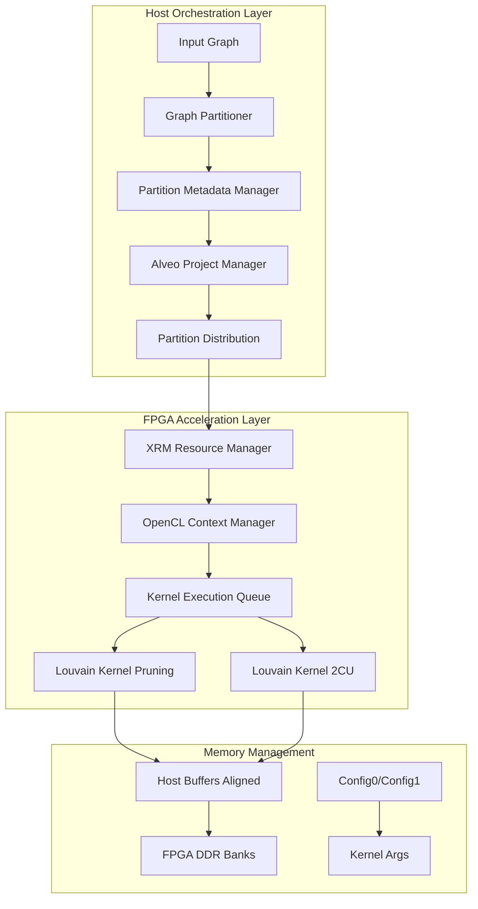

# Louvain Modularity Execution and Orchestration

想象一下，你有一个包含数十亿节点的社交网络图，需要找出其中紧密连接的社区（Community Detection）。传统的 CPU 算法可能需要数小时甚至数天才能完成。现在，想象你拥有一排 Xilinx Alveo FPGA 加速卡，每张卡都能并行处理数百万个图节点。**Louvain Modularity Execution and Orchestration** 模块正是这座连接"海量图数据"与"FPGA 并行算力"的桥梁——它不仅协调多个 FPGA 之间的分布式计算，还智能地处理图分区、内存映射、迭代收敛等复杂逻辑，让原本需要数小时的分析在几分钟内完成。

## 架构概览

该模块实现了基于 FPGA 的 Louvain 社区检测算法的完整执行流程。Louvain 算法是一种迭代的、层次化的图聚类方法，通过最大化模块度（Modularity）来识别社区结构。本模块的架构设计遵循"主机-加速器"协同计算范式：

### 核心组件职责

**1. PartitionRun (匿名命名空间)**
这是分区操作的"事务管理器"。它将一次完整的图分区操作视为一个原子事务，管理从输入图到生成 Alveo 分区文件的完整生命周期。它封装了分区参数配置、跨服务器分区分布策略、以及元数据文件（.par.proj）的生成逻辑。可以将其类比为数据库事务管理器——确保分区操作的原子性和一致性。

**2. LouvainModImpl**
这是模块的 PIMPL（Pointer to Implementation）外观类，遵循桥接模式。它向外部公开稳定的接口，同时隐藏内部实现细节。它持有 `PartitionRun` 实例管理图分区，持有 `ComputedSettings` 验证和计算运行时参数。这种设计的精妙之处在于：客户端代码只需与 `LouvainModImpl` 交互，而无需了解底层的 FPGA 编程细节或图分区算法。

**3. opLouvainModularity**
这是与 FPGA 硬件直接交互的"硬件抽象层"。它封装了 OpenCL 设备管理、Xilinx XRM（Xilinx Resource Manager）资源分配、内核执行调度等底层操作。该类实现了两种主要的计算内核模式：**LOUVAINMOD_PRUNING_KERNEL**（带剪枝优化的单内核模式）和 **LOUVAINMOD_2CU_U55C_KERNEL**（双计算单元模式，适用于 U55C 卡）。它管理着复杂的内存拓扑映射——通过 `XCL_MEM_TOPOLOGY` 将主机缓冲区映射到 FPGA 的特定 DDR 银行（Bank 0-3），确保内存访问带宽最大化。

**4. ComputedSettings**
这是一个纯数据结构的配置验证器。它从用户提供的 `Options` 中提取原始参数，进行验证和转换，计算出实际的运行时设置（如服务器数量、节点 ID、ZMQ 模式等）。它扮演着"配置编译器"的角色——将高层抽象的用户意图转换为底层可执行的具体参数。

## 关键设计决策

### 1. 图分区策略：垂直切分 vs 水平复制

**决策**：采用基于顶点范围的垂直切分（Vertex Range Partitioning）策略，将大图按顶点 ID 范围划分为多个子图（Partitions），每个分区可独立加载到单个 Alveo 卡。

**权衡分析**：
- **优势**：每个 FPGA 只需处理子图，避免单卡内存容量限制（U50 约 64M 顶点，U55C 约 128M 顶点）；支持多卡并行处理超大规模图（十亿级顶点）。
- **代价**：跨分区边（Ghost Edges）需要在主机端预处理；分区之间负载可能不均衡（高度数顶点集中在某分区）。
- **替代方案未选**：水平复制（将同一图复制到多卡）无法实现更大规模图处理；流式处理（Streaming）复杂度太高且难以保持算法收敛性。

### 2. 内存架构：显式 DDR Bank 映射 vs 统一虚拟内存

**决策**：采用显式的 FPGA DDR Bank 拓扑映射策略，通过 `XCL_MEM_TOPOLOGY` 标志将不同类型的缓冲区（边列表、顶点属性、配置参数）绑定到特定的 DDR Bank（0-3），最大化内存带宽利用率。

**权衡分析**：
- **优势**：避免多个高带宽流竞争同一 DDR Bank 导致的带宽瓶颈；利用 U55C 的多 DDR 银行架构（4 个 DDR 银行）实现并行数据访问。
- **代价**：增加了代码复杂度，开发者必须手动管理内存拓扑；缓冲区分配失败时调试困难；代码可移植性降低（不同 FPGA 板卡的 DDR 拓扑不同）。
- **内存所有权模型**：主机端使用 `aligned_alloc` 分配页对齐内存，所有权归 `KMemorys_host_prune` 结构体；OpenCL 缓冲区通过 `cl::Buffer` 包装，所有权归 `clHandle`；显式调用 `migrateMemObj` 在主机与设备间转移数据所有权。

### 3. 计算模型：迭代阶段（Phase）与内核变体

**决策**：将 Louvain 算法实现为迭代式的 Phase 循环（外层循环），每个 Phase 内部包含多个 Iteration 直到收敛。支持两种 FPGA 内核变体：**Pruning Kernel**（单 CU，带边剪枝优化）和 **2CU Kernel**（双 CU 并行，带顶点重编号优化）。

**权衡分析**：
- **优势**：Phase/Iteration 两级结构天然匹配 Louvain 算法的层次化社区发现（每个 Phase 压缩图为超节点图）；双 CU 模式利用 U55C 的更多逻辑资源，实现近 2 倍吞吐提升；剪枝模式减少低质量边的计算，加速收敛。
- **代价**：Phase 间需要在主机端重建图（`buildNextLevelGraphOpt`），引入主机端计算开销；双 CU 模式对图结构有要求（需顶点重编号），不适用于所有输入；内核切换需要重新加载 xclbin，增加初始化延迟。
- **状态管理**：每个 Phase 的图状态（`GLV` 结构）保存在主机内存，FPGA 仅处理当前 Phase 的 CSR 表示；社区分配 `C` 数组在 Phase 间累积，通过 `PhaseLoop_UpdatingC_org` 更新。

### 4. 错误处理与资源管理

**决策**：采用 RAII（Resource Acquisition Is Initialization）结合异常处理的策略管理 FPGA 资源（XRM 上下文、OpenCL 上下文、内存缓冲区）。关键错误（如 FPGA 初始化失败、内存分配失败）抛出 `Exception`，资源释放放在析构函数或 `freeLouvainModularity` 等显式清理函数中。

**权衡分析**：
- **优势**：RAII 确保异常安全（Exception Safety）——即使发生错误，已分配的资源也能正确释放；XRM 的 `xrmCuRelease` 确保 FPGA 计算单元（CU）在进程退出时释放，避免资源泄漏。
- **代价**：C++ 异常在 FPGA 驱动代码中可能带来性能开销（尽管非关键路径）；需要确保所有 OpenCL 对象（`cl::Buffer`, `cl::Kernel`）在上下文销毁前被销毁，否则可能引发段错误。
- **关键不变式**：`clHandle` 结构体拥有 `cl::Buffer` 数组的所有权，生命周期与 `clHandle` 绑定；`KMemorys_host_prune` 拥有主机端 `aligned_alloc` 分配的指针，必须在 OpenCL 缓冲区释放后、上下文销毁前释放。

## 新贡献者须知

### 1. 图分区与顶点 ID 的边界情况

**陷阱**：当输入图的顶点 ID 不连续或存在孤立顶点时，`addPartitionData` 中的顶点范围计算（`start_vertex`, `end_vertex`）可能产生空分区或越界访问。

**必须检查**：
- 验证 `partitionData.NV_par_requested` 是否超过 `NV_par_max_margin`（64M * 0.8），否则自动截断
- 检查 `parInServer_` 向量累积的分区数是否匹配预期 `numPars`
- 多服务器场景下，确保 `nodeId` 正确映射到分区文件命名（`par_svr<N>_<M>.par`）

### 2. FPGA 内存拓扑的隐含契约

**陷阱**：`UsingFPGA_MapHostClBuff_prune` 函数通过 `mext_in` 数组显式绑定 DDR Bank，但 U50 和 U55C 的 Bank 数量不同（U50: 2 DDR, U55C: 4 DDR）。代码中硬编码的 Bank ID（如 `(unsigned int)(4) | XCL_MEM_TOPOLOGY`）在 U50 上可能无效。

**必须遵守**：
- 在 `createHandle` 中检测设备类型（`devName`），设置全局变量 `glb_MAXNV`, `glb_MAXNE`
- 确保 `kernelMode` 与硬件匹配：U55C 支持 `LOUVAINMOD_2CU_U55C_KERNEL`，U50 仅支持 `LOUVAINMOD_PRUNING_KERNEL`
- 缓冲区分配使用 `aligned_alloc(4096)` 确保页对齐，否则 `cl::Buffer` 创建失败

### 3. 迭代 Phase 中的状态一致性问题

**陷阱**：Louvain 算法在 Phase 转换时（`PhaseLoop_CommPostProcessing_par`）会重建图结构（`buildNextLevelGraphOpt`）。如果前一个 Phase 的 FPGA 计算未完成（`ev.wait()` 未调用），或 `pglv_iter` 与 `pglv_orig` 的社区映射 `C` 未正确更新，会导致社区 ID 混乱或段错误。

**关键检查点**：
- 确保 `ev.wait()` 在访问 `pglv_iter->C` 前完成
- 验证 `PhaseLoop_UpdatingC_org` 正确将当前 Phase 的社区映射累积到原始图
- 检查 `numClusters` 是否通过引用正确传递，确保 Phase 间图重建使用正确的顶点数

### 4. 资源泄漏与 XRM 上下文生命周期

**陷阱**：`opLouvainModularity` 在 `init` 中分配 XRM 资源（`xrm->allocCU`）和 OpenCL 缓冲区，但在异常路径（如 `createHandle` 失败）或正常退出时，如果 `freeLouvainModularity` 未被调用，会导致 FPGA 计算单元（CU）泄漏，其他进程无法使用该 CU。

**防御性编程要求**：
- 使用 RAII 包装 `xrmContext` 和 `clHandle`，确保析构时调用 `xrmCuRelease` 和 `cl::Buffer` 释放
- 在 `createHandle` 中，如果 `cl::Program` 或 `cl::Kernel` 创建失败，必须释放已分配的 XRM 资源（`xrmCuRelease`）再抛出异常
- 确保 `deviceOffset` 向量正确记录设备切换点，多设备场景下避免 CU ID 混淆

### 5. 并发访问与互斥锁粒度

**陷阱**：`opLouvainModularity::compute` 使用 `louvainmodComputeMutex` 数组（大小 `MAX_LOUVAINMOD_CU=128`）保护 FPGA 计算单元。如果 `which` 索引计算错误（`channelID + cuID * dupNm + deviceID * dupNm * cuPerBoard`），会导致不同 CU 使用相同锁（假共享）或相同 CU 使用不同锁（数据竞争）。

**并发安全要点**：
- 验证 `which` 计算公式的括号优先级，确保 `dupNmLouvainModularity`（通常=1 或 2）正确参与索引
- 确保 `maxCU` 不超过 `MAX_LOUVAINMOD_CU`，否则数组越界
- 注意 `std::lock_guard` 的互斥锁在 `compute` 函数退出时自动释放，但 `pglv_iter` 的计时数据（`eachTimeE2E`）在锁外更新，避免计时包含锁竞争时间

---

## 模块结构

本模块包含两个紧密协作的子模块：

### 1. [xilinxlouvain 子模块](graph_analytics_and_partitioning-community_detection_louvain_partitioning-louvain_modularity_execution_and_orchestration-xilinxlouvain.md)
负责图分区（Graph Partitioning）的顶层协调，包括多服务器分区策略、项目元数据管理和 Louvain 算法的主机端 orchestration 逻辑。

### 2. [op_louvainmodularity 子模块](graph_analytics_and_partitioning-community_detection_louvain_partitioning-louvain_modularity_execution_and_orchestration-op_louvainmodularity.md)
负责 FPGA 硬件抽象，包括 OpenCL 上下文管理、XRM 资源分配、内核执行调度和主机-FPGA 内存映射。

## 跨模块依赖

本模块依赖于以下兄弟模块提供的功能：

- **[fpga_kernel_connectivity_profiles](../community_detection_louvain_partitioning/fpga_kernel_connectivity_profiles.md)**: 提供 FPGA 内核的连接性配置（Kernel Connectivity Profiles），定义了计算单元（CU）与 DDR Bank 的连接拓扑。
- **[host_clustering_data_definitions](../community_detection_louvain_partitioning/host_clustering_data_definitions.md)**: 定义主机端的图数据结构（如 `GLV`、`ParLV`）和社区聚类相关的数据类型。
- **[partition_phase_timing_and_metrics](../community_detection_louvain_partitioning/partition_phase_timing_and_metrics.md)**: 提供分区阶段的时间统计和性能指标收集功能。
- **[partition_graph_state_structures](../community_detection_louvain_partitioning/partition_graph_state_structures.md)**: 管理分区图的状态结构，包括压缩后的超图表示。

父模块 **[community_detection_louvain_partitioning](../community_detection_louvain_partitioning.md)** 提供了整个社区检测流水线的框架，本模块专注于其中的执行与编排部分。

## 设计哲学

本模块的设计体现了以下工程哲学：

1. **分层抽象（Layered Abstraction）**：从底层的 OpenCL API 到顶层的 `LouvainPar` 接口，每一层只处理本层职责范围内的复杂性。`opLouvainModularity` 隐藏 FPGA 细节，`xilinxlouvain` 隐藏分区算法细节。

2. **显式资源管理（Explicit Resource Management）**：FPGA 资源（CU、DDR Bank）是稀缺且昂贵的，因此资源分配（`xrm->allocCU`）和释放（`xrmCuRelease`）必须显式、可追踪，并通过 RAII 确保异常安全。

3. **数据局部性优先（Data Locality First）**：通过 `mapHostToClBuffers` 和 `XCL_MEM_TOPOLOGY`，数据被显式放置到离计算单元最近的 DDR Bank，最大化带宽利用率，体现了"移动计算不如移动数据"的分布式系统设计思想。

4. **迭代式收敛（Iterative Convergence）**：Louvain 算法本质是迭代优化过程。模块设计支持多 Phase、多 Iteration 的渐进式计算，每个 Phase 后检查模块度增益（`currMod - prevMod`），体现增量计算（Incremental Computation）思想。
