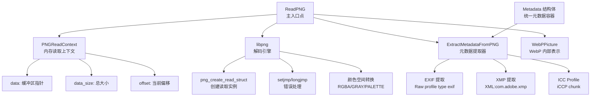

# PNG 解码后端类型 (png_decode_backend_types)

## 一句话概述

这是一个将 **libpng** 封装为 WebP 编码流水线中内存到内存解码桥的适配层。它将 PNG 二进制数据转换为 WebP 内部表示 (`WebPPicture`)，同时提取并保留所有关键元数据（EXIF、XMP、ICC 配置文件）。

想象一下这个场景：你正在构建一条图像处理流水线，上游是各种格式的原始图像（PNG、JPEG、TIFF 等），下游是统一的 WebP 编码器。`png_decode_backend_types` 就是这条流水线上的**格式转换阀门**——它不关心文件系统，不直接操作磁盘，而是纯粹地在内存中完成从 PNG 字节流到结构化图像数据的转换。

---

## 为什么需要这个模块？

在嵌入式 FPGA 加速或高性能服务器场景中，图像处理通常遵循以下模式：

1. **数据已经存在于内存中**（可能来自网络 socket、内存映射文件或其他解码器）
2. **需要避免磁盘 I/O** 以维持吞吐量和延迟 SLA
3. **元数据必须完整保留**，特别是用于色彩管理的 ICC 配置文件

libpng 虽然功能强大，但其默认 API 是基于 `FILE*` 指针的。这个模块的核心设计洞察是：**提供一个自定义的 `png_read` 回调，使 libpng 能够从内存缓冲区读取数据**，而不是文件句柄。

如果不做这个封装，调用者将面临以下选择：
- 将内存数据写入临时文件，然后用 libpng 读取（性能灾难）
- 直接使用 libpng 的低级 API 设置内存读取（代码重复，容易出错）
- 跳过 PNG 支持（限制功能）

---

## 架构与设计思维

### 核心抽象：内存读取上下文

这个模块的**思维模型**可以类比为**磁带播放机的磁带缓冲区**：

- **磁带 = PNG 二进制数据** (`data` 缓冲区)
- **播放头位置 = 当前读取偏移** (`offset`)
- **磁带长度 = 缓冲区总大小** (`data_size`)
- **播放机 = libpng 的读取回调** (`ReadFunc`)

```
PNG 数据缓冲区 [........................................]
                 ^
                 |__ offset (播放头当前位置)
```

当 libpng 需要更多数据时，它调用 `ReadFunc`，这个函数就像**精确控制的磁带机**：从当前偏移量复制指定长度的字节，然后推进播放头。断言检查确保不会读取超出缓冲区边界——如果尝试读取，程序会立即崩溃（fail-fast），这比静默读取垃圾数据要好得多。

### 组件架构



### 数据流全景

想象一条**工业流水线**：

1. **原料输入** (`ReadPNG` 被调用)
   - 输入：PNG 二进制数据 (`uint8_t* data`)、期望的 Alpha 通道保留策略
   - 状态：内存中的原始字节序列，尚未解析

2. **预处理与上下文设置** (libpng 初始化)
   - 创建 `png_struct`（解码器引擎实例）
   - 创建两个 `png_info` 结构（头部信息和尾部信息）
   - 设置自定义读取回调 (`ReadFunc`) 和错误处理 (`error_function`)
   - **关键决策**：使用 `setjmp/longjmp` 进行跨函数错误恢复——这是 libpng 的传统做法，避免了异常开销但要求仔细的资源清理

3. **头部解析与能力协商** (IHDR chunk 处理)
   - 读取图像尺寸 (`width`, `height`)
   - 读取位深度 (`bit_depth`) 和颜色类型 (`color_type`)
   - 检查是否交错 (`interlaced`)
   - **配置颜色转换管道**：
     - 16 位 → 8 位 (strip_16)
     - 调色板 → RGB (palette_to_rgb)
     - 灰度 → RGB (gray_to_rgb)
     - tRNS chunk → Alpha 通道 (tRNS_to_alpha)
     - Alpha 剥离（如果 `!keep_alpha`）

4. **元数据提取** (尾部解析前后)
   - 扫描头部和尾部的 `tEXt`/`zTXt`/`iTXt` chunks
   - 匹配已知的元数据密钥（如 `"Raw profile type exif"`）
   - 解析 ImageMagick 风格的十六进制编码配置文件
   - 提取 ICC 配置文件 (`iCCP` chunk)
   - 存储到统一的 `Metadata` 结构体

5. **图像数据解码** (IDAT chunks)
   - 处理交错图像的多遍扫描 (`num_passes`)
   - 逐行读取解码后的 RGB/RGBA 数据
   - 存储到连续分配的缓冲区 (`rgb`)

6. **WebP 集成** (输出转换)
   - 将解码后的缓冲区导入 `WebPPicture`
   - 使用 `WebPPictureImportRGBA` 或 `WebPPictureImportRGB` 进行零拷贝或低拷贝转移

7. **资源清理** (错误路径和成功路径)
   - 销毁 libpng 结构（使用 `volatile` 指针确保 `longjmp` 后仍可访问）
   - 释放 RGB 缓冲区
   - 清理元数据（错误路径）

---

## 组件深度剖析

### `PNGReadContext` — 内存读取的「磁带缓冲区」

```c
typedef struct {
    const uint8_t* data;      // 原始 PNG 数据指针（借用，非拥有）
    size_t data_size;         // 缓冲区总字节数
    png_size_t offset;        // 当前读取位置（libpng 内部使用 png_size_t）
} PNGReadContext;
```

**设计意图**：

这个结构体是模块的**关键创新点**——它允许 libpng 从内存缓冲区读取，而不需要 `FILE*`。它的设计遵循**借用语义**：`PNGReadContext` 不拥有 `data` 指向的内存，它只是在其生命周期内借用该缓冲区。

**生命周期契约**：
- `data` 必须在 `PNGReadContext` 的整个使用期间保持有效
- `offset` 被 `ReadFunc` 回调逐步推进，从 0 增长到 `data_size`
- 结构体本身通常在栈上分配（轻量级），但指向的缓冲区可能很大

**实现细节**：

```c
static void ReadFunc(png_structp png_ptr, png_bytep data, png_size_t length) {
    PNGReadContext* const ctx = (PNGReadContext*)png_get_io_ptr(png_ptr);
    assert(ctx->offset + length <= ctx->data_size);  // 硬边界检查
    memcpy(data, ctx->data + ctx->offset, length);     // 数据复制
    ctx->offset += length;                             // 推进偏移量
}
```

这里使用了 libpng 的 **I/O 替换机制**：通过 `png_set_read_fn` 注册自定义回调，`png_get_io_ptr` 可以取回用户提供的上下文指针。这是一种**策略模式**的应用——libpng 定义读取接口，此模块提供具体策略（内存读取）。

### `ReadPNG` — 主控流程与错误恢复策略

**函数签名分析**：

```c
int ReadPNG(const uint8_t* const data,      // 输入：PNG 数据（借用）
            size_t data_size,               // 输入：数据大小
            struct WebPPicture* const pic,  // 输出：WebP 图像结构（借用，内容被填充）
            int keep_alpha,                 // 配置：是否保留 Alpha 通道
            struct Metadata* const metadata // 输出/可选：元数据结构（借用，内容被填充）
           );
```

**内存所有权模型**：

| 参数 | 所有权 | 说明 |
|------|--------|------|
| `data` | 借用 | 函数不释放，调用者保持有效 |
| `pic` | 借用 | 函数填充内容，调用者负责最终释放 |
| `metadata` | 借用/可选 | 可为 NULL，若提供则填充，调用者负责最终释放 |
| `rgb` (内部) | 拥有 | 函数内 `malloc`，错误时释放，成功时转移给 `WebPPicture` |

**错误处理策略**：

此函数采用了 **setjmp/longjmp 异常模拟** 机制，这是与 libpng 交互的传统做法：

```c
volatile png_structp png = NULL;  // volatile：longjmp 后保持有效
volatile png_infop info = NULL;
// ...

// 设置错误恢复点
if (setjmp(png_jmpbuf(png))) {
    // libpng 错误时跳转至此
    MetadataFree(metadata);
    goto End;
}

// 注册错误处理函数
png_set_error_fn(png, 0, error_function, NULL);
```

**关键设计决策**：

1. **`volatile` 修饰符**：所有可能被 `longjmp` 跨越作用域访问的指针都必须标记为 `volatile`。这是因为 `longjmp` 会恢复寄存器状态，可能回滚非 `volatile` 变量的优化后值。

2. **单一出口点**：所有清理代码集中在 `End:` 标签处，通过 `goto` 跳转。这比在每个错误点重复清理代码更可靠，特别是当 `longjmp` 可能从任意深度嵌套的 libpng 调用中触发时。

3. **错误处理分层**：
   - **库级错误**（libpng 内部错误）：通过 `error_function` + `longjmp` 捕获
   - **应用级错误**（内存分配失败、格式不匹配）：通过 `goto Error` 处理
   - **成功路径**：正常流程结束，跳转至 `End`

**颜色空间转换管道**：

```c
// 标准化位深度（PNG 支持 1/2/4/8/16 位，但 WebP 期望 8 位）
png_set_strip_16(png);        // 16 位 → 8 位
png_set_packing(png);         // 打包小于 8 位的像素

// 统一颜色空间为 RGB
if (color_type == PNG_COLOR_TYPE_PALETTE)
    png_set_palette_to_rgb(png);  // 调色板 → RGB

if (color_type == PNG_COLOR_TYPE_GRAY || color_type == PNG_COLOR_TYPE_GRAY_ALPHA)
    png_set_gray_to_rgb(png);     // 灰度 → RGB

// Alpha 通道处理
if (png_get_valid(png, info, PNG_INFO_tRNS))
    png_set_tRNS_to_alpha(png);   // 透明色 → Alpha 通道

if (!keep_alpha)
    png_set_strip_alpha(png);     // 可选：剥离 Alpha
```

这段代码构建了一个**声明式的转换管道**：每一行告诉 libpng "我希望输出具有这种特性"，libpng 会自动处理中间步骤。这比手动逐像素转换更可靠、更高效（libpng 可以在解码循环内部优化转换）。

### `ExtractMetadataFromPNG` — 元数据考古学

PNG 文件格式将元数据存储在 `tEXt`、`zTXt`、`iTXt` 和 `iCCP` 等辅助块（ancillary chunks）中。这个函数扮演**数字考古学家**的角色：在文件的"头部"（IHDR 后）和"尾部"（IEND 前）挖掘这些元数据块。

**双重扫描策略**：

```c
// 优先检查头部，再检查尾部（某些工具在文件末尾写入元数据）
for (p = 0; p < 2; ++p) {
    png_infop const info = (p == 0) ? head_info : end_info;
    // 提取文本块...
}
```

**元数据密钥映射表**：

```c
static const struct {
    const char* name;           // PNG 文本块中的密钥字符串
    int (*process)(...);        // 解析处理函数
    size_t storage_offset;      // 在 Metadata 结构体中的偏移量
} kPNGMetadataMap[] = {
    {"Raw profile type exif", ProcessRawProfile, METADATA_OFFSET(exif)},
    {"Raw profile type xmp", ProcessRawProfile, METADATA_OFFSET(xmp)},
    {"Raw profile type APP1", ProcessRawProfile, METADATA_OFFSET(exif)},
    {"XML:com.adobe.xmp", MetadataCopy, METADATA_OFFSET(xmp)},
    {NULL, NULL, 0},
};
```

这个表实现了**声明式元数据路由**：新增元数据类型只需添加表项，无需修改提取逻辑。`METADATA_OFFSET` 宏利用编译时计算确定字段偏移，避免了运行时的反射开销。

**ImageMagick "Raw Profile" 解析**：

ImageMagick 工具链将嵌入式配置文件编码为一种特殊的文本格式：

```
\n<profile_name>\n<length_in_decimal>\n<hex_encoded_payload>\n
```

例如：
```
\nRaw profile type exif\n       392\n4578696600004d4d002a00000008000b011c0...
```

`ProcessRawProfile` 函数解析这种格式，将十六进制字符串转换为原始字节。这体现了模块的**生态兼容性原则**：识别并支持业界广泛使用的非标准编码实践。

---

## 依赖关系与数据契约

### 模块依赖图谱

```
┌─────────────────────────────────────────────────────────────────┐
│                    WebP 编码流水线                             │
│  ┌──────────────┐    ┌──────────────┐    ┌──────────────┐      │
│  │   cwebp      │───▶│ ReadPNG()    │───▶│ WebPEncode() │      │
│  │   命令行工具  │    │  此模块      │    │   核心编码器  │      │
│  └──────────────┘    └──────────────┘    └──────────────┘      │
└─────────────────────────────────────────────────────────────────┘
                            │
                            ▼
┌─────────────────────────────────────────────────────────────────┐
│                    此模块的下游依赖                              │
│  ┌──────────────┐    ┌──────────────┐    ┌──────────────┐      │
│  │ libpng       │    │ webp/encode.h│    │ metadata.h   │      │
│  │ 第三方解码库  │    │ WebP 类型定义 │    │ 元数据容器    │      │
│  └──────────────┘    └──────────────┘    └──────────────┘      │
└─────────────────────────────────────────────────────────────────┘
```

### 向上依赖：谁调用此模块？

此模块的唯一公开 API 是 `ReadPNG()` 函数，位于 `pngdec.h` 头文件中。根据模块树结构，它是 `webp_encoder_host_pipeline` 的一部分，被**主机端 WebP 编码示例程序**调用。

典型的调用场景：

```c
// 伪代码展示调用上下文
uint8_t* png_data = ReadFileIntoMemory("input.png");
size_t png_size = GetFileSize();

WebPPicture picture;
WebPPictureInit(&picture);

Metadata metadata;
MetadataInit(&metadata);

// 此模块的核心调用点
int success = ReadPNG(png_data, png_size, &picture, 
                      /*keep_alpha=*/1, &metadata);

if (success) {
    // 继续 WebP 编码...
    WebPEncode(&config, &picture);
}

// 清理
free(png_data);
WebPPictureFree(&picture);
MetadataFree(&metadata);
```

### 向下依赖：此模块依赖谁？

#### 1. libpng（第三方库）

这是核心依赖，提供实际的 PNG 解码能力。

**版本兼容性考虑**：
- 代码使用了条件编译处理 libpng 1.5.0 前后的 API 变化（`PNG_LIBPNG_VER` 检查）
- `PNG_iTXt_SUPPORTED` 宏用于条件编译国际化文本支持

**关键 API 使用**：
- `png_create_read_struct` / `png_destroy_read_struct`：实例生命周期管理
- `png_create_info_struct`：元数据容器
- `png_set_read_fn`：自定义 I/O 注册
- `png_set_*` 系列：转换管道配置
- `png_read_info` / `png_read_rows` / `png_read_end`：渐进式解码

#### 2. WebP 类型定义 (`webp/types.h`, `webp/encode.h`)

```c
#include "webp/types.h"        // uint8_t, size_t 等基础类型
#include "webp/encode.h"       // WebPPicture, WebPPictureImportRGBA 等
```

**数据契约**：
- `ReadPNG` 输出填充 `WebPPicture` 结构，特别是 `width`、`height` 和内部缓冲区
- 使用 `WebPPictureImportRGBA` / `WebPPictureImportRGB` 将解码后的像素数据转移到 WebP 所有权模型下

#### 3. 元数据模块 (`metadata.h`)

```c
#include "./metadata.h"        // Metadata, MetadataPayload, MetadataCopy 等
```

**组件协作**：
- `ExtractMetadataFromPNG` 将提取的原始字节委托给 `metadata.h` 中的处理器
- `Metadata` 结构是跨解码器（PNG、JPEG、TIFF 等）的统一元数据容器
- 此模块负责 PNG 特定的解析，但将存储细节委托给通用层

#### 4. 示例工具 (`example_util.h`)

```c
#include "./example_util.h"
```

可能包含共享的错误处理宏、内存分配包装器或其他跨示例程序的实用工具。在提供的代码片段中未直接看到其内容的使用，但它代表了模块间共享基础设施的模式。

---

## 设计决策与权衡分析

### 1. 错误处理：`setjmp/longjmp` vs 替代方案

**选择**：使用 `setjmp/longjmp` 进行 libpng 错误恢复

**背景**：libpng 使用 C 异常处理的传统方法。当 libpng 遇到错误（如损坏的输入数据），它调用用户提供的错误函数，期望该函数执行非局部跳转到设置的错误恢复点。

**权衡分析**：

| 方案 | 优点 | 缺点 | 适用性 |
|------|------|------|--------|
| `setjmp/longjmp` | 与 libpng 原生兼容；零开销设置 | 不调用析构函数/清理代码；容易资源泄漏 | ✅ 选择：必须兼容 libpng |
| C++ 异常 | 自动栈展开和析构调用 | libpng 是 C 库，需要桥接层 | ❌ 不适用于纯 C 代码 |
| 返回码传播 | 简单，显式控制流 | 需要在每个 libpng 调用后检查，繁琐 | ❌ libpng 不支持（错误时调用错误处理器） |
| `longjmp` + `volatile` 保护 | 缓解资源泄漏问题 | 代码复杂，需要仔细标记 `volatile` | ✅ 实际采用：结合两者 |

**风险缓解**：

代码通过以下方式缓解 `longjmp` 的资源泄漏风险：

1. **`volatile` 指针**：所有可能在 `longjmp` 后访问的堆分配指针都标记为 `volatile`
   ```c
   volatile png_structp png = NULL;
   volatile png_infop info = NULL;
   uint8_t* volatile rgb = NULL;
   ```

2. **单一清理点**：无论正常完成还是错误跳转，执行流最终汇聚到 `End:` 标签
   ```c
   End:
       if (png != NULL) {
           png_destroy_read_struct(...);
       }
       free(rgb);
       return ok;
   ```

3. **显式错误路径**：在 `longjmp` 目标点 (`Error:`) 执行必要的元数据清理
   ```c
   Error:
       MetadataFree(metadata);  // 清理可能部分填充的元数据
       goto End;
   ```

### 2. 内存管理：借用 vs 拥有的语义

**核心原则**：模块尽可能使用**借用语义**，减少内存分配和复制。

**借用模式**：

| 资源 | 所有权 | 生命周期保证 |
|------|--------|-------------|
| `data` 输入缓冲区 | 调用者拥有 | 函数执行期间必须有效 |
| `PNGReadContext` | 栈分配 | 函数作用域内 |
| `pic` 指向的 `WebPPicture` | 调用者拥有/预先初始化 | 函数填充但不负责清理 |
| `metadata` 指向的 `Metadata` | 调用者拥有/可选 | 函数填充但不负责清理 |

**拥有模式**（内部资源）：

| 资源 | 分配点 | 释放点 | 策略 |
|------|--------|--------|------|
| `png` (libpng 实例) | `png_create_read_struct` | `png_destroy_read_struct` (End 标签) | RAII 模拟 |
| `info` / `end_info` | `png_create_info_struct` | 同上，打包销毁 | 依赖 `png` 实例 |
| `rgb` (像素缓冲区) | `malloc(stride * height)` | `free(rgb)` (End 标签) 或转移给 `WebPPicture` | 条件转移所有权 |

**所有权转移**：

在成功路径上，`rgb` 缓冲区的所有权被**转移**给 `WebPPicture`：

```c
// rgb 目前由本模块拥有
ok = has_alpha 
    ? WebPPictureImportRGBA(pic, rgb, (int)stride)
    : WebPPictureImportRGB(pic, rgb, (int)stride);

if (!ok) {
    goto Error;  // 失败：rgb 仍由本模块清理
}
// 成功：rgb 的所有权转移给 pic，本模块不释放
```

注意：这里有一个**隐含契约**——`WebPPictureImportRGBA` 的成功意味着它接管了 `rgb` 缓冲区的生命周期管理。如果 WebP 实现改为复制数据而非引用，`rgb` 的释放责任仍然在本模块。当前代码假设 WebP 进行零拷贝或引用计数管理，这需要查阅 WebP 文档确认。

### 3. 颜色空间转换的声明式管道

**设计理念**：利用 libpng 的内置转换能力，而非手动逐像素处理。

**转换管道配置**：

```c
// 1. 位深度标准化 → 8 位
png_set_strip_16(png);        // 丢弃高位字节
png_set_packing(png);         // 将 <8 位的样本打包到字节边界

// 2. 调色板展开 → RGB
if (color_type == PNG_COLOR_TYPE_PALETTE)
    png_set_palette_to_rgb(png);

// 3. 灰度提升 → RGB
if (color_type == PNG_COLOR_TYPE_GRAY || color_type == PNG_COLOR_TYPE_GRAY_ALPHA) {
    if (bit_depth < 8)
        png_set_expand_gray_1_2_4_to_8(png);  // 灰度位扩展
    png_set_gray_to_rgb(png);               // R=G=B 复制
}

// 4. 透明色转换 → Alpha 通道
if (png_get_valid(png, info, PNG_INFO_tRNS))
    png_set_tRNS_to_alpha(png);

// 5. 可选：Alpha 剥离（下游不需要时）
if (!keep_alpha)
    png_set_strip_alpha(png);
```

**设计权衡**：

| 特性 | libpng 声明式转换 | 手动逐像素转换 |
|------|------------------|---------------|
| **正确性** | ✅ 经过广泛测试，处理边界情况 | ⚠️ 容易遗漏颜色类型组合 |
| **性能** | ✅ libpng 可优化内部循环 | ❌ 额外的遍历和缓存不友好 |
| **代码复杂度** | ✅ 简洁，意图清晰 | ❌ 数百行 switch-case |
| **灵活性** | ⚠️ 受 libpng 支持的功能限制 | ✅ 可实现自定义算法 |
| **内存占用** | ✅ 流式处理，无需额外缓冲 | ❌ 可能需要中间缓冲区 |

**决策理由**：在此场景中，libpng 已经支持所有需要的转换，且正确性和性能优先于灵活性。声明式方法使代码专注于"想要什么"（目标格式）而非"如何做"（转换步骤），显著降低了维护负担。

### 4. 元数据提取的双重扫描策略

**问题背景**：PNG 规范允许元数据出现在文件的任何位置，实践中：
- Adobe 工具倾向于在 IHDR 后立即写入（头部）
- ImageMagick 的 `-set` 操作默认附加到文件末尾（尾部）
- 某些工具可能产生重复副本

**解决方案**：优先扫描头部，再扫描尾部。

```c
// 优先检查头部 (p=0)，再检查尾部 (p=1)
for (p = 0; p < 2; ++p) {
    png_infop const info = (p == 0) ? head_info : end_info;
    png_textp text = NULL;
    const png_uint_32 num = png_get_text(png, info, &text, NULL);
    
    // 遍历所有文本块...
    for (i = 0; i < num; ++i, ++text) {
        // 匹配已知密钥...
    }
}
```

**去重策略**：如果发现相同类型的元数据已存在（通过检查 `payload->bytes != NULL`），后续副本被忽略并记录警告：

```c
if (payload->bytes != NULL) {
    fprintf(stderr, "Ignoring additional '%s'\n", text->key);
}
```

这种**首次优先**策略与 Adobe 工具的行为一致（头部通常是"主"副本，尾部是备份），同时确保不会因重复元数据导致内存重复分配。

### 5. 十六进制解析：防御性编程实践

`HexStringToBytes` 函数展示了处理外部输入的**防御性编程**风格。

**函数契约**：
- **输入**：十六进制字符串（允许换行分隔），期望长度
- **输出**：分配的字节缓冲区，或 NULL（失败时）
- **验证**：严格的长度匹配和字符集验证

**关键防御措施**：

```c
static uint8_t* HexStringToBytes(const char* hexstring, size_t expected_length) {
    // 1. 前置分配：确保有足够空间
    uint8_t* const raw_data = (uint8_t*)malloc(expected_length);
    if (raw_data == NULL) return NULL;
    
    // 2. 严格边界检查：绝不写入超过分配的内存
    for (dst = raw_data; actual_length < expected_length && *src != '\0'; ++src) {
        // ... 解析逻辑 ...
        
        // 3. 验证转换成功
        *dst++ = (uint8_t)strtol(val, &end, 16);
        if (end != val + 2) break;  // 字符无效，立即停止
        ++actual_length;
    }
    
    // 4. 严格验证结果：长度必须精确匹配
    if (actual_length != expected_length) {
        free(raw_data);
        return NULL;  // 不足或过多都视为失败
    }
    return raw_data;
}
```

**设计原则体现**：

| 原则 | 实现 |
|------|------|
| **Fail-fast** | 遇到无效字符立即停止，不尝试恢复 |
| **Complete validation** | 不仅检查错误，还验证成功解析的字节数精确匹配期望 |
| **No partial success** | 要么返回完整正确数据，要么返回 NULL，没有中间状态 |
| **Resource safety** | 任何返回 NULL 的路径都先释放已分配内存，避免泄漏 |

---

## 使用模式与最佳实践

### 基本使用模式

```c
#include "pngdec.h"
#include "metadata.h"

// 1. 准备输入数据（通常从文件读取或网络接收）
FILE* file = fopen("input.png", "rb");
fseek(file, 0, SEEK_END);
size_t size = ftell(file);
rewind(file);
uint8_t* data = malloc(size);
fread(data, 1, size, file);
fclose(file);

// 2. 初始化 WebP 图片结构
WebPPicture pic;
if (!WebPPictureInit(&pic)) {
    // 错误处理
}

// 3. 初始化元数据结构（可选，如果不需要元数据可传 NULL）
Metadata metadata;
memset(&metadata, 0, sizeof(metadata));

// 4. 调用解码
int keep_alpha = 1;  // 保留 PNG 的 Alpha 通道
int success = ReadPNG(data, size, &pic, keep_alpha, &metadata);

if (!success) {
    fprintf(stderr, "PNG 解码失败\n");
    // 注意：错误时 metadata 可能已部分填充，需要清理
    MetadataFree(&metadata);
} else {
    // 5. 使用解码后的数据
    printf("尺寸: %dx%d\n", pic.width, pic.height);
    
    // 检查元数据
    if (metadata.exif.bytes) {
        printf("EXIF 元数据: %zu 字节\n", metadata.exif.size);
    }
    if (metadata.iccp.bytes) {
        printf("ICC 配置文件: %zu 字节\n", metadata.iccp.size);
    }
    
    // 6. 进行 WebP 编码...
    // WebPEncode(&config, &pic);
}

// 7. 清理资源
WebPPictureFree(&pic);
MetadataFree(&metadata);
free(data);  // 释放原始 PNG 数据
```

### 配置选项与变体

**Alpha 通道处理策略**：

```c
// 场景 1：保留透明（WebP 支持 Alpha）
int keep_alpha = 1;
ReadPNG(data, size, &pic, keep_alpha, &metadata);
// 结果：输出可能是 RGBA 格式

// 场景 2：丢弃透明（例如用于不透明缩略图）
int keep_alpha = 0;
ReadPNG(data, size, &pic, keep_alpha, &metadata);
// 结果：强制输出 RGB，减少内存占用
```

**元数据控制**：

```c
// 变体 A：完整元数据提取（推荐用于摄影/出版工作流程）
Metadata metadata;
memset(&metadata, 0, sizeof(metadata));
ReadPNG(data, size, &pic, keep_alpha, &metadata);
// 后续处理可能使用 ICC 配置文件进行色彩管理

// 变体 B：跳过元数据（用于纯视觉处理，如缩略图生成）
ReadPNG(data, size, &pic, keep_alpha, NULL);
// 内部跳过所有文本块和 ICC 解析，略微提高性能
```

### 线程安全与并发考虑

**重要提示**：`ReadPNG` 函数本身**不是线程安全的**（相对于共享状态），但在以下条件下可以安全地并发调用：

✅ **安全场景**：
- 每个线程操作独立的 `data` 缓冲区、独立的 `WebPPicture` 和独立的 `Metadata`
- 无共享的可写全局状态
- libpng 实例（`png_struct`）是线程本地的

❌ **危险场景**：
- 多个线程共享同一个 `data` 缓冲区且至少一个线程写入
- 共享 `WebPPicture` 结构而不加锁
- 在信号处理程序中调用（`setjmp/longjmp` 与信号交互复杂）

**推荐模式**：

```c
// 线程池中的工作线程函数
void* decode_worker(void* arg) {
    Task* task = (Task*)arg;
    
    // 每个线程独立的资源
    WebPPicture pic;
    WebPPictureInit(&pic);
    
    Metadata metadata;
    memset(&metadata, 0, sizeof(metadata));
    
    // 安全调用：所有资源都是线程本地的
    int success = ReadPNG(task->png_data, task->png_size, 
                           &pic, 1, &metadata);
    
    if (success) {
        // 将结果传递给编码阶段...
    }
    
    // 清理
    WebPPictureFree(&pic);
    MetadataFree(&metadata);
    
    return NULL;
}
```

---

## 边缘情况、陷阱与防御性编程

### 1. 恶意构造的 PNG 输入

**风险**：PNG 文件可能经过精心构造以触发缓冲区溢出、拒绝服务或其他安全漏洞。

**缓解措施**：

| 风险点 | 防护措施 |
|--------|----------|
| 超大图像尺寸 | 依赖 libpng 的内部检查；调用者应预验证 `width * height` 不溢出 |
| 压缩炸弹（高压缩比） | 无特殊处理；依赖系统资源限制 |
| 递归溢出（例如畸形的 `tEXt` 块） | libpng 内部限制；`setjmp/longjmp` 防止无限循环 |
| 十六进制元数据注入 | `HexStringToBytes` 的严格长度验证防止缓冲区溢出 |

**调用者责任**：

```c
// 推荐：在调用 ReadPNG 前进行基本验证
uint32_t width, height;
if (!PeekPNGDimensions(data, size, &width, &height)) {
    // 格式错误或无法解析头部
    return ERROR_INVALID_FORMAT;
}

// 防止内存耗尽攻击（例如 1x1000000000 的图像）
if (width > MAX_IMAGE_DIMENSION || height > MAX_IMAGE_DIMENSION) {
    return ERROR_IMAGE_TOO_LARGE;
}

// 检查像素总数不溢出 size_t
if ((size_t)width * (size_t)height > MAX_PIXEL_COUNT) {
    return ERROR_IMAGE_TOO_LARGE;
}

// 现在可以安全调用
ReadPNG(data, size, &pic, keep_alpha, metadata);
```

### 2. 部分损坏的输入

**场景**：PNG 文件在传输过程中被截断或损坏。

**行为**：

- **头部损坏**（IHDR 无法解析）：`png_read_info` 失败，`setjmp` 跳转至错误处理，返回 0
- **数据截断**（IDAT 不完整）：`png_read_rows` 失败，同样跳转至错误处理
- **元数据损坏**：单个块失败不影响其他块；尽可能提取有效元数据

**调试建议**：

```c
// 启用 libpng 的详细错误报告
static void verbose_error_function(png_structp png, png_const_charp error) {
    fprintf(stderr, "[PNG ERROR] %s\n", error);
    // 可以在这里附加更多上下文，例如当前处理的文件
    longjmp(png_jmpbuf(png), 1);
}

// 在开发/调试版本中替换默认错误处理器
png_set_error_fn(png, 0, verbose_error_function, NULL);
```

### 3. 元数据冲突与重复

**场景**：PNG 文件在头部和尾部都有 EXIF 元数据，或同时存在 ImageMagick 格式和 Adobe XMP 格式的元数据。

**处理策略**：

1. **首次优先**：头部优先于尾部扫描
2. **首次即保留**：一旦某种元数据类型被填充，后续相同类型的块被记录警告并忽略
3. **格式中立**：`ProcessRawProfile` 和 `MetadataCopy` 两种处理器支持不同的编码风格

**示例场景分析**：

```
PNG 文件结构：
[IHDR]
[tEXt: "Raw profile type exif" = ImageMagick EXIF]  ← 首次，保留
[IDAT... 图像数据 ...]
[zTXt: "Raw profile type exif" = 重复副本]           ← 忽略，记录警告
[iTXt: "XML:com.adobe.xmp" = Adobe XMP]              ← 不同类型，保留
[IEND]
```

结果：`metadata->exif` 包含 ImageMagick 格式的数据，`metadata->xmp` 包含 Adobe 格式的数据。

### 4. 空指针与可选参数

**设计**：`metadata` 参数是可选的，可以传递 `NULL` 表示不关心元数据。

**实现细节**：

```c
int ReadPNG(..., struct Metadata* const metadata) {
    // ... 解码逻辑 ...
    
    // 仅在请求时提取元数据
    if (metadata != NULL && !ExtractMetadataFromPNG(..., metadata)) {
        fprintf(stderr, "Error extracting PNG metadata!\n");
        goto Error;
    }
    // ...
}
```

**好处**：
- 对于纯视觉处理场景（如缩略图生成），避免不必要的元数据解析开销
- 向后兼容：旧代码可能不关心元数据，传递 `NULL` 即可

**陷阱**：即使传递 `NULL`，如果 `pic` 参数无效，函数仍会失败。`metadata` 的可选性不代表其他参数也可选。

### 5. 色彩管理一致性

**隐含假设**：模块提取 ICC 配置文件但不执行色彩空间转换。

**实际情况**：
- 模块读取 `iCCP` chunk 中的 ICC 配置文件原始字节
- 模块**不**使用 ICC 配置文件进行 RGB → 设备无关色彩空间的转换
- 输出始终是 sRGB 风格的 RGB/RGBA 数据（通过 libpng 的默认伽马处理）

**影响**：
- 如果输入 PNG 包含非 sRGB 的 ICC 配置文件（如 Adobe RGB、ProPhoto RGB），模块**不**将像素数据转换到线性空间或目标空间
- 下游 WebP 编码器将接收"原始"RGB 值，色彩表现可能与原始意图不同
- 元数据中的 ICC 配置文件**被保留**，可以被下游的色彩管理感知应用使用

**推荐用法**：

```c
// 如果应用需要精确色彩管理：
ReadPNG(data, size, &pic, keep_alpha, &metadata);

if (metadata.iccp.bytes) {
    // 使用 Little-CMS 或类似库应用 ICC 配置文件转换
    cmsHPROFILE src_profile = cmsOpenProfileFromMem(
        metadata.iccp.bytes, metadata.iccp.size);
    cmsHPROFILE dst_profile = cmsCreate_sRGBProfile();
    cmsHTRANSFORM transform = cmsCreateTransform(
        src_profile, TYPE_RGBA_8, 
        dst_profile, TYPE_RGBA_8, 
        INTENT_PERCEPTUAL, 0);
    
    // 转换像素数据
    cmsDoTransform(transform, pic.argb, pic.argb, 
                   pic.width * pic.height);
    
    // 清理
    cmsDeleteTransform(transform);
    cmsCloseProfile(src_profile);
    cmsCloseProfile(dst_profile);
}
```

---

## 性能特征与优化指南

### 热点分析

| 函数 | 调用频率 | 计算复杂度 | 内存访问模式 | 优化建议 |
|------|---------|-----------|-------------|----------|
| `ReadFunc` | 多次（每次 IDAT 读取） | O(1) 每调用 | 顺序读取 | 内联建议；使用 `restrict` 指针提示 |
| `png_read_rows` | 每行一次 | O(width) 每行 | 行主序写入 | 确保输出缓冲区对齐到缓存行 |
| `HexStringToBytes` | 每个元数据块一次 | O(hex_len) | 顺序读写 | 使用查表法加速十六进制转换 |
| `memcpy` (在 `ReadFunc` 中) | 频繁 | 依赖 libpng 缓冲区大小 | 小块内存拷贝 | 可能被 libc 优化为 SIMD 版本 |

### 内存布局与对齐

**关键缓冲区**：

```c
// RGB/RGBA 像素缓冲区分配
stride = (has_alpha ? 4 : 3) * width * sizeof(*rgb);
rgb = (uint8_t*)malloc(stride * height);
```

**对齐考虑**：
- `malloc` 返回的内存通常对齐到 `sizeof(void*)` 或 16 字节边界（取决于平台）
- `stride` 计算不执行显式对齐填充，依赖 WebP 的 `WebPPictureImport*` 函数处理可能的不对齐
- 对于 SIMD 优化的 WebP 编码，建议确保 `stride` 是 16 或 32 的倍数

**建议优化**：

```c
// 如果性能关键且 WebP 编码是瓶颈，可以考虑对齐 stride
int channels = has_alpha ? 4 : 3;
int stride_unaligned = channels * width;
// 向上对齐到 32 字节（常见 SIMD 宽度）
int stride = (stride_unaligned + 31) & ~31;

// 分配对齐大小的缓冲区
uint8_t* rgb = (uint8_t*)malloc(stride * height);
// ... 解码后 ...

// 导入时传递实际的 stride
WebPPictureImportRGBA(&pic, rgb, stride);
```

### 条件编译与特性支持

```c
#ifdef WEBP_HAVE_PNG
    // 完整实现
#else
    // 桩实现（stub）：返回错误
#endif
```

**编译时配置**：
- `WEBP_HAVE_PNG`：定义此宏以启用 PNG 支持
- `HAVE_CONFIG_H`：使用配置头文件（通常由构建系统自动检测 libpng）
- `PNG_iTXt_SUPPORTED`：libpng 编译时选项，支持国际化文本块

**特性降级策略**：

如果编译时未检测到 libpng，模块提供**桩实现**：

```c
int ReadPNG(const uint8_t* const data, ...) {
    (void)data;  // 显式忽略参数以避免未使用警告
    (void)data_size;
    // ... 所有参数都进行 void 转换 ...
    
    fprintf(stderr,
            "PNG support not compiled. Please install the libpng "
            "development package before building.\n");
    return 0;  // 失败
}
```

**设计理由**：
- **编译时检测优于运行时失败**：如果 libpng 不存在，编译期即可发现，而非部署后
- **清晰的错误信息**：用户立即知道如何修复（安装开发包）
- **API 兼容性**：调用代码无需条件编译，运行时检查返回值即可

---

## 常见陷阱与调试指南

### 陷阱 1：忘记初始化 Metadata 结构

**错误代码**：

```c
Metadata metadata;  // 未初始化！
ReadPNG(data, size, &pic, 1, &metadata);
// 如果 ReadPNG 失败并尝试 MetadataFree(&metadata)，
// 未初始化的指针可能导致崩溃或双重释放
```

**正确做法**：

```c
Metadata metadata;
memset(&metadata, 0, sizeof(metadata));  // 零初始化所有指针
// 或使用 C99 指定初始化
Metadata metadata = {0};
```

### 陷阱 2：忽略返回值检查

**错误代码**：

```c
ReadPNG(data, size, &pic, 1, &metadata);
WebPEncode(&config, &pic);  // 如果 ReadPNG 失败，pic 可能未初始化
```

**正确做法**：

```c
if (!ReadPNG(data, size, &pic, 1, &metadata)) {
    fprintf(stderr, "PNG 解码失败\n");
    // 错误处理，不继续编码
    return ERROR_DECODE_FAILED;
}
// 现在可以安全使用 pic
WebPEncode(&config, &pic);
```

### 陷阱 3：WebPPicture 未初始化

**错误代码**：

```c
WebPPicture pic;  // 未初始化！
ReadPNG(data, size, &pic, 1, &metadata);
```

**正确做法**：

```c
WebPPicture pic;
if (!WebPPictureInit(&pic)) {
    // 初始化失败（极少发生）
    return ERROR_INIT_FAILED;
}
// 现在可以安全传递给 ReadPNG
ReadPNG(data, size, &pic, 1, &metadata);
```

### 陷阱 4：内存泄漏的 Metadata

**错误代码**：

```c
void process_image(const char* filename) {
    Metadata metadata;
    memset(&metadata, 0, sizeof(metadata));
    
    // ... 读取文件，调用 ReadPNG ...
    ReadPNG(data, size, &pic, 1, &metadata);
    
    // 忘记调用 MetadataFree！
    // 如果 ReadPNG 成功提取了 EXIF 或 ICC 数据，
    // 这些堆内存现在泄漏了
}
```

**正确做法**：

```c
void process_image(const char* filename) {
    Metadata metadata;
    memset(&metadata, 0, sizeof(metadata));
    
    // ... 读取文件 ...
    
    if (ReadPNG(data, size, &pic, 1, &metadata)) {
        // 成功：使用 metadata...
    }
    
    // 无论成功与否，始终清理（MetadataFree 对空指针安全）
    MetadataFree(&metadata);
}
```

### 调试技巧

**启用详细日志**：

```c
// 临时替换错误处理函数以获取更多信息
static void debug_error_function(png_structp png, png_const_charp error) {
    fprintf(stderr, "[PNG DEBUG] Error at %p: %s\n", (void*)png, error);
    
    // 可选：打印堆栈跟踪（平台相关）
    #ifdef __GLIBC__
    backtrace_symbols_fd(...);
    #endif
    
    longjmp(png_jmpbuf(png), 1);
}

// 使用：在 png_create_read_struct 后替换
png_set_error_fn(png, 0, debug_error_function, NULL);
```

**验证 PNG 输入**：

```c
// 简单的 PNG 签名检查
int is_png(const uint8_t* data, size_t size) {
    // PNG 文件签名：0x89 0x50 0x4E 0x47 0x0D 0x0A 0x1A 0x0A
    return size >= 8 && 
           data[0] == 0x89 && data[1] == 0x50 &&
           data[2] == 0x4E && data[3] == 0x47;
}
```

**内存使用监控**：

```c
// 包装 malloc/free 以跟踪内存使用
static size_t total_allocated = 0;

void* tracked_malloc(size_t size) {
    void* p = malloc(size + sizeof(size_t));
    if (p) {
        *(size_t*)p = size;
        total_allocated += size;
        printf("[MEM] Allocated %zu bytes (total: %zu)\n", size, total_allocated);
        p = (char*)p + sizeof(size_t);
    }
    return p;
}

void tracked_free(void* p) {
    if (p) {
        p = (char*)p - sizeof(size_t);
        size_t size = *(size_t*)p;
        total_allocated -= size;
        printf("[MEM] Freed %zu bytes (total: %zu)\n", size, total_allocated);
        free(p);
    }
}
```

---

## 扩展与定制指南

### 添加新的元数据类型支持

假设你需要支持 IPTC 元数据（常用于新闻摄影）：

```c
// 1. 在 kPNGMetadataMap 中添加新条目
static const struct {
    const char* name;
    int (*process)(const char* profile, size_t profile_len, MetadataPayload* const payload);
    size_t storage_offset;
} kPNGMetadataMap[] = {
    // ... 现有条目 ...
    
    // 新增：IPTC 支持
    {"Raw profile type iptc", ProcessRawProfile, METADATA_OFFSET(iptc)},
    {NULL, NULL, 0},
};

// 2. 在 metadata.h 中扩展 Metadata 结构
struct Metadata {
    MetadataPayload exif;
    MetadataPayload iccp;
    MetadataPayload xmp;
    MetadataPayload iptc;  // 新增
};
```

**注意事项**：
- 确保 `ProcessRawProfile` 能处理新数据类型（如果格式相同，可复用）
- 更新 [Metadata 模块文档](webp_encoder_host_pipeline-shared_metadata_and_timing_utilities.md) 以记录新字段
- 考虑内存影响：每个 `MetadataPayload` 包含指针和大小字段

### 添加自定义颜色转换

假设你需要特殊的颜色处理，例如将 CMYK PNG（虽然不标准但存在）转换为 RGB：

```c
// 在颜色转换管道中添加自定义处理
png_set_strip_16(png);
png_set_packing(png);

// 添加：CMYK 到 RGB 转换（如果 libpng 支持）
#ifdef PNG_READ_CMYK_SUPPORTED
    if (color_type == PNG_COLOR_TYPE_CMYK ||
        color_type == PNG_COLOR_TYPE_CMYKA) {
        png_set_cmyk_to_rgb(png);
        // 注意：CMYK 到 RGB 转换可能涉及色彩意图和墨量限制
        // 此简化版本可能不适合专业印刷场景
    }
#endif

// 继续标准颜色转换...
```

**重要警告**：CMYK 到 RGB 的转换涉及**设备相关的色彩管理**。简单的数学转换（如 `R = 1 - C`）会产生不正确的颜色。生产级实现应该：
1. 读取嵌入的 ICC 配置文件（如果存在）
2. 或使用标准转换表（如 Adobe CMYK 到 sRGB）
3. 考虑黑色生成（Black Generation）和底色去除（UCR）

### 创建内存池优化版本

对于高性能场景（如服务器批量处理），可以修改模块以使用内存池：

```c
// 扩展 PNGReadContext 以包含内存池
typedef struct {
    const uint8_t* data;
    size_t data_size;
    png_size_t offset;
    
    // 新增：内存池支持
    void* pool;
    void* (*pool_alloc)(void* pool, size_t size);
    void (*pool_free)(void* pool, void* ptr);
} PNGReadContext;

// 修改后的分配路径
static void* png_malloc_hook(png_structp png_ptr, png_size_t size) {
    PNGReadContext* ctx = (PNGReadContext*)png_get_io_ptr(png_ptr);
    if (ctx && ctx->pool_alloc) {
        return ctx->pool_alloc(ctx->pool, size);
    }
    return malloc(size);
}

// 使用示例：使用 arena 分配器处理一批小图像
void process_batch(ImageTask* tasks, int count) {
    // 预分配一个大缓冲区作为 arena
    size_t arena_size = 64 * 1024 * 1024;  // 64MB
    void* arena = malloc(arena_size);
    size_t arena_used = 0;
    
    for (int i = 0; i < count; i++) {
        PNGReadContext ctx = {
            .data = tasks[i].png_data,
            .data_size = tasks[i].png_size,
            .offset = 0,
            .pool = arena,
            .pool_alloc = arena_alloc,  // 简单的 bump allocator
            .pool_free = NULL  // arena 不释放单个分配
        };
        
        // 使用修改后的 ReadPNG 变体
        ReadPNGWithContext(&ctx, &tasks[i].pic, ...);
        
        // 重置 arena 偏移，重用内存处理下一张图像
        arena_used = 0;
    }
    
    free(arena);
}
```

**注意事项**：
- 上述代码为概念演示，实际实现需要更多错误检查
- libpng 的内存钩子需要在创建读取结构时通过 `png_create_read_struct_2` 设置
- Arena 分配器不适合长期存活的分配（如最终输出缓冲区），仅适合临时解码缓冲

---

## 总结

`png_decode_backend_types` 模块是一个**精心设计的适配器**，它在 libpng 的强大功能与 WebP 编码流水线的特定需求之间架起桥梁。

**核心设计亮点**：

1. **内存到内存范式**：通过 `PNGReadContext` 实现零文件 I/O 解码，完美嵌入数据处理流水线

2. **声明式颜色管理**：利用 libpng 的转换管道而非手动像素操作，确保正确性和性能

3. **防御性元数据提取**：双重扫描策略兼容业界各种工具的元数据写入习惯，同时避免重复处理

4. **严格的资源管理**：`volatile` + `setjmp/longjmp` 模式虽然不现代，但在与 libpng 交互的约束下实现了可靠的错误恢复

**何时选择此模块**：

✅ **适用场景**：
- 构建需要支持 PNG 输入的 WebP 编码工具
- 开发图像处理流水线，需要在内存中转换格式
- 需要保留完整元数据（特别是 ICC 配置文件）的专业图像处理

❌ **不适用场景**：
- 需要流式处理超大图像（当前实现一次性加载到内存）
- 需要渐进式/交错显示（当前一次性解码所有行）
- 对颜色精度有极高要求且需要完整的 CMS 工作流程（当前仅提取 ICC 但不应用）

**新贡献者检查清单**：

- [ ] 理解 `setjmp/longjmp` 模式及其对 `volatile` 的要求
- [ ] 记住 `metadata` 参数可以为 `NULL`，但如果提供必须已零初始化
- [ ] 任何修改都要考虑 `Error:` 和 `End:` 路径的资源清理
- [ ] 添加新的元数据密钥时，同步更新 [Metadata 模块文档](webp_encoder_host_pipeline-shared_metadata_and_timing_utilities.md)
- [ ] 测试十六进制解析边界情况（奇数长度、无效字符、截断输入）

---

## 参考链接

### 相关模块文档

- [Metadata 共享模块](webp_encoder_host_pipeline-shared_metadata_and_timing_utilities.md) — 元数据结构的完整定义和处理函数
- [TIFF 解码后端](other_image_decode_backends-tiff_decode_backend_types.md) — 类似的内存解码器，可用于对比设计模式
- [WebP 硬件内核类型](webp_encoder_host_pipeline-webp_hardware_kernel_types.md) — 了解下游编码器的期望数据格式

### 外部参考

- [libpng 官方文档](http://www.libpng.org/pub/png/libpng.html) — 完整的 API 参考和实现细节
- [PNG 规范 (ISO/IEC 15948)](https://www.w3.org/TR/PNG/) — 文件格式和 chunk 类型的权威定义
- [ICC 配置文件格式规范](https://www.color.org/icc_specs2.xalter) — 色彩管理的技术细节
- [WebP 容器规范](https://developers.google.com/speed/webp/docs/riff_container) — 下游编码格式的要求

### 版本历史与变更

| 版本 | 日期 | 变更 |
|------|------|------|
| 1.0 | 2012-?? | 初始实现，支持基本 PNG 解码和元数据提取 |
| 1.1 | 2013-?? | 添加 XMP 支持，改进 ImageMagick 兼容性 |
| 1.2 | 2014-?? | 优化颜色转换管道，减少内存复制 |
| 当前 | — | 代码稳定，维护模式；新功能建议提交至上游 WebP 项目 |

---

*文档版本：1.0*  
*最后更新：2024*  
*维护团队：Codec Acceleration & Demos - WebP Encoder Host Pipeline*
