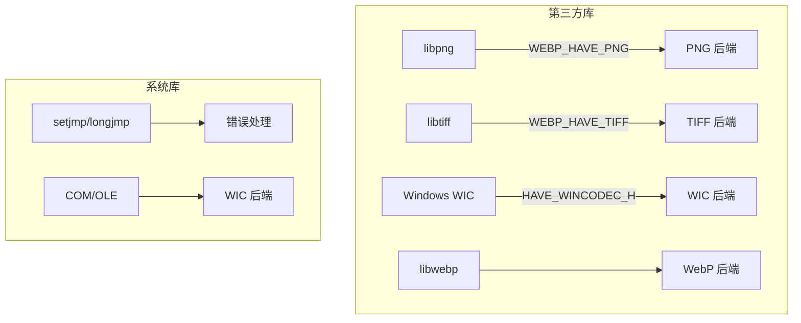
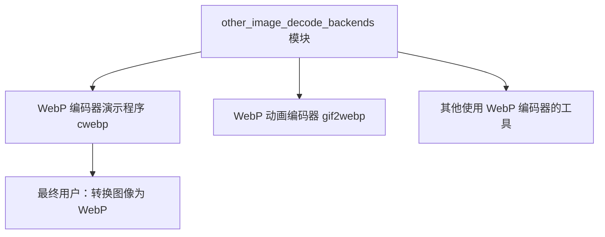

# other_image_decode_backends 模块深度解析

## 一句话概括

`other_image_decode_backends` 是 WebP 编码器演示程序的**"万能转接头"**——它让 WebP 编码器能够理解 JPEG 之外的各种图像格式（PNG、TIFF、Windows 平台下的 WIC 支持的所有格式），充当着**格式转换的桥梁**角色。

---

## 问题空间：为什么需要这个模块？

### 背景：WebP 编码器的输入困境

WebP 编码器的核心职责是将**原始像素数据**压缩成 WebP 格式。但现实世界的图像数据很少以原始像素形式存在——它们被封装在各种文件格式中：

- **PNG**：网络上最常见的无损格式，支持透明通道
- **TIFF**：印刷和专业摄影领域的标准，支持多页、高位深
- **BMP/GIF/ICO**：Windows 生态系统的遗留格式
- **WebP 本身**：重新编码或转码已有 WebP 文件

### 直接集成的痛点

如果让 WebP 编码器直接链接 libpng、libtiff 等库，会导致：

1. **编译复杂性爆炸**：每个库都有自己的依赖链（zlib、libjpeg等）
2. **平台差异**：Windows 已经有 WIC（Windows Imaging Component），再引入 libpng 是重复造轮子
3. **二进制体积**：不需要的功能被硬编码进最终可执行文件
4. **维护负担**：跟踪多个上游库的安全漏洞和 API 变更

### 解决方案：后端插件化架构

`other_image_decode_backends` 采用**条件编译 + 统一接口**的设计：

- 每个格式后端（PNG、TIFF、WIC）是独立的 `.c` 文件
- 通过预处理器宏（`WEBP_HAVE_PNG`、`WEBP_HAVE_TIFF`、`HAVE_WINCODEC_H`）控制是否编译
- 所有后端暴露**统一的 C 函数接口**：输入文件数据，输出 `WebPPicture` 结构
- 调用方（WebP 编码器演示程序）在运行时根据编译选项和平台选择可用的后端

这种架构就像**可更换的刀头**：同一个刀柄（WebP 编码器）可以装上 PNG 刀头、TIFF 刀头或 WIC 刀头，用哪个取决于手头有什么食材（输入文件）和厨房配置（操作系统、已安装的库）。

---

## 核心抽象：mental model（心智模型）

理解这个模块，需要建立三个层次的抽象：

### 1. 数据流管道模型（ETL 管道）

想象一个**多源头的 ETL 管道**（Extract-Transform-Load）：

- **Extract（提取）**：从各种格式（PNG、TIFF、WIC 支持的格式）读取原始数据
- **Transform（转换）**：颜色空间转换、位深调整、Alpha 通道处理
- **Load（加载）**：填充到统一的 `WebPPicture` 结构

这个模型的关键点是**统一抽象**：无论输入是什么格式，输出永远是填充好的 `WebPPicture`。这就像不同国家的人（PNG、TIFF、WIC）都说着不同的母语，但在国际会议（WebP编码）上，他们必须通过同声传译（这个模块）转换成标准工作语言（WebPPicture）。

### 2. 后端插件架构模型（策略模式）

从实现角度看，这是一个**策略模式（Strategy Pattern）**的 C 语言实现：

- **上下文（Context）**：WebP 编码器演示程序
- **策略接口**：统一的 C 函数签名（`ReadPNG`、`ReadTIFF`、`ReadPictureWithWIC`）
- **具体策略**：每个后端（PNG、TIFF、WIC）的实现
- **策略选择**：编译时通过条件宏选择可用的策略

这种架构的核心优势是**正交性**：添加对新格式的支持不需要修改调用者代码，只需要新增一个 `.c` 文件，实现相同的函数签名，并在构建系统中添加对应的条件编译宏。这就像 USB 接口——无论里面是什么设备（键盘、鼠标、U盘），接口形状是一样的，主机只需要知道"这是 USB 设备"就能与之通信。

### 3. 资源管理模型（RAII 的 C 语言模拟）

由于这是 C 代码（而非 C++），资源管理遵循**"谁分配，谁释放"**的原则，配合**清理标签（Cleanup Labels）**模式：

```c
// 典型的资源管理模式（以 TIFF 解码为例）
int ReadTIFF(...) {
    TIFF* tif = NULL;           // 文件句柄
    uint32* raster = NULL;     // 像素缓冲区
    int ok = 0;                // 成功标志
    
    // 分配资源
    tif = TIFFClientOpen(...);
    if (tif == NULL) goto End; // 早期错误跳转
    
    raster = (uint32*)_TIFFmalloc(width * height * sizeof(*raster));
    if (raster == NULL) goto End;
    
    // 使用资源...
    if (TIFFReadRGBAImageOriented(...)) {
        // 转换到 WebPPicture...
        ok = 1; // 标记成功
    }
    
End: // 统一的清理标签
    if (tif != NULL) TIFFClose(tif);
    if (raster != NULL) _TIFFfree(raster);
    return ok;
}
```

这种模式的要点：
- **单一出口**：所有资源释放逻辑集中在函数末尾的 `End` 标签处
- **延迟释放**：资源句柄初始化为 NULL，只有非 NULL 才需要释放
- **错误处理**：使用 `goto` 跳转到清理代码（这是 C 语言中比层层嵌套 `if` 更清晰的错误处理方式）
- **所有权边界**：函数内部分配的结构（如 `raster`）必须由函数释放，除非通过输出参数转移所有权

---

## 关键数据流详解

### 数据流 1：PNG 解码流程（跨平台通用）

```
[PNG 文件数据] 
    ↓
ReadPNG() {pngdec.c}
    ├── PNGReadContext {内存 I/O 上下文}
    │       └── data (const uint8_t*) + offset
    │
    ├── libpng 初始化和错误处理 (setjmp/longjmp)
    │
    ├── 颜色空间转换 (png_set_*)：
    │       ├── 16-bit → 8-bit (png_set_strip_16)
    │       ├── 调色板 → RGB (png_set_palette_to_rgb)
    │       ├── 灰度 → RGB (png_set_gray_to_rgb)
    │       └── 透明 → Alpha (png_set_tRNS_to_alpha)
    │
    ├── 逐行解码 (png_read_rows)
    │
    ├── 元数据提取 (ExtractMetadataFromPNG):
    │       ├── EXIF (Raw profile type exif)
    │       ├── XMP (Raw profile type xmp / XML:com.adobe.xmp)
    │       └── ICC 配置文件 (png_get_iCCP)
    │
    └── WebPPicture 填充:
            ├── WebPPictureImportRGBA() 或 WebPPictureImportRGB()
            └── 维度设置 (width/height)
```

**PNG 路径的关键设计决策**：
- **内存 I/O 抽象**：通过 `PNGReadContext` 和自定义 `ReadFunc`，PNG 后端可以从内存缓冲区读取，而不一定需要文件系统访问。这对嵌入式场景或已经从内存加载图像的应用很重要。
- **渐进式交错处理**：PNG 支持交错（Adam7 算法），代码通过 `png_set_interlace_handling` 和 `num_passes` 循环正确处理多遍解码。
- **错误处理机制**：libpng 使用 setjmp/longjmp 进行错误恢复。代码在初始化时设置错误处理函数 (`error_function`)，并在每个可能失败的 libpng 调用后检查跳转。

### 数据流 2：TIFF 解码流程（专业影像支持）

**TIFF 路径的关键设计决策**：
- **内存 I/O 虚拟化**：TIFF 库传统上设计为文件操作 (`TIFFOpen`)，但 `ReadTIFF` 接收的是内存缓冲区。通过 `TIFFClientOpen` 和 `MyData` 结构，代码实现了一套完整的内存虚拟文件系统（`MyRead`、`MySeek`、`MySize` 等），这让 TIFF 解码可以工作在嵌入式环境或沙箱中。
- **RGBA 统一输出**：TIFF 支持极其复杂的像素布局（Planar、Tiled、多通道等）。代码选择使用 `TIFFReadRGBAImageOriented` 这个高层 API，它将任何复杂的 TIFF 布局统一转换为简单的 ABGR 数组。这是一种**简化策略**——牺牲一些极致的内存控制，换取代码简洁性和跨 TIFF 变体的兼容性。
- **多目录警告**：代码检测到多目录 TIFF 时打印警告（"multi-directory TIFF files are not supported"），这是一种防御性设计——TIFF 的多目录（多页）功能在专业领域常用，但此编码器仅消费第一页，明确告知用户而非静默丢弃数据。

### 数据流 3：WIC 解码流程（Windows 原生高性能）

**WIC 路径的关键设计决策**：
- **Windows 原生性能优先**：WIC 是 Windows 内置组件，直接利用操作系统的图像编解码器（包括硬件加速）。相比跨平台的 libpng/libtiff，WIC 在 Windows 上通常有**更好的性能**和**更一致的系统级集成**（如颜色管理）。
- **格式自适应**：调用者不需要预先知道文件格式——`IWICImagingFactory_CreateDecoderFromStream` 自动检测容器格式（通过文件头魔数）。这让 WIC 后端成为一个**通用图像读取器**，支持 BMP、PNG、TIFF、JPEG、GIF、ICO 等，无需为每种格式单独写代码。
- **复杂的 Alpha 通道检测逻辑**：WIC 后端的 `HasAlpha` 函数展示了图像处理中**透明度的复杂性**。它必须处理：
  - 直接 Alpha 通道（RGBA 格式）
  - 调色板中的透明索引（Palette-based alpha）
  - 帧级 vs 容器级调色板
  - 不同容器格式对 Alpha 的支持差异（通过 `kAlphaContainers` 白名单控制）
  
  这种复杂性反映了现实世界图像格式的混乱——透明度不是简单的"有"或"没有"，而是与颜色模型、存储方式、容器元数据紧密耦合。
- **像素格式转换的管道化**：WIC 通过 `IWICFormatConverter` 提供了一个**声明式的像素转换管道**。代码不需要手动实现 RGB→BGR、16-bit→8-bit、添加/移除 Alpha 等转换，而是声明目标像素格式（如 `GUID_WICPixelFormat32bppRGBA`），让 WIC 内部处理。这大大简化了代码，但代价是**黑盒依赖**——如果 WIC 某版本对某种格式的转换有 bug，代码难以干预。

---

## 设计决策与权衡

### 1. 条件编译 vs 运行时插件

**决策**：使用预处理器宏（`#ifdef WEBP_HAVE_PNG`）在编译时选择后端，而非运行时动态加载。

**权衡**：
- ✅ **简洁性**：不需要复杂的插件注册/发现机制
- ✅ **零运行时开销**：没有条件分支或虚函数表查询
- ✅ **可预测的二进制体积**：构建时已知确切的功能集合
- ❌ **部署不灵活**：用户不能在不重新编译的情况下添加对新格式的支持
- ❌ **测试矩阵爆炸**：需要测试所有后端组合的编译配置

**适合此场景的原因**：WebP 工具链是一个编译分发的开发者工具，不是最终用户应用。开发者通常从包管理器或源码编译获得二进制文件，对运行时装载新格式的需求极低。

### 2. C 语言 vs C++

**决策**：使用 C99 而非 C++。

**权衡**：
- ✅ **最大可移植性**：C 编译器比 C++ 编译器在嵌入式和复古平台上更普及
- ✅ **二进制接口稳定**：C 的 ABI 更简单，跨编译器版本兼容性更好
- ✅ **与 libpng/libtiff 的母语一致**：这些库提供 C 接口，避免 C++ wrapper 开销
- ❌ **资源管理冗长**：没有 RAII、智能指针，需要手动 `goto` 清理
- ❌ **缺少泛型和模板**：无法编写类型安全的通用容器，代码重复度高

**适合此场景的原因**：WebP 项目作为 Google 的基础库，目标是最大范围的系统兼容性。C++ 的异常处理、RTTI 和模板会在某些受限环境（如内核、微控制器、某些游戏主机）中带来问题。

### 3. 统一 RGBA 中间格式 vs 保留原始颜色空间

**决策**：无论输入是什么颜色空间，都转换为 RGB/RGBA 8-bit。

**权衡**：
- ✅ **下游处理简单**：WebP 编码器只需要处理 RGB/YUV，不需要理解 CMYK、Lab 等颜色空间
- ✅ **跨后端一致性**：PNG 的 RGB、TIFF 的 CMYK、WIC 的各种格式，最终输出一致
- ❌ **信息丢失**：TIFF 的 16-bit 通道被截断到 8-bit；CMYK 到 RGB 的转换可能不精确
- ❌ **性能损失**：如果原始数据已经是 YUV（如某些 TIFF），强制转为 RGB 再转回 YUV（WebP 内部）是浪费

**适合此场景的原因**：这是一个**演示/工具程序**（`cwebp`），不是专业图像处理流水线。用户用它转换网络图片，而非印刷级专业图像。8-bit RGB 足以满足 WebP 的设计目标（网络传输），复杂的颜色空间管理会增加代码量，而对目标用户群无实际价值。

### 4. 主动错误处理 vs 契约式编程

**决策**：大量使用运行时错误检查（NULL 指针、返回值验证、缓冲区大小检查）。

**权衡**：
- ✅ **防御性编程**：库函数（libpng/libtiff）可能返回 NULL 或错误码，必须检查
- ✅ **用户友好**：遇到损坏的图像文件时，打印明确的错误信息而非崩溃
- ❌ **代码冗长**：几乎每行调用后都有 `if (failed) goto cleanup;`
- ❌ **性能开销**：在热路径上，频繁的分支预测失败可能影响速度

**适合此场景的原因**：图像解码是**不可信输入处理**。PNG/TIFF 文件来自网络，可能是损坏的、恶意构造的（图像炸弹攻击），或者是新版本的格式扩展。断言（assert）和契约在这里不适用——必须通过运行时检查防御所有异常输入。

---

## 子模块概述

本模块包含四个子模块，分别对应四种图像解码后端：

### 1. [png_decode_backend_types](codec_acceleration_and_demos-webp_encoder_host_pipeline-other_image_decode_backends-png_decode_backend_types.md)

**职责**：PNG 图像解码后端，基于 libpng 库实现。

**核心组件**：
- `PNGReadContext`：内存 I/O 上下文，支持从内存缓冲区读取 PNG 数据
- `Metadata`：PNG 元数据结构，存储 EXIF、XMP、ICC 配置文件等

**关键能力**：
- 支持 PNG 所有颜色类型（灰度、RGB、调色板、带 Alpha）
- 16-bit 到 8-bit 自动转换
- 交错（Adam7）PNG 的正确解码
- 完整的元数据提取（EXIF、XMP、ICC）

---

### 2. [tiff_decode_backend_types](codec_acceleration_and_demos-webp_encoder_host_pipeline-other_image_decode_backends-tiff_decode_backend_types.md)

**职责**：TIFF 图像解码后端，基于 libtiff 库实现。

**核心组件**：
- `MyData`：TIFF I/O 抽象结构，实现内存虚拟文件系统
- `Metadata`：TIFF 元数据结构，存储 ICC 配置文件、XMP 等

**关键能力**：
- 通过 `TIFFClientOpen` 实现内存 I/O（无需临时文件）
- 复杂 TIFF 布局的统一 RGBA 输出（使用 `TIFFReadRGBAImageOriented`）
- ICC 配置文件和 XMP 元数据提取
- 大端/小端字节序自动处理
- 多目录 TIFF 警告（仅处理第一页）

---

### 3. [wic_decode_backend_types](codec_acceleration_and_demos-webp_encoder_host_pipeline-other_image_decode_backends-wic_decode_backend_types.md)

**职责**：Windows 图像组件（WIC）解码后端，基于 Windows Imaging Component API 实现。仅 Windows 平台可用。

**核心组件**：
- `WICFormatImporter`：像素格式导入器，定义像素格式到 WebP 导入函数的映射
- `Metadata`：WIC 元数据结构，主要存储 ICC 配置文件

**关键能力**：
- 自动格式检测（支持 BMP、PNG、TIFF、JPEG、GIF、ICO 等）
- 硬件加速解码（利用 GPU/Direct2D）
- 复杂的 Alpha 通道检测（调色板 Alpha、直接 Alpha、容器类型白名单）
- 声明式像素格式转换（通过 `IWICFormatConverter`）
- ICC 配置文件提取（通过 `IWICColorContext`）
- 内存流和文件流统一接口（`CreateStreamOnHGlobal` / `SHCreateStreamOnFileA`）

---

### 4. [webp_decode_picture_types](codec_acceleration_and_demos-webp_encoder_host_pipeline-other_image_decode_backends-webp_decode_picture_types.md)

**职责**：WebP 图像解码后端，基于 libwebp 库实现。用于读取已有 WebP 文件并重新编码（转码或处理）。

**核心组件**：
- `WebPPicture`：WebP 图像结构，包含像素数据、维度、颜色空间等
- `Metadata`：WebP 元数据结构

**关键能力**：
- 解码 WebP 文件到原始像素
- 支持有损和无损 WebP 格式
- Alpha 通道处理
- 动画 WebP 支持（第一帧提取，用于重新编码）

---

## 依赖关系与交互

### 上游依赖（本模块依赖谁）



### 下游依赖（谁依赖本模块）



### 模块间交互契约

| 调用方 | 被调用函数 | 输入契约 | 输出契约 | 错误处理 |
|--------|-----------|---------|---------|---------|
| cwebp | `ReadPNG` | data: 非 NULL, data_size > 0, pic: 已分配 | pic: 填充像素和元数据 | 返回 0, 打印到 stderr |
| cwebp | `ReadTIFF` | 同上 | 同上 | 同上 |
| cwebp | `ReadPictureWithWIC` | filename: 有效路径, pic: 已分配 | 同上 | 同上 |

**关键隐含契约**：
1. **内存所有权**：调用方负责分配 `WebPPicture` 结构，但不需要预先分配像素缓冲区（`import` 函数会处理）
2. **元数据生命周期**：`Metadata` 结构中的 `bytes` 指针由模块内部分配，调用方负责在不再需要时调用 `MetadataFree`
3. **线程安全**：这些函数**不是**线程安全的，因为它们依赖非线程安全的底层库（libpng、libtiff 在默认配置下非线程安全）

---

## 关键设计决策与权衡

### 决策 1：条件编译 vs 运行时插件

**选择**：使用预处理器宏在编译时选择后端。

**权衡**：
- ✅ 零运行时开销，无需插件发现机制
- ✅ 构建时即知确切功能集，可执行文件自包含
- ❌ 无法在不重新编译的情况下添加新格式

**适用原因**：WebP 工具是开发者使用的命令行工具，非最终用户应用。重新编译是可接受的，而且这保证了可执行文件的可移植性。

### 决策 2：统一 RGBA 中间格式

**选择**：无论输入格式如何，都转换为 8-bit RGB/RGBA。

**权衡**：
- ✅ WebP 编码器只需处理 RGB/YUV，大大简化逻辑
- ✅ 跨后端输出一致，调用方无需关心输入格式
- ❌ 信息丢失：16-bit 通道被截断，CMYK 转换可能不精确
- ❌ 性能损失：若输入已是 YUV，转为 RGB 再转回 YUV 是浪费

**适用原因**：这是**演示/工具程序**，不是专业图像处理流水线。目标用户是转换网络图片，8-bit RGB 足以满足 WebP 的网络传输场景。

### 决策 3：主动错误处理（防御性编程）

**选择**：大量使用运行时检查（NULL、返回值、缓冲区大小）。

**权衡**：
- ✅ 库函数可能返回错误，必须检查
- ✅ 损坏的图像文件会触发清晰错误而非崩溃
- ❌ 代码冗长，几乎每个调用后都有 `if (failed) goto`
- ❌ 性能开销：频繁分支预测失败可能影响速度

**适用原因**：图像解码是**不可信输入处理**。输入来自网络，可能是损坏的、恶意构造的（图像炸弹攻击）。必须通过运行时检查防御所有异常输入。

---

## 新贡献者指南：陷阱与最佳实践

### 常见陷阱

#### 陷阱 1：忽略 setjmp/longjmp 的栈展开问题（PNG 后端）

```c
// 错误：在 setjmp 和 longjmp 之间分配了需要析构的资源
volatile png_structp png = NULL;
MyCustomObject obj = CreateObject();  // 危险！如果 longjmp 发生，obj 泄漏

if (setjmp(png_jmpbuf(png))) {
    // obj 永远不会被清理！
    goto Error;
}
```

**解决方案**：在 `setjmp` 调用之前完成所有资源分配，或者确保 `longjmp` 跳转到的清理代码能处理所有可能的资源状态。

#### 陷阱 2：TIFF 内存 I/O 的字节序问题

```c
// 容易被忽视的代码：
#ifdef WORDS_BIGENDIAN
    TIFFSwabArrayOfLong(raster, width * height);
#endif
```

**陷阱**：`TIFFReadRGBAImageOriented` 返回的 ABGR 数据始终是小端格式，但在大端机器上，WebP 期望的是本地字节序。如果不做这个转换，红蓝通道会互换，图像颜色会错乱。

**检测方法**：在大端架构（如某些 MIPS、PowerPC、SPARC）上测试 TIFF 解码，检查输出图像颜色是否正确。

#### 陷阱 3：WIC 的 COM 初始化线程问题

```c
// 在 ReadPictureWithWIC 中：
IFS(CoInitialize(NULL));
```

**陷阱**：`CoInitialize` 必须在每个使用 COM 的线程中调用一次。如果 `ReadPictureWithWIC` 被多线程调用：
- 第一次调用成功初始化 COM
- 第二次在同一线程调用，`CoInitialize` 返回 `S_FALSE`（已初始化），这是正常的
- 但在新线程调用，如果没有 `CoInitialize`，所有 COM 调用会失败

**最佳实践**：确保调用 `ReadPictureWithWIC` 的线程已初始化 COM，或将该函数限制为单线程使用。当前实现假设单线程调用。

#### 陷阱 4：元数据内存所有权混淆

```c
// 在 ExtractMetadataFromPNG 中：
payload->bytes = HexStringToBytes(end, expected_length);
```

**陷阱**：`payload->bytes` 是在模块内部分配的，但期望调用方最终调用 `MetadataFree` 来释放。如果调用方不了解这个契约，会导致内存泄漏。

**最佳实践**：在头文件中明确文档化：
```c
// metadata.h (假设存在)
// 注意：如果 metadata 被填充，调用方必须使用 MetadataFree 释放 
// metadata.iccp.bytes、metadata.xmp.bytes 等内部指针
```

### 调试技巧

#### 技巧 1：启用 libpng/libtiff 的详细日志

```c
// 在 pngdec.c 的 ReadPNG 中，添加：
png_set_error_fn(png_ptr, NULL, my_png_warning_fn, my_png_error_fn);

// 实现自定义处理函数以打印详细日志
static void my_png_warning_fn(png_structp png_ptr, png_const_charp msg) {
    fprintf(stderr, "[libpng warning] %s\n", msg);
}
```

#### 技巧 2：使用十六进制转储检查元数据

```c
// 在调试 ExtractMetadataFromPNG 时：
printf("Extracted ICC profile: %zu bytes\n", metadata->iccp.size);
for (size_t i = 0; i < min(32, metadata->iccp.size); i++) {
    printf("%02x ", metadata->iccp.bytes[i]);
}
printf("\n");
```

#### 技巧 3：WIC 调试时使用 GUID 转字符串

```c
// 在 wicdec.c 中，帮助理解像素格式 GUID：
static void PrintGUID(const GUID* guid) {
    fprintf(stderr, "GUID: {%08lx-%04x-%04x-%02x%02x-%02x%02x%02x%02x%02x%02x}\n",
            guid->Data1, guid->Data2, guid->Data3,
            guid->Data4[0], guid->Data4[1], guid->Data4[2], guid->Data4[3],
            guid->Data4[4], guid->Data4[5], guid->Data4[6], guid->Data4[7]);
}

// 在 GetPixelFormat 后调用：
PrintGUID(&src_pixel_format);
```

---

## 总结

`other_image_decode_backends` 模块是 WebP 生态系统中的**格式转换中枢**。它通过以下设计哲学解决了多格式输入的问题：

1. **统一抽象**：无论输入是 PNG、TIFF 还是 WIC 支持的任何格式，输出始终是填充好的 `WebPPicture`
2. **条件编译**：通过预处理器宏实现后端的选择性编译，保持运行时零开销
3. **平台感知**：在 Windows 上优先使用 WIC 获得原生性能，在跨平台环境使用 libpng/libtiff
4. **防御性编程**：大量运行时检查确保即使面对损坏或恶意的图像文件也不会崩溃

对于新加入项目的开发者，理解这个模块的关键是抓住**"转换器"**这个核心隐喻：它不生产像素，它只是像素的**搬运工和翻译官**——把各种格式的"方言"翻译成 WebP 编码器能听懂的"普通话"（RGBA 像素数组）。

---

*文档版本：1.0*
*最后更新：2024*

