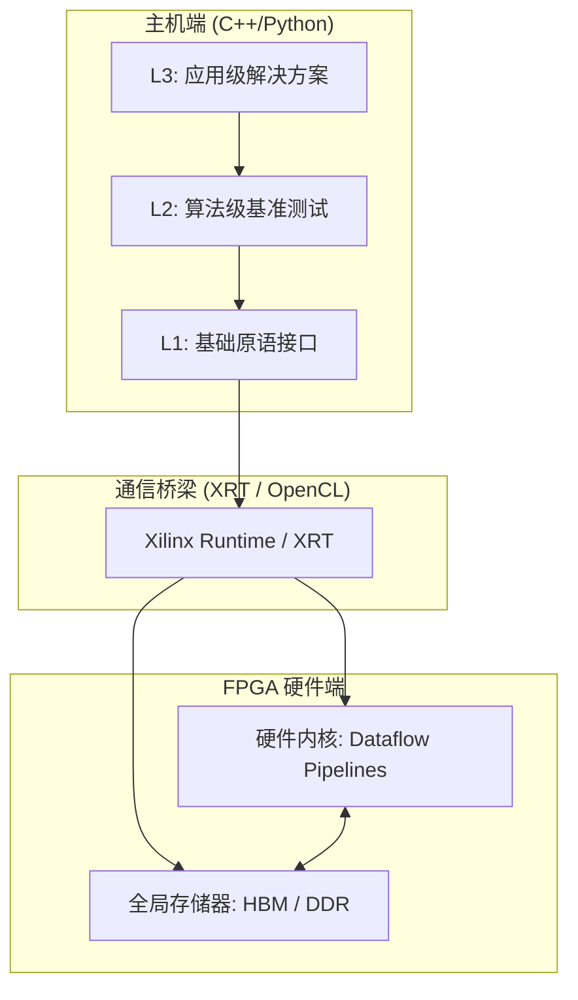

## 1. 项目愿景：打破算力瓶颈的"硬件加速百宝箱"

在传统软件开发中，当你遇到海量数据处理（如 4K 视频编解码、TB 级数据库查询或复杂的金融衍生品定价）时，CPU 的串行架构往往会成为性能瓶颈。

`Vitis_Libraries` 的核心使命是**将复杂的 FPGA 硬件算力封装成软件开发者熟悉的工具**。我们通过高度优化的硬件电路（Kernels）和易用的软件接口（APIs），让你可以像调用普通 C++ 或 Python 库一样，在 FPGA 上实现数倍甚至数百倍的性能飞跃。无论你是从事视觉处理、数据分析、金融建模还是网络安全，这里都有为你准备好的"加速引擎"。

---

## 📚 文档导航指南

无论你是初次接触 FPGA 加速，还是希望深入了解项目的构建体系，以下指南都能帮助你快速上手并找到正确的方向：

*   **[快速入门 (Get Started)](guide-getting-started.md)**
    如果你想最快速地完成环境安装并运行第一个示例，从这里开始。本指南提供了简洁的安装步骤和首次运行教程，让你在最短时间内看到加速效果。

*   **[新手入门指南 (Beginner's Guide)](guide-beginners-guide.md)**
    如果你对 FPGA 加速或 Vitis 生态还比较陌生，这份多章节的系统性入门教程将循序渐进地带你理解核心概念、开发流程和最佳实践。

*   **[构建系统与代码组织 (Build & Code Organization)](guide-build-and-organization.md)**
    深入了解项目的构建流水线和目录结构。本指南适合希望定制化编译流程、集成到自有工程或贡献代码的开发者。

---

## 2. 架构全景：从底层原语到应用方案

项目的架构遵循分层设计原则，确保了从底层硬件效率到上层软件易用性的完美平衡。

### 架构层级解析
*   **L1 (Primitives):** 最小的计算单元（如 SVD 分解、AES 轮运算）。它们是构建复杂算法的基石，通常以 HLS 库的形式存在。
*   **L2 (Kernels/Benchmarks):** 完整的硬件内核实现（如 Gzip 压缩内核、PageRank 内核）。这一层提供了性能评估的基准。
*   **L3 (Software APIs/Solutions):** 面向应用层的封装。它处理了复杂的内存对齐、多线程调度和设备管理，让你只需关注业务逻辑。

---

## 3. 核心设计决策

在构建这套庞大的库时，我们做出了几个关键的架构选择：

1.  **数据流驱动 (Dataflow-Driven) 而非控制流驱动：** 硬件内核内部广泛采用 `#pragma HLS DATAFLOW`，使数据像流水线一样在计算单元间流动，最大化并行度。
2.  **显式内存管理 (Explicit Memory Affinity)：** 针对 Alveo 等高性能加速卡，我们允许开发者通过 `.cfg` 文件显式将数据绑定到特定的 HBM 或 DDR Bank，以消除总线竞争。
3.  **黄金标准验证 (Golden Reference Testing)：** 所有的加速模块都配有基于 CPU（如 NumPy 或 OpenSSL）的参考实现，确保硬件计算结果在数值上达到"金融级"或"工业级"的精确。
4.  **动态重构与通用内核 (GQE)：** 在数据库等领域，我们设计了通用查询引擎（GQE），允许在不重新烧录硬件的情况下，通过软件配置改变硬件的查询逻辑。

---

## 4. 模块指南

我们的库涵盖了多个专业领域，你可以根据需求快速定位：

### 基础支撑与视觉
*   [**data_mover_runtime**](data_mover_runtime.md) 是整个系统的"翻译官"，负责将人类可读的文本数据高效转换为硬件能直接消费的十六进制比特流。
*   [**vision_core_types_and_benchmarks**](vision_core_types_and_benchmarks.md) 为视觉处理提供了统一的"骨架"，定义了跨平台共享的颜色空间（RGB/YUV）和 AIE 数据搬运协议。

### 数据压缩与编解码
*   [**data_compression_gzip_system**](data_compression_gzip_system.md) 将 Gzip/Zlib 压缩卸载到 FPGA，通过对象池模式管理内存，轻松应对数据中心级的压缩需求。
*   [**codec_acceleration_and_demos**](codec_acceleration_and_demos.md) 针对 JPEG、WebP 和 JXL 等格式提供了流式生产线，大幅降低了图像处理的延迟。

### 数据库与大数据分析
*   [**database_query_and_gqe**](database_query_and_gqe.md) 提供了强大的通用查询引擎，支持在 FPGA 上直接执行 SQL 级的 Join 和 Aggregation 操作。
*   [**data_analytics_text_geo_and_ml**](data_analytics_text_geo_and_ml.md) 专注于文本正则匹配、地理空间查询和量化机器学习模型（如决策树）的加速。
*   [**graph_analytics_and_partitioning**](graph_analytics_and_partitioning.md) 解决了超大规模图数据的存储与计算难题，支持 Louvain 社区发现和 PageRank 等算法。

### 数学计算与金融
*   [**blas_python_api**](blas_python_api.md) 为线性代数运算提供了 Python 验证层，是硬件验证流程中的"导演"。
*   [**quantitative_finance_engines**](quantitative_finance_engines.md) 包含了蒙特卡洛模拟和树形定价模型，为实时风险控制提供毫秒级的响应。
*   [**hpc_iterative_solver_pipeline**](hpc_iterative_solver_pipeline.md) 专注于求解大型稀疏线性方程组，是科学计算的核心引擎。
*   [**dsp_meta_configuration**](dsp_meta_configuration.md) 作为一个交互式向导，帮助你从数以千计的参数中配置出最适合你硬件的 DSP 计算图。
*   [**solver_benchmarks**](solver_benchmarks.md) 提供了标准化的"性能赛道"，用于精确评估各类线性代数求解器的真实吞吐量。

### 安全与加密
*   [**security_crypto_and_checksum**](security_crypto_and_checksum.md) 提供了 AES、HMAC 和 CRC 等硬件原语，为网络数据面提供线速的加解密保护。

---

## 5. 典型端到端工作流

### 场景 A：加速数据库关联查询 (Join)
1.  **准备：** 软件层将原始数据封装进 `Table` 对象，并根据 SQL 条件生成 `JoinConfig`。
2.  **搬运：** [**database_query_and_gqe**](database_query_and_gqe.md) 的 L3 调度器将数据分片，通过 PCIe 搬运至 FPGA 的 HBM。
3.  **计算：** 硬件内核 `gqeJoin` 读取配置位，在片上构建 Hash Table 并进行并行 Probe。
4.  **回收：** 匹配结果通过异步线程池回传至主机，完成最终的结果合并。

### 场景 B：金融期权实时定价 (Monte Carlo)
1.  **配置：** 使用 [**dsp_meta_configuration**](dsp_meta_configuration.md) 确定计算精度和并行 CU 数量。
2.  **执行：** [**quantitative_finance_engines**](quantitative_finance_engines.md) 启动多个计算单元，每个 CU 独立生成随机数路径。
3.  **流水线：** 硬件内部采用 Dataflow 架构，路径生成、收益计算和均值累加在流水线中同时进行。
4.  **验证：** 主机读取最终定价，并与 [**blas_python_api**](blas_python_api.md) 提供的黄金标准进行比对。

---

我们期待看到你利用这些工具构建出令人惊叹的高性能应用。如果你是第一次接触，建议从 [**data_mover_runtime**](data_mover_runtime.md) 开始了解数据是如何进入硬件世界的。

祝你的代码运行如飞！