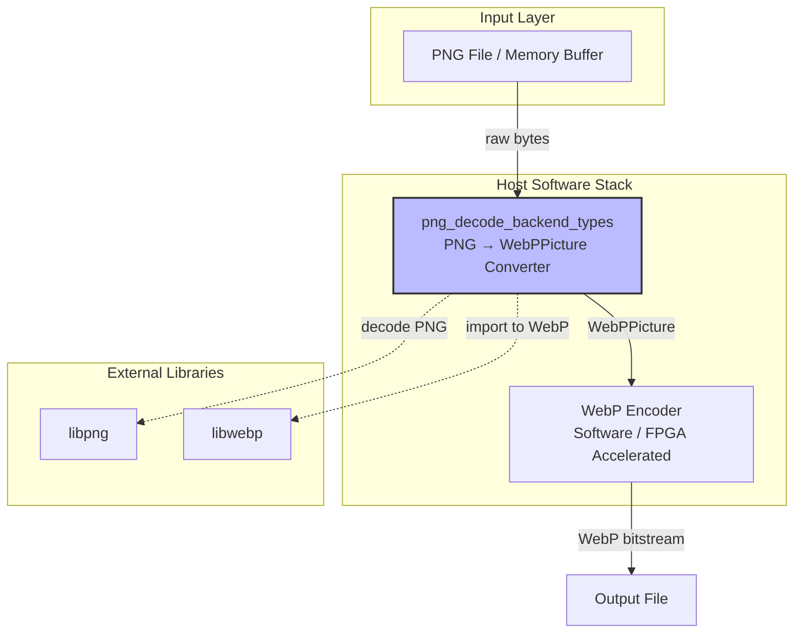

# PNG Decode Backend Types 技术深潜

> 目标读者：刚加入团队的资深工程师 —— 你能读代码，但需要理解设计意图、架构角色和"为什么"背后的非显而易见的选择。

---

## 一句话概括

这个模块是 **FPGA 加速 WebP 编码流水线中的 PNG 解码适配器** —— 它将内存中的 PNG 字节流转换为 WebP 编码器能理解的 `WebPPicture` 结构，同时保留关键的图像元数据。

---

## 问题空间：为什么要造这个轮子？

### 场景设定

想象你正在构建一个 FPGA 加速的图像处理服务：
- 用户上传各种格式的图像（PNG、JPEG、TIFF、GIF）
- 系统需要将它们统一转换为 WebP 格式以利用 FPGA 编码加速
- 专业摄影师要求保留 ICC 色彩配置文件、EXIF 拍摄参数等元数据
- 高性能要求：避免不必要的磁盘 I/O，纯内存处理

### 直接使用 libpng 的问题

libpng 是业界标准的 PNG 解码库，但它是一个**底层 C 库**：

```c
// 使用原生 libpng 解码 PNG（简化版）
png_structp png = png_create_read_struct(...);
png_infop info = png_create_info_struct(png);
// ... 错误处理设置 ...
FILE* fp = fopen("image.png", "rb");
png_init_io(png, fp);
png_read_info(png, info);
// ... 获取图像参数 ...
// ... 配置转换 ...
// ... 分配缓冲区 ...
png_read_image(png, row_pointers);
// ... 清理 ...
```

**痛点**：
1. **复杂度**：需要处理 `png_structp`、`png_infop`、错误回调、内存管理
2. **格式转换**：libpng 输出的是行数据，需要手动转换为 WebP 的 `WebPPicture` 结构
3. **元数据提取**：需要手动解析 tEXt/zTXt/iTXt 块来提取 EXIF/XMP
4. **错误处理**：libpng 使用 setjmp/longjmp，需要谨慎的资源管理

### 设计决策

创建一个**高层的适配器层**，封装所有这些复杂性：

```c
// 理想的使用方式
uint8_t* png_data = load_from_memory(...);
WebPPicture pic;
Metadata meta;
if (ReadPNG(png_data, png_size, &pic, 1, &meta)) {
    // pic 现在包含解码后的图像，可以传递给 WebP 编码器
    // meta 包含 EXIF/XMP/ICC
}
```

这就是 `png_decode_backend_types` 模块存在的理由。

---

## 架构角色：它在系统中的位置



**架构定位**：
- **非核心编码器**：它本身不执行 WebP 编码，而是为编码器准备输入数据
- **适配器/桥接模式**：连接 libpng 的 PNG 解码能力与 libwebp 的编码能力
- **元数据管道**：确保从输入到输出的元数据（色彩配置、拍摄信息）不丢失

---

## 核心组件解析

### 1. PNGReadContext - 内存 I/O 抽象

```c
typedef struct {
    const uint8_t* data;    // PNG 数据的内存指针（只读）
    size_t data_size;       // 数据总大小
    png_size_t offset;      // 当前读取偏移
} PNGReadContext;
```

**为什么需要这个？**

libpng 默认设计为从 `FILE*` 流读取。但在我们的场景中，PNG 数据已经存在于内存中（从网络接收或已加载到内存）。`PNGReadContext` + `ReadFunc` 回调实现了**内存模拟文件流**：

```c
static void ReadFunc(png_structp png_ptr, png_bytep data, png_size_t length) {
    PNGReadContext* ctx = (PNGReadContext*)png_get_io_ptr(png_ptr);
    // 从内存缓冲区复制数据到 libpng 的缓冲区
    memcpy(data, ctx->data + ctx->offset, length);
    ctx->offset += length;
}
```

**关键设计点**：
- **零拷贝**：数据只被 `memcpy` 一次，从输入缓冲区到 libpng 的内部缓冲区
- **所有权清晰**：`PNGReadContext` 不拥有 `data`，只是借用调用者的缓冲区
- **线程安全**：只要输入缓冲区在解码期间不被修改，多个线程可以并发使用不同的 `PNGReadContext`

### 2. ReadPNG - 主入口函数

```c
int ReadPNG(const uint8_t* const data,
            size_t data_size,
            struct WebPPicture* const pic,
            int keep_alpha,
            struct Metadata* const metadata);
```

**函数契约**：
- **输入**：`data` 必须指向有效的 PNG 数据，`data_size` > 0
- **输出**：成功时 `pic` 包含解码后的图像，`metadata`（如果非 NULL）包含提取的元数据
- **错误处理**：返回 0 表示失败，会打印错误信息到 stderr

**内部状态机**：

```
[Start]
  ↓
[Init libpng] ──→ 失败 ──→ [Cleanup] ──→ 返回 0
  ↓ 成功
[Setjmp setup] ──→ longjmp ──→ [Cleanup] ──→ 返回 0
  ↓
[Read header] ──→ 失败 ──→ 长跳转到 Error 标签
  ↓
[Configure transforms] (根据颜色类型和 keep_alpha)
  ↓
[Allocate RGB buffer]
  ↓
[Decode image] ──→ 失败 ──→ 长跳转到 Error 标签
  ↓
[Extract metadata] ──→ 失败 ──→ 长跳转到 Error 标签
  ↓
[Import to WebPPicture] ──→ 失败 ──→ 长跳转到 Error 标签
  ↓
[Cleanup] ──→ 返回 1
```

**关键代码路径详解**：

**阶段 1：libpng 初始化与错误处理**

```c
// 使用 volatile 防止编译器优化掉 longjmp 后的访问
volatile png_structp png = NULL;
volatile png_infop info = NULL;
volatile uint8_t* rgb = NULL;

png = png_create_read_struct(PNG_LIBPNG_VER_STRING, 0, 0, 0);
if (png == NULL) goto End;

// 关键：设置自定义错误处理函数
png_set_error_fn(png, 0, error_function, NULL);

// 关键：设置错误恢复点
if (setjmp(png_jmpbuf(png))) {
Error:
    MetadataFree(metadata);  // 清理可能部分填充的元数据
    goto End;  // 跳转到统一清理代码
}

info = png_create_info_struct(png);
if (info == NULL) goto Error;  // 注意：使用 Error 标签触发 longjmp 风格处理
```

**设计决策说明**：
- **为什么使用 `volatile`**：在 `setjmp/longjmp` 的上下文中，编译器可能会优化掉某些变量的重新加载。`volatile` 确保每次访问都从内存读取。
- **Error 标签的位置**：位于 `setjmp` 之后，确保 `longjmp` 跳转回来时，所有在 `setjmp` 之后分配的资源都可以被清理。

**阶段 2：PNG 颜色类型转换策略**

```c
// 始终将 16 位通道缩减为 8 位（WebP 使用 8 位）
png_set_strip_16(png);

// 打包小于 8 位的位深度
png_set_packing(png);

// 处理不同的颜色类型
if (color_type == PNG_COLOR_TYPE_PALETTE) {
    // 调色板 → RGB/RGBA
    png_set_palette_to_rgb(png);
}
if (color_type == PNG_COLOR_TYPE_GRAY || 
    color_type == PNG_COLOR_TYPE_GRAY_ALPHA) {
    if (bit_depth < 8) {
        // 扩展低位深灰度到 8 位
        png_set_expand_gray_1_2_4_to_8(png);
    }
    // 灰度 → RGB
    png_set_gray_to_rgb(png);
}

// 处理透明通道
if (png_get_valid(png, info, PNG_INFO_tRNS)) {
    // tRNS 块 → Alpha 通道
    png_set_tRNS_to_alpha(png);
    has_alpha = 1;
} else {
    has_alpha = !!(color_type & PNG_COLOR_MASK_ALPHA);
}

// 根据调用者意愿决定是否丢弃 Alpha
if (!keep_alpha) {
    png_set_strip_alpha(png);
    has_alpha = 0;
}
```

**关键决策分析**：
- **为什么统一转换为 RGB/RGBA**：WebP 编码器的内部表示就是 RGB/RGBA，提前转换可以：
  1. 简化 WebP 编码器的输入处理逻辑
  2. 避免在编码器内部重复的颜色空间转换代码
  3. 统一的输出格式便于调试和测试
- **16→8 位转换的取舍**：PNG 支持 16 位通道，但 WebP 只使用 8 位。这里选择简单的截断（strip）而非抖动（dither），因为：
  - WebP 主要用于有损编码，16 位精度的损失在感知上不重要
  - 保持代码简单，避免引入额外的处理阶段

**阶段 3：元数据提取与处理**

```c
// 元数据提取的配置表：键名 → 处理函数 → 存储位置
static const struct {
    const char* name;
    int (*process)(const char* profile, size_t profile_len, 
                   MetadataPayload* const payload);
    size_t storage_offset;
} kPNGMetadataMap[] = {
    {"Raw profile type exif", ProcessRawProfile, METADATA_OFFSET(exif)},
    {"Raw profile type xmp", ProcessRawProfile, METADATA_OFFSET(xmp)},
    {"Raw profile type APP1", ProcessRawProfile, METADATA_OFFSET(exif)},
    {"XML:com.adobe.xmp", MetadataCopy, METADATA_OFFSET(xmp)},
    {NULL, NULL, 0},
};
```

**设计模式分析**：
- **表驱动设计**：使用配置表而非嵌套的 `if-else` 或 `switch`，便于：
  - 添加新的元数据类型（只需添加表项）
  - 理解支持的格式（一目了然）
  - 单元测试（可以单独测试每个处理函数）
- **存储位置计算**：使用 `METADATA_OFFSET` 宏计算结构体成员偏移，避免硬编码的指针运算

### 关键资源管理与错误处理

**资源分配时序与错误恢复**：

```c
int ReadPNG(...) {
    // === 阶段 1：声明资源（初始化为 NULL）===
    volatile png_structp png = NULL;
    volatile png_infop info = NULL;
    volatile png_infop end_info = NULL;
    volatile uint8_t* rgb = NULL;
    int ok = 0;
    
    // === 阶段 2：创建 libpng 结构（可在 setjmp 之前失败）===
    png = png_create_read_struct(...);
    if (png == NULL) goto End;  // 简单错误，无资源需要清理
    
    // === 阶段 3：建立错误恢复点（关键！）===
    if (setjmp(png_jmpbuf(png))) {
    Error:
        // 从 libpng 错误恢复 - 清理可能部分初始化的状态
        MetadataFree(metadata);
        goto End;
    }
    
    // === 阶段 4：在 setjmp 之后分配所有资源 ===
    // 如果任何分配失败，通过 longjmp 跳转到 Error 标签
    info = png_create_info_struct(png);
    if (info == NULL) goto Error;  // 触发 longjmp
    
    end_info = png_create_info_struct(png);
    if (end_info == NULL) goto Error;
    
    // ... 配置 libpng，读取数据 ...
    
    // 分配像素缓冲区
    rgb = (uint8_t*)malloc(stride * height);
    if (rgb == NULL) goto Error;
    
    // ... 解码图像，提取元数据，导入 WebP ...
    
    ok = 1;  // 成功！
    
End:
    // === 阶段 5：统一清理（无论成功或失败）===
    if (png != NULL) {
        png_destroy_read_struct((png_structpp)&png, 
                                (png_infopp)&info, 
                                (png_infopp)&end_info);
    }
    if (!ok) {
        // 失败时释放像素缓冲区
        free((void*)rgb);
    }
    // 注意：成功时，rgb 被 WebPPicture 接管，不在这里释放
    return ok;
}
```

**关键设计决策**：
1. **`volatile` 修饰符**：在 `setjmp/longjmp` 的上下文中，编译器可能优化掉某些变量的重新加载。`volatile` 确保每次访问都从内存读取最新值。
2. **资源分配的时序**：所有在 `setjmp` 之后分配的资源都可以通过 `goto Error` 或 `longjmp` 安全地清理。
3. **像素缓冲区的特殊处理**：成功时，像素缓冲区被 `WebPPictureImportRGB/RGBA` 接管，成为 `WebPPicture` 的一部分，因此不在 `End` 标签处释放；失败时则需要释放以避免泄漏。

---

## 新贡献者必读：陷阱与最佳实践

### ⚠️ 常见陷阱

#### 1. setjmp/longjmp 与 C++ 析构函数

**问题**：如果在 C++ 环境中使用这段代码，`longjmp` 会跳过栈上的 C++ 对象析构，导致资源泄漏。

**解决方案**：
- 在 C++ 中，将 libpng 操作包装在 RAII 类中
- 或者确保在 `setjmp` 之前完成所有 C++ 对象的构造，在 `longjmp` 之后手动清理

#### 2. Metadata 内存管理混淆

**问题**：`Metadata` 结构内部的指针由谁释放？

```c
Metadata meta;  // 在栈上分配，但内部指针在堆上
ReadPNG(data, size, &pic, 1, &meta);
// ... 使用 meta ...
// 忘记调用 MetadataFree(&meta) → 内存泄漏！
```

**最佳实践**：
- 始终将 `Metadata` 的分配与 `MetadataFree` 配对
- 考虑使用 RAII 包装器（C++）或在错误路径中确保调用 `MetadataFree`

#### 3. PNG 交错图像的内存布局

**问题**：PNG 支持 Adam7 交错，逐行读取时可能需要多次遍历图像数据。

```c
// 错误假设：height 次循环就读取完整图像
for (y = 0; y < height; y++) {
    png_read_row(...);  // 对于交错图像，这只会读取部分数据！
}
```

**正确做法**：
```c
// num_passes 对于非交错图像是 1，对于交错图像是 7 (Adam7)
int num_passes = png_set_interlace_handling(png);
for (p = 0; p < num_passes; ++p) {
    for (y = 0; y < height; y++) {
        png_read_row(...);
    }
}
```

#### 4. 颜色类型转换后的 Alpha 通道处理

**问题**：调用 `png_set_strip_alpha` 后，`has_alpha` 标志应该同步更新，但容易遗漏。

```c
if (!keep_alpha) {
    png_set_strip_alpha(png);
    // 错误：忘记更新 has_alpha 标志！
}
```

**正确做法**：
```c
if (!keep_alpha) {
    png_set_strip_alpha(png);
    has_alpha = 0;  // 同步更新标志
}
```

---

### ✅ 最佳实践

#### 1. 错误处理模式

```c
// 好的模式：统一的清理标签
int ReadPNG(...) {
    void* resource1 = NULL;
    void* resource2 = NULL;
    int ok = 0;
    
    resource1 = malloc(...);
    if (!resource1) goto End;
    
    resource2 = malloc(...);
    if (!resource2) goto End;
    
    // ... 执行主要逻辑 ...
    ok = 1;
    
End:
    if (!ok) {
        free(resource1);
        free(resource2);
    }
    // 成功时，资源所有权转移给调用者
    return ok;
}
```

#### 2. 防御性编程

```c
// 始终验证 libpng 的返回值
if (!png_get_IHDR(png, info, &width, &height, &bit_depth, 
                   &color_type, &interlaced, NULL, NULL)) {
    goto Error;
}

// 防御整数溢出
if (width > PNG_MAX_DIMENSION || height > PNG_MAX_DIMENSION) {
    goto Error;
}

// 计算缓冲区大小时检查溢出
png_uint_32 stride = (has_alpha ? 4 : 3) * width;
if (stride > SIZE_MAX / height) {
    goto Error;  // 乘法溢出
}
```

---

## 扩展与修改指南

### 如何添加新的元数据支持

假设你需要支持 PNG 的 `eXIf` 块（专用的 EXIF 数据块，而非文本块编码）：

1. **在 `ExtractMetadataFromPNG` 中添加检查**：

```c
// 在遍历文本块之后，添加对 eXIf 块的处理
#ifdef PNG_eXIf_SUPPORTED
if (png_get_valid(png, info, PNG_INFO_eXIf)) {
    png_bytep exif_data = NULL;
    png_uint_32 exif_length = 0;
    if (png_get_eXIf(png, info, &exif_length, &exif_data) == PNG_INFO_eXIf) {
        if (!MetadataCopy((const char*)exif_data, exif_length, &metadata->exif)) {
            return 0;
        }
    }
}
#endif
```

2. **更新文档**：在"支持的元数据类型"表格中添加新条目

3. **添加测试用例**：创建包含 `eXIf` 块的 PNG 文件，验证元数据正确提取

### 如何支持新的 PNG 颜色类型或特性

假设 PNG 标准添加了新的颜色类型（例如 HDR 专用的颜色空间）：

1. **在颜色类型处理代码块中添加新的分支**：

```c
// 在现有的颜色类型处理之后
#ifdef PNG_COLOR_TYPE_NEW_FEATURE
if (color_type == PNG_COLOR_TYPE_NEW_FEATURE) {
    // 配置 libpng 转换为 RGB
    png_set_new_feature_to_rgb(png);
    // 可能需要特殊处理 HDR 元数据
    // ...
}
#endif
```

2. **考虑对 WebP 编码的影响**：新的颜色类型可能需要不同的处理链

3. **更新编译条件**：如果新特性需要特定版本的 libpng，更新 `configure` 脚本或 CMake 检测

---

## 总结

`png_decode_backend_types` 模块是一个**专注于单一职责的适配器**：它将复杂的 libpng API 封装成简单的 `ReadPNG` 调用，让上层代码无需了解 PNG 格式的细节就能完成 PNG → WebP 的转换。

作为新加入的工程师，理解这个模块的关键是：
1. **资源管理**：`setjmp/longjmp` 与内存分配的配合是代码中最容易出错的部分
2. **元数据流**：理解 EXIF/XMP/ICC 从 PNG 文本块到 `Metadata` 结构的提取路径
3. **颜色空间**：所有输入最终都归一化为 RGB/RGBA，这是与 WebP 编码器的契约

当你需要修改或扩展这个模块时，请始终记住：**保持接口简单，隐藏 libpng 的复杂性，确保元数据不丢失**。
