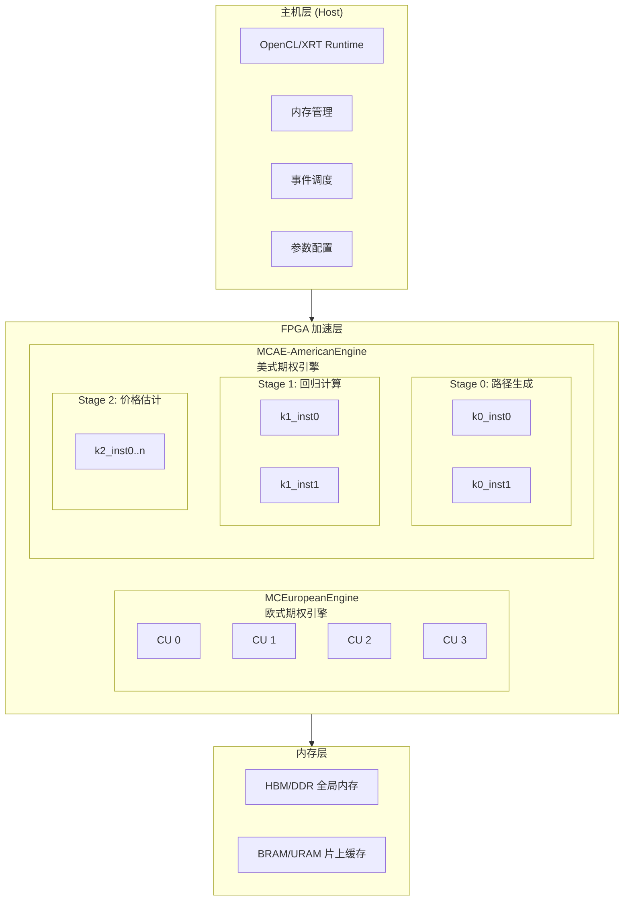

# l2_monte_carlo_option_engines 模块深度解析

## 一句话概括

本模块是 **Xilinx/AMD FPGA 上的蒙特卡洛期权定价加速引擎**，通过将随机路径生成、回归计算、价格估计等计算密集型任务卸载到 FPGA 内核，实现比 CPU 高 1-2 个数量级的金融衍生品定价吞吐。

想象你是一家投行的量化分析师，每天需要对数百万个期权合约进行风险定价。传统 CPU 实现可能需要数小时，而这个模块利用 FPGA 的**空间并行架构**和**确定性流水线**，将同样的计算压缩到分钟甚至秒级——这就是本模块存在的意义。

---

## 问题空间与设计动机

### 为什么需要专用硬件加速？

蒙特卡洛期权定价是一个**计算密集、内存带宽友好、但逻辑控制简单**的问题：

1. **计算密集**：每次定价需要生成数万条随机路径，每条路径涉及几百个时间步的几何布朗运动模拟和折现计算。
2. **路径独立**：不同随机路径之间没有任何数据依赖，天生适合并行。
3. **确定性**：一旦随机种子确定，计算完全是确定性的，不需要复杂的分支预测或缓存一致性协议。

这些特征使得 FPGA 成为理想的执行载体：
- **空间并行**：我们可以实例化几十个计算单元（Compute Units, CUs），每个 CU 独立处理一批路径。
- **流水线化**：每个 CU 内部使用 HLS DATAFLOW，将随机数生成、路径模拟、收益计算流水线化，达到每秒数百 MHz 的吞吐。
- **确定性时序**：不像 CPU 有缓存未命中或分支预测失败的惩罚，FPGA 的执行时间是可预测和可重复的。

### 为什么不做成纯软件方案？

当然，你可以用 CUDA 在 GPU 上做蒙特卡洛，或者用多线程 CPU 实现。但 FPGA 方案在以下场景有独特优势：

1. **延迟敏感**：FPGA 的端到端延迟（从主机提交任务到拿到结果）可以控制在微秒级，而 GPU 需要毫秒级的内核启动和内存拷贝。
2. **功耗效率**：在同等计算吞吐下，FPGA 的功耗通常比 GPU 低 30-50%，这在数据中心大规模部署时意味着显著的 OPEX 节省。
3. **定制化**：我们可以针对特定期权类型（美式 vs 欧式）定制数据通路，而 GPU 的 SIMD 架构对不规则控制流（如美式期权的早期行权判断）效率较低。

### 模块范围与边界

本模块聚焦于 **L2 级别的蒙特卡洛引擎**，意味着：

- **包含**：
  - 欧式期权（European Option）的蒙特卡洛定价内核和主机驱动
  - 美式期权（American Option）的多阶段蒙特卡洛定价内核和主机驱动
  - 针对不同 FPGA 平台（U200, U250, U50）的内核连接性配置
  
- **不包含**：
  - 随机数生成器的底层实现（假设由 L1 库提供）
  - 具体的金融模型（如 Heston 模型）实现细节
  - 与交易所或风控系统的接口层

---

## 核心抽象与心智模型

要理解这个模块，你需要在脑海中建立以下三个层次的抽象：

### 第一层：金融语义——"我们在算什么？"

想象你在预测一只股票的未来价格：

**欧式期权**就像是"我赌明天收盘价会高于 100 元"。你只需要在到期那一刻看一眼价格，决定是否有收益。计算很简单：模拟很多条价格路径，每条路径算一个终值收益，然后取平均折现。

**美式期权**更像是"我可以在到期前的任何时间行权"。这就复杂了——你需要在每条路径的每个时间点判断：是现在行权好，还是继续持有可能更好？这需要动态规划（Longstaff-Schwartz 方法）：先模拟路径，然后用回归估计继续持有的价值，最后倒推最优策略。

这个层次告诉你：**美式期权的计算量比欧式大得多，而且有数据依赖（回归步骤需要所有路径的数据），这是架构设计的核心约束。**

### 第二层：硬件映射——"FPGA 怎么帮我们算？"

现在想象 FPGA 是一个工厂车间：

**计算单元（Compute Unit, CU）**就像是车间里的工人。我们可以雇佣很多工人（实例化多个 CU），每个工人独立处理一批路径。

**流水线（Pipeline）**就像是装配线。在每个 CU 内部，计算被拆成多个阶段：生成随机数 → 模拟价格路径 → 计算收益。数据像流水线上的零件一样流动，每个时钟周期完成一个路径的计算。

**内存层级**就像是工厂的仓库：
- **HBM/DDR** 是中央大仓库，存所有路径的原始数据
- **BRAM/URAM** 是车间旁边的临时货架，存当前流水线需要的小批量数据
- **寄存器** 是工人手边的工具台，存正在计算的数据

这个层次告诉你：**我们需要平衡"雇佣多少工人（CU 数量）"和"每个工人的装配线效率（流水线 II）"，还要考虑仓库的容量和搬运成本（内存带宽）。**

### 第三层：系统编排——"软件怎么协调这一切？"

最后想象你是工厂的调度经理：

**OpenCL/XRT** 是工厂的中控系统。你需要：
1. 初始化设备（打开工厂大门）
2. 编译内核程序（培训工人标准操作流程）
3. 创建命令队列（建立任务分配通道）
4. 分配内存（划分仓库区域）
5. 设置内核参数（给每个工人分配具体任务）
6. 启动内核（开工）
7. 同步等待（等待所有工人完成）
8. 取回结果（从仓库提货）

**事件依赖（Event Dependency）** 就像是工单流转："工人 A 完成工序 1 后，工人 B 才能开始工序 2"。我们使用 OpenCL 的事件对象来建立这种依赖图，确保数据在 CU 之间正确流动。

**双缓冲（Ping-Pong Buffer）** 就像是两班倒：当工人在处理当前批次数据时，调度经理已经把下一批数据准备好了。这样工人不需要等待，可以连续工作。

这个层次告诉你：**软件编排的复杂度不亚于硬件设计。我们需要仔细管理内存生命周期、事件依赖和并发调度，否则再好的硬件也会被软件拖累。**

---

## 架构全景图



### 架构组件详解

| 组件 | 类型 | 职责 | 关键设计决策 |
|------|------|------|--------------|
| `MCEuropeanEngine` | 内核集合 | 欧式期权蒙特卡洛定价 | 计算单元复制（CU replication），支持 2-4 个 CU 并行 |
| `MCAE-AmericanEngine` | 多阶段流水线 | 美式期权 Longstaff-Schwartz 定价 | 3 阶段 DATAFLOW（k0→k1→k2），双缓冲 ping-pong |
| `conn_u200/u250/u50.cfg` | 连接性配置 | 定义内核与 SLR/HBM/DDR 的物理连接 | 平台特定的内存 bank 分配和 SLR 映射 |
| `host/test.cpp` | 主机驱动 | OpenCL 运行时管理、内存分配、任务调度 | 事件链依赖管理、双缓冲调度、性能计时 |

---

## 数据流详解

### 欧式期权数据流（简单并行）

欧式期权的计算逻辑最简单：每个计算单元（CU）独立完成一批路径的模拟和定价，CU 之间没有数据依赖。

```
主机侧：
┌─────────────┐    ┌─────────────┐    ┌─────────────┐
│  参数配置    │───→│  内存分配   │───→│  内核启动   │
│ (S, K, r, σ)│    │ (HBM Bank)  │    │ (enqueueTask)│
└─────────────┘    └─────────────┘    └─────────────┘
                                               │
                                               ↓
FPGA 侧（4 个 CU 并行）：
┌─────────────────────────────────────────────────────────┐
│  CU 0: paths 0-16383    CU 1: paths 16384-32767        │
│  ├─ RNG 生成             ├─ RNG 生成                     │
│  ├─ GBM 路径模拟         ├─ GBM 路径模拟                 │
│  └─ 收益计算 → 本地累加   └─ 收益计算 → 本地累加          │
│                                                         │
│  CU 2: paths 32768-49151  CU 3: paths 49152-65535       │
│  ├─ RNG 生成             ├─ RNG 生成                     │
│  ├─ GBM 路径模拟         ├─ GBM 路径模拟                 │
│  └─ 收益计算 → 本地累加   └─ 收益计算 → 本地累加          │
│                                                         │
│  全局归约：所有 CU 的本地累加值汇总到主机               │
└─────────────────────────────────────────────────────────┘
                                               │
                                               ↓
主机侧：
┌─────────────┐    ┌─────────────┐
│  结果回读   │───→│  最终平均   │───→ 期权价格估计值
│ (enqueueMigrate)│  │ (sum / N)   │
└─────────────┘    └─────────────┘
```

**关键数据契约**：
- 每个 CU 处理 `requiredSamples / cu_number` 条路径
- 路径之间完全独立，无共享状态
- 最终结果在各 CU 本地累加后，由主机做最终归约

---

### 美式期权数据流（三阶段流水线）

美式期权的 Longstaff-Schwartz 算法更复杂，存在三个阶段的数据依赖：

```
主机侧初始化：
┌─────────────┐    ┌─────────────────────────────┐
│  参数配置    │───→│  分配三组 ping-pong 缓冲区   │
│ (S, K, r, σ, │    │  - output_price[2]          │
│  timeSteps)  │    │  - output_mat[2]            │
└─────────────┘    │  - coef[2]                  │
                   └─────────────────────────────┘
                              │
                              ↓
FPGA 侧（三阶段 DATAFLOW）：

迭代 i（使用 ping-pong 缓冲区 i%2）：

Stage 0: MCAE_k0 (路径生成与模拟)
┌─────────────────────────────────────────┐
│ 输入: underlying, volatility, riskFreeRate │
│       strike, optionType, calibSamples    │
│                                         │
│ 内部: for each path in calibSamples:    │
│       - 生成几何布朗运动路径            │
│       - 记录每个时间步的价格              │
│                                         │
│ 输出: output_price[i%2] - 路径价格矩阵  │
│       output_mat[i%2]  - 辅助矩阵        │
└─────────────────────────────────────────┘
            │
            ↓ DATAFLOW 依赖: k0 完成后 k1 开始
            ↓ (使用 hls::stream 或 ping-pong 缓冲)
            ↓
Stage 1: MCAE_k1 (回归系数计算)
┌─────────────────────────────────────────┐
│ 输入: output_price[i%2], output_mat[i%2]  │
│       riskFreeRate, strike, optionType  │
│                                         │
│ 内部: Longstaff-Schwartz 回归:           │
│       - 对每个时间步反向遍历            │
│       - 用基函数回归继续价值            │
│       - 计算最优行权边界                │
│                                         │
│ 输出: coef[i%2] - 回归系数矩阵          │
└─────────────────────────────────────────┘
            │
            ↓ DATAFLOW 依赖: k1 完成后 k2 开始
            ↓
            ↓
Stage 2: MCAE_k2 (最终价格估计)
┌─────────────────────────────────────────┐
│ 输入: coef[i%2], underlying, volatility │
│       requiredSamples (大量路径)        │
│                                         │
│ 内部: for each path in requiredSamples: │
│       - 模拟新路径                      │
│       - 用回归系数估计最优行权时机        │
│       - 累加收益                        │
│                                         │
│ 输出: output - 最终期权价格估计值        │
└─────────────────────────────────────────┘

            │
            ↓ 主机取回结果
            ↓
主机侧：
┌─────────────────────────────────────────┐
│ 迭代 i+1（使用 (i+1)%2 ping-pong 缓冲） │
│ 与迭代 i 的 Stage 2 重叠执行            │
│ 实现主机-设备并行流水线                 │
└─────────────────────────────────────────┘
```

**关键数据契约**：
- `output_price`, `output_mat`, `coef` 都使用双缓冲（`[2]`），使得 `k0/k1/k2` 的迭代 `i` 可以与迭代 `i-1` 的 `k2` 阶段并行执行
- `k0` 输出的是校准路径（`calibSamples`，通常 4096 条），用于回归系数计算
- `k2` 处理的是定价路径（`requiredSamples`，通常 24576 条或更多），使用 `k1` 计算出的回归系数进行价格估计
- 三个阶段通过 `hls::stream` 或 ping-pong 缓冲在 FPGA 片内传递数据，避免主机内存往返

---

## 架构设计决策与权衡

### 决策 1：欧式 vs 美式期权的不同并行策略

| 维度 | MCEuropeanEngine | MCAE-AmericanEngine |
|------|------------------|---------------------|
| **并行策略** | 计算单元复制（CU replication） | 多阶段流水线（DATAFLOW） |
| **并行粒度** | 路径间并行（粗粒度） | 阶段间并行 + 路径内流水线（细粒度） |
| **数据依赖** | 无（路径完全独立） | 强依赖（k0→k1→k2） |
| **内存模式** | 各 CU 读独立 HBM bank | 片内 stream 传递，ping-pong 缓冲 |
| **扩展性** | 随 CU 数线性扩展（受 HBM bank 限制） | 随迭代次数重叠执行扩展 |

**为什么选择不同策略？**

欧式期权的计算逻辑是完全并行的——每条路径的结果只依赖于随机种子，不依赖其他路径。这种情况下，最简单的并行策略就是"雇佣更多工人"：复制多个完全相同的 CU，每个处理一部分路径。这种策略的优势是实现简单、扩展性好（只要 HBM bank 够多，可以一直加 CU）、没有负载均衡问题（每条路径计算量完全相同）。

美式期权则不同，Longstaff-Schwartz 算法的回归步骤需要所有校准路径的数据来计算基函数系数。这意味着我们不能简单地让每个 CU 独立处理一批路径，而是需要三个阶段协作：k0 生成所有校准路径，k1 基于所有路径计算回归系数，k2 使用回归系数估计价格。这种情况下，并行性来自于**流水线化三个阶段**和**在多个迭代间重叠执行**（迭代 i 的 k2 与迭代 i+1 的 k0/k1 并行）。

### 决策 2：平台特定的内存连接配置

模块为三种 FPGA 平台提供了不同的连接性配置：

**U200（2 个 CU，DDR 内存）**：
```
kernel_mc_1 → DDR[0] on SLR0
kernel_mc_2 → DDR[1] on SLR2
```
U200 有 4 个 DDR bank，这里用了 2 个，每个 CU 独占一个 bank，避免内存竞争。

**U250（4 个 CU，DDR 内存）**：
```
kernel_mc_1 → DDR[0] on SLR0
kernel_mc_2 → DDR[1] on SLR1
kernel_mc_3 → DDR[2] on SLR2
kernel_mc_4 → DDR[3] on SLR3
```
U250 有 4 个 SLR（Super Logic Region），每个 SLR 有自己的 DDR bank。4 个 CU 均匀分布在 4 个 SLR 上，最大化内存带宽。

**U50（2 个 CU，HBM 内存）**：
```
kernel_mc_1 → HBM[0] on SLR0
kernel_mc_2 → HBM[7] on SLR1
```
U50 使用 HBM（High Bandwidth Memory），提供比 DDR 高 10 倍的带宽。这里选择了 HBM bank 0 和 7（相隔最远，避免 bank 冲突），分别绑定到 2 个 SLR。

**设计权衡分析**：

1. **DDR vs HBM**：DDR 容量大、成本低，但带宽有限（~20 GB/s per bank）；HBM 带宽高（~250 GB/s per bank），但容量有限且成本高。对于蒙特卡洛这种计算密集、内存访问模式简单的应用，带宽是瓶颈，所以 U50 的 HBM 方案性能最好。

2. **CU 数量与 SLR 分布**：更多的 CU 意味着更高的并行度，但也意味着更多的内存竞争。U250 的 4-CU 设计充分利用了 4 个 SLR 的物理隔离，每个 CU 独占一个 DDR bank，避免了跨 SLR 访问的开销。

3. **平台抽象 vs 性能优化**：模块为每个平台提供了专门的 `.cfg` 文件，这意味着代码不是完全平台无关的。这是故意的权衡——我们牺牲了一定的可移植性，换取了每个平台上的最优性能。如果要移植到新平台，需要重新评估 SLR 分布和内存 bank 分配。

### 决策 3：美式期权的 Ping-Pong 缓冲策略

美式期权的主机代码使用了显式的双缓冲（ping-pong）策略：

```cpp
// 双缓冲数组
ap_uint<64 * UN_K1>* output_price[2];
ap_uint<64>* output_mat[2];
ap_uint<64 * COEF>* coef[2];

// 迭代 i 使用 i%2 的缓冲区
int use_a = i & 1;
if (use_a) {
    // 使用 [0] 缓冲区，同时 [1] 缓冲区可能还在被上一个迭代的 k2 使用
    q.enqueueTask(kernel_MCAE_k0[0], ...);
    q.enqueueTask(kernel_MCAE_k1[0], ...);
    q.enqueueTask(kernel_MCAE_k2_a[c], ...);
} else {
    // 使用 [1] 缓冲区
    ...
}
```

**为什么需要双缓冲？**

美式期权的三阶段流水线（k0→k1→k2）有一个关键约束：k0 和 k1 使用校准路径（~4K 条），k2 使用定价路径（~24K 条）。如果我们每次只处理一个期权合约，那么在 k2 执行时，k0 和 k1 是空闲的。

双缓冲允许我们**在迭代 i 的 k2 阶段与迭代 i+1 的 k0/k1 阶段并行执行**。具体来说：
- 迭代 i 使用缓冲区 0：k0[0] → k1[0] → k2[0]（使用缓冲区 0 的数据）
- 迭代 i+1 使用缓冲区 1：k0[1] → k1[1] → k2[1]（使用缓冲区 1 的数据）

当迭代 i 的 k2[0] 还在执行时（这是最耗时的阶段，因为路径数多），迭代 i+1 的 k0[1] 和 k1[1] 可以已经开始（这两个阶段使用校准路径，数据量小，执行快）。

**设计权衡**：

1. **内存占用翻倍**：双缓冲意味着需要分配两倍的 FPGA 片外内存（HBM/DDR）。对于美式期权的中间结果（output_price, output_mat, coef），这可能占用数百 MB。但相比性能提升（理论上接近 2x 的吞吐），这是值得的。

2. **调度复杂度**：主机代码需要仔细管理事件依赖。k0[i] 依赖于 k2[i-2]（两个迭代前的 k2 完成，释放缓冲区），k1[i] 依赖于 k0[i]，k2[i] 依赖于 k1[i]。这种链式依赖在代码中通过 `&evt3[i-2]` 等事件对象实现。

3. **负载均衡假设**：双缓冲的效果取决于 k2 阶段的执行时间是否显著长于 k0+k1。如果 k0+k1 的时间接近或超过 k2，那么双缓冲的并行效果会减弱。在实际参数设置中（calibSamples=4096, requiredSamples=24576），k2 的路径数是 k0 的 6 倍，保证了 k2 是瓶颈，双缓冲有效。

---

## 子模块概览

本模块包含三个子模块，分别对应不同的职责：

### 1. [european_engine_kernel_connectivity_profiles](quantitative_finance-L2-benchmarks-MCEuropeanEngine-european_engine_kernel_connectivity_profiles.md)

**职责**：定义欧式期权引擎在不同 FPGA 平台上的物理连接配置。

**包含文件**：
- `conn_u200.cfg`：U200 平台（2 CU，DDR）
- `conn_u250.cfg`：U250 平台（4 CU，DDR）
- `conn_u50.cfg`：U50 平台（2 CU，HBM）

**关键设计决策**：
- 每个 CU 独占一个内存 bank（DDR 或 HBM），避免 bank 冲突
- CU 分布在不同的 SLR（Super Logic Region），最大化并行性
- U50 使用 HBM 提供更高带宽，适合内存密集型的蒙特卡洛模拟

### 2. [european_engine_host_timing_support](quantitative_finance_engines-l2_monte_carlo_option_engines-european_engine_host_timing_support.md)

**职责**：欧式期权引擎的主机端驱动程序，负责 OpenCL 运行时管理、内存分配、任务调度和性能计时。

**包含文件**：
- `MCEuropeanEngine/host/test.cpp`：主机测试程序

**关键功能**：
- 设备初始化和内核编译
- 多 CU 任务分发（每个 CU 处理一部分路径）
- 双缓冲（A/B 两套内核实例）实现迭代间并行
- 事件链管理（`kernel_events` → `read_events`）确保依赖正确
- 性能计时（`gettimeofday` + `CL_QUEUE_PROFILING_ENABLE`）

**关键设计决策**：
- 使用 `CL_QUEUE_OUT_OF_ORDER_EXEC_MODE_ENABLE` 允许命令乱序执行，提高并行度
- 每个 CU 创建两个内核实例（`krnl0` 和 `krnl1`），支持双缓冲
- 结果验证与 golden 值比较，确保数值正确性

### 3. [american_engine_host_timing_support](quantitative_finance_engines-l2_monte_carlo_option_engines-american_engine_host_timing_support.md)

**职责**：美式期权引擎的主机端驱动程序，实现更复杂的三阶段流水线（k0→k1→k2）和双缓冲调度。

**包含文件**：
- `MCAmericanEngineMultiKernel/host/main.cpp`：主机主程序

**关键功能**：
- 三阶段内核（`MCAE_k0`, `MCAE_k1`, `MCAE_k2`）的依赖管理
- 双缓冲 ping-pong（`output_price[2]`, `output_mat[2]`, `coef[2]`）
- 跨迭代并行（迭代 i 的 k2 与迭代 i+1 的 k0/k1 并行）
- 多 CU 支持（`cu_number` 个 `MCAE_k2` 实例并行处理定价路径）

**关键设计决策**：
- k0 和 k1 各有两个实例（索引 0/1），对应 ping-pong 的两套缓冲区
- k2 有 `cu_number` 个实例（`MCAE_k2_a[c]` 和 `MCAE_k2_b[c]`），支持定价路径的并行处理
- 事件依赖链：`evt0` (k0) → `evt1` (k1) → `evt2` (k2) → `evt3` (migrate)
- 跨迭代依赖：`evt3[i-2]` 作为 `evt0[i]` 的前置条件，确保缓冲区释放

---

## 新贡献者必读：陷阱与最佳实践

### 1. 内存对齐与分配

**陷阱**：使用标准 `malloc` 分配的设备内存可能导致 DMA 传输失败或性能下降。

**最佳实践**：
```cpp
// 正确：使用 aligned_alloc 确保页对齐（通常 4KB）
output_price[i] = aligned_alloc<ap_uint<64 * UN_K1>>(data_size);

// 设备缓冲区使用 CL_MEM_USE_HOST_PTR 实现零拷贝
cl::Buffer buf(context, CL_MEM_EXT_PTR_XILINX | CL_MEM_USE_HOST_PTR | CL_MEM_READ_WRITE,
               size, &mext_ptr);
```

**原理**：FPGA 的 DMA 引擎通常要求内存地址对齐到页边界（4KB）或更大（2MB for huge pages）。未对齐的内存会导致驱动程序在幕后做额外的拷贝，增加延迟。

### 2. 事件依赖链的构建

**陷阱**：忽略事件依赖会导致竞态条件——内核可能在数据还没准备好就开始执行，或者结果还没写完就被读回。

**最佳实践**：
```cpp
// 建立依赖链：k0 → k1 → k2 → migrate
std::vector<cl::Event> evt0(1), evt1(1), evt2(cu_number), evt3(1);

q.enqueueTask(kernel_k0, nullptr, &evt0[0]);           // 无前置
q.enqueueTask(kernel_k1, &evt0, &evt1[0]);            // 依赖 k0
q.enqueueTask(kernel_k2[c], &evt1, &evt2[c]);         // 依赖 k1
q.enqueueMigrateMemObjects(ob_out, 1, &evt2, &evt3[0]); // 依赖 k2
```

**原理**：OpenCL 的命令队列是异步的，`enqueueTask` 只是将任务提交给驱动，不保证执行顺序。通过 `wait_list` 参数显式声明依赖，驱动程序会确保前置事件完成后再启动后续任务。

### 3. 双缓冲索引的奇偶切换

**陷阱**：双缓冲的索引计算错误（如使用 `i % 2` 但在某些路径上漏掉切换）会导致数据覆盖或未定义行为。

**最佳实践**：
```cpp
// 显式的 ping-pong 切换
for (int i = 0; i < loop_nm; ++i) {
    int use_a = i & 1;  // 偶数迭代用 set A，奇数用 set B
    
    if (use_a) {
        // 使用 output_price[0], output_mat[0], coef[0]
        // 启动 k0[0], k1[0], k2_a[c]
    } else {
        // 使用 output_price[1], output_mat[1], coef[1]
        // 启动 k0[1], k1[1], k2_b[c]
    }
}
```

**原理**：双缓冲的目的是让迭代 `i` 的内核执行与迭代 `i+1` 的内存拷贝重叠。通过固定的奇偶切换模式，我们可以确保：
- 迭代 `i`（偶数）使用 set A，迭代 `i+1`（奇数）使用 set B
- 当迭代 `i` 的 k2 还在读 set A 时，迭代 `i+2` 的 k0 可以开始写 set A（因为迭代 `i+1` 用的是 set B）

### 4. 平台配置的物理约束

**陷阱**：直接复制一个平台的 `.cfg` 文件到另一个平台，可能导致布局布线失败或运行时内存访问错误。

**最佳实践**：
```ini
# U250 配置：4 个 CU 均匀分布在 4 个 SLR
[connectivity]
sp=kernel_mc_1.m_axi_gmem:DDR[0]  # CU 0 → SLR0 → DDR bank 0
sp=kernel_mc_2.m_axi_gmem:DDR[1]  # CU 1 → SLR1 → DDR bank 1
sp=kernel_mc_3.m_axi_gmem:DDR[2]  # CU 2 → SLR2 → DDR bank 2
sp=kernel_mc_4.m_axi_gmem:DDR[3]  # CU 3 → SLR3 → DDR bank 3
slr=kernel_mc_1:SLR0
slr=kernel_mc_2:SLR1
slr=kernel_mc_3:SLR2
slr=kernel_mc_4:SLR3
```

**原理**：FPGA 是物理硬件，内核的放置位置影响：
- **内存访问延迟**：同一 SLR 内的 CU 访问本地 DDR bank 比跨 SLR 访问快 20-30%
- **布局布线可行性**：过于复杂的跨 SLR 连接可能导致时序违例（timing closure 失败）
- **资源碎片**：如果不指定 SLR，Vivado 可能将多个大内核放在同一个 SLR，导致资源耗尽而其他 SLR 空闲

---

## 跨模块依赖

本模块依赖于以下上层和下层模块：

### 上层依赖（调用本模块）

- **[quantitative_finance_engines](quantitative-finance-engines.md)**：本模块的父模块，负责整合所有 L2 级金融引擎（蒙特卡洛、树方法、有限差分等）。

### 下层依赖（本模块调用）

- **[l1_svd_benchmark_host_utils](quantitative-finance-l1-benchmarks-l1-svd-benchmark-host-utils.md)**（推测）：如果蒙特卡洛内核使用了 SVD（奇异值分解）进行回归（如美式期权的 Longstaff-Schwartz 算法中的基函数回归），可能依赖于 L1 级的 SVD 工具。

- **Xilinx 运行时库（XRT）**：本模块的主机代码显式使用了 XRT 的 OpenCL 扩展（`cl::Kernel`, `cl::Buffer`, `cl::CommandQueue` 等）。

- **xf::common::utils_sw::Logger**：来自 Xilinx 通用软件工具库的日志工具，用于测试结果的验证和报告。

---

## 总结：给新贡献者的路线图

如果你刚刚加入团队，需要修改或扩展这个模块，建议按以下顺序深入：

1. **第一周：跑通基准测试**
   - 在 U250 或 U50 上编译并运行欧式和美式期权的测试程序
   - 观察 `opt/sec`（每秒定价的期权数）指标，建立性能基线
   - 使用 `xclbin` 工具查看内核的资源利用率（LUT、FF、BRAM、DSP）

2. **第二周：理解主机-设备交互**
   - 阅读 `test.cpp` 和 `main.cpp`，理解 OpenCL 事件链的构建
   - 修改 `loop_nm`（迭代次数）和 `requiredSamples`（路径数），观察对性能的影响
   - 学习使用 XRT 的 profiling 工具（`xrt.ini` 中的 `profile=true`）查看详细的内核执行时间线

3. **第三周：深入内核优化**
   - 查看 HLS 生成的报告（`hls.log` 和 `dataflow_viewer`），理解 DATAFLOW 的流水线并发现瓶颈
   - 尝试修改 `UN_K1`, `UN_K2`, `COEF` 等模板参数（并行度因子），重新综合并比较性能
   - 理解 `ap_uint<64 * UN_K1>` 这样的宽数据类型如何利用 FPGA 的并行计算能力

4. **第四周：扩展到新平台或新功能**
   - 如果有新平台（如 Versal 或新一代 Alveo），创建新的 `.cfg` 文件，调整 `nk`（内核数量）和 `sp`（内存端口）映射
   - 如果需要支持新的期权类型（如亚式期权或障碍期权），理解当前内核的数学模型，修改 HLS 代码中的收益计算部分
   - 如果需要与上层风险管理系统集成，理解主机代码中的 `xf::common::utils_sw::Logger` 接口，添加更多的调试和验证输出

祝你在 FPGA 加速的金融计算世界中探索愉快！如有疑问，记得查看代码中的 `// NOTE:` 和 `// TODO:` 注释，它们通常包含着原作者的重要提示。
