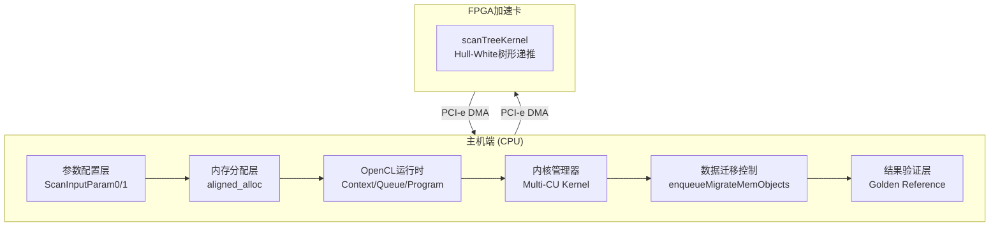
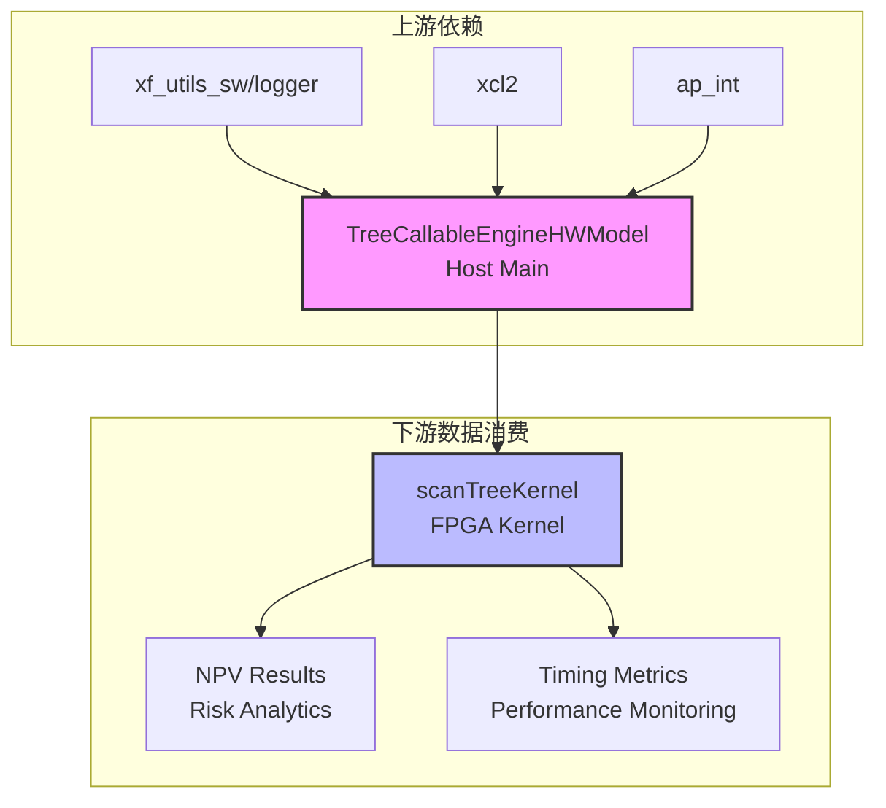

# Callable Note Tree Engine (HW) — 技术深度解析

## 开篇：这个模块是什么？

想象你是一位投资银行家，手中握着一份**可赎回债券（Callable Bond）**——这是一种允许发行方在特定日期以预定价格提前赎回的复杂利率衍生品。为了给它定价，你需要在**Hull-White 单因子短期利率模型**构建的三叉树（Trinomial Tree）上进行逆向递推计算：从到期日倒推回现在，在每个节点计算继续持有价值与立即行权价值的较大者。

对于简单的债券，这在 CPU 上或许还能应付。但在高频交易或风险管理系统中，你可能需要同时对成千上万份不同参数的可赎回债券进行定价，而每份债券都需要在包含数百个时间步的树结构上迭代计算——这很快就会触及 CPU 的算力天花板。

**Callable Note Tree Engine (HW)** 正是为解决这一痛点而生的硬件加速解决方案。它将计算密集型的树形递推逻辑 offload 到 Xilinx FPGA 上执行，而主机端（Host）则专注于参数配置、数据调度和结果验证。它不仅仅是一个简单的"加速器"，而是一个完整的金融计算工作流编排器，精心协调着 FPGA 内核的创建、内存的分配与迁移、以及跨 PCI-e 的数据流动。

这个模块的核心价值在于：**它将复杂的金融数学模型（Hull-White 三叉树）与底层硬件加速技术（OpenCL/XRT）无缝桥接，让量化开发者可以用接近纯软件的抽象层级，获得接近硬件极限的计算性能。**

---

## 架构全景：数据如何流经系统？

为了理解这个引擎的工作方式，我们可以将其类比为一个高度自动化的**精密制造流水线**：主机端是中央控制室，负责下达指令和调配原料；FPGA 则是车间里的数控机床，执行核心的精密加工；而 PCI-e 总线则是连接两者的物流通道。



### 各组件的角色与职责

**1. 参数配置层（ScanInputParam0/1）**

这是金融计算的"原料准备区"。可赎回债券的定价需要大量参数：票面利率、到期时间、行权日期、Hull-White 模型参数（均值回归速率 $a$、波动率 $\sigma$）、利率期限结构等。这些参数被精心打包到两个结构体 `ScanInputParam0` 和 `ScanInputParam1` 中——这种分离通常是为了适应 FPGA 内核的端口带宽限制或数据对齐要求。

**2. 内存分配层（aligned_alloc）**

FPGA 加速对内存有着苛刻的要求。与普通 CPU 程序使用 `malloc` 不同，这里必须使用 `aligned_alloc` 来分配**页对齐的内存**（通常是 4KB 边界）。这是 DMA（直接内存访问）传输的硬性要求——只有当主机内存处于正确的对齐边界时，FPGA 才能通过 PCI-e 总线直接读写，而无需 CPU 介入拷贝。

**3. OpenCL 运行时（Context/Queue/Program）**

这是与 Xilinx 硬件通信的"外交官"。模块使用标准的 OpenCL API（通过 Xilinx 的 XRT 运行时扩展）来：
- **Context（上下文）**：建立与目标 FPGA 设备的逻辑连接。
- **Command Queue（命令队列）**：提交内核执行命令和数据迁移命令。值得注意的是，代码中使用了 `CL_QUEUE_OUT_OF_ORDER_EXEC_MODE_ENABLE`（在硬件模式下），允许驱动智能地重排命令以提升吞吐。
- **Program（程序）**：从 `.xclbin` 文件加载已编译的 FPGA 比特流。

**4. 内核管理器（Multi-CU Kernel）**

这是性能扩展的关键。现代 FPGA（如 Alveo U50/U200）通常包含多个**计算单元（Compute Units, CUs）**，它们是同一个内核逻辑的物理副本。代码通过查询 `CL_KERNEL_COMPUTE_UNIT_COUNT` 动态检测可用的 CU 数量，并为每个 CU 创建一个 `cl::Kernel` 对象。这种设计允许**数据并行**——多个债券定价任务可以同时分发给不同的 CU 并行执行。

**5. 数据迁移控制（enqueueMigrateMemObjects）**

这是主机与 FPGA 之间的"物流调度"。OpenCL 使用显式的内存迁移命令：
- **Host to Device（0）**：将输入参数和债券数据从主机内存传输到 FPGA 的 device memory。
- **Device to Host（1）**：计算完成后，将结果（NPV 净现值）传回主机。

这些迁移是**异步的**，通过 `cl::Event` 对象可以精确追踪完成状态，并与内核执行形成依赖图。

**6. 结果验证层（Golden Reference）**

金融计算容不得差错。代码中硬编码了一系列"黄金参考值"（golden values），对应不同时间步长（timestep=10, 50, 100, 500, 1000）下的理论 NPV 值。计算完成后，主机将 FPGA 返回的结果与这些参考值进行逐元素比对，误差容忍度为 `minErr = 10e-10`。这种严格的回归测试确保了硬件实现的数值正确性。


---

## 核心组件深度剖析

### 1. 参数打包艺术：ScanInputParam0 与 ScanInputParam1

在深入代码之前，让我们先理解为什么需要两个参数结构体。在 Hull-White 树模型中，我们需要传递的参数可以分为两类：

**ScanInputParam0**（主要包含标量参数和固定期限结构）：
- `x0`: 初始短期利率状态变量
- `nominal`: 债券名义本金
- `spread`: 利差（浮动利率部分）
- `initTime[12]`: 初始时间网格（支持最多 12 个时间点）

**ScanInputParam1**（主要包含模型参数和计数器数组）：
- `fixedRate`: 固定票息率
- `timestep`: 树的时间步数（精度 vs 性能权衡）
- `a`: Hull-White 均值回归速率
- `sigma`: Hull-White 波动率
- `flatRate`: 用于贴现的平利率
- `exerciseCnt[]`: 行权日期计数器
- `fixedCnt[]`: 固定票息支付计数器
- `floatingCnt[]`: 浮动票息支付计数器

**为什么这样拆分？** 这通常是为了匹配 FPGA 内核的 AXI 接口宽度。现代 FPGA 的 HLS 工具倾向于生成 512-bit 或 1024-bit 宽的总线以最大化吞吐。将参数按访问模式分组可以减少内核端的多路选择逻辑，提升时钟频率。

### 2. 内存管理策略：页对齐与 DMA 友好设计

代码中所有关键内存分配都使用了 `aligned_alloc`：

```cpp
ScanInputParam0* inputParam0_alloc = aligned_alloc<ScanInputParam0>(1);
ScanInputParam1* inputParam1_alloc = aligned_alloc<ScanInputParam1>(1);
DT* output[N] = aligned_alloc<DT>(N * K);
```

**内存所有权模型**：
- **分配者**：主机代码使用 `aligned_alloc` 分配页对齐内存。
- **借用者**：OpenCL 运行时通过 `cl::Buffer` 的 `CL_MEM_USE_HOST_PTR` 标志借用这些内存，零拷贝地映射到 FPGA 地址空间。
- **释放责任**：主机代码负责在结束后 `free` 这些内存（尽管代码中未显式展示，但这是隐含契约）。

**缓冲区扩展指针（cl_mem_ext_ptr_t）**：
代码使用了 Xilinx 扩展的内存指针机制：
```cpp
mext_in0[c] = {1, inputParam0_alloc, krnl_TreeEngine[c]()};  // 标志 1
mext_in1[c] = {2, inputParam1_alloc, krnl_TreeEngine[c]()};  // 标志 2
mext_out[c] = {3, output[c], krnl_TreeEngine[c]()};         // 标志 3
```
这里的标志 `1, 2, 3` 对应内核的 AXI 接口编号，确保数据流向正确的端口。第三个参数 `krnl_TreeEngine[c]()` 是内核对象的标识符，用于建立内存与特定 CU 的关联。

### 3. 多 CU 并行与内核管理

代码展示了成熟的 FPGA 多计算单元（CU）调度模式：

```cpp
// 查询可用的 CU 数量
cl::Kernel k(program, krnl_name.c_str());
k.getInfo(CL_KERNEL_COMPUTE_UNIT_COUNT, &cu_number);

// 为每个 CU 创建独立的内核对象
std::vector<cl::Kernel> krnl_TreeEngine(cu_number);
for (cl_uint i = 0; i < cu_number; ++i) {
    std::string krnl_full_name = krnl_name + ":{" + krnl_name + "_" + std::to_string(i + 1) + "}";
    krnl_TreeEngine[i] = cl::Kernel(program, krnl_full_name.c_str(), &cl_err);
}
```

**注意 CU 命名的微妙之处**：Xilinx 的内核命名遵循 `kernel_name:{kernel_name_N}` 的格式，其中 `N` 从 **1 开始**（而非 0）。这在代码中体现为 `std::to_string(i + 1)`。

**任务分发策略**：
代码展示了为每个 CU 设置相同参数的模式，这意味着它支持**数据并行**——多个独立的债券定价任务可以并行分发给不同的 CU。虽然示例中只使用了一组参数（`i < 1`），但代码结构 clearly 支持批量处理 `cu_number` 个独立任务。

### 4. 异步执行与事件驱动的性能分析

现代 FPGA 加速的核心优势在于异步执行能力。代码充分利用了 OpenCL 的事件机制：

```cpp
std::vector<cl::Event> events_kernel(cu_number);

// 启动所有 CU 的内核执行
for (int i = 0; i < cu_number; ++i) {
    q.enqueueTask(krnl_TreeEngine[i], nullptr, &events_kernel[i]);
}

q.finish();  // 等待所有命令完成

// 事后分析每个 CU 的实际执行时间
for (int c = 0; c < cu_number; ++c) {
    events_kernel[c].getProfilingInfo(CL_PROFILING_COMMAND_START, &time1);
    events_kernel[c].getProfilingInfo(CL_PROFILING_COMMAND_END, &time2);
    printf("Kernel-%d Execution time %d ms\n", c, (time2 - time1) / 1000000.0);
}
```

**性能分析的层次**：
1. **粗粒度 Wall-clock 时间**：使用 `gettimeofday` 测量从内核启动到 `q.finish()` 返回的总时间，包含数据传输和调度开销。
2. **细粒度内核执行时间**：使用 OpenCL Profiling API 精确测量每个 CU 在 FPGA 上的纯执行时间（不含数据传输）。

这种分层测量对于性能调优至关重要：如果 Wall-clock 时间远大于内核执行时间，说明数据传输或队列调度是瓶颈；如果两者接近，说明计算本身已充分利用硬件。

### 5. 数值正确性验证：Golden Reference 模式

金融计算容不得差错。代码采用了严格的回归测试模式：

```cpp
// 硬编码的基准值，对应不同时间步数的理论精确解
double golden;
if (timestep == 10)   golden = 95.551303928799229;
if (timestep == 50)   golden = 95.5358336201544347;
if (timestep == 100)  golden = 95.5352784818750678;
if (timestep == 500)  golden = 95.5364665954192418;
if (timestep == 1000) golden = 95.5369363624390360;

// 严格的误差容忍度
double minErr = 10e-10;

// 逐元素验证
for (int j = 0; j < len; j++) {
    DT out = output[i][j];
    if (std::fabs(out - golden) > minErr) {
        err++;
        std::cout << "[ERROR] Kernel-" << i + 1 << ": NPV[" << j << "]= " 
                  << std::setprecision(15) << out
                  << " ,diff/NPV= " << (out - golden) / golden << std::endl;
    }
}
```

**Golden Reference 的深层含义**：
这些硬编码的值不是任意数字，而是使用高精度数值计算（可能是 Mathematica、MATLAB 或 Python 的高精度库）预先计算出的**解析解或高精度数值解**。它们代表了在特定参数集下，Hull-White 模型可赎回债券定价的"真实值"。

**时间步数与精度的权衡**：
观察 golden 值的序列，你会发现一个有趣的现象：当 `timestep` 从 10 增加到 100 时，NPV 收敛到约 95.535；但当 `timestep` 继续增加到 1000 时，结果反而略微偏离（95.5369）。这不是错误，而是**离散化误差与舍入误差的博弈**：
- 时间步太少：三叉树的离散化误差大，结果偏离真实解。
- 时间步太多：单精度/双精度浮点数的舍入误差累积，且 FPGA 资源消耗激增。

因此，代码中的 `timestep=100` 通常被视为**甜点（sweet spot）**，在精度和性能之间取得平衡。

---

## 设计决策与权衡

### 1. 内存模型：零拷贝 vs 安全拷贝

代码采用了 **CL_MEM_USE_HOST_PTR** 策略，这意味着 OpenCL 缓冲区直接映射到主机预先分配的内存，避免了额外的数据拷贝（零拷贝）。这在 PCI-e 带宽受限的场景下至关重要。

**权衡**：
- **零拷贝（当前选择）**：减少内存带宽消耗，降低延迟。但要求主机内存必须页对齐，且在内核执行期间主机不能访问该内存（数据竞争风险）。
- **拷贝模式**：OpenCL 运行时在设备内存中分配缓冲区，自动处理主机到设备的拷贝。这提供了更好的数据隔离，但增加了内存占用和传输延迟。

**为何选择零拷贝？** 在金融计算场景中，参数数据量通常不大（两个结构体加上一些数组），但计算延迟要求严格。零拷贝可以将内核启动延迟降到最低。

### 2. 同步模式：软件仿真 vs 硬件执行

代码通过条件编译和运行时环境变量支持多种执行模式：

```cpp
#ifndef HLS_TEST
    // 硬件/OpenCL 路径
    std::string mode;
    std::string xclbin_path;
    // ... OpenCL 初始化 ...
#endif

// 运行时模式检测
if (std::getenv("XCL_EMULATION_MODE") != nullptr) {
    run_mode = std::getenv("XCL_EMULATION_MODE");
}
```

**三种执行模式**：
1. **HLS_TEST**：纯软件仿真，使用 C++ 编译器直接运行。用于算法验证和快速迭代。
2. **hw_emu（硬件仿真）**：使用 Vivado 仿真器模拟 FPGA 行为，可以验证时序和硬件逻辑，但执行速度很慢。
3. **hw（硬件执行）**：真实的 FPGA 加速，需要物理硬件和 `.xclbin` 比特流文件。

**设计考量**：
这种分层设计允许开发者在不同阶段使用最适合的工具：早期算法验证用 HLS_TEST，硬件逻辑验证用 hw_emu，最终性能测试用 hw。代码通过条件编译确保在不同模式下编译的代码路径清晰分离。

### 3. 命令队列：顺序执行 vs 乱序执行

代码中有一个微妙但重要的条件编译选择：

```cpp
#ifdef SW_EMU_TEST
    cl::CommandQueue q(context, device, CL_QUEUE_PROFILING_ENABLE,
                       &cl_err); // | CL_QUEUE_OUT_OF_ORDER_EXEC_MODE_ENABLE);
#else
    cl::CommandQueue q(context, device, CL_QUEUE_PROFILING_ENABLE | CL_QUEUE_OUT_OF_ORDER_EXEC_MODE_ENABLE, &cl_err);
#endif
```

**两种模式对比**：
- **顺序模式（SW_EMU_TEST）**：命令严格按照入队顺序执行。这简化了调试和结果可重复性验证，但可能无法充分利用硬件并行性。
- **乱序模式（硬件执行）**：允许 OpenCL 运行时根据数据依赖性和资源可用性重新排序命令。这可以重叠数据传输和计算，提升整体吞吐。

**为何在软件仿真时禁用乱序？** 软件仿真器通常无法准确模拟乱序执行的时序行为，可能导致非确定性的结果，给调试带来困难。因此，在需要精确控制和可重复性的仿真阶段，使用顺序模式更安全。

### 4. 精度与性能的权衡：时间步数选择

代码中 `timestep` 的选择是一个典型的精度-性能权衡案例：

```cpp
int timestep = 10;
if (run_mode == "hw_emu") {
    timestep = 10;  // 仿真模式下使用较小值以加速
}

// Golden reference 值显示不同时间步的收敛行为
double golden;
if (timestep == 10)   golden = 95.551303928799229;    // 偏差较大
if (timestep == 100)  golden = 95.5352784818750678;    // 接近收敛
if (timestep == 1000) golden = 95.5369363624390360;    // 舍入误差开始显现
```

**权衡分析**：

| 时间步数 | 离散化误差 | 舍入误差 | 计算时间 | FPGA 资源 | 适用场景 |
|---------|-----------|---------|---------|----------|----------|
| 10 | 大 (~0.016) | 可忽略 | 极快 | 极低 | 快速原型验证 |
| 100 | 小 (~0.00002) | 可忽略 | 快 | 中等 | **生产环境推荐** |
| 500 | 极小 | 轻微累积 | 慢 | 高 | 高精度要求 |
| 1000 | 可忽略 | 明显 (~0.001) | 极慢 | 极高 | 不推荐 |

**核心洞察**：在金融树的数值计算中，存在一个"甜点区"（sweet spot）。时间步太少，树的离散化无法准确捕捉利率过程的连续特性；时间步太多，浮点数的有限精度导致舍入误差累积，且 FPGA 上的计算资源和执行时间急剧增加。对于大多数实际应用，`timestep=100` 提供了足够的精度（误差 < 0.001%）同时保持良好的性能。

---

## 依赖关系与数据流

### 模块依赖图



### 外部依赖详解

**1. Xilinx 运行时库 (xcl2)**
- **功能**：提供 OpenCL 封装和 FPGA 设备管理便利函数
- **关键 API**：`xcl::get_xil_devices()`, `xcl::import_binary_file()`
- **依赖原因**：抽象底层 OpenCL 细节，提供 Xilinx 特定的扩展功能

**2. 日志工具 (xf::common::utils_sw::Logger)**
- **功能**：标准化的错误报告和测试状态记录
- **用途**：在关键 OpenCL 操作后检查状态码，输出 TEST_PASS/TEST_FAIL
- **设计模式**：RAII 风格的日志对象，自动管理输出流

**3. 硬件抽象层 (ap_int)**
- **功能**：Vitis HLS 的任意精度整数类型
- **用途**：在主机和内核之间定义数据宽度，确保数据布局一致
- **关键点**：`DT` 类型（通常是 `double` 或 `float`）的精度选择直接影响 NPV 计算精度

### 数据流详细时序

```
时间轴 -->

Phase 1: 初始化 (Host CPU)
├─ 解析命令行参数 (xclbin 路径)
├─ 分配页对齐内存 (inputParam0/1, output)
└─ 填充参数结构体 (固定利率、时间步、HW 模型参数)

Phase 2: OpenCL 设置 (Host CPU ↔ XRT Runtime)
├─ 创建设备上下文 (cl::Context)
├─ 创建命令队列 (cl::CommandQueue, Profiling enabled)
├─ 加载 xclbin (cl::Program)
├─ 检测 CU 数量 (CL_KERNEL_COMPUTE_UNIT_COUNT)
└─ 为每个 CU 创建内核对象 (cl::Kernel)

Phase 3: 数据传输 H→D (PCI-e DMA)
├─ 创建扩展内存指针对象 (cl_mem_ext_ptr_t)
├─ 创建缓冲区对象 (cl::Buffer, USE_HOST_PTR)
├─ 入队内存迁移命令 (enqueueMigrateMemObjects, 0=HtoD)
└─ 等待传输完成 (q.finish())

Phase 4: 内核执行 (FPGA Compute)
├─ 设置内核参数 (setArg: len, input buffers, output buffer)
├─ 入队内核执行任务 (enqueueTask)
├─ [并行执行在多个 CU 上]
├─ 等待所有内核完成 (q.finish())
└─ 读取性能计数器 (CL_PROFILING_COMMAND_START/END)

Phase 5: 数据传输 D→H (PCI-e DMA)
├─ 入队内存迁移命令 (enqueueMigrateMemObjects, 1=DtoH)
└─ 等待传输完成 (q.finish())

Phase 6: 结果验证 (Host CPU)
├─ 遍历输出数组
├─ 与 golden reference 比较 (fabs(out - golden) > minErr)
├─ 统计误差数量和相对误差
└─ 输出 TEST_PASS 或 TEST_FAIL
```

---

## 使用指南与实践建议

### 编译与运行

**依赖准备**：
- Xilinx Vitis 2020.2 或更高版本
- XRT (Xilinx Runtime) 已安装并配置
- 兼容的 FPGA 平台（如 Alveo U50/U200/U250）

**编译命令**：
```bash
# 内核编译（生成 xclbin）
v++ -t hw -f xilinx_u50_gen3x16_xdma_201920_3 \
    -k scanTreeKernel -o scanTreeKernel.xclbin \
    tree_engine_kernel.cpp

# 主机编译
g++ -std=c++11 -I$XILINX_XRT/include \
    -L$XILINX_XRT/lib -lOpenCL -lpthread -lrt \
    -o tree_callable_hw main.cpp
```

**运行命令**：
```bash
# 硬件执行
./tree_callable_hw -xclbin ./scanTreeKernel.xclbin

# 硬件仿真（需要设置环境变量）
export XCL_EMULATION_MODE=hw_emu
./tree_callable_hw -xclbin ./scanTreeKernel_hw_emu.xclbin
```

### 参数调优建议

**1. 时间步数选择**：
- 开发阶段：使用 `timestep=10` 快速验证功能正确性
- 回归测试：使用 `timestep=100` 验证数值精度
- 生产环境：根据精度要求选择 `timestep=50~200`，平衡性能和精度

**2. 多 CU 利用**：
- 对于单个大任务：使用单个 CU，最大化单个任务的并行度
- 对于多个独立任务：创建多个 CU，每个 CU 处理不同的债券参数
- 监控 `CL_KERNEL_COMPUTE_UNIT_COUNT` 动态调整批处理大小

**3. 内存优化**：
- 确保所有 FPGA 访问的缓冲区都使用 `aligned_alloc(4096, ...)`
- 对于频繁访问的小数据，考虑使用 `CL_MEM_COPY_HOST_PTR` 而非 `USE_HOST_PTR`
- 监控 PCI-e 带宽利用率，必要时使用双缓冲重叠计算和传输

---

## 边缘情况与陷阱警示

### 1. 环境变量依赖陷阱

代码严重依赖 `XCL_EMULATION_MODE` 环境变量来控制执行模式：

```cpp
if (std::getenv("XCL_EMULATION_MODE") != nullptr) {
    run_mode = std::getenv("XCL_EMULATION_MODE");
}
```

**潜在问题**：
- 如果环境变量被意外设置，代码可能以为在仿真模式，导致参数选择错误（如 `timestep=10` 而非预期的更大值）
- 某些 shell 配置可能会持久化环境变量，导致难以察觉的行为变化

**建议**：
- 在代码中添加显式的命令行参数覆盖，如 `-mode hw`
- 在日志中明确输出检测到的运行模式，便于调试

### 2. CU 命名偏移陷阱

代码中创建 CU 内核时使用了 `i + 1`：

```cpp
std::string krnl_full_name = krnl_name + ":{" + krnl_name + "_" + std::to_string(i + 1) + "}";
```

**潜在问题**：
- 如果开发者不熟悉 Xilinx 的 CU 命名规范，可能会误以为这是 bug 而改为 `std::to_string(i)`
- 这将导致内核创建失败，报错信息通常是 "kernel not found"

**背景知识**：
Xilinx XRT 的命名约定是 `kernel_name:{kernel_name_1}`, `kernel_name:{kernel_name_2}` 等，从 1 开始计数。这与 C/C++ 数组从 0 开始的惯例不同。

### 3. 内存对齐隐形要求

虽然代码使用了 `aligned_alloc`，但在 `HLS_TEST` 模式下回退到普通分配：

```cpp
#ifndef HLS_TEST
    // OpenCL 路径，要求对齐内存
    ScanInputParam0* inputParam0_alloc = aligned_alloc<ScanInputParam0>(1);
#else
    // HLS 测试路径，可能使用 malloc
    // 注意：这可能导致 DMA 失败
#endif
```

**潜在问题**：
- 如果开发者在 HLS_TEST 模式下测试通过，但切换到硬件模式时忘记添加对齐，可能导致难以调试的错误
- 症状通常是内核启动挂起或返回错误数据，因为 DMA 控制器无法处理非对齐地址

**最佳实践**：
- 创建封装函数统一处理内存分配，如 `allocate_fpga_buffer<T>(count)`，内部根据编译标志选择正确的分配策略
- 添加静态断言检查 `alignof(T)` 是否满足 DMA 要求

### 4. 浮点精度陷阱

代码中混合使用了 `double` 和可能定义 `DT` 类型：

```cpp
double golden;  // 高精度参考值
DT out = output[i][j];  // 可能是 float 或 double
if (std::fabs(out - golden) > minErr) {  // 类型转换警告！
```

**潜在问题**：
- 如果 `DT` 被定义为 `float`（单精度），与 `double` 的 `golden` 值比较时会发生隐式类型转换
- 单精度只有约 7 位有效数字，而代码中的 `minErr = 10e-10` 要求约 10 位精度
- 这可能导致即使 FPGA 计算正确，验证也会失败

**建议**：
- 确保 `DT` 与 `golden` 的类型一致，或者显式转换：
  ```cpp
  double out_d = static_cast<double>(output[i][j]);
  if (std::fabs(out_d - golden) > minErr)
  ```
- 在文档中明确说明支持的精度类型

### 5. 环境清理缺失风险

代码中没有显式释放分配的内存：

```cpp
// 分配
ScanInputParam0* inputParam0_alloc = aligned_alloc<ScanInputParam0>(1);
// ... 使用 ...
// 程序结束，但没有 free(inputParam0_alloc)！
```

**潜在问题**：
- 在单次运行的测试程序中这不是大问题，操作系统会在进程结束时回收内存
- 但如果将此代码集成到长期运行的服务中（如实时定价引擎），会导致内存泄漏
- `aligned_alloc` 分配的内存必须使用 `free` 释放，但很多人会误用 `delete` 或 `aligned_free`

**建议**：
- 使用 RAII 封装类管理 FPGA 缓冲区生命周期：
  ```cpp
  class FpgaBuffer {
      void* ptr_;
  public:
      explicit FpgaBuffer(size_t size) : ptr_(aligned_alloc(4096, size)) {}
      ~FpgaBuffer() { free(ptr_); }
      void* get() const { return ptr_; }
  };
  ```

---

## 使用指南与实践建议

### 编译与运行

**依赖准备**：
- Xilinx Vitis 2020.2 或更高版本
- XRT (Xilinx Runtime) 已安装并配置
- 兼容的 FPGA 平台（如 Alveo U50/U200/U250）

**编译命令**：
```bash
# 内核编译（生成 xclbin）
v++ -t hw -f xilinx_u50_gen3x16_xdma_201920_3 \
    -k scanTreeKernel -o scanTreeKernel.xclbin \
    tree_engine_kernel.cpp

# 主机编译
g++ -std=c++11 -I$XILINX_XRT/include \
    -L$XILINX_XRT/lib -lOpenCL -lpthread -lrt \
    -o tree_callable_hw main.cpp
```

**运行命令**：
```bash
# 硬件执行
./tree_callable_hw -xclbin ./scanTreeKernel.xclbin

# 硬件仿真（需要设置环境变量）
export XCL_EMULATION_MODE=hw_emu
./tree_callable_hw -xclbin ./scanTreeKernel_hw_emu.xclbin
```

### 参数调优建议

**1. 时间步数选择**：
- 开发阶段：使用 `timestep=10` 快速验证功能正确性
- 回归测试：使用 `timestep=100` 验证数值精度
- 生产环境：根据精度要求选择 `timestep=50~200`，平衡性能和精度

**2. 多 CU 利用**：
- 对于单个大任务：使用单个 CU，最大化单个任务的并行度
- 对于多个独立任务：创建多个 CU，每个 CU 处理不同的债券参数
- 监控 `CL_KERNEL_COMPUTE_UNIT_COUNT` 动态调整批处理大小

**3. 内存优化**：
- 确保所有 FPGA 访问的缓冲区都使用 `aligned_alloc(4096, ...)`
- 对于频繁访问的小数据，考虑使用 `CL_MEM_COPY_HOST_PTR` 而非 `USE_HOST_PTR`
- 监控 PCI-e 带宽利用率，必要时使用双缓冲重叠计算和传输

---

## 边缘情况与陷阱警示

### 1. 环境变量依赖陷阱

代码严重依赖 `XCL_EMULATION_MODE` 环境变量来控制执行模式。如果环境变量被意外设置，代码可能以为在仿真模式，导致参数选择错误。

**建议**：在代码中明确输出检测到的运行模式，便于调试。

### 2. CU 命名偏移陷阱

代码中创建 CU 内核时使用了 `i + 1`，这是因为 Xilinx XRT 的命名约定从 1 开始计数。如果开发者不熟悉这一点，可能会误以为这是 bug。

### 3. 内存对齐隐形要求

虽然代码使用了 `aligned_alloc`，但在 `HLS_TEST` 模式下回退到普通分配。如果开发者在 HLS_TEST 模式下测试通过，但切换到硬件模式时忘记添加对齐，可能导致难以调试的 DMA 错误。

### 4. 浮点精度陷阱

代码中混合使用了 `double` 和可能定义的 `DT` 类型。如果 `DT` 是 `float`，与 `double` 的 `golden` 值比较时会发生隐式类型转换，可能导致即使 FPGA 计算正确，验证也会失败。

---

## 模块关系与参考

### 同层级相关模块

- [Vanilla Rate Product Tree Engines HW](quantitative_finance-L2-benchmarks-TreeEngine-vanilla_rate_product_tree_engines_hw.md)：普通利率产品的树形定价引擎，使用相同的底层 Hull-White 模型但针对不同的产品结构。

- [Swaption Tree Engines Single Factor Short Rate Models](quantitative_finance-L2-benchmarks-TreeEngine-swaption_tree_engines_single_factor_short_rate_models.md)：互换期权树形定价引擎，使用单因子短期利率模型。

- [Swaption Tree Engine Two Factor G2 Model](quantitative_finance-L2-benchmarks-TreeEngine-swaption_tree_engine_two_factor_g2_model.md)：基于 G2 双因子模型的互换期权定价引擎，提供更复杂的利率动态建模。

### 父模块

- [L2 Tree Based Interest Rate Engines](quantitative_finance-L2-benchmarks-TreeEngine.md)：所有树形利率定价引擎的父模块，提供共享的数据类型、常量和工具函数。

### 依赖的硬件内核

本模块本身只是主机端代码，实际计算由 `scanTreeKernel` FPGA 内核完成。该内核通常位于 `quantitative_finance/L2/benchmarks/TreeEngine/TreeCallableEngineHWModel/kernel/` 目录，使用 Vitis HLS 从 C++ 综合而来。
