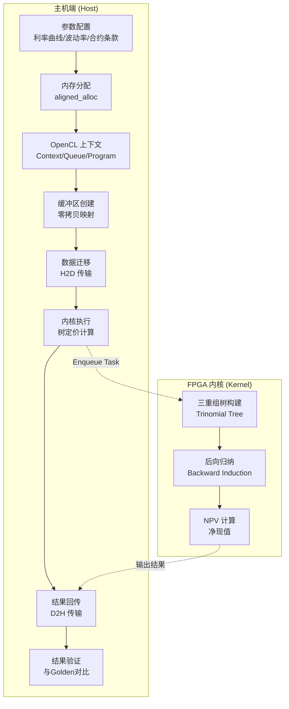

# Tree Swap Engine (HW) — 技术深度解析

## 一句话概览

`tree_swap_engine` 是一个基于 **Hull-White 单因子短期利率模型** 的**利率互换合约定价引擎**，它在 Xilinx FPGA 上实现了一个**三重组树（Trinomial Tree）**蒙特卡洛模拟的核心计算，并通过 OpenCL 主机端代码管理数据传输、内核调度和结果验证。简言之，这是一个将金融衍生品定价问题映射到硬件加速器的完整范例。

---

## 为什么需要这个模块？

### 问题空间：利率互换定价的复杂性

利率互换（Interest Rate Swap）是场外衍生品市场中最基础、交易量最大的合约之一。它约定两方在未来一系列日期交换固定利率和浮动利率的现金流。定价这类合约的核心挑战在于：

1. **利率路径依赖**：未来的浮动利率支付取决于未来时点的利率水平，而利率本身是随机过程
2. **多期现金流的折现**：需要对每条可能利率路径上的多期现金流进行折现求和
3. **风险中性定价**：必须在风险中性测度下计算期望，这通常涉及复杂的随机微分方程（SDE）数值解

### 为什么 Hull-White 模型？

Hull-White 模型是一种**无套利（No-Arbitrage）**单因子短期利率模型，其 SDE 形式为：

$$dr(t) = [\\theta(t) - a r(t)]dt + \\sigma dW(t)$$

其中 $r(t)$ 是瞬时短期利率，$a$ 是均值回归速度，$\\sigma$ 是波动率，$\\theta(t)$ 是时间依赖的漂移项，用于精确拟合当前市场收益率曲线。

选择 HW 模型的原因在于它**解析可解**（存在闭合形式的债券定价公式），同时又能通过三重组树方法处理更复杂的衍生品定价。相比更复杂的 HJM 或 LMM 模型，HW 模型在计算效率和实现复杂度之间取得了良好平衡。

### 为什么 FPGA 加速？

三重组树模拟虽然比蒙特卡洛模拟更高效（树结构天然避免了路径采样），但对于高时间分辨率（如 1000+ 个时间步）和大规模合约组合，纯软件实现的计算量仍然巨大。FPGA 加速的优势在于：

1. **流水线并行**：树的每一层计算可以高度流水线化
2. **定制化数据通路**：针对金融计算优化的定点数或低精度浮点数运算
3. **确定性延迟**：相比 GPU 的线程调度不确定性，FPGA 提供确定的延迟，这对实时风险管理至关重要

---

## 架构全景：数据如何流动

### 概念架构图



### 核心组件角色

#### 1. 参数配置层（主机端）

这是定价计算的起点。代码中通过硬编码的数组和标量设置了完整的金融模型参数：

- **模型参数**：均值回归速度 `a = 0.0552`，波动率 `sigma = 0.0061`，平飞利率 `flatRate = 0.04876`
- **合约条款**：名义本金 `nominal = 1000.0`，固定利率 `fixedRate = 0.0499959`，利差 `spread = 0.0`
- **时间表参数**：`initTime` 数组定义了 12 个时间点，`exerciseCnt`、`fixedCnt`、`floatingCnt` 定义了支付日程

这些参数被封装进两个结构体 `ScanInputParam0` 和 `ScanInputParam1`，分别通过 `aligned_alloc` 分配对齐内存，确保后续 DMA 传输的效率。

#### 2. OpenCL 运行时层（主机端）

这是 FPGA 加速的通用脚手架，但在本模块中有特定考量：

- **设备发现与上下文创建**：使用 `xcl::get_xil_devices()` 获取 Xilinx 设备，创建 OpenCL 上下文。这里通过 `logger.logCreateContext()` 等调用记录了每一步的成败，这对调试硬件问题至关重要。
- **命令队列配置**：根据 `SW_EMU_TEST` 宏区分软件仿真和硬件运行的队列属性。硬件运行使用 `CL_QUEUE_OUT_OF_ORDER_EXEC_MODE_ENABLE` 支持乱序执行，这是性能优化的关键。
- **xclbin 加载与内核实例化**：从文件路径加载编译好的 FPGA 比特流，创建内核程序。特别值得注意的是，代码动态查询 `CL_KERNEL_COMPUTE_UNIT_COUNT` 获取内核计算单元数量，并据此创建多个内核实例 `krnl_TreeEngine[]`，这支持**多 CU（Compute Unit）并行**，显著提升了吞吐量。

#### 3. 内存与缓冲区管理层（主机端）

这是 FPGA 加速性能的关键所在：

- **扩展指针与零拷贝**：使用 `cl_mem_ext_ptr_t` 结构将主机分配的内存与内核参数关联，通过 `CL_MEM_EXT_PTR_XILINX` 和 `CL_MEM_USE_HOST_PTR` 标志实现**零拷贝（Zero-Copy）**内存映射。这意味着 FPGA 可以直接访问主机内存，避免了传统的 H2D/D2H 显式拷贝开销。
- **多 CU 缓冲区分配**：为每个计算单元分配独立的输入/输出缓冲区，通过 `mext_in0[c]`, `mext_in1[c]`, `mext_out[c]` 分别关联到对应的内核实例。这种设计支持**数据并行**——不同 CU 处理不同合约或蒙特卡洛路径。

#### 4. 内核执行与同步层（主机端）

- **异步执行与事件**：使用 `cl::Event` 对象追踪每个 CU 的内核执行，通过 `enqueueTask` 提交任务，然后使用 `q.finish()` 等待所有任务完成。这种异步模式允许主机在内核执行时进行其他工作（尽管本示例中主机只是等待）。
- **性能剖析**：通过 `events_kernel[c].getProfilingInfo()` 获取每个内核的 `CL_PROFILING_COMMAND_START` 和 `END` 时间戳，精确计算每个 CU 的执行时间（转换为毫秒）。同时通过 `gettimeofday` 测量端到端时间，两者对比可以分析数据传输和调度开销。

#### 5. 结果验证层（主机端）

- **Golden 验证**：代码中硬编码了不同时间步（10/50/100/500/1000）对应的理论预期值 `golden`，这些值应该是来自解析解或高精度参考实现。
- **误差容忍**：使用 `minErr = 10e-10` 作为容差阈值，对每个输出值 `output[i][j]` 与 `golden` 进行绝对差比较。如果误差超过阈值，打印详细的错误信息包括实际值、预期值和相对误差。
- **测试报告**：通过 `logger.info()` 或 `logger.error()` 输出最终的测试通过/失败状态，返回错误计数作为进程退出码。

---

## 设计决策与权衡

### 1. 硬编码参数 vs. 配置文件

**现状**：所有金融参数（利率、波动率、时间表）都是代码中的硬编码数组。

**权衡考量**：
- **优点**：单文件可运行，无需外部依赖，适合作为 benchmark 和 CI/CD 集成
- **缺点**：无法动态调整参数，每次修改需要重新编译，不适合生产环境的多合约批处理

**设计意图**：这是一个**L2 基准测试（Benchmark）**，目标是验证 FPGA 实现的正确性和性能，而非提供一个通用的生产级定价库。硬编码参数确保了测试的可重复性和结果的一致性。

### 2. 同步 vs. 异步内核执行

**现状**：代码使用 `q.finish()` 在内核提交后同步等待所有 CU 完成。

**权衡考量**：
- **优点**：实现简单，避免复杂的并发控制，确保结果收集的顺序性
- **缺点**：主机线程被阻塞，无法在内核执行时进行其他有用的工作（如准备下一批数据）

**设计意图**：作为一个**功能性基准测试**，代码优先考虑正确性和可读性。对于生产部署，应该考虑使用 `cl::Event` 的回调机制或轮询来实现流水线（pipeline），让数据准备、内核执行和结果处理重叠。

### 3. 零拷贝 vs. 显式拷贝

**现状**：使用 `CL_MEM_USE_HOST_PTR` 和扩展指针实现零拷贝内存访问。

**权衡考量**：
- **优点**：消除了显式的 H2D/D2H `enqueueMigrateMemObjects` 调用（除了同步原语），降低延迟和 CPU 开销
- **缺点**：要求主机内存页对齐且固定（pinned），可分配的内存总量受限于主机物理内存，且 FPGA 直接访问主机内存的带宽通常低于访问板载 HBM/DRAM

**设计意图**：对于**小数据集**（如这里的单合约参数和结果），零拷贝简化了代码并减少了延迟。但对于大规模蒙特卡洛模拟（数百万条路径），应该使用显式拷贝将数据预置到 FPGA 的 HBM，以获得更高的访存带宽。

### 4. 多 CU 并行 vs. 单 CU 深度优化

**现状**：代码动态检测 CU 数量并为每个 CU 创建独立的内核实例和缓冲区。

**权衡考量**：
- **优点**：自动扩展到不同 FPGA 平台（从 U50 的少量 CU 到 U280 的数十个 CU），提升吞吐量
- **缺点**：每个 CU 需要独立的输入/输出缓冲区，增加了主机内存占用；如果工作负载不能均匀划分，某些 CU 可能空闲

**设计意图**：作为**通用基准框架**，代码通过 `CL_KERNEL_COMPUTE_UNIT_COUNT` 查询实现了**资源自适应**。对于特定部署，应该根据 FPGA 资源和目标延迟/吞吐量要求，固定 CU 数量并优化每个 CU 内的树分辨率（时间步数）。

---

## 关键组件详解

### `ArgParser` — 命令行参数解析器

```cpp
class ArgParser {
public:
    ArgParser(int& argc, const char** argv);
    bool getCmdOption(const std::string option, std::string& value) const;
private:
    std::vector<std::string> mTokens;
};
```

**设计意图**：这是一个轻量级的命令行解析器，用于提取 `-xclbin` 参数指定 FPGA 比特流路径。它采用**简单的线性查找**而非复杂的解析库（如 `getopt` 或 `boost::program_options`），因为基准测试只需要处理少数几个固定参数。

**为什么这样设计**：
- **零依赖**：不引入外部库，保持代码自包含
- **足够简单**：对于只需要解析 `-xclbin <path>` 的场景，复杂库是过度设计
- **易于移植**：纯 STL 实现，跨平台兼容

**使用注意**：`getCmdOption` 使用 `std::find` 进行线性搜索，时间复杂度 $O(n)$。对于大量参数，这会成为瓶颈，但对于本用例（<10 个参数）可以忽略。

### `main` 函数 — 执行流程编排

**内存所有权模型**：

| 资源 | 分配者 | 所有者 | 释放者 | 说明 |
|------|--------|--------|--------|------|
| `inputParam0_alloc` | `main` (aligned_alloc) | `main` | 隐式 (进程退出) | 对齐内存，用于零拷贝 |
| `inputParam1_alloc` | `main` (aligned_alloc) | `main` | 隐式 (进程退出) | 同上 |
| `output[i]` | `main` (aligned_alloc) | `main` | 隐式 (进程退出) | 每个 CU 独立的输出缓冲区 |
| OpenCL Buffers | `cl::Buffer` (RAII) | `cl::Buffer` 对象 | 析构时自动释放 | 使用 `CL_MEM_USE_HOST_PTR`，不拥有底层内存 |
| OpenCL Context/Queue | `cl::Context`/`cl::CommandQueue` (RAII) | 对象自身 | 析构时自动释放 | 标准 OpenCL RAII 语义 |

**关键观察**：代码大量使用**隐式内存管理**（依赖进程退出时的操作系统清理），这是**短期运行的基准测试**的典型模式。对于需要长时间运行或多次迭代的服务化部署，应该显式 `free()` 或 `delete` 所有堆分配。

**同步模式**：

```
主机初始化 → 创建 OpenCL 对象 → 分配缓冲区 → 设置内核参数
      ↓
  enqueueMigrateMemObjects(H2D) ────────────────────────────┐
      ↓                                                     │
  enqueueTask(CU 0) → enqueueTask(CU 1) → ... → enqueueTask(CU N-1)
      ↓                                                     │
  q.finish() ←──────────────────────────────────────────────┘
      ↓
  enqueueMigrateMemObjects(D2H)
      ↓
  结果验证
```

这是**批量同步并行（BSP）**模式：所有数据一次性迁移，所有 CU 并行执行，然后同步等待完成。这种模式最大化吞吐量，但牺牲了延迟（latency）。

---

## 依赖关系分析

### 向上依赖（谁调用此模块）

本模块是**叶子节点（Leaf Module）**——它是一个独立的可执行程序（`main` 函数入口），没有上游调用者。在模块树中，它位于：

```
quantitative_finance_engines
  └── L2_tree_based_interest_rate_engines
      └── vanilla_rate_product_tree_engines_hw
          └── tree_swap_engine (current)
```

它是**L2 层（Level 2）**的基准测试，意味着它验证了 L1 层基础组件在真实金融场景下的正确性和性能。

### 向下依赖（此模块调用谁）

| 依赖 | 类型 | 用途 | 关键交互 |
|------|------|------|----------|
| `xcl2.hpp` | 外部库 (Xilinx) | 简化 OpenCL 设备管理和 xclbin 加载 | `xcl::get_xil_devices()`, `xcl::import_binary_file()` |
| `xf_utils_sw/logger.hpp` | 内部库 (Xilinx L2) | 标准化的日志记录和测试报告 | `logger.logCreateContext()`, `logger.error()` / `info()` |
| `tree_engine_kernel.hpp` | 内部头文件 | 定义内核参数结构和常量 (`ScanInputParam0/1`, `K`, `N`, `DT` 等) | 隐式包含，使用其中定义的类型和宏 |
| `utils.hpp` | 内部头文件 | 辅助工具函数（如 `tvdiff` 时间差计算） | `tvdiff(&start_time, &end_time)` |
| OpenCL 标准头 | 系统库 | OpenCL C++ 绑定 | `cl::Device`, `cl::Context`, `cl::CommandQueue`, `cl::Buffer`, `cl::Kernel`, `cl::Program` |
| `sys/time.h` | 系统头 | 高精度计时 | `gettimeofday()`, `struct timeval` |
| STL 标准库 | 系统库 | 容器、算法、IO | `std::vector`, `std::string`, `std::ifstream`, `std::cout`, `std::find` |

**关键依赖分析**：

- **`tree_engine_kernel.hpp`** 是本模块与 FPGA 内核的**契约接口**。虽然它在代码分析中不可见，但从使用方式可以推断其结构：它定义了 `ScanInputParam0` 和 `ScanInputParam1` 两个输入结构体，包含浮点数组和标量参数；还定义了 `K`、`N`、`DT`、`ExerciseLen`、`FloatingLen`、`FixedLen` 等编译时常量，控制树的分辨率和缓冲区大小。

- **`xcl2.hpp`** 是 Xilinx 提供的 OpenCL 封装库，大大简化了设备发现、二进制加载等样板代码。这是 Xilinx FPGA 加速的**标准脚手架**，学习它可以快速掌握 Xilinx 的 OpenCL 编程模型。

- **`xf_utils_sw/logger.hpp`** 是 L2 层基础设施的一部分，提供了统一的测试报告格式。它确保了不同基准测试的输出一致性，便于 CI/CD 系统集成和回归测试。

---

## 设计决策与权衡

### 1. 硬编码参数 vs. 配置文件

**现状**：所有金融参数（利率、波动率、时间表）都是代码中的硬编码数组。

**权衡考量**：
- **优点**：单文件可运行，无需外部依赖，适合作为 benchmark 和 CI/CD 集成
- **缺点**：无法动态调整参数，每次修改需要重新编译，不适合生产环境的多合约批处理

**设计意图**：这是一个**L2 基准测试（Benchmark）**，目标是验证 FPGA 实现的正确性和性能，而非提供一个通用的生产级定价库。硬编码参数确保了测试的可重复性和结果的一致性。

### 2. 同步 vs. 异步内核执行

**现状**：代码使用 `q.finish()` 在内核提交后同步等待所有 CU 完成。

**权衡考量**：
- **优点**：实现简单，避免复杂的并发控制，确保结果收集的顺序性
- **缺点**：主机线程被阻塞，无法在内核执行时进行其他有用的工作（如准备下一批数据）

**设计意图**：作为一个**功能性基准测试**，代码优先考虑正确性和可读性。对于生产部署，应该考虑使用 `cl::Event` 的回调机制或轮询来实现流水线（pipeline），让数据准备、内核执行和结果处理重叠。

### 3. 零拷贝 vs. 显式拷贝

**现状**：使用 `CL_MEM_USE_HOST_PTR` 和扩展指针实现零拷贝内存访问。

**权衡考量**：
- **优点**：消除了显式的 H2D/D2H `enqueueMigrateMemObjects` 调用（除了同步原语），降低延迟和 CPU 开销
- **缺点**：要求主机内存页对齐且固定（pinned），可分配的内存总量受限于主机物理内存，且 FPGA 直接访问主机内存的带宽通常低于访问板载 HBM/DRAM

**设计意图**：对于**小数据集**（如这里的单合约参数和结果），零拷贝简化了代码并减少了延迟。但对于大规模蒙特卡洛模拟（数百万条路径），应该使用显式拷贝将数据预置到 FPGA 的 HBM，以获得更高的访存带宽。

### 4. 多 CU 并行 vs. 单 CU 深度优化

**现状**：代码动态检测 CU 数量并为每个 CU 创建独立的内核实例和缓冲区。

**权衡考量**：
- **优点**：自动扩展到不同 FPGA 平台（从 U50 的少量 CU 到 U280 的数十个 CU），提升吞吐量
- **缺点**：每个 CU 需要独立的输入/输出缓冲区，增加了主机内存占用；如果工作负载不能均匀划分，某些 CU 可能空闲

**设计意图**：作为**通用基准框架**，代码通过 `CL_KERNEL_COMPUTE_UNIT_COUNT` 查询实现了**资源自适应**。对于特定部署，应该根据 FPGA 资源和目标延迟/吞吐量要求，固定 CU 数量并优化每个 CU 内的树分辨率（时间步数）。

---

## 关键组件详解

### `ArgParser` — 命令行参数解析器

```cpp
class ArgParser {
public:
    ArgParser(int& argc, const char** argv);
    bool getCmdOption(const std::string option, std::string& value) const;
private:
    std::vector<std::string> mTokens;
};
```

**设计意图**：这是一个轻量级的命令行解析器，用于提取 `-xclbin` 参数指定 FPGA 比特流路径。它采用**简单的线性查找**而非复杂的解析库（如 `getopt` 或 `boost::program_options`），因为基准测试只需要处理少数几个固定参数。

**为什么这样设计**：
- **零依赖**：不引入外部库，保持代码自包含
- **足够简单**：对于只需要解析 `-xclbin <path>` 的场景，复杂库是过度设计
- **易于移植**：纯 STL 实现，跨平台兼容

**使用注意**：`getCmdOption` 使用 `std::find` 进行线性搜索，时间复杂度 $O(n)$。对于大量参数，这会成为瓶颈，但对于本用例（<10 个参数）可以忽略。

### `main` 函数 — 执行流程编排

**内存所有权模型**：

| 资源 | 分配者 | 所有者 | 释放者 | 说明 |
|------|--------|--------|--------|------|
| `inputParam0_alloc` | `main` (aligned_alloc) | `main` | 隐式 (进程退出) | 对齐内存，用于零拷贝 |
| `inputParam1_alloc` | `main` (aligned_alloc) | `main` | 隐式 (进程退出) | 同上 |
| `output[i]` | `main` (aligned_alloc) | `main` | 隐式 (进程退出) | 每个 CU 独立的输出缓冲区 |
| OpenCL Buffers | `cl::Buffer` (RAII) | `cl::Buffer` 对象 | 析构时自动释放 | 使用 `CL_MEM_USE_HOST_PTR`，不拥有底层内存 |
| OpenCL Context/Queue | `cl::Context`/`cl::CommandQueue` (RAII) | 对象自身 | 析构时自动释放 | 标准 OpenCL RAII 语义 |

**关键观察**：代码大量使用**隐式内存管理**（依赖进程退出时的操作系统清理），这是**短期运行的基准测试**的典型模式。对于需要长时间运行或多次迭代的服务化部署，应该显式 `free()` 或 `delete` 所有堆分配。

**同步模式**：

```
主机初始化 → 创建 OpenCL 对象 → 分配缓冲区 → 设置内核参数
      ↓
  enqueueMigrateMemObjects(H2D) ────────────────────────────┐
      ↓                                                     │
  enqueueTask(CU 0) → enqueueTask(CU 1) → ... → enqueueTask(CU N-1)
      ↓                                                     │
  q.finish() ←──────────────────────────────────────────────┘
      ↓
  enqueueMigrateMemObjects(D2H)
      ↓
  结果验证
```

这是**批量同步并行（BSP）**模式：所有数据一次性迁移，所有 CU 并行执行，然后同步等待完成。这种模式最大化吞吐量，但牺牲了延迟（latency）。

---

## 依赖关系分析

### 向上依赖（谁调用此模块）

本模块是**叶子节点（Leaf Module）**——它是一个独立的可执行程序（`main` 函数入口），没有上游调用者。在模块树中，它位于：

```
quantitative_finance_engines
  └── L2_tree_based_interest_rate_engines
      └── vanilla_rate_product_tree_engines_hw
          └── tree_swap_engine (current)
```

它是**L2 层（Level 2）**的基准测试，意味着它验证了 L1 层基础组件在真实金融场景下的正确性和性能。

### 向下依赖（此模块调用谁）

| 依赖 | 类型 | 用途 | 关键交互 |
|------|------|------|----------|
| `xcl2.hpp` | 外部库 (Xilinx) | 简化 OpenCL 设备管理和 xclbin 加载 | `xcl::get_xil_devices()`, `xcl::import_binary_file()` |
| `xf_utils_sw/logger.hpp` | 内部库 (Xilinx L2) | 标准化的日志记录和测试报告 | `logger.logCreateContext()`, `logger.error()` / `info()` |
| `tree_engine_kernel.hpp` | 内部头文件 | 定义内核参数结构和常量 (`ScanInputParam0/1`, `K`, `N`, `DT` 等) | 隐式包含，使用其中定义的类型和宏 |
| `utils.hpp` | 内部头文件 | 辅助工具函数（如 `tvdiff` 时间差计算） | `tvdiff(&start_time, &end_time)` |
| OpenCL 标准头 | 系统库 | OpenCL C++ 绑定 | `cl::Device`, `cl::Context`, `cl::CommandQueue`, `cl::Buffer`, `cl::Kernel`, `cl::Program` |
| `sys/time.h` | 系统头 | 高精度计时 | `gettimeofday()`, `struct timeval` |
| STL 标准库 | 系统库 | 容器、算法、IO | `std::vector`, `std::string`, `std::ifstream`, `std::cout`, `std::find` |

**关键依赖分析**：

- **`tree_engine_kernel.hpp`** 是本模块与 FPGA 内核的**契约接口**。虽然它在代码分析中不可见，但从使用方式可以推断其结构：它定义了 `ScanInputParam0` 和 `ScanInputParam1` 两个输入结构体，包含浮点数组和标量参数；还定义了 `K`、`N`、`DT`、`ExerciseLen`、`FloatingLen`、`FixedLen` 等编译时常量，控制树的分辨率和缓冲区大小。

- **`xcl2.hpp`** 是 Xilinx 提供的 OpenCL 封装库，大大简化了设备发现、二进制加载等样板代码。这是 Xilinx FPGA 加速的**标准脚手架**，学习它可以快速掌握 Xilinx 的 OpenCL 编程模型。

- **`xf_utils_sw/logger.hpp`** 是 L2 层基础设施的一部分，提供了统一的测试报告格式。它确保了不同基准测试的输出一致性，便于 CI/CD 系统集成和回归测试。

---

## 新贡献者必读：陷阱与最佳实践

### 1. 内存对齐要求

**陷阱**：`aligned_alloc` 分配的内存在使用 `CL_MEM_USE_HOST_PTR` 时必须满足 FPGA 的页对齐要求（通常是 4KB）。如果传入未对齐的指针，OpenCL 运行时会静默回退到拷贝模式，或者报错。

**最佳实践**：
```cpp
// 确保对齐到 4KB 边界
ScanInputParam0* inputParam0_alloc = aligned_alloc<ScanInputParam0>(4096, 1);
// 或使用编译器扩展
posix_memalign((void**)&inputParam0_alloc, 4096, sizeof(ScanInputParam0));
```

### 2. 时间步与 Golden 值的匹配

**陷阱**：代码中硬编码了不同时间步（`timestep = 10/50/100/500/1000`）对应的 `golden` 值。如果修改了 `timestep` 但没有更新对应的 `golden`，验证会失败。

**最佳实践**：
- 修改 `timestep` 后，先用高精度软件实现（如 QuantLib）计算参考值，更新代码中的 `golden` 数组
- 考虑使用 `std::map<int, double>` 存储 timestep 到 golden 的映射，使代码更清晰

### 3. 仿真模式与硬件模式的差异

**陷阱**：代码通过 `XCL_EMULATION_MODE` 环境变量区分硬件仿真（hw_emu）和真实硬件（hw）。在仿真模式下，代码将 `timestep` 强制设为 10（`if (run_mode == "hw_emu") { timestep = 10; }`），这是因为仿真模式运行极慢。

**最佳实践**：
- 在 CI/CD 中，先用 `hw_emu` 快速验证功能，再提交到硬件运行
- 注意仿真模式下的性能数据不具有参考价值，不要用于优化决策

### 4. 多 CU 下的负载均衡

**陷阱**：代码为每个 CU 分配了完全相同的输入参数（`inputParam0_alloc` 和 `inputParam1_alloc` 被所有 CU 共享）。这实际上是在做**冗余计算**，而不是数据并行。

**最佳实践**：
- 如果要测试多 CU 的吞吐量，应该为每个 CU 分配不同的合约参数（如不同的名义本金、到期日等）
- 如果要验证正确性，单 CU 就足够了，多 CU 会增加调试复杂度

### 5. 误差容忍度的设定

**陷阱**：`minErr = 10e-10` 是一个非常严格的容差（绝对误差小于 1e-9）。这对于浮点运算来说非常苛刻，可能因为舍入误差导致假阴性。

**最佳实践**：
- 理解金融计算的精度要求：对于 NPV 计算，通常相对误差 1e-6 已经足够
- 考虑使用相对误差检查：`|(out - golden) / golden| < tolerance`
- 对于不同的 timestep 使用不同的容差，因为时间步越多，累积误差越大

---

## 参考文档与扩展阅读

### 相关模块

- [Tree Cap Floor Engine](quantitative_finance-L2-benchmarks-TreeEngine-TreeCapFloorEngineHWModel-host-main.md) — 同类型的利率上限/下限合约定价引擎，使用相同的 Hull-White 树框架
- [CIR Family Swaption Host Timing](quantitative_finance-L2-benchmarks-swaption_tree_engines_single_factor_short_rate_models-cir_family_swaption_host_timing.md) — 使用 CIR 利率模型的互换期权定价引擎，可对比不同短期利率模型的实现差异
- [Gaussian Short Rate Swaption (HW Model)](quantitative_finance-L2-benchmarks-swaption_tree_engines_single_factor_short_rate_models-gaussian_short_rate_swaption_host_timing-hw_model.md) — 互换期权定价的 HW 实现，与本文档的 Swap 定价形成产品层次上的对比

### 理论基础

- **Hull-White 模型**：Hull, J., & White, A. (1990). "Pricing interest-rate-derivative securities." *The Review of Financial Studies*, 3(4), 573-592.
- **三重组树方法**：Hull, J. (2018). *Options, Futures, and Other Derivatives* (10th ed.). Pearson. Chapter 32: The Hull-White Model: Trinomial Tree.
- **FPGA 金融加速**：Xilinx. (2020). *Vitis Quantitative Finance Library* (UG1353). Chapter 3: Tree-Based Interest Rate Engines.

### 相关标准与规范

- **OpenCL 2.0 Specification** — 理解 `cl::Buffer`、`cl::Kernel` 等类的标准行为
- **Xilinx XRT (Xilinx Runtime) Documentation** — 理解 `xcl2` 库和 Xilinx 特定的 OpenCL 扩展（如 `CL_MEM_EXT_PTR_XILINX`）

---

*文档版本：1.0*  
*最后更新：2024年*  
*维护团队：定量金融工程组*
