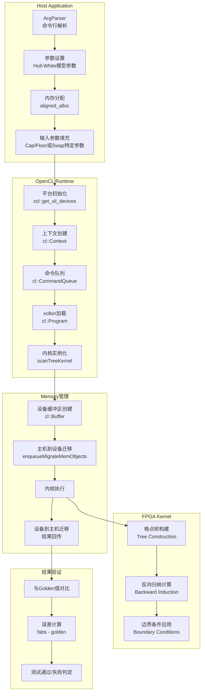

# Vanilla Rate Product Tree Engines (HW) - 技术深度解析

## 一句话概括

本模块是基于 **Hull-White 单因子短期利率模型**的 FPGA 加速定价引擎，用于高效计算利率上限/下限期权 (Cap/Floor) 和利率互换 (Swap) 等香草利率衍生品的理论价格。它将计算密集型的格点树 (Lattice Tree) 数值计算卸载到 FPGA 硬件上，在保持模型精度的同时实现数量级加速。

---

## 问题空间：为什么需要这个模块？

### 利率衍生品定价的计算挑战

在利率市场中，Cap/Floor 和 Swap 是最基础的对冲工具。它们的定价依赖于对未来利率路径的建模。Hull-White 模型因其解析可处理性和对收益率曲线的完美拟合能力，成为业界标准选择。

然而，这些定价问题涉及：

1. **高维状态空间**：短期利率是连续随机过程，数值求解需要离散化时间维度和利率维度
2. **递归依赖**：格点上每个节点的价值依赖于后续时间步的节点值，形成反向归纳计算链
3. **大量计算节点**：为保证精度，时间步长通常需要 50-1000 步，利率维度同样需要精细划分

在 CPU 上，这类计算可能成为风险管理系统或实时报价系统的瓶颈。

### FPGA 加速的契机

格点树方法具有以下适合硬件加速的特性：

- **规则的数据访问模式**：格点结构规则，内存访问可预测
- **高度并行**：同一时间点不同利率节点的计算相互独立
- **计算密集**：浮点运算占比高，适合 FPGA 的 DSP 单元

本模块正是利用这些特性，将定价内核移植到 FPGA，通过 OpenCL 接口与主机交互。

---

## 心智模型：如何理解这个系统？

### 核心抽象：定价即格点遍历

想象你在解决一个谜题，需要从终点倒推回起点。在每个时间点，利率可能处于不同水平（就像迷宫的不同层级）。你知道终点（到期日）的价值，需要一步步倒推回现在，计算今天的合理价格。

**关键洞察**：这不是前向模拟（预测未来利率路径），而是**反向归纳**（从已知终点倒推当前价值）。每个节点的价值 = 折现后的期望未来价值 + 现金流。

### 系统架构类比：餐厅厨房

将定价流程比作高端餐厅的后厨运作：

1. **备料间 (Host Setup)**：主机准备所有食材（模型参数、期限结构、现金流时间表）。这是数据准备阶段，需要精确但不需要高速。

2. **传送带 (OpenCL Runtime)**：服务员将备好的料通过专用通道（PCIe + OpenCL）送到厨房。这里需要高效的数据传输，确保厨房不因等料而空闲。

3. **主厨工作站 (FPGA Kernel)**：这是核心烹饪区。多位厨师（并行计算单元）同时处理不同菜品（利率节点）的烹饪。他们遵循严格的食谱（Hull-White 算法），使用标准化工具（DSP 单元）进行精确计算。

4. **出品质检 (Result Verification)**：菜品送回后，与标准菜谱对比（Golden Reference），确保口味一致（数值误差在容限内）。

### 数据流视角：四个阶段

从数据角度看，一次定价请求经历：

1. **参数物化**：抽象的金融概念（波动率、均值回归速度）变成具体的 C++ 结构体字段
2. **内存对齐**：数据按 FPGA 要求的对齐方式排列，准备 DMA 传输
3. **设备计算**：数据在 FPGA 上完成格点构建、反向归纳、边界条件应用
4. **结果回传**：计算出的 NPV（净现值）回到主机，进行误差检验

---

## 架构详解

### 整体架构图



### 核心组件

本模块包含两个主要的定价引擎子模块，分别对应不同的利率衍生品类型：

#### 1. TreeCapFloorEngineHWModel (利率上限/下限引擎)

**定位**：基于 Hull-White 模型的利率 Cap/Floor 期权定价引擎。

**核心职责**：
- 解析 Cap/Floor 的合同条款：行权利率、重置日期、支付频率
- 构建对应于每个行权日的格点树
- 计算每个行权日的内在价值并折现回当前

**关键参数**：
- `fixedRate`：行权利率 (Strike Rate)
- `exerciseCnt`：行权日期索引
- `floatingCnt`：浮动利率观测日期
- `nominal`：名义本金

#### 2. TreeSwapEngineHWModel (利率互换引擎)

**定位**：基于 Hull-White 模型的普通香草利率互换 (Plain Vanilla Interest Rate Swap) 定价引擎。

**核心职责**：
- 解析互换合同的固定端和浮动端现金流时间表
- 在格点树上计算固定端和浮动端的价值
- 考虑支付频率、计息基准等细节

**关键参数**：
- `fixedRate`：固定端利率
- `fixedCnt`：固定端支付日期
- `floatingCnt`：浮动端观测/支付日期
- `x0`：即期利率偏移
- `spread`：浮动端利差

### 共享基础设施

两个引擎共享以下基础设施：

#### 内存布局与数据结构

```cpp
// 输入参数结构体 0 - 主要包含现金流相关参数
struct ScanInputParam0 {
    double x0;           // 初始利率偏移
    double nominal;      // 名义本金
    double spread;       // 浮动端利差
    double initTime[12]; // 初始化时间网格
};

// 输入参数结构体 1 - 主要包含模型参数和日期索引
struct ScanInputParam1 {
    int index;           // 实例索引
    int type;            // 类型标识
    double fixedRate;    // 固定/行权利率
    int timestep;        // 时间步数
    int initSize;        // 初始网格大小
    double a;            // Hull-White 均值回归速度
    double sigma;        // Hull-White 波动率
    double flatRate;     // 平准利率
    int exerciseCnt[5];  // 行权日期索引
    int fixedCnt[5];     // 固定端日期索引
    int floatingCnt[10]; // 浮动端日期索引
};
```

#### OpenCL 运行时管理层

**平台抽象层**：
- 设备发现：`xcl::get_xil_devices()` 枚举 Xilinx FPGA 设备
- 二进制加载：`xcl::import_binary_file()` 加载编译后的 `.xclbin` 文件

**执行上下文**：
- 上下文创建：`cl::Context` 管理 OpenCL 资源生命周期
- 命令队列：`cl::CommandQueue` 支持乱序执行 (`CL_QUEUE_OUT_OF_ORDER_EXEC_MODE_ENABLE`) 和性能分析 (`CL_QUEUE_PROFILING_ENABLE`)

**内核管理**：
- 多 CU (Compute Unit) 支持：自动检测并实例化多个内核计算单元实现并行处理
- 内核参数绑定：通过 `setArg()` 传递标量参数和缓冲区对象

#### 内存管理策略

**主机端内存**：
- 使用 `aligned_alloc()` 分配页对齐内存，确保 DMA 传输效率
- 结构体实例化采用 SOA (Structure of Arrays) 风格的批量分配

**设备端内存**：
- 使用 `cl_mem_ext_ptr_t` 扩展指针机制建立主机-设备内存映射
- 缓冲区标志：`CL_MEM_EXT_PTR_XILINX | CL_MEM_USE_HOST_PTR | CL_MEM_READ_WRITE`
- 显式内存迁移：`enqueueMigrateMemObjects` 控制数据传输时机

**零拷贝优化**：
- 通过 `CL_MEM_USE_HOST_PTR` 避免隐式数据拷贝，FPGA 直接访问主机物理内存

---

## 设计决策与权衡

### 1. 硬件加速 vs 软件灵活性

**决策**：将格点树计算密集型部分固化到 FPGA，保留主机端参数配置灵活性。

**权衡分析**：
- **优势**：
  - 利用 FPGA 的并行性同时计算多个利率节点的价值
  - 定点数或自定义精度运算降低资源消耗
  - 确定性延迟满足实时交易需求
- **代价**：
  - 模型修改（如改用多因子模型）需要重新综合硬件
  - 调试复杂度增加，需要软硬件协同验证
  - 批量大小较小时，PCIe 传输开销可能掩盖加速收益

**架构体现**：主机代码保留所有参数配置逻辑，仅将最终的格点遍历计算提交给 FPGA。

### 2. 单精度 vs 双精度浮点

**决策**：主机端使用双精度浮点 (`double`) 进行参数设置和结果验证。

**权衡分析**：
- **优势**：
  - 金融计算通常要求高精度，双精度避免累积误差影响定价准确性
  - 与业界标准（如 QuantLib）对比时，数值误差更小
- **代价**：
  - 内存带宽需求加倍
  - FPGA 端若使用双精度，DSP 资源消耗显著增加

**架构体现**：当前主机代码使用 `double` 类型。FPGA 端可能使用定点数或单精度优化，但主机-FPGA 接口保持双精度以确保数据精度。

### 3. 同步 vs 异步执行

**决策**：使用同步执行模式 (`q.finish()`) 等待内核完成，但支持多 CU 并行。

**权衡分析**：
- **优势**：
  - 代码逻辑简单，易于调试和验证
  - 多 CU 并行仍可利用 FPGA 并行性
- **代价**：
  - 主机线程阻塞等待，CPU 利用率低
  - 无法重叠数据传输和计算

**架构体现**：代码中多次调用 `q.finish()` 确保前一阶段完成。命令队列配置支持乱序执行 (`CL_QUEUE_OUT_OF_ORDER_EXEC_MODE_ENABLE`)，为未来流水线优化预留空间。

### 4. 零拷贝 vs 显式拷贝

**决策**：使用 Xilinx 扩展的零拷贝内存模型 (`CL_MEM_USE_HOST_PTR` + `cl_mem_ext_ptr_t`)。

**权衡分析**：
- **优势**：
  - 避免主机-设备间的显式数据拷贝，减少延迟
  - FPGA 可直接访问主机物理内存，适合大数据量
- **代价**：
  - 要求内存页对齐，分配复杂度增加
  - 主机访问该内存时可能触发缓存一致性问题
  - 可移植性降低（依赖 Xilinx OpenCL 扩展）

**架构体现**：代码中使用 `aligned_alloc` 分配页对齐内存，通过 `cl_mem_ext_ptr_t` 将主机缓冲区直接映射到 FPGA 地址空间。

---

## 数据流追踪：一次完整的定价流程

让我们追踪一个 Cap/Floor 定价请求的完整生命周期：

### 阶段 1：参数准备 (Host)

```cpp
// 1. 内存分配 - 页对齐确保 DMA 友好
ScanInputParam0* inputParam0_alloc = aligned_alloc<ScanInputParam0>(1);
ScanInputParam1* inputParam1_alloc = aligned_alloc<ScanInputParam1>(1);

// 2. 填充 Hull-White 模型参数
inputParam1_alloc[0].a = 0.055228873373796609;      // 均值回归速度
inputParam1_alloc[0].sigma = 0.0061062754654949824; // 波动率
inputParam1_alloc[0].timestep = 10;                // 时间步数

// 3. 填充产品特定参数 (Cap/Floor)
inputParam1_alloc[0].fixedRate = 0.049995924285639641; // 行权利率
inputParam0_alloc[0].nominal = 1000.0;                  // 名义本金
// ... 填充 exerciseCnt, floatingCnt 等日期索引
```

**关键设计点**：
- 使用 `aligned_alloc` 确保缓冲区页对齐，满足 FPGA DMA 要求
- 参数分离为 `ScanInputParam0` 和 `ScanInputParam1` 两组，可能对应 FPGA 内核的两个输入端口

### 阶段 2：OpenCL 运行时初始化

```cpp
// 1. 设备发现和上下文创建
std::vector<cl::Device> devices = xcl::get_xil_devices();
cl::Context context(device, NULL, NULL, NULL, &cl_err);

// 2. 命令队列创建 - 支持性能分析和乱序执行
cl::CommandQueue q(context, device, 
    CL_QUEUE_PROFILING_ENABLE | CL_QUEUE_OUT_OF_ORDER_EXEC_MODE_ENABLE, &cl_err);

// 3. 加载 xclbin 并创建程序
cl::Program::Binaries xclBins = xcl::import_binary_file(xclbin_path);
cl::Program program(context, devices, xclBins, NULL, &cl_err);

// 4. 内核实例化 - 支持多 CU
std::string krnl_name = "scanTreeKernel";
cl::Kernel k(program, krnl_name.c_str());
k.getInfo(CL_KERNEL_COMPUTE_UNIT_COUNT, &cu_number);

// 为每个 CU 创建内核实例
std::vector<cl::Kernel> krnl_TreeEngine(cu_number);
for (cl_uint i = 0; i < cu_number; ++i) {
    std::string krnl_full_name = krnl_name + ":{" + krnl_name + "_" + std::to_string(i + 1) + "}";
    krnl_TreeEngine[i] = cl::Kernel(program, krnl_full_name.c_str(), &cl_err);
}
```

**关键设计点**：
- 多 CU 支持允许并行处理多个独立定价请求，提高吞吐量
- 使用 `CL_QUEUE_PROFILING_ENABLE` 精确测量内核执行时间
- 乱序执行支持为未来流水线优化预留空间

### 阶段 3：内存映射与数据传输

```cpp
// 1. 准备扩展指针 - 建立主机内存到 FPGA 的映射
std::vector<cl_mem_ext_ptr_t> mext_in0(cu_number);
std::vector<cl_mem_ext_ptr_t> mext_in1(cu_number);
std::vector<cl_mem_ext_ptr_t> mext_out(cu_number);

// 2. 分配输出缓冲区
std::vector<DT*> output(cu_number);
for (int i = 0; i < cu_number; i++) {
    output[i] = aligned_alloc<DT>(N * K);
}

// 3. 配置扩展指针 - 指定内核参数索引
for (int c = 0; c < cu_number; ++c) {
    mext_in0[c] = {1, inputParam0_alloc, krnl_TreeEngine[c]()};
    mext_in1[c] = {2, inputParam1_alloc, krnl_TreeEngine[c]()};
    mext_out[c] = {3, output[c], krnl_TreeEngine[c]()};
}

// 4. 创建 OpenCL 缓冲区对象
std::vector<cl::Buffer> output_buf(cu_number);
std::vector<cl::Buffer> inputParam0_buf(cu_number);
std::vector<cl::Buffer> inputParam1_buf(cu_number);

for (int i = 0; i < cu_number; i++) {
    inputParam0_buf[i] = cl::Buffer(context, 
        CL_MEM_EXT_PTR_XILINX | CL_MEM_USE_HOST_PTR | CL_MEM_READ_WRITE,
        sizeof(ScanInputParam0), &mext_in0[i]);
    inputParam1_buf[i] = cl::Buffer(context, 
        CL_MEM_EXT_PTR_XILINX | CL_MEM_USE_HOST_PTR | CL_MEM_READ_WRITE,
        sizeof(ScanInputParam1), &mext_in1[i]);
    output_buf[i] = cl::Buffer(context, 
        CL_MEM_EXT_PTR_XILINX | CL_MEM_USE_HOST_PTR | CL_MEM_READ_WRITE,
        sizeof(DT) * N * K, &mext_out[i]);
}

// 5. 显式数据传输 - 主机到设备
std::vector<cl::Memory> ob_in;
for (int i = 0; i < cu_number; i++) {
    ob_in.push_back(inputParam0_buf[i]);
    ob_in.push_back(inputParam1_buf[i]);
}
q.enqueueMigrateMemObjects(ob_in, 0, nullptr, nullptr);
q.finish();
```

**关键设计点**：
- 使用 `CL_MEM_USE_HOST_PTR` 实现零拷贝，FPGA 直接访问主机内存
- `cl_mem_ext_ptr_t` 扩展指针允许指定内核参数索引，实现灵活映射
- 显式 `enqueueMigrateMemObjects` 控制数据传输时机，支持异步流水线

### 阶段 4：内核执行与计算

```cpp
// 1. 配置内核参数
for (int c = 0; c < cu_number; ++c) {
    int j = 0;
    krnl_TreeEngine[c].setArg(j++, len);                    // 输出长度
    krnl_TreeEngine[c].setArg(j++, inputParam0_buf[c]);     // 输入参数 0
    krnl_TreeEngine[c].setArg(j++, inputParam1_buf[c]);     // 输入参数 1
    krnl_TreeEngine[c].setArg(j++, output_buf[c]);          // 输出缓冲区
}

// 2. 启动内核 - 支持多 CU 并行
std::vector<cl::Event> events_kernel(cu_number);
gettimeofday(&start_time, 0);  // 主机端计时开始

for (int i = 0; i < cu_number; ++i) {
    q.enqueueTask(krnl_TreeEngine[i], nullptr, &events_kernel[i]);
}

q.finish();  // 等待所有 CU 完成
gettimeofday(&end_time, 0);  // 主机端计时结束

// 3. 收集性能分析数据
for (int c = 0; c < cu_number; ++c) {
    events_kernel[c].getProfilingInfo(CL_PROFILING_COMMAND_START, &time1);
    events_kernel[c].getProfilingInfo(CL_PROFILING_COMMAND_END, &time2);
    printf("Kernel-%d Execution time %d ms\\n", c, (time2 - time1) / 1000000.0);
}

std::cout << "FPGA Execution time " << tvdiff(&start_time, &end_time) / 1000.0 << "ms" << std::endl;
```

**FPGA 内核内部计算流程**（概念层面）：

```
输入: Hull-White 参数 (a, sigma), 时间网格, 现金流时间表
      ↓
┌─────────────────────────────────────────────────────────────┐
│  阶段 1: 格点树构建 (Tree Construction)                       │
│  - 根据 Hull-White 模型转移概率计算                         │
│  - 构建时间-利率二维格点结构                                │
│  - 每个节点存储折现因子和转移概率                           │
└─────────────────────────────────────────────────────────────┘
      ↓
┌─────────────────────────────────────────────────────────────┐
│  阶段 2: 反向归纳计算 (Backward Induction)                    │
│  - 从到期日 (T) 反向遍历到当前 (t=0)                        │
│  - 每个节点价值 = 折现期望 + 现金流                         │
│  - 对于 Cap/Floor: 在行权日计算内在价值                     │
│  - 对于 Swap: 比较固定端和浮动端价值                        │
└─────────────────────────────────────────────────────────────┘
      ↓
┌─────────────────────────────────────────────────────────────┐
│  阶段 3: 边界条件应用 (Boundary Conditions)                 │
│  - 处理格点边界处的数值稳定性                               │
│  - 应用终端条件（到期日价值）                               │
└─────────────────────────────────────────────────────────────┘
      ↓
输出: NPV (净现值) 数组
```

### 阶段 5：结果回传与验证

```cpp
// 1. 数据从设备迁回主机
std::vector<cl::Memory> ob_out;
for (int i = 0; i < cu_number; i++) {
    ob_out.push_back(output_buf[i]);
}
q.enqueueMigrateMemObjects(ob_out, 1, nullptr, nullptr);
q.finish();

// 2. 结果验证 - 与 Golden Reference 对比
int err = 0;
DT minErr = 10e-10;  // 误差容限

// Golden 值来自理论解析解或高精度参考实现
// 不同时间步数对应不同精度级别
if (timestep == 10) golden = 164.38820137859625;      // Cap/Floor 示例
if (timestep == 50) golden = 164.3881769326398;
if (timestep == 100) golden = 164.3879285328067;
if (timestep == 500) golden = 164.3879584339098;
if (timestep == 1000) golden = 164.3879630103975;

// 逐元素验证
for (int i = 0; i < cu_number; i++) {
    for (int j = 0; j < len; j++) {
        DT out = output[i][j];
        if (std::fabs(out - golden) > minErr) {
            err++;
            std::cout << "[ERROR] Kernel-" << i + 1 << ": NPV[" << j << "]= " 
                      << std::setprecision(15) << out
                      << " ,diff/NPV= " << (out - golden) / golden << std::endl;
        }
    }
}

// 输出最终结果
std::cout << "NPV[" << 0 << "]= " << std::setprecision(15) << output[0][0]
          << " ,diff/NPV= " << (output[0][0] - golden) / golden << std::endl;

// 测试通过/失败判定
err ? logger.error(xf::common::utils_sw::Logger::Message::TEST_FAIL)
    : logger.info(xf::common::utils_sw::Logger::Message::TEST_PASS);
```

**关键设计点**：
- 使用预计算的 Golden Reference 值验证 FPGA 计算正确性
- 误差容限 `10e-10` 反映双精度浮点数的期望精度
- 相对误差 `(out - golden) / golden` 用于评估数值稳定性

---

## 关键设计决策与权衡

### 决策 1：Hull-White 单因子模型的选择

**选择**：使用 Hull-White 单因子短期利率模型作为定价基准。

**为什么**：
- 解析可处理性：模型允许格点树的高效构建，转移概率有解析公式
- 市场一致性：通过时变参数完美拟合初始收益率曲线
- 均值回归：符合利率市场的经济直觉，避免长期利率爆炸

**权衡**：
- 单因子限制：无法捕捉收益率曲线的扭曲变动，对复杂衍生品可能不足
- 正态假设：利率服从正态分布可能产生负利率（在低利率环境下尤为敏感）

### 决策 2：格点树 vs 蒙特卡洛模拟

**选择**：使用格点树 (Lattice Tree) 而非蒙特卡洛模拟。

**为什么**：
- 美国期权处理：格点树天然支持提前行权决策的反向归纳
- 确定性精度：无随机采样误差，收敛速度不受维数诅咒影响
- FPGA 友好：规则的数据访问模式适合硬件流水线设计

**权衡**：
- 内存消耗：存储整个格点树需要 O(N×M) 内存，N 为时间步，M 为利率维度
- 扩展性限制：高维问题（如多因子模型）会导致格点维度爆炸

### 决策 3：固定时间步 vs 自适应时间步

**选择**：使用均匀分布的固定时间步长。

**为什么**：
- FPGA 实现简化：均匀的格点结构便于硬件流水线设计
- 可预测延迟：固定时间步数允许准确的执行时间估计
- 精度可控：通过增加时间步数系统性地提高精度

**权衡**：
- 效率损失：在利率变化平缓的区域可能过度计算
- 行权日对齐问题：固定步长可能无法精确落在产品现金流行权日

---

## 子模块详细说明

本模块包含两个紧密相关的定价引擎，分别处理不同类型的利率衍生品：

### 1. [TreeCapFloorEngineHWModel](quantitative_finance-L2-benchmarks-TreeEngine-TreeCapFloorEngineHWModel.md) - 利率上限/下限引擎

**职责**：定价利率上限 (Cap) 和下限 (Floor) 期权合约。

**关键特性**：
- 支持多个行权日的复合期权结构
- 每个行权日计算内在价值 (max(0, 利率 - 行权利率)) 
- 考虑重置频率和支付延迟

**典型参数示例**：
- 行权利率：4.9996%
- 名义本金：1000
- 重置时间表：12 个日期
- Hull-White 参数：a=0.0552, σ=0.0061

### 2. [TreeSwapEngineHWModel](quantitative_finance-L2-benchmarks-TreeEngine-TreeSwapEngineHWModel.md) - 利率互换引擎

**职责**：定价普通香草利率互换 (Plain Vanilla Interest Rate Swap) 合约。

**关键特性**：
- 分别计算固定端和浮动端的价值
- 支持不同支付频率（如固定端半年付，浮动端季付）
- 考虑计息基准（如 Act/360, 30/360）

**典型参数示例**：
- 固定利率：4.9996%
- 浮动利差：0
- 支付时间表：固定端 5 期，浮动端 10 期
- Hull-White 参数与 Cap/Floor 场景相同

---

## 依赖关系与系统交互

### 上游依赖（本模块依赖的组件）

1. **[xcl2](xcl2.md)** - Xilinx OpenCL 包装库
   - 提供简化的 OpenCL 设备管理和内存操作 API
   - 封装平台发现、二进制加载等常用操作

2. **[xf_utils_sw/logger](xf_utils_sw-logger.md)** - Xilinx 软件日志工具
   - 统一的日志记录和错误报告接口
   - 测试通过/失败的标准化判定

3. **[tree_engine_kernel](tree_engine_kernel.md)** - 树引擎内核接口
   - 定义 FPGA 内核函数签名和数据结构
   - 包含 `ScanInputParam0`, `ScanInputParam1` 等结构体定义

4. **OpenCL 运行时** - 系统级依赖
   - Xilinx OpenCL 驱动 (`libxilinxopencl`)
   - FPGA 设备固件和 xclbin 文件

### 下游依赖（依赖本模块的组件）

本模块作为 L2 层基准测试组件，通常被以下场景使用：

1. **[quantitative_finance.L2.benchmarks](quantitative_finance-L2-benchmarks.md)** - L2 层基准测试框架
   - 提供标准化的性能测试和对比分析

2. **[swaption_tree_engines_single_factor_short_rate_models](quantitative_finance-L2-benchmarks-TreeEngine-swaption_tree_engines_single_factor_short_rate_models.md)** - 互换期权引擎
   - Cap/Floor 引擎是 Swaption 定价的基础组件
   - 共享 Hull-White 模型参数和格点树计算

3. **[callable_note_tree_engine_hw](quantitative_finance-L2-benchmarks-TreeEngine-callable_note_tree_engine_hw.md)** - 可赎回债券引擎
   - 嵌入了 Cap/Floor 类型的期权特征
   - 复用利率树定价框架

---

## 新贡献者指南：需要特别注意的地方

### 1. 内存对齐陷阱

**问题**：FPGA DMA 要求内存页对齐（通常 4KB）。未对齐的内存会导致数据传输失败或性能急剧下降。

**正确做法**：
```cpp
// 使用 aligned_alloc 确保页对齐
ScanInputParam0* inputParam0_alloc = aligned_alloc<ScanInputParam0>(1);
DT* output = aligned_alloc<DT>(N * K);
```

**检查清单**：
- [ ] 所有传入 FPGA 的主机缓冲区使用 `aligned_alloc`
- [ ] 检查对齐大小（通常是 4096 字节或平台定义的 `PAGE_SIZE`）

### 2. Golden 值维护

**问题**：代码中硬编码了不同时间步数对应的 "Golden" 参考值。修改模型参数或时间步数会导致验证失败。

**代码位置**：
```cpp
// TreeCapFloorEngineHWModel
if (timestep == 10) golden = 164.38820137859625;
if (timestep == 50) golden = 164.3881769326398;
// ... 更多时间步

// TreeSwapEngineHWModel  
if (timestep == 10) golden = -0.00020198789915012378;
if (timestep == 50) golden = -0.0002019878994616189;
// ... 更多时间步
```

**修改建议**：
1. 如果修改了模型参数（`a`, `sigma`, `fixedRate` 等），需要重新计算 Golden 值
2. 考虑使用外部参考实现（如 QuantLib）生成 Golden 值
3. 将 Golden 值提取到配置文件，避免硬编码

### 3. 多 CU 竞争条件

**问题**：当使用多 CU (`cu_number > 1`) 时，每个 CU 需要独立的输入/输出缓冲区。共享缓冲区会导致数据竞争。

**正确模式**：
```cpp
// 为每个 CU 分配独立缓冲区
std::vector<DT*> output(cu_number);
for (int i = 0; i < cu_number; i++) {
    output[i] = aligned_alloc<DT>(N * K);  // 每个 CU 独立
}

// 为每个 CU 创建独立的 cl::Buffer
std::vector<cl::Buffer> output_buf(cu_number);
for (int i = 0; i < cu_number; i++) {
    output_buf[i] = cl::Buffer(context, flags, size, &mext_out[i]);
}
```

### 4. 时间步数与精度的权衡

**问题**：时间步数 (`timestep`) 直接影响定价精度和 FPGA 计算时间。较小的时间步数可能无法满足精度要求。

**当前实现**：
- 硬件仿真模式 (`hw_emu`) 默认使用 timestep=10 以加速仿真
- 实际硬件模式支持更高的时间步数（50, 100, 500, 1000）

**建议**：
1. 生产环境使用至少 100 个时间步以确保定价精度
2. 在精度敏感场景（如做市报价）使用 500-1000 时间步
3. 考虑自适应时间步策略，在利率变化剧烈区域增加密度

### 5. HLS 测试模式

**问题**：代码通过 `#ifdef HLS_TEST` 宏支持两种编译模式：

| 模式 | 宏定义 | 用途 |
|------|--------|------|
| HLS 仿真 | `HLS_TEST` 定义 | 纯 C++ 仿真，无 OpenCL 依赖 |
| 实际硬件 | `HLS_TEST` 未定义 | 完整 OpenCL 运行时，连接真实 FPGA |

**使用场景**：
- **HLS_TEST 模式**：算法验证、快速迭代、无需硬件
- **硬件模式**：性能基准测试、生产部署

**注意事项**：
- HLS_TEST 模式不执行实际的 FPGA 计算， Golden 值验证逻辑保持不变
- 确保在提交代码前在两种模式下都进行测试

---

## 总结

`vanilla_rate_product_tree_engines_hw` 模块是 Xilinx 金融加速库中利率衍生品定价的核心组件。它通过将 Hull-White 模型的格点树计算卸载到 FPGA，在保持模型精度的同时实现了显著的加速。

**关键要点回顾**：

1. **问题空间**：利率衍生品定价涉及高维状态空间、递归依赖和大量计算节点，CPU 实现可能成为瓶颈。

2. **核心抽象**：定价即格点遍历 - 从到期日反向归纳计算当前价值，不是前向模拟。

3. **架构亮点**：
   - 零拷贝内存模型减少数据传输开销
   - 多 CU 并行支持提高吞吐量
   - 详细的性能分析和 Golden 值验证确保正确性

4. **设计权衡**：硬件加速换取灵活性，双精度确保精度，同步执行简化调试。

5. **新贡献者注意点**：内存对齐、Golden 值维护、多 CU 缓冲区隔离是常见陷阱。

**延伸阅读**：
- 如需深入了解 Cap/Floor 引擎实现细节，请参阅 [TreeCapFloorEngineHWModel 子模块文档](quantitative_finance_engines-l2_tree_based_interest_rate_engines-vanilla_rate_product_tree_engines_hw-tree_cap_floor_engine.md)
- 如需深入了解 Swap 引擎实现细节，请参阅 [TreeSwapEngineHWModel 子模块文档](quantitative_finance_engines-l2_tree_based_interest_rate_engines-vanilla_rate_product_tree_engines_hw-tree_swap_engine.md)
- 如需了解更复杂的互换期权定价，请参阅 [Swaption Tree Engines 模块](swaption_tree_engines_single_factor_short_rate_models.md)
