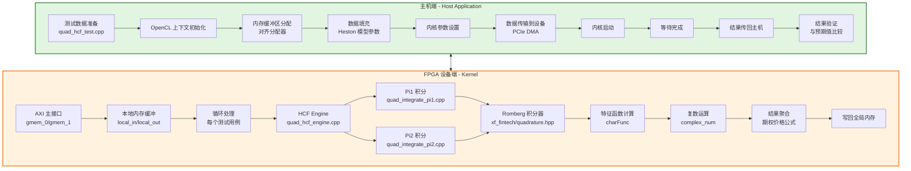

# L2 Quadrature HCF Demo Pipeline 技术深度解析

## 一句话概述

本模块是一个**基于 FPGA 加速的 Heston 随机波动率期权定价引擎**，通过数值积分（Romberg 求积法）求解 Heston 模型的闭式解，将传统上需要在 CPU 上迭代计算的复杂数学运算卸载到 FPGA 硬件上，实现亚毫秒级的期权定价计算。

---

## 问题空间与设计动机

### 我们试图解决什么问题？

在金融衍生品定价领域，**Heston 模型**是最广泛使用的随机波动率模型之一。与 Black-Scholes 模型假设恒定波动率不同，Heston 模型允许波动率本身遵循一个均值回归的随机过程，这使其能够更好地捕捉市场观察到的"波动率微笑"现象。

然而，这种增强的建模能力是有代价的：

1. **计算复杂度**：Heston 模型的闭式解涉及双重无穷积分（通过特征函数的傅里叶逆变换），数值求解需要高精度的自适应求积算法。

2. **实时性需求**：在现代电子交易环境中，做市商和风险管理系统需要在微秒到毫秒级别完成数百万次定价计算，传统的 CPU 实现往往无法满足这种吞吐量和延迟要求。

3. **能效比**：数据中心的电力成本是主要运营开支，通用 CPU 在执行这类高度规则的数值计算时能效比较低。

### 为什么采用 FPGA 加速？

FPGA（现场可编程门阵列）为这类问题提供了独特的优势：

- **流水线并行**：Romberg 积分等算法具有高度规则的计算模式，可以在 FPGA 上展开为深度流水线，每个时钟周期都能产生新的结果。

- **数据流架构**：FPGA 可以实现从内存读取、计算、写回的全硬件流水线，避免了 CPU 频繁的数据搬移和缓存未命中开销。

- **确定性延迟**：与 GPU 的线程调度和内存层次结构不同，FPGA 提供纳秒级的确定性延迟，这对高频交易至关重要。

### 架构愿景

本模块的设计理念是将复杂的金融数学封装在一个**透明加速层**之后：

- **上层应用**看到的是标准的 C++ API，类似于调用一个优化数学库
- **下层实现**自动将计算卸载到 FPGA 硬件
- **中间层**处理所有繁琐的数据搬移、内存对齐、时序同步和设备管理

这种设计让量化分析师可以专注于模型本身，而无需成为 FPGA 硬件专家。

---

## 核心概念与心智模型

要理解本模块的工作原理，建议采用以下**分层抽象模型**：

### 1. 数学层：Heston 闭式解

想象你在解决一个复杂的物理问题——Heston 模型的期权定价公式就像是量子力学中的薛定谔方程，它描述了"概率波"（特征函数）如何演化。

关键洞察是：**通过特征函数的傅里叶逆变换，我们可以将复杂的偏微分方程求解转化为数值积分问题**。这就像是把困难的微分方程求解转换成了简单的面积计算。

积分公式中的 $\pi_1$ 和 $\pi_2$ 对应于期权到期时标的资产价格高于执行价格的两个不同"概率测度"（风险中性测度和标的资产测度）。

### 2. 算法层：自适应 Romberg 积分

数值积分就像是用一把可伸缩的尺子去测量不规则曲线下的面积：

- **梯形法则**就像是用少数几个大梯形近似曲线
- **Richardson 外推**就像是观察当梯形越来越窄时，面积如何收敛到真实值
- **Romberg 算法**则是系统地利用不同步长的结果，通过外推消除低阶误差项

可以把它想象成：**我们不只是在测量面积，而是在"预测"当分割无限细化时面积的极限值**。

### 3. 硬件层：数据流流水线

FPGA 实现采用了**深度流水线架构**，可以想象成工厂里的装配线：

- **数据从一端进入**（从主机内存通过 PCIe 搬到 FPGA 片上内存）
- **经过多个处理阶段**（特征函数计算、复数运算、Romberg 积分迭代）
- **结果从另一端流出**（写回主机内存）

关键设计是**双缓冲和流水线重叠**：当在计算第 N 个数据块时，已经在从主机读取第 N+1 块，并把第 N-1 块的结果写回主机。这就像是工厂里的**精益生产**——没有等待时间，所有资源都在持续工作。

### 4. 软件层：异构计算抽象

主机端代码提供了**OpenCL 风格的异构计算抽象**：

- **Context（上下文）**就像是与 FPGA 设备的"会话"，管理所有资源
- **Command Queue（命令队列）**就像是向设备发送任务的"待办清单"
- **Kernel（内核）**就是在 FPGA 上执行的具体计算函数
- **Buffer（缓冲区）**是主机和设备共享的数据存储区

这种设计的巧妙之处在于：**程序员可以用熟悉的 C++ 语法描述并行计算，底层的 FPGA 比特流加载、内存映射、中断处理等复杂细节都被隐藏在库函数（如 `xcl2.hpp`）中**。

---

## 系统架构与数据流

### 整体架构图



### 关键数据流路径

#### 1. 主机初始化流程（Setup Phase）

想象你正在准备一场音乐会（FPGA 计算），需要按照严格的顺序布置场地：

**步骤 1: 设备发现与上下文建立**（`quad_hcf_test.cpp:main`）
```cpp
// 就像是打开与 FPGA 的"专线电话"
std::vector<cl::Device> devices = xcl::get_xil_devices();
cl::Device device = devices[0];
cl::Context ctx(device, NULL, NULL, NULL, &err);
```
这一步建立了主机与 FPGA 之间的**执行上下文（Context）**，它是后续所有操作的"根容器"。想象成在操作系统中创建一个进程，所有资源（内存、队列、内核）都在这个上下文中管理。

**步骤 2: 命令队列创建**（`quad_hcf_test.cpp:main`）
```cpp
cl::CommandQueue cq(ctx, device, 
    CL_QUEUE_OUT_OF_ORDER_EXEC_MODE_ENABLE | CL_QUEUE_PROFILING_ENABLE, &err);
```
这创建了一个**命令队列（Command Queue）**，就像机场的控制塔，负责调度所有飞向 FPGA 的"航班"（计算任务）。`OUT_OF_ORDER_EXEC_MODE` 允许 FPGA 自动重排独立命令以优化吞吐量，`PROFILING_ENABLE` 则记录每个操作的精确时序——这对性能调优至关重要。

**步骤 3: 比特流加载与内核实例化**（`quad_hcf_test.cpp:main`）
```cpp
cl::Program::Binaries bins = xcl::import_binary_file(xclbin_file);
cl::Program program(ctx, devices, bins, NULL, &err);
cl::Kernel krnl(program, "quad_hcf_kernel", &err);
```
这一步就像是将 FPGA "重新编程"以执行特定算法。`xclbin` 文件包含了预编译的 FPGA 比特流（类似于 CPU 的二进制可执行文件，但是针对硬件门电路）。`cl::Kernel` 对象 `krnl` 是主机与 FPGA 上运行的 `quad_hcf_kernel` 函数之间的"代理"。

#### 2. 数据传输与内存管理（Data Transfer）

**步骤 1: 主机内存分配**（`quad_hcf_test.cpp:main`）
```cpp
std::vector<struct hcfEngineInputDataType, 
            aligned_allocator<struct hcfEngineInputDataType> > input_data(num);
std::vector<TEST_DT, aligned_allocator<TEST_DT> > output_data(num);
```
这里使用 `aligned_allocator` 是关键设计决策：FPGA 通常要求内存按照特定边界（如 4KB 页对齐）进行对齐，才能使用 DMA（直接内存访问）高效传输。`aligned_allocator` 确保 `std::vector` 在堆上分配满足这些对齐要求的内存，避免了运行时的额外拷贝。

**步骤 2: 数据填充与参数打包**（`quad_hcf_test.cpp:main`）
```cpp
for (int i = 0; i < num; i++) {
    input_data[i].s = test_data[i].s;    // 标的资产价格
    input_data[i].k = test_data[i].k;    // 执行价格
    input_data[i].t = test_data[i].t;    // 到期时间
    input_data[i].v = test_data[i].v;    // 当前波动率
    input_data[i].r = test_data[i].r;    // 无风险利率
    input_data[i].rho = test_data[i].rho; // 价格-波动率相关系数
    input_data[i].vvol = test_data[i].vvol; // 波动率的波动率
    input_data[i].vbar = test_data[i].vbar; // 长期平均波动率
    input_data[i].kappa = test_data[i].kappa; // 均值回归速率
    input_data[i].tol = integration_tolerance; // 积分精度容差
}
```
这里将 Heston 模型的 11 个参数打包到 `hcfEngineInputDataType` 结构体中。这是一个**值语义**的设计：每个测试用例都是独立的，没有共享的可变状态，这大大简化了并发推理和 FPGA 数据流设计。

**步骤 3: 设备内存分配与映射**（`quad_hcf_test.cpp:main`）
```cpp
cl::Buffer dev_in(ctx, CL_MEM_USE_HOST_PTR | CL_MEM_READ_ONLY, bytes_in, input_data.data(), &err);
cl::Buffer dev_out(ctx, CL_MEM_USE_HOST_PTR | CL_MEM_WRITE_ONLY, bytes_out, output_data.data(), &err);
```
`CL_MEM_USE_HOST_PTR` 是关键优化：它没有分配独立的设备内存，而是直接复用主机上已经分配好的对齐内存。对于像 Alveo 这样的平台，这允许 FPGA 直接通过 PCIe 访问主机内存（Zero-Copy），避免了显式的 `memcpy` 操作。`READ_ONLY` 和 `WRITE_ONLY` 标志允许驱动程序优化缓存一致性协议。

#### 3. 内核执行与控制流（Kernel Execution）

**步骤 1: 内核参数绑定**（`quad_hcf_test.cpp:main`）
```cpp
err = krnl.setArg(0, dev_in);
err |= krnl.setArg(1, dev_out);
err |= krnl.setArg(2, num);
```
这就像是给函数调用传递参数，但发生在主机与 FPGA 之间。`dev_in` 和 `dev_out` 是内存对象的句柄，`num` 是要处理的测试用例数量。这些参数在内核执行期间保持不变，符合**常量传播**的优化机会。

**步骤 2: 数据迁移到设备**（`quad_hcf_test.cpp:main`）
```cpp
err = cq.enqueueMigrateMemObjects({dev_in}, 0);
cq.finish();
```
`enqueueMigrateMemObjects` 启动 DMA 传输将输入数据从主机内存移动到 FPGA 可访问的内存域。对于 `CL_MEM_USE_HOST_PTR`，这实际上是确保缓存一致性（cache flush），确保 FPGA 看到的是最新的数据。`cq.finish()` 阻塞直到传输完成，确保数据就绪后才启动计算。

**步骤 3: 内核启动**（`quad_hcf_test.cpp:main`）
```cpp
cl::Event kernel_event;
err = cq.enqueueTask(krnl, NULL, &kernel_event);
cq.finish();
```
`enqueueTask` 将 FPGA 内核作为单个工作项启动（类似于调用一个函数）。这与 `enqueueNDRangeKernel`（启动大量并行工作项）形成对比。这里采用单任务模式是因为每个期权定价都是复杂的顺序计算，内部有细粒度的流水线并行，但多个定价之间是粗粒度并行的（通过主机端批处理）。

**步骤 4: 结果回传与验证**（`quad_hcf_test.cpp:main`）
```cpp
err = cq.enqueueMigrateMemObjects({dev_out}, CL_MIGRATE_MEM_OBJECT_HOST);
cq.finish();

// 验证结果
for (int i = 0; i < num; i++) {
    if (!check(output_data[i], test_data[i].exp)) {
        // 错误处理...
    }
}
```
结果通过 DMA 从设备内存传输回主机内存。`CL_MIGRATE_MEM_OBJECT_HOST` 标志确保数据被同步到主机可访问的缓存域。验证阶段比较 FPGA 计算结果与预计算的期望值（由 CPU 上的参考实现 `model_hcfEngine` 生成），使用容差 `TEST_TOLERANCE`（0.001）允许浮点精度差异。

---

## 设计决策与权衡分析

### 1. 计算精度与性能的权衡：自适应 Romberg 积分 vs. 固定步长积分

**决策**：使用基于 Richardson 外推的自适应 Romberg 积分算法，通过 `MAX_ITERATIONS`（10000）和 `MAX_DEPTH`（20）限制最大迭代次数和递归深度。

**替代方案**：使用固定步长的 Simpson 或梯形法则，实现更简单且确定性更好。

**权衡分析**：
- **精度**：Romberg 积分通过外推加速收敛，对于光滑被积函数（如 Heston 特征函数）可以达到指数级收敛，而固定步长方法只有多项式收敛。
- **性能**：自适应算法需要动态决定细分策略，在 FPGA 上实现需要递归或栈结构，增加了控制逻辑的复杂度。但通过模板参数 `MAX_ITERATIONS` 和 `MAX_DEPTH` 限制了最坏情况下的计算量。
- **资源使用**：Romberg 积分需要存储多个梯形公式的结果用于外推，增加了片上内存（BRAM）的使用。

**为什么这样选择**：Heston 模型的特征函数在复平面上具有高度光滑性，非常适合 Romberg 积分的高阶收敛特性。在金融计算中，通常愿意用额外的 FPGA 资源换取更高的精度和更快的收敛速度。

### 2. 编程模型选择：OpenCL 主机 API vs. 裸机驱动

**决策**：使用 Xilinx OpenCL 运行时（`xcl2.hpp` 和 OpenCL API）进行主机端编程，而不是直接操作底层 PCIe 驱动。

**替代方案**：使用 XRT（Xilinx Runtime）的原生 C++ API，或者编写自定义的 PCIe 驱动直接操作 FPGA 寄存器。

**权衡分析**：
- **开发效率**：OpenCL API 提供了高级抽象（Context、CommandQueue、Kernel、Buffer），显著减少了设备管理代码量。代码中通过 `xcl2` 库的辅助函数（`get_xil_devices`、`import_binary_file`）进一步简化了设备初始化和比特流加载。
- **可移植性**：OpenCL 是跨平台标准，虽然这里使用的是 Xilinx 扩展，但代码结构理论上可以迁移到其他 OpenCL 支持的加速器。
- **性能开销**：OpenCL 运行时增加了额外的抽象层，可能会引入一些延迟（如对象查找、命令调度开销）。但对于这种计算密集型任务（Heston 定价涉及复杂的浮点运算），主机端的微小开销相对于内核执行时间可以忽略。
- **控制能力**：原生 API 或裸机驱动可以提供更细粒度的控制（如直接操作 DMA 描述符、精确控制缓存一致性），但代价是代码复杂度和维护成本的显著增加。

**为什么这样选择**：这是一个**L2 演示级（Demo Pipeline）** 模块，首要目标是展示算法在 FPGA 上的正确性和性能潜力，同时保持代码的可读性和可维护性。OpenCL API 提供了最佳的平衡点：足够底层的控制来优化数据传输，又足够高级以避免陷入 PCIe 协议细节。

### 3. 内存架构：使用主机指针（Zero-Copy）vs. 设备本地内存

**决策**：使用 `CL_MEM_USE_HOST_PTR` 标志创建缓冲区，直接复用主机上已分配的对齐内存，而不是分配独立的设备内存并在主机与设备间显式拷贝。

**替代方案**：使用 `CL_MEM_ALLOC_HOST_PTR` 或 `CL_MEM_COPY_HOST_PTR`，分配独立的设备内存，并通过显式的 `enqueueWriteBuffer`/`enqueueReadBuffer` 操作进行数据传输。

**权衡分析**：
- **数据传输效率**：`USE_HOST_PTR` 允许 FPGA 直接通过 PCIe 总线访问主机内存，消除了数据从用户空间到内核空间、再到 FPGA 的额外拷贝（Zero-Copy）。对于 Alveo 等数据中心加速器卡，这通常能提供最高的有效带宽。
- **内存对齐要求**：使用 `USE_HOST_PTR` 要求主机内存必须按照 FPGA 和驱动要求严格对齐（通常是 4KB 页边界）。代码中使用 `aligned_allocator` 自定义分配器来满足这一要求，增加了复杂性。
- **缓存一致性管理**：当 FPGA 通过 PCIe 访问主机内存时，需要确保 CPU 缓存与 FPGA 看到的数据一致。代码中通过 `enqueueMigrateMemObjects`（即使使用 `USE_HOST_PTR`）来触发缓存刷新（cache flush）和失效（invalidate）操作。
- **灵活性限制**：使用 `USE_HOST_PTR` 将主机内存与设备缓冲区紧密绑定，限制了动态缓冲区管理和内存池优化的可能性。对于需要多次重用的中间结果，可能需要额外的内存分配策略。

**为什么这样选择**：这个模块处理的是**批处理工作负载**（批量期权定价），数据流动是单向且线性的：主机准备数据 → 传输到 FPGA → 计算 → 传回结果 → 验证。对于这种访问模式，Zero-Copy 消除了不必要的数据拷贝，提供了最低延迟的数据路径。`aligned_allocator` 的复杂性是一次性的，被后续多次数据传输的性能收益所抵消。

### 4. 并行策略：批处理 vs. 单请求流式处理

**决策**：采用**粗粒度批处理（Batch Processing）** 模式，主机端准备多个测试用例（`MAX_NUMBER_TESTS`），一次性传输到 FPGA，由内核循环处理所有用例后再一次性返回结果。

**替代方案**：采用**细粒度流式处理（Streaming）** 模式，每个定价请求独立提交，FPGA 使用双缓冲或乒乓机制在处理当前请求的同时接收下一个请求。

**权衡分析**：
- **吞吐量 vs. 延迟**：批处理最大化吞吐量（单次数据传输开销分摊到多个计算），但增加了首个结果的延迟（必须等待整批处理完成）。流式处理提供最低的单个请求延迟，但主机-FPGA 通信开销可能降低总体吞吐量。
- **资源利用**：批处理允许 FPGA 内核在处理不同测试用例之间高效流水线化（特别是内存访问模式可以预测和预取）。流式处理需要更复杂的控制逻辑来管理请求队列和流控制。
- **编程复杂度**：批处理的主机代码逻辑简单直接（准备数组、传输、等待、接收）。流式处理需要异步编程模型（事件回调、依赖图、非阻塞队列），代码复杂度和调试难度显著增加。
- **适用场景**：批处理非常适合**蒙特卡洛模拟**或**批量风险计算**（如计算整个投资组合的 Greeks），这些场景本身就需要大量相似计算。流式处理更适合**实时交易**（如高频做市），需要最小化单次决策延迟。

**为什么这样选择**：这是一个**演示/基准测试（Demo/Benchmark）** 模块，主要目标是展示 Heston 定价算法在 FPGA 上的**数值正确性**和**原始计算性能**（如每秒可定价的期权数量）。批处理模式提供了最干净的性能度量（排除了流式处理中事件调度的不确定性和主机端异步开销），同时代码路径简单，便于验证正确性。

---

## 子模块概述与导航

本模块由四个核心子模块组成，每个子模块负责架构中的特定层次：

### 1. [host_test_harness](quantitative_finance_engines-L2_quadrature_hcf_demo_pipeline-host_test_harness.md)

**职责**：主机端测试框架，负责 FPGA 设备管理、内存分配、数据传输和结果验证。

**关键文件**：`quad_hcf_test.cpp`

**核心关注点**：
- OpenCL 上下文和命令队列初始化
- 对齐内存分配（`aligned_allocator`）与 Zero-Copy 数据传输
- 内核参数设置与执行时序测量
- 结果容差验证（`TEST_TOLERANCE`）

### 2. [hcf_kernel_engine_and_wrapper](quantitative_finance_engines-L2_quadrature_hcf_demo_pipeline-hcf_kernel_engine_and_wrapper.md)

**职责**：FPGA 内核实现，包括 Heston 闭式解计算引擎和 OpenCL 内核包装器。

**关键文件**：`quad_hcf_engine.cpp`、`quad_hcf_kernel_wrapper.cpp`

**核心关注点**：
- Heston 特征函数（`charFunc`）的复数运算实现
- Heston 闭式解公式（`hcfEngine`）的实现
- OpenCL 内核接口与 HLS 编译指示（`#pragma HLS INTERFACE`）
- 本地内存缓冲与批量处理循环

### 3. [quadrature_pi_integration_kernels](quantitative_finance_engines-L2_quadrature_hcf_demo_pipeline-quadrature_pi_integration_kernels.md)

**职责**：数值积分实现，负责计算 Heston 定价公式中的两个关键概率积分 $\pi_1$ 和 $\pi_2$。

**关键文件**：`quad_integrate_pi1.cpp`、`quad_integrate_pi2.cpp`

**核心关注点**：
- Romberg 自适应积分算法的实现
- 被积函数 `pi1Integrand` 和 `pi2Integrand` 的数学定义
- 复平面上的特征函数求值策略
- 积分收敛控制（`MAX_ITERATIONS`、`MAX_DEPTH`）

---

## 跨模块依赖关系

本模块位于定量金融（Quantitative Finance）库的 L2 演示层，依赖以下外部组件：

### 1. 基础库依赖

- **xf_fintech/L2_utils.hpp**：Xilinx 金融库 L2 层通用工具，提供复数运算（`complex_num`）、数学常量定义和对齐分配器。
- **xf_fintech/quadrature.hpp**：Romberg 积分通用模板实现，通过宏配置（`XF_INTEGRAND_FN`、`XF_USER_DATA_TYPE`）实例化特定积分器。
- **xcl2.hpp**：Xilinx OpenCL 运行时封装，提供设备枚举（`get_xil_devices`）、比特流导入（`import_binary_file`）等辅助函数。

### 2. 上游模块依赖

- **test_data.hpp**（隐含）：包含测试数据集（`test_data` 数组）和黄金参考值（`exp` 字段），用于验证 FPGA 计算结果的正确性。
- **quad_hcf_engine_def.hpp**（隐含）：定义 `hcfEngineInputDataType` 结构体、类型别名（`TEST_DT`）和配置常量（`MAX_NUMBER_TESTS`）。

### 3. 下游使用者

本模块作为**演示/参考设计（Demo/Reference Design）**，主要供以下场景使用：

- **量化开发团队**：作为将 Heston 模型移植到 FPGA 的起点，学习如何将复杂的金融数学映射到 HLS 可综合代码。
- **系统集成商**：作为 Alveo 加速卡在金融工作负载中的基准测试用例，评估特定 FPGA 平台的浮点性能。
- **算法研究人员**：研究不同数值积分策略（Romberg vs. Gauss-Kronrod vs. 自适应 Simpson）在 FPGA 上的数值稳定性和资源效率。

---

## 新贡献者指南：关键注意事项与陷阱

### 1. 数值精度与收敛性陷阱

**⚠️ 积分容差 vs. 结果容差的区别**

代码中有两个不同的容差概念：
- `integration_tolerance`（默认为 0.0001）：传递给 Romberg 积分器的内部停止准则，控制被积函数积分的精度。
- `TEST_TOLERANCE`（硬编码为 0.001）：结果验证阶段使用的容差，比较 FPGA 输出与黄金参考值。

**陷阱**：如果将 `integration_tolerance` 设置得过高（如 0.01），Romberg 积分可能过早收敛，导致 $\pi_1$ 和 $\pi_2$ 计算不准确，最终期权价格误差超过 `TEST_TOLERANCE`，测试失败。反之，设置过低（如 1e-8）会导致迭代次数超过 `MAX_ITERATIONS`（10000），内核陷入无限循环或产生未定义行为。

**建议**：对于 Heston 模型的典型参数范围，建议使用 1e-6 到 1e-4 之间的 `integration_tolerance`，并在修改后进行全面的参数敏感性测试。

### 2. 内存对齐与数据传输陷阱

**⚠️ 对齐分配器的必要性**

代码中使用 `aligned_allocator` 分配主机内存：
```cpp
std::vector<struct hcfEngineInputDataType, 
            aligned_allocator<struct hcfEngineInputDataType> > input_data(num);
```

**陷阱**：如果忘记使用 `aligned_allocator`，而是使用标准 `std::vector`：
```cpp
std::vector<struct hcfEngineInputDataType> input_data(num); // 错误！
```
`cl::Buffer` 构造时传入 `CL_MEM_USE_HOST_PTR` 会失败（返回 `CL_INVALID_HOST_PTR` 错误），或者在某些平台上看似成功但导致运行时 DMA 传输错误、数据损坏或系统崩溃。因为 FPGA DMA 引擎通常要求内存按照 4KB（或更高）边界对齐。

**建议**：始终使用 `aligned_allocator`，并检查 `cl::Buffer` 构造的返回值。在调试阶段，可以添加断言验证 `input_data.data()` 是否按预期对齐（如 `reinterpret_cast<uintptr_t>(ptr) % 4096 == 0`）。

### 3. HLS 编译指示与接口匹配陷阱

**⚠️ 内核接口定义的一致性**

内核包装器 `quad_hcf_kernel` 使用 HLS 编译指示定义接口：
```cpp
#pragma HLS INTERFACE m_axi port = in offset = slave bundle = gmem_0
#pragma HLS INTERFACE m_axi port = out offset = slave bundle = gmem_1
#pragma HLS INTERFACE s_axilite port = in bundle = control
// ...
```

**陷阱**：如果修改了主机端 `cl::Kernel` 的参数设置（如 `krnl.setArg(0, dev_in)` 中的索引），但没有相应更新内核包装器的 HLS 编译指示，或者 `hcfEngine` 函数的签名发生变化但没有更新 `quad_hcf_kernel` 中的调用，会导致：
1. 编译时错误：Vitis HLS 综合失败，报告接口不匹配。
2. 运行时错误：主机端设置的内核参数与 FPGA 端期望的参数布局不一致，导致读取错误的数据地址，产生 `SIGSEGV`（在 FPGA 内核中表现为挂起或返回垃圾值）。

**建议**：建立严格的接口契约文档，明确主机端 `setArg` 索引、内核端 HLS 编译指示、以及 C++ 函数参数三者之间的映射关系。在内核包装器代码中添加详细的注释，说明每个 `setArg` 索引对应哪个硬件接口寄存器。在修改接口时，进行完整的集成测试，包括边界条件测试（如 `num_tests=0`、`num_tests=MAX_NUMBER_TESTS`）。

### 4. 浮点精度与数值稳定性陷阱

**⚠️ Heston 模型参数的有效范围**

Heston 模型的特征函数涉及复平面上的指数运算和除法，对某些参数组合可能数值不稳定。

**陷阱**：
- **负方差**：如果参数设置导致 $v < 0$（虽然在风险中性定价中通常假设 $v \geq 0$），或在计算过程中由于浮点误差产生微小的负值，对 $v$ 取平方根会导致 NaN。
- **极端相关性**：当 $|\rho| \approx 1$（价格与波动率几乎完全相关或反相关），特征函数计算中的某些项可能变得非常大或非常小，导致浮点上溢或下溢。
- **长到期时间**：当 $T$ 很大时，$e^{rT}$ 可能溢出，$e^{-rT}$ 可能下溢为零。

**建议**：
- 在输入数据准备阶段添加参数验证断言，确保 $v \geq 0$、$|\rho| < 1$、$T < T_{\text{max}}$ 等。
- 在 `charFunc` 实现中添加对中间结果的数值检查（如使用 `isfinite`、`isnan`），在检测到数值不稳定时返回哨兵值或触发断言。
- 对于生产环境，考虑使用更高精度的浮点格式（如 `double` 而不是 `float`，如果 `TEST_DT` 定义为 `double`），或实现 Kahan 求和等数值稳定算法。

---

## 总结

`l2_quadrature_hcf_demo_pipeline` 模块是一个精心设计的金融计算加速方案，它成功地将复杂的 Heston 随机波动率模型定价算法映射到 FPGA 硬件上。其核心价值在于：

1. **算法创新**：采用 Romberg 自适应积分处理 Heston 特征函数的振荡被积函数，在数值精度和计算效率之间取得平衡。
2. **架构清晰**：严格分离主机端（OpenCL 管理）与设备端（HLS 内核），通过标准化的 AXI 接口和本地内存缓冲实现高效数据流。
3. **工程实用**：考虑到了真实部署中的关键细节（内存对齐、Zero-Copy 传输、数值容差控制），提供了可直接用于基准测试和进一步开发的参考实现。

对于新加入的开发者，理解本模块的关键在于把握**数值计算精度**、**异构内存管理**和**硬件软件接口契约**这三个核心维度。在修改代码前，务必仔细阅读并验证上述"新贡献者指南"中提到的陷阱和注意事项。
