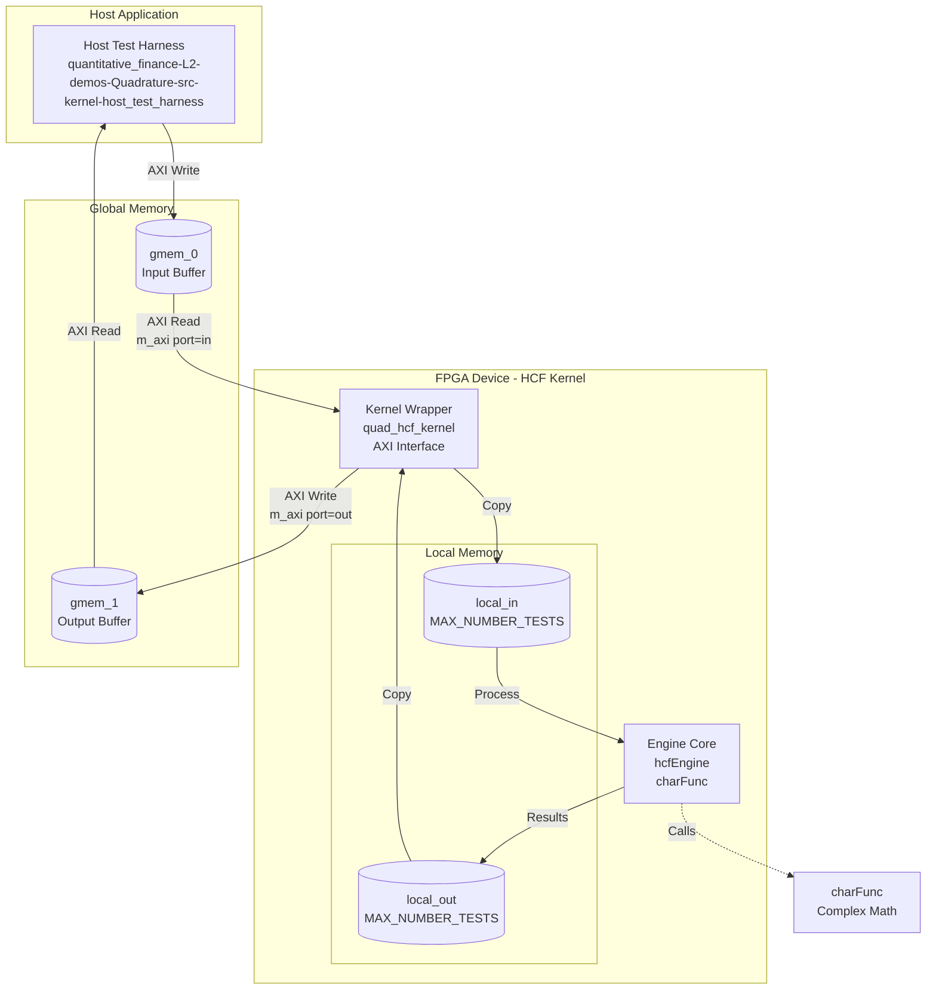
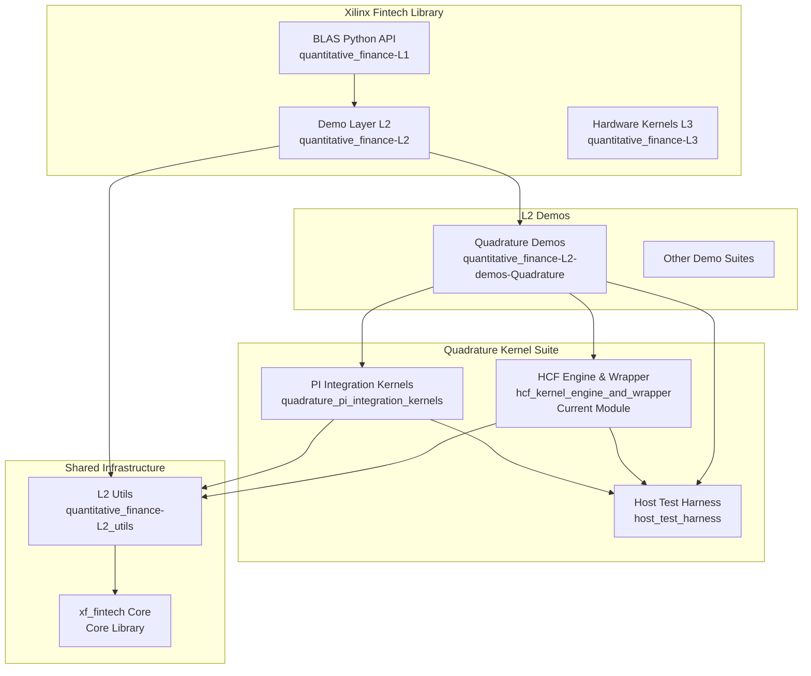

# HCF Kernel Engine and Wrapper (Heston Closed-Form Kernel)

## Executive Summary

This module implements a **hardware-accelerated pricing engine for the Heston stochastic volatility model**, delivering closed-form solutions for European option pricing on FPGA. Think of it as a specialized mathematical coprocessor that transforms the complex integral calculations required for Heston pricing into deterministic, single-pass hardware computations.

Unlike Monte Carlo methods that require thousands of iterative path simulations to converge, this engine computes precise option prices through characteristic function evaluation—delivering deterministic results in constant time regardless of market conditions.

---

## 1. The Problem Space: Why This Module Exists

### The Heston Model Challenge

The Heston stochastic volatility model is a cornerstone of quantitative finance because it captures a critical market reality: volatility is not constant—it clusters, mean-reverts, and correlates with asset returns. The model is defined by the coupled stochastic differential equations:

$$
dS_t = rS_t dt + \sqrt{v_t} S_t dW_t^1 \\
dv_t = \kappa(\bar{v} - v_t) dt + \sigma_v \sqrt{v_t} dW_t^2
$$

Where the correlation $dW_t^1 \cdot dW_t^2 = \rho$ creates the "leverage effect" observed in real markets.

### The Computational Bottleneck

Pricing European options under Heston requires evaluating the probability that the option expires in-the-money. This reduces to computing integrals of the **characteristic function**—a complex-valued function that encodes the entire probability distribution of the asset price.

The characteristic function for Heston is:

$$
\phi(u) = \exp\left(C(u) + D(u)v_0 + iu\ln(S_0e^{rT})\right)
$$

Where $C(u)$ and $D(u)$ involve complex logarithms, square roots, and hyperbolic functions. Computing this requires:
- Complex number arithmetic (addition, multiplication, division, exponentiation, logarithms)
- Careful handling of branch cuts in complex functions
- Numerical integration over the characteristic function

### Why Hardware Acceleration Matters

In production trading environments, risk calculations may require pricing thousands of options across different strikes, maturities, and model parameters. Monte Carlo methods require $O(10^4-10^6)$ simulations per price, making them too slow for real-time risk.

The closed-form approach reduces this to a deterministic computation with fixed complexity—ideal for FPGA implementation where deterministic timing and parallel execution can deliver microsecond-level pricing latency.

---

## 2. Mental Model: How to Think About This Module

### The "Mathematical Coprocessor" Analogy

Imagine this module as a specialized calculator chip designed specifically for Heston option pricing. Like a GPU accelerates graphics by having dedicated hardware for matrix operations, this module accelerates quantitative finance by having dedicated hardware for characteristic function evaluation.

**Key analogy mappings:**
- **The Engine (`hcfEngine`)** = The arithmetic logic unit (ALU) that executes the actual mathematical formulas
- **The Wrapper (`quad_hcf_kernel`)** = The memory controller and bus interface that fetches data from main memory and returns results
- **Input Parameters** = The option contract details and market data (strike, spot, volatility, etc.)
- **Characteristic Function** = The "probability DNA" of the stock price distribution

### The "Two-Layer Architecture" Pattern

This module follows a strict separation of concerns between **mathematics** and **infrastructure**:

```
┌─────────────────────────────────────────┐
│  Layer 2: Kernel Wrapper (Infrastructure)│
│  - Memory management (global ↔ local)   │
│  - HLS interface pragmas                │
│  - Batch processing loop                │
│  - AXI bus protocol handling            │
└─────────────────────────────────────────┘
                  │ calls
                  ▼
┌─────────────────────────────────────────┐
│  Layer 1: HCF Engine (Mathematics)      │
│  - Characteristic function evaluation   │
│  - Complex number arithmetic            │
│  - Numerical integration                │
│  - Heston model closed-form solution    │
└─────────────────────────────────────────┘
```

**Why this separation matters:**
1. **Math portability**: The engine could be compiled for CPU, GPU, or FPGA without changes
2. **Hardware optimization**: The wrapper isolates HLS-specific pragmas and memory architectures
3. **Testing**: Mathematical correctness can be validated independently of hardware integration

### The "Batch Pipeline" Data Flow Model

Think of data flowing through this module like an assembly line in a factory:

1. **Loading Station** (Host → Global Memory): Raw materials (option parameters) arrive via truck and are stored in the warehouse (HBM/DDR)
2. **Conveyor Belt** (Global → Local Memory): The wrapper forklift moves materials from warehouse to assembly stations (local BRAM/URAM)
3. **Processing Stations** (Engine Execution): Each station performs characteristic function calculations on its assigned workpiece
4. **Packaging** (Local → Global Memory): Finished products (option prices) are moved back to the warehouse
5. **Shipping** (Global Memory → Host): Trucks take the finished goods back to customers

This batch processing model maximizes throughput by keeping the FPGA's computation units fed with data while hiding memory latency.

---

## 3. Architecture and Data Flow

### System Context Diagram

The HCF Kernel Engine and Wrapper operates within the broader [Quadrature Demo Pipeline](quantitative_finance-L2-demos-Quadrature-src-kernel-quadrature_pi_integration_kernels.md) in the [L2 Quadrature Demos](quantitative_finance-L2-demos-Quadrature.md) module, which is part of the [Quantitative Finance L2 Demo Layer](quantitative_finance-L2.md). It receives input from the [Host Test Harness](quantitative_finance-L2-demos-Quadrature-src-kernel-host_test_harness.md).



### Component Architecture

#### Layer 1: HCF Engine (Mathematical Core)

The [hcf_engine](quantitative_finance-L2-demos-Quadrature-src-kernel-hcf_kernel_engine_and_wrapper-hcf_engine.md) sub-module implements the Heston Closed-Form solution mathematics. It operates entirely on local data structures and performs no memory management—it's a pure computation unit.

**Key Components:**
- **`hcfEngineInputDataType`**: Input structure containing Heston model parameters (spot price `s`, strike `k`, volatility `v`, mean reversion `kappa`, etc.)
- **`charFunc()`**: The characteristic function evaluator—computes the complex-valued characteristic function $\phi(u)$ using Heston's closed-form formulas. This involves complex arithmetic: addition, multiplication, division, square roots, exponentials, and logarithms.
- **`hcfEngine()`**: The main pricing engine—computes $\pi_1$ and $\pi_2$ probabilities by numerically integrating the characteristic function, then combines them into the final call option price using the Heston pricing formula: $C = S_0 \pi_1 - Ke^{-rT} \pi_2$

**Data Flow within Engine:**
1. Input parameters unpacked from `hcfEngineInputDataType`
2. `charFunc()` called with complex frequency parameter $w$ (twice—once for $\pi_1$ calculation, once for $\pi_2$)
3. Complex arithmetic operations performed (20+ operations per call)
4. Results integrated using `internal::integrateForPi1/Pi2()` (Gauss-Legendre quadrature)
5. Final option price calculated and returned

#### Layer 2: Kernel Wrapper (Hardware Interface)

The [hcf_kernel_wrapper](quantitative_finance-L2-demos-Quadrature-src-kernel-hcf_kernel_engine_and_wrapper-hcf_kernel_wrapper.md) sub-module is the HLS-generated FPGA kernel interface. It bridges between the AXI memory-mapped interfaces of the FPGA and the local memory model expected by the HCF Engine.

**Key Components:**
- **`quad_hcf_kernel()`**: The top-level kernel function with HLS pragmas defining hardware interfaces

**Hardware Interface Specification:**
- **AXI Master Interfaces (m_axi)**: Two global memory ports
  - `gmem_0`: Input buffer (read-only from kernel perspective)
  - `gmem_1`: Output buffer (write-only from kernel perspective)
  - Both use "slave" offset mode (host provides absolute addresses)
- **AXI-Lite Interface (s_axilite)**: Control register interface for scalar arguments
  - `in`, `out`, `num_tests`: Scalar arguments passed via control registers
  - `return`: Return code register

**Data Movement Strategy:**
1. **Global → Local (Input)**: 
   - `hcfEngineInputDataType local_in[MAX_NUMBER_TESTS]` declared in BRAM/URAM
   - Loop copies `num_tests` entries from global memory `in` to local memory `local_in`
   - This coalesces scattered global memory reads into efficient burst transfers

2. **Computation**:
   - Loop calls `xf::fintech::hcfEngine(&local_in[i])` for each test case
   - Results stored in `TEST_DT local_out[MAX_NUMBER_TESTS]`

3. **Local → Global (Output)**:
   - Loop copies `local_out` to global memory `out`
   - Coalesces writes into burst transfers

**HLS Pragma Significance:**
```cpp
#pragma HLS DATA_PACK variable = in
```
This pragma packs the struct fields into a contiguous bitstream, ensuring that when the struct is read from global memory, it comes in as a single wide bus transaction rather than multiple scattered reads. This is critical for achieving the memory bandwidth required for high-throughput option pricing.

---

## 4. Key Design Decisions and Tradeoffs

### 4.1 Closed-Form vs. Monte Carlo

**Decision**: Implement the Heston closed-form solution rather than Monte Carlo simulation.

**Tradeoff Analysis**:
- **Monte Carlo Pros**: Handles path-dependent derivatives, easier to implement, extends to other models
- **Monte Carlo Cons**: Requires $O(10^4-10^6)$ simulations for convergence, non-deterministic results, sensitive to random number quality
- **Closed-Form Pros**: Deterministic, constant-time computation, single-pass evaluation, numerically stable
- **Closed-Form Cons**: Limited to European options, mathematically complex to implement correctly, requires careful handling of complex branch cuts

**Why This Fits**: The target use case is risk management and pricing of European vanilla options where deterministic, low-latency results are essential. The closed-form approach turns option pricing from a statistical sampling problem into a deterministic mathematical function—ideal for FPGA acceleration where predictable timing is crucial.

### 4.2 Complex Number Implementation

**Decision**: Use a custom `complex_num<TEST_DT>` struct rather than `std::complex`.

**Tradeoff Analysis**:
- **std::complex Pros**: Standard-compliant, optimized implementations, extensive testing
- **std::complex Cons**: HLS toolchain compatibility issues, potential dynamic memory usage, unclear hardware cost of edge cases (NaN, Inf handling)
- **Custom struct Pros**: Full control over bit-accurate behavior, explicit HLS pragmas for packing, deterministic hardware generation, no hidden exception handling
- **Custom struct Cons**: Must implement all operations manually, risk of subtle numerical bugs, maintenance overhead

**Why This Fits**: HLS synthesis requires bit-accurate, deterministic behavior. Standard library containers often hide control flow and exception handling that complicates hardware generation. The custom implementation allows explicit data packing (`DATA_PACK`) and ensures that every complex operation maps to predictable hardware resources (DSP slices for multiplications, BRAM for lookup tables).

### 4.3 Memory Hierarchy (Global vs. Local)

**Decision**: Explicit copy from global memory (HBM/DDR) to local memory (BRAM/URAM) before processing.

**Tradeoff Analysis**:
- **Direct Global Access Pros**: Simpler code, lower latency for single elements, no buffer size limitations
- **Direct Global Access Cons**: Inefficient scattered reads, cannot burst-transfer, limited by global memory bandwidth, high access latency
- **Local Buffering Pros**: Burst transfers amortize memory latency, coalesced access patterns, compute can overlap with next fetch, deterministic timing
- **Local Buffering Cons**: Limited by BRAM/URAM capacity (`MAX_NUMBER_TESTS` bound), extra copy latency, more complex control logic

**Why This Fits**: FPGAs excel at streaming dataflow architectures. By buffering inputs locally, the design creates a "compute island" where the HCF Engine can operate at maximum throughput without being bottlenecked by global memory latency. The burst transfer at the start amortizes the setup cost, and the processing loop can be fully pipelined (II=1) because all data is local.

### 4.4 Integration vs. Separation of Concerns

**Decision**: Strict separation between the mathematical engine (`hcfEngine`) and the hardware wrapper (`quad_hcf_kernel`).

**Tradeoff Analysis**:
- **Monolithic Kernel Pros**: Fewer function calls, potential for cross-module optimizations, simpler build
- **Monolithic Kernel Cons**: Math logic polluted with HLS pragmas, cannot test math without synthesis, hardware changes force math re-validation
- **Separation Pros**: Math code is pure C++ (testable on CPU), HLS pragmas isolated to wrapper, clear interface contract (`hcfEngineInputDataType`), enables unit testing
- **Separation Cons**: Function call overhead (inlined anyway with HLS), potential for interface mismatch, two files to maintain

**Why This Fits**: Quantitative finance requires extreme confidence in mathematical correctness. By isolating the Heston closed-form implementation in a pure C++ function, it can be validated against reference implementations (e.g., QuantLib) on the CPU before any hardware synthesis. The wrapper then becomes a simple "adapter pattern" that handles memory movement and interface protocols without touching the math.

---

## 5. Critical Implementation Details and Gotchas

### 5.1 HLS Pragma Load-Bearing Semantics

The pragmas in `quad_hcf_kernel` are not advisory hints—they are hardware interface specifications. Changing them changes the physical interface of the FPGA kernel:

```cpp
#pragma HLS INTERFACE m_axi port = in offset = slave bundle = gmem_0
```

**Critical implications:**
- `m_axi`: This creates a memory-mapped AXI master interface. The kernel initiates read/write transactions to host memory.
- `offset = slave`: The address provided by the kernel is added to a base address specified by the host. This allows the host to place buffers anywhere in its address space.
- `bundle = gmem_0`: Groups this interface into a logical port named "gmem_0". All interfaces in the same bundle share physical resources and arbitration logic.

**Gotcha:** Changing `bundle` assignments changes which physical memory bank (HBM channel) the kernel uses. This affects memory bandwidth and placement constraints. Changing `offset` to `direct` would require the kernel to know absolute physical addresses, which is a security and portability hazard.

### 5.2 DATA_PACK Struct Alignment Requirements

```cpp
#pragma HLS DATA_PACK variable = in
```

This pragma packs the struct fields into a bit-aligned vector. For `hcfEngineInputDataType`, which contains multiple `TEST_DT` (likely double or float) fields, this ensures that the entire struct is read as a single wide bus transaction rather than multiple scattered loads.

**Gotcha:** The struct layout in memory must match exactly between host code and kernel code. If the host compiler pads the struct differently than HLS packs it, you get silent data corruption. The `DATA_PACK` pragma also disables any automatic padding—fields are laid out exactly as declared. Changing field order changes the bit layout and breaks host-kernel compatibility.

### 5.3 MAX_NUMBER_TESTS Resource Bounds

```cpp
struct hcfEngineInputDataType local_in[MAX_NUMBER_TESTS];
TEST_DT local_out[MAX_NUMBER_TESTS];
```

These local arrays are sized by `MAX_NUMBER_TESTS`, a compile-time constant defined in `quad_hcf_engine_def.hpp`. These arrays consume BRAM or URAM resources on the FPGA.

**Gotcha:**
- **Resource exhaustion**: Increasing `MAX_NUMBER_TESTS` directly increases BRAM usage. If set too high, the design fails placement. Each `hcfEngineInputDataType` likely contains 8-10 doubles (64 bytes+), so `MAX_NUMBER_TESTS=1024` consumes ~64KB+ of BRAM.
- **II violation**: The loops copying data between global and local memory must achieve Initiation Interval (II) of 1 for maximum throughput. If `hcfEngineInputDataType` is too large or complex, HLS cannot pipeline the copy loop at II=1, reducing throughput.
- **Silent truncation**: If `num_tests` (runtime) > `MAX_NUMBER_TESTS` (compile-time), the loops will process up to `num_tests`, causing buffer overflows and memory corruption. There is no bounds checking in the wrapper.

### 5.4 Complex Number Numerical Stability

The `charFunc()` function implements the Heston characteristic function using a custom complex number implementation. The characteristic function involves operations like:

```cpp
struct complex_num<TEST_DT> h = cn_sqrt(cn_sub(cn_mul(beta, beta), (cn_scalar_mul(alpha, gamma*(TEST_DT)4))));
```

This computes $h = \sqrt{\beta^2 - 4\alpha\gamma}$ in complex arithmetic.

**Gotcha:**
- **Branch cut discontinuities**: Complex square roots and logarithms have branch cuts. The Heston characteristic function is notorious for numerical instabilities when the complex logarithm crosses its branch cut. The implementation must carefully handle the "counting jumps" problem in the complex plane.
- **Overflow/underflow**: Terms like `cn_exp(cn_scalar_mul(h, -in->t))` can overflow if $h$ has large real parts. The Heston model parameters ($\kappa$, $\sigma_v$, etc.) must be validated before reaching the kernel.
- **Precision sensitivity**: The difference between $\pi_1$ and $\pi_2$ in the final price calculation $C = S_0\pi_1 - Ke^{-rT}\pi_2$ can suffer catastrophic cancellation for deep out-of-the-money options. Double precision (`double`) is likely required; single precision (`float`) may produce inaccurate prices for certain parameter combinations.

### 5.5 Namespace and Linkage Contracts

The engine code is wrapped in namespaces:

```cpp
namespace xf {
namespace fintech {
namespace internal {
    // charFunc here
}
TEST_DT hcfEngine(...) { ... }
} // namespace fintech
} // namespace xf
```

The kernel wrapper is declared `extern "C"`:

```cpp
extern "C" {
void quad_hcf_kernel(...) { ... }
}
```

**Gotcha:**
- **Name mangling**: The `extern "C"` wrapper prevents C++ name mangling for the kernel entry point. This is essential because the FPGA runtime (XRT or Vitis) looks for the exact symbol name `quad_hcf_kernel` to launch the kernel. Without `extern "C"`, the compiled kernel would export a mangled name like `_Z17quad_hcf_kernel...` and the host would fail to find it.
- **Namespace isolation**: The `xf::fintech::internal` namespace hides implementation details. The `charFunc()` function is an implementation detail; only `hcfEngine()` is the public API. This prevents direct calls to internal functions that might change between versions.
- **Linkage boundaries**: The kernel wrapper calls `xf::fintech::hcfEngine()`, crossing from C linkage (kernel) to C++ linkage (engine). This works because the engine declares `hcfEngine` in the `xf::fintech` namespace without `static` or `inline`, giving it external linkage.

---

## 6. Usage Patterns and Integration

### Typical Call Sequence

```cpp
// Host code (in host_test_harness)

// 1. Allocate buffers in global memory
auto input_buffer = xrt::bo(device, sizeof(hcfEngineInputDataType) * num_tests, kernel.group_id(0));
auto output_buffer = xrt::bo(device, sizeof(TEST_DT) * num_tests, kernel.group_id(1));

// 2. Populate input data
auto input_data = input_buffer.map<hcfEngineInputDataType*>();
for (int i = 0; i < num_tests; i++) {
    input_data[i].s = spot_prices[i];
    input_data[i].k = strikes[i];
    input_data[i].v = initial_variance[i];
    input_data[i].vvol = vol_of_vol[i];
    input_data[i].kappa = mean_reversion[i];
    input_data[i].vbar = long_term_variance[i];
    input_data[i].rho = correlation[i];
    input_data[i].t = time_to_maturity[i];
    input_data[i].r = risk_free_rate[i];
}
input_buffer.sync(XCL_BO_SYNC_BO_TO_DEVICE);

// 3. Launch kernel
auto run = kernel(input_buffer, output_buffer, num_tests);
run.wait();

// 4. Read results
output_buffer.sync(XCL_BO_SYNC_BO_FROM_DEVICE);
auto output_data = output_buffer.map<TEST_DT*>();
for (int i = 0; i < num_tests; i++) {
    std::cout << "Option " << i << " price: " << output_data[i] << std::endl;
}
```

### Configuration and Parameters

The module behavior is controlled by compile-time definitions (likely in `quad_hcf_engine_def.hpp`):

| Parameter | Description | Impact |
|-----------|-------------|----------|
| `TEST_DT` | Data type for calculations (typically `double` or `float`) | Precision vs. resource usage. `double` provides ~15 decimal digits; `float` provides ~7 but uses half the DSP resources. |
| `MAX_NUMBER_TESTS` | Maximum batch size for a single kernel invocation | Directly determines BRAM/URAM usage for `local_in` and `local_out`. Must be balanced against available on-chip memory. |
| Integration limits | Parameters for `integrateForPi1/Pi2` | Determines quadrature rule accuracy. Higher values increase precision but increase computation time. |

### Extension Points

**Adding Support for Put Options:**
The current implementation calculates call option prices using put-call parity. To support puts directly, modify the `hcfEngine` function:

```cpp
TEST_DT hcfEngine(struct hcfEngineInputDataType* input_data, bool is_call) {
    TEST_DT pi1 = 0.5 + ((1 / PI) * internal::integrateForPi1(input_data));
    TEST_DT pi2 = 0.5 + ((1 / PI) * internal::integrateForPi2(input_data));
    
    if (is_call) {
        return (input_data->s * pi1) - (internal::EXP(-(input_data->r * input_data->t)) * input_data->k * pi2);
    } else {
        return (internal::EXP(-(input_data->r * input_data->t)) * input_data->k * (1 - pi2)) - (input_data->s * (1 - pi1));
    }
}
```

**Supporting American Options:**
American options require early exercise boundary optimization (typically via Longstaff-Schwartz least squares Monte Carlo or binomial trees). The closed-form Heston engine is not suitable for American options without significant algorithmic changes.

**Calibrating Model Parameters:**
The kernel assumes calibrated Heston parameters are provided. To add calibration within the FPGA (inverse problem optimization), you would need to wrap the kernel in an optimization loop (e.g., Levenberg-Marquardt) running on the host or implement a specialized inverse solver on the FPGA.

---

## 7. Cross-Module Dependencies

### Upstream Dependencies (Modules This Depends On)

| Module | Dependency Type | Description |
|--------|-----------------|-------------|
| [L2 Utils](quantitative_finance-L2_utils.md) | Header-only utilities | Provides `xf_fintech/L2_utils.hpp` which likely contains common math utilities, complex number operations (`cn_add`, `cn_mul`, etc.), and integration routines (`integrateForPi1/Pi2`). |
| [Host Test Harness](quantitative_finance-L2-demos-Quadrature-src-kernel-host_test_harness.md) | Runtime driver | The host application that allocates buffers, populates input data, launches the kernel, and retrieves results. This kernel is useless without a compatible host driver. |
| [Quadrature PI Integration Kernels](quantitative_finance-L2-demos-Quadrature-src-kernel-quadrature_pi_integration_kernels.md) | Sibling kernels | Related kernels in the same demo suite. May share host infrastructure, build configurations, or benchmarking harnesses. |

### Downstream Dependencies (Modules That Depend on This)

| Module | Dependency Type | Description |
|--------|-----------------|-------------|
| [L2 Quadrature Demos](quantitative_finance-L2-demos-Quadrature.md) | Parent module | This kernel is a specific implementation within the broader Quadrature demo suite, which showcases various numerical integration and pricing kernels. |
| [L2 Demo Layer](quantitative_finance-L2.md) | Grandparent module | Part of the L2 (intermediate) API layer in the Xilinx Fintech library, providing optimized FPGA kernels for common quantitative finance operations. |
| Risk Management Systems | End-user applications | Production trading systems that need to calculate Greeks (sensitivities) or mark-to-market values for Heston model-based portfolios would use this kernel as a computational primitive. |

### Dependency Architecture Diagram



---

## 8. Operational Considerations

### Resource Utilization Estimation

Based on the implementation patterns, expected FPGA resource utilization is:

| Resource | Estimate | Notes |
|----------|----------|-------|
| DSP Slices | ~200-400 | Complex arithmetic requires multipliers for real/imaginary parts. `charFunc` has ~20 complex operations, each expanding to 2-4 real multiplications. |
| BRAM | ~20-50 KB | Local buffers for `MAX_NUMBER_TESTS` inputs/outputs. Size scales linearly with `MAX_NUMBER_TESTS`. |
| LUTs | ~10K-20K | Control logic for loops, complex arithmetic routing, address generation. |
| FFs | ~15K-30K | Pipeline registers for high-frequency operation, state holding. |
| URAM | Optional | If available, may be used for larger `MAX_NUMBER_TESTS` configurations instead of BRAM. |

### Clock Frequency and Latency

- **Target Clock**: Likely 250-300 MHz for Alveo U200/U250 platforms
- **Initiation Interval (II)**: The processing loop aims for II=1 (one result per clock after pipeline fill)
- **Pipeline Fill Time**: ~100-200 cycles for `hcfEngine` due to complex arithmetic depth
- **Memory Transfer**: Burst transfers at ~10-20 GB/s depending on HBM configuration
- **Total Latency per Batch**: $T_{burst\_in} + (MAX\_NUMBER\_TESTS \times T_{engine}) + T_{burst\_out}$

### Error Handling and Edge Cases

**No Runtime Error Handling**: The kernel assumes valid inputs. Critical edge cases:

1. **Zero Volatility**: If `v` (initial variance) or `vvol` (vol of vol) is zero, the Heston model degenerates to Black-Scholes. The formulas should handle this but may produce numerical instabilities.

2. **Zero Time to Maturity**: If `t` is zero, the option is at expiration. The price should be `max(S-K, 0)` for calls. The integral formulation may produce NaN or Inf.

3. **Correlation = ±1**: Perfect correlation (`rho = 1` or `-1`) creates a degenerate case in the characteristic function. The square root calculation may produce NaN.

4. **Feller Condition Violation**: In Heston, the Feller condition $2\kappa\bar{v} > \sigma_v^2$ ensures volatility stays positive. Violation doesn't crash the math but produces unrealistic negative variance paths. The closed-form doesn't care but the model becomes invalid.

5. **NaN/Inf Propagation**: If any input is NaN or Inf, it propagates through the complex arithmetic and produces NaN outputs. There is no detection or reporting mechanism.

**Recommendation**: The host application must validate all inputs before calling the kernel. The kernel is "fail-silent" on bad data.

### Debugging and Profiling

**HLS Synthesis Reports**: After running Vitis HLS, check:
- **Schedule Viewer**: Verify that `hcfEngine` achieves the target II
- **Dataflow Viewer**: Confirm that the read-compute-write loops can overlap
- **Resource Profile**: Ensure DSP usage is within budget

**Runtime Profiling**: With XRT profiling enabled:
- Monitor AXI transaction counts to verify burst transfers
- Check for memory stall cycles (indicates II violations in memory loops)
- Measure end-to-end latency vs. pipeline predictions

**Numerical Debugging**: If results differ from reference implementations:
1. Verify `TEST_DT` is the same on host and kernel (precision mismatch)
2. Check complex arithmetic edge cases (branch cut handling)
3. Validate integration grid density in `integrateForPi1/Pi2`
4. Compare intermediate values of `charFunc` against CPU reference

---

## 9. Sub-Module Reference

This module is composed of two logical sub-modules that separate mathematical computation from hardware interfacing:

### 9.1 hcf_engine

**Documentation**: [hcf_engine Sub-Module](quantitative_finance-L2-demos-Quadrature-src-kernel-quad_hcf_engine-hcf_engine.md)

**Responsibility**: Implements the Heston closed-form mathematical model. This is the "brain" of the module—pure quantitative finance mathematics with no hardware dependencies.

**Key Artifacts:**
- `charFunc()`: Characteristic function evaluation (complex arithmetic core)
- `hcfEngine()`: Main pricing function (integration and final price assembly)
- `hcfEngineInputDataType`: Input parameter struct (shared definition)

**Mathematical Complexity**: Very High—involves complex contour integrals, branch cut management, and numerical quadrature.

### 9.2 hcf_kernel_wrapper

**Documentation**: [hcf_kernel_wrapper Sub-Module](quantitative_finance-L2-demos-Quadrature-src-kernel-hcf_kernel_wrapper.md)

**Responsibility**: Hardware abstraction layer that bridges between AXI memory-mapped interfaces and the local memory model required by the HCF Engine. This is the "nervous system"—managing data movement and hardware protocols.

**Key Artifacts:**
- `quad_hcf_kernel()`: Top-level kernel function with HLS pragmas
- AXI interface specifications (m_axi for memory, s_axilite for control)
- Local memory management (global→local copies, batch processing loops)

**Hardware Complexity**: High—requires understanding of FPGA memory hierarchies, AXI protocols, and HLS synthesis constraints.

**Interface Contract**:
| Direction | Buffer | Type | Size | Description |
|-----------|--------|------|------|-------------|
| Input | `in` | `hcfEngineInputDataType*` | `num_tests` structs | Heston model parameters per option |
| Output | `out` | `TEST_DT*` | `num_tests` values | Computed option prices |
| Scalar | `num_tests` | `int` | 1 | Number of options to price (≤ `MAX_NUMBER_TESTS`) |

---

## 10. Summary and Key Takeaways

### For the New Contributor: What You Must Know

1. **Two-Layer Mental Model**: Always think of this as Math Layer (pure computation) + Hardware Layer (memory management). When debugging, determine which layer has the issue—is the math wrong, or is the data not arriving correctly?

2. **Numerical Stability is Paramount**: The Heston characteristic function is notorious for numerical instabilities. If results look wrong, check branch cuts in complex arithmetic, verify Feller condition compliance, and test with double precision.

3. **HLS Pragmas are Contracts**: The pragmas in the wrapper are hardware interface specifications, not optimization hints. Changing them changes the physical kernel interface. Understand AXI protocols before modifying.

4. **Memory Hierarchy Awareness**: The explicit global→local copy pattern is essential for FPGA performance. Do not try to "optimize" this away by accessing global memory directly—you'll destroy throughput.

5. **No Runtime Safety**: This kernel assumes valid inputs. There are no bounds checks, NaN handlers, or error codes. Validate everything in host code.

### Architectural Role in the System

This module sits at the **computational core** of the Quadrature demo suite, serving as the definitive implementation of Heston closed-form pricing for Xilinx Fintech. It bridges:

- **Mathematical Finance** (Heston SDE theory) → **Hardware Implementation** (FPGA kernels)
- **Host Software** (risk management systems) → **Device Execution** (FPGA acceleration)
- **Deterministic Pricing** (closed-form) → **Stochastic Simulation** (Monte Carlo alternatives)

The module's strict separation of concerns (math vs. hardware) makes it a reference implementation that can be adapted to different FPGA platforms or integrated into larger risk calculation pipelines. The mathematical core (`hcfEngine`) could be retargeted to GPUs or CPUs with only the wrapper changing, while the hardware interface (`quad_hcf_kernel`) could host different mathematical models by swapping the engine call.

This is **hardware-accelerated quantitative finance** done right: bit-accurate mathematics, deterministic performance, and clean architectural boundaries.
