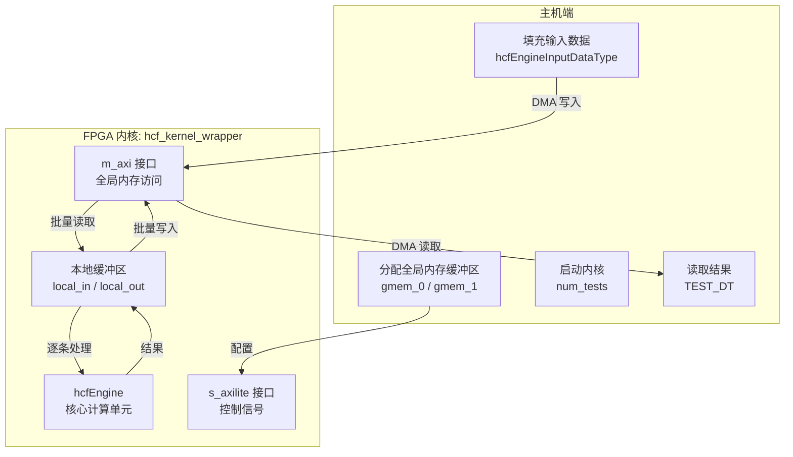

# hcf_kernel_wrapper 技术深度解析

## 一句话概括

`hcf_kernel_wrapper` 是连接 FPGA 硬件加速引擎与主机软件的**桥梁型内核封装层**，它解决了"如何将批量金融计算任务高效卸载到 FPGA"的问题——通过标准化的内存接口、本地缓存管理和批量流水线处理，让上层应用能够像调用普通函数一样使用硬件加速。

---

## 问题空间：为什么需要这个模块？

### 原始问题

在金融量化计算领域（特别是数值积分、期权定价等场景），我们经常需要对大量不同的参数组合进行相同的数学运算。例如：

- 计算不同执行价、到期日、波动率组合下的期权价格
- 蒙特卡洛模拟中的大量路径计算
- 敏感性分析中的参数扫描

CPU 虽然通用性强，但在大规模并行浮点运算上能效比远不如 FPGA。

### naive 方案的困境

如果直接将算法搬到 FPGA，会遇到几个问题：

1. **内存墙问题**：FPGA 的运算单元速度远快于外部 DDR 内存，频繁直接访问 DDR 会导致运算单元大量空等
2. **接口碎片化**：每次调用都需要单独的配置、数据传输、启动、等待完成，调用开销可能超过计算本身
3. **状态管理复杂**：主机需要精确跟踪 FPGA 内部状态，容易出错

### 本模块的设计洞察

`hcf_kernel_wrapper` 的核心洞察是：**批量化 + 本地缓存 + 标准化接口**。

想象一个工厂的流水线：外部卡车（全局内存）运送原材料到仓库，工人（FPGA 计算单元）从仓库（本地 BRAM）取货加工，成品送回仓库，再由卡车运走。这个模块就是那个"仓库管理员"——它负责高效的批量搬运，让工人专注计算。

---

## 架构与数据流

### 组件角色



### 数据流详解

**阶段 1：主机准备**

主机在全局内存（DDR/HBM）中分配两个缓冲区：
- `gmem_0`：输入数据数组，每个元素为 `hcfEngineInputDataType` 结构体
- `gmem_1`：输出数据数组，每个元素为 `TEST_DT`（通常为 `double` 或 `float`）

**阶段 2：内核启动与内存映射**

```cpp
#pragma HLS INTERFACE m_axi port = in offset = slave bundle = gmem_0
#pragma HLS INTERFACE m_axi port = out offset = slave bundle = gmem_1
```

这两个 pragma 声明了 AXI4 主设备接口，内核可以通过它们像访问本地内存一样访问 DDR。`offset=slave` 表示地址是相对于基地址的偏移量。

**阶段 3：控制接口配置**

```cpp
#pragma HLS INTERFACE s_axilite port = in bundle = control
#pragma HLS INTERFACE s_axilite port = out bundle = control
#pragma HLS INTERFACE s_axilite port = num_tests bundle = control
#pragma HLS INTERFACE s_axilite port = return bundle = control
```

s_axilite（AXI4-Lite 从设备）接口用于主机配置内核参数：`in`/`out` 指针的基地址、`num_tests`（测试数量），以及启动/停止控制。这是一种轻量级寄存器映射接口，适合控制面。

**阶段 4：数据打包**

```cpp
#pragma HLS DATA_PACK variable = in
```

这个 pragma 指示 HLS 编译器将 `hcfEngineInputDataType` 结构体的字段紧密打包，去除编译器通常插入的填充字节（padding）。这对硬件实现很关键：未打包的结构体可能导致字段分散在多个总线事务中，降低效率。

**阶段 5：本地缓存与计算流水线**

```cpp
struct hcfEngineInputDataType local_in[MAX_NUMBER_TESTS];
TEST_DT local_out[MAX_NUMBER_TESTS];

// 批量从全局内存加载到本地 BRAM
for (int i = 0; i < num_tests; i++) {
    local_in[i] = in[i];
}

// 逐条计算
for (int i = 0; i < num_tests; i++) {
    local_out[i] = xf::fintech::hcfEngine(&local_in[i]);
}

// 批量写回
for (int i = 0; i < num_tests; i++) {
    out[i] = local_out[i];
}
```

这里体现了**三级数据局部性转换**：

1. **全局内存（DDR）→ 本地 BRAM**：通过批量 DMA 风格的突发传输（burst transfer），摊销访存延迟。FPGA 的 BRAM（Block RAM）是片上存储，带宽可达 TB/s 级别，延迟仅数个时钟周期，而 DDR 延迟通常数百纳秒。

2. **本地计算**：`hcfEngine` 函数从本地 BRAM 读取输入，执行实际的金融计算（很可能是 HCF —— High-Coupon Frequency 相关的数值积分或偏微分方程求解）。由于输入已在片上，计算单元可以全速运行，不会被内存 stall。

3. **本地 BRAM → 全局内存**：同样通过批量突发写回，将结果传递回主机。

---

## 核心抽象与设计模式

### 1. 缓冲区策略：双缓冲与批量化

代码中使用了**静态分配的本地缓冲区**：

```cpp
struct hcfEngineInputDataType local_in[MAX_NUMBER_TESTS];
TEST_DT local_out[MAX_NUMBER_TESTS];
```

这里隐含的设计约束是：`MAX_NUMBER_TESTS` 必须在编译时确定（通过 `quad_hcf_engine_def.hpp` 中的宏定义）。这限制了单次内核调用的最大批处理量，但换来了：

- **确定性资源占用**：编译器可以精确计算 BRAM 使用量，确保不超过 FPGA 片上存储容量
- **无动态分配开销**：避免了运行时内存管理逻辑，简化硬件实现
- **可预测的性能**：固定大小的突发传输更容易被内存控制器优化

### 2. 接口分层：控制面与数据面分离

代码通过 HLS pragma 实现了经典的分层架构：

- **控制面（Control Plane）**：`s_axilite` 接口处理配置、启动、状态查询。这是低带宽、高延迟的寄存器访问，适合管理。
- **数据面（Data Plane）**：`m_axi` 接口处理大批量数据传输。这是高带宽、基于突发的 DMA 访问，适合计算。

这种分离让主机能够：先通过控制面配置好所有参数（指针地址、测试数量），然后一个控制寄存器写操作启动计算；计算完成后通过中断或轮询检查状态，最后通过数据面读取结果。

### 3. 计算封装：引擎模式（Engine Pattern）

核心的计算逻辑被封装在 `xf::fintech::hcfEngine` 函数中：

```cpp
local_out[i] = xf::fintech::hcfEngine(&local_in[i]);
```

这是一种**引擎模式**的设计：

- **关注点分离**：wrapper 只负责数据搬运和流水线管理，不关心具体金融数学
- **可替换性**：可以替换 `hcfEngine` 的实现（比如从单精度换双精度，或换不同算法），wrapper 代码无需改动
- **可测试性**：hcfEngine 可以独立在 CPU 上编译测试，不依赖 FPGA 环境

---

## 设计权衡与决策分析

### 权衡 1：本地缓冲 vs 直接访存

**选择的方案**：使用本地 BRAM 缓存整个测试批次

**替代方案**：直接从全局内存读取每个测试用例，计算后直接写回

**决策理由**：

- **延迟隐藏**：从 DDR 读取单个测试用例的延迟可能数百个时钟周期，而计算本身可能只需几十个周期。如果直接访存，计算单元大部分时间都在等待数据。
- **突发传输效率**：AXI 协议对突发传输有优化，连续地址访问比随机访问带宽高数倍。批量加载/存储充分利用了这一点。
- **片上资源充足**：现代 FPGA（如 Alveo U50/U280）有数十 MB 的 BRAM/URAM，足够容纳数千个测试用例的输入输出数据。

**代价**：增加了片上存储消耗，限制了单次批处理的最大规模（`MAX_NUMBER_TESTS`）。

### 权衡 2：顺序处理 vs 并行/流水线处理

**选择的方案**：使用简单 for 循环顺序处理测试用例

**替代方案**：
- 使用 HLS 的 `pipeline` pragma 启动 II=1 的流水线，让多个测试用例重叠执行
- 使用 `unroll` pragma 展开循环，并行处理多个测试用例

**决策理由**：

- **资源约束**：`hcfEngine` 本身可能已经占用了大量 DSP 和 LUT 资源。如果在外层再展开或流水线化，可能导致资源耗尽或时序收敛困难。
- **数据依赖**：如果 `hcfEngine` 的计算依赖于某些全局状态或累加器，流水线或并行化会破坏语义。
- **延迟不敏感**：该内核设计目标是**吞吐量**而非单个测试的延迟。即使顺序处理，批量传输的突发带宽仍能保证整体性能。

**代价**：单个测试用例的延迟等于所有测试用例处理时间之和，无法利用流水线重叠。

### 权衡 3：静态编译时大小 vs 动态运行时分配

**选择的方案**：`MAX_NUMBER_TESTS` 是编译时常量，本地缓冲区静态分配

**替代方案**：通过 `s_axilite` 接口传入 `MAX_NUMBER_TESTS`，使用 HLS 的 `alloca` 或动态存储

**决策理由**：

- **硬件实现简单性**：动态分配需要复杂的内存管理单元（MMU）或至少一个自由列表管理器，这会增加大量 LUT 消耗并降低时钟频率。
- **资源可预测性**：编译时已知大小允许 HLS 工具精确计算 BRAM 需求，生成准确的资源报告，避免运行时资源不足导致的错误。
- **性能确定性**：静态数组的地址计算在编译时完成，访问延迟是固定的单周期。

**代价**：灵活性丧失，如果运行时传入的 `num_tests` 超过 `MAX_NUMBER_TESTS`，会发生缓冲区溢出（代码中**没有边界检查**，这是潜在的安全隐患）。

---

## 新手上路：常见陷阱与最佳实践

### 陷阱 1：缓冲区溢出（最严重的安全隐患）

**问题**：代码中没有任何对 `num_tests` 的范围检查。如果主机传入 `num_tests > MAX_NUMBER_TESTS`，本地数组 `local_in` 和 `local_out` 会发生缓冲区溢出。

**后果**：
- 覆盖相邻的 BRAM 区域，可能破坏其他数据或控制逻辑
- 如果溢出到地址空间外，可能触发 FPGA 的内存保护错误（取决于平台）
- 最糟糕的是**静默数据损坏**：溢出写入被其他合法数据覆盖，结果看似正常但实际错误

**最佳实践**：
```cpp
// 主机端（host_test_harness）必须验证：
if (num_tests > MAX_NUMBER_TESTS) {
    throw std::invalid_argument("num_tests exceeds MAX_NUMBER_TESTS");
}
```

### 陷阱 2：内存对齐与数据结构布局

**问题**：`hcfEngineInputDataType` 的定义变化可能导致 `DATA_PACK` 行为不符合预期。如果结构体包含指针、虚函数表或其他非 POD（Plain Old Data）成员，HLS 可能无法正确打包。

**后果**：
- 主机和 FPGA 对结构体大小的理解不一致，导致数据解析错误
- 总线事务效率降低，出现非对齐访问

**最佳实践**：
- 确保 `hcfEngineInputDataType` 仅包含 POD 类型（`int`, `float`, `double`, 固定大小数组等）
- 使用 `static_assert(sizeof(hcfEngineInputDataType) == EXPECTED_SIZE)` 在主机端验证大小

### 陷阱 3：全局内存同步时机

**问题**：主机写入输入数据后未同步到设备内存，或内核完成后未同步回主机，就读取结果。

**后果**：
- 读取到陈旧数据（cache coherence 问题）
- 结果不确定，时有时无

**最佳实践**：
```cpp
// XRT 示例
xrt::bo in_bo(device, buffer_size, xrt::bo::flags::host_only, krnl.group_id(0));
auto in_data = in_bo.map<int*>();
// 填充数据...
in_bo.sync(xrt::bo::direction::host_to_device);  // 关键：同步到设备

// 运行内核...

out_bo.sync(xrt::bo::direction::device_to_host);  // 关键：同步回主机
```

### 陷阱 4：忽略 HLS 工具报告的资源利用率

**问题**：不检查 HLS 综合报告中的资源利用率（BRAM、DSP、LUT、FF），就盲目部署到 FPGA。

**后果**：
- 布局布线失败（place-and-route 无法收敛）
- 时序不满足（无法达到目标时钟频率）
- 运行时不可预测的行为

**最佳实践**：
- 始终检查 HLS 报告中的 `Utilization Estimates` 部分
- 确保 BRAM 利用率低于目标 FPGA 的 80%（为布局布线留余量）
- 如果 DSP 利用率过高，考虑在 `hcfEngine` 内部使用定点数替代浮点数

---

## 参考与延伸阅读

- [hcf_engine 模块文档](quantitative_finance-L2-demos-Quadrature-src-kernel-hcf_engine.md) - 核心计算引擎的实现细节
- [host_test_harness 模块文档](quantitative_finance-L2-demos-Quadrature-src-host-host_test_harness.md) - 主机端测试框架的使用方法
- [quadrature_pi_integration_kernels 模块文档](quantitative_finance-L2-demos-Quadrature-src-kernel-quadrature_pi_integration_kernels.md) - 同族数值积分内核的对比

---

## 附录：代码行级注释解读

```cpp
// extern "C" 确保 C++ 编译器生成 C 链接名的符号，
// 这对 OpenCL/XRT 的 dlsym 加载是必需的
extern "C" {

// 内核函数名将成为 OpenCL 内核的符号名
void quad_hcf_kernel(struct hcfEngineInputDataType* in, TEST_DT* out, int num_tests) {
    // m_axi 接口声明：全局内存访问，突发传输优化
    #pragma HLS INTERFACE m_axi port = in offset = slave bundle = gmem_0
    #pragma HLS INTERFACE m_axi port = out offset = slave bundle = gmem_1
    
    // s_axilite 接口声明：寄存器映射控制
    #pragma HLS INTERFACE s_axilite port = in bundle = control
    #pragma HLS INTERFACE s_axilite port = out bundle = control
    #pragma HLS INTERFACE s_axilite port = num_tests bundle = control
    #pragma HLS INTERFACE s_axilite port = return bundle = control
    
    // 结构体打包：消除填充字节，优化总线效率
    #pragma HLS DATA_PACK variable = in

    // 本地缓冲区分配：映射到 BRAM
    struct hcfEngineInputDataType local_in[MAX_NUMBER_TESTS];
    TEST_DT local_out[MAX_NUMBER_TESTS];

    // 阶段 1：批量加载（突发传输优化）
    for (int i = 0; i < num_tests; i++) {
        local_in[i] = in[i];
    }

    // 阶段 2：顺序计算（资源/时序权衡后的选择）
    for (int i = 0; i < num_tests; i++) {
        local_out[i] = xf::fintech::hcfEngine(&local_in[i]);
    }

    // 阶段 3：批量写回（突发传输优化）
    for (int i = 0; i < num_tests; i++) {
        out[i] = local_out[i];
    }
}

} // extern C
```
