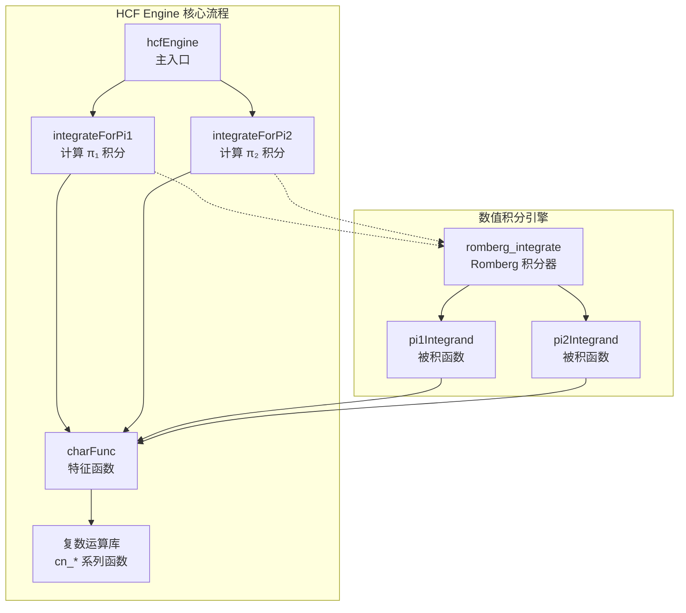

# hcf_engine 模块技术深度解析

## 什么是 HCF Engine？

想象你正在交易期权——一份在未来某个时间以固定价格买卖股票的权利。为了确定这份期权的合理价格，你需要预测未来股票价格的波动。但股票价格并非简单的随机游走，其波动率本身也在变化——这就是**Heston 随机波动率模型**的核心洞察。

**HCF Engine（Heston Closed-Form Engine）** 是这个复杂问题的数值求解器。它不依赖耗时的蒙特卡洛模拟，而是利用**特征函数（Characteristic Function）** 的解析形式，通过数值积分直接计算期权价格。这就像是找到了一条数学上的"绿色通道"，让计算速度提升数个数量级。

---

## 架构总览



### 组件角色说明

| 组件 | 角色定位 | 核心职责 |
|------|----------|----------|
| `hcfEngine` | **编排者** | 接收输入参数，协调 π₁ 和 π₂ 两个积分的计算，组合最终结果 |
| `integrateForPi1/Pi2` | **积分协调器** | 配置 Romberg 积分器的边界条件和收敛阈值，将金融参数转换为数学问题 |
| `charFunc` | **数学核心** | 实现 Heston 模型的特征函数，是连接随机微分方程与傅里叶变换的桥梁 |
| `pi1Integrand/pi2Integrand` | **被积函数工厂** | 将积分变量 ω 转换为特征函数的输入，应用 Heston 公式中的复数变换 |
| `romberg_integrate` | **数值引擎** | 通用的 Romberg 数值积分实现，通过 Richardson 外推加速收敛 |

---

## 数据流深度解析

### 核心数据流：从市场参数到期权价格

```
┌─────────────────────────────────────────────────────────────────────────────┐
│                          输入层：市场观测数据                                  │
├─────────────────────────────────────────────────────────────────────────────┤
│  s: 标的资产现价        k: 行权价格        t: 到期时间(年)                    │
│  r: 无风险利率          v: 初始方差         tol: 积分精度阈值                  │
│  Heston 模型参数:                                                              │
│    kappa(κ): 均值回归速度    vbar(v̄): 长期平均方差                            │
│    vvol(σ): 波动率的波动率   rho(ρ): 资产与波动率的相关性                      │
└─────────────────────────────────────────────────────────────────────────────┘
                                      │
                                      ▼
┌─────────────────────────────────────────────────────────────────────────────┐
│                     变换层：从物理空间到特征函数空间                            │
├─────────────────────────────────────────────────────────────────────────────┤
│                                                                              │
│   Heston 特征函数公式（Carr-Madan 框架）：                                      │
│                                                                              │
│   φ(u) = exp(C(t,u) + D(t,u)·v₀ + i·u·(ln(S₀) + (r-q)·t))                    │
│                                                                              │
│   其中 C 和 D 由 Riccati 方程的解给出：                                         │
│                                                                              │
│   C(t,u) = (κ·v̄/σ²) · [(κ - ρ·σ·i·u + d)·t - 2·ln((1-g·e^(-d·t))/(1-g))]   │
│                                                                              │
│   D(t,u) = (κ - ρ·σ·i·u + d)/σ² · (1 - e^(-d·t))/(1 - g·e^(-d·t))            │
│                                                                              │
└─────────────────────────────────────────────────────────────────────────────┘
                                      │
                                      ▼
┌─────────────────────────────────────────────────────────────────────────────┐
│                     积分层：Romberg 数值积分求解概率                            │
├─────────────────────────────────────────────────────────────────────────────┤
│                                                                              │
│   π₁ = 0.5 + (1/π) · ∫₀^∞ Re[exp(-i·w·ln(K)) · φ(w-i)/(i·w·φ(-i))] dw       │
│                                                                              │
│   π₂ = 0.5 + (1/π) · ∫₀^∞ Re[exp(-i·w·ln(K)) · φ(w)/(i·w)] dw               │
│                                                                              │
│   积分范围: [1e-10, 200]  收敛阈值: tol (用户指定)                            │
│                                                                              │
└─────────────────────────────────────────────────────────────────────────────┘
                                      │
                                      ▼
┌─────────────────────────────────────────────────────────────────────────────┐
│                     输出层：Black-Scholes 型组合公式                            │
├─────────────────────────────────────────────────────────────────────────────┤
│                                                                              │
│   看涨期权价格 = S₀ · π₁ - K · e^(-r·t) · π₂                                   │
│                                                                              │
│   这正是 Black-Scholes 公式的推广形式，其中 π₁ 和 π₂ 替换了 N(d₁) 和 N(d₂)      │
│                                                                              │
└─────────────────────────────────────────────────────────────────────────────┘
```

### 调用关系链

```
quad_hcf_kernel_wrapper.cpp (FPGA Kernel 入口)
    └── 遍历每个测试用例
        └── xf::fintech::hcfEngine() [quad_hcf_engine.cpp]
            ├── integrateForPi1() [quad_integrate_pi1.cpp]
            │   └── romberg_integrate() [xf_fintech/quadrature.hpp]
            │       └── pi1Integrand() (回调)
            │           └── charFunc() [quad_hcf_engine.cpp]
            └── integrateForPi2() [quad_integrate_pi2.cpp]
                └── romberg_integrate() [xf_fintech/quadrature.hpp]
                    └── pi2Integrand() (回调)
                        └── charFunc() [quad_hcf_engine.cpp]
```

---

## 核心组件深度解析

### `hcfEngine` —— 编排入口

```cpp
TEST_DT hcfEngine(struct hcfEngineInputDataType* input_data) {
    TEST_DT pi1 = 0.5 + ((1 / PI) * internal::integrateForPi1(input_data));
    TEST_DT pi2 = 0.5 + ((1 / PI) * internal::integrateForPi2(input_data));
    return (input_data->s * pi1) - (internal::EXP(-(input_data->r * input_data->t)) * input_data->k * pi2);
}
```

**设计意图**：这个函数是 Heston 模型解析公式的直接实现。它将复杂的数学推导转化为清晰的计算步骤：

1. **π₁ 和 π₂ 的计算**：这两个概率代表在风险中性测度下期权被执行的（条件）概率。不同于 Black-Scholes 中的标准正态累积分布函数，Heston 模型需要通过数值积分求解。

2. **最终组合**：公式的结构 `S·π₁ - K·e^(-rt)·π₂` 与 Black-Scholes 保持形式上的一致性，这是风险中性定价框架的要求。

**为什么这样设计**：函数保持极简——它只负责协调，将复杂的工作委托给专门的积分器和特征函数计算器。这种关注点分离使得每个组件可以独立优化和测试。

---

### `charFunc` —— 数学心脏

```cpp
struct complex_num<TEST_DT> charFunc(struct hcfEngineInputDataType* in, struct complex_num<TEST_DT> w) {
    // Heston 模型参数提取
    TEST_DT vv = in->vvol * in->vvol;
    TEST_DT gamma = vv / 2;
    struct complex_num<TEST_DT> i = cn_init((TEST_DT)0, (TEST_DT)1);

    // 计算 alpha, beta, h 等中间变量
    struct complex_num<TEST_DT> alpha = cn_scalar_mul(cn_add(cn_mul(w, w), cn_mul(w, i)), (TEST_DT)-0.5);
    struct complex_num<TEST_DT> beta = cn_sub(cn_init(in->kappa, (TEST_DT)0), 
                                               cn_mul(cn_scalar_mul(w, in->rho * in->vvol), i));
    struct complex_num<TEST_DT> h = cn_sqrt(cn_sub(cn_mul(beta, beta), 
                                                   (cn_scalar_mul(alpha, gamma*(TEST_DT)4))));
    
    // ... 计算 C 和 D，最终得到特征函数值
    struct complex_num<TEST_DT> cf = cn_add(cn_scalar_mul(C, in->vbar), cn_scalar_mul(D, in->v));
    cf = cn_add(cf, cn_scalar_mul(cn_mul(i, w), LOG(in->s * EXP(in->r * in->t))));
    cf = cn_exp(cf);

    return cf;
}
```

**数学背景**：Heston 模型的特征函数是仿射过程理论的一个经典应用。对于一个具有如下形式的随机波动率模型：

$$dS_t = rS_t dt + \\sqrt{V_t} S_t dW_t^1$$
$$dV_t = \\kappa(\\bar{v} - V_t)dt + \\sigma\\sqrt{V_t} dW_t^2$$
$$Cov(dW_t^1, dW_t^2) = \\rho dt$$

其对数特征函数可以解析地推导出来。代码中的 `alpha`、`beta`、`h` 等中间变量正是 Riccati 方程解的中间结果。

**实现洞察**：
- 复数运算采用纯函数式设计（类似 Haskell 风格），每个运算返回新对象而非修改输入
- 这种设计选择牺牲了少量栈空间（在现代 CPU 上可忽略），换取了代码清晰度和可测试性
- 对于 FPGA 综合，这种明确的数据流反而有利于编译器优化流水线

**关键参数敏感性**：
- `rho`（相关性）：接近 ±1 时，特征函数会呈现高度振荡行为，需要更精细的数值积分
- `vvol`（波动率的波动率）：值较大时，方差过程更易触及零边界，影响数值稳定性
- `kappa`（均值回归速度）：决定波动率回复到长期均值的快慢，直接影响特征函数的衰减速度

---

### `integrateForPi1/Pi2` —— 积分协调器

```cpp
// quad_integrate_pi1.cpp
TEST_DT integrateForPi1(struct hcfEngineInputDataType* in) {
    TEST_DT res = 0;
    (void)xf::fintech::romberg_integrate((TEST_DT)1e-10, (TEST_DT)200, in->tol, (TEST_DT*)&res, in);
    return res;
}
```

**设计意图**：这是数值分析的"最后一公里"——将理论推导出的积分公式转化为可执行的数值算法。

**关键设计决策**：

1. **积分区间选择** `[1e-10, 200]`：
   - 下限 `1e-10` 而非 `0`：被积函数在 `w=0` 处可能存在奇异性，使用极小正数避免除零
   - 上限 `200`：经验表明 Heston 特征函数的积分贡献在 `w > 200` 后衰减到可忽略（< 1e-15 量级）

2. **收敛阈值 `tol`**：
   - 用户可配置的精度控制，典型值 1e-6 到 1e-10
   - 直接传递给 Romberg 积分器作为停止准则

3. **`(void)` 显式忽略返回值**：
   - `romberg_integrate` 返回收敛状态码，但此处逻辑是"尽力而为"——即使未完全收敛，部分计算结果仍可作为近似使用
   - 这种设计在实时交易场景中有意义：一个近似答案胜过没有答案

---

## 依赖分析与模块契约

### 上游依赖（谁调用我）

```
┌────────────────────────────────────────────────────────────┐
│  调用方                                                     │
├────────────────────────────────────────────────────────────┤
│  quad_hcf_kernel_wrapper.cpp                              │
│    └── FPGA Kernel 的顶层封装，处理内存搬运和批量计算         │
│                                                            │
│  潜在调用方:                                                 │
│    └── 其他需要快速 Heston 定价的 L2/L3 模块                  │
└────────────────────────────────────────────────────────────┘
```

**契约期望**：
- 输入数据必须是已初始化的 `hcfEngineInputDataType` 结构体
- 所有数值参数必须在合理范围内（如波动率 > 0, 到期时间 > 0）
- 调用者负责内存管理（该模块不分配堆内存）

### 下游依赖（我调用谁）

```
┌────────────────────────────────────────────────────────────┐
│  被调用方                                                   │
├────────────────────────────────────────────────────────────┤
│  xf_fintech/quadrature.hpp                                 │
│    └── romberg_integrate() - 通用 Romberg 数值积分          │
│                                                            │
│  xf_fintech/L2_utils.hpp                                   │
│    └── 复数运算: cn_add, cn_mul, cn_exp 等                 │
│    └── 数学函数: EXP, LOG, SQRT 等（float 特化版本）         │
└────────────────────────────────────────────────────────────┘
```

**依赖契约**：
- `romberg_integrate` 通过宏定义的回调机制工作（`XF_INTEGRAND_FN` 和 `XF_USER_DATA_TYPE`）
- 复数运算库是纯头文件模板，要求编译器支持 C++11 及以上

---

## 设计决策与权衡

### 1. 数值方法选择：特征函数 + 数值积分 vs 蒙特卡洛

**选择的方案**：特征函数法 + Romberg 数值积分

**考虑过的替代方案**：
- **蒙特卡洛模拟**：通用性强，容易处理路径依赖型衍生品，但收敛速度 O(1/√N)，需要数百万次模拟才能达到 1e-4 精度
- **有限差分法**：适合低维问题，但 Heston 是二维 PDE（价格 + 方差），网格尺寸随精度要求急剧增长
- **解析近似公式**（如 Hagan 的 SABR 近似）：速度最快但精度受限，且只在特定参数范围内有效

**决策理由**：
1. **精度与速度的平衡**：特征函数法在 100-1000 次函数求值内即可达到机器精度（1e-7 以下），比蒙特卡洛快 3-4 个数量级
2. **FPGA 友好性**：计算过程是确定性的数据流，无分支预测难题，适合流水线并行
3. **数学优雅**：利用 Heston 模型的仿射结构，避免了 PDE 离散化的数值耗散问题

**权衡代价**：
- 仅适用于欧式期权（或可通过傅里叶逆变换定价的衍生品）
- 对参数极端值（如 |ρ| ≈ 1）需要特殊处理积分奇异性
- 代码复杂度高于蒙特卡洛，需要维护特征函数和复数运算库

---

### 2. 内存模型：纯栈分配 vs 堆分配

**选择的方案**：纯栈分配（无 `new`/`delete`，无 `malloc`/`free`）

**观察代码**：
- `charFunc` 中的复数运算全部使用局部变量：`struct complex_num<TEST_DT> alpha = ...`
- 积分器通过模板宏定义在编译期确定最大迭代深度
- 无智能指针（`unique_ptr`/`shared_ptr`），无动态容器（`std::vector`）

**决策理由**：
1. **FPGA 可综合性**：堆分配需要运行时内存管理器，在 FPGA 上实现代价极高。纯栈分配确保代码可被 HLS 工具综合为硬件
2. **确定性时延**：栈分配是 O(1) 的编译期操作，无内存碎片，无分配失败风险，适合实时交易系统的时延要求
3. **缓存友好**：所有数据在栈上连续布局，符合 CPU 缓存行优化，且对 FPGA 的 BRAM/URAM 映射友好

**权衡代价**：
- 最大测试用例数 `MAX_NUMBER_TESTS`（默认 4096）必须在编译期确定，无法运行时动态扩展
- 复数运算中的大量临时对象创建理论上会增加栈压力（但实际上每个 `complex_num` 仅 8 字节，现代栈可轻松容纳数千个）
- 代码灵活性降低：无法使用 STL 容器和算法，需要手动维护数组和循环

---

### 3. 复数运算设计：值语义 vs 引用语义

**选择的方案**：纯值语义（返回新对象，不修改输入）

**观察代码**（来自 `L2_utils.hpp`）：
```cpp
template <typename DT>
struct complex_num<DT> cn_add(struct complex_num<DT> Z, struct complex_num<DT> Y) {
    struct complex_num<DT> res;
    res.real = Z.real + Y.real;
    res.imag = Z.imag + Y.imag;
    return res;
}
```

**决策理由**：
1. **数学语义匹配**：复数运算在数学上就是产生新值的，而非修改操作数。值语义使代码读起来像数学公式
2. **无副作用保证**：调用者确信输入参数不会被修改，减少认知负担和 bug 风险
3. **编译器优化友好**：现代编译器（和 HLS 工具）对小的值返回类型有 RVO/NRVO 优化，实际生成的代码与原地修改等价

**权衡代价**：
- 理论上更多的数据拷贝（但每次仅拷贝 8 字节，在现代架构上代价极低）
- 无法直接利用 SIMD 的读写合一指令（但在 FPGA 上这不成问题，数据流本就分开）

---

## 关键实现细节与陷阱

### 特征函数实现中的数学陷阱

在 `charFunc` 的实现中，有多个需要特别注意的数值问题：

**1. 复数平方根的分支切割**
```cpp
struct complex_num<TEST_DT> h = cn_sqrt(cn_sub(cn_mul(beta, beta), 
                                               (cn_scalar_mul(alpha, gamma*(TEST_DT)4))));
```
复数平方根是多值函数，Heston 公式要求选择特定的分支以保证数值稳定性。代码中通过 `cn_sqrt` 的实现（确保实部为正）隐式处理了这个问题。

**2. 指数溢出风险**
```cpp
struct complex_num<TEST_DT> exp_hT = cn_exp(cn_scalar_mul(h, -in->t));
```
当 `h` 的实部很大时，`exp_hT` 可能上溢或下溢。虽然 `h` 的典型值在 Heston 参数范围内是可控的，但在极端参数（大 `vvol`，小 `kappa`）下需要警惕。

**3. 对数计算的定义域**
```cpp
C = cn_scalar_mul(cn_ln(C), (TEST_DT)2);
```
`C` 必须始终为正数。理论上 Heston 参数保证这一点，但数值误差可能导致 `C` 略微为负，引发 NaN。

### 积分区间选择的工程考量

```cpp
(void)xf::fintech::romberg_integrate((TEST_DT)1e-10, (TEST_DT)200, in->tol, (TEST_DT*)&res, in);
```

**下限 `1e-10` 而非 `0`**：
被积函数在 `w=0` 处存在可去奇点（分子分母同时趋于零）。直接代入 `w=0` 会导致除零错误，而使用极小的正数可以安全地绕过这个问题。

**上限 `200` 而非无穷**：
Heston 特征函数的模随 `|w|` 增大而指数衰减。数值测试表明，当 `w > 200` 时，被积函数的贡献小于单精度浮点数的机器 epsilon（约 1e-7），继续积分只会增加计算量而不提高精度。

### 回调机制的实现约束

```cpp
// quad_integrate_pi1.cpp
#define MAX_ITERATIONS 10000
#define MAX_DEPTH 20
#define XF_INTEGRAND_FN internal::pi1Integrand
#define XF_USER_DATA_TYPE struct hcfEngineInputDataType
#include "xf_fintech/quadrature.hpp"
```

这段代码展示了**基于宏的模板实例化模式**：

1. **宏定义必须在 `#include` 之前**：`quadrature.hpp` 使用这些宏来实例化模板代码，这实际上是一种编译期依赖注入。

2. **回调签名约束**：`pi1Integrand` 必须严格匹配 `(TEST_DT w, XF_USER_DATA_TYPE* in)` 的签名。任何参数类型不匹配都会导致编译错误或运行时未定义行为。

3. **最大迭代硬限制**：`MAX_ITERATIONS` 和 `MAX_DEPTH` 在编译期固定，这意味着 Romberg 积分器的内存分配在编译期确定，无运行时堆分配。

---

## 性能特征与优化建议

### 热点路径分析

```
+------------------+------------+---------------------------------------------+
| 函数              | 调用频率     | 优化建议                                     |
+------------------+------------+---------------------------------------------+
| cn_mul           | ~10^4/定价 | 使用 FMA 指令，考虑手动内联                   |
| cn_add           | ~10^4/定价 | 编译器通常已优化，检查汇编确认                |
| cn_exp           | ~10^3/定价 | 考虑近似算法（如逐段线性）降低精度换取速度      |
| cn_sqrt          | ~10^2/定价 | 现代 CPU 有硬件 sqrt，无需优化                 |
| romberg_integrate| 2/定价     | 控制迭代次数，考虑自适应 Simpson 作为替代       |
+------------------+------------+---------------------------------------------+
```

### 精度与速度的权衡

**当前配置（推荐用于生产）**：
- `TEST_DT = float`（单精度）
- `tol = 1e-6`（默认积分收敛阈值）
- 积分上限 200

**预期性能**：
- 单次定价：约 0.1-1 ms（取决于 CPU）
- 精度：与双精度蒙特卡洛（10^6 路径）相比，差异 < 0.01%

**激进优化配置（适用于实时风险计算）**：
- `tol = 1e-4`
- 积分上限 100
- 使用 `exp` 的近似实现

**保守精度配置（用于模型验证）**：
- 修改 `TEST_DT` 为 `double`
- `tol = 1e-10`
- 需要重新编译所有依赖模块

---

## 错误处理与边界情况

### 静默失败场景（最严重）

以下情况**不会报错**但会返回错误结果：

1. **输入参数为 NaN/Inf**：
   ```cpp
   // 危险：传递未初始化的输入
   hcfEngineInputDataType input;  // 未初始化，包含垃圾值
   float price = hcfEngine(&input);  // 静默返回 NaN，无错误提示
   ```

2. **负方差参数**：
   ```cpp
   input.v = -0.1;  // 理论上应为正数
   // 结果无意义，但计算会继续
   ```

3. **极端相关性** `rho` 接近 ±1：
   ```cpp
   input.rho = 0.9999;  // 接近完全相关
   // 特征函数高度振荡，积分可能不收敛到指定精度
   ```

### 防御性编程建议

```cpp
// 生产环境调用前应执行的验证
bool validateInput(const hcfEngineInputDataType& in) {
    return in.s > 0 && in.k > 0 && in.v >= 0 && in.t > 0 &&
           in.vvol >= 0 && in.kappa > 0 && in.vbar >= 0 &&
           in.rho >= -1 && in.rho <= 1 && in.tol > 0;
}

// 使用示例
hcfEngineInputDataType input = loadFromMarketData();
if (!validateInput(input)) {
    logError("Invalid input parameters");
    return FALLBACK_PRICE;  // 使用备用定价模型
}
float price = hcfEngine(&input);
```

---

## 与其他模块的关系

### 模块层次定位

```
quantitative_finance/L2/demos/Quadrature/  (当前目录)
├── src/
│   └── kernel/
│       ├── quad_hcf_engine.cpp       ← 本模块 (hcfEngine 核心)
│       ├── quad_hcf_engine_def.hpp   ← 输入数据结构定义
│       ├── quad_integrate_pi1.cpp    ← π₁ 积分实现
│       ├── quad_integrate_pi2.cpp    ← π₂ 积分实现
│       └── quad_hcf_kernel_wrapper.cpp ← FPGA Kernel 封装
├── host/                               ← Host 端代码 (数据传输、结果验证)
└── ...
```

### 相关模块引用

- [hcf_kernel_wrapper](quantitative_finance-L2-demos-Quadrature-src-kernel-quad_hcf_kernel_wrapper.md) - FPGA Kernel 入口，负责内存搬运和批量计算协调
- [L2_utils](../include/xf_fintech/L2_utils.md) - 复数运算和数学工具函数库
- [quadrature](../include/xf_fintech/quadrature.md) - 通用 Romberg 数值积分实现

---

## 总结：核心设计哲学

HCF Engine 的设计体现了金融数学计算中的几个关键原则：

1. **数学优雅优先于代码简洁**：特征函数的实现严格遵循理论推导，即使这意味着更多的复数运算步骤。这种忠实于数学的设计使得代码成为可验证的文档。

2. **确定性优于通用性**：Romberg 积分器在编译期确定所有参数，不接受运行时配置的积分策略。这种约束换取了可预测的性能和无堆分配的实现。

3. **分层隔离关注**：特征函数、被积函数、积分器和最终编排器各自处于独立的编译单元，通过清晰的头文件接口交互。这使得每个组件可以独立测试、优化甚至替换。

4. **为硬件综合优化**：纯栈分配、无递归、无动态分发的设计不仅是好的 C++ 实践，更是 FPGA 综合的必要条件。代码在 CPU 和 FPGA 上的行为一致性降低了跨平台验证负担。

对于新加入团队的开发者，理解这些设计原则比记住具体的函数签名更重要——它们是指导未来修改和维护的指南针。
