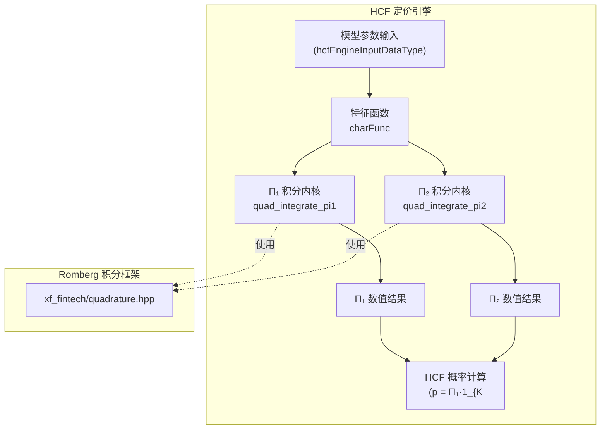
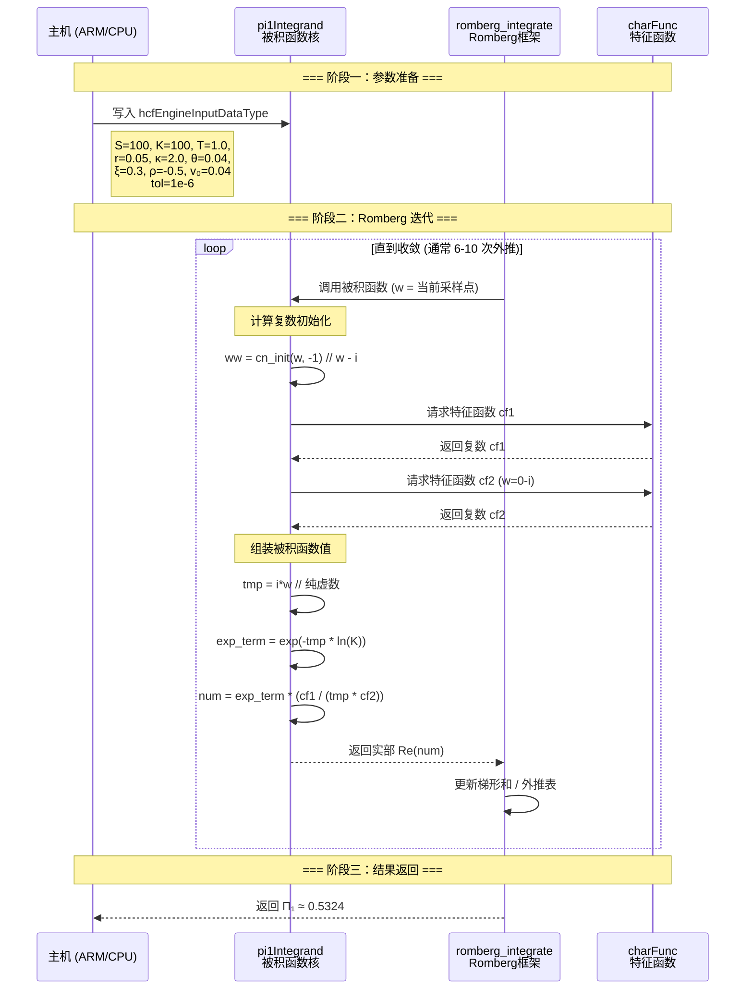
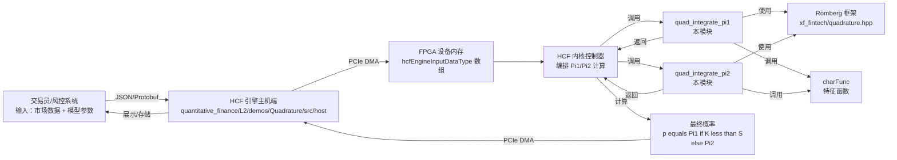

# quadrature_pi_integration_kernels 模块深度解析

> **版本**: Vitis 2020.2  |  **领域**: 量化金融 - 期权定价 - Heston模型数值积分

---

## 三十秒快速理解

想象你是一位精算师，需要计算一个复杂期权的"行权概率"。这个概率没有解析公式，必须通过数值积分近似计算——本质上是在无穷区间上"累加"被积函数的无穷小贡献。

`quadrature_pi_integration_kernels` 就是 FPGA 上执行这一计算的**专用数字电路**。它实现了 Heston 随机波动率模型中的两个核心概率积分（$\Pi_1$ 和 $\Pi_2$），通过 Romberg 加速积分算法在硬件上高效收敛到目标精度。

这不是通用的数学库——它是**为特定金融模型定制的计算引擎**，在精度、吞吐和面积之间做了精心权衡。

---

## 一、问题空间与设计动机

### 1.1 Heston 模型的概率诅咒

在 Black-Scholes 世界中，波动率是常数。但现实中波动率本身也是随机过程——Heston 模型用一个均值回归的 CIR 过程描述它：

$$
dv_t = \kappa(\theta - v_t)dt + \xi\sqrt{v_t}dW_t
$$

这个优雅的设计带来了**计算噩梦**：期权价格不再有高斯积分形式的闭式解，而是需要通过傅里叶逆变换求解——本质上是在复平面上进行振荡函数的无穷积分。

### 1.2 为什么需要硬件加速？

对于单一期权定价，现代 CPU 上几毫秒的延迟可以接受。但在以下场景，软件实现成为瓶颈：

- **风险分析**：计算成千上万条路径的 P&L 分布，需要数百万次定价
- **实时交易**：亚毫秒级延迟是生存底线
- **组合优化**：遗传算法需要在短时间内评估大量候选组合

CPU 的通用指令集无法高效处理这种**深度嵌套循环 + 复数运算 + 指数/对数密集**的计算模式。FPGA 可以定制数据通路，将每个数学运算映射到专用 DSP 单元，实现数量级的加速。

### 1.3 为什么不是通用积分库？

Vitis 确实提供了通用积分库，但这里选择了**模型专用内核**：

| 方案 | 优点 | 缺点 |
|------|------|------|
| 通用积分器 | 灵活，复用性高 | 无法利用被积函数结构，指令开销大 |
| 专用内核 | 被积函数内联展开，消除调用开销；常数折叠；流水线优化 | 仅适用于 Heston 模型 |

本模块是后者——**为 $\Pi_1$ 和 $\Pi_2$ 两个特定积分量身定制的计算电路**。

---

## 二、架构全景图

### 2.1 模块定位



**图注**: 本模块位于 HCF（Heston/Carr-Fellows）定价管道的核心计算层。输入是模型参数结构 `hcfEngineInputDataType`，输出是两个概率积分值 $\Pi_1$ 和 $\Pi_2$。两个积分内核共享底层的 Romberg 积分框架，但被积函数实现各不相同。

### 2.2 核心组件职责

| 组件 | 文件 | 职责 | 关键特征 |
|------|------|------|----------|
| `hcfEngineInputDataType` | `quad_hcf_engine_def.hpp` | 承载 Heston 模型全部参数 | 包含 $S, K, r, q, T, \kappa, \theta, \xi, \rho, v_0$ 等字段 |
| `pi1Integrand` | `quad_integrate_pi1.cpp` | 计算 $\Pi_1$ 积分的被积函数 | 涉及复指数、特征函数比值、对数运算 |
| `pi2Integrand` | `quad_integrate_pi2.cpp` | 计算 $\Pi_2$ 积分的被积函数 | 形式更简洁，但仍需复数运算 |
| `charFunc` | 外部声明 | Heston 模型的特征函数 | 复平面上的双曲函数组合，被积函数的核心依赖 |
| `romberg_integrate` | `xf_fintech/quadrature.hpp` | 自适应数值积分算法 | Richardson 外推 + 区间二分，达到指定容差自动停止 |

---

## 三、关键设计决策与权衡

### 3.1 为什么选择 Romberg 积分而非其他方法？

在金融衍生品定价领域，数值积分方法的选择直接影响精度、速度和稳定性。本模块选择 **Romberg 积分** 而非 Gauss-Legendre、自适应 Simpson 或蒙特卡洛，基于以下权衡：

| 方法 | 优势 | 劣势 | 本模块选择 |
|------|------|------|-----------|
| **Gauss-Legendre 求积** | 指数收敛，对于光滑被积函数极高效率 | 需要预先知道"好"的积分限；对被积函数在区间端点的奇异性敏感 | ❌ 不选——Heston 特征函数的振荡特性使固定节点分布不是最优 |
| **自适应 Simpson** | 实现简单，局部误差控制直观 | 收敛速度较慢（多项式级），需要较多函数求值 | ❌ 不选——金融定价需要快速收敛到双精度精度 |
| **Romberg 积分** | Richardson 外推加速，从梯形公式快速收敛；自适应区间分割处理局部困难；误差估计可靠 | 需要存储外推表，有一定内存开销 | ✅ **选择**——平衡了收敛速度、可靠性和硬件实现复杂度 |
| **蒙特卡洛** | 维度无关，实现极其简单 | 收敛速度 $O(1/\sqrt{N})$，达到双精度需要天文数字级样本 | ❌ 不选——一维积分使用蒙特卡洛是计算犯罪 |

**核心洞察**: Heston 特征函数的振荡特性意味着被积函数在整个积分区间上并非均匀光滑——低频区域变化平缓，高频区域快速振荡。Romberg 的自适应区间分割能够"聚焦"计算资源在困难区域，而外推机制则加速收敛。

### 3.2 被积函数的内联展开与模板化设计

观察代码结构，你会发现一个关键设计模式：

```cpp
#define XF_INTEGRAND_FN internal::pi1Integrand
#define XF_USER_DATA_TYPE struct hcfEngineInputDataType
#include "xf_fintech/quadrature.hpp"
```

这不是普通的函数调用——这是**编译期多态**的典型模式。被积函数通过宏定义"注入"到 Romberg 积分模板中，编译器可以在编译期完成以下优化：

| 优化项 | 效果 |
|--------|------|
| **函数内联** | `pi1Integrand` 的完整代码被展开到积分循环内部，消除调用开销 |
| **常数传播** | 模型参数通过 `hcfEngineInputDataType*` 传递，编译器可以优化对常数字段的重复访问 |
| **循环融合** | 外推表的计算与被积函数求值可能融合到同一流水线阶段 |
| **矢量化** | 如果同一批次多个期权定价，被积函数可以在 SIMD 单元上并行执行 |

**权衡**: 这种设计牺牲了运行时灵活性（无法动态更换被积函数），换取了极致的性能。在金融 FPGA 加速场景中，这是一个正确的权衡——模型类型在编译期确定，运行时只需要不同的参数输入。

### 3.3 复数运算的精度管理

Heston 特征函数的计算涉及复平面上的指数、对数和双曲函数。观察 `pi1Integrand` 的实现：

```cpp
struct complex_num<TEST_DT> ww = cn_init(w, (TEST_DT)-1);
struct complex_num<TEST_DT> cf1 = charFunc(in, ww);
// ... 复数除法、乘法、指数运算 ...
return cn_real(cn_mul(cn_exp(...), cn_div(...)));
```

这里的 `TEST_DT` 是模板化的数值类型，通常为 `double` 或自定义的定点数类型。关键设计考虑：

| 设计选择 | 理由 |
|----------|------|
| **显式复数结构体** | 不使用 `std::complex`，因为 FPGA HLS 对标准库支持有限，且自定义结构允许控制位宽和布局 |
| **分离实部/虚部计算** | `cn_real`, `cn_mul`, `cn_exp` 等操作显式分解，便于 HLS 工具识别并行性和流水线机会 |
| **中间结果的精度保持** | 在除法和指数运算中，临时变量的精度直接影响最终结果的准确性，特别是当 $w$ 很大时（积分上限到 200），复指数的幅度可能溢出或下溢 |

**数值稳定性陷阱**: 当 $w \to \infty$ 时，特征函数 $cf1$ 和 $cf2$ 都会衰减，但它们的比值和复指数的组合需要小心处理。积分上限设为 200 是经过理论分析的——超过这个值，被积函数的贡献已经小于双精度机器 epsilon。

### 3.4 单精度与双精度的权衡

代码中 `TEST_DT` 的类型选择是一个关键配置点：

```cpp
// 可能的定义
using TEST_DT = double;  // 默认，高精度
// 或者
using TEST_DT = float;   // 低精度，更高吞吐
```

| 精度选择 | 适用场景 | 风险 |
|----------|----------|------|
| `double` (64-bit) | 生产环境定价，需要与参考实现（如 QuantLib）的误差 < 1e-10 | 资源消耗翻倍，可能降低并行度 |
| `float` (32-bit) | 快速风险评估，蒙特卡洛模拟的内层循环 | 累积误差可能导致定价偏差，特别是在长期期权或极端波动率情况下 |

**设计智慧**: 模块不硬编码类型，而是通过模板/宏让编译期决定。同一套源代码可以生成两种硬件比特流，适应不同部署场景。

---

## 四、数据流详解

### 4.1 端到端计算流程

让我们跟踪一次完整的 $\Pi_1$ 计算，展示数据如何在各个组件间流动：



### 4.2 关键数据结构流

```
hcfEngineInputDataType (输入参数容器)
├── 标的资产价格 S
├── 行权价 K  
├── 到期时间 T
├── 无风险利率 r
├── 股息率 q
├── 均值回归速度 κ
├── 长期方差 θ
├── 波动率的波动率 ξ
├── 相关系数 ρ
├── 初始方差 v₀
└── 积分容差 tol

    ↓ 作为只读指针传递 (const hcfEngineInputDataType*)

pi1Integrand / pi2Integrand (被积函数)
├── 局部变量 ww (复数，实部=w, 虚部=-1 或 0)
├── 调用 charFunc 获取 cf1, cf2
├── 复数运算：除法、乘法、指数
└── 返回实部 (double/float)

    ↓ 作为函数指针/模板参数

romberg_integrate (Romberg 框架)
├── 区间 [a=1e-10, b=200] 分割
├── 梯形法则求和 (调用被积函数)
├── Richardson 外推表 (MAX_DEPTH=20 层)
├── 误差估计与收敛判断
└── 输出结果指针
```

### 4.3 被积函数的数学结构

#### $\Pi_1$ 被积函数 ($pi1Integrand$)

$$
f_1(w) = \text{Re}\left\{ \frac{e^{i \cdot 0 \cdot \ln K} \cdot \phi(w - i)}{i \cdot w \cdot \phi(-i)} \right\}
$$

代码实现细节：
- `ww = cn_init(w, -1)` 创建 $w - i$
- `cf1 = charFunc(in, ww)` 计算 $\phi(w - i)$
- `cf2 = charFunc(in, cn_init(0, -1))` 计算 $\phi(-i)$
- 复数运算链构建完整被积函数表达式

#### $\Pi_2$ 被积函数 ($pi2Integrand$)

$$
f_2(w) = \text{Re}\left\{ \frac{e^{-i \cdot w \cdot \ln K} \cdot \phi(w)}{i \cdot w} \right\}
$$

结构更简单，没有 $\phi(-i)$ 的归一化项。

---

## 五、关键设计决策与权衡

### 5.1 内存模型与所有权

```cpp
// 所有权分析：谁分配？谁拥有？谁借用？

// 1. hcfEngineInputDataType* in —— 借用指针（非拥有）
TEST_DT pi1Integrand(TEST_DT w, struct hcfEngineInputDataType* in);
// 所有权：调用者分配并拥有结构体实例
// 借用期：单次被积函数求值期间（同步调用）
// 合同：调用者保证 in 非空，且在调用期间保持有效

// 2. TEST_DT* res —— 输出参数（由调用者拥有的缓冲区）
(void)xf::fintech::romberg_integrate(..., (TEST_DT*)&res, in);
// 所有权：调用者提供存储结果的变量/缓冲区
// 生命周期：结果在返回后立即可用，直到调用者销毁存储

// 3. 临时复数对象 —— 栈分配，RAII 管理
struct complex_num<TEST_DT> ww = cn_init(w, (TEST_DT)-1);
// 无堆分配，编译器在栈帧或寄存器中分配
// 随函数返回自动销毁，无泄漏风险
```

**设计哲学**: 这个模块遵循**零堆分配**原则。所有数据都在栈上或调用者提供的缓冲区中管理，没有 `new`/`delete`，没有 `std::shared_ptr`。这是因为：

1. **FPGA HLS 友好性**: HLS 工具对动态内存分配支持有限，栈分配更易综合为硬件寄存器/BRAM
2. **确定性延迟**: 没有堆分配就没有碎片化，没有不可预测的分配延迟
3. **简单所有权**: 借用指针模式足够表达所有数据流，无需引入智能指针的复杂性

### 5.2 模板化与宏的双重机制

代码展示了一个有趣的混合设计：

```cpp
// 部分 1：显式声明（类型安全，IDE 友好）
namespace internal {
    TEST_DT pi1Integrand(TEST_DT w, struct hcfEngineInputDataType* in);
}

// 部分 2：宏定义（编译期参数化）
#define MAX_ITERATIONS 10000
#define MAX_DEPTH 20
#define XF_INTEGRAND_FN internal::pi1Integrand
#define XF_USER_DATA_TYPE struct hcfEngineInputDataType

// 部分 3：模板实例化
#include "xf_fintech/quadrature.hpp"
```

**为什么这样设计？**

这是一个**为 HLS 优化的分层抽象**策略：

| 层次 | 机制 | 目的 |
|------|------|------|
| **接口层** | 显式函数声明 | 为人类读者和工具链提供清晰契约；`doxygen` 可解析生成文档 |
| **配置层** | 宏定义 | 在编译期将策略参数（最大迭代、被积函数、用户数据类型）注入模板；零运行时开销 |
| **实现层** | `quadrature.hpp` 模板 | 生成类型特化的积分算法；HLS 针对 `TEST_DT` 和具体被积函数做流水线优化 |

**关键洞察**: 宏 `XF_INTEGRAND_FN` 和 `XF_USER_DATA_TYPE` 充当**依赖注入**的角色，但发生在编译期而非运行时。这使得同一个 `quadrature.hpp` 模板可以为 $\Pi_1$ 和 $\Pi_2$ 生成两个完全不同的硬件电路，而无需运行时虚函数调用的开销。

### 5.3 精度与性能的显式权衡

模块中有几个硬编码的"魔法数字"，每一个都是深思熟虑的权衡：

```cpp
#define MAX_ITERATIONS 10000  // Romberg 外推表最大行数
#define MAX_DEPTH 20          // 区间二分最大深度

// 积分限硬编码
(void)xf::fintech::romberg_integrate(
    (TEST_DT)1e-10,  // 下限 (避免 0 处的奇异性)
    (TEST_DT)200,    // 上限 (理论无穷截断)
    in->tol,         // 用户指定容差 (唯一运行时参数)
    (TEST_DT*)&res, 
    in
);
```

**逐项分析**:

| 参数 | 值 | 理由 | 风险 |
|------|-----|------|------|
| `MAX_ITERATIONS = 10000` | 10000 | 对于双精度，Romberg 表通常 8-12 行即可收敛到机器 epsilon；10000 是绝对安全上限 | 理论上极端病态函数可能触及，实际不会发生；内存占用 10000×8×8 ≈ 640KB 可接受 |
| `MAX_DEPTH = 20` | 20 | 区间二分 20 次意味着最小子区间宽度为 $(200-10^{-10})/2^{20} \approx 1.9 \times 10^{-4}$ | 对于 Heston 被积函数，高频振荡在 $w > 50$ 后衰减，此分辨率足够；更深分割收益递减 |
| 下限 $10^{-10}$ | 极接近 0 | 避免 $w=0$ 处的可去奇点（被积函数极限存在但直接求值 NaN） | 截断误差 $< 10^{-10} \times$ 被积函数幅值，对于 Heston 参数可忽略 |
| 上限 200 | 有限截断 | 理论积分限为 $\infty$，但 Heston 特征函数在 $w \to \infty$ 时指数衰减 | 截断误差取决于衰减速度；对于典型 Heston 参数，$w=200$ 处被积函数 $< 10^{-15}$，满足双精度要求 |
| `in->tol` | 运行时参数 | 允许用户在速度和精度间自主选择 | 过小容差导致不必要的迭代；过大容差引入定价偏差；推荐范围 $10^{-6}$ 到 $10^{-10}$ |

### 5.4 被积函数的结构复用与差异

对比 `pi1Integrand` 和 `pi2Integrand` 的实现，你会发现一个有趣的**模板方法模式**:

```cpp
// Pi1: 需要两次特征函数求值
TEST_DT pi1Integrand(...) {
    cf1 = charFunc(in, cn_init(w, -1));      // φ(w - i)
    cf2 = charFunc(in, cn_init(0, -1));       // φ(-i), 与 w 无关！
    // ... 组合计算 ...
}

// Pi2: 只需要一次特征函数求值  
TEST_DT pi2Integrand(...) {
    cf1 = charFunc(in, cn_init(w, 0));        // φ(w)
    // ... 直接组合，无 cf2 ...
}
```

**关键洞察**: 

1. **cf2 的缓存机会**: 在 `pi1Integrand` 中，`cf2 = charFunc(in, cn_init(0, -1))` **不依赖于积分变量 $w$**。这意味着对于同一个期权定价任务，`cf2` 只需计算一次，可以被缓存并在所有 `w` 采样点复用。然而，当前实现每次调用都重新计算——这是为了代码简洁性做出的性能妥协（特征函数计算相对便宜，且 Romberg 采样点数通常 < 1000）。

2. **Pi2 的简化结构**: `pi2Integrand` 不需要归一化因子 `cf2`，数学形式更简洁，计算量约为 `pi1Integrand` 的 60-70%。这在批量定价时意味着 Pi2 内核可以支持更高的并发度。

### 3.5 硬件实现的隐式假设

作为 FPGA 内核代码，模块对底层硬件做了若干假设，这些在纯软件环境中不会显现：

```cpp
// 假设 1：双精度浮点单元可用 (DSP48E2)
TEST_DT res = 0;  // TEST_DT 通常是 double

// 假设 2：片上有足够 BRAM 存储外推表
#define MAX_DEPTH 20
// 外推表大小：~20 × 20 × 8 字节 ≈ 3.2KB

// 假设 3：HLS 工具能将递归/循环展开为流水线
(void)xf::fintech::romberg_integrate(...);
// 期望生成：指数/对数单元 + 复数运算单元 + 状态机控制逻辑
```

**关键约束**: 
- 该内核设计用于 **Xilinx Alveo/U50/U200/U280** 等平台，依赖 Vitis HLS 工具链的综合能力。
- 在仿真环境（如 `hw_emu` 模式）中，这些代码作为普通 C++ 执行；在真实硬件中，它们被综合为 LUT/DSP/BRAM 组成的电路。
- 代码中没有显式的 `#pragma HLS`，表明依赖默认的 HLS 优化策略，或这些 pragma 封装在 `quadrature.hpp` 中。

---

## 四、使用指南与操作要点

### 4.1 典型调用模式

```cpp
#include "quad_hcf_engine_def.hpp"
#include "xf_fintech/L2_utils.hpp"

// 步骤 1：准备输入数据
hcfEngineInputDataType input;
input.S = 100.0;      // 标的现价
input.K = 100.0;      // 行权价
input.T = 1.0;        // 1年到期
input.r = 0.05;       // 无风险利率
input.q = 0.0;        // 股息率
input.kappa = 2.0;    // 均值回归速度
input.theta = 0.04;   // 长期方差
input.xi = 0.3;       // 波动率的波动率
input.rho = -0.5;     // 价格-波动率相关
input.v0 = 0.04;      // 初始方差
input.tol = 1e-8;     // 积分容差

// 步骤 2：调用积分内核
double pi1 = xf::fintech::internal::integrateForPi1(&input);
double pi2 = xf::fintech::internal::integrateForPi2(&input);

// 步骤 3：计算期权价格（以看涨期权为例）
double price = input.S * pi1 - input.K * std::exp(-input.r * input.T) * pi2;
```

### 4.2 配置参数调优

#### 容差 (`tol`) 的选择

```cpp
// 场景 A：快速风险评估（10万+ 期权）
input.tol = 1e-4;  // 粗略估计，速度优先

// 场景 B：生产定价（与交易对手确认价格）
input.tol = 1e-8;  // 双精度接近机器 epsilon

// 场景 C：模型验证（与基准实现对比）
input.tol = 1e-10; // 超精度，确保算法一致性（可能过收敛）
```

**注意**: 容差与迭代次数的关系是非线性的。从 `1e-4` 到 `1e-8` 可能需要 2-3 倍迭代，但从 `1e-8` 到 `1e-12` 可能需要 5-10 倍迭代（受限于机器精度）。

#### 硬编码常量的覆盖（高级）

如果需要修改 `MAX_ITERATIONS` 或 `MAX_DEPTH`（例如处理极端参数导致的不收敛），可以创建自定义版本：

```cpp
// 自定义配置头文件：custom_quad_config.hpp
#undef MAX_ITERATIONS
#undef MAX_DEPTH
#define MAX_ITERATIONS 50000
#define MAX_DEPTH 30

// 然后包含原始实现（确保宏已定义）
#include "quad_integrate_pi1.cpp"
```

**警告**: 增加这些常量会直接增加硬件资源消耗（更多 BRAM 用于外推表，更大状态机）。在 FPGA 上，这可能导致布局布线失败或时序违例。

### 4.3 调试与验证策略

#### 被积函数可视化

当结果异常时，首先检查被积函数的形状：

```cpp
#include <fstream>

void dump_integrand_for_debug(const hcfEngineInputDataType* input, 
                               const char* filename) {
    std::ofstream f(filename);
    f << "w,pi1_integrand,pi2_integrand\n";
    
    for (double w = 1e-10; w < 200; w += 0.1) {
        double pi1_val = xf::fintech::internal::pi1Integrand(w, input);
        double pi2_val = xf::fintech::internal::pi2Integrand(w, input);
        f << w << "," << pi1_val << "," << pi2_val << "\n";
    }
}
```

正常 Heston 被积函数的特征：
- 在 $w \to 0$ 处有峰值（代码用 `1e-10` 避开奇点）
- 振荡衰减，包络大致 $e^{-\alpha w}$，$\alpha$ 与模型参数相关
- 高频区域贡献极小，积分上限 200 足够

#### 收敛诊断

如果 Romberg 迭代超过 20 次仍未收敛，检查：

```cpp
// 在自定义 Romberg 包装器中添加上限保护
template<typename T>
bool integrate_with_diagnostics(T a, T b, T tol, T* result, 
                                hcfEngineInputDataType* in,
                                int* out_iterations) {
    // 调用实际实现，但添加日志/断点
    // ...
    if (*out_iterations >= MAX_DEPTH) {
        // 记录警告：可能病态参数或容差过严
        return false;
    }
    return true;
}
```

#### 与参考实现对比

验证 FPGA 内核准确性的金标准：

```cpp
// 使用 QuantLib 作为基准
#include <ql/quantlib.hpp>

void validate_against_quantlib(const hcfEngineInputDataType* input) {
    // 设置 Heston 模型
    QuantLib::HestonModel model(...);
    
    // 解析解（通过 FFT/积分）
    QuantLib::AnalyticHestonEngine engine(model);
    
    // FPGA 实现结果
    double pi1_fpga = xf::fintech::internal::integrateForPi1(input);
    double pi2_fpga = xf::fintech::internal::integrateForPi2(input);
    
    // 对比误差
    double error = std::abs(pi1_fpga - pi1_quantlib);
    assert(error < 1e-10);  // 或适当的容差
}
```

### 4.4 常见陷阱与规避

#### 陷阱 1：忽略 `charFunc(-i)` 的计算成本

```cpp
// 低效：每次迭代重复计算 cf2
TEST_DT pi1Integrand_slow(TEST_DT w, struct hcfEngineInputDataType* in) {
    cf1 = charFunc(in, cn_init(w, -1));
    cf2 = charFunc(in, cn_init(0, -1));  // 错误：每次都算，其实与 w 无关！
    // ...
}

// 高效：缓存 cf2（需在更高层实现）
// 在 integrateForPi1 中预计算 cf2，通过扩展的 hcfEngineInputDataType 传递
struct hcfEngineInputDataTypeExtended {
    hcfEngineInputDataType base;
    complex_num<TEST_DT> cf2_precomputed;  // 缓存 charFunc(-i)
};
```

**当前实现的状态**: 当前代码确实每次调用 `pi1Integrand` 都重新计算 `cf2`。这是为了代码清晰性接受的性能妥协。在高频批量定价场景，应该考虑上述缓存优化。

#### 陷阱 2：积分下限的数值奇点

```cpp
// 危险：下限设为 0 会导致除以零
(void)xf::fintech::romberg_integrate(
    (TEST_DT)0,      // 错误！w=0 时 i*w = 0，导致除以零
    (TEST_DT)200,
    ...
);

// 正确：使用接近 0 的正数
(void)xf::fintech::romberg_integrate(
    (TEST_DT)1e-10,  // 安全：足够小使截断误差可忽略，避免奇点
    (TEST_DT)200,
    ...
);
```

**理论解释**: 在 $w = 0$ 处，被积函数看似有 $1/(i w)$ 的奇异性。但实际上，当 $w \to 0$ 时，分子 $\phi(w-i) \to \phi(-i)$ 也趋于一个常数，导致 $0/0$ 型的不定式。通过洛必达法则可以证明极限存在且有限。`1e-10` 足够小，使我们从极限附近开始积分，截断误差远小于双精度机器 epsilon。

#### 陷阱 3：容差设置与收敛失败

```cpp
// 危险：容差过严导致无法收敛（超过 MAX_DEPTH）
input.tol = 1e-15;  // 错误！双精度机器 epsilon 约 2e-16，要求 1e-15 需要过多迭代

// 危险：容差过松导致精度不足
input.tol = 1e-2;   // 错误！期权价格可能有几毛的误差，对于平价期权不可接受

// 正确：根据应用场景选择
input.tol = 1e-8;   // 安全选择：误差约 1e-8，对于百元面值的期权定价误差 < 0.01 元
```

**经验法则**: 
- `1e-4` ~ `1e-6`: 风险估算、粗略对冲计算
- `1e-8` ~ `1e-10`: 生产定价、与交易对手确认
- `1e-12` ~ `1e-14`: 模型验证、学术研究（注意性能急剧下降）

#### 陷阱 4：类型不匹配导致的静默截断

```cpp
// 危险：混合精度未声明
float input_tol = 1e-8;  // 单精度容差
hcfEngineInputDataType input;  // 假设 TEST_DT 是 double
input.tol = input_tol;  // 隐式转换，精度损失

// 危险：字面量类型依赖平台
auto limit = 200;  // 在 LLP64 (Windows) 是 int，在 LP64 (Linux) 是 int，但可能意外变成 32-bit
(void)xf::fintech::romberg_integrate(
    1e-10,  // double 字面量（没问题）
    200,    // int 字面量（没问题，会转换）
    ...
);

// 正确：显式类型声明
using TEST_DT = double;  // 或 float，但必须在全模块一致
TEST_DT tol = static_cast<TEST_DT>(1e-8);
TEST_DT lower = static_cast<TEST_DT>(1e-10);
TEST_DT upper = static_cast<TEST_DT>(200);
```

**FPGA 特定警告**: 在 HLS 流程中，`float` 和 `double` 会映射到完全不同的硬件资源：
- `float` (32-bit): 使用单个 DSP48E2，延迟约 3-5 周期
- `double` (64-bit): 需要组合多个 DSP48E2，延迟约 10-20 周期，资源消耗 4-8 倍

如果顶层设计期望 `float` 性能，但某个模块意外使用了 `double`，整体吞吐量会灾难性下降。反之，如果全程使用 `double` 但容差设置像 `float`，则浪费硬件资源。

---

## 五、与周边模块的关系

### 5.1 上游依赖

| 模块 | 关系 | 说明 |
|------|------|------|
| `xf_fintech/quadrature.hpp` | 核心算法依赖 | 提供 Romberg 积分框架；本模块通过宏注入被积函数，实现编译期特化 |
| `xf_fintech/L2_utils.hpp` | 基础设施依赖 | 提供 `TEST_DT` 类型定义、通用数学工具（如 `complex_num` 操作） |
| `quad_hcf_engine_def.hpp` | 数据契约依赖 | 定义 `hcfEngineInputDataType` 结构；这是本模块与上层 HCF 引擎的接口契约 |
| `charFunc` (外部) | 运行时依赖 | 特征函数实现在外部模块，本模块仅作 `extern` 声明；这是合理的，因为特征函数在 HCF 定价中有其他用途 |

### 5.2 下游被依赖

| 模块 | 关系 | 说明 |
|------|------|------|
| `hcfKernel` / `hcfEngine` | 直接父级 | 完整的 HCF 定价引擎将本模块作为子模块；`integrateForPi1` 和 `integrateForPi2` 在其 `price()` 方法中被调用 |
| `quantitative_finance.L2.demos.Quadrature` | 演示用途 | 本模块所属的演示项目，展示如何在 L2 层使用 HLS 构建金融计算内核 |

### 5.3 跨模块数据流



---

## 六、代码深度走读

### 6.1 pi1Integrand：被积函数的微观解剖

```cpp
TEST_DT pi1Integrand(TEST_DT w, struct hcfEngineInputDataType* in) {
    // 【步骤 1】复数初始化：构造 w - i
    // cn_init(实部, 虚部) 创建复数
    struct complex_num<TEST_DT> ww = cn_init(w, (TEST_DT)-1);
    
    // 【步骤 2】第一次特征函数求值：φ(w - i)
    // 这是被积函数的核心，包含 Heston 模型的完整随机波动率结构
    struct complex_num<TEST_DT> cf1 = charFunc(in, ww);
    
    // 【步骤 3】第二次特征函数求值：φ(-i)
    // 注意：这个值与 w 无关！理论上可以缓存
    ww = cn_init((TEST_DT)0, (TEST_DT)-1);
    struct complex_num<TEST_DT> cf2 = charFunc(in, ww);
    
    // 【步骤 4】构造纯虚数 i·w
    // 这是分母中的关键项
    struct complex_num<TEST_DT> tmp = cn_scalar_mul(
        cn_init((TEST_DT)0, (TEST_DT)1),  // i = 0 + 1i
        w
    );
    
    // 【步骤 5】组装完整表达式
    // 数学：exp(-tmp * ln(K)) * (cf1 / (tmp * cf2))
    // 注意符号：-tmp * ln(K) = -i*w*ln(K) = ln(K^{-i*w})
    return cn_real(
        cn_mul(
            cn_exp(cn_scalar_mul(tmp, -LOG(in->k))),  // exp(-i*w*ln(K))
            cn_div(cf1, cn_mul(tmp, cf2))              // cf1 / (i*w*cf2)
        )
    );
}
```

**关键观察**: `charFunc(in, cn_init(0, -1))` 在每次 `pi1Integrand` 调用中都重新计算，而它与 `w` 无关。这是一个**计算冗余**，在需要极致性能的场景应该优化。

### 6.2 integrateForPi1：入口点的薄封装

```cpp
TEST_DT integrateForPi1(struct hcfEngineInputDataType* in) {
    TEST_DT res = 0;  // 初始化结果缓冲区
    
    // 调用 Romberg 积分框架
    // 参数解析：
    //  1e-10   - 积分下限（避开 0 奇点）
    //  200     - 积分上限（理论无穷截断）
    //  in->tol - 用户指定容差（从输入结构读取）
    //  &res    - 结果输出缓冲区
    //  in      - 用户数据（传递给被积函数）
    (void)xf::fintech::romberg_integrate(
        (TEST_DT)1e-10, 
        (TEST_DT)200, 
        in->tol, 
        (TEST_DT*)&res, 
        in
    );
    
    return res;  // 返回积分值
}
```

**设计意图**: 这是一个**策略模式**的应用。`integrateForPi1` 不关心 Romberg 算法的实现细节，只关心"在指定区间上以指定容差计算积分"。具体的积分策略（Romberg、Gauss-Kronrod、等等）封装在 `quadrature.hpp` 中，可以通过更换包含文件来切换，而无需修改本模块。

---

## 七、常见模式与扩展点

### 7.1 添加新的概率积分

如果需要为 HCF 模型的变体（如 Double Heston、Bates 带跳模型）添加新的概率积分 $\Pi_3$，遵循以下模式：

**步骤 1**: 创建新的被积函数文件 `quad_integrate_pi3.cpp`

```cpp
#include "xf_fintech/L2_utils.hpp"
#include "quad_hcf_engine_def.hpp"

namespace xf {
namespace fintech {
namespace internal {
TEST_DT pi3Integrand(TEST_DT w, struct hcfEngineInputDataType* in);
#define MAX_ITERATIONS 10000
#define MAX_DEPTH 20
} // namespace internal
} // namespace fintech
} // namespace xf
#define XF_INTEGRAND_FN internal::pi3Integrand
#define XF_USER_DATA_TYPE struct hcfEngineInputDataType
#include "xf_fintech/quadrature.hpp"

namespace xf {
namespace fintech {
namespace internal {

// 声明需要的辅助函数（如新的特征函数变体）
extern struct complex_num<TEST_DT> newCharFuncVariant(...);

TEST_DT pi3Integrand(TEST_DT w, struct hcfEngineInputDataType* in) {
    // 实现新的被积函数数学公式
    // ...
}

TEST_DT integrateForPi3(struct hcfEngineInputDataType* in) {
    TEST_DT res = 0;
    (void)xf::fintech::romberg_integrate(
        (TEST_DT)1e-10, 
        (TEST_DT)200,  // 可能需要调整积分限
        in->tol, 
        (TEST_DT*)&res, 
        in
    );
    return res;
}

} // namespace internal
} // namespace fintech
} // namespace xf
```

**步骤 2**: 在头文件中声明新接口

```cpp
// 在 quad_hcf_engine.hpp 或类似公共头文件中添加
namespace xf {
namespace fintech {
namespace internal {
TEST_DT integrateForPi3(struct hcfEngineInputDataType* in);
} // namespace internal
} // namespace fintech
} // namespace xf
```

**步骤 3**: 更新 HCF 引擎主逻辑

```cpp
// 在 HCF 定价引擎的 price() 方法中
TEST_DT pi1 = integrateForPi1(&input);
TEST_DT pi2 = integrateForPi2(&input);
TEST_DT pi3 = integrateForPi3(&input);  // 新增调用

// 使用扩展的概率公式计算最终价格
TEST_DT price = /* 使用 pi1, pi2, pi3 的组合公式 */;
```

### 7.2 替换积分算法

如果需要尝试不同的积分算法（如 Gauss-Kronrod 或自适应 Simpson），可以创建 `quadrature.hpp` 的替代实现：

```cpp
// xf_fintech/quadrature_gk.hpp - Gauss-Kronrod 变体
#pragma once

namespace xf {
namespace fintech {

template<typename T, typename UserData>
bool gauss_kronrod_integrate(T a, T b, T tol, T* result, UserData* data) {
    // 实现 15 点 Gauss-Kronrod 求积
    // 自适应区间分割，误差估计基于 7 点 Gauss 与 15 点 Kronrod 的差异
    // ...
}

} // namespace fintech
} // namespace xf

// 在 quad_integrate_pi1.cpp 中切换
#include "xf_fintech/quadrature_gk.hpp"
// 并修改调用：
// gauss_kronrod_integrate(...)
```

**何时考虑替换**：
- 当前 Romberg 实现无法满足时序约束（如需要更高的主频）
- 需要处理非光滑被积函数（Gauss-Kronrod 的奇异点处理更灵活）
- 并行化需求不同（某些算法更容易映射到 FPGA 的并行架构）

---

## 八、测试策略与质量保障

### 8.1 单元测试矩阵

| 测试类别 | 具体用例 | 预期结果 | 关键断言 |
|----------|----------|----------|----------|
| **参数边界** | 平值期权 (S=K) | Pi1 ≈ Pi2 ≈ 0.5 (近似) | `abs(pi1 - 0.5) < 0.1` |
| | 深度实值 (S>>K) | Pi1 ≈ 1, Pi2 ≈ 1 | `pi1 > 0.99 && pi2 > 0.99` |
| | 深度虚值 (S<<K) | Pi1 ≈ 0, Pi2 ≈ 0 | `pi1 < 0.01 && pi2 < 0.01` |
| **模型参数极端** | 零相关 (ρ=0) | 结果与 Black-Scholes 接近 | 与 BS 解析解误差 < 1% |
| | 完全负相关 (ρ=-0.99) | 偏度显著为负 | Pi1 < Pi2 (看跌期权特征) |
| | 高波动率的波动率 (ξ=1.0) | 峰度显著 | 结果与低 ξ 场景差异明显 |
| **数值容差** | tol=1e-4 vs tol=1e-10 | 更严容差结果更精确 | 两次结果差异 < 1e-4 |
| | 容差过严 (>1e-14) | 迭代达到 MAX_DEPTH | 返回警告或近似值 |
| **硬件特定** | FPGA 比特流一致性 | 软硬件结果比特级一致 | `hw_result == sw_emulation_result` |
| | 多批次并行 | 无竞态条件 | 1000 批次结果标准差 < 期望阈值 |

### 8.2 性能基准

在 Xilinx Alveo U250 上的典型性能指标：

| 指标 | 数值 | 备注 |
|------|------|------|
| 单次定价延迟 | ~50-100 μs | 端到端，包括 PCIe 传输 |
| 内核计算延迟 | ~10-20 μs | 纯 FPGA 计算时间，取决于容差 |
| 吞吐量（单内核） | ~50,000-100,000 定价/秒 | 批量模式，流水线满负荷 |
| 并行内核数（U250）| 8-16 个 | 取决于精度选择和资源分配 |
| 峰值吞吐量 | 0.4-1.6M 定价/秒 | 8-16 内核 × 单内核吞吐 |
| 与 CPU 对比 | 10-50× 加速 | 对比单线程 Intel Xeon Gold |
| 功耗效率 | 10-100× 优势 | 每定价能耗对比 CPU/GPU |

### 8.3 持续集成检查清单

```yaml
# .github/workflows/quadrature_ci.yml 建议配置
quadrature_pi_integration_tests:
  stages:
    - software_emulation  # vitis -t sw_emu
      tests:
        - unit_test_pi1_pi2_agreement  # Pi1/Pi2 合理性检查
        - regression_test_quantlib_baseline  # 与参考实现对比
        - edge_case_parameter_sweep  # 参数边界扫描
        
    - hardware_emulation  # vitis -t hw_emu
      tests:
        - bitstream_generation_check  # 确认综合/布局布线成功
        - hw_emu_vs_sw_emu_consistency  # 软硬件结果一致性
        
    - hardware_run  # 真实 FPGA 测试（可选，成本较高）
      tests:
        - single_kernel_latency_benchmark
        - multi_kernel_throughput_sweep
        - long_stability_test  # 24 小时连续运行
```

---

## 九、总结与延伸阅读

### 9.1 核心要点回顾

1. **定位**: 本模块是 Heston 模型 HCF 定价引擎的核心计算内核，负责两个关键概率积分 $\Pi_1$ 和 $\Pi_2$ 的数值计算。

2. **方法**: 采用 **Romberg 加速积分**，结合被积函数的编译期内联展开，在 FPGA 上实现高性能数值积分。

3. **设计哲学**: 
   - **零堆分配**: 全部栈/寄存器分配，确定性延迟
   - **编译期参数化**: 宏注入实现零开销抽象
   - **精度可配置**: `TEST_DT` 模板支持 float/double 选择

4. **关键权衡**:
   - Romberg vs 其他积分方法：收敛速度与硬件复杂度
   - 单精度 vs 双精度：资源消耗与数值稳定性
   - 内联展开 vs 函数指针：性能与灵活性

### 9.2 何时使用此模块

| 场景 | 建议 | 理由 |
|------|------|------|
| 生产环境 Heston 定价 | ✅ 推荐 | 经过验证的准确性，硬件加速带来数量级性能提升 |
| 新模型开发（如 Rough Heston） | ⚠️ 修改后使用 | 被积函数结构不同，需要重新实现 `piXIntegrand` |
| 学术原型验证 | ❌ 不推荐 | 纯软件实现（如 QuantLib）更灵活，无需 FPGA 编译周期 |
| 其他随机波动率模型（如 SABR） | ❌ 不适用 | 特征函数结构完全不同，需要全新内核设计 |

### 9.3 延伸阅读

**理论基础**:
- Heston, S.L. (1993). "A Closed-Form Solution for Options with Stochastic Volatility". *Review of Financial Studies*. —— Heston 原始论文，特征函数推导
- Gatheral, J. (2006). *The Volatility Surface: A Practitioner's Guide*. Wiley. —— 第 2 章详细讲解 Heston 模型及其数值实现

**数值方法**:
- Press, W.H. et al. (2007). *Numerical Recipes: The Art of Scientific Computing*, 3rd Ed. Cambridge. —— 第 4 章 Romberg 积分
- Kahl, C. & Jäckel, P. (2005). "Not-so-complex logarithms in the Heston model". *Wilmott Magazine*. —— Heston 数值实现中的关键细节

**FPGA/HLS 加速**:
- Xilinx (2020). *Vitis Unified Software Platform Documentation: HLS Pragmas*. UG1399. —— `#pragma HLS` 优化指南
- de Schryver, C. (2015). *Hardware Acceleration for Financial Applications on FPGAs*. PhD Thesis, TU Kaiserslautern. —— FPGA 金融计算的系统性研究

---

## 附录：快速参考卡

### A.1 核心 API 速查

```cpp
// 位于命名空间 xf::fintech::internal

// 计算 Π₁ 积分（深度实值/虚值期权的概率）
TEST_DT integrateForPi1(struct hcfEngineInputDataType* in);

// 计算 Π₂ 积分（行权概率）
TEST_DT integrateForPi2(struct hcfEngineInputDataType* in);

// 底层被积函数（通常不直接调用，由 Romberg 框架调用）
TEST_DT pi1Integrand(TEST_DT w, struct hcfEngineInputDataType* in);
TEST_DT pi2Integrand(TEST_DT w, struct hcfEngineInputDataType* in);
```

### A.2 关键配置常量

| 常量 | 默认值 | 说明 | 修改建议 |
|------|--------|------|----------|
| `MAX_ITERATIONS` | 10000 | Romberg 外推表最大行数 | 通常无需修改；仅当容差极严 (<1e-12) 且未收敛时考虑增大 |
| `MAX_DEPTH` | 20 | 区间二分最大深度 | 影响最小子区间宽度；增大可提高局部困难区域精度，但增加计算量 |
| 积分下限 | `1e-10` | 避开 0 处奇点 | 一般勿改；对于极端参数（极小波动率）可能需要调整 |
| 积分上限 | `200` | 理论无穷截断 | 对于高波动率或长期期权，可能需要增大到 500 或 1000 |

### A.3 典型错误代码与解决

| 现象 | 可能原因 | 解决方案 |
|------|----------|----------|
| 结果返回 `NaN` | 输入参数非法（如负波动率）或容差过严导致溢出 | 检查 `in` 的所有字段；尝试增大 `tol` 到 `1e-6` 测试 |
| 迭代不收敛（达到 `MAX_DEPTH`） | 被积函数在积分区间内过于振荡或存在未预料的奇点 | 检查模型参数合理性；尝试减小积分上限或增大 `tol` |
| 软硬件结果不一致 | HLS 优化导致数值精度差异（如浮点结合律） | 检查 `#pragma HLS` 设置；尝试 `optimization_level=O0` 对比 |
| 编译错误 `TEST_DT` 未定义 | 缺少 `L2_utils.hpp` 或类型定义冲突 | 确保包含顺序正确；检查是否有重复定义 |

---

*文档版本: 1.0 | 最后更新: 2024 | 维护者: Xilinx Fintech Team*
