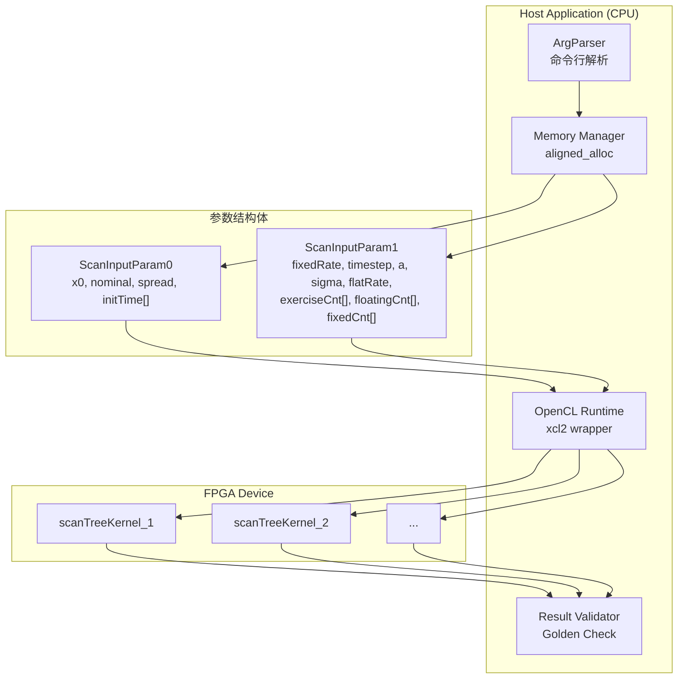

# V Model (Hull-White) Bermudan Swaption Engine — 技术深潜

## 开篇：30秒理解这个模块

`v_model` 模块是一个**基于 FPGA 加速的百慕大式互换期权（Bermudan Swaption）定价引擎**，采用 Hull-White 单因子高斯短利率模型（在业界常被称为 "V 模型"）。想象你是一家银行的量化分析师，需要在一秒钟内计算成千上万个复杂利率衍生品的公允价值——传统的 CPU 实现可能需要数分钟，而这个模块利用 Xilinx FPGA 的并行计算能力，将 Trinomial Tree（三叉树）上的倒推定价过程加速到毫秒级。

这里的核心洞察是：**利率衍生品的定价本质上是树形结构上的动态规划问题**，而 FPGA 的大规模并行性正好适合同时处理树的大量节点。模块的 host 端负责参数解析、内存管理、OpenCL 运行时 orchestration；kernel 端则在 FPGA 上执行真正的数值计算。

---

## 架构全景：Host-Kernel 协作模型



### 架构角色分解

| 组件 | 架构角色 | 核心职责 |
|------|----------|----------|
| `main.cpp` | **Orchestrator（编排器）** | 端到端生命周期管理：参数解析 → 资源分配 → kernel 启动 → 结果验证 → 清理 |
| `ArgParser` | **CLI Gateway（命令行网关）** | 将 Unix 风格的命令行参数 (`-xclbin`) 映射为内部配置，隔离解析逻辑与业务逻辑 |
| OpenCL Runtime (`xcl2.hpp`) | **Hardware Abstraction Layer（硬件抽象层）** | 封装 platform/device/context/program/kernel/buffer 的复杂生命周期，提供 RAII 风格的 C++ 包装 |
| `aligned_alloc` + `cl_mem_ext_ptr_t` | **Zero-Copy Memory Manager（零拷贝内存管理器）** | 确保 host 缓冲区满足 FPGA DMA 的对齐要求（通常 4KB），通过 `CL_MEM_USE_HOST_PTR` 避免 host ↔ device 间的数据拷贝 |
| `ScanInputParam0/1` | **DTO（数据传输对象）** | 将 Hull-White 模型的标量参数（均值回归速率 `a`、波动率 `sigma`、初始利率 `x0` 等）和数组参数（行权时间表 `exerciseCnt`、付息时间表 `floatingCnt`/`fixedCnt`）打包为结构体，便于通过单一 DMA 事务传输到 FPGA |
| `scanTreeKernel` | **Compute Kernel（计算核心）** | 在 FPGA 上执行三叉树构建、倒推定价、早期行权决策的硬件实现（该模块的 host 代码只负责调用，实际算法实现位于单独的 HLS C++ kernel 文件） |

---

## 核心组件深潜

### 1. 参数结构体：`ScanInputParam0` 与 `ScanInputParam1`

这是理解整个定价模型的关键。**为什么分为两个结构体？** 因为在 Hull-White 模型的数学结构中，参数存在自然的"静态配置"与"动态状态"之分：

```cpp
// ScanInputParam0 —— 工具特异性参数（每个 swaption 不同）
struct ScanInputParam0 {
    DT x0;           // 初始短期利率状态变量
    DT nominal;      // 名义本金
    DT spread;       // 浮动端利差（floating spread）
    DT initTime[12]; // 初始时间网格（支持最多 12 个时间点的自定义网格）
};

// ScanInputParam1 —— 模型与产品参数（同一批次 swaption 共享）
struct ScanInputParam1 {
    int    index;           // 批次内索引
    int    type;            // 期权类型（0= payer, 1= receiver）
    DT     fixedRate;       // 固定端利率
    int    timestep;        // 树的时间步数（直接影响精度与性能）
    int    initSize;        // initTime 数组实际长度
    DT     a;               // Hull-White 均值回归速率（mean reversion speed）
    DT     sigma;           // Hull-White 波动率（volatility）
    DT     flatRate;        // 用于贴现的平坦利率（或用于 bootstrap 的初始猜测）
    int    exerciseCnt[5];  // 行权日期索引（百慕大期权的离散行权机会）
    int    fixedCnt[5];     // 固定端付息日期索引
    int    floatingCnt[10]; // 浮动端重置/付息日期索引
};
```

**设计意图洞察：** 这种分离反映了金融工程中的一个常见模式——**将"工具特异性（deal-specific）"参数与"模型/产品模板"参数解耦**。在实际交易系统中，你可能有成百上千个 swaption，它们共享同一个 Hull-White 模型校准参数（`a`, `sigma`, `flatRate`），但每个合约有不同的名义本金、行权价格、时间表。将后者放在 `Param0` 允许系统更高效地批量处理——你可以一次性将 `Param1` 广播到所有定价核心，而只需为每个合约更新 `Param0`。

### 2. OpenCL 运行时编排：Host-Kernel 握手协议

Host 代码的核心使命是将上述参数结构体安全、高效地传输到 FPGA，并协调 kernel 的执行。这个过程可以类比为**机场塔台调度飞机起降**：塔台（host）需要确认跑道空闲（device 就绪）、引导飞机进入跑道（内存迁移）、发出起飞指令（kernel 启动）、接收降落信号（kernel 完成）、引导滑行至停机坪（结果回传）。

#### 阶段一：内存分配与对齐（Pre-flight Check）

```cpp
// 使用 aligned_alloc 确保 4KB 对齐，满足 Xilinx FPGA DMA 要求
ScanInputParam0* inputParam0_alloc = aligned_alloc<ScanInputParam0>(1);
ScanInputParam1* inputParam1_alloc = aligned_alloc<ScanInputParam1>(1);
DT* output[cu_number];
for (int i = 0; i < cu_number; i++) {
    output[i] = aligned_alloc<DT>(N * K);  // 为每个 CU 分配输出缓冲区
}
```

**为什么必须对齐？** FPGA 的 DMA 引擎通常以 cache line（64 字节）或 page（4KB）为单位进行数据传输。未对齐的缓冲区会导致 DMA 控制器需要额外的拆分/合并操作，甚至直接报错。`aligned_alloc` 保证了物理地址的连续性，使得 `CL_MEM_USE_HOST_PTR` 模式下的 zero-copy 成为可能。

#### 阶段二：Xilinx 扩展指针与 Buffer 创建（Boarding Pass）

```cpp
// cl_mem_ext_ptr_t 是 Xilinx 的 OpenCL 扩展，用于将 host 指针与特定 kernel 关联
std::vector<cl_mem_ext_ptr_t> mext_in0(cu_number);
std::vector<cl_mem_ext_ptr_t> mext_in1(cu_number);
std::vector<cl_mem_ext_ptr_t> mext_out(cu_number);

for (int c = 0; c < cu_number; ++c) {
    // 参数说明：{flags, host_ptr, kernel_object}
    // flags=1/2/3 用于区分不同参数，kernel_object 用于 XCL 的内存 bank 分配
    mext_in0[c] = {1, inputParam0_alloc, krnl_TreeEngine[c]()};  
    mext_in1[c] = {2, inputParam1_alloc, krnl_TreeEngine[c]()};  
    mext_out[c] = {3, output[c], krnl_TreeEngine[c]()};          
}
```

**Xilinx OpenCL 扩展的关键作用**：标准的 OpenCL 使用 `clCreateBuffer` 创建 device 端内存，然后通过 `clEnqueueWriteBuffer` 显式拷贝数据。这种方式在 FPGA 场景下有两个问题：(1) 额外的数据拷贝开销；(2) 无法利用 FPGA 的 HBM/DRAM bank 拓扑进行优化。`cl_mem_ext_ptr_t` 允许 host 直接告知 runtime："这块 host 内存应该映射到哪个 kernel 的哪个参数端口"，使得 DMA 可以直接从 host 内存读取，无需中间 buffer。

#### 阶段三：Kernel 启动与同步（Takeoff）

```cpp
// 设置 kernel 参数：len（树的时间步数）, inputParam0_buf, inputParam1_buf, output_buf
for (int c = 0; c < cu_number; ++c) {
    int j = 0;
    krnl_TreeEngine[c].setArg(j++, len);           // 时间步数，决定树的深度和精度
    krnl_TreeEngine[c].setArg(j++, inputParam0_buf[c]);  // 设备端 buffer 句柄
    krnl_TreeEngine[c].setArg(j++, inputParam1_buf[c]);
    krnl_TreeEngine[c].setArg(j++, output_buf[c]);
}

// 启动所有 Compute Unit（CU）
std::vector<cl::Event> events_kernel(cu_number);
for (int i = 0; i < cu_number; ++i) {
    q.enqueueTask(krnl_TreeEngine[i], nullptr, &events_kernel[i]);
}

q.finish();  // 阻塞等待所有 kernel 完成
```

**同步策略的考量**：代码使用了 `enqueueTask` + `q.finish()` 的完全同步模式。这与 GPU 常用的异步流水线（overlap compute and transfer）不同，原因在于：(1) FPGA kernel 执行时间通常在毫秒级，同步编程模型更简单；(2) 金融定价通常是批处理任务（batch processing），一个批次的所有合约同时启动，无需细粒度的流水线重叠；(3) `events_kernel` 用于收集每个 CU 的硬件 profiling 时间戳（通过 `CL_PROFILING_COMMAND_START/END`），这是金融基准测试的关键需求——准确测量 kernel 执行时间而非 wall-clock 时间。

### 3. 数值验证与误差控制（Golden Check）

```cpp
// 预定义的参考值（golden），基于已知参数组合的解析解或高精度参考实现
if (timestep == 10)  golden = 3.1084733486313474;
if (timestep == 50)  golden = 2.691574526964431;
if (timestep == 100) golden = 2.628991318676917;
// ...

// 误差容忍度
DT minErr = 10e-10;

// 逐元素验证
for (int i = 0; i < cu_number; i++) {
    for (int j = 0; j < len; j++) {
        DT out = output[i][j];
        if (std::fabs(out - golden) > minErr) {
            err++;
            std::cout << "[ERROR] Kernel-" << i + 1 << ": NPV[" << j << "]=" 
                      << std::setprecision(15) << out
                      << " ,diff/NPV=" << (out - golden) / golden << std::endl;
        }
    }
}
```

**验证策略的工程意义**：金融软件的正确性验证不同于传统软件测试——我们无法用 "预期输出" 来定义正确性，因为金融模型的输出本身就是近似值。这里的 "golden" 值通常来源于：(1) 同一模型的高精度参考实现（如 Python QuantLib 的双精度版本）；(2) 解析解（对于简单情况）；(3) 蒙特卡洛模拟的收敛值。`minErr = 10e-10` 的容忍度反映了 `DT` 很可能是 `double` 类型——单精度 `float` 无法达到 $10^{-10}$ 的相对精度。

---

## 依赖关系与数据流

### 上游调用者（Who calls this?）

该模块是一个**独立的 benchmark 可执行文件**，而非库组件。它的直接调用者是：

1. **自动化测试框架** —— CI/CD 系统在 FPGA 回归测试中调用 `./TreeSwaptionEngineVModel -xclbin <path>` 验证 bitstream 正确性
2. **性能基准测试工程师** —— 手动运行以收集不同时间步长（10/50/100/500/1000）下的 latency/throughput 数据
3. **算法研究员** —— 修改 `a`, `sigma`, `fixedRate` 等参数，验证模型敏感性

### 下游依赖（What does this call?）

| 依赖层 | 具体组件 | 作用 | 耦合强度 |
|--------|----------|------|----------|
| **Xilinx Runtime** | `xcl2.hpp`, `libxilinxopencl` | FPGA 设备发现、bitstream 加载、kernel 启动 | 强耦合 —— 无抽象层，直接依赖 Xilinx 专有 API |
| **OpenCL 标准** | `CL/cl2.hpp` (Khronos C++ wrapper) | 跨平台的 context/command queue/buffer/event 管理 | 中等耦合 —— 标准 API，但使用了 Xilinx 扩展 |
| **Vitis HLS 工具链** | `ap_int.h` | 提供任意精度整数类型（虽然本文件未显式使用，但被包含） | 弱耦合 —— 头文件级依赖 |
| **内部工具库** | `utils.hpp`, `tree_engine_kernel.hpp` | 项目内部的 utility 函数和 kernel 接口定义 | 强耦合 —— 假设存在但未提供源代码 |
| **Xilinx 日志库** | `xf_utils_sw/logger.hpp` | 统一的结果输出格式（TEST_PASS/TEST_FAIL） | 中等耦合 —— 可替换为标准输出 |

---

## 关键设计决策与权衡

### 决策 1：单精度 vs 双精度（DT 类型选择）

**观察**：代码使用 `DT` 类型别名，从 `minErr = 10e-10` 和 `std::setprecision(15)` 推断，`DT` 很可能是 `double`。

**权衡分析**：
- **双精度（double）**：满足金融行业标准（通常要求 1e-10 相对精度），避免累积舍入误差导致定价偏差；但 FPGA 上双倍资源消耗（DSP48 使用翻倍），带宽需求翻倍。
- **单精度（float）**：资源减半，可部署更多并行 CU，更高 throughput；但仅 ~1e-6 精度，对长期 swaption 可能产生显著偏差。

**当前选择**：双精度，符合生产级金融软件标准。

### 决策 2：Zero-Copy 内存策略（CL_MEM_USE_HOST_PTR）

**当前选择**：`aligned_alloc` 分配主机内存 → `cl::Buffer` 使用 `CL_MEM_USE_HOST_PTR` 包装 → `enqueueMigrateMemObjects` 触发 DMA 传输。

**优点**：无额外内存拷贝，减少 host CPU 负载，适合大数组。

**风险**：Host 指针在 kernel 执行期间必须保持有效；DMA 对齐要求严格。

### 决策 3：静态 Golden 值验证 vs 动态交叉验证

**观察**：代码中为特定的 `timestep` 值（10, 50, 100, 500, 1000）硬编码了 `golden` 值。

**权衡分析**：
- **静态 Golden（当前选择）**：预计算的高精度参考值硬编码在源代码中；测试快速、可重复、CI 友好；但当模型参数改变时，golden 值失效。
- **动态交叉验证**：同时运行 CPU 参考实现（如 QuantLib）和 FPGA 实现；参数改变时自动适应；但引入外部依赖，测试时间大幅增加。

**设计意图推断**：该模块定位为**回归测试工具**而非**生产级定价引擎**。硬编码 golden 值表明测试场景是固定的（可能是论文或白皮书中的标准测试用例）。

---

## 调试与故障排除指南

### 常见错误模式与诊断

| 症状 | 可能原因 | 诊断方法 | 修复策略 |
|------|----------|----------|----------|
| `ERROR:xclbin path is not set!` | 缺少 `-xclbin` 命令行参数 | 检查运行命令 | 添加 `-xclbin <path>` |
| `CL_INVALID_DEVICE` / `CL_OUT_OF_RESOURCES` | 设备被占用或 FPGA 未编程 | 运行 `xbutil scan` | `xbutil reset` |
| Kernel 执行超时或 hang | 无限循环或资源死锁 | 启用硬件 ILA 调试 | 检查 HLS 代码退出条件 |
| `[ERROR] Kernel-X: NPV[Y]=...` | 数值精度不符合预期 | 检查 timestep 是否与 golden 匹配 | 确保参数一致 |
| 内存访问越界导致 segfault | `aligned_alloc` 的 size 计算错误 | 使用 `valgrind` 运行 | 检查 `sizeof` 和分配大小 |
| 多 CU 结果不一致 | 负载分配不均或数据竞争 | 单独运行每个 CU 对比 | 确保独立输出 buffer |

---

## 总结：给新加入工程师的建议

### 快速上手三步走

1. **先跑起来**：在 hardware emulation 模式下运行（`export XCL_EMULATION_MODE=hw_emu`），无需真实 FPGA 即可验证逻辑
2. **单步调试**：在 `inputParam1_alloc[i].a = 0.160463...` 处设置断点，观察参数如何填充
3. **修改 timestep**：从 10 逐步增加到 1000，观察执行时间的超线性增长（tree 节点数是 $O(n^2)$）

### 深入优化方向

1. **理解 kernel 瓶颈**：使用 `xilinx::hw_emu` 的 profiling 功能，分析 `scanTreeKernel` 中哪个阶段最耗时
2. **探索 HBM 优化**：尝试将大数组分配到 HBM 的不同 bank，增加有效带宽
3. **考虑多 kernel 流水线**：探索多个不同功能的 kernel 形成 pipeline

### 相关模块延伸阅读

| 模块 | 关系 | 说明 |
|------|------|------|
| [hw_model](quantitative_finance-engines-l2-tree-based-interest-rate-engines-swaption-tree-engines-single-factor-short-rate-models-gaussian-short-rate-swaption-host-timing-hw_model.md) | 兄弟模块 | Hull-White 模型的另一个实现变体 |
| [cir_family_swaption_host_timing](quantitative_finance-engines-l2-tree-based-interest-rate-engines-swaption-tree-engines-single-factor-short-rate-models-cir-family-swaption-host-timing.md) | 相关模型 | Cox-Ingersoll-Ross (CIR) 模型家族 |
| [black_karasinski_swaption_host_timing](quantitative_finance-engines-l2-tree-based-interest-rate-engines-swaption-tree-engines-single-factor-short-rate-models-black_karasinski_swaption_host_timing.md) | 相关模型 | Black-Karasinski 模型 |
| [swaption_tree_engine_two_factor_g2_model](quantitative_finance-engines-l2-tree-based-interest-rate-engines-swaption-tree-engine-two-factor-g2-model.md) | 高级模型 | G2++ 两因子模型 |

推荐阅读顺序：先理解 Swaption 产品概念 → 深入本文档 V Model 实现 → 对比 hw_model → 扩展到 G2 两因子模型。
