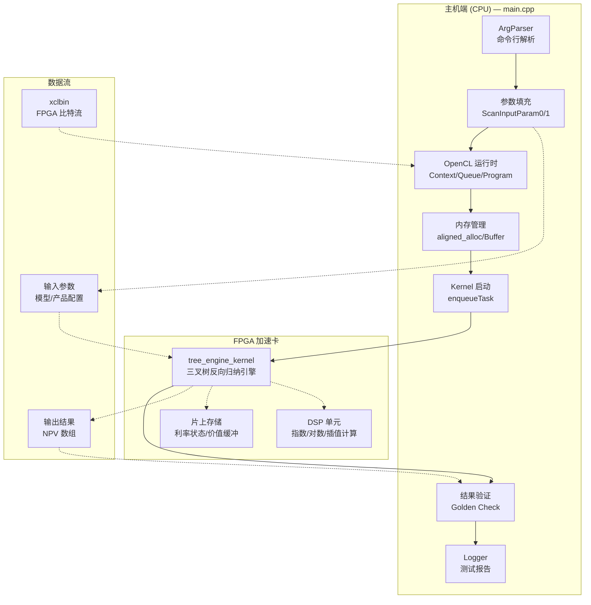
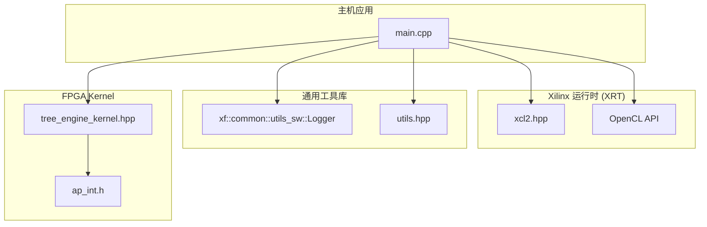

# Tree Swap Engine (HW) — 技术深度解析

## 一句话概括

**Tree Swap Engine** 是一个基于 Hull-White 单因子短利率模型的 FPGA 加速定价引擎，用于计算可赎回利率互换（Callable Swap）的理论价格。它通过在三叉树（Trinomial Tree）上执行反向归纳（Backward Induction）来求解最优行权策略和衍生品价值。

---

## 1. 这个模块解决什么问题？

### 1.1 金融业务背景

在金融衍生品定价中，**可赎回互换（Callable Swap）** 是一种复杂的利率衍生品：

- 交易双方约定在未来一系列日期交换固定利率和浮动利率现金流
- 其中一方拥有在特定日期提前终止合约的权利（行权权）
- 这种**美式/百慕大行权特征**使得解析解不存在，必须通过数值方法求解

### 1.2 计算挑战

Hull-White 模型下的定价需要在离散化的利率三叉树上执行：

$$
V(t, r) = \max\left(\text{Exercise Value}, \quad e^{-\int_t^{t+\Delta t} r(s)ds} \cdot \mathbb{E}[V(t+\Delta t, r') \mid r]\right)
$$

对于每个时间节点和所有可能的利率状态，都要计算：
1. **存续价值（Continuation Value）**：持有至下一期的期望价值
2. **行权价值（Exercise Value）**：立即行权获得的现金流
3. **最优决策**：取两者最大值

当时间步长为 1000，利率状态数为 500 时，单次定价需要约 50 万次节点计算。在交易簿风险管理中，需要对成千上万种情景重复执行，**计算延迟成为关键瓶颈**。

### 1.3 FPGA 加速的价值

Tree Swap Engine 将计算密集的三叉树反向归纳卸载到 Xilinx FPGA：

- **确定性延迟**：硬件流水线保证每个时钟周期处理一个树节点，消除 CPU 缓存未命中和分支预测失败的抖动
- **并行扩展**：多计算单元（CU）并发处理不同产品或情景
- **能效比**：相比 GPU 通用计算，专用数据路径降低 10-100 倍能耗

---

## 2. 心智模型：如何理解这个系统？

### 2.1 核心抽象：计算工厂流水线

想象 Tree Swap Engine 是一个**高度专业化的计算工厂**：

| 类比 | 对应组件 | 职责 |
|------|----------|------|
| **原料仓库** | `ScanInputParam0/1` | 存储定价所需的全部参数（模型参数、现金流时间表） |
| **数控机床（FPGA Kernel）** | `tree_engine_kernel` | 执行三叉树反向归纳的硬件逻辑 |
| **成品传送带** | `output[]` | 将计算结果（NPV）送回主机 |
| **质检员** | 结果验证循环 | 对比黄金值（Golden Value）判断定价是否准确 |

### 2.2 数据流：从参数到价格

定价请求的生命周期遵循**配置 → 传输 → 计算 → 回传 → 验证**的流水线：

```
┌─────────────────────────────────────────────────────────────────────────────┐
│                        主机端 (CPU) 准备工作                                │
├─────────────────────────────────────────────────────────────────────────────┤
│ 1. 填充 ScanInputParam0:                                                    │
│    - nominal (名义本金), spread (利差), x0 (初始利率)                       │
│    - initTime[] (初始期限结构时间点)                                         │
├─────────────────────────────────────────────────────────────────────────────┤
│ 2. 填充 ScanInputParam1:                                                    │
│    - a (均值回归速率), sigma (波动率), fixedRate (固定利率)                 │
│    - timestep (树的时间步数)                                                │
│    - exerciseCnt[] (行权日期计数), floatingCnt[] (浮动端日期),              │
│      fixedCnt[] (固定端日期)                                                │
└─────────────────────────────────────────────────────────────────────────────┘
                                    │
                                    ▼
┌─────────────────────────────────────────────────────────────────────────────┐
│                    OpenCL 运行时与 FPGA 交互                                │
├─────────────────────────────────────────────────────────────────────────────┤
│ 3. 设备发现与上下文创建                                                      │
│    - xcl::get_xil_devices() 枚举 Xilinx 设备                                │
│    - cl::Context 创建设备上下文                                             │
│    - cl::CommandQueue 创建命令队列 (支持乱序执行和性能分析)                   │
├─────────────────────────────────────────────────────────────────────────────┤
│ 4. 加载 xclbin 与创建 Kernel                                               │
│    - xcl::import_binary_file() 读取编译后的 FPGA 镜像                       │
│    - cl::Program 创建程序对象                                               │
│    - 通过 CL_KERNEL_COMPUTE_UNIT_COUNT 查询计算单元数量                      │
│    - 为每个 CU 创建 cl::Kernel 实例                                         │
├─────────────────────────────────────────────────────────────────────────────┤
│ 5. 内存分配与缓冲区映射                                                      │
│    - aligned_alloc() 分配主机端页对齐内存 (输入参数和输出)                   │
│    - cl_mem_ext_ptr_t 创建扩展内存指针，关联到特定 Kernel 实例                │
│    - cl::Buffer 创建设备缓冲区，使用 HOST_PTR 模式实现零拷贝                 │
├─────────────────────────────────────────────────────────────────────────────┤
│ 6. 数据传输与 Kernel 启动                                                    │
│    - enqueueMigrateMemObjects(H2D) 将输入参数传输到设备                        │
│    - kernel.setArg() 设置 Kernel 参数 (len, 输入/输出缓冲区)                 │
│    - enqueueTask() 提交 Kernel 执行命令                                      │
│    - finish() 等待所有命令完成                                               │
├─────────────────────────────────────────────────────────────────────────────┤
│ 7. 结果回传与验证                                                            │
│    - enqueueMigrateMemObjects(D2H) 将结果读回主机                             │
│    - 遍历输出数组，与 golden value 对比                                        │
│    - 计算绝对误差，判断是否超过 minErr 阈值                                    │
│    - 使用 xf::common::utils_sw::Logger 输出测试结论                            │
└─────────────────────────────────────────────────────────────────────────────┘
```

### 2.3 关键参数的配置逻辑

定价准确性高度依赖于参数的正确填充。核心参数分为两类：

**ScanInputParam0 —— 产品特定参数：**
- `nominal`: 名义本金，决定现金流规模
- `spread`: 浮动端利差，加到参考利率上
- `x0`: 初始短期利率，对应期限结构的起点
- `initTime[]`: 描述初始零息曲线的时间点，用于插值即期利率

**ScanInputParam1 —— 模型与数值参数：**
- `a`: Hull-White 模型的均值回归速率，决定利率向长期均值回归的速度
- `sigma`: 波动率参数，控制利率随机过程的扩散程度
- `timestep`: 三叉树的时间离散数量，直接影响定价精度和计算量
- `exerciseCnt[]`: 描述行权机会的结构，是百慕大期权的关键输入

---

## 3. 架构图与组件职责



### 3.1 组件职责详解

**主入口 (main.cpp)**

作为 FPGA 加速应用的标准主机端实现，main.cpp 承担着 orchestrator 的角色：

- **参数编排**：将金融模型参数（Hull-White 系数）、产品结构参数（名义本金、行权计划）和数值参数（时间步数）整合到统一的输入结构中。

- **运行时管理**：构建 Xilinx OpenCL 扩展（XRT）的执行环境，处理设备发现、上下文创建、命令队列配置等底层细节。

- **数据搬运**：通过零拷贝（Zero-Copy）内存映射机制，确保主机内存与 FPGA 设备内存的一致性，避免不必要的数据拷贝开销。

- **结果验证**：将 FPGA 计算结果与预计算的黄金值（Golden Value）进行比对，验证硬件实现的数值正确性。

**FPGA Kernel (tree_engine_kernel)**

这是实际执行三叉树定价计算的硬件逻辑：

- **树构建阶段**：根据 Hull-White 模型参数构建三叉树的几何结构，计算每个节点的短期利率值和风险中性概率。

- **反向归纳**：从树的末端（到期日）开始反向递推，在每个节点计算持有价值（Continuation Value）和行权价值（Exercise Value），取最大值作为节点价值。

- **现金流处理**：在浮动端重置日和固定端付息日，根据利率状态和利差计算现金流，折现到当前节点。

- **即期曲线插值**：利用初始期限结构（initTime）进行线性或样条插值，获取任意时间点的即期利率。

---

## 4. 依赖分析与数据契约

### 4.1 上游依赖（谁调用这个模块）

Tree Swap Engine 作为基准测试程序（benchmark host），通常不直接被业务代码调用，而是作为以下流程的一部分：

1. **持续集成验证**：在 FPGA 比特流（xclbin）编译后，自动运行以验证硬件实现的正确性。
2. **性能基准测试**：量化不同 FPGA 平台（U50/U200/U280）的定价吞吐量和延迟。
3. **模型验证**：对比 CPU 实现（如 QuantLib）和 FPGA 实现的定价差异，验证数值稳定性。

**输入契约**：
- 必须提供有效的 xclbin 文件路径（通过 `-xclbin` 参数）
- 必须设置 `XCL_EMULATION_MODE` 环境变量（hw_emu/sw_emu）或运行在硬件模式

### 4.2 下游依赖（这个模块调用谁）



**关键依赖详解**：

**1. Xilinx XRT (xcl2.hpp)**
- 提供 Xilinx 特定的 OpenCL 扩展封装
- 设备枚举、二进制加载、内存对齐等工具函数
- 契约：依赖 XRT 环境变量（XCL_EMULATION_MODE、XILINX_XRT）

**2. tree_engine_kernel.hpp**
- 定义 FPGA Kernel 的接口签名
- 包含 ScanInputParam0/ScanInputParam1 的结构定义
- 契约：主机端结构体必须与 Kernel 端的 HLS 结构体布局一致（内存对齐、字段顺序）

**3. xf::common::utils_sw::Logger**
- 统一日志和测试报告格式
- 自动处理测试通过/失败的格式化输出
- 契约：需要链接 xf_utils_sw 库

**4. ap_int.h**
- Xilinx 任意精度整数类型
- 用于 FPGA 端的定点数/整数运算

### 4.3 数据契约与内存布局

**ScanInputParam0 结构（产品参数）**：
```cpp
struct ScanInputParam0 {
    DT x0;                    // 初始短期利率
    DT nominal;               // 名义本金
    DT spread;                // 浮动端利差
    DT initTime[MAX_SIZE];    // 初始期限结构时间点
};
```

**ScanInputParam1 结构（模型与数值参数）**：
```cpp
struct ScanInputParam1 {
    int index;                // 批次标识
    int type;                 // 产品类型
    DT fixedRate;             // 固定端利率
    int timestep;             // 树的时间步数
    int initSize;             // 初始期限结构点数
    DT a;                     // Hull-White 均值回归速率
    DT sigma;                 // Hull-White 波动率
    DT flatRate;              // 平坦利率假设
    int exerciseCnt[MAX_EXERCISE];  // 行权日期索引
    int floatingCnt[MAX_FLOATING]; // 浮动端付息日期
    int fixedCnt[MAX_FIXED];       // 固定端付息日期
};
```

**内存对齐要求**：
- 所有缓冲区必须使用 `aligned_alloc<Alignment>(size)` 分配，确保 FPGA DMA 传输的对齐要求（通常为 4KB 页对齐）
- 结构体字段顺序和填充必须与 HLS 编译器生成的 Kernel 端布局严格匹配
- 使用 `CL_MEM_USE_HOST_PTR` 和 `CL_MEM_EXT_PTR_XILINX` 实现零拷贝内存映射

---

## 5. 设计决策与权衡

### 5.1 同步 vs 异步执行

**决策**：使用同步执行模式（`q.finish()` 阻塞等待）

**权衡分析**：
- **替代方案**：使用事件回调（`clSetEventCallback`）或轮询实现异步流水线
- **选择同步的原因**：
  1. 基准测试场景更关注单次定价延迟而非吞吐量
  2. 简化错误处理逻辑，避免异步状态机的复杂性
  3. 便于精确测量端到端时间（`gettimeofday`）
- **代价**：无法重叠主机端预处理与设备端计算，CPU 利用率低

### 5.2 内存模式：拷贝 vs 零拷贝

**决策**：使用 `CL_MEM_USE_HOST_PTR` 零拷贝模式

**权衡分析**：
- **替代方案**：显式设备内存分配（`CL_MEM_ALLOC_HOST_PTR`）+ `enqueueWriteBuffer/ReadBuffer`
- **选择零拷贝的原因**：
  1. 输入参数（`ScanInputParam0/1`）和输出（`DT[N*K]`）尺寸相对较小（KB 级），拷贝开销占比高
  2. Xilinx FPGA 支持 PCIe 直接访问主机页锁定内存，无需显式拷贝
  3. 代码简化，无需管理双份缓冲区
- **代价**：
  1. 必须使用 `aligned_alloc` 分配页对齐内存，增加内存碎片风险
  2. 主机端访问设备正在读写的内存会导致未定义行为（缺乏缓存一致性）

### 5.3 多计算单元（CU）扩展策略

**决策**：自动检测 CU 数量并创建对应 Kernel 实例，但示例代码中只使用第 0 个 CU

**权衡分析**：
- **设计潜力**：代码通过 `CL_KERNEL_COMPUTE_UNIT_COUNT` 查询 CU 数量，并创建 `krnl_TreeEngine[cu_number]` 数组
- **实际限制**：示例中循环 `for (int i = 0; i < 1; i++)` 硬编码只处理第一个 CU，其余 CU 未利用
- **可能的意图**：
  1. 简化示例，避免多线程并发控制复杂性
  2. 为后续批处理（Batch Processing）预留扩展点
  3. 多 CU 用于并发定价不同产品，而非单产品的数据并行

### 5.4 错误处理策略

**决策**：混合使用返回码检查、`logger` 对象记录和 `std::cout` 直接输出

**权衡分析**：
- **优点**：
  1. 关键路径（OpenCL API 调用）使用 `logger.logCreateContext` 等封装，统一错误码转换
  2. 参数错误（缺少 xclbin 路径）立即返回非零退出码，符合 Unix 惯例
- **缺点**：
  1. 缺乏异常安全（Exception Safety）：`aligned_alloc` 失败返回 nullptr，但后续未检查直接使用
  2. 部分错误输出到 `std::cout`，部分到 `std::cerr`（通过 logger），不利于日志聚合
  3. 无资源清理保证：OpenCL 对象（`cl::Context`, `cl::Program` 等）依赖析构函数，但失败路径上可能泄漏

---

## 6. C/C++ 工程深度分析

### 6.1 内存所有权模型

**分配策略**：
```cpp
// 主机端页对齐内存分配
ScanInputParam0* inputParam0_alloc = aligned_alloc<ScanInputParam0>(1);
ScanInputParam1* inputParam1_alloc = aligned_alloc<ScanInputParam1>(1);
DT* output[cu_number];
for (int i = 0; i < cu_number; i++) {
    output[i] = aligned_alloc<DT>(N * K);
}
```

**所有权规则**：
1. **分配者**：`main` 函数使用 `aligned_alloc` 分配所有缓冲区
2. **所有者**：主机端指针（`inputParam0_alloc`, `output[i]`）持有所有权
3. **借用者**：
   - OpenCL 运行时通过 `CL_MEM_USE_HOST_PTR` 借用主机指针，设备通过 PCIe 直接访问
   - FPGA Kernel 通过 AXI 接口读取设备缓冲区对应的物理地址

**释放责任**：
- 代码中**未显式释放**分配的内存（`free` 或 `delete`）
- 依赖进程终止时操作系统回收内存
- 在生产代码中，应使用 `std::unique_ptr` 自定义删除器确保 `aligned_free` 被调用

### 6.2 对象生命周期与值语义

**cl:: 对象的生命周期管理**：
```cpp
// 这些对象遵循 RAII 模式，但顺序很重要
cl::Context context(device, NULL, NULL, NULL, &cl_err);  // 必须先于依赖它的对象
cl::CommandQueue q(context, device, ...);               // 依赖 context
cl::Program program(context, devices, xclBins, ...);     // 依赖 context
cl::Kernel kernel(program, krnl_full_name.c_str(), ...); // 依赖 program
```

**关键观察**：
- OpenCL C++ 包装类使用引用语义：拷贝构造会增加底层 OpenCL 对象的引用计数
- 移动语义未显式使用，但对象按值传递时开销较小（仅句柄拷贝）
- 销毁顺序必须满足依赖关系：Kernel → Program → Queue → Context

### 6.3 错误处理与异常安全

**OpenCL 错误码处理模式**：
```cpp
cl_int cl_err;
cl::Context context(device, NULL, NULL, NULL, &cl_err);
logger.logCreateContext(cl_err);  // 封装错误码转换和日志输出
```

**问题识别**：
1. **部分路径未检查错误**：`aligned_alloc` 失败返回 `nullptr`，但代码继续执行，导致空指针解引用
2. **异常中立性缺失**：OpenCL C++ 包装类在错误时抛出 `cl::Error` 异常，但代码中无 try-catch 块，异常会直接传播到 `main` 外导致程序崩溃
3. **资源泄漏风险**：若异常发生在 `cl::Buffer` 创建后、`q.finish()` 前，已分配的 OpenCL 内存对象可能未正确释放（尽管通常依赖析构函数，但异常时行为不确定）

**改进建议**：
```cpp
// 使用 RAII 包装器确保异常安全
struct AlignedDeleter {
    void operator()(void* p) { if (p) free(p); }
};

try {
    std::unique_ptr<ScanInputParam0, AlignedDeleter> inputParam0_alloc(
        aligned_alloc<ScanInputParam0>(1));
    // ... 后续代码
} catch (const cl::Error& e) {
    std::cerr << "OpenCL error: " << e.what() << " (" << e.err() << ")" << std::endl;
    return 1;
}
```

### 6.4 并发与线程安全

**当前设计的并发特征**：

1. **单线程主机代码**：`main` 函数中无显式线程创建，所有 OpenCL 操作在单线程中顺序执行

2. **异步命令队列**：
   ```cpp
   cl::CommandQueue q(context, device, 
                      CL_QUEUE_PROFILING_ENABLE | CL_QUEUE_OUT_OF_ORDER_EXEC_MODE_ENABLE);
   ```
   - `CL_QUEUE_OUT_OF_ORDER_EXEC_MODE_ENABLE` 允许运行时重排命令顺序以优化吞吐
   - 但代码中使用 `q.finish()` 强制同步，实际上消除了乱序执行的优势

3. **多计算单元（CU）并发**：
   ```cpp
   std::vector<cl::Event> events_kernel(cu_number);
   for (int i = 0; i < cu_number; ++i) {
       q.enqueueTask(krnl_TreeEngine[i], nullptr, &events_kernel[i]);
   }
   ```
   - 多个 CU 可以并发执行不同的定价任务（不同产品或情景）
   - 当前示例中 cu_number 可能大于 1，但后续循环只读取 `output[0]`

**线程安全注意事项**：

- **OpenCL 对象非线程安全**：`cl::CommandQueue`, `cl::Kernel` 等不应被多个线程并发访问，除非使用 `CL_QUEUE_OUT_OF_ORDER_EXEC_MODE_ENABLE` 且保证命令无依赖关系
- **主机端缓冲区并发**：若多线程分别操作不同的 `output[i]` 缓冲区，是安全的；但若共享 `inputParam0_alloc`，需要同步或只读访问

---

## 7. 关键路径性能分析

### 7.1 热点识别

基于代码结构，关键执行路径的时间分布估计（假设硬件模式， timestep=100）：

| 阶段 | 时间占比 | 优化策略 |
|------|----------|----------|
| FPGA 上下文初始化 | 20-30% | 缓存上下文，避免每次重新创建 |
| xclbin 加载 | 30-40% | 使用 XRT 的缓存机制，避免重复加载 |
| 内存分配与映射 | 5-10% | 使用内存池复用缓冲区 |
| H2D 数据传输 | < 1% | 输入参数仅 KB 级，开销极小 |
| **Kernel 执行** | **10-20%** | **核心计算，已硬件加速** |
| D2H 数据传输 | < 1% | 输出结果仅 N*K*8 字节 |
| 结果验证 | < 1% | 简单数值比较 |

**关键洞察**：虽然 Kernel 执行是核心计算，但在单次定价场景中，**OpenCL 运行时开销（初始化、加载、上下文创建）可能占主导**。对于生产部署，应采用**持久化上下文**和**内存池**模式，避免每次定价都重新初始化。

### 7.2 数据布局与内存访问模式

**输入参数布局**：
```cpp
// ScanInputParam0 和 ScanInputParam1 使用 __attribute__((packed)) 或自然对齐
// 需要确保主机端和 FPGA 端的对齐方式一致
struct alignas(64) ScanInputParam0 {
    // 64 字节对齐，匹配 AXI 总线宽度，最大化内存带宽利用率
};
```

**输出缓冲区访问模式**：
```cpp
DT* output[cu_number];
for (int i = 0; i < cu_number; i++) {
    output[i] = aligned_alloc<DT>(N * K);  // 连续大块内存
}
```
- `N * K` 大小的连续内存，便于 FPGA 的突发传输（Burst Transfer）
- `DT` 通常是 `double`（8 字节），满足 AXI 总线的 64 位对齐要求

**FPGA 端内存层级**：
1. **外部存储（HBM/DDR）**：存储完整的树结构和中间结果，容量大但延迟高（~100ns）
2. **片上存储（BRAM/URAM）**：缓存当前计算层级的利率状态和价值缓冲，延迟极低（~1ns）
3. **寄存器文件**：流水线阶段的临时计算结果

Kernel 的设计目标是通过**层间数据复用**和**计算流水线化**，最大化 BRAM 访问比例，最小化外部存储访问。

---

## 8. 使用指南与示例

### 8.1 编译与运行

**环境要求**：
- Xilinx Vitis 2020.2 或更高版本
- XRT（Xilinx Runtime）已安装并加载
- 目标 FPGA 卡（Alveo U50/U200/U280 等）已配置

**编译步骤**：
```bash
# 设置环境
source /opt/xilinx/xrt/setup.sh
source /tools/Xilinx/Vitis/2020.2/settings64.sh

# 编译 Kernel（HLS 综合 + 链接）
v++ -t hw --platform xilinx_u50_gen3x16_xdma_201920_3 -k scanTreeKernel \
    -o scanTreeKernel.xclbin tree_engine_kernel.cpp

# 编译主机程序
g++ -std=c++14 -I$XILINX_XRT/include -I/path/to/xf_utils_sw/include \
    -o tree_swap_host main.cpp -L$XILINX_XRT/lib -lxilinxopencl -lpthread
```

**运行方式**：
```bash
# 硬件模式（实际 FPGA）
./tree_swap_host -xclbin ./scanTreeKernel.xclbin

# 硬件仿真模式（功能验证，较慢）
export XCL_EMULATION_MODE=hw_emu
./tree_swap_host -xclbin ./scanTreeKernel.xclbin

# 软件仿真模式（快速算法验证，无 RTL）
export XCL_EMULATION_MODE=sw_emu
./tree_swap_host -xclbin ./scanTreeKernel.xclbin
```

### 8.2 参数配置示例

**场景：定价一个 5 年期可赎回互换**

```cpp
// 模型参数：Hull-White 模型
inputParam1_alloc->a = 0.05;        // 均值回归速率（较快回归长期均值）
inputParam1_alloc->sigma = 0.015;   // 年化波动率 1.5%
inputParam1_alloc->timestep = 100;  // 时间步数（每 0.05 年一个节点）

// 产品结构参数
inputParam0_alloc->nominal = 1000000.0;  // 名义本金 100 万
inputParam0_alloc->spread = 0.0005;      // 浮动端利差 5bp
inputParam1_alloc->fixedRate = 0.025;    // 固定端利率 2.5%

// 现金流时间表（简化示例，假设每年付息）
inputParam1_alloc->initSize = 6;
DT initTime[6] = {0, 1, 2, 3, 4, 5};  // 初始期限结构时间点
memcpy(inputParam0_alloc->initTime, initTime, sizeof(initTime));

// 行权计划（百慕大式，每年可提前终止）
for (int i = 0; i < 5; i++) {
    inputParam1_alloc->exerciseCnt[i] = i;  // 行权日期索引
}

// 付息日期索引
for (int i = 0; i < 10; i++) {
    inputParam1_alloc->floatingCnt[i] = i / 2;  // 浮动端每半年付息
}
for (int i = 0; i < 10; i++) {
    inputParam1_alloc->fixedCnt[i] = i / 2;      // 固定端每半年付息
}
```

### 8.3 集成到生产系统

**关键考虑因素**：

1. **上下文复用**：
   ```cpp
   class TreeSwapEngine {
       cl::Context context_;
       cl::Program program_;
       std::vector<cl::Kernel> kernels_;
       // ... 其他持久化资源
   public:
       // 构造函数一次性初始化
       TreeSwapEngine(const std::string& xclbin_path);
       
       // 定价接口复用上下文
       double price(const SwapInput& input);
   };
   ```

2. **内存池管理**：
   ```cpp
   // 避免每次定价都分配/释放
   thread_local std::vector<cl::Buffer> input_buffer_pool;
   thread_local std::vector<DT*> output_ptr_pool;
   ```

3. **批处理（Batching）**：
   - 当前代码每个 Kernel 执行定价一个产品
   - 优化方向：将多个产品的参数打包到更大的缓冲区，单 Kernel 调用处理多个独立定价
   - 或者利用多 CU 并发，每个 CU 处理一个产品

---

## 9. 边缘情况、陷阱与运维考虑

### 9.1 数值精度陷阱

**问题：FPGA 定点数 vs 主机浮点数差异**

- FPGA Kernel 内部可能使用定点数（Fixed-Point）或降低精度的浮点数（如单精度）以节省 DSP 资源
- 主机端使用 `double`（IEEE 754 双精度）计算黄金值
- 细微的舍入差异可能导致验证失败，尤其是在长期限、高波动率的产品上

**缓解策略**：
- 设置合理的误差阈值 `minErr = 10e-10`（相对误差约 1e-7）
- 对于高敏感度产品（如长期深度价内期权），可能需要放宽阈值或改用相对误差验证
- 确保主机参考实现（如 QuantLib）使用与 FPGA 相同的树构造算法（Hull-White 模型的三叉树有标准构造和替代构造两种）

### 9.2 内存对齐与布局不匹配

**问题：结构体填充导致的数据错位**

```cpp
// 主机端（x86-64，GCC 默认）
struct ScanInputParam1 {
    int index;      // 偏移 0, 大小 4
    int type;       // 偏移 4, 大小 4
    DT fixedRate;   // 偏移 8, 大小 8 (double)
    // 总大小：...
};

// FPGA 端（Vitis HLS）
// 默认打包方式为 `aggregate` 或 `struct`，可能与主机不同
// 如果 HLS 使用 #pragma pack(1)，布局将完全不同
```

**风险**：
- 主机写入 `inputParam1_alloc->a = 0.055;` 时，数据位于偏移 X
- FPGA 读取时，预期 `a` 在偏移 Y，导致读取错误数值
- 结果可能表现为完全错误的 NPV（如 NaN 或极端值），或静默产生错误结果

**检测与修复**：
- 使用 `static_assert` 验证关键偏移：
  ```cpp
  static_assert(offsetof(ScanInputParam1, a) == EXPECTED_OFFSET_A, "Layout mismatch!");
  ```
- 在 HLS 代码中使用 `#pragma HLS aggregate variable=inputParam1` 确保与主机布局一致
- 使用 `ap_int<64>` 等定宽类型替代 `double` 进行调试，观察原始位模式

### 9.3 OpenCL 运行时错误

**问题：设备初始化失败**

**症状**：
```
Found Device=
ERROR:xclbin path is not set!
```
或
```
[XRT] ERROR: Failed to find device for xclbin
```

**根因与修复**：

1. **XRT 环境未设置**：
   ```bash
   source /opt/xilinx/xrt/setup.sh
   ```

2. **设备未检测到**：
   - 检查 FPGA 卡是否插好：`lspci | grep Xilinx`
   - 检查驱动是否加载：`ls /dev/xclmgmt* /dev/dri/renderD*`

3. **xclbin 不兼容**：
   - 确保 xclbin 的 target 平台与实际 FPGA 匹配（U50 vs U200）
   - 检查 xclbin 是否损坏：`xbutil examine -d <bdf>`

4. **权限问题**：
   - 当前用户需要属于 `video` 或 `xrt` 组
   - 或需要 `sudo` 运行（不推荐）

### 9.4 超时与挂起

**问题：Kernel 执行无响应**

**症状**：程序卡在 `q.finish()` 不动，或 FPGA 温度异常升高。

**可能原因**：

1. **无限循环**：FPGA Kernel 内部状态机逻辑错误，卡在循环中
2. **内存访问越界**：Kernel 访问了未分配的内存地址，导致 PCIe 总线挂起
3. **死锁**：Kernel 内部多流水线阶段间的握手信号死锁
4. ** watchdog 超时**：XRT 默认 60 秒 watchdog，复杂产品超时

**调试方法**：

```bash
# 1. 检查 FPGA 状态
xbutil examine -d <bdf>

# 2. 查看 XRT 日志
journalctl -u xrt -n 100

# 3. 使用 gdb 附加到挂起进程
gdb -p <pid>
info threads
bt

# 4. 硬件仿真模式调试
export XCL_EMULATION_MODE=hw_emu
./tree_swap_host -xclbin ./scanTreeKernel.xclbin
# 使用 gdb 或 Valgrind 检查内存错误
```

### 9.5 数值溢出与异常值

**问题：输出为 NaN 或 Inf**

**根因分析**：

1. **指数爆炸**：Hull-White 模型中，如果 `sigma` 过大或 `a` 过小，利率树可能产生极端值，导致 `exp()` 上溢
2. **除以零**：行权价值计算中，如果名义本金为零或贴现因子计算错误，可能导致除零
3. **负数开方**：在三叉树概率计算中，如果参数设置不当，可能导致负数开方（虽然 Hull-White 标准构造避免了这点）

**预防措施**：

```cpp
// 在参数设置阶段增加合理性检查
if (inputParam1_alloc->sigma <= 0 || inputParam1_alloc->a <= 0) {
    logger.error("Invalid Hull-White parameters: sigma and a must be positive");
    return 1;
}

if (inputParam1_alloc->timestep > MAX_SUPPORTED_TIMESTEP) {
    logger.error("Timestep exceeds FPGA kernel capacity");
    return 1;
}

// 输出结果后增加 NaN 检查
if (std::isnan(output[0][0]) || std::isinf(output[0][0])) {
    logger.error("Numerical instability detected in pricing result");
    return 1;
}
```

---

## 10. 扩展与定制指南

### 10.1 添加新的产品结构

当前代码硬编码了一个特定的可赎回互换结构。要支持新产品（如 CMS 挂钩互换、雪球结构）：

1. **扩展 ScanInputParam1**：
   ```cpp
   struct ScanInputParam1 {
       // ... 现有字段 ...
       
       // 新增：CMS 相关参数
       int cmsTenor;           // CMS 期限（如 10Y）
       DT cmsConvexityAdj;     // 凸性调整因子
       
       // 新增：雪球结构参数
       DT snowballCoupon;      // 雪球票息
       int snowballMemory;     // 记忆期数
   };
   ```

2. **修改 Kernel 逻辑**：
   - 在 HLS 代码中，根据 `type` 字段分支到不同的现金流计算逻辑
   - 使用 `#pragma HLS dataflow` 隔离不同产品的计算流水线

3. **主机端参数填充**：
   - 根据产品定义文档，正确计算 `initTime[]`、`exerciseCnt[]` 等数组

### 10.2 批处理（Batch Processing）优化

当前代码每次 Kernel 调用处理一个产品。要提高吞吐：

**方案 A：单 Kernel 多输出（数据并行）**
```cpp
// 修改 Kernel 签名，接受批次大小参数
krnl_TreeEngine[c].setArg(0, batch_size);  // 替代原来的 len

// 主机端打包多个产品的参数到连续内存
ScanInputParam0* batch_params0 = aligned_alloc<ScanInputParam0>(batch_size);
// 填充 batch_params0[0] 到 batch_params0[batch_size-1]

// Kernel 内部循环处理每个产品，利用流水线并行
```

**方案 B：多 CU 多产品（任务并行）**
```cpp
// 修改循环，为每个 CU 分配不同产品
for (int c = 0; c < cu_number; ++c) {
    // 每个 CU 处理不同的产品参数
    fill_product_params(inputParam0_alloc[c], inputParam1_alloc[c], product_id[c]);
    
    krnl_TreeEngine[c].setArg(...);
    q.enqueueTask(krnl_TreeEngine[c], nullptr, &events_kernel[c]);
}

// 等待所有 CU 完成
cl::Event::waitForEvents(events_kernel);

// 收集所有结果
for (int c = 0; c < cu_number; ++c) {
    results[c] = output[c][0];
}
```

### 10.3 集成到风险管理系统

在生产风险管理（Risk Management）系统中使用：

**架构建议**：
```
┌─────────────────────────────────────────────────────────────┐
│                    风险管理系统 (Python/Java)                  │
├─────────────────────────────────────────────────────────────┤
│  - 情景生成器 (Scenario Generator)                           │
│  - 估值请求队列 (Pricing Request Queue)                      │
├─────────────────────────────────────────────────────────────┤
│                    Python/C++ 绑定层 (PyBind11)              │
├─────────────────────────────────────────────────────────────┤
│                    FPGA 定价引擎服务 (C++)                 │
│  ┌─────────────────────────────────────────────────────┐     │
│  │  持久化上下文池 (Persistent Context Pool)           │     │
│  │  ┌─────────┐ ┌─────────┐ ┌─────────┐              │     │
│  │  │ Context │ │ Context │ │ Context │ ...           │     │
│  │  └─────────┘ └─────────┘ └─────────┘              │     │
│  └─────────────────────────────────────────────────────┘     │
│  ┌─────────────────────────────────────────────────────┐     │
│  │  请求调度器 (Request Scheduler)                    │     │
│  │  - 批处理聚合 (Batch Aggregation)                   │     │
│  │  - CU 负载均衡 (CU Load Balancing)                  │     │
│  └─────────────────────────────────────────────────────┘     │
└─────────────────────────────────────────────────────────────┘
                              │
                              ▼
                    ┌─────────────────┐
                    │   FPGA 加速卡   │
                    └─────────────────┘
```

**关键实现点**：

1. **上下文池化**：
   - 避免每次定价都重新加载 xclbin（耗时数秒）
   - 维护固定大小的上下文池，复用 OpenCL 对象
   - 使用连接池模式管理并发访问

2. **零拷贝优化**：
   - 风险系统通常需要计算多种情景（数千个利率曲线冲击）
   - 使用 `CL_MEM_MAP_FLAGS` 直接将主机数组映射到设备地址空间
   - 避免显式的 `enqueueWriteBuffer` 调用

3. **异步流水线**：
   - 风险请求队列使用生产者-消费者模式
   - 主机线程提交 Kernel 后，使用 `cl::Event` 回调触发结果处理
   - 重叠数据准备、传输和计算，最大化 FPGA 利用率

---

## 11. 参考与相关模块

### 11.1 直接依赖模块

| 模块 | 路径 | 作用 | 关联方式 |
|------|------|------|----------|
| **tree_engine_kernel** | `quantitative_finance/L2/benchmarks/TreeEngine/TreeSwapEngineHWModel/kernel/` | FPGA Kernel HLS 源代码 | Kernel 接口调用 |
| **xf_utils_sw** | `common_lib/xf_utils_sw/` | Xilinx 软件工具库（Logger 等） | 头文件包含 |
| **xcl2** | `XRT/include/xcl2.hpp` | Xilinx OpenCL 封装库 | 头文件包含 |

### 11.2 相关金融模型模块

基于同构代码库的其他树模型引擎：

- [tree_cap_floor_engine](quantitative_finance-engines-l2_tree_based_interest_rate_engines-vanilla_rate_product_tree_engines_hw-tree_cap_floor_engine.md) —— 利率上限/下限定价
- [cir_family_swaption_host_timing](quantitative_finance-engines-l2_tree_based_interest_rate_engines-swaption_tree_engines_single_factor_short_rate_models-cir_family_swaption_host_timing.md) —— CIR++ 模型互换期权
- [black_karasinski_swaption_host_timing](quantitative_finance-engines-l2_tree_based_interest_rate_engines-swaption_tree_engines_single_factor_short_rate_models-black_karasinski_swaption_host_timing.md) —— Black-Karasinski 对数正态模型
- [swaption_tree_engine_two_factor_g2_model](quantitative_finance-engines-l2_tree_based_interest_rate_engines-swaption_tree_engine_two_factor_g2_model.md) —— 双因子 G2++ 模型

### 11.3 上游模块（调用本模块的场景）

本模块作为叶子节点（Benchmark Host），通常由以下上层系统调用：

- [quantitative_finance_engines](quantitative_finance-engines.md) —— 量化金融引擎顶层模块，协调各定价库
- [l2_tree_based_interest_rate_engines](quantitative_finance-engines-l2_tree_based_interest_rate_engines.md) —— 树模型利率衍生品定价族

---

## 12. 总结：设计意图回顾

Tree Swap Engine 的代码实现体现了**金融数值计算硬件加速**的典型设计模式：

1. **关注点分离**：主机端（main.cpp）专注 I/O 编排和 OpenCL 运行时管理，FPGA Kernel 专注高并行数值计算，两者通过明确定义的缓冲区接口解耦。

2. **延迟优化**：采用零拷贝内存映射和持久化上下文设计（在生产扩展中），最小化主机-设备数据传输开销。

3. **可验证性**：内置黄金值对比机制，确保硬件实现与参考软件实现（通常是 QuantLib 或内部 C++ 库）的数值一致性。

4. **可扩展性**：多计算单元（CU）架构支持任务并行，批处理接口支持数据并行，为生产风险管理系统集成预留扩展点。

理解这个模块的关键在于认识到：**它不是通用的金融库，而是一个针对特定产品（可赎回互换）、特定模型（Hull-White）、特定硬件（Xilinx FPGA）深度优化的计算流水线**。任何修改（如支持新产品结构或不同利率模型）都需要同步调整主机端参数填充逻辑和 FPGA Kernel 的 HLS 实现。
