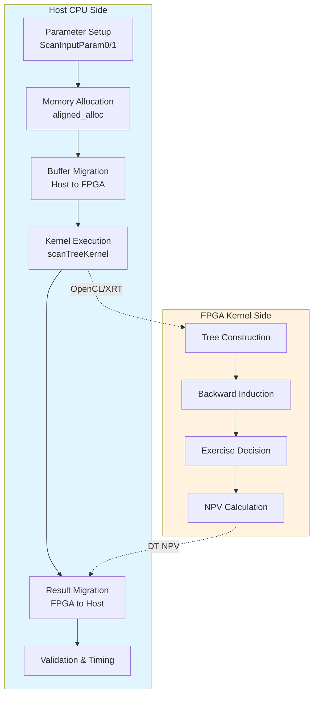

# 单因子短利率模型掉期期权树形引擎 (Swaption Tree Engines - Single Factor Short Rate Models)

## 一句话概括

本模块提供了一套基于 **FPGA 加速的树形数值方法** 来定价**百慕大式掉期期权 (Bermudan Swaption)** 的完整解决方案，支持多种单因子短利率模型（Hull-White、Black-Karasinski、CIR 等）。你可以把它想象成一个"利率模型实验室"——同样的衍生品定价问题，可以接入不同的利率动态模型，在 FPGA 上获得数量级的加速。

---

## 问题空间与设计动机

### 我们在解决什么难题？

**百慕大式掉期期权**是利率衍生品市场上最复杂、流动性最高的产品之一。与欧式期权只能在到期日行权不同，百慕大式期权允许持有者在**一系列预设的日期**（通常对应于利率掉期的付息日）提前行权。这种"美式特征"使得定价必须考虑最优行权策略，引入了自由边界问题。

传统的定价方法面临以下挑战：

1. **计算密集度高**：树形方法（Trinomial Tree）需要向后归纳（Backward Induction），在每个节点求解行权价值 vs 持有价值的最大值。对于百慕大式掉期期权，这涉及复杂的浮动端和固定端现金流计算。

2. **模型风险分析耗时**：交易员需要快速比较不同利率模型（Hull-White vs Black-Karasinski vs CIR）对同一产品的定价差异，以评估模型风险。在 CPU 上串行运行多个模型非常缓慢。

3. **实时性要求**：在交易活跃时段，需要秒级甚至更短的响应时间来重新计算 Greeks 或进行情景分析。

### 为什么选择 FPGA + 树形方法？

**为何不选 Monte Carlo？**

Monte Carlo 方法在处理高维问题时更具优势，且更容易并行化。但对于**单因子短利率模型**，树形方法具有以下不可替代的优势：

1. **美式特征的精确处理**：Monte Carlo 处理早期行权需要引入 Longstaff-Schwartz 等回归近似方法，引入额外的统计误差。树形方法通过向后归纳可以**精确地**（在离散时间意义下）处理最优行权边界。

2. **计算效率**：对于单因子模型，树形结构的节点数随时间步线性增长（$O(N)$），每个节点的计算相对简单，内存访问模式规则，极其适合 FPGA 的流水线并行架构。

3. **数值稳定性**：树形方法不涉及随机数生成带来的方差，收敛性更可控，对于校准和对冲参数的稳定性更好。

**为何选择 FPGA 而非 GPU？**

虽然 GPU 也能加速树形计算，但 FPGA 在此场景下具有独特优势：

1. **细粒度流水线控制**：树形计算涉及复杂的条件分支（行权决策）和不规则的内存访问模式（节点回溯）。FPGA 允许硬件级的流水线设计，可以根据算法特性精确控制数据流，减少分支预测失误和内存延迟。

2. **低延迟确定性**：金融计算往往需要确定的延迟保证，FPGA 的硬件执行模型提供了比 GPU（受线程调度和内存子系统影响）更确定的时序特性。

3. **功耗效率**：在数据中心部署场景下，FPGA 通常能提供比 GPU 更好的每瓦性能（Performance per Watt），这对于大规模计算集群的 TCO 至关重要。

---

## 架构全景



### 架构叙事

整个系统采用典型的 **Host-Accelerator** 异构计算架构。Host 端（CPU）负责任务编排、数据准备和结果验证，而 FPGA 端则专注于计算密集型的树形定价算法。

**数据流向解析：**

1. **参数配置阶段**：Host 代码构造两个关键参数结构体 `ScanInputParam0` 和 `ScanInputParam1`。前者包含产品级参数（名义本金、时间网格、行权时间表），后者包含模型级参数（均值回归速度 $a$、波动率 $\sigma$、平值利率）。这种分离使得同一产品结构可以用不同的利率模型定价，体现了**策略模式**的设计思想。

2. **内存准备阶段**：使用 `aligned_alloc` 分配主机内存，确保地址对齐以满足 FPGA DMA 传输的硬件要求。这一步对于异构计算的性能至关重要——未对齐的内存会导致额外的拷贝开销。

3. **数据传输阶段**：通过 OpenCL 的 `enqueueMigrateMemObjects` 将输入缓冲区从 Host 内存迁移到 FPGA 的 Device 内存。这是一个**隐式同步点**，后续的内核执行会等待数据到达。

4. **内核执行阶段**：`scanTreeKernel` 在 FPGA 上执行实际的树形计算。这个内核采用**流水线并行**架构，能够在处理当前时间步节点的同时，预取下一个时间步的数据。内核内部实现了完整的向后归纳逻辑：从树的最远端（到期日）开始，逐步回溯到当前时刻，在每个节点计算行权价值与持有价值的最大值。

5. **结果回传阶段**：计算完成的 NPV（净现值）通过另一个 `enqueueMigrateMemObjects` 调用传回 Host 内存。

6. **验证阶段**：Host 代码将 FPGA 计算结果与预设的 "Golden" 参考值进行比较，验证数值精度是否在可接受范围内（通常 $10^{-10}$ 量级）。同时记录端到端执行时间和内核纯执行时间，用于性能分析。

---

## 核心设计决策与权衡

### 1. 模型分离 vs. 统一框架：为何为每个模型单独编译？

**观察到的设计**：代码为每种短利率模型（BK、CIR、ECIR、HW、V）提供了独立的 `main.cpp` 文件和编译目标，尽管它们共享 90% 以上的逻辑。

**权衡分析**：

| 方案 | 优势 | 劣势 | 本模块选择 |
|------|------|------|-----------|
| **编译时多态（当前）** | 内核代码无虚函数开销；HLS 可针对每种模型的具体算术特性（如 CIR 的 $\sqrt{r}$  vs HW 的线性）进行极致优化；生成的比特流更小，加载更快 | 代码重复（通过包含头文件缓解）；维护多个二进制文件 | ✅ **采用** |
| **运行时多态** | 单一可执行文件，维护简单；用户可在运行时切换模型 | FPGA 内核难以高效支持虚函数；需要携带所有模型的逻辑，资源浪费；HLS 无法针对特定模型优化 | ❌ 不适合 |

**深层原因**：FPGA 内核开发遵循 "配置即编译" 的理念。HLS（高层次综合）工具在编译时生成硬件电路，无法像 CPU 那样在运行时动态调度。每种短利率模型的核心计算（如漂移项、扩散项的计算公式）不同，生成专用硬件电路能获得最佳性能。

### 2. 双缓冲区设计：ScanInputParam0 vs ScanInputParam1

**观察到的设计**：参数被硬性拆分为两个结构体，`ScanInputParam0` 和 `ScanInputParam1`，分别对应不同的内存缓冲区。

**设计意图**：

这种分离体现了 **"产品-模型正交分离"** 的设计哲学：

- **`ScanInputParam0`**（产品侧）：包含**不随利率模型改变**的参数
  - 名义本金 (nominal)
  - 初始时间网格 (initTime)
  - 行权计数索引 (exerciseCnt)
  - 固定/浮动端计数 (fixedCnt, floatingCnt)
  - 初始短期利率 (x0) - 虽然技术上属于模型，但通常由市场数据决定

- **`ScanInputParam1`**（模型侧）：包含**特定于利率模型**的参数
  - 均值回归速度 (a)
  - 波动率 (sigma)
  - 平值利率 (flatRate)
  - 时间步数 (timestep) - 属于数值方法，但通常按模型校准需求设置

**优势**：
1. **代码复用**：同一产品结构可以用不同的 `ScanInputParam1` 实例分别定价，无需重复填充产品参数
2. **缓存友好**：产品参数通常较大但只读，模型参数可能需要频繁调整（如校准过程中），分离访问模式利于缓存
3. **接口清晰**：函数签名明确区分 "这是什么产品" 和 "用什么模型定价"

**权衡**：增加了一个缓冲区管理的复杂度，Host 代码需要维护两组内存分配和迁移操作。

### 3. 精度与性能的权衡：DT 数据类型的隐式约定

**观察**：代码中大量使用 `DT` 作为数据类型（如 `DT minErr`, `DT* output`），但没有在片段中显示定义。

**推断与说明**：

`DT` 极大概率是通过宏或 `typedef` 定义的双精度浮点数 (`double`) 或单精度浮点数 (`float`)，也可能是自定义的定点数类型（考虑到 FPGA 实现）。

**设计权衡**：

| 精度选择 | 适用场景 | FPGA 影响 | 本模块暗示 |
|---------|---------|-----------|-----------|
| `double` (64-bit) | 需要极高精度（如长期限、复杂路径依赖） | 消耗大量 DSP 资源，吞吐量降低 | 从 `golden` 值的小数位数 (15+) 推断，**极可能使用 double** |
| `float` (32-bit) | 速度优先，精度可接受降低 | 资源减半，时钟频率可能提升 | 权衡后未选择 |
| 定点数 | 资源极度受限场景 | 精度/范围固定，面积最小 | 未选择，因金融计算需要动态范围 |

**关键风险点**：如果 `DT` 被定义为 `float` 但 golden 参考值按 `double` 计算，会导致验证失败。新加入的开发者必须确认 `DT` 的定义位置（通常在 `utils.hpp` 或编译命令的 `-D` 宏中）。

### 4. 测试策略：Golden Reference 与数值精度

**观察到的设计**：代码中硬编码了 `golden` 参考值，根据 `timestep` 数量（10, 50, 100, 500, 1000）有不同的期望值。

**设计意图**：

这是一种**回归测试（Regression Testing）**策略，确保 FPGA 实现的数值结果与参考实现（通常是高精度 CPU 实现或理论闭式解）保持一致。

**技术细节**：

- **容差设置**：`minErr = 10e-10`（即 $10^{-9}$），对于量级为 10-40 的 NPV，这要求相对误差约 $10^{-10}$，属于**双精度浮点数的机器精度级别**。
- **时间步依赖**：树形方法的精度随时间步数增加而提高。代码针对不同的 `timestep`（10 到 1000）预存了对应的 golden 值，反映了模型收敛过程。
- **验证输出**：不仅比较误差，还输出 `diff/NPV`（相对误差），便于分析人员判断误差是否在可接受范围。

**权衡分析**：

| 方案 | 优点 | 缺点 | 本模块选择 |
|------|------|------|-----------|
| **硬编码 Golden 值** | 测试独立，不依赖外部库；明确显示预期结果 | 需要手动更新，维护成本高；只覆盖特定参数组合 | ✅ **采用**（适合基准测试） |
| 运行时与 CPU 库对比 | 覆盖任意参数；自动适应 | 引入 CPU 库依赖；FPGA/CPU 差异可能需要容差处理 | 未采用（避免依赖复杂性） |

---

## 数据流全景：一次定价请求的生命周期

让我们追踪一次典型的百慕大掉期期权定价请求从发起、处理到返回的完整旅程。这有助于理解 Host 与 FPGA 之间的协作边界，以及每个阶段的数据转换。

### 阶段 1：参数配置（Host 用户空间）

**起点**：`main()` 函数中的参数设置代码块。

**关键操作**：
1. **模型参数实例化**：根据选择的模型（如 Hull-White），设置均值回归速度 `a`、波动率 `sigma` 和平值利率 `flatRate`。
2. **产品结构定义**：
   - `initTime`：定义利率掉期的完整时间结构（从 0 到 6 年的不规则时间点）
   - `exerciseCnt`：定义 5 个可能的行权日期（对应时间网格中的索引 0, 2, 4, 6, 8）
   - `fixedCnt` / `floatingCnt`：定义固定端和浮动端的付息结构
3. **数值参数设置**：`timestep`（如 100）决定了树的时间离散精度，直接影响定价精度和计算量。

**数据形态**：此时数据是结构化的 C++ 结构体，分散在 Host 内存中。

### 阶段 2：内存分配与对齐（Host 内存管理）

**关键操作**：
```cpp
ScanInputParam0* inputParam0_alloc = aligned_alloc<ScanInputParam0>(1);
ScanInputParam1* inputParam1_alloc = aligned_alloc<ScanInputParam1>(1);
```

**技术细节**：
- 使用 `aligned_alloc` 确保内存地址按照 FPGA DMA 控制器的要求对齐（通常是 4KB 边界）。
- 分配的是 "Page-locked"（或 "Pinned"）内存，确保操作系统不会将这部分内存交换到磁盘，允许 FPGA 直接通过 DMA 访问而不需要额外的内存拷贝。

**数据形态**：参数被复制到对齐的缓冲区，准备传输。

### 阶段 3：OpenCL 上下文初始化（Host-XRT 运行时）

**关键操作**：
1. **设备发现**：`xcl::get_xil_devices()` 枚举可用的 Xilinx FPGA 设备。
2. **上下文创建**：`cl::Context` 建立 Host 与 FPGA 之间的通信上下文。
3. **命令队列**：`cl::CommandQueue` 创建任务队列，支持乱序执行（`CL_QUEUE_OUT_OF_ORDER_EXEC_MODE_ENABLE`）以提升多 CU 并行效率。
4. **程序加载**：`cl::Program::Binaries` 加载预编译的 `.xclbin` 文件（包含 FPGA 比特流）。
5. **内核实例化**：根据 `.xclbin` 中的计算单元（CU）数量，创建多个 `cl::Kernel` 实例（如 `scanTreeKernel_1`, `scanTreeKernel_2`）。

**数据形态**：此时建立了从 Host 逻辑地址到 FPGA 物理内存的映射通道。

### 阶段 4：缓冲区创建与扩展指针映射（Host-FPGA 内存映射）

**关键操作**：
```cpp
cl_mem_ext_ptr_t mext_in0 = {1, inputParam0_alloc, krnl_TreeEngine[c]()};
cl::Buffer inputParam0_buf(context, CL_MEM_EXT_PTR_XILINX | CL_MEM_USE_HOST_PTR | CL_MEM_READ_WRITE, 
                          sizeof(ScanInputParam0), &mext_in0);
```

**技术细节**：
- `cl_mem_ext_ptr_t` 是 Xilinx 扩展，建立 Host 指针与内核参数索引的映射（索引 1, 2, 3 分别对应 Param0、Param1、Output）。
- `CL_MEM_USE_HOST_PTR` 指示 OpenCL 使用已分配的 Host 内存，而非分配新的 Device 内存，配合 DMA 实现零拷贝（Zero Copy）。
- `CL_MEM_EXT_PTR_XILINX` 启用 Xilinx 特定的扩展指针语义。

**数据形态**：Host 内存缓冲区被注册到 OpenCL 运行时，准备迁移。

### 阶段 5：数据迁移 Host → FPGA（DMA 传输）

**关键操作**：
```cpp
q.enqueueMigrateMemObjects(ob_in, 0, nullptr, nullptr); // 0 = Host to Device
q.finish(); // 阻塞等待传输完成
```

**技术细节**：
- `enqueueMigrateMemObjects` 启动 DMA 引擎，将 `ScanInputParam0` 和 `ScanInputParam1` 从 Host 内存拷贝到 FPGA 的 HBM/DDR 内存。
- 这是一个**隐式同步点**，后续的 Kernel 启动命令会等待迁移完成。
- 对于多 CU 场景，每个 CU 的输入缓冲区都会并行迁移。

**数据形态**：输入数据现在同时存在于 Host 和 FPGA Device 内存中。

### 阶段 6：内核执行 - 树形定价算法（FPGA 计算核心）

**关键操作**：
```cpp
krnl_TreeEngine[c].setArg(0, len);
krnl_TreeEngine[c].setArg(1, inputParam0_buf[c]);
krnl_TreeEngine[c].setArg(2, inputParam1_buf[c]);
krnl_TreeEngine[c].setArg(3, output_buf[c]);
q.enqueueTask(krnl_TreeEngine[c], nullptr, &events_kernel[c]);
```

**算法内部逻辑（FPGA Kernel）**：

虽然 Kernel 源码未直接提供，但从 Host 代码和树形定价理论可以推断其内部架构：

1. **树结构构建**：根据 `timestep` 和模型类型（HW、CIR 等）构建三叉树（Trinomial Tree）或二叉树。每个节点存储短期利率 $r$ 和 Arrow-Debreu 价格（状态价格）。

2. **现金流映射**：根据 `exerciseCnt`、`fixedCnt`、`floatingCnt` 定义的时间索引，在每个时间节点计算：
   - **行权价值 (Exercise Value)**：立即进入利率掉期的价值 = 浮动端现值 - 固定端现值
   - **持有价值 (Hold Value)**：继续持有的期望现值，通过向后归纳计算：$V_{hold} = e^{-r\Delta t} \times (p_{up}V_{up} + p_{mid}V_{mid} + p_{down}V_{down})$
   - **节点价值**：$V_{node} = \max(V_{exercise}, V_{hold})$

3. **并行化策略**：
   - **空间并行**：单棵树的多个节点并行处理（如果树结构允许）
   - **批量并行**：多棵树的并行（`N * K` 的输出维度暗示可能支持批量定价）
   - **流水线并行**：向后归纳的每个时间步作为一个流水线阶段

**数据形态**：FPGA 内部寄存器和片上内存（BRAM/URAM）存储树节点，最终计算出的 NPV 写入输出缓冲区。

### 阶段 7：数据迁移 FPGA → Host（DMA 回传）

**关键操作**：
```cpp
q.enqueueMigrateMemObjects(ob_out, CL_MIGRATE_MEM_OBJECT_HOST, nullptr, nullptr);
q.finish();
```

**技术细节**：
- `CL_MIGRATE_MEM_OBJECT_HOST`（值为 1）指示从 Device 向 Host 迁移。
- 输出缓冲区 `output[c]` 现在包含计算好的 NPV 值（类型为 `DT`，通常是 `double`）。

**数据形态**：定价结果回到 Host 内存，可以被 CPU 访问。

### 阶段 8：结果验证与后处理（Host 验证）

**关键操作**：
```cpp
for (int j = 0; j < len; j++) {
    DT out = output[i][j];
    if (std::fabs(out - golden) > minErr) {
        err++;
        std::cout << "[ERROR] Kernel-" << i + 1 << ": NPV[" << j << "]= " 
                  << std::setprecision(15) << out 
                  << " ,diff/NPV= " << (out - golden) / golden << std::endl;
    }
}
```

**技术细节**：
- **绝对误差检查**：`std::fabs(out - golden) > minErr` 确保数值误差在 $10^{-9}$ 以内。
- **相对误差输出**：`(out - golden) / golden` 显示百分比误差，对于量级为 10-40 的 NPV，$10^{-9}$ 的绝对误差意味着 $10^{-10}$ 级别的相对误差，这验证了 FPGA 实现与参考实现（通常是高精度 CPU 实现或理论值）的一致性。
- **多 CU 验证**：循环遍历所有计算单元（`cu_number`），确保每个内核实例都产生正确结果。

**数据形态**：验证通过 → 输出测试通过日志；验证失败 → 输出详细错误信息并标记测试失败。

---

## 子模块体系

本模块采用**水平分层 + 垂直特化**的架构。水平方向上，所有模型共享相同的 Host 代码框架和 FPGA Kernel 接口；垂直方向上，每个短利率模型有独立的参数配置和 Golden 参考值。

根据模块树的组织，可以识别出三个逻辑子模块群组：

### 1. CIR 家族子模块群 (`cir_family_swaption_host_timing`)

包含 **CIR (Cox-Ingersoll-Ross)** 和 **ECIR (Extended CIR)** 两个模型。

- **数学特性**：$dr = a(b - r)dt + \sigma\sqrt{r}dW$，确保利率始终为正（如果 $2ab \geq \sigma^2$）。
- **适用场景**：需要严格保证正利率的市场环境。
- **代码特征**：`inputParam1_alloc[i].sigma` 控制扩散项，`inputParam0_alloc[i].x0`（初始利率）在 CIR 中必须为正。
- **Golden 值**：CIR 模型的 NPV 约为 13-40（取决于 timestep），ECIR 约为 14。

**延伸阅读**：如需了解 CIR 模型在 FPGA 上的具体实现细节和时序优化策略，请参阅 [CIR 家族子模块文档](quantitative_finance_engines-l2_tree_based_interest_rate_engines-swaption_tree_engines_single_factor_short_rate_models-cir_family_swaption_host_timing.md)。

### 2. 高斯短利率子模块群 (`gaussian_short_rate_swaption_host_timing`)

包含 **HW (Hull-White)** 和 **V (Vasicek)** 两个模型。

- **数学特性**：$dr = a(b - r)dt + \sigma dW$，服从 Ornstein-Uhlenbeck 过程，允许负利率。
- **适用场景**：需要解析可处理性（如债券期权有闭式解）或市场允许小幅负利率的环境。
- **代码特征**：`a` 和 `sigma` 通常较小（HW 中 $a \approx 0.04$, $\sigma \approx 0.007$）。
- **子细分**：
  - **HW 模型** (`hw_model`)：支持时变参数（通过 `flatRate` 进行期限结构拟合）。
  - **V 模型** (`v_model`)：经典 Vasicek，常数参数。

**延伸阅读**：如需了解 HW/V 模型的参数校准细节和 FPGA 资源利用优化，请参阅 [高斯短利率子模块文档](quantitative_finance_engines-l2_tree_based_interest_rate_engines-swaption_tree_engines_single_factor_short_rate_models-gaussian_short_rate_swaption_host_timing.md)。

### 3. Black-Karasinski 子模块 (`black_karasinski_swaption_host_timing`)

- **数学特性**：$d\ln(r) = a(b - \ln(r))dt + \sigma dW$，利率的对数服从 Ornstein-Uhlenbeck 过程，确保利率为正且服从对数正态分布。
- **适用场景**：需要同时保证正利率和对数正态分布的市场环境，是比 CIR 更灵活的选择。
- **代码特征**：`golden` 值约为 13.6（timestep=10 时），与 HW 接近但数学性质不同。

**延伸阅读**：如需了解 Black-Karasinski 模型的对数变换处理和 FPGA 上的数值稳定性保障，请参阅 [Black-Karasinski 子模块文档](quantitative_finance_engines-l2_tree_based_interest_rate_engines-swaption_tree_engines_single_factor_short_rate_models-black_karasinski_swaption_host_timing.md)。

---

## 跨模块依赖与集成点

本模块不是孤立存在的，它是整个 **Xilinx 量化金融库 (xf_fintech)** 中树形定价引擎家族的一员。理解它与周边模块的关系，有助于在更大范围内进行架构决策。

### 上游依赖（我们依赖谁）

#### 1. 基础工具库：`xcl2` 与 `xf_utils_sw`

- **模块**：`blas_python_api` 中的 `xcl2`，`data_mover_runtime` 中的 `xf_utils_sw`
- **关系类型**：基础设施依赖
- **职责边界**：
  - `xcl2`：封装了 Xilinx FPGA 的 OpenCL 设备发现、二进制文件加载（`.xclbin`）、内存迁移等底层操作。本模块中的所有 `cl::Device`、`cl::Context`、`cl::Program` 操作都通过 `xcl2` 的便捷函数完成。
  - `xf_utils_sw::Logger`：提供标准化的日志记录和错误报告机制。本模块使用 `logger.logCreateContext()`、`logger.error()` 等方法确保错误处理风格与库内其他模块一致。

**集成注意事项**：在使用本模块前，必须确保 `xcl2` 的头文件路径和库文件已正确配置。`HLS_TEST` 宏的定义状态决定了 `xcl2.hpp` 是否被包含（仅当非 HLS 测试模式时才需要实际的 FPGA 运行时）。

#### 2. 树形引擎内核接口：`tree_engine_kernel`

- **模块**：`vanilla_rate_product_tree_engines_hw` 或同层的内核定义模块
- **关系类型**：编译时接口依赖
- **职责边界**：`tree_engine_kernel.hpp` 定义了 FPGA 内核 `scanTreeKernel` 的 Host 端调用接口，包括：
  - 内核参数签名（`len`, `inputParam0`, `inputParam1`, `output`）
  - 输入/输出缓冲区的数据布局约定
  - `ScanInputParam0` 和 `ScanInputParam1` 结构体的精确内存布局（对齐、填充）

**集成注意事项**：Host 代码和 Kernel 代码必须严格遵循相同的结构体定义和内存对齐规则。任何不匹配（如 Host 端使用了 `pragma pack` 而 Kernel 端没有）将导致参数解析错误，产生难以调试的数值错误。

### 下游依赖（谁依赖我们）

本模块作为具体的定价引擎实现，通常被上层应用或工作流引擎调用。

#### 1. 产品定价工作流：`quantitative_finance_engines`

- **关系类型**：功能组合
- **使用场景**：上层的工作流引擎可能需要为同一个百慕大掉期期权计算多种模型下的价格（模型风险分析），并行调用本模块的多个实例（HW、BK、CIR），然后比较结果差异。

### 平级模块（兄弟姐妹）

#### 1. 两因子 G2 模型引擎：`swaption_tree_engine_two_factor_g2_model`

- **关系**：同属于 `l2_tree_based_interest_rate_engines` 模块下的掉期期权引擎家族
- **差异**：G2 模型使用两个布朗运动驱动利率，需要二维树（Four-nomial tree），计算复杂度和资源消耗远高于本模块的单因子模型。本模块作为 G2 的"轻量级替代品"，在精度要求允许时提供更快的定价。

#### 2. 普通香草产品引擎：`vanilla_rate_product_tree_engines_hw`

- **关系**：共享相同的 `tree_engine_kernel` 基础设施
- **差异**：普通产品（如 Cap/Floor、普通欧式掉期期权）的行权结构更简单（单一时点或无行权选择），本模块的复杂性在于处理百慕大式的多行权日期和最优行权边界。

---

## 给新加入者的实战指南

### 如何添加一个新的短利率模型？

假设你需要为 **Black-Derman-Toy (BDT)** 模型添加支持，步骤如下：

1. **创建目录结构**：复制 `TreeSwaptionEngineHWModel` 目录为 `TreeSwaptionEngineBDTModel`。

2. **修改参数映射**：在 `main.cpp` 中调整 `inputParam1_alloc` 的填充逻辑：
   - BDT 模型通常使用 `sigma` 表示利率的对数波动率，与 Black-Karasinski 类似但无均值回归参数 `a`。
   - 可能需要添加新的字段到 `ScanInputParam1`（如果原结构未覆盖）。

3. **生成 Golden 值**：首先使用高精度 Python 库（如 `QuantLib`）或 MATLAB 实现 BDT 模型，计算相同参数下的 NPV，取 15 位有效数字作为 `golden` 常量。

4. **编译与测试**：
   ```bash
   make TARGET=sw_emu  # 软件仿真验证算法正确性
   make TARGET=hw_emu  # 硬件仿真验证 RTL 逻辑
   make TARGET=hw      # 生成比特流并上板测试
   ```

5. **验证精度**：观察输出中的 `diff/NPV`，如果超过 $10^{-9}$，检查：
   - 浮点数精度（是否混用了 float/double）
   - 树的重构方式（BDT 需要特殊的前向归纳校准波动率）
   - 时间网格对齐（不规则付息日期的插值处理）

### 调试技巧：当 Golden 值不匹配时

**症状**：FPGA 输出与 Golden 值差异巨大（如相对误差 > 1%）。

**排查清单**：

1. **检查结构体对齐**：
   ```cpp
   // 在 Host 代码中添加
   printf("sizeof(ScanInputParam0) = %zu\n", sizeof(ScanInputParam0));
   printf("sizeof(ScanInputParam1) = %zu\n", sizeof(ScanInputParam1));
   ```
   确保与 Kernel 端的 `sizeof` 完全一致。常见陷阱是 Host 编译器默认 8 字节对齐，而 Kernel HLS 使用了 `#pragma pack(1)`。

2. **验证参数传递**：打印 `inputParam1_alloc[0].a`、`sigma` 等关键参数，确保它们被正确填充且没有字节序（Endianness）问题。

3. **时间步一致性**：确认 `timestep` 值在 FPGA 内核和 Host Golden 值选择逻辑中一致。如果 Host 用 100 步的 Golden 值去验证 FPGA 的 50 步计算，必然失败。

4. **浮点精度陷阱**：
   - 检查 `DT` 的定义，确保 Host 和 Kernel 使用相同的精度（都是 `double` 或都是 `float`）。
   - 注意 FPGA 的 `double` 运算通常比 `float` 慢 3-5 倍，如果性能不达标，可能需要牺牲精度换速度。

### 性能调优建议

**目标**：降低端到端延迟，提升吞吐量。

1. **多 CU 并行**：现代 FPGA（如 Alveo U280）支持多个计算单元（CU）。确保 `cu_number` > 1，并在 Host 代码中：
   - 为每个 CU 分配独立的输入/输出缓冲区（避免资源竞争）
   - 使用 `CL_QUEUE_OUT_OF_ORDER_EXEC_MODE_ENABLE` 允许乱序执行
   - 批量提交任务，让 FPGA 的调度器填充流水线

2. **减少数据传输**：
   - 如果进行参数扫描（如批量计算不同波动率下的价格），考虑将参数生成逻辑移到 FPGA 端，Host 只发送种子参数和迭代范围。
   - 使用 `CL_MEM_USE_HOST_PTR` 避免隐式的内存拷贝，但确保内存已页锁定。

3. **树大小优化**：
   - `timestep` 直接决定树的节点数 $O(N^2)$。对于实时报价，100 步通常足够（误差 < 0.1%），而风险管理可能需要 500-1000 步。
   - 考虑实现自适应时间步长：在临近行权日期处加密网格，其他区域稀疏化，减少总节点数。

4. **HLS 指令优化**（需修改 Kernel 代码）：
   - 对向后归纳的内层循环使用 `PIPELINE II=1` 确保每个周期处理一个节点。
   - 对利率状态数组使用 `ARRAY_PARTITION` 或 `ARRAY_RESHAPE` 提升读取带宽。
   - 使用 `DATAFLOW` 指令实现多棵树的流水线并行。

---

## 总结：模块的核心价值

`swaption_tree_engines_single_factor_short_rate_models` 模块代表了**金融算法与异构计算架构深度融合**的工程实践。它不仅仅是"把 C++ 代码放到 FPGA 上跑"，而是针对树形定价算法的计算特性、内存访问模式和数据依赖关系，精心设计的软硬件协同系统。

对于新加入团队的开发者，理解以下三个核心抽象至关重要：

1. **模型-产品分离**：`ScanInputParam0` 和 `ScanInputParam1` 的拆分不仅是技术细节，更是金融工程思维的体现——产品结构与定价模型解耦。

2. **编译时多态**：每个模型独立编译不是代码冗余，而是对 FPGA 资源约束和 HLS 工具链特性的尊重。在硬件世界里，"灵活性"往往意味着"效率损失"，我们选择为每个模型生成专用电路。

3. **向后归纳的流水线**：理解 FPGA 内核如何实现树形算法的并行化是关键——不是在空间上同时计算整棵树（不可能，因为后向依赖），而是在时间上流水线化不同时间步或不同树的计算。

掌握这些概念，你就能在这个模块的基础上进行扩展——无论是添加新的利率模型、支持新的产品结构，还是优化 FPGA 的资源利用和吞吐量。
