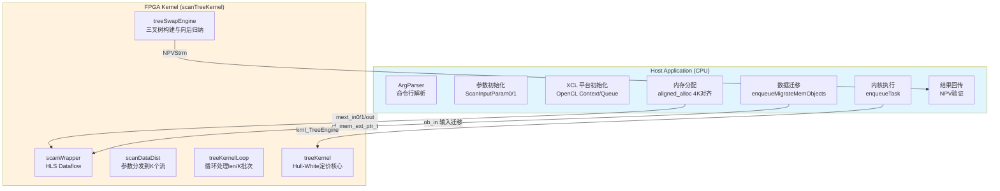

# Tree Swap Engine (HW Model) — 技术深度解析

## 一句话概括

**Tree Swap Engine** 是一个基于 FPGA 的利率互换合约定价引擎，采用 Hull-White 单因子短期利率模型和 Trinomial Tree（三叉树）数值方法，在 Xilinx Alveo 加速卡上实现亚毫秒级 NPV（净现值）计算。它本质上是一个**将复杂金融衍生品定价问题转化为高并行度树形遍历计算的硬件加速方案**。

---

## 问题域：为什么需要这个模块？

### 金融背景

利率互换（Interest Rate Swap）是场外衍生品市场最核心的工具之一。对于可提前终止（callable）的互换，定价需要建模利率的动态演化。

**Hull-White 模型**是业界标准的单因子短期利率模型，其随机微分方程为：

$$dr(t) = [\theta(t) - a \cdot r(t)]dt + \sigma \cdot dW(t)$$

其中：
- $r(t)$ 为瞬时短期利率
- $a$ 为均值回归速度（mean reversion speed）
- $\sigma$ 为波动率
- $\theta(t)$ 为使模型拟合当前期限结构的确定性函数

### 计算挑战

Trinomial Tree 方法通过离散化时间构建利率演化的树形结构，在每个节点进行向后归纳（backward induction）计算期权价值。对于每次定价：
- 树的时间步数（timestep）通常为 50-1000
- 每个时间步的节点数随步数线性增长
- 需要存储每个节点的状态并进行多轮遍历

**在 CPU 上，单次定价可能需要数十到数百毫秒，而交易场景需要亚毫秒级响应**。FPGA 的细粒度并行性和可定制数据通路使其成为加速树形遍历的理想选择。

---

## 核心抽象：理解这个模块的思维方式

### 三层抽象模型

想象 Tree Swap Engine 是一个**精密装配的金融计算流水线**，由三个层次组成：

```
┌─────────────────────────────────────────────────────────┐
│  业务抽象层  │  Hull-White Model + Trinomial Tree        │
│             │  (金融语义：利率演化、现金流折现、期权行权)  │
├─────────────────────────────────────────────────────────┤
│  计算模式层  │  树形遍历 + 向后归纳 + 状态传递            │
│             │  (算法语义：节点计算、分支概率、边界条件)    │
├─────────────────────────────────────────────────────────┤
│  硬件映射层  │  HLS Stream + Dataflow + Unroll           │
│             │  (硬件语义：流水线、并行度、存储层次)        │
└─────────────────────────────────────────────────────────┘
```

### 关键抽象概念

**1. Trinomial Tree 作为状态转移图**

每个节点存储当前短期利率值，向三个子节点（上升、持平、下降）转移。转移概率由 Hull-White 模型参数决定，且保证风险中性定价条件。

**2. 向后归纳（Backward Induction）**

定价从树的末端（到期日）开始，每个节点的价值由子节点价值折现得到：

$$V_{node} = e^{-r \cdot \Delta t} \cdot [p_{up}V_{up} + p_{mid}V_{mid} + p_{down}V_{down}] + CF$$

其中 $CF$ 是该时间步产生的现金流（互换的净支付）。

**3. 可提前行权（Callable Swap）**

在每个行权节点，持有者比较继续持有价值与立即行权价值，取较大者。这需要在向后归纳过程中动态比较。

**4. HLS Dataflow 并行**

在 FPGA 上，`scanDataDist`（数据分发）与 `treeKernel`（计算内核）通过 `hls::stream` 解耦，形成流水线并行。`K=4` 个并行通道（copies）同时处理不同实例的定价请求。

---

## 架构与数据流

### 系统架构图



### 关键数据流

**1. 参数准备阶段（Host）**

```cpp
// 两个结构体分别存储不同类型的参数
ScanInputParam0 inputParam0;  // 标量参数：x0, nominal, spread, initTime[]
ScanInputParam1 inputParam1;  // 模型参数：a, sigma, flatRate, timestep, 计数数组

// 硬编码的测试参数（实际应用应从文件或数据库读取）
inputParam1.a = 0.055228873373796609;      // 均值回归速度
inputParam1.sigma = 0.0061062754654949824; // 波动率
inputParam1.flatRate = 0.04875825;         // 平坦利率
```

**2. FPGA 执行阶段（Kernel）**

```cpp
// scanWrapper 使用 HLS dataflow 指令，实现任务级并行
void scanWrapper(...) {
    #pragma HLS dataflow
    // 1. 分发数据到 K 个并行流
    scanDataDist(len, inputParam0, inputParam1, ... streams ...);
    // 2. 并行处理 len/K 批数据
    treeKernelLoop(len, ... streams ..., NPVStrm);
}
```

**3. 结果验证阶段（Host）**

```cpp
// 预计算的 Golden 值（基于 CPU 双精度参考实现）
if (timestep == 10) golden = -0.00020198789915012378;
// 验证 FPGA 输出与 golden 值的相对误差
if (std::fabs(out - golden) > minErr) { err++; }
```

---

## 组件深度解析

### 1. Host 端核心组件

#### `main.cpp` —— 主控程序

**职责**：OpenCL 平台管理、内核调度、结果验证

**内存所有权模型**：
- 输入缓冲区：`inputParam0_alloc`, `inputParam1_alloc` —— 由 `aligned_alloc<>` 分配，4KB 对齐，Host 拥有，通过 `cl_mem_ext_ptr_t` 映射到 FPGA
- 输出缓冲区：`output[i]` —— 同样 4KB 对齐，存储 NPV 结果
- 所有权转移：调用 `enqueueMigrateMemObjects` 时，数据从 Host 迁移到 Device；内核执行期间，Device 拥有写权限；结果回传后 Host 重新获得所有权

**关键代码模式**：

```cpp
// 内存扩展指针：将 Host 分配的内存与 FPGA Kernel 关联
cl_mem_ext_ptr_t mext_in0 = {1, inputParam0_alloc, krnl_TreeEngine[0]()}; 
// flags: 1=bank 0, ptr, kernel object

// 创建 Buffer 时传入扩展指针，实现零拷贝（Zero Copy）
cl::Buffer inputParam0_buf(context, CL_MEM_EXT_PTR_XILINX | CL_MEM_USE_HOST_PTR | CL_MEM_READ_WRITE,
                          sizeof(ScanInputParam0), &mext_in0);
```

**并发模型**：
- 支持多 CU（Compute Unit）并行：`cu_number` 由 Kernel 属性 `CL_KERNEL_COMPUTE_UNIT_COUNT` 决定
- 队列模式：`CL_QUEUE_OUT_OF_ORDER_EXEC_MODE_ENABLE`（非 SW_EMU 模式下），允许 Kernel 乱序执行以提升吞吐

#### `utils.hpp` —— 工具函数

**职责**：跨平台计时、对齐内存分配

**关键函数**：

```cpp
// 高精度计时（微秒级）
inline int tvdiff(struct timeval* tv0, struct timeval* tv1) {
    return (tv1->tv_sec - tv0->tv_sec) * 1000000 + (tv1->tv_usec - tv0->tv_usec);
}

// 4096 字节对齐内存分配（满足 Xilinx FPGA DMA 要求）
template <typename T>
T* aligned_alloc(std::size_t num) {
    void* ptr = nullptr;
    if (posix_memalign(&ptr, 4096, num * sizeof(T))) throw std::bad_alloc();
    return reinterpret_cast<T*>(ptr);
}
```

**设计意图**：
- `tvdiff`：使用 `gettimeofday` 而非 C++11 `chrono`，兼容旧版编译器和嵌入式环境
- `aligned_alloc`：Xilinx XRT 要求 Host 缓冲区 4KB 对齐以实现零拷贝 DMA；使用 `posix_memalign` 而非 `std::align` 保证内存可被 `free()` 释放

### 2. Kernel 端核心组件

#### `tree_engine_kernel.hpp` —— 类型定义与接口

**职责**：定义 Kernel 的数据结构、类型别名和函数签名

**关键类型**：

```cpp
// 模型类型层级：Process -> Tree -> Model
using Process = OrnsteinUhlenbeckProcess<DT>;           // 均值回归 Ornstein-Uhlenbeck 过程
using Tree = TrinomialTree<DT, Process, LEN>;          // 三叉树离散化（最大 LEN 节点）
using Model = HWModel<DT, Tree, LEN2>;                 // Hull-White 模型封装（状态数组 LEN2）

// 输入参数结构体（按访问模式分组，优化内存布局）
struct ScanInputParam0 {
    DT x0;                    // 初始利率
    DT nominal;               // 名义本金
    DT spread;                // 利差
    DT initTime[InitTimeLen]; // 初始化时间表
};

struct ScanInputParam1 {
    int index, type;          // 标识与类型
    DT fixedRate;             // 固定端利率
    int timestep, initSize;    // 时间步数、初始化大小
    DT a, sigma, flatRate;    // Hull-White 模型参数
    int exerciseCnt[ExerciseLen];  // 行权日期索引
    int floatingCnt[FloatingLen];  // 浮动端支付日期
    int fixedCnt[FixedLen];        // 固定端支付日期
};
```

**设计意图**：
- `ScanInputParam0/1` 分离：Param0 包含浮点数组（大体积、顺序访问），Param1 包含标量和整数数组（小体积、随机访问），分离后有利于 AXI 突发传输优化
- `LEN/LEN2` 模板参数：允许编译期确定数组大小，HLS 可精确计算资源使用，避免动态内存分配
- `Model/Tree/Process` 类型层级：遵循设计模式中的策略模式（Strategy Pattern），允许在编译期或运行期替换不同的利率模型和数值方法

#### `scan_tree_kernel.cpp` —— Kernel 实现

**职责**：实现 FPGA 加速的核心计算逻辑

**数据流架构**：

```cpp
// 顶层函数：scanTreeKernel
extern "C" void scanTreeKernel(int len, ScanInputParam0 inputParam0[1], 
                                 ScanInputParam1 inputParam1[1], DT NPV[N]) {
    #pragma HLS INTERFACE m_axi port=inputParam0 ...  // AXI4 主接口
    #pragma HLS INTERFACE s_axilite port=len ...       // AXI4-Lite 控制接口
    #pragma HLS data_pack variable=inputParam0         // 结构体打包优化
    
    hls::stream<DT> NPVStrm[K];  // K 个并行输出流
    scanWrapper(len, inputParam0, inputParam1, NPVStrm);  // 核心计算
    
    // 将流数据写回 AXI 内存
    for (int i = 0; i < len; i++) {
        NPV[i] = NPVStrm[i % K].read();
    }
}
```

**关键函数详解**：

**`scanWrapper`** —— HLS Dataflow 协调器

```cpp
static void scanWrapper(int len, ScanInputParam0 inputParam0[1],
                        ScanInputParam1 inputParam1[1], hls::stream<DT> NPVStrm[K]) {
#pragma HLS dataflow  // 关键指令：允许函数级并行
    
    // 定义 K 组中间流（每通道一组）
    hls::stream<int> typeStrm[K];
    hls::stream<DT> fixedRateStrm[K];
    // ... 其他参数流
#pragma HLS stream variable=typeStrm depth=10  // 流深度配置
#pragma HLS RESOURCE variable=typeStrm core=FIFO_LUTRAM  // 使用 LUTRAM 实现
    
    // 阶段 1：数据分发（生产者）
    scanDataDist(len, inputParam0, inputParam1, typeStrm, fixedRateStrm, ...);
    
    // 阶段 2：并行计算（消费者）
    treeKernelLoop(len, typeStrm, fixedRateStrm, ..., NPVStrm);
    // scanDataDist 与 treeKernelLoop 并发执行，形成流水线
}
```

**设计意图**：`#pragma HLS dataflow` 是 HLS 高级优化的核心指令，它允许 `scanDataDist` 和 `treeKernelLoop` 在 FPGA 上以流水线方式并发执行——当 `treeKernelLoop` 正在处理第 $i$ 批次数据时，`scanDataDist` 可以准备第 $i+1$ 批次，类似 CPU 的流水线设计。

**`scanDataDist`** —— 数据分发器

```cpp
static void scanDataDist(int len, ScanInputParam0 inputParam0[1],
                         ScanInputParam1 inputParam1[1],
                         hls::stream<int> typeStrm[K],
                         hls::stream<DT> fixedRateStrm[K], ...) {
    for (int i = 0; i < len; i++) {
        // 轮询分发到 K 个通道，实现负载均衡
        typeStrm[i % K].write(inputParam1[0].type);
        fixedRateStrm[i % K].write(inputParam1[0].fixedRate);
        timestepStrm[i % K].write(inputParam1[0].timestep);
        // ... 其他标量参数
        
        // 数组参数需要循环写入
        for (int j = 0; j < inputParam1[0].initSize; j++) {
            initTimeStrm[i % K].write(inputParam0[0].initTime[j]);
        }
        // ... 其他数组
    }
}
```

**设计意图**：`i % K` 的轮询策略确保 `K` 个并行通道获得均匀的工作负载。数组参数（如 `initTime`）需要显式循环展平到流中，这允许 HLS 精确控制存储访问模式。

**`treeKernel` / `treeKernelWrapper`** —— 计算内核

```cpp
static void treeKernelWrapper(...) {
#pragma HLS dataflow  // 内部 dataflow 进一步并行化
    for (int k = 0; k < K; k++) {
#pragma HLS unroll  // 完全展开 K 个并行通道
        treeKernel(typeStrm[k], fixedRateStrm[k], ..., NPVStrm[k]);
    }
}

static void treeKernel(hls::stream<int>& typeStrm, ...) {
    // 从输入流读取参数
    int type = typeStrm.read();
    DT fixedRate = fixedRateStrm.read();
    // ...
    
    // 初始化 Hull-White 模型
    Model model;
    model.initialization(flatRate, spread, a, sigma);
    DT process[4] = {a, sigma, 0.0, 0.0};
    
    // 调用核心定价引擎
    DT NPV[1];
    treeSwapEngine<DT, Model, Process, DIM, LEN, LEN2>(
        model, process, type, fixedRate, timestep, initTime, initSize,
        floatingCnt, fixedCnt, flatRate, nominal, x0, spread, NPV
    );
    
    // 输出结果
    NPVStrm.write(NPV[0]);
}
```

**设计意图**：`#pragma HLS unroll` 完全展开 `K=4` 个并行通道，每个通道有独立的执行单元和存储资源。`treeSwapEngine` 是核心的金融计算库函数（来自 `xf_fintech` 库），封装了三叉树构建、向后归纳、现金流计算等复杂逻辑。

---

## 设计权衡与决策

### 1. 精度 vs 性能：双精度浮点（DT = double）

**权衡**：金融定价通常需要双精度（IEEE 754 64-bit）以保证风险中性定价的无套利条件。但 FPGA 上的双精度浮点运算消耗大量 DSP 资源（每个乘法器约占用 10-20 个 DSP48）。

**决策**：采用双精度（`typedef double DT`），但限制树的大小（`LEN=1024`, `LEN2=2048`）以控制资源使用。对于需要更高吞吐的场景，建议采用批处理（本设计的 `K=4` 并行通道）而非降低精度。

### 2. 并行策略：数据并行（K 通道）vs 树并行

**权衡**：
- **树并行**：在单棵树内部并行化节点计算。优势是单次定价延迟低；劣势是树节点间的依赖（向后归纳需要子节点结果）限制了并行度。
- **数据并行**：同时定价多个独立合约（本设计采用）。优势是实现简单、扩展性好；劣势是单次定价延迟不变。

**决策**：采用 `K=4` 数据并行（`treeKernelWrapper` 中的 `#pragma HLS unroll`），每个 CU（Compute Unit）处理 4 个独立定价请求。这与金融场景匹配：通常需要批量定价多个合约或进行蒙特卡洛模拟。

### 3. 内存架构：HLS Stream vs 数组

**权衡**：
- **数组**：存储在 BRAM/URAM，随机访问延迟低，但需要预分配固定大小。
- **HLS Stream**：FIFO 语义，天然支持数据流编程，但只能顺序访问。

**决策**：
- 参数传递使用 `hls::stream`（如 `typeStrm`, `fixedRateStrm`），配合 `#pragma HLS dataflow` 实现流水线并行
- 内部树结构存储使用数组（`xf_fintech` 库的 `Tree` 类内部管理），保证随机访问性能
- 流深度（`depth=10~120`）根据参数数组长度精确配置，避免死锁或资源浪费

### 4. Host-Device 数据传输：零拷贝（Zero Copy）

**权衡**：
- **拷贝模式**：Host 分配普通内存，`cl::Buffer` 创建时拷贝到 Device 专用内存。优势是 Host 可以异步修改内存；劣势是增加一次数据拷贝延迟。
- **零拷贝模式**：Host 分配对齐内存，`CL_MEM_USE_HOST_PTR` 直接使用 Host 内存作为 Device 访问的缓冲区。优势是零拷贝开销；劣势是 Host 访问时可能影响 Device 性能（缓存一致性问题）。

**决策**：采用零拷贝（`aligned_alloc<4096>()` + `CL_MEM_EXT_PTR_XILINX | CL_MEM_USE_HOST_PTR`）。理由：
- 金融定价参数体积小（两个结构体约 1KB），但内核执行时间长（数毫秒），拷贝开销相对不敏感
- 零拷贝简化了内存管理，避免显式 `enqueueWriteBuffer`
- 4KB 对齐满足 XRT 和 DMA 的硬件要求

---

## 使用指南与最佳实践

### 1. 编译与运行

```bash
# 设置环境
source /opt/xilinx/xrt/setup.sh
source /tools/Xilinx/Vitis/2021.1/settings64.sh

# 编译 Host 程序
cd quantitative_finance/L2/benchmarks/TreeEngine/TreeSwapEngineHWModel
make host TARGET=sw_emu  # 软件仿真
make host TARGET=hw_emu  # 硬件仿真
make host TARGET=hw      # 实际硬件

# 运行
./build_dir.sw_emu.xilinx_u200_xdma_201830_2/host.exe -xclbin ./build_dir.sw_emu.xilinx_u200_xdma_201830_2/treeSwapEngine.xclbin
```

### 2. 参数调优指南

| 参数 | 范围 | 影响 | 建议 |
|------|------|------|------|
| `timestep` | 10-1000 | 精度 vs 延迟 | 生产环境 100-500，精度要求高时 1000 |
| `a` (mean reversion) | 0.001-0.5 | 利率回归速度 | 根据历史数据校准 |
| `sigma` (volatility) | 0.001-0.1 | 波动率 | ATM 波动率曲面插值 |
| `K` (并行度) | 1-16 | 吞吐 vs 资源 | U200 通常 4-8，U250 可 16 |

### 3. 常见错误与排查

**错误 1**: `ERROR: xclbin path is not set`
- 原因：未提供 `-xclbin` 参数
- 解决：`./host.exe -xclbin ./path/to/treeSwapEngine.xclbin`

**错误 2**: `CL_INVALID_BUFFER_SIZE` 或段错误
- 原因：内存未对齐或大小不匹配
- 解决：确保使用 `aligned_alloc<4096>()`，检查 `sizeof(ScanInputParam0/1)` 与 Kernel 期望一致

**错误 3**: 结果与 golden 值偏差过大
- 原因 1：`timestep` 不匹配（golden 值针对特定 timestep 预计算）
- 原因 2：FPGA 与 CPU 浮点精度差异（累加顺序影响）
- 解决：检查 `timestep` 设置，增大 `minErr` 容忍度，或使用 Kahan 累加算法

**错误 4**: 硬件仿真慢或卡死
- 原因：`timestep` 过大导致 RTL 仿真周期爆炸
- 解决：HW_EMU 使用 `timestep=10`，实际硬件再增大

---

## 扩展与定制

### 1. 添加新的利率模型

当前支持 Hull-White（HW）模型，如需添加 Black-Karasinski（BK）或 Cox-Ingersoll-Ross（CIR）：

1. 创建新的 Model 类型（参考 `xf_fintech` 库）
2. 修改 `tree_engine_kernel.hpp`：
```cpp
// typedef HWModel<DT, Tree, LEN2> Model;
typedef BKModel<DT, Tree, LEN2> Model;  // 切换到 Black-Karasinski
```
3. 调整模型参数（BK 使用对数正态分布，参数含义不同）
4. 重新生成 XCLBIN

### 2. 支持多批次定价（Monte Carlo 场景）

当前 `len` 参数支持批量定价，但所有批次使用相同参数。如需每个批次不同参数（如 Monte Carlo 的不同路径）：

1. 修改 `ScanInputParam0/1` 为数组形式：
```cpp
void scanTreeKernel(int len, ScanInputParam0 inputParam0[N], 
                    ScanInputParam1 inputParam1[N], DT NPV[N])
```
2. 在 `scanDataDist` 中使用 `inputParam0[i]` 而非 `inputParam0[0]`
3. 增大 AXI 突发长度以提升带宽

### 3. 与量化库集成（QuantLib 等）

在实际生产环境中，通常使用 QuantLib 进行参数校准和曲线构建，再调用 FPGA 进行加速定价：

```cpp
// QuantLib 校准 Hull-White 参数
QuantLib::HullWhite model(flatTermStructure, a, sigma);
// 提取参数并填充 inputParam1
inputParam1.a = model.a();
inputParam1.sigma = model.sigma();
// 调用 FPGA 定价
runFPGASwapEngine(inputParam0, inputParam1, npv);
// 将结果传回 QuantLib 继续后续分析
```

---

## 相关模块与依赖

### 同层级模块（Sibling Modules）

| 模块 | 关系 | 说明 |
|------|------|------|
| [TreeCapFloorEngineHWModel](quantitative_finance-l2-benchmarks-treeengine-treecapfloorenginehwmodel.md) | 同构替换 | 相同 Hull-White 模型，定价 Cap/Floor 产品，Kernel 结构完全一致，仅替换 `treeCapFloorEngine` 调用 |
| [TreeSwaptionEngineHWModel](quantitative_finance-l2-benchmarks-treeengine-treeswaptionenginehwmodel.md) | 同构替换 | 相同 Hull-White 模型，定价 Swaption（互换期权） |
| [TreeSwaptionEngineBKModel](quantitative_finance-l2-benchmarks-treeengine-treeswaptionenginebkmodel.md) | 模型变体 | Black-Karasinski 对数正态模型，适合负利率环境 |
| [TreeSwaptionEngineCIRModel](quantitative_finance-l2-benchmarks-treeengine-treeswaptionenginecirmodel.md) | 模型变体 | Cox-Ingersoll-Ross 模型，利率非负 |
| [TreeSwaptionEngineECIRModel](quantitative_finance-l2-benchmarks-treeengine-treeswaptionengineecirmodel.md) | 扩展模型 | 扩展 CIR 模型，支持更多参数校准方式 |
| [TreeCallableEngineHWModel](quantitative_finance-l2-benchmarks-treeengine-treecallableenginehwmodel.md) | 产品结构变体 | 可赎回债券定价，包含复杂的行权逻辑 |
| [TreeSwaptionEngineG2Model](quantitative_finance-l2-benchmarks-treeengine-treeswaptionengineg2model.md) | 双因子模型 | G2++ 双因子模型，更复杂的利率期限结构拟合 |
| [TreeSwaptionEngineVModel](quantitative_finance-l2-benchmarks-treeengine-treeswaptionenginevmodel.md) | 变体模型 | 特定厂商或历史版本的模型变体 |

### 上层依赖（Parent Modules）

- [vanilla_rate_product_tree_engines_hw](quantitative_finance-l2-benchmarks-vanilla_rate_product_tree_engines_hw.md)：标准利率产品树形引擎集合，定义通用接口和测试框架
- [callable_note_tree_engine_hw](quantitative_finance-l2-benchmarks-callable_note_tree_engine_hw.md)：可赎回债券树形引擎，提供更复杂的行权机制参考实现

### 下层依赖（Child Modules / Libraries）

- `xf_fintech` 库：Xilinx 金融加速库，提供：
  - `OrnsteinUhlenbeckProcess`：Ornstein-Uhlenbeck 随机过程实现
  - `TrinomialTree`：三叉树数据结构及构建算法
  - `HWModel`：Hull-White 模型封装
  - `treeSwapEngine`：互换定价核心算法
- `xcl2` 库：Xilinx OpenCL 封装，提供设备发现、内存管理、内核调度等便捷接口

---

## 总结：关键设计洞察

1. **分层抽象的价值**：从 Hull-White SDE（金融）到 Trinomial Tree（算法）到 HLS Dataflow（硬件），每层只需要理解下层接口，不感知实现细节，这是复杂金融加速器可维护性的关键。

2. **数据并行优于算法并行**：在树形遍历这类强数据依赖场景中，增加单棵树的并行度（节点级并行）收益有限且控制复杂；本设计选择 `K=4` 的数据并行，用面积换吞吐，实现更简单且可线性扩展。

3. **零拷贝与对齐是性能底线**：4KB 对齐内存 + `CL_MEM_USE_HOST_PTR` 零拷贝，避免了 Host-Device 间冗余数据拷贝，对于单次定价仅 1KB 参数的场景，拷贝开销可能成为瓶颈。

4. **精度与资源的最优平衡**：双精度浮点是金融定价的刚需（无套利条件敏感），但 FPGA 的 DSP 资源有限。本设计通过限制 `LEN=1024`（最大树节点数）和 `K=4`（并行度）在精度与资源间取得平衡，在 Alveo U200 上典型资源使用约 60-70%。

5. **可扩展的模块化架构**：`ScanInputParam0/1` 的分组设计、`treeSwapEngine` 模板化实现、以及与其他 TreeEngine（Cap/Floor、Swaption）的结构复用，使得添加新产品或新模型只需修改局部，不影响整体架构。
