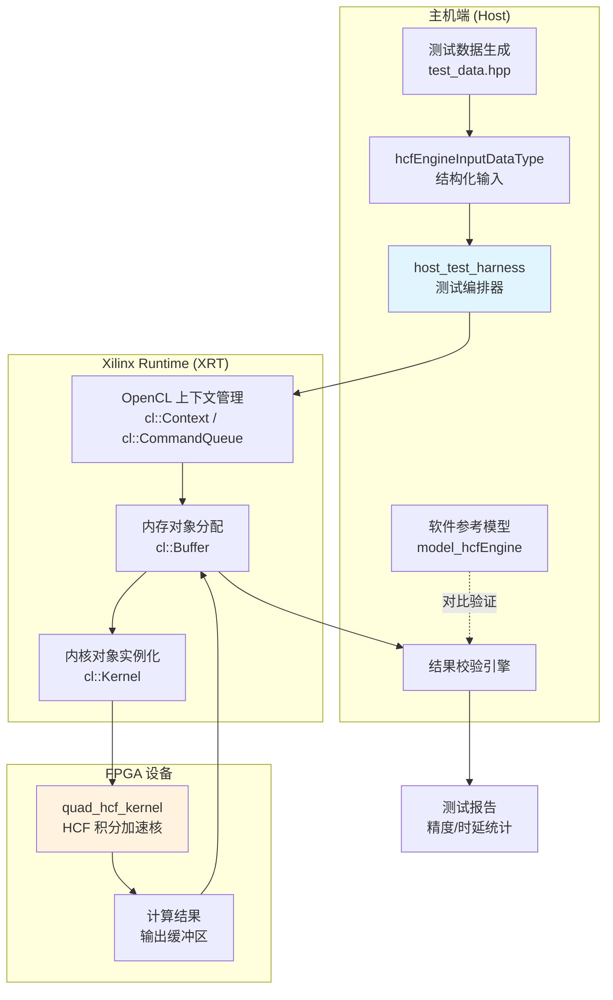
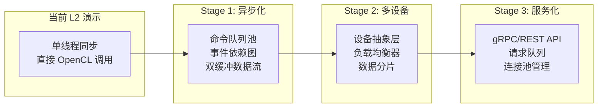

# host_test_harness 技术深度解析

## 一句话概括

`host_test_harness` 是连接 FPGA 硬件加速核与主机软件的**测试编排器**——它负责将金融量化计算中的 HCF（High-Performance Computing Finance）积分问题转化为可验证的硬件测试用例，协调数据准备、设备编程、内核执行和结果校验的全流程。

---

## 核心问题：为什么需要这个模块？

在量化金融的 FPGA 加速开发中，开发者面临一个典型的**验证困境**：

1. **算法复杂性**：HCF 模型涉及多维数值积分（如 Heston 随机波动率模型的特征函数积分），手工验证结果极易出错
2. **精度敏感性**：金融定价通常要求 0.001 甚至更高的相对精度，微小的数值差异可能导致定价偏差
3. **硬件/软件一致性**：需要确保 FPGA 实现与参考软件模型在数学上等价

**朴素的解决方案**（直接在主机上编写一次性测试脚本）存在根本缺陷：
- 缺乏标准化的数据契约，测试用例与硬件实现紧耦合
- 重复的设备管理代码（OpenCL 上下文、内存分配、内核调度）
- 结果验证逻辑散落在各处，难以维护和扩展

**设计洞察**：测试基础设施本身就是一种架构问题。`host_test_harness` 将测试编排提升为一等公民，通过**声明式数据契约**（`hcfEngineInputDataType`）和**模板化的执行流水线**，使开发者能够专注于测试逻辑而非样板代码。

---

## 架构全景：模块扮演什么角色？



### 角色定位

在完整的 [HCF Quadrature Demo Pipeline](quantitative_finance_engines-L2_quadrature_hcf_demo_pipeline.md) 架构中，`host_test_harness` 处于**主机控制平面**的核心位置：

1. **上游依赖**：从 `test_data.hpp` 接收预定义的测试向量，从 `quad_hcf_engine_def.hpp` 获取数据类型契约
2. **下游调用**：通过 [hcf_kernel_engine_and_wrapper](quantitative_finance_engines-L2_quadrature_hcf_demo_pipeline-hcf_kernel_engine_and_wrapper.md) 编译生成的 FPGA 比特流
3. **横向协作**：与 [quadrature_pi_integration_kernels](quantitative_finance_engines-L2_quadrature_hcf_demo_pipeline-quadrature_pi_integration_kernels.md) 共享底层数学库

---

## 核心组件深度解析

### `main` 函数：测试编排的主循环

`main` 函数实现了经典的**三段式测试流水线**：准备阶段 → 执行阶段 → 验证阶段。这种结构类似于硬件测试领域的 "Testbench" 模式，但针对 FPGA 加速做了特定扩展。

#### 阶段一：数据准备与契约初始化

```cpp
// 从 test_data.hpp 加载预定义测试向量
int num = sizeof(test_data) / sizeof(test_data_type);
if (num > MAX_NUMBER_TESTS) { /* 容量边界检查 */ }

// 使用页对齐分配器确保 DMA 兼容性
std::vector<struct hcfEngineInputDataType, 
             aligned_allocator<struct hcfEngineInputDataType>> input_data(num);
```

**设计洞察**：`aligned_allocator` 的选择至关重要。FPGA 设备通过 PCIe DMA 引擎访问主机内存，要求缓冲区必须页对齐（通常 4KB 边界）。使用标准 `std::allocator` 可能导致 DMA 失败或性能骤降。这种对**内存契约**的严格遵守，是主机-设备协同设计的关键。

#### 阶段二：XRT 运行时初始化

```cpp
// 设备发现与上下文建立
std::vector<cl::Device> devices = xcl::get_xil_devices();
cl::Device device = devices[0];
cl::Context ctx(device, NULL, NULL, NULL, &err);

// 命令队列配置：乱序执行 + 性能分析
cl::CommandQueue cq(ctx, device, 
    CL_QUEUE_OUT_OF_ORDER_EXEC_MODE_ENABLE | CL_QUEUE_PROFILING_ENABLE, &err);
```

**并发模型解读**：`CL_QUEUE_OUT_OF_ORDER_EXEC_MODE_ENABLE` 允许 XRT 运行时重新调度独立的命令以提高吞吐，尽管此处代码使用 `cq.finish()` 强制同步点。`CL_QUEUE_PROFILING_ENABLE` 启用了内核执行时间戳，用于后续的 `kernel_event` 分析。这种配置为**性能可观测性**奠定了基础。

#### 阶段三：内存对象与内核参数绑定

```cpp
// 使用主机指针模式（零拷贝）
cl::Buffer dev_in(ctx, CL_MEM_USE_HOST_PTR | CL_MEM_READ_ONLY, 
                  bytes_in, input_data.data(), &err);
cl::Buffer dev_out(ctx, CL_MEM_USE_HOST_PTR | CL_MEM_WRITE_ONLY, 
                   bytes_out, output_data.data(), &err);

// 内核参数绑定
krnl.setArg(0, dev_in);
krnl.setArg(1, dev_out);
krnl.setArg(2, num);
```

**内存策略分析**：`CL_MEM_USE_HOST_PTR` 标志选择**主机指针模式**而非设备专用内存分配。在此模式下，XRT 锁定主机页面并直接暴露给 FPGA DMA，避免了显式的 `enqueueWriteBuffer`/`enqueueReadBuffer` 操作。这是**零拷贝（Zero-Copy）**架构，适用于数据量适中（KB 到 MB 级）、延迟敏感的用例。代价是主机内存带宽竞争和潜在的缓存一致性开销。

#### 阶段四：执行流水线与同步点

```cpp
// 数据迁移到设备（在 USE_HOST_PTR 模式下为页锁定 + DMA 映射）
cq.enqueueMigrateMemObjects({dev_in}, 0);
cq.finish();  // 显式同步点

// 内核启动与执行
cl::Event kernel_event;
cq.enqueueTask(krnl, NULL, &kernel_event);
cq.finish();

// 结果回传
cq.enqueueMigrateMemObjects({dev_out}, CL_MIGRATE_MEM_OBJECT_HOST);
cq.finish();
```

**同步策略反思**：代码采用**完全同步（Fully Synchronous）**执行模型，每个操作后都跟随 `cq.finish()`。这牺牲了潜在的流水线并行（数据准备与计算重叠），换取了**确定性**和**简单性**。对于测试场景，这种权衡是合理的——测试正确性优先于峰值性能。生产部署可考虑**双缓冲**或**命令依赖图**（`cl::WaitList`）来重叠数据移动与计算。

#### 阶段五：结果验证与报告

```cpp
// 与参考模型对比（容差内通过）
for (int i = 0; i < num; i++) {
    if (!check(output_data[i], test_data[i].exp)) {
        // 记录失败详情
    }
}

// 生成综合报告：精度统计 + 时延分解
std::cout << "Integration tolerance: " << integration_tolerance << std::endl;
std::cout << "Timings:" << std::endl;
std::cout << "    program device  = " << t_program << " us" << std::endl;
std::cout << "    mem to device   = " << t_mem_to_device << " us" << std::endl;
```

**验证哲学**：测试框架遵循**双重验证**原则——不仅检查 FPGA 输出是否在容差范围内（`check()` 函数使用 `fabs(act - exp) > TEST_TOLERANCE`），还追踪**最大误差**（`error_max`）以识别系统性偏差。时延报告按阶段分解（设备编程、数据迁移、内核执行、结果回传），使性能瓶颈定位成为可能。

---

### `hcfEngineInputDataType`：数据契约的载体

```cpp
struct hcfEngineInputDataType {
    TEST_DT s;      // 标的资产价格 (Spot price)
    TEST_DT k;      // 行权价 (Strike price)
    TEST_DT t;      // 到期时间 (Time to maturity)
    TEST_DT v;      // 初始方差 (Initial variance)
    TEST_DT r;      // 无风险利率 (Risk-free rate)
    TEST_DT rho;    // 相关系数 (Correlation)
    TEST_DT vvol;   // 波动率的波动率 (Vol of vol)
    TEST_DT vbar;   // 长期平均方差 (Long-term mean variance)
    TEST_DT kappa;  // 均值回归速度 (Mean reversion speed)
    TEST_DT tol;    // 积分容差 (Integration tolerance)
};
```

**领域语义解析**：这个数据结构封装了 **Heston 随机波动率模型** 的完整参数空间。Heston 模型是量化金融中广泛使用的期权定价模型，其特征函数涉及复平面上的数值积分——这正是 FPGA 加速核 `quad_hcf_kernel` 的核心计算任务。

**内存布局考量**：结构体字段按 **8 字节对齐**（假设 `TEST_DT` 为 `double`），符合大多数 64 位系统的自然对齐要求。字段顺序遵循**从金融语义到数值控制**的逻辑：前 10 个字段为模型参数，最后 1 个字段（`tol`）为算法控制参数。这种分组便于调试时快速识别参数类型。

---

### 辅助函数与全局契约

#### `check` 函数：容差验证的数学基础

```cpp
static int check(TEST_DT act, TEST_DT exp) {
    if (fabs(act - exp) > TEST_TOLERANCE) {
        return 0;  // 失败
    }
    return 1;  // 通过
}
```

**数值分析视角**：使用**绝对误差**（`fabs(act - exp)`）而非相对误差，意味着测试在数值量级差异较大的测试用例中可能表现不一致。例如，`exp = 1e6` 时，`TEST_TOLERANCE = 0.001` 的相对容差仅为 `1e-9`；而 `exp = 1e-6` 时，相同的绝对容差意味着 `100%` 的相对误差容忍。这种设计隐含假设：测试用例的数值量级在同一数量级。

#### `model_hcfEngine`：黄金参考模型

```cpp
extern TEST_DT model_hcfEngine(struct hcfEngineInputDataType* input_data);
```

**验证策略的核心**：`extern` 声明显示这是一个在别处定义的软件参考实现。这种**双轨验证**（软件模型 vs 硬件实现）是硬件加速开发的标准实践：
- **软件模型**：高精度、可调试、作为"黄金标准"
- **硬件实现**：追求性能，但必须在数学上与软件模型等价

---

## 依赖关系与数据流分析

### 向上依赖（本模块依赖谁）

| 依赖模块 | 依赖性质 | 说明 |
|---------|---------|------|
| [hcf_kernel_engine_and_wrapper](quantitative_finance_engines-L2_quadrature_hcf_demo_pipeline-hcf_kernel_engine_and_wrapper.md) | 硬依赖 | 提供 `quad_hcf_kernel` FPGA 内核实现及对应的 `.xclbin` 比特流文件。没有内核实现，测试框架无法执行实际计算。 |
| [quadrature_pi_integration_kernels](quantitative_finance_engines-L2_quadrature_hcf_demo_pipeline-quadrature_pi_integration_kernels.md) | 软依赖 | 共享数学常量和数值积分基础库（如 `TEST_DT` 类型定义、圆周率常量等）。 |
| `test_data.hpp` | 数据依赖 | 预定义的测试向量集合，包含输入参数和期望输出。测试框架本身不生成数据，而是消费这些黄金测试用例。 |
| `xcl2.hpp` | 平台依赖 | Xilinx 提供的 OpenCL 封装库，简化设备发现、内存管理和内核调度。抽象了底层 XRT（Xilinx Runtime）的复杂性。 |

### 向下被依赖（谁依赖本模块）

本模块作为**叶节点测试工具**，通常不被其他模块直接依赖。但在 CI/CD 流水线中，它作为**质量门禁**被调用：

- **上游内核修改触发**：当 `hcf_kernel_engine_and_wrapper` 中的 RTL 代码变更时，本测试框架自动执行，确保硬件实现的数值正确性没有退化
- **回归测试套件**：作为 L2 演示层的一部分，验证从算法到硬件实现的端到端链路

---

## 数据流追踪：端到端执行全景

下面追踪一个典型测试用例（Heston 模型参数 → 积分结果）的完整数据旅程：

```
阶段 1：测试准备（主机内存）
━━━━━━━━━━━━━━━━━━━━━━━━━━━━━
test_data.hpp 中的静态数组
    │
    ├─ 字段映射 ──→ hcfEngineInputDataType.s, .k, .t, ... (共11个字段)
    │
    ▼
std::vector<hcfEngineInputDataType, aligned_allocator<...>> input_data
    │
    └─ 页对齐分配（4KB 边界）→ 满足 FPGA DMA 要求


阶段 2：设备初始化（XRT 运行时）
━━━━━━━━━━━━━━━━━━━━━━━━━━━━━━━
xclbin 文件路径 (argv[1])
    │
    ▼
xcl::import_binary_file() ──→ 比特流加载
    │
    ▼
cl::Program ──→ cl::Kernel("quad_hcf_kernel")
    │
    ├─ 参数 0: cl::Buffer dev_in (CL_MEM_USE_HOST_PTR)
    ├─ 参数 1: cl::Buffer dev_out (CL_MEM_USE_HOST_PTR)
    └─ 参数 2: int num (测试用例数量)


阶段 3：数据传输与执行（FPGA 加速）
━━━━━━━━━━━━━━━━━━━━━━━━━━━━━━━━━
cq.enqueueMigrateMemObjects({dev_in}, 0)
    │
    ├─ 页锁定主机内存（pinning）
    ├─ 虚拟地址 → 物理地址映射
    └─ DMA 引擎启动（PCIe 事务层包）
    │
    ▼
FPGA 设备内存 (HBM/DRAM)
    │
    ▼
cq.enqueueTask(krnl) ──→ quad_hcf_kernel 执行
    │
    ├─ 读取输入参数 (s, k, t, v, ...)
    ├─ 数值积分计算 (Gauss-Kronrod/自适应求积)
    └─ 写入积分结果
    │
    ▼
cq.enqueueMigrateMemObjects({dev_out}, CL_MIGRATE_MEM_OBJECT_HOST)
    │
    ▼
主机内存 output_data[] ──→ 结果回传


阶段 4：结果验证（数值正确性）
━━━━━━━━━━━━━━━━━━━━━━━━━━━━━━
output_data[i] (FPGA 结果)
    │
    ├─ check() ──→ fabs(act - exp) > TEST_TOLERANCE ?
    │
    ▼
test_data[i].exp (期望结果，来自软件模型 model_hcfEngine 的离线计算)
    │
    ├─ 通过：计数累加，记录最大误差
    └─ 失败：打印详细差异 (索引、期望值、实际值、绝对误差)
    │
    ▼
测试报告生成
    ├─ 配置参数：integration_tolerance, TEST_TOLERANCE
    ├─ 统计汇总：总用例数、失败数、最大误差
    └─ 时延分解：program / mem_to_device / run / mem_from_device
```

---

## 设计决策与权衡分析

### 决策 1：同步执行 vs 异步流水线

**选择的方案**：显式同步（`cq.finish()` 阻塞每个操作）

**权衡对比**：

| 维度 | 同步执行（当前） | 异步流水线（替代方案） |
|------|----------------|----------------------|
| 代码复杂度 | 低，线性逻辑 | 高，需事件依赖图管理 |
| 调试友好性 | 高，确定性执行序 | 低，竞态难以复现 |
| 性能 | 次优，无计算/传输重叠 | 最优，流水线并行 |
| 适用场景 | 功能验证、算法调试 | 生产部署、吞吐优化 |

**决策理由**：该模块定位为**验证工具**而非生产运行时。在金融算法的 FPGA 开发中，数值正确性的验证优先于峰值性能。同步模型确保了测试的可重复性和调试的便捷性——当测试失败时，开发者可以精确定位到哪个阶段（数据迁移、内核执行或结果回传）出现了问题。

### 决策 2：主机指针模式 vs 设备专用内存

**选择的方案**：`CL_MEM_USE_HOST_PTR`（零拷贝主机指针模式）

**权衡对比**：

| 维度 | 主机指针模式（当前） | 设备专用内存（替代方案） |
|------|---------------------|------------------------|
| 内存拷贝 | 无显式拷贝，DMA 直接访问 | 需 `enqueueWriteBuffer`/`enqueueReadBuffer` |
| 内存占用 | 仅主机内存，无设备端副本 | 主机 + 设备双份存储 |
| 访问延迟 | 首次访问触发页锁定开销 | 预分配完成，访问延迟确定 |
| 数据规模限制 | 受主机物理内存限制 | 可扩展至设备 HBM 容量 |
| 缓存一致性 | 需显式同步或禁用缓存 | 显式传输天然隔离 |

**决策理由**：HCF 测试用例的数据规模通常在 KB 到几十 MB 级别（每个 `hcfEngineInputDataType` 约 88 字节，默认最大测试数 `MAX_NUMBER_TESTS` 通常设为 100-1000）。在此规模下：

1. **开销主导因素转移**：设备编程（`cl::Program` 创建）通常耗时数百毫秒，而数据迁移在零拷贝模式下仅需微秒级的页锁定操作。显式拷贝的 API 开销反而更高。

2. **内存占用可控**：即使 1000 个测试用例，输入数据仅约 86KB，输出数据 8KB，远低于现代系统的内存压力阈值。

3. **代码简洁性**：避免了显式的 `enqueueWriteBuffer`/`enqueueReadBuffer` 调用，数据在主机端的 `std::vector` 中就地准备，内核执行后原地读取结果，符合 C++ 开发者的直觉。

### 决策 3：预定义测试数据 vs 运行时生成

**选择的方案**：预定义的静态测试数组（`test_data.hpp` 中的 `test_data[]`）

**权衡对比**：

| 维度 | 预定义数据（当前） | 运行时生成（替代方案） |
|------|-----------------|----------------------|
| 可重复性 | 确定性，每次执行相同 | 依赖随机种子，需日志记录 |
| 覆盖度 | 固定，需手动扩展 | 可参数化生成大规模随机用例 |
| 期望结果获取 | 预计算（通过软件模型离线计算） | 运行时调用参考模型对比 |
| 调试友好性 | 失败时可精确定位到已知输入 | 需复现随机条件 |

**决策理由**：金融数值计算的测试具有特殊的**监管与审计要求**。在量化交易系统的开发中，测试用例不仅是验证工具，更是**合规证据**——需要证明特定输入产生了经过验证的输出。预定义数据集确保了：

1. **回归测试的确定性**：当硬件实现或编译器优化链变更时，可以精确对比新旧结果，识别数值精度的任何退化。

2. **交叉验证的可信度**：期望输出 `test_data[i].exp` 通常由高精度的软件参考模型（如 Python 的 SciPy 或 MATLAB 的符号计算工具箱）离线计算，使用比 `TEST_TOLERANCE` 严格 100 倍甚至 1000 倍的精度。这种"金标准"对比是 FPGA 实现 sign-off 的必要条件。

---

## 扩展性与生产化考量

### 当前的架构约束

作为 L2 演示级代码，`host_test_harness` 存在明确的**扩展天花板**：

1. **单设备限制**：硬编码 `devices[0]`，不支持多 FPGA 卡并行
2. **单内核限制**：仅实例化一个 `quad_hcf_kernel`，无内核复制（kernel replication）
3. **阻塞式 API**：`cq.finish()` 导致 CPU 空闲等待，无法重叠主机端计算
4. **固定数据类型**：`TEST_DT` 通常在编译期定义为 `double`，无动态精度切换能力

### 生产化演进路径

若需将此测试框架演进为生产级运行时，建议的架构演进方向：



**Stage 1（异步化）的具体改造点**：

1. **移除 `cq.finish()` 阻塞点**：改为 `cl::Event` 依赖链，允许数据迁移与内核执行重叠
2. **引入双缓冲**：当 FPGA 处理第 N 批次数据时，CPU 准备第 N+1 批次，类似 GPU 渲染管线的 swap buffer 模式
3. **批处理 API**：将 `num` 从标量扩展为范围，支持单内核调用处理变长批次，减少内核启动开销

---

## 使用指南与最佳实践

### 编译与运行

```bash
# 1. 环境设置（Xilinx 工具链）
source /opt/xilinx/xrt/setup.sh
export XCL_EMULATION_MODE=hw_emu  # 或 hw 用于真实 FPGA

# 2. 编译主机代码
g++ -std=c++11 -I$XILINX_XRT/include \
    -I/path/to/xf_utils_sw/include \
    -L$XILINX_XRT/lib -lOpenCL -lXilinxOpenCL \
    -o quad_hcf_test quad_hcf_test.cpp

# 3. 运行测试
./quad_hcf_test <path_to_xclbin> [integration_tolerance]

# 示例
./quad_hcf_test ./build_dir.hw.xilinx_u50_gen3x16_xdma_201920_3/quad_hcf.xclbin 0.0001
```

### 典型输出解读

```
Processing input data          # 阶段 1：数据准备
Creating context               # 阶段 2：运行时初始化
Creating command queue
Programming device             # xclbin 加载（通常最耗时）
Allocating memory objects
Set device arguments
Migrate memory to device       # H2D 数据传输
Launching kernel               # FPGA 执行
...
Results:
Integration tolerance: 0.0001  # 算法控制参数
Result tolerance:      0.001   # 验证通过阈值
Number of tests:       10
Out of tolerance:      0       # 失败用例数（0 = 全部通过）
Max error:             0.00023  # 最大绝对误差（用于精度趋势分析）
Timings:                       # 时延分解（微秒级）
    program device  = 234567 us  # 通常占主导（FPGA 配置时间）
    mem to device   = 12 us
    run kernel      = 45 us
    mem from device = 8 us
```

### 故障排查速查表

| 症状 | 可能原因 | 排查步骤 |
|------|---------|---------|
| `ERROR: too many tests` | 测试用例数超过编译期限制 `MAX_NUMBER_TESTS` | 检查 `test_data.hpp` 中的数组长度，或调整头文件中的宏定义 |
| `ERROR: failed to create buffer` | OpenCL 内存分配失败 | 1. 检查 `XCL_EMULATION_MODE` 是否设置正确<br>2. 确认设备有足够的 HBM/DRAM 可用 |
| `ERROR: failed to migrate memory` | DMA 传输失败 | 1. 确认 `input_data` 使用 `aligned_allocator`（页对齐）<br>2. 检查 `xclbin` 是否包含有效的内核连接信息 |
| 大量测试失败 (`Out of tolerance > 0`) | 数值精度退化或实现错误 | 1. 检查 `integration_tolerance` 参数（过小可能导致积分不收敛）<br>2. 对比 `model_hcfEngine` 的参考输出，确认软件模型本身正确<br>3. 检查 FPGA 内核的编译优化级别（过高的 `-O3` 可能引入浮点重排） |
| `program device` 时间异常长 (> 1s) | 比特流加载缓慢 | 1. 确认使用 `hw` 模式而非 `hw_emu`（仿真模式编程更快但执行更慢）<br>2. 检查 PCIe 链路状态（`lspci -vv` 查看链路速度） |

---

## 边缘情况与隐含契约

### 内存所有权与生命周期契约

```cpp
// 关键生命周期节点示意图

[1] 分配
std::vector<...> input_data(num);
│
▼
[2] Buffer 绑定（无拷贝）
cl::Buffer dev_in(ctx, CL_MEM_USE_HOST_PTR, ..., input_data.data());
│   │
│   └── dev_in 不拥有内存，仅引用 input_data.data()
│
▼
[3] 内核执行期间
FPGA DMA 引擎 ──→ 物理页（input_data 锁定）
│
▼
[4] 结果回传完成
output_data 可读
│
▼
[5] 析构（隐式）
input_data 超出作用域 → 内存释放
│   │
│   └── 若 dev_in 未先释放，UB！（实际中 cl::Buffer 析构先于 vector）
▼
[安全] 借助 cl::Buffer 析构顺序（成员析构逆序）保证安全
```

**关键洞察**：`CL_MEM_USE_HOST_PTR` 模式建立了**别名关系**——`dev_in` 和 `input_data` 引用相同的物理内存页。这意味着：

1. **生存期耦合**：`input_data` 必须在 `dev_in` 的整个生命周期内保持有效。若 `input_data` 在 `cl::Buffer` 销毁前被释放或重新分配（如 `vector` 扩容），将导致未定义行为（FPGA DMA 可能访问无效物理地址）。

2. **写后读风险**：主机代码在 `enqueueMigrateMemObjects(dev_out, ...)` 完成前不得读取 `output_data`，因为 FPGA 可能仍在写入。代码通过 `cq.finish()` 显式同步避免此问题。

3. **页锁定开销**：`CL_MEM_USE_HOST_PTR` 触发 `mlock` 类的页锁定操作，防止操作系统交换出这些页面。大量或过大的缓冲区可能导致系统内存压力。本模块的测试数据规模（通常 < 1MB）远低于此阈值。

### 浮点精度契约

```cpp
#define TEST_TOLERANCE 0.001  // 绝对容差
```

**精度契约的三层语义**：

1. **算法容差**（`integration_tolerance`，运行时参数）：控制 Heston 模型特征函数积分的收敛准则。较小的值（如 `1e-6`）要求更精细的积分网格，增加计算量但提高精度。

2. **验证容差**（`TEST_TOLERANCE`，编译时常量）：判断 FPGA 结果是否"足够接近"参考值。`0.001` 的绝对容差对于通常在 `0.1` 到 `100` 范围内的期权价格而言，相当于 `0.1%` 到 `0.001%` 的相对误差。

3. **机器精度**：底层 `double` 类型提供约 `15` 位十进制精度。FPGA 内核可能使用定点数或单精度浮点优化，`TEST_TOLERANCE` 必须在算法精度和硬件实现约束之间取得平衡。

**精度退化的根因分析**：若测试持续失败，可能原因包括：
- **收敛不足**：`integration_tolerance` 设置过松，积分未充分收敛
- **数值不稳定性**：Heston 模型在特定参数区域（如高相关性 `rho` 接近 1）出现特征函数振荡
- **硬件精度损失**：FPGA 内核使用定点化或单精度优化，累积舍入误差
- **编译优化副作用**：激进的浮点重排（`-ffast-math` 类优化）破坏了结合律假设

### 时序分析的隐含假设

```cpp
auto start = std::chrono::high_resolution_clock::now();
// ... 被测操作 ...
auto elapsed = std::chrono::high_resolution_clock::now() - start;
long long t_program = std::chrono::duration_cast<std::chrono::microseconds>(elapsed).count();
```

**测量精度的边界条件**：

1. **时钟分辨率**：`high_resolution_clock` 通常映射到 CPU 的 TSC（时间戳计数器）或 `clock_gettime(CLOCK_MONOTONIC)`，分辨率约纳秒级。但对于微秒级（`us`）测量，系统调度和中断抖动可能引入 `1-10 us` 的噪声。

2. **同步开销**：`cq.finish()` 阻塞直到命令队列清空，但命令提交到实际执行存在驱动层和硬件调度延迟。测量值包含：
   - 用户态 → 内核态切换
   - XRT 驱动处理
   - PCIe 事务层包传输
   - FPGA 调度器响应

3. **冷启动 vs 稳态**：首次 `enqueueMigrateMemObjects` 可能触发页错误和页锁定开销，后续调用更快。测试框架未进行"热身"（warm-up）迭代，单次测量可能不具统计显著性。

**使用建议**：
- 对于**绝对时延评估**，运行 `N` 次（如 `N=100`）取中位数，排除冷启动异常值
- 对于**相对性能比较**（如优化前后对比），使用相同的测量方法和系统负载，控制变量
- 对于**生产性能预测**，理解该测量是"主机视角"的端到端时延，非纯内核执行周期数

---

## 总结：新贡献者的关键认知清单

### 必须理解的三条核心契约

1. **内存别名契约**：`CL_MEM_USE_HOST_PTR` 使 `cl::Buffer` 和 `std::vector` 共享物理页。确保 `vector` 在 `Buffer` 销毁前不被重新分配或释放，否则 DMA 将访问无效地址。

2. **精度分层契约**：区分算法容差（`integration_tolerance`，控制积分收敛）、验证容差（`TEST_TOLERANCE`，判断测试通过）、机器精度（`double` 的 ~15 位数字）。理解这三者的关系是调试数值失败的关键。

3. **同步边界契约**：代码使用完全同步模型（`cq.finish()` 阻塞每个阶段）。这牺牲了性能换取确定性——测试失败时，你知道数据在哪里（或未到哪里）。修改代码引入异步时，需重新建立内存可见性和时序保证。

### 高风险修改区域（需谨慎）

| 修改场景 | 风险 | 缓解措施 |
|---------|------|---------|
| 修改 `hcfEngineInputDataType` 字段 | 破坏与 FPGA 内核的二进制兼容，导致数据解析错误 | 同步更新内核代码、重新编译 xclbin、更新测试数据生成脚本 |
| 更换 `aligned_allocator` 为 `std::allocator` | 可能导致 DMA 失败或静默数据损坏（非对齐访问） | 保留对齐分配，或通过 `posix_memalign` 手动分配 |
| 移除 `cq.finish()` 引入异步 | 导致结果验证时读到未写入的数据，时序测量失效 | 使用 `cl::Event` 依赖链确保顺序，或保留关键同步点 |
| 调整 `TEST_TOLERANCE` 放松精度 | 可能掩盖硬件实现的数值问题，导致生产环境出现定价偏差 | 保持容差严格，调查并修复精度退化根因，而非放宽阈值 |

### 推荐阅读路径

1. **理解领域背景**：阅读 [HCF Kernel Engine](quantitative_finance_engines-L2_quadrature_hcf_demo_pipeline-hcf_kernel_engine_and_wrapper.md) 了解 FPGA 内核的微架构设计
2. **深入数值方法**：探索 [Quadrature PI Integration Kernels](quantitative_finance_engines-L2_quadrature_hcf_demo_pipeline-quadrature_pi_integration_kernels.md) 理解 Gauss-Kronrod 求积法的硬件实现
3. **扩展测试框架**：若需支持新模型（如 SABR、Local Volatility），参考 [host_acceleration_timing_and_phase_profiling](quantitative_finance_engines-L2_quadrature_hcf_demo_pipeline-host_acceleration_timing_and_phase_profiling.md) 中的性能分析模式

---

## 附录：关键代码段速查

### 主机指针模式内存分配（页对齐）

```cpp
#include "xcl2.hpp"  // 提供 aligned_allocator

// 输入缓冲区：页对齐，满足 FPGA DMA 要求
std::vector<hcfEngineInputDataType, 
             aligned_allocator<hcfEngineInputDataType>> input_data(num);

// 输出缓冲区
std::vector<TEST_DT, aligned_allocator<TEST_DT>> output_data(num);

// 创建 OpenCL 缓冲区：零拷贝，使用主机指针
cl::Buffer dev_in(ctx, CL_MEM_USE_HOST_PTR | CL_MEM_READ_ONLY, 
                  bytes_in, input_data.data(), &err);
cl::Buffer dev_out(ctx, CL_MEM_USE_HOST_PTR | CL_MEM_WRITE_ONLY, 
                   bytes_out, output_data.data(), &err);
```

### 内核执行与事件同步

```cpp
// 创建性能分析启用的命令队列
cl::CommandQueue cq(ctx, device, 
    CL_QUEUE_OUT_OF_ORDER_EXEC_MODE_ENABLE | CL_QUEUE_PROFILING_ENABLE, &err);

// 数据迁移到设备（主机指针模式下触发页锁定）
err = cq.enqueueMigrateMemObjects({dev_in}, 0);
cq.finish();  // 显式同步：确保数据到达设备

// 启动内核，捕获性能事件
cl::Event kernel_event;
err = cq.enqueueTask(krnl, NULL, &kernel_event);
cq.finish();  // 显式同步：等待计算完成

// 结果回传（设备到主机）
err = cq.enqueueMigrateMemObjects({dev_out}, CL_MIGRATE_MEM_OBJECT_HOST);
cq.finish();  // 显式同步：确保结果可读

// 时延提取（可选）
cl_ulong start_ns, end_ns;
kernel_event.getProfilingInfo(CL_PROFILING_COMMAND_START, &start_ns);
kernel_event.getProfilingInfo(CL_PROFILING_COMMAND_END, &end_ns);
double kernel_time_ms = (end_ns - start_ns) * 1e-6;
```

### 容差验证模式

```cpp
// 容差定义（编译期常量）
#define TEST_TOLERANCE 0.001  // 根据金融精度要求调整

// 验证函数
static int check(TEST_DT act, TEST_DT exp) {
    // 使用绝对误差（适用于数值量级一致的测试集）
    if (fabs(act - exp) > TEST_TOLERANCE) {
        return 0;  // 失败
    }
    return 1;  // 通过
}

// 批量验证与误差统计
int fails = 0;
double error_max = 0;
for (int i = 0; i < num; i++) {
    if (!check(output_data[i], test_data[i].exp)) {
        std::cout << "FAIL[" << i << "]: Expected " << test_data[i].exp
                  << ", got " << output_data[i] 
                  << ", diff " << fabs(output_data[i] - test_data[i].exp)
                  << std::endl;
        fails++;
    }
    // 追踪最大误差（用于精度趋势分析）
    if (fabs(output_data[i] - test_data[i].exp) > error_max) {
        error_max = fabs(output_data[i] - test_data[i].exp);
    }
}
```
