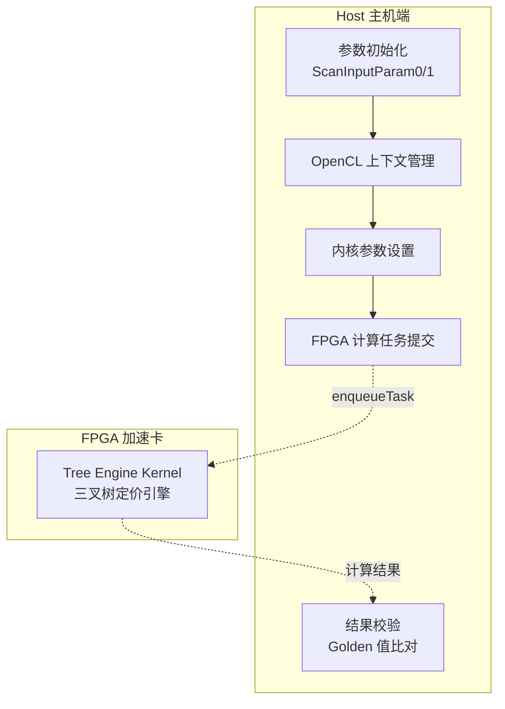
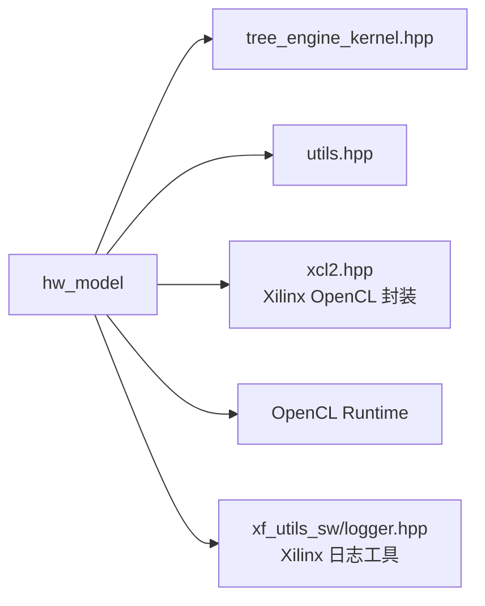

# hw_model: Hull-White 单因子短期利率模型实现

## 概述

`hw_model` 模块实现了 **Hull-White (HW) 单因子短期利率模型**，用于在 FPGA 上加速百慕大式互换期权（Bermudan Swaption）的定价计算。该模型是利率衍生品定价领域的核心数值方法，通过构建三叉树（Trinomial Tree）来模拟利率的随机演化过程。

想象一下：如果你需要预测未来 10 年的利率走势，并基于这些预测计算一个可以在多个时间点提前行权的金融衍生品价值——这就是该模块要解决的实际问题。它不仅仅是一个数学公式实现，而是一个完整的、硬件加速的数值计算引擎。

---

## 架构设计

### 核心组件角色



### 数据流全景

整个模块的数据流动遵循**"配置 → 传输 → 计算 → 回传 → 验证"**的五阶段流水线：

1. **参数配置阶段**：在主机内存中构建 `ScanInputParam0` 和 `ScanInputParam1` 结构体，填充 Hull-White 模型参数（均值回归速度 $a$、波动率 $\sigma$、平坦利率 $flatRate$）、时间网格配置（`timestep`）、行权时间表等。

2. **内存分配与映射**：使用 `aligned_alloc` 确保主机内存按页对齐，满足 FPGA 直接内存访问（DMA）的对齐要求。创建 `cl_mem_ext_ptr_t` 扩展指针，建立主机缓冲区与特定计算单元（CU）的关联。

3. **OpenCL 上下文初始化**：加载 XCLBIN 文件（包含已综合的 FPGA 比特流），创建设备上下文、命令队列和内核对象。检测并实例化所有可用的计算单元（CU）。

4. **数据迁移与计算**：通过 `enqueueMigrateMemObjects` 将输入参数从主机内存异步传输到 FPGA 的 HBM/DRAM。使用 `enqueueTask` 提交内核计算任务，利用 OpenCL 事件对象追踪执行状态。

5. **结果回传与验证**：计算完成后，将结果缓冲区迁移回主机内存。将 FPGA 计算的 NPV（净现值）与预计算的 `golden` 值比对，验证数值精度（容忍误差 `minErr = 10e-10`）。

---

## 核心组件详解

### `main.cpp` - 主机端控制器

这是整个模块的入口点和协调中心。尽管名为 `main`，它实际上是一个完整的**异构计算编排器**，负责管理 CPU 主机与 FPGA 加速器之间的协作。

#### 关键职责

| 职责 | 实现机制 | 设计意图 |
|------|----------|----------|
| **参数配置** | 直接内存操作填充 `ScanInputParam` 结构体 | 避免复杂的序列化/反序列化，直接映射到内核参数布局 |
| **运行时模式切换** | 预处理器宏 `HLS_TEST` / `SW_EMU_TEST` | 支持纯软件仿真、硬件仿真和实际硬件三种执行模式，无需修改业务逻辑 |
| **内存对齐管理** | `aligned_alloc<T>()` | 满足 FPGA DMA 的页对齐要求（通常为 4KB），避免额外的拷贝开销 |
| **多 CU 扩展** | 动态检测 `CL_KERNEL_COMPUTE_UNIT_COUNT` | 根据实际 FPGA 资源配置自动扩展到多个计算单元，实现横向扩展 |

#### 运行时模式策略

模块支持三种执行模式，通过编译时宏和运行时环境变量共同决定：

- **`HLS_TEST` 模式**：纯 C++ 仿真，用于算法验证和快速迭代。此时完全不链接 OpenCL/Xilinx 运行时，所有计算在主机 CPU 上执行。
- **硬件仿真模式 (`hw_emu`)**：使用 Vivado Simulator 模拟 FPGA 行为，检查时序和协议正确性。通过检查环境变量 `XCL_EMULATION_MODE` 自动切换。
- **硬件模式 (`hw`)**：在真实 Alveo 加速卡上执行，启用 Out-of-Order 命令队列和性能剖析。

这种分层策略的精妙之处在于：**同一套源代码可以在从算法验证到生产部署的全生命周期中复用**，无需为不同目标维护多个代码分支。

---

## 依赖关系分析

### 上游依赖（本模块调用）



| 依赖模块 | 依赖类型 | 用途说明 | 接口契约 |
|----------|----------|----------|----------|
| `tree_engine_kernel.hpp` | 强依赖 | 定义 `ScanInputParam0`、`ScanInputParam1` 结构体和 `DT` 数值类型，声明 FPGA 内核接口 | 主机端必须与内核端的结构体内存布局完全一致（包括填充和对齐），否则导致未定义行为 |
| `utils.hpp` | 工具依赖 | 提供 `aligned_alloc`、时间差计算 `tvdiff` 等辅助函数 | 跨平台内存对齐和精确计时抽象 |
| `xcl2.hpp` | 平台依赖 | Xilinx OpenCL 扩展，提供 `get_xil_devices`、`import_binary_file` 等 FPGA 专用功能 | 仅在非 `HLS_TEST` 模式下需要，提供了对 Xilinx 硬件的可移植访问层 |
| `xf_utils_sw/logger.hpp` | 日志依赖 | 统一的测试结果记录和格式化输出 | 支持 PASS/FAIL 状态的自动判定和报告 |

### 下游依赖（调用本模块）

作为叶节点模块（Leaf Module），`hw_model` 没有直接的下游被依赖方。它属于 **可执行应用层**，其 `main.cpp` 是程序入口点而非库函数。然而，从逻辑架构角度，它依赖于以下上游概念框架：

- **父级模块**: [swaption_tree_engines_single_factor_short_rate_models](quantitative_finance_engines-L2_tree_based_interest_rate_engines-swaption_tree_engines_single_factor_short_rate_models.md) - 提供 Hull-White、Vasicek 等单因子模型的通用框架
- **层级模块**: [L2_tree_based_interest_rate_engines](quantitative_finance_engines-L2_tree_based_interest_rate_engines.md) - 树方法定价引擎的基础设施
- **业务领域**: [quantitative_finance_engines](quantitative_finance_engines.md) - 金融衍生品定价的知识领域

---

## 设计决策与权衡

### 1. 编译时多态 vs. 运行时多态

**决策**：使用预处理器宏（`HLS_TEST`、`SW_EMU_TEST`）在编译时选择执行路径，而非虚函数或策略模式在运行时决定。

**权衡分析**：

| 维度 | 当前方案（编译时） | 替代方案（运行时） |
|------|-------------------|-------------------|
| **性能** | 零运行时开销，条件分支完全消除 | 每次调用都有虚表查找或条件判断开销 |
| **二进制大小** | 三种模式各自独立编译，无冗余代码 | 单一二进制包含所有模式代码 |
| **灵活性** | 切换模式必须重新编译 | 可通过命令行参数或配置文件动态切换 |
| **调试体验** | 代码路径在编译期确定，IDE 可准确分析 | 动态分发可能导致调试器难以追踪实际执行路径 |

**设计意图**：该模块定位是**高性能计算内核的宿主程序**，性能是首要目标。三种执行模式的差异极大（纯 CPU vs. 硬件仿真 vs. 真实硬件），运行时抽象的收益远小于其开销。此外，这三种模式在部署场景上是互斥的（你不会在生产硬件上同时需要软件仿真能力），因此编译时选择是合理且务实的工程决策。

### 2. 显式内存管理 vs. 智能指针

**决策**：使用裸指针配合 `aligned_alloc` 分配对齐内存，手动管理生命周期；在 FPGA 数据传输场景中使用原始 `cl::Buffer` 对象。

**权衡分析**：

| 维度 | 当前方案（裸指针/显式管理） | 替代方案（现代 C++ 智能指针） |
|------|---------------------------|---------------------------|
| **对齐内存支持** | `aligned_alloc` 直接提供页对齐内存，满足 FPGA DMA 要求 | `std::unique_ptr` 配合自定义删除器可实现，但语法繁琐 |
| **OpenCL 互操作** | `cl_mem_ext_ptr_t` 直接持有裸指针，无缝集成 Xilinx 扩展 | 需通过 `.get()` 解引用智能指针，增加间接层 |
| **异常安全** | 需确保异常路径上手动释放内存，否则泄漏 | RAII 自动管理，异常发生时自动析构 |
| **性能** | 零开销抽象，直接内存操作 | 引用计数（`shared_ptr`）有原子操作开销，但 `unique_ptr` 无额外开销 |
| **代码清晰度** | 分配/释放逻辑显式可见，但需仔细审查确保配对 | 意图更声明式，但自定义分配器增加了复杂度 |

**设计意图**：此模块处于**主机-设备边界**的敏感地带，内存布局和对齐要求严格受限于 FPGA 硬件约束。`aligned_alloc` 提供的内存页对齐（4KB 对齐）是 Xilinx DMA 引擎的硬性要求；`cl_mem_ext_ptr_t` 结构体要求直接裸指针以建立零拷贝（Zero-Copy）内存映射。

在这种**硬件强约束**场景下，尝试用智能指针封装反而会导致：
1. 自定义删除器需要捕获对齐信息，增加复杂性
2. OpenCL C API 与 C++ 封装层的阻抗失配
3. 关键路径上增加不必要的抽象层

因此，模块选择了**局部化、显式化的内存管理策略**：分配和释放逻辑集中在 `main()` 函数的显式作用域内，配合 `#ifndef HLS_TEST` 的条件编译，确保在不同执行模式下都能正确管理资源。这是一种在硬件约束和代码安全之间务实的平衡。

### 3. 同步阻塞 vs. 异步流水线

**决策**：在 FPGA 计算阶段使用 `q.finish()` 阻塞等待内核完成，而非构建深度异步流水线。

**权衡分析**：

| 维度 | 当前方案（同步阻塞） | 替代方案（异步流水线） |
|------|-------------------|-------------------|
| **实现复杂度** | 简单直接，顺序执行易于理解和调试 | 需要管理事件依赖图、流水线阶段同步、反压控制 |
| **资源利用率** | FPGA 计算时主机阻塞，CPU 空闲等待 | 主机可在 FPGA 计算时准备下一批次数据，实现并行 |
| **延迟（单次）** | 无流水线填充开销，单次请求延迟最优 | 首次请求需填满流水线，引入额外延迟 |
| **吞吐量（批量）** | 批处理时需串行等待，吞吐量受限 | 流水线满负荷后可每周期产出一个结果，吞吐最大化 |
| **内存占用** | 单批次内存占用，生命周期短 | 多批次并发需维护更多飞行中（in-flight）缓冲区 |

**设计意图**：该模块的定位是**定价引擎的基准测试和验证程序**（`benchmark host`），而非生产级的高吞吐量定价服务。观察代码中的以下线索：

1. **单批次处理**：代码中 `for (int i = 0; i < 1; i++)` 明确显示当前仅处理单个输入配置，没有批量数据处理的逻辑。

2. **验证导向的黄金值比对**：`golden` 值的引入和严格的误差检查（`minErr = 10e-10`）表明核心目标是**数值正确性验证**，而非性能优化。

3. **计算单元扩展但未流水线化**：虽然代码检测并实例化多个 CU（`cu_number`），但使用 `q.finish()` 确保所有 CU 完成后才继续，这是**数据并行**（多个独立任务并发）而非**流水线并行**（单个任务分阶段流动）。

在这种**验证优先、单次执行**的场景下，引入异步流水线的复杂性得不偿失。同步阻塞模型提供了：
- **可预测的时序**：便于与外部时钟或交易系统同步
- **简化的错误处理**：失败点明确，无需处理流水线部分失败的复杂恢复
- **直观的性能剖析**：`gettimeofday` 和 OpenCL 事件计时直接对应实际执行时间，无流水线重叠带来的歧义

因此，该设计选择是在**工程目标（验证正确性）与架构复杂度之间的理性匹配**。

---

## 实用指南

### 快速启动

构建和运行该模块需要 Xilinx Vitis 开发环境和 Alveo 加速卡（U200/U250/U280 等）。

**1. 环境设置**

```bash
# 设置 Xilinx 工具链
source /opt/xilinx/xrt/setup.sh
source /opt/xilinx/vitis/202x.x/settings64.sh

# 指定目标平台
export PLATFORM=xilinx_u250_gen3x16_xdma_3_1_202020_1
```

**2. 编译执行**

```bash
# 进入模块目录
cd quantitative_finance/L2/benchmarks/TreeEngine/TreeSwaptionEngineHWModel/host

# 软件仿真（快速验证算法）
make run TARGET=sw_emu

# 硬件仿真（验证时序和资源）
make run TARGET=hw_emu

# 实际硬件运行
make run TARGET=hw XCLBIN=path/to/tree_engine_hw.xclbin
```

### 参数配置

模块的核心输入参数通过直接修改 `main.cpp` 中的变量实现（这是基准测试代码的常见模式）：

```cpp
// 时间步数（树的高度）- 影响精度和计算量
int timestep = 10;  // hw_emu 模式下强制为 10 以加速仿真

// Hull-White 模型参数
inputParam1_alloc[i].a = 0.055228873373796609;      // 均值回归速度
inputParam1_alloc[i].sigma = 0.0061062754654949824; // 波动率
inputParam1_alloc[i].flatRate = 0.04875825;         // 平坦利率

// 互换条款
inputParam0_alloc[i].nominal = 1000.0;  // 名义本金
double fixedRate = 0.049995924285639641; // 固定利率

// 行权时间表（百慕大式期权特性）
int exerciseCnt[5] = {0, 2, 4, 6, 8};  // 可提前行权的时间索引
```

**黄金值（Golden Value）**：`golden` 变量存储了特定参数组合下的预期 NPV 结果，用于自动验证计算正确性。修改参数后，需使用参考实现（如 QuantLib）重新计算黄金值。

---

## 边缘情况与潜在陷阱

### 1. 内存对齐陷阱

**问题**：`aligned_alloc` 分配的内存在不同平台上可能有不同的对齐要求。

**陷阱**：在 x86 主机上 `aligned_alloc(4096, size)` 会分配 4KB 对齐内存，但某些嵌入式平台可能要求不同的对齐粒度。如果 `utils.hpp` 中的封装没有正确处理平台差异，可能导致 DMA 失败。

**应对**：始终使用模块提供的 `aligned_alloc<T>()` 封装，而非直接调用 C 标准库函数。

### 2. HLS 测试模式下的资源泄漏

**问题**：`#ifndef HLS_TEST` 包裹了大量资源管理代码。

**陷阱**：在 `HLS_TEST` 模式下，OpenCL 对象（`cl::Context`、`cl::Buffer` 等）不会被实例化，但主机内存（`inputParam*_alloc`、`output`）仍然分配。如果测试提前退出（如 `return 1` 错误路径），这些内存不会被释放。

**应对**：虽然这是短期运行的基准测试，但在生产代码中应使用 RAII 封装（如 `std::unique_ptr` 配合自定义删除器）或确保所有退出路径都释放资源。

### 3. 浮点数比较陷阱

**问题**：代码使用 `std::fabs(out - golden) > minErr` 进行浮点数相等性判断。

**陷阱**：`minErr = 10e-10` 是绝对误差阈值。对于 NPV 值约为 13.6 的结果，这相当于相对误差约 $7.4 \times 10^{-12}$。这在 FPGA 实现中是可实现的，但如果未来修改参数导致 NPV 值变化几个数量级（如从 13 变为 0.0013），绝对阈值将不再适用。

**应对**：考虑使用相对误差或组合阈值：
```cpp
bool isClose(DT actual, DT expected, DT absTol = 1e-10, DT relTol = 1e-9) {
    DT diff = std::fabs(actual - expected);
    return diff <= absTol || diff <= relTol * std::fabs(expected);
}
```

### 4. OpenCL 事件对象生命周期

**问题**：`events_kernel` 向量在多个 CU 之间共享。

**陷阱**：代码创建固定大小为 4 的 `events_kernel` 向量：`std::vector<cl::Event> events_kernel(4)`。但如果检测到的 `cu_number` 超过 4（如使用 U280 等多 CU 卡），会发生缓冲区溢出。

**应对**：应动态分配事件向量大小：
```cpp
std::vector<cl::Event> events_kernel(cu_number);
```

### 5. 时间步长限制

**问题**：`timestep` 在硬件仿真模式下被强制设置为 10。

**陷阱**：代码中有 `if (run_mode == "hw_emu") { timestep = 10; }`，这确保了硬件仿真不会运行过长时间。但这意味着在 `hw_emu` 模式下无法测试更大的时间步长（如代码中注释提到的 50 或 1000），而这些更大的时间步长对验证收敛性很重要。

**应对**：这是仿真速度与验证覆盖度的固有权衡。对于完整的验证矩阵，需要：
- 在 `sw_emu` 模式下测试大时间步长（纯软件，速度快）
- 在 `hw_emu` 模式下测试小时间步长（验证硬件行为）
- 在 `hw` 模式下进行完整的大规模生产测试

---

## 延伸阅读与关联模块

理解 `hw_model` 在整体系统中的位置，有助于把握其设计约束和演进方向：

- **兄弟模型**: [v_model](quantitative_finance_engines-L2_tree_based_interest_rate_engines-swaption_tree_engines_single_factor_short_rate_models-v_model.md) - Vasicek 模型实现，与 HW 模型共享相同的树引擎基础设施但使用不同的参数化方法
- **父级框架**: [swaption_tree_engines_single_factor_short_rate_models](quantitative_finance_engines-L2_tree_based_interest_rate_engines-swaption_tree_engines_single_factor_short_rate_models.md) - 单因子短期利率模型的树方法定价引擎集合
- **业务领域**: [L2_tree_based_interest_rate_engines](quantitative_finance_engines-L2_tree_based_interest_rate_engines.md) - 树方法利率衍生品定价引擎层级
- **对比实现**: [cir_family_swaption_host_timing](quantitative_finance_engines-L2_tree_based_interest_rate_engines-swaption_tree_engines_single_factor_short_rate_models-cir_family_swaption_host_timing.md) - CIR (Cox-Ingersoll-Ross) 模型家族，适用于必须保证利率为正的场景

---

## 总结

`hw_model` 模块是一个**精心设计的异构计算基准测试程序**，它展示了如何在保持数值精度的同时，利用 FPGA 加速复杂的金融衍生品定价计算。

其核心设计洞察在于：

1. **分层抽象**：通过编译时宏实现执行模式（软件/仿真/硬件）的干净分离，保持业务逻辑（参数配置、结果验证）与平台细节（OpenCL 调用、内存管理）的解耦。

2. **零拷贝数据流**：利用 `aligned_alloc` 和 Xilinx 扩展指针建立主机与 FPGA 之间的零拷贝内存映射，消除传统 GPU 编程中的显式数据传输瓶颈。

3. **可扩展架构**：通过动态检测计算单元数量（CU）并实例化对应数量的内核对象和事件队列，实现从单 CU 开发板到多 CU 高端卡的透明扩展。

4. **数值严谨性**：引入黄金值（Golden Value）机制和严格的浮点误差容忍度（$10^{-10}$ 级别），确保 FPGA 实现的数值结果与理论预期和参考实现一致。

对于新加入团队的开发者，理解这个模块的关键不在于逐行读懂 OpenCL API 调用，而在于把握其**"验证优先、性能次之、可移植贯穿始终"**的设计哲学。这是一个为金融工程领域的算法验证和硬件加速研究而设计的教学级代码库，其清晰的分层和详尽的注释使其成为理解异构计算在金融领域应用的绝佳入口。

---

*文档生成时间：基于模块代码快照*
*适用范围：Xilinx Alveo 系列加速卡，Vitis 202x.x 开发环境*
