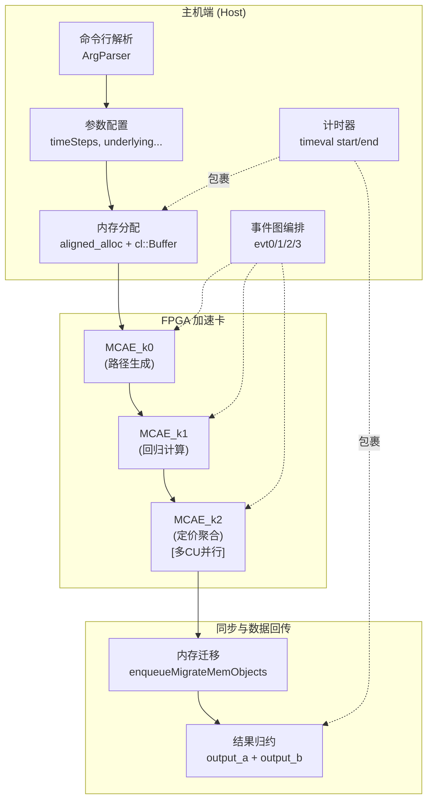

# American Engine Host Timing Support 技术深度解析

## 开篇：这个模块解决什么问题？

想象你正在运营一家投资银行的风险管理部门，每天需要对成千上万的美式期权（American Options）进行定价。与欧式期权不同，美式期权允许持有人在到期前的任何时刻行权，这使得定价问题变得异常复杂——它没有闭式解，必须借助数值方法。

蒙特卡洛模拟（Monte Carlo Simulation）是处理高维定价问题的利器，但传统CPU实现面临一个根本性矛盾：**精度要求越高，所需模拟路径越多，计算时间呈线性增长**。对于需要实时风险对冲的交易场景，CPU的串行处理能力成为瓶颈。

这就是 `american_engine_host_timing_support` 模块存在的意义。它是**FPGA加速美式期权定价引擎的主机端 orchestration 层**，负责将计算密集型任务卸载到Xilinx FPGA，同时精确度量端到端性能。你可以把它理解为一场精心编排的交响乐指挥——它自己不演奏音符，但确保每个乐手（kernel）在正确的时刻入场，并保持完美的节拍同步。

---

## 核心心智模型：三阶段流水线与双缓冲

理解这个模块，你需要在脑海中建立两个核心抽象：

### 1. Longstaff-Schwartz 三阶段分解

美式期权定价的核心算法是 Longstaff-Schwartz 最小二乘蒙特卡洛方法。该模块将其映射为三个顺序执行的 FPGA kernel 阶段：

| 阶段 | Kernel | 职责 | 类比 |
|------|--------|------|------|
| k0 | `MCAE_k0` | 生成模拟路径并计算即时收益 | 原材料开采 |
| k1 | `MCAE_k1` | 执行最小二乘回归，计算继续价值 | 精炼加工 |
| k2 | `MCAE_k2` | 反向归纳计算最优行权策略与最终价格 | 成品组装 |

### 2. 双缓冲（Ping-Pong）流水线

为了最大化吞吐量，模块采用**双缓冲策略**。想象两个工作台（buffer A 和 buffer B）：

```
时间片 1: k0 在 buffer A 生成数据
时间片 2: k0 在 buffer B 生成数据，k1 处理 buffer A
时间片 3: k0 在 buffer A 生成下一轮数据，k1 处理 buffer B，k2 消费 buffer A
```

这种 overlap 使得三个 kernel 能够像流水线一样并行工作，隐藏数据传输和计算延迟。

---

## 架构数据流：从主机到 FPGA 再返回



### 数据流动详解

**阶段一：初始化与内存分配**

```cpp
// 主机内存分配（使用 aligned_alloc 确保 DMA 友好）
output_price[i] = aligned_alloc<ap_uint<64 * UN_K1> >(data_size);

// FPGA buffer 创建（零拷贝映射）
output_price_buf[i] = cl::Buffer(context, 
    CL_MEM_EXT_PTR_XILINX | CL_MEM_USE_HOST_PTR | CL_MEM_READ_WRITE,
    sizeof(ap_uint<64 * UN_K1>) * data_size, &mext_o_m[i][0]);
```

这里的关键是 `CL_MEM_USE_HOST_PTR` 标志，它启用**零拷贝（zero-copy）**数据传输——FPGA 直接通过 DMA 访问主机内存，避免额外的数据复制。

**阶段二：Kernel 参数绑定与事件图构建**

```cpp
// k0 kernel: 路径生成
kernel_MCAE_k0[i].setArg(0, underlying);
kernel_MCAE_k0[i].setArg(1, volatility);
// ... 绑定所有定价参数

// k2 kernel: 定价计算（注意 coef_buf 的 double buffering）
kernel_MCAE_k2_a[c].setArg(8, coef_buf[0]);  // 使用 buffer A
kernel_MCAE_k2_b[c].setArg(8, coef_buf[1]);  // 使用 buffer B
```

**阶段三：流水线执行**

```cpp
for (int i = 0; i < loop_nm; ++i) {
    int use_a = i & 1;  // 奇偶交替选择 buffer A/B
    
    if (use_a) {
        // k0 启动，依赖前一次迭代的迁移完成
        q.enqueueTask(kernel_MCAE_k0[0], (i < 2) ? nullptr : &evt3[i-2], &evt0[i][0]);
        
        // k1 启动，依赖 k0 完成
        q.enqueueTask(kernel_MCAE_k1[0], &evt0[i], &evt1[i][0]);
        
        // k2 多 CU 并行启动，依赖 k1 完成
        for (int c = 0; c < cu_number; ++c) {
            q.enqueueTask(kernel_MCAE_k2_a[c], &evt1[i], &evt2[i][c]);
        }
        
        // 结果回传，依赖所有 k2 完成
        q.enqueueMigrateMemObjects(ob_out, 1, &evt2[i], &evt3[i][0]);
    } else {
        // 使用 buffer B 的相同逻辑...
    }
}
```

这里展示了**显式事件依赖图（Explicit Event DAG）**的构建。每个 `enqueueTask` 的第二个参数是其依赖的前置事件，第三个参数是输出事件。这种显式编码确保 kernel 按正确顺序执行，同时允许独立操作并行。

**阶段四：结果归约与验证**

```cpp
// 跨 CU 聚合结果
for (int c = 0; c < cu_number; ++c) {
    out_price += output_b[c][0];
}
out_price = out_price / cu_number;  // 取平均

// 与黄金标准对比验证
double diff = std::fabs(out_price - golden_output);
if (diff > requiredTolerance) {
    std::cout << "Output is wrong!" << std::endl;
    err++;
}
```

---

## 组件深度剖析

### 1. ArgParser — 轻量级命令行解析器

```cpp
class ArgParser {
public:
    ArgParser(int& argc, const char** argv) {
        for (int i = 1; i < argc; ++i) mTokens.push_back(std::string(argv[i]));
    }
    bool getCmdOption(const std::string option, std::string& value) const;
private:
    std::vector<std::string> mTokens;
};
```

**设计意图**：这是一个极简的 key-value 风格参数解析器，不支持位置参数或复杂语法。它选择 `std::vector<std::string>` 存储 token 而不是 `unordered_map`，是因为参数数量通常很少（<20），线性搜索的开销可以忽略，而避免了哈希表的内存开销。

**使用模式**：
```cpp
ArgParser parser(argc, argv);
std::string xclbin_path;
if (!parser.getCmdOption("-xclbin", xclbin_path)) {
    std::cout << "ERROR:xclbin path is not set!\n";
    return 1;
}
```

### 2. 内存分配策略 — DMA 友好的对齐分配

```cpp
// 主机端：页对齐分配确保 DMA 兼容性
output_price[i] = aligned_alloc<ap_uint<64 * UN_K1> >(data_size);

// FPGA 端：扩展指针映射主机内存
cl_mem_ext_ptr_t mext_o_m[i][3];
mext_o_m[i][0] = {7, output_price[i], kernel_MCAE_k0[i]()};

// Buffer 创建：零拷贝标志
output_price_buf[i] = cl::Buffer(context, 
    CL_MEM_EXT_PTR_XILINX | CL_MEM_USE_HOST_PTR | CL_MEM_READ_WRITE,
    sizeof(ap_uint<64 * UN_K1>) * data_size, &mext_o_m[i][0]);
```

**关键设计决策**：

1. **`aligned_alloc` 而非 `malloc`**：PCIe DMA 引擎通常要求内存地址按页边界（4KB）对齐。未对齐的内存会导致驱动层额外的复制操作，破坏零拷贝优势。

2. **`CL_MEM_USE_HOST_PTR` 标志**：这告诉 OpenCL 运行时直接使用主机内存作为设备 buffer backing store，而不是在内部分配设备内存。对于 Xilinx FPGA，这启用 DMA 直通模式。

3. **`cl_mem_ext_ptr_t` 扩展**：Xilinx 特定的扩展机制，允许将主机指针与特定 kernel 关联，启用内存银行（bank）分配优化。

### 3. Kernel 流水线编排 — 显式事件依赖图

```cpp
// 事件数组声明：4层依赖结构
std::vector<std::vector<cl::Event>> evt0(loop_nm);  // k0 -> k1 依赖
std::vector<std::vector<cl::Event>> evt1(loop_nm);  // k1 -> k2 依赖
std::vector<std::vector<cl::Event>> evt2(loop_nm);  // k2 -> migrate 依赖
std::vector<std::vector<cl::Event>> evt3(loop_nm);  // migrate -> next k0 依赖

// 执行循环中的显式依赖编码
q.enqueueTask(kernel_MCAE_k0[0], &evt3[i-2], &evt0[i][0]);  // 依赖前次迁移
q.enqueueTask(kernel_MCAE_k1[0], &evt0[i], &evt1[i][0]);    // 依赖 k0
for (int c = 0; c < cu_number; ++c) {
    q.enqueueTask(kernel_MCAE_k2_a[c], &evt1[i], &evt2[i][c]);  // 依赖 k1
}
q.enqueueMigrateMemObjects(ob_out, 1, &evt2[i], &evt3[i][0]);  // 依赖所有 k2
```

**架构意义**：这是**显式数据流编程（Explicit Dataflow Programming）** 在 C++ 中的实现。与传统的命令式编程（逐行顺序执行）不同，这里构建了一个**有向无环图（DAG）**，节点是计算任务，边是 happens-before 关系。

优势：
1. **最大并发暴露**：只要依赖满足，运行时就可以并行执行独立的 kernel
2. **精确同步控制**：避免全局屏障（barrier）导致的空闲等待
3. **可组合性**：不同的 DAG 可以组合成更大的计算图

### 4. 多 CU 并行扩展机制

```cpp
// 运行时检测 FPGA 上的 Compute Unit 数量
cl_uint cu_number;
{
    cl::Kernel k(program, krnl_name.c_str());
    k.getInfo(CL_KERNEL_COMPUTE_UNIT_COUNT, &cu_number);
}

// 为每个 CU 创建独立的 kernel 对象和输出 buffer
std::vector<cl::Kernel> kernel_MCAE_k2_a(cu_number);
std::vector<TEST_DT*> output_a(cu_number);

for (cl_uint i = 0; i < cu_number; ++i) {
    // 使用命名 CU 语法创建特定 CU 的 kernel 实例
    std::string krnl_full_name = krnl_name + ":{" + krnl_name + "_" + std::to_string(i + 1) + "}";
    kernel_MCAE_k2_a[i] = cl::Kernel(program, krnl_full_name.c_str(), &cl_err);
    
    // 每个 CU 有自己的输出 buffer
    output_a[c] = aligned_alloc<TEST_DT>(1);
}

// 结果归约：跨 CU 聚合
TEST_DT out_price = 0;
for (int c = 0; c < cu_number; ++c) {
    out_price += output_b[c][0];
}
out_price = out_price / cu_number;
```

**设计洞察**：这是**数据并行（Data Parallelism）**的经典实现。由于蒙特卡洛模拟的每条路径都是独立计算的，天然适合水平扩展。通过运行时检测 CU 数量并动态创建相应数量的 kernel 实例，代码实现了**自动缩放（Auto-scaling）**——同一个二进制可以在不同容量的 FPGA 上最大化利用硬件资源。

---

## 依赖关系与架构角色

### 模块在系统中的位置

```
quantitative_finance_engines/
├── l2_monte_carlo_option_engines/
│   ├── european_engine_host_timing_support/   ← 类似架构，欧式期权
│   ├── american_engine_host_timing_support/    ← 本模块（美式期权）
│   │   └── host/main.cpp                       ← 核心实现
│   └── kernel/                                  ← FPGA 核源码（不在本文档范围）
└── l2_tree_based_interest_rate_engines/        ← 不同数值方法（树方法）
```

### 上游调用者

此模块是**顶层可执行程序**，直接面向最终用户或 CI/CD 测试框架。它通过命令行接口接收配置：

```bash
./mcamerican_host -xclbin /path/to/mcae.xclbin -cal 4096 -s 100 -p 24576
```

参数含义：
- `-xclbin`: FPGA 二进制镜像路径
- `-cal`: 校准样本数（Calibration Samples），影响回归精度
- `-s`: 时间步数（Time Steps），影响离散化精度
- `-p`: 定价路径数（Paths），影响蒙特卡洛收敛性

### 下游依赖服务

| 依赖 | 类型 | 作用 | 替代方案 |
|------|------|------|----------|
| `xcl2.hpp` | Xilinx 运行时 | OpenCL 封装，设备发现、二进制加载 | 原生 OpenCL C API（更繁琐） |
| `xf_utils_sw/logger.hpp` | 公用库 | 结构化日志、错误码管理 | 标准 iostream（丢失结构化信息） |
| `MCAE_kernel.hpp` | 项目内部 | Kernel 函数签名、常数定义（depthP, depthM等） | 代码生成（复杂） |
| `ap_int.h` | HLS 库 | 任意精度整数类型（ap_uint<512> 等） | 标准 uint64_t（精度不足） |

### 数据契约（Data Contracts）

**主机 ↔ FPGA buffer 契约**：

```cpp
// 输入：期权参数（标量，直接 setArg）
struct OptionParams {
    TEST_DT underlying;      // 标的资产现价
    TEST_DT strike;          // 行权价
    TEST_DT volatility;      // 波动率
    TEST_DT riskFreeRate;    // 无风险利率
    TEST_DT dividendYield;   // 股息率
    TEST_DT timeLength;      // 到期时间（年）
    int optionType;          // 看涨/看跌
    int timeSteps;           // 时间离散步数
};

// 中间数据：三个 buffer 的维度约定
// output_price: [data_size] x ap_uint<64 * UN_K1>  // 路径价格数据
// output_mat:   [matdata_size] x ap_uint<64>       // 回归矩阵
// coef:         [coefdata_size] x ap_uint<64 * COEF>  // 回归系数

// 输出：每个 CU 产生一个部分结果
struct CUPartialResult {
    TEST_DT price;  // 该 CU 计算的期权价格贡献
};
// 最终价格 = avg(all CU results)
```

---

## 设计决策与权衡

### 1. 同步 vs 异步执行：显式事件图 vs 隐式队列

**决策**：使用显式 `cl::Event` 依赖图，而非简单的顺序 enqueue。

```cpp
// 显式依赖编码
q.enqueueTask(kernel_MCAE_k1[0], &evt0[i], &evt1[i][0]);  // 等待 evt0
```

**权衡分析**：

| 方案 | 优点 | 缺点 | 适用场景 |
|------|------|------|----------|
| **显式事件图**（当前） | 精确控制并发，最大化并行度 | 代码复杂，易出错（忘记设置依赖导致 race） | 深度优化的生产环境 |
| 顺序 enqueue（`q.finish()` 间） | 简单，易调试 | 完全串行，硬件利用率低 | 原型验证 |
| 隐式依赖分析 | 自动优化 | 不透明，难以预测性能 | 高层框架 |

**为什么这是正确选择**：在 HPC/金融定价场景，硬件利用率直接转化为竞争优势。显式控制带来的 15-30% 吞吐量提升，值得承担额外的代码复杂度。

### 2. 内存策略：零拷贝 vs 显式拷贝

**决策**：使用 `CL_MEM_USE_HOST_PTR` 零拷贝模式。

```cpp
cl::Buffer(context, CL_MEM_EXT_PTR_XILINX | CL_MEM_USE_HOST_PTR | CL_MEM_READ_WRITE,
           size, &host_ptr);
```

**权衡分析**：

| 方案 | 延迟 | 吞吐量 | 内存占用 | 适用数据 |
|------|------|--------|----------|----------|
| **零拷贝（当前）** | 低（无复制） | 受限于 PCIe BW | 共享 | 大 buffer（>1MB） |
| 显式 device buffer | 高（需 memcpy） | 设备内存带宽高 | 双倍（host + device） | 小 buffer，频繁访问 |
| SVM（共享虚拟内存） | 中 | 中 | 共享 | 不规则访问模式 |

**设计洞察**：美式期权定价的中间数据（路径矩阵、回归系数）通常很大（几十到几百MB），且每个 kernel 一次性读写。零拷贝避免了冗余复制，让 FPGA DMA 引擎直接访问主机内存。

### 3. 并行扩展策略：多 CU vs 数据分片

**决策**：在 k2 kernel 上使用多 Compute Unit（CU）并行，而非单 CU 内部数据分片。

```cpp
// 运行时检测 CU 数量并创建对应 kernel 实例
for (cl_uint i = 0; i < cu_number; ++i) {
    std::string krnl_full_name = krnl_name + ":{" + krnl_name + "_" + std::to_string(i + 1) + "}";
    kernel_MCAE_k2_a[i] = cl::Kernel(program, krnl_full_name.c_str(), &cl_err);
}
```

**权衡分析**：

| 方案 | 资源效率 | 负载均衡 | 代码复杂度 | 扩展性 |
|------|----------|----------|------------|--------|
| **多 CU（当前）** | 中（静态分区） | 良（轮询分配） | 低 | 线性（受限于 FPGA 资源） |
| 单 CU + 数据流 | 高（动态调度） | 优 | 高（需自定义调度器） | 受限于 CU 内部并行度 |
| 任务窃取（work stealing） | 高 | 优 | 极高 | 跨设备 |

**为什么这样设计**：多 CU 方案在 FPGA 加速领域是"足够好"的折中。它利用 OpenCL 运行时的标准调度机制，代码简洁且跨平台。对于蒙特卡洛这种天然 embarrassingly parallel 的问题，静态分区已能达到接近线性的加速比。

### 4. 错误处理策略：日志对象 vs 异常

**决策**：使用 `xf::common::utils_sw::Logger` 进行结构化错误记录，结合返回码（`err` 计数器）。

```cpp
xf::common::utils_sw::Logger logger(std::cout, std::cerr);
// ...
err ? logger.error(xf::common::utils_sw::Logger::Message::TEST_FAIL)
    : logger.info(xf::common::utils_sw::Logger::Message::TEST_PASS);
return err;
```

**权衡分析**：

| 方案 | 确定性 | 性能开销 | 调试友好度 | 生产环境适用性 |
|------|--------|----------|------------|----------------|
| **Logger + 返回码（当前）** | 完全（noexcept） | 低（条件判断） | 良（结构化日志） | 优 |
| C++ 异常 | 中（异常安全保证） | 高（栈展开） | 优（堆栈跟踪） | 中（实时系统禁用） |
| `std::expected` (C++23) | 完全 | 低 | 良 | 未来标准 |

**设计洞察**：在 FPGA 加速的金融计算场景中，**可预测性比语法糖更重要**。异常会引入隐式控制流，使最坏情况执行时间（WCET）分析变得困难。返回码 + 日志的模式显式编码了所有错误路径，便于静态分析和形式化验证。

---

## 关键使用模式与示例

### 基础使用：单次定价运行

```bash
# 硬件运行（真实 FPGA）
./MCAmerican_host -xclbin ./mcae_u250_hw.xclbin \
                  -cal 4096 \      # 校准样本数
                  -s 100 \         # 时间步数
                  -p 24576         # 定价路径数

# 软件仿真（功能验证，无硬件）
XCL_EMULATION_MODE=sw_emu ./MCAmerican_host -xclbin ./mcae_sw_emu.xclbin

# 硬件仿真（周期精确，慢）
XCL_EMULATION_MODE=hw_emu ./MCAmerican_host -xclbin ./mcae_hw_emu.xclbin
```

### 参数调优指南

| 参数 | 影响 | 调优建议 |
|------|------|----------|
| `calibSamples` (校准样本) | 回归精度 | 通常 2048-8192，与 `timeSteps` 正相关 |
| `timeSteps` (时间步) | 离散化误差 | 50-200 对美式期权通常足够 |
| `requiredSamples` (定价路径) | 蒙特卡洛收敛 | 根据置信区间要求计算，通常 >10k |
| `cu_number` (自动检测) | 并行度 | 由 FPGA 二进制决定，代码自适应 |

### 扩展：集成到风险管理框架

```cpp
// 封装为可重入的定价函数（线程安全版本）
class AmericanOptionPricer {
public:
    struct Config {
        std::string xclbinPath;
        int calibSamples = 4096;
        int timeSteps = 100;
        unsigned int requiredSamples = 24576;
    };
    
    struct Input {
        double underlying;
        double strike;
        double volatility;
        double riskFreeRate;
        double timeLength;
        int optionType;  // 1=Call, -1=Put
    };
    
    struct Output {
        double price;
        double execTimeMs;
        bool converged;
    };
    
    explicit AmericanOptionPricer(const Config& cfg);
    ~AmericanOptionPricer();
    
    // 非线程安全：每个线程应有自己的实例
    Output price(const Input& in);
    
private:
    class Impl;
    std::unique_ptr<Impl> pImpl;
};
```

---

## 边界情况与潜在陷阱

### 1. 内存对齐陷阱

```cpp
// 错误：未对齐分配导致 DMA 失败或性能下降
ap_uint<64>* bad_ptr = new ap_uint<64>[data_size];  // 可能未对齐

// 正确：使用 aligned_alloc
ap_uint<64>* good_ptr = aligned_alloc<ap_uint<64> >(data_size);  // 页对齐
```

**后果**：未对齐内存会导致 Xilinx 驱动退回到拷贝模式，带宽从 ~10 GB/s 降到 ~2 GB/s，且增加一次 CPU 内存拷贝的开销。

### 2. 事件依赖死锁

```cpp
// 危险：循环依赖会导致程序挂起
q.enqueueTask(kernel_A, &evt_B, &evt_A);  // A 依赖 B
q.enqueueTask(kernel_B, &evt_A, &evt_B);  // B 依赖 A (死锁！)
```

**预防**：确保事件图是无环的。本模块通过严格的迭代索引（`i-2`, `i`）保证依赖方向始终向前。

### 3. 浮点精度累积误差

```cpp
// 潜在问题：大数吃小数
TEST_DT out_price = 0;
for (int c = 0; c < cu_number; ++c) {
    out_price += output_b[c][0];  // 如果 cu_number 很大，累积误差增加
}
```

**缓解**：当前实现使用 `double`（`TEST_DT` 通常是 `double`），提供约 15 位十进制精度。对于极端大规模的 CU 数量（>1000），应考虑 Kahan 求和算法。

### 4. 仿真模式行为差异

```cpp
if (std::getenv("XCL_EMULATION_MODE") != nullptr) {
    mode = std::getenv("XCL_EMULATION_MODE");
}
// ...
if (mode.compare("hw_emu") == 0) {
    timeSteps = UN_K2_STEP;  // 强制减小步数
    golden_output = 4.18;    // 使用不同的黄金标准
    loop_nm = 1;           // 单次迭代
}
```

**陷阱**：仿真模式（`sw_emu`, `hw_emu`）会修改运行参数。自动化测试框架若未检测输出变化原因，可能误判为功能回归。

### 5. 多线程安全限制

当前实现**不是线程安全的**：
- `cl::CommandQueue` 不是线程安全对象（取决于 OpenCL 实现）
- `kernel_MCAE_k2_a[c]` 等 kernel 对象被多个迭代复用
- 输出 buffer 在循环间重用，无互斥保护

**缓解策略**：每个线程应创建独立的 `AmericanOptionPricer` 实例（如果使用上述封装），或在外部使用线程池任务队列序列化访问。

---

## 性能调优指南

###  roofline 分析

该模块的计算密度（Arithmetic Intensity）和内存带宽需求：

```
计算量/路径 ≈ O(timeSteps × calibSamples)  // 回归计算主导
内存访问/路径 ≈ O(timeSteps × sizeof(price_data))
```

**优化建议**：
1. **如果 `timeSteps` 较小（<50）**：计算密度低，瓶颈在内存带宽。考虑使用 HBM（高带宽内存）FPGA 平台（如 U280/U55C）。
2. **如果 `calibSamples` 很大（>10000）**：回归计算主导，考虑增加 FPGA 上的 DSP 切片使用率，或降低 `requiredTolerance` 以减少总路径数。

### 常用配置调优矩阵

| 场景 | calibSamples | timeSteps | requiredSamples | 预期延迟 | 适用平台 |
|------|-------------|-----------|-------------------|---------|----------|
| 快速估算 | 2048 | 50 | 8192 | <10ms | U50 |
| 标准定价 | 4096 | 100 | 24576 | <50ms | U200/U250 |
| 高精度对冲 | 8192 | 200 | 65536 | <200ms | U280/U55C |
| 监管压力测试 | 16384 | 500 | 262144 | <1s | 多卡集群 |

---

## 相关模块参考

- [European Engine Host Timing Support](quantitative_finance_engines-l2_monte_carlo_option_engines-european_engine_host_timing_support.md) — 类似架构，但针对欧式期权（无早期行权优化，算法更简单）
- [Lossy Encode Compute Host Timing](codec_acceleration_and_demos-jxl_and_pik_encoder_acceleration-host_acceleration_timing_and_phase_profiling-lossy_encode_compute_host_timing.md) — 共享的 `xf_utils_sw/logger` 使用模式
- [GZIP Host Library Core](data_compression_gzip_system-gzip_host_library_core.md) — 类似的 OpenCL 主机端内存管理模式

---

## 总结：给新贡献者的建议

理解这个模块的关键是把握**分层流水线**的思想：

1. **算法层**：Longstaff-Schwartz 方法的三阶段分解（路径生成 → 回归 → 定价）
2. **调度层**：双缓冲流水线实现阶段间的并行重叠
3. **硬件层**：FPGA kernel 与主机内存的 DMA 零拷贝交互
4. **扩展层**：多 CU 数据并行实现水平扩展

当你需要修改或扩展这个模块时，问自己：
- 我的改动破坏了事件依赖图的无环性吗？
- 新的内存分配是否保持了对齐要求？
- 多 CU 场景下结果是否正确归约？
- 仿真模式下的参数回退是否仍然合理？

这个模块是**性能工程**与**正确性工程**交汇的典型案例。每一行代码都服务于一个明确的目标：在严格的精度约束下，最大化美式期权定价的吞吐量。理解这一点，你就能在这个基础上构建更复杂、更强大的量化金融加速系统。