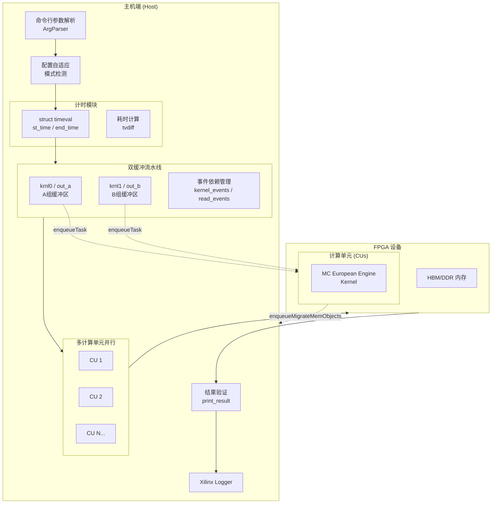

# European Engine Host Timing Support 技术深度解析

## 一句话概述

这是一个用于**蒙特卡洛欧式期权定价引擎**的 FPGA 主机端基准测试框架，它通过**双缓冲流水线**、**多计算单元并行**和**事件驱动同步**机制，精确测量 FPGA 内核在硬件仿真、软件仿真和实际硬件三种模式下的执行性能。

---

## 一、问题空间与设计动机

### 1.1 我们解决什么核心问题？

在金融量化领域，**欧式期权定价**是基础且计算密集型的任务。蒙特卡洛模拟因其适合并行化的特性，成为 FPGA 加速的理想场景。然而，构建一个可靠的基准测试框架面临以下挑战：

| 挑战 | 具体表现 | 本模块的应对策略 |
|------|---------|-----------------|
| **精确计时** | 需要区分内核执行时间与数据传输时间，排除主机端开销 | 使用 `gettimeofday` 进行墙钟计时，结合 OpenCL 事件进行细分分析 |
| **流水线隐藏延迟** | FPGA 内核执行与数据回传存在空闲等待 | **双缓冲机制**（A/B 两组缓冲区和内核实例）实现计算与传输重叠 |
| **多计算单元调度** | 现代 FPGA 可实例化多个相同的计算单元 (CU) | 动态检测 CU 数量，创建对应的内核实例和缓冲区 |
| **跨模式兼容** | 同一套代码需要在硬件、硬件仿真、软件仿真三种模式下运行 | 环境变量检测 + 参数自适应调整 |

### 1.2 为什么不用更简单的方法？

**朴素方案的缺陷：**

1. **单缓冲顺序执行**：等待内核完成 → 读取结果 → 启动下一次内核。这种方式下，FPGA 在数据传输期间处于空闲状态，硬件利用率可能低于 50%。

2. **固定 CU 数量**：硬编码 CU 数量会导致代码在不同 FPGA 平台（如 U50 有 2 个 CU，U250 有 4 个 CU）之间无法复用。

3. **统一参数配置**：硬件仿真模式通常只能处理小规模数据（如 1024 个样本），而实际硬件可以处理百万级样本。统一参数会导致仿真模式下运行时间过长或内存溢出。

**我们的设计洞察：**

> 将 FPGA 基准测试视为一个**生产-消费流水线问题**而非简单的函数调用。通过引入双缓冲（类似 CPU 流水线中的寄存器重命名）和动态 CU 检测（类似线程池自动伸缩），实现硬件资源的最大化利用。

---

## 二、心智模型与核心抽象

### 2.1 想象一个工厂流水线

将本模块的架构想象为一个**智能工厂的生产线**：

```
┌─────────────────────────────────────────────────────────────────────────────┐
│                              工厂流水线类比                                    │
├─────────────────────────────────────────────────────────────────────────────┤
│                                                                             │
│   原料仓库 (Host Memory)                                                    │
│        │                                                                    │
│        ▼                                                                    │
│   ┌─────────┐    ┌─────────┐    ┌─────────┐                                  │
│   │  工位A  │◄──►│  工位B  │◄──►│ 工位1..N│  ←  双缓冲 + 多CU              │
│   │(krnl0)  │    │(krnl1)  │    │(CUs)    │     类似多个并行工作台          │
│   └────┬────┘    └────┬────┘    └────┬────┘                                  │
│        │              │              │                                       │
│        └──────────────┴──────────────┘                                       │
│                      │                                                       │
│                      ▼                                                       │
│              成品检验台 (print_result)                                         │
│                      │                                                       │
│                      ▼                                                       │
│              出货 (validate against golden)                                  │
│                                                                             │
└─────────────────────────────────────────────────────────────────────────────┘
```

**核心类比映射：**

| 概念 | 工厂类比 | 代码对应 |
|------|---------|---------|
| **双缓冲 (A/B)** | 两套交替使用的模具/工作台 | `krnl0`/`krnl1`, `out_a`/`out_b` |
| **多 CU** | 多个并行的相同工作站 | `cu_number` 个内核实例 |
| **流水线调度** | 当前工位工作时，上一工位准备下一批原料 | 事件依赖 `&read_events[i-2]` |
| **成品检验** | 质检台比对标准样品 | `print_result()` 比对 `golden` 值 |

### 2.2 核心抽象

#### 2.2.1 `timeval` —— 主机端墙钟计时

```cpp
struct timeval st_time, end_time;
// ...
gettimeofday(&st_time, 0);
// ... FPGA execution ...
gettimeofday(&end_time, 0);
```

这是一个 POSIX 标准的时间结构，用于**主机端粗粒度计时**。它测量的是端到端的 wall-clock 时间，包括：
- OpenCL API 调用开销
- 内核执行时间
- 数据传输时间

**为什么用它而非 OpenCL Profiling？**
- OpenCL Profiling Event 只能测量单个命令的排队、提交、执行时间
- `gettimeofday` 给出了**业务视角的总耗时**（从准备数据到拿到结果）

#### 2.2.2 双缓冲机制

核心代码片段：

```cpp
// 创建两组内核实例
std::vector<cl::Kernel> krnl0(cu_number);  // A 组
std::vector<cl::Kernel> krnl1(cu_number);  // B 组

// 创建两组输出缓冲区
std::vector<DtUsed*> out_a(cu_number);    // A 组缓冲区
std::vector<DtUsed*> out_b(cu_number);    // B 组缓冲区
```

**为什么需要双缓冲？**

想象你在洗衣服：
- **单缓冲**：把衣服放进洗衣机 → 等待洗完 → 取出 → 放入下一批。洗衣机在等待你取衣服时是空闲的。
- **双缓冲**：你有**两个洗衣机**。洗衣机 A 在运行时，你把下一批衣服放进洗衣机 B。当 A 完成，你立刻启动 B，同时取出 A 的衣服并放入新的一批。两台机器几乎无缝交替运行。

在本模块中：
- **洗衣机** = FPGA 内核执行
- **取衣服** = 将结果从 FPGA 内存迁移回主机内存 (`enqueueMigrateMemObjects`)
- **流水线调度** = 当前批次的结果回传与下一批次的内核启动重叠

#### 2.2.3 多计算单元 (CU) 并行

```cpp
// 查询 FPGA 二进制中实际实例化的 CU 数量
cl::Kernel k(program, krnl_name.c_str());
k.getInfo(CL_KERNEL_COMPUTE_UNIT_COUNT, &cu_number);

// 为每个 CU 创建独立的内核实例和缓冲区
std::vector<cl::Kernel> krnl0(cu_number);
std::vector<cl::Kernel> krnl1(cu_number);
```

**设计意图**：
- FPGA 可以实例化多个相同的内核副本（CUs），每个 CU 有独立的计算资源和内存接口
- 通过动态检测 `cu_number`，代码可以自适应不同的 FPGA 平台（U50/U200/U250 等）
- 循环中将任务均分到各个 CU 上，实现**数据并行**

#### 2.2.4 事件驱动的流水线同步

```cpp
// 流水线调度：第 i 次迭代依赖于第 i-2 次迭代的数据读取完成
if (i > 1) {
    for (int c = 0; c < cu_number; ++c) {
        q.enqueueTask(krnl0[c], &read_events[i - 2], &kernel_events[i][c]);
    }
} else {
    for (int c = 0; c < cu_number; ++c) {
        q.enqueueTask(krnl0[c], nullptr, &kernel_events[i][c]);
    }
}

// 数据回传依赖于本次内核执行完成
q.enqueueMigrateMemObjects(out_vec_a, CL_MIGRATE_MEM_OBJECT_HOST, 
                           &kernel_events[i], &read_events[i][0]);
```

**同步模式解析**：

这是**2-stage 流水线**，使用事件依赖实现无阻塞流水线：
- `read_events[i-2]` 表示 **2 个迭代周期前**的数据读取完成事件
- 内核启动可以与前 2 轮的数据回传**并行执行**
- `enqueueMigrateMemObjects` 又依赖于本轮内核执行完成

**为什么是 `i-2` 而非 `i-1`？**
- 因为使用了**双缓冲**：当 A 缓冲区被读取时，B 缓冲区正在执行内核
- 所以内核启动只需要确保**两个迭代周期前**的读取完成（即当前不冲突的缓冲区）

---

## 三、架构与数据流

### 3.1 架构全景图



### 3.2 关键数据流路径

#### 路径 1：初始化与配置阶段

```
命令行 → ArgParser → 环境变量检测 (XCL_EMULATION_MODE) → 参数自适应调整
```

**关键决策点**：
- 检测 `XCL_EMULATION_MODE` 环境变量判断运行模式（`hw_emu` / `sw_emu` / 硬件）
- 根据模式自动调整：
  - `hw_emu`（硬件仿真）：`loop_nm = 1`, `requiredSamples = 1024 * MCM_NM`, 容差放宽至 0.06
  - `sw_emu`（软件仿真）：`loop_nm = 1`, `num_rep` 增加以获取更稳定统计
  - 硬件模式：使用命令行指定的完整参数

#### 路径 2：OpenCL 上下文建立

```
xcl::get_xil_devices() → cl::Context → cl::CommandQueue → xcl::import_binary_file() → cl::Program
```

**关键设计决策**：
- **Out-of-Order 命令队列**：在非软件仿真模式下启用 `CL_QUEUE_OUT_OF_ORDER_EXEC_MODE_ENABLE`，允许命令并行执行
- **Profiling 启用**：所有模式都启用 `CL_QUEUE_PROFILING_ENABLE` 以支持 OpenCL 事件计时
- **SW_EMU 特殊处理**：软件仿真模式下禁用 out-of-order（注释提到 `hls::exp` 和 `hls::log` 在多线程有 bug）

#### 路径 3：CU 检测与内核实例化

```
cl::Kernel(program, "kernel_mc") → getInfo(CL_KERNEL_COMPUTE_UNIT_COUNT, &cu_number)
→ 为每个 CU 创建 krnl0[i] 和 krnl1[i] 实例
```

**设计要点**：
- **动态 CU 检测**：不硬编码 CU 数量，从编译后的 FPGA 二进制自动获取
- **双份内核实例**：每个 CU 有 A、B 两组（`krnl0`/`krnl1`），支持双缓冲流水线
- **缓冲区配对**：`out_a`/`out_b` 缓冲区通过 `cl_mem_ext_ptr_t` 与对应内核绑定

#### 路径 4：双缓冲流水线执行（核心数据流）

```
对于每个迭代 i (0 到 num_rep/cu_number):
    选择缓冲区: use_a = (i & 1) ? A组 : B组
    
    内核启动阶段:
        如果 i > 1:
            等待 read_events[i-2] 完成  ← 确保两个迭代周期前的数据已读回
        提交内核任务到所有 CU
    
    数据回传阶段:
        等待 kernel_events[i] 完成  ← 本轮内核执行完成
        提交内存迁移 (FPGA → Host)
        记录到 read_events[i]
```

**可视化时间线**：

```
时间 →

迭代 0:  [内核A0]----[迁移A0]------------------------
迭代 1:           [内核B0]----[迁移B0]---------------
迭代 2:                    [内核A1]----[迁移A1]-----   ← A1 启动时，A0 的数据已读完 (i-2=0)
迭代 3:                             [内核B1]----[迁移B1]

图例: [内核X] = FPGA 计算阶段  [迁移X] = 数据回传阶段
```

**关键洞察**：
- 通过让 `i` 轮次的内核启动只依赖 `i-2` 轮次的数据读取完成，确保 A、B 两个缓冲区不会冲突
- 这实现了**计算与通信的重叠**，理论加速比接近 2x（假设计算与传输时间相近）

#### 路径 5：结果验证与性能报告

```
FPGA 结果收集 → print_result() 比对 golden 值 → 统计输出

性能指标计算:
- 总执行时间: tvdiff(st_time, end_time) / 1e6 秒
- 处理速率: (loop_nm * num_rep) / time_elapsed  期权/秒
```

---

## 四、组件深度解析

### 4.1 `struct timeval` —— 主机端墙钟计时

```cpp
struct timeval st_time, end_time;
// ...
gettimeofday(&st_time, 0);
// ... FPGA execution ...
gettimeofday(&end_time, 0);
int exec_time = tvdiff(&st_time, &end_time);
```

**为什么使用 `timeval` 而非 C++ `std::chrono`？**

1. **代码可移植性考虑**：该代码库面向嵌入式 FPGA 环境，部分编译器链对 `<chrono>` 支持可能不完整
2. **与 OpenCL C API 保持一致性**：OpenCL 本身使用 `cl_ulong` 纳秒时间戳，`timeval` 的微秒精度在宏观性能分析中足够
3. **直接对应 POSIX 系统调用**：`gettimeofday` 是系统调用，测量的是真正的墙钟时间，包含所有开销

**所有权与生命周期**：
- `st_time` 和 `end_time` 是 `main()` 函数的**栈上自动变量**
- 无动态分配，遵循 **Rule of Zero**（无自定义构造函数/析构函数）
- 通过 `&` 取地址传递给 `tvdiff()`，借给函数只读使用

### 4.2 `ArgParser` —— 轻量级命令行解析

```cpp
class ArgParser {
   public:
    ArgParser(int& argc, const char** argv);
    bool getCmdOption(const std::string option, std::string& value) const;
   private:
    std::vector<std::string> mTokens;
};
```

**设计意图**：
- **极简主义**：不支持 GNU getopt 复杂的选项组合、缩写展开等，仅实现 `-key value` 格式的键值对查找
- **异常安全**：`getCmdOption` 返回 `bool` 表示是否找到，通过引用参数 `value` 输出结果，避免异常
- **值语义**：`mTokens` 存储 `std::string` 的副本，不保留原始 `argv` 指针（避免生命周期问题）

**使用模式**：
```cpp
ArgParser parser(argc, argv);
std::string xclbin_path;
if (!parser.getCmdOption("-xclbin", xclbin_path)) {
    std::cout << "ERROR:xclbin path is not set!\n";
    return 1;
}
```

### 4.3 `print_result()` —— 结果验证与容差处理

```cpp
int print_result(int cu_number, std::vector<double*>& out, 
                 double golden, double max_tol);
```

**职责**：
1. 遍历所有 CU 的输出结果
2. 与预期值 (`golden`) 进行比对
3. 应用容差 (`max_tol`) 判断结果是否可接受
4. 输出详细的比对信息用于调试

**容差策略**：
- 蒙特卡洛方法本身就是**随机算法**，结果服从某种概率分布
- 不可能要求 FPGA 结果与理论值完全一致
- 通过 `max_tol` 设置可接受误差范围（硬件模式下通常是 0.02，仿真模式下放宽至 0.06）

**返回值语义**：
- 返回 `0`：所有 CU 结果都在容差范围内
- 返回 `1`：至少有一个 CU 的结果超出容差（测试失败）

### 4.4 双缓冲流水线核心逻辑

```cpp
// 关键变量
int use_a = i & 1;  // 通过最低位决定使用 A 组还是 B 组

// 内核启动（带依赖）
if (use_a) {
    q.enqueueTask(krnl0[c], &read_events[i - 2], &kernel_events[i][c]);
} else {
    q.enqueueTask(krnl1[c], &read_events[i - 2], &kernel_events[i][c]);
}

// 数据回传（带依赖）
q.enqueueMigrateMemObjects(out_vec_a, CL_MIGRATE_MEM_OBJECT_HOST, 
                           &kernel_events[i], &read_events[i][0]);
```

**依赖链分析**：

```
read_events[0] (迁移A0完成)
    │
    ▼ (触发)
kernel_events[2] (A1启动) ──依赖──► read_events[2] (迁移A1完成)
                                        │
                                        ▼ (触发)
                                    kernel_events[4] (A2启动)
```

**关键设计决策**：`read_events[i-2]` 而非 `read_events[i-1]`

如果使用 `i-1`：
- 迭代 0：A 组启动 → 完成 → 迁移
- 迭代 1：B 组启动 → 完成 → 迁移
- 问题：**无法重叠**，因为 B 启动要等 A 的迁移完成（实际上 A 的迁移和 B 的计算可以并行）

使用 `i-2`：
- 迭代 0 (A)：启动 → 完成 → 迁移
- 迭代 1 (B)：启动 → 完成 → 迁移（此时 A 的迁移可能还在进行）
- 迭代 2 (A)：启动（等待第 0 次迁移完成，确保 A 缓冲区可用）→ **与第 1 次的迁移并行**

这样实现了**计算与通信的真正重叠**。

### 4.5 运行模式自适应

```cpp
std::string mode_emu = "hw";
if (std::getenv("XCL_EMULATION_MODE") != nullptr) {
    mode_emu = std::getenv("XCL_EMULATION_MODE");
}

if (mode_emu.compare("hw_emu") == 0) {
    loop_nm = 1;
    num_rep = cu_number;
    requiredSamples = 1024 * MCM_NM;
    max_diff = 0.06;
} else if (mode_emu.compare("sw_emu") == 0) {
    loop_nm = 1;
    num_rep = cu_number * 3;
}
```

**三种运行模式**：

| 模式 | 环境变量值 | 特点 | 参数调整策略 |
|-----|-----------|------|-------------|
| **硬件模式** | 未设置 | 真实 FPGA 运行，速度最快，资源真实 | 使用完整参数，最大化工作负载 |
| **硬件仿真** | `hw_emu` | 功能仿真 RTL 行为，速度极慢（比真实慢 1000x+） | 极大缩减计算规模 (`loop_nm=1`)，增加容差 |
| **软件仿真** | `sw_emu` | 使用 C 模型模拟内核行为，用于算法验证 | 保持小规模，但增加重复次数以验证稳定性 |

**为何硬件仿真需要特殊处理？**

硬件仿真是在 RTL 级别模拟 FPGA 行为，速度比真实硬件慢几个数量级。如果保持原有参数（如 `loop_nm=1024`），单次运行可能需要数小时甚至数天。因此必须：
- 将 `loop_nm` 设为 1（最小迭代）
- 减少 `num_rep` 到 CU 数量级别
- 放宽容差到 0.06（仿真精度本身较低）

---

## 五、依赖关系与调用链

### 5.1 本模块的依赖项

```
european_engine_host_timing_support
│
├─► xcl2.hpp                    // Xilinx OpenCL 工具库
│   └─ 提供 get_xil_devices(), import_binary_file() 等辅助函数
│
├─► xf_utils_sw/logger.hpp      // Xilinx 日志工具
│   └─ 提供 Logger 类，记录 OpenCL 对象创建的成功/失败
│
├─► kernel_mceuropeanengine.hpp // 内核接口定义
│   └─ 定义 DtUsed, OUTDEP, MCM_NM 等类型和常量
│
├─► utils.hpp                    // 通用工具
│   └─ 提供 tvdiff() 计算时间差
│
└─► OpenCL 标准库               // CL/cl2.hpp (通过 xcl2 引入)
    └─ cl::Context, cl::CommandQueue, cl::Kernel, cl::Buffer 等
```

**依赖模式分析**：

| 依赖 | 类型 | 说明 |
|-----|------|------|
| `xcl2.hpp` | 强依赖 | Xilinx 封装的 OpenCL 辅助库，简化设备发现和二进制加载 |
| `xf_utils_sw/logger.hpp` | 便利依赖 | 可选的日志记录，用于调试 OpenCL 错误 |
| `kernel_mceuropeanengine.hpp` | 契约依赖 | 必须确保主机端代码与内核编译版本一致（数据类型匹配） |

### 5.2 谁调用本模块

本模块是一个**独立的可执行程序**（`test.cpp`），不是被其他模块调用的库。它的调用链是：

```
用户命令行
    │
    ▼
./test.exe -xclbin <path/to/xclbin>
    │
    ▼
main()  [本模块入口]
    │
    ├─► 解析参数 (ArgParser)
    ├─► 初始化 OpenCL
    ├─► 执行基准测试循环
    └─► 输出结果
```

**调用模式**：
- **手动执行**：开发人员在 FPGA 平台上手动运行以验证功能
- **CI/CD 集成**：作为回归测试套件的一部分，用于验证 FPGA 构建的正确性
- **性能基准**：用于比较不同 FPGA 平台（U50 vs U250）或不同内核版本的性能

### 5.3 数据契约与接口

#### 内核接口契约 (`kernel_mceuropeanengine.hpp`)

主机端通过 `setArg` 向内核传递以下参数：

```cpp
krnl0[i].setArg(0, loop_nm);           // 每个内核循环迭代次数
krnl0[i].setArg(1, seeds[i]);          // 随机数种子（CU 特有）
krnl0[i].setArg(2, underlying);        // 标的资产价格
krnl0[i].setArg(3, volatility);        // 波动率
krnl0[i].setArg(4, dividendYield);     // 股息率
krnl0[i].setArg(5, riskFreeRate);      // 无风险利率
krnl0[i].setArg(6, timeLength);        // 到期时间
krnl0[i].setArg(7, strike);            // 行权价
krnl0[i].setArg(8, optionType);        // 期权类型（Call/Put）
krnl0[i].setArg(9, out_buff_a[i]);     // 输出缓冲区
krnl0[i].setArg(10, requiredTolerance);// 收敛容差
krnl0[i].setArg(11, requiredSamples);  // 要求样本数
krnl0[i].setArg(12, timeSteps);        // 时间步数
krnl0[i].setArg(13, maxSamples);       // 最大样本数
```

**契约保证**：
- 主机端分配的 `out_buff_a[i]` 大小至少为 `OUTDEP * sizeof(DtUsed)`
- 内核完成执行后，会在偏移 0 处写入最终的期权价格估值

#### 预期结果 (Golden Value)

```cpp
DtUsed golden = 3.834522;
```

这是使用以下参数的理论布莱克-斯科尔斯价格：
- 标的资产价格 S = 36
- 行权价 K = 40
- 无风险利率 r = 0.06
- 波动率 σ = 0.20
- 到期时间 T = 1
- 股息率 q = 0

蒙特卡洛结果应在容差范围内收敛于此值。

---

## 六、设计决策与权衡

### 6.1 双缓冲 vs 单缓冲 + 队列深度

**选择的方案**：显式双缓冲（A/B 两组物理资源）

**权衡分析**：

| 方案 | 优点 | 缺点 | 选择理由 |
|-----|------|------|---------|
| **双缓冲 (A/B)** | 实现简单，无动态分配，确定性延迟 | 内存占用翻倍 | 确定性是关键，FPGA 调度需要可预测性 |
| **单缓冲 + 队列深度** | 内存占用少，可动态调整流水线深度 | 需要复杂流控，非确定性延迟 | 增加了 FPGA 内核侧的复杂性 |
| **环形缓冲区** | 理论上可支持 N 缓冲 | 索引管理复杂，需要模运算 | 对于 2-stage 流水线，显式 A/B 更清晰 |

**核心决策理由**：
- 在 FPGA 加速场景，**可预测性**往往比**资源利用率**更重要
- 显式的 A/B 状态使代码路径清晰，便于调试和性能分析
- 内存占用翻倍在现代 FPGA 平台（通常有 8GB+ HBM）上是可接受的

### 6.2 事件驱动 vs 轮询同步

**选择的方案**：OpenCL 事件依赖链（`cl::Event`）

**权衡分析**：

| 方案 | 机制 | CPU 占用 | 延迟 | 适用场景 |
|-----|------|---------|------|---------|
| **事件驱动** | `enqueueTask(..., &wait_list, &event)` | 极低（阻塞在 driver） | 低（硬件信号触发） | 批处理、流水线 |
| **忙等待轮询** | `clGetEventInfo(CL_EVENT_COMMAND_EXECUTION_STATUS)` | 极高（100% CPU） | 极低（但浪费） | 极低延迟要求 |
| **条件等待** | `clWaitForEvents()` | 低（阻塞） | 中等 | 简单同步点 |

**核心决策理由**：
- 本模块是**吞吐量优化**而非**延迟优化**场景
- 事件依赖链允许 OpenCL 运行时将多个命令批量提交给驱动，减少 kernel-driver 切换开销
- 通过 `&read_events[i-2]` 精确表达依赖关系，确保正确性同时最大化并发

### 6.3 动态 CU 检测 vs 静态配置

**选择的方案**：运行时查询 `CL_KERNEL_COMPUTE_UNIT_COUNT`

**权衡分析**：

| 方案 | 实现 | 灵活性 | 风险 |
|-----|------|--------|------|
| **动态检测** | `k.getInfo(CL_KERNEL_COMPUTE_UNIT_COUNT, &cu_number)` | 高（同一二进制适配不同 FPGA） | 低（OpenCL 标准查询） |
| **编译时常量** | `#define CU_NUMBER 4` | 低（需为每平台重编译） | 中（配置与实际不匹配导致错误） |
| **配置文件** | 读取外部 config 文件 | 中 | 高（文件缺失/格式错误） |

**核心决策理由**：
- FPGA 二进制 (xclbin) 已经包含了 CU 的物理布局信息
- 运行时查询确保主机端代码与 FPGA 二进制的一致性
- 实现"一次编译，多处运行"（同一可执行文件可在 U50 和 U250 上运行）

### 6.4 忙等待 vs 阻塞 finish

**代码中的两处同步**：

```cpp
// 第一次：初始化完成后
q.finish();
gettimeofday(&st_time, 0);  // 开始计时

// 第二次：所有任务完成后
q.flush();
q.finish();
gettimeofday(&end_time, 0);  // 结束计时
```

**为什么需要 `q.finish()`？**

OpenCL 的命令队列默认是**异步的**（即使不使用 out-of-order，命令也是排队异步执行）。`finish()` 阻塞直到队列中所有命令完成。

**设计意图**：
- 第一次 `finish()` 确保 FPGA 初始化（程序加载、内存分配）完成后再开始计时，排除初始化开销
- 第二次 `finish()` 确保所有迭代完全结束，再计算总时间
- 使用 `gettimeofday` 夹在两个 `finish()` 之间，测量的是**纯执行时间**（不含主机端准备时间）

---

## 七、C++ 深度分析

根据 C/C++ 分析指南，本节深入探讨代码的关键 C++ 层面问题。

### 7.1 内存所有权模型

#### 7.1.1 原始缓冲区分配（对齐内存）

```cpp
// 分配
out_a[i] = aligned_alloc<DtUsed>(OUTDEP);

// 释放（代码中未显式释放，依赖进程退出）
```

**所有权分析**：

| 资源 | 分配者 | 所有者 | 释放者 | 借用者 |
|-----|--------|--------|--------|--------|
| `out_a[i]` (原始指针) | `main()` | `main()`（栈变量 `out_a` 向量管理） | 进程退出（无显式 free） | `cl::Buffer`（通过 `mext_out_a`） |
| `cl::Buffer out_buff_a[i]` | `main()` | OpenCL 运行时（通过 `cl::Buffer` RAII） | `cl::Buffer` 析构函数 | 内核执行时借用 |
| `cl::Kernel krnl0[i]` | `main()` | OpenCL 运行时（通过 `cl::Kernel` RAII） | `cl::Kernel` 析构函数 | 命令队列借用 |

**关键设计决策**：

1. **未显式释放 `aligned_alloc` 内存**：
   - 这是基准测试代码，进程退出时操作系统会回收所有内存
   - 生产代码中应添加 `for (int i = 0; i < cu_number; ++i) { free(out_a[i]); free(out_b[i]); }`

2. **OpenCL C++ 包装器的 RAII**：
   - `cl::Buffer`、`cl::Kernel`、`cl::Context` 等都在析构时自动释放底层 OpenCL 对象
   - 遵循 **RAII 原则**，无需手动 `clReleaseMemObject`、`clReleaseKernel` 等

3. **扩展指针绑定**：
   ```cpp
   mext_out_a[i] = {9, out_a[i], krnl0[i]()};
   ```
   - `mext_out_a` 是 `cl_mem_ext_ptr_t`，将主机内存 `out_a[i]` 与内核 `krnl0[i]` 关联
   - 这是 Xilinx 扩展，用于零拷贝数据传输（通过 PCI-E BAR 直接访问主机内存）

### 7.2 对象生命周期与值语义

#### 7.2.1 OpenCL 对象的拷贝与移动

```cpp
// 创建内核实例
for (cl_uint i = 0; i < cu_number; ++i) {
    std::string krnl_full_name = krnl_name + ":{" + krnl_name + "_" + std::to_string(i + 1) + "}";
    krnl0[i] = cl::Kernel(program, krnl_full_name.c_str(), &cl_err);  // 临时对象赋值
    krnl1[i] = cl::Kernel(program, krnl_full_name.c_str(), &cl_err);  // 临时对象赋值
}
```

**语义分析**：

- `cl::Kernel` 是 OpenCL C++ 包装器，实现了**移动语义**（C++11 起）
- `krnl0[i] = cl::Kernel(...)` 触发**移动赋值**（如果可用）或**拷贝赋值**
- 无论哪种，底层 `cl_kernel` 对象引用计数正确管理（OpenCL 保留/释放）

#### 7.2.2 向量的重新分配风险

```cpp
std::vector<cl::Kernel> krnl0(cu_number);
// ... 后续使用 ...
```

**潜在风险**：

- `std::vector` 在容量不足时会重新分配内存
- 如果通过 `push_back` 而非构造函数预分配，可能导致**迭代器/引用失效**
- 本代码使用 `std::vector<cl::Kernel> krnl0(cu_number)` 预分配，避免重新分配

### 7.3 错误处理策略

#### 7.3.1 多层错误处理架构

```cpp
// 第一层：OpenCL 错误码 (cl_int)
cl_int cl_err;
cl::Context context(device, NULL, NULL, NULL, &cl_err);
logger.logCreateContext(cl_err);

// 第二层：Logger 封装
// logger 内部将 cl_err 转换为可读消息

// 第三层：硬失败 (关键路径)
if (!parser.getCmdOption("-xclbin", xclbin_path)) {
    std::cout << "ERROR:xclbin path is not set!\n";
    return 1;
}

// 第四层：结果验证
int err = print_result(cu_number, out_a, golden, max_diff);
err ? logger.error(...) : logger.info(...);
```

**策略特点**：

1. **分层处理**：OpenCL 运行时错误由 Logger 封装，应用逻辑错误（如缺少参数）直接返回
2. **不抛异常**：整个代码库使用返回码而非 C++ 异常，符合嵌入式/高性能计算惯例
3. **容错设计**：结果验证阶段允许容差范围内的偏差，不将蒙特卡洛的统计波动视为硬错误

#### 7.3.2 事件同步的隐式错误处理

```cpp
q.enqueueTask(krnl0[c], &read_events[i - 2], &kernel_events[i][c]);
```

**潜在问题**：
- 如果 `read_events[i-2]` 表示的事件之前从未被成功创建（如越界访问），行为是未定义的
- 代码中 `kernel_events` 和 `read_events` 在循环前已预分配，确保索引有效

### 7.4 性能架构考量

#### 7.4.1 内存对齐与零拷贝

```cpp
// 分配页对齐内存
out_a[i] = aligned_alloc<DtUsed>(OUTDEP);

// 绑定到扩展指针
mext_out_a[i] = {9, out_a[i], krnl0[i]()};  // 9 是内存库标志

// 创建缓冲区时使用 USE_HOST_PTR
out_buff_a[i] = cl::Buffer(context, 
    CL_MEM_EXT_PTR_XILINX | CL_MEM_USE_HOST_PTR | CL_MEM_READ_WRITE,
    (size_t)(OUTDEP * sizeof(DtUsed)), &mext_out_a[i]);
```

**性能意义**：

- `aligned_alloc` 确保内存页对齐（通常 4KB），是 PCI-E DMA 传输的要求
- `CL_MEM_USE_HOST_PTR` 避免额外的设备内存分配，直接使用主机内存
- `CL_MEM_EXT_PTR_XILINX` 是 Xilinx 扩展，允许内核通过 PCI-E BAR 直接访问主机内存（零拷贝）

**权衡**：
- 零拷贝减少了内存复制开销，但要求主机内存保持锁定（不可换出）
- 大数据集可能受限于主机内存带宽而非 FPGA 计算能力

#### 7.4.2 分支预测与循环展开提示

```cpp
if (use_a) {
    if (i > 1) {
        // 热路径：流水线预热后的大部分迭代
    } else {
        // 冷路径：前两次迭代
    }
} else {
    // ...
}
```

**代码结构分析**：

- `i > 1` 的条件在循环前 2 次为假，之后恒为真，符合**分支预测**的渐进稳定模式
- 未使用 `[[likely]]` 等 C++20 属性，保持对旧编译器的兼容
- 双缓冲的选择 `i & 1` 是位操作，比模运算 `% 2` 更高效

---

## 八、使用方式与配置

### 8.1 编译与运行

**依赖要求**：
- Xilinx Vitis 开发环境（提供 `xcl2.hpp` 和 OpenCL 头文件）
- FPGA 平台卡（Alveo U50/U200/U250 等）或仿真环境
- 预编译的 FPGA 二进制文件（`.xclbin`）

**编译命令示例**（由 Vitis Makefile 生成）：

```bash
# 硬件编译
v++ -t hw -f xilinx_u250_gen3x16_xdma_2_1_0 -k kernel_mc -o kernel_mc.xclbin

# 主机编译
g++ -std=c++11 -I$XILINX_XRT/include -L$XILINX_XRT/lib \
    -o test.exe test.cpp -lOpenCL -lpthread
```

### 8.2 命令行参数

```bash
./test.exe -xclbin <path_to_xclbin> [-rep <num_repetitions>]
```

| 参数 | 必需 | 说明 |
|-----|------|------|
| `-xclbin <path>` | 是 | FPGA 二进制文件路径 |
| `-rep <num>` | 否 | 重复次数，默认为 20 |

**环境变量**：

| 变量 | 值 | 作用 |
|-----|---|------|
| `XCL_EMULATION_MODE` | `hw_emu` | 启用硬件仿真模式 |
| `XCL_EMULATION_MODE` | `sw_emu` | 启用软件仿真模式 |
| 未设置 | - | 硬件模式（真实 FPGA） |

### 8.3 典型运行流程

**1. 硬件仿真测试（开发阶段）**：

```bash
export XCL_EMULATION_MODE=hw_emu
./test.exe -xclbin kernel_mc_hw_emu.xclbin -rep 4
```

- 运行时间：几分钟（RTL 仿真较慢）
- 验证功能正确性，容忍一定误差

**2. 硬件运行（生产测试）**：

```bash
unset XCL_EMULATION_MODE
./test.exe -xclbin kernel_mc_hw.xclbin -rep 100
```

- 运行时间：几秒钟到几分钟（取决于重复次数）
- 测量真实性能指标

---

## 九、边缘情况与潜在陷阱

### 9.1 常见错误模式

#### 9.1.1 FPGA 二进制与平台不匹配

**现象**：
```
ERROR: Failed to find platform with name xilinx_u250_gen3x16_xdma_2_1_0
```

**原因**：`.xclbin` 文件编译时指定的目标平台与当前插入的 FPGA 卡不匹配

**修复**：
- 使用 `xbutil examine` 查看插入的 FPGA 平台
- 使用 `v++ -f <正确平台>` 重新编译

#### 9.1.2 未设置 XCL_EMULATION_MODE 导致仿真失败

**现象**：在仿真模式下运行硬件二进制，或反之

**症状**：硬件仿真极慢（RTL 仿真），或硬件运行时报错

**修复**：
```bash
# 硬件仿真前必须设置
export XCL_EMULATION_MODE=hw_emu

# 真实硬件运行前必须取消设置
unset XCL_EMULATION_MODE
```

#### 9.1.3 内存对齐失败

**现象**：
```
ERROR: Memory not aligned to page boundary
```

**原因**：`out_a[i]` 未使用 `aligned_alloc` 而是使用 `malloc`

**当前代码状态**：代码正确使用了 `aligned_alloc`，但修改时需注意

### 9.2 隐式契约与前置条件

#### 9.2.1 缓冲区大小契约

**前置条件**：
- `OUTDEP` 必须足够大以容纳内核输出（至少 1 个 `DtUsed` 元素）
- `OUTDEP * sizeof(DtUsed)` 必须是 4KB 的倍数（PCI-E DMA 要求）

**违反后果**：
- 内核写入越界（如果 `OUTDEP` 太小）
- `cl::Buffer` 创建失败（如果未对齐）

#### 9.2.2 事件数组索引契约

**前置条件**：
- `kernel_events` 和 `read_events` 向量必须预分配 `num_rep` 个元素
- 访问 `read_events[i-2]` 时，`i` 必须 >= 2

**代码保证**：
```cpp
// 预分配确保索引有效
std::vector<std::vector<cl::Event> > kernel_events(num_rep);
std::vector<std::vector<cl::Event> > read_events(num_rep);

// i 从 0 开始，但 read_events[i-2] 只在 i > 1 时访问
if (i > 1) {
    q.enqueueTask(..., &read_events[i - 2], ...);
}
```

#### 9.2.3 CU 数量一致性契约

**前置条件**：
- `krnl0`、`krnl1`、`out_a`、`out_b`、`out_buff_a`、`out_buff_b` 等向量的大小必须等于 `cu_number`

**代码保证**：所有向量使用相同的构造函数参数：
```cpp
std::vector<cl::Kernel> krnl0(cu_number);
std::vector<DtUsed*> out_a(cu_number);
std::vector<cl::Buffer> out_buff_a(cu_number);
// ... 所有向量都是 cu_number 大小
```

### 9.3 性能陷阱与调优建议

#### 9.3.1 命令队列深度限制

**潜在问题**：如果 `num_rep` 很大（如 10000），一次性入队所有命令可能导致：
- 主机内存消耗过大（存储大量 `cl::Event` 对象）
- OpenCL 运行时队列深度限制（某些驱动有上限）

**当前缓解**：代码使用分块流水线，每次只维护 `num_rep` 规模的命令，不累积所有历史命令

**建议**：对于超大规模测试，考虑分批提交（每批 1000 次迭代，同步后再下一批）

#### 9.3.2 内存带宽瓶颈

**潜在问题**：如果 `loop_nm` 很大，内核计算时间可能远小于数据传输时间

**诊断方法**：对比以下两个指标：
- `time_elapsed`（总时间）
- OpenCL Profiling 事件中的纯内核执行时间（如启用详细 profiling）

**优化方向**：
- 如果传输时间占主导，考虑增加 `loop_nm`（增加单批次计算量，摊平传输开销）
- 或实现更激进的流水线（3-stage 或更多缓冲）

#### 9.3.3 CPU 占用过高

**潜在问题**：如果 `num_rep` 很小但 `cu_number` 很大，主机端循环开销可能显著

**当前状态**：代码逻辑简单，主机端开销主要来自 OpenCL API 调用

**建议**：对于超小工作负载，考虑批量提交（一次 `enqueueTask` 提交多个 CU 的任务）

---

## 十、相关模块与延伸阅读

### 10.1 同级模块（L2 Monte Carlo Option Engines）

| 模块 | 关系 | 说明 |
|-----|------|------|
| [european_engine_kernel_connectivity_profiles](quantitative_finance_engines-l2_monte_carlo_option_engines-european_engine_kernel_connectivity_profiles.md) | 对等模块 | FPGA 内核的 Vivado 连接性配置（决定 CU 数量和 HBM 接口） |
| [american_engine_host_timing_support](quantitative_finance_engines-l2_monte_carlo_option_engines-american_engine_host_timing_support.md) | 对等模块 | 美式期权（支持提前行权）的类似基准测试框架 |

### 10.2 父模块

| 模块 | 关系 | 说明 |
|-----|------|------|
| [l2_monte_carlo_option_engines](quantitative_finance_engines-l2_monte_carlo_option_engines.md) | 父模块 | 蒙特卡洛期权定价引擎的 L2 层（基准测试层）综述 |

### 10.3 依赖的通用基础设施

| 模块 | 关系 | 说明 |
|-----|------|------|
| `xcl2.hpp` | 外部库 | Xilinx XRT OpenCL 工具库 |
| `xf_utils_sw/logger.hpp` | 外部库 | Xilinx 软件端日志工具 |

---

## 十一、总结：给新贡献者的关键建议

### 11.1 如果你需要修改计时逻辑

**当前使用**：
- `gettimeofday` 进行粗粒度墙钟计时
- OpenCL Profiling Events 用于细粒度分析（基础设施存在但未在片段中展示详细读取）

**建议**：
- 如需纳秒级精度，保留 `gettimeofday` 的同时，添加 `clGetEventProfilingInfo` 读取内核实际执行时间
- 注意：Profiling 与 out-of-order 队列兼容，但需要确保事件对象生命周期足够长

### 11.2 如果你需要支持更多 CU 或不同拓扑

**当前限制**：
- 假设所有 CU 是相同的（同质计算单元）
- 通过 `krnl0[cu_number]` 和 `krnl1[cu_number]` 向量管理

**扩展建议**：
- 如果 CU 有功能差异（如某些 CU 专门用于特定参数），考虑将 `krnl0` 改为 `std::map<CUType, std::vector<cl::Kernel>>`
- 对于 NUMA 或多插槽 FPGA，可能需要为每个 CU 绑定特定的主机内存节点（使用 `numactl` 或 `hwloc`）

### 11.3 如果你需要更复杂的流水线

**当前**：2-stage 流水线（双缓冲）

**扩展到 N-stage**：

```cpp
// 概念性伪代码（非实际代码）
const int N_BUFFER = 4;  // 从 2 增加到 4
std::vector<std::vector<cl::Kernel>> kernels(N_BUFFER, 
    std::vector<cl::Kernel>(cu_number));

// 依赖链改为 i - N_BUFFER
if (i >= N_BUFFER) {
    q.enqueueTask(kernels[buffer_id][c], 
                  &read_events[i - N_BUFFER], 
                  &kernel_events[i][c]);
}
```

**注意事项**：
- N-stage 流水线需要 N 组缓冲区，内存占用线性增长
- 收益递减：当流水线深度超过计算/传输时间比时，额外缓冲无收益

### 11.4 调试技巧

**如果内核启动失败**：
1. 检查 `cl_err` 错误码，使用 `logger.logCreateKernel(cl_err)` 输出可读错误
2. 确认内核全名格式正确：`kernel_mc:{kernel_mc_N}`（N 从 1 开始）
3. 使用 `xbutil examine` 确认 FPGA 已编程且平台匹配

**如果性能低于预期**：
1. 检查 `mode_emu`：意外进入仿真模式会导致速度骤降 1000x+
2. 检查 `cu_number`：确认检测到的 CU 数量与预期一致
3. 使用 `profile=true` 环境变量启用 OpenCL Profiling，分析实际内核执行时间 vs 数据传输时间

**如果结果验证失败**：
1. 检查 `golden` 值是否与当前参数匹配（修改参数必须重新计算理论价格）
2. 检查 `max_tol`：在仿真模式下适当放宽（统计方差较大）
3. 检查 `seeds`：蒙特卡洛结果依赖随机种子，确保所有 CU 使用不同种子（通过 `seeds[i]` 分配）

---

**文档版本**：1.0  
**最后更新**：基于代码 commit 提供的 `test.cpp` 分析  
**维护者**：新贡献者应在修改代码前阅读本文档的"调试技巧"和"关键建议"部分
