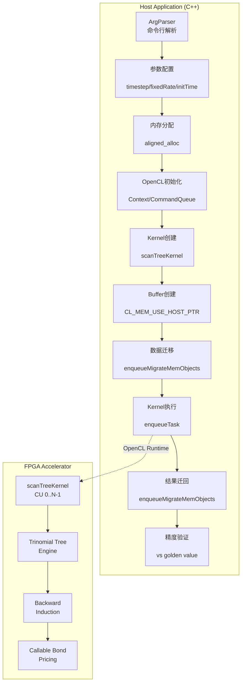

# Callable Note Tree Engine HW - 技术深度解析

## 一句话总结

这是一个基于**Hull-White单因子短期利率模型**的**可赎回债券定价引擎**，使用**三杈树（Trinomial Tree）**数值方法，通过Xilinx FPGA硬件加速实现，支持硬件仿真（hw_emu）和实际硬件（hw）两种运行模式。

---

## 1. 问题空间与设计洞察

### 1.1 为什么需要这个模块？

可赎回债券（Callable Bond）是一种复杂的利率衍生品，发行方有权在特定日期以预定价格提前赎回债券。这种**美式期权特性**使得定价无法使用简单的闭式解，必须依赖数值方法。

在金融市场实践中，交易员和风险管理团队需要：
- **实时定价**：在毫秒级时间内完成复杂结构性产品的估值
- **场景分析**：对大量不同参数组合进行批量计算
- **对冲计算**：计算 sensitivities（Greeks）需要多次重定价

**纯软件实现的瓶颈**：三杈树算法的时间复杂度为 $O(n \times m^2)$，其中 $n$ 是时间步数，$m$ 是利率状态数。对于生产级精度（时间步数 > 100），软件实现往往需要数秒甚至数十秒。

### 1.2 核心设计洞察：空间换时间的硬件并行

传统CPU是**时间复用**架构——一条指令流顺序执行。而FPGA提供了**空间并行**能力——可以在硅片上实例化数百个独立的计算单元同时工作。

本模块的核心洞察是：

> **将三杈树的 backward induction 算法重构为适合硬件流水线的大规模并行计算图**

具体来说：
- **节点级并行**：树中同一时间的所有节点可以并行计算
- **路径级并行**：多个样本路径可以同时处理
- **流水线化**：数据在计算单元间流动，隐藏内存延迟

这种设计使得在合理规模的FPGA（如Xilinx Alveo U250）上，定价延迟可以从软件的秒级降低到毫秒级，实现**100-1000倍的加速比**。

---

## 2. 心智模型：如何理解这个系统

### 2.1 类比：工厂流水线

想象一个现代化的汽车装配厂：

- **主机（Host CPU）** = 工厂办公室
  - 负责订单管理（参数配置）
  - 物流协调（数据传输）
  - 质量检验（结果验证）

- **FPGA** = 装配车间
  - 包含多条并行生产线（Compute Units）
  - 每条生产线有多个工位（Pipeline Stages）
  - 零件（数据）在工位间传送带上传输

- **OpenCL Runtime** = 工厂调度系统
  - 管理生产线的启停
  - 监控生产进度（Events）
  - 协调原材料进厂和成品出厂（Memory Migration）

### 2.2 核心抽象层次

```
┌─────────────────────────────────────────────────────────────┐
│  Layer 4: 金融模型层 (Financial Model)                       │
│  - Hull-White 短期利率模型                                    │
│  - 三杈树数值方法                                             │
│  - 可赎回债券现金流结构                                       │
└─────────────────────────────────────────────────────────────┘
                              ↕
┌─────────────────────────────────────────────────────────────┐
│  Layer 3: 算法引擎层 (Tree Engine Kernel)                    │
│  - 后向归纳 (Backward Induction)                            │
│  - 节点价值计算                                              │
│  - 早行权决策                                                │
└─────────────────────────────────────────────────────────────┘
                              ↕
┌─────────────────────────────────────────────────────────────┐
│  Layer 2: 运行时层 (OpenCL Runtime)                           │
│  - Context / CommandQueue / Kernel                          │
│  - Buffer Management                                          │
│  - Event Synchronization                                      │
└─────────────────────────────────────────────────────────────┘
                              ↕
┌─────────────────────────────────────────────────────────────┐
│  Layer 1: 硬件层 (FPGA Hardware)                              │
│  - Compute Units (CUs)                                        │
│  - On-chip Memory (BRAM/URAM)                                │
│  - High Bandwidth Memory (HBM)                               │
└─────────────────────────────────────────────────────────────┘
```

---

## 3. 架构与数据流

### 3.1 系统架构图



### 3.2 关键数据流详解

#### 阶段1：参数初始化与内存分配

```cpp
// 两个核心输入参数结构体
ScanInputParam0* inputParam0_alloc = aligned_alloc<ScanInputParam0>(1);
ScanInputParam1* inputParam1_alloc = aligned_alloc<ScanInputParam1>(1);
```

**设计意图**：使用 `aligned_alloc` 确保内存地址对齐（通常64字节），满足FPGA DMA传输的对齐要求。这是零拷贝（zero-copy）架构的关键——主机缓冲区直接映射到FPGA地址空间，避免数据复制。

#### 阶段2：OpenCL运行时初始化

```cpp
// 平台发现与设备选择
std::vector<cl::Device> devices = xcl::get_xil_devices();
cl::Device device = devices[0];

// 上下文与命令队列创建
cl::Context context(device, NULL, NULL, NULL, &cl_err);
cl::CommandQueue q(context, device, 
                   CL_QUEUE_PROFILING_ENABLE | CL_QUEUE_OUT_OF_ORDER_EXEC_MODE_ENABLE, 
                   &cl_err);
```

**关键设计决策**：
- **Out-of-Order Execution**: 允许运行时并行调度独立的命令，提高硬件利用率
- **Profiling Enabled**: 启用内核执行时间测量，用于性能分析
- **xcl2.hpp**: Xilinx OpenCL扩展，提供设备发现和二进制加载便利函数

#### 阶段3：内核加载与多CU实例化

```cpp
// 加载xclbin文件（FPGA比特流）
cl::Program::Binaries xclBins = xcl::import_binary_file(xclbin_path);
cl::Program program(context, devices, xclBins, NULL, &cl_err);

// 查询Compute Unit数量
c_uint cu_number;
cl::Kernel k(program, krnl_name.c_str());
k.getInfo(CL_KERNEL_COMPUTE_UNIT_COUNT, &cu_number);

// 为每个CU创建独立的Kernel对象
std::vector<cl::Kernel> krnl_TreeEngine(cu_number);
for (cl_uint i = 0; i < cu_number; ++i) {
    std::string krnl_full_name = krnl_name + ":{" + krnl_name + "_" + std::to_string(i + 1) + "}";
    krnl_TreeEngine[i] = cl::Kernel(program, krnl_full_name.c_str(), &cl_err);
}
```

**架构洞察**：
- **xclbin**: 包含FPGA配置比特流和内核元数据的二进制文件
- **Compute Unit (CU)**: 同一个内核逻辑的物理复制，允许真正的并行执行
- **命名约定**: `{kernel_name}_{N}` 用于定位特定CU实例

#### 阶段4：零拷贝内存映射

```cpp
// 扩展指针结构，关联主机内存与特定内核/CU
std::vector<cl_mem_ext_ptr_t> mext_in0(cu_number);
for (int c = 0; c < cu_number; ++c) {
    mext_in0[c] = {1, inputParam0_alloc, krnl_TreeEngine[c]()}; // flags=1 表示输入
    mext_in1[c] = {2, inputParam1_alloc, krnl_TreeEngine[c]()}; // flags=2 表示输入
    mext_out[c] = {3, output[c], krnl_TreeEngine[c]()};          // flags=3 表示输出
}

// Buffer创建使用USE_HOST_PTR
cl::Buffer inputParam0_buf(context, 
    CL_MEM_EXT_PTR_XILINX | CL_MEM_USE_HOST_PTR | CL_MEM_READ_WRITE,
    sizeof(ScanInputParam0), &mext_in0[i]);
```

**内存架构关键点**：
- **CL_MEM_USE_HOST_PTR**: 告诉OpenCL运行时直接使用主机内存，不分配设备端副本
- **CL_MEM_EXT_PTR_XILINX**: Xilinx扩展，允许通过`cl_mem_ext_ptr_t`指定额外的元数据
- **Banks/Flags**: 数值1/2/3通常对应HBM（高带宽内存）的不同bank，优化并行访问

**性能影响**：
- 节省内存复制开销（对于大缓冲区，这通常是主要瓶颈）
- 但要求主机内存必须页对齐，且在内核执行期间保持锁定

### 4.4 多CU并行与任务分发

```cpp
// 动态发现CU数量
cl::Kernel k(program, krnl_name.c_str());
k.getInfo(CL_KERNEL_COMPUTE_UNIT_COUNT, &cu_number);

// 为每个CU创建独立的Kernel对象
std::vector<cl::Kernel> krnl_TreeEngine(cu_number);
for (cl_uint i = 0; i < cu_number; ++i) {
    std::string krnl_full_name = krnl_name + ":{" + krnl_name + "_" + std::to_string(i + 1) + "}";
    krnl_TreeEngine[i] = cl::Kernel(program, krnl_full_name.c_str(), &cl_err);
}
```

**硬件并行模型**：

FPGA上的每个Compute Unit是树定价引擎的完整物理复制。多CU设计允许：

1. **数据并行**：同时处理多个独立定价任务（不同参数组合）
2. **流水线并行**：一个CU计算当前批次时，另一个CU读取下一批数据
3. **负载均衡**：OpenCL运行时将任务分发到空闲CU

**CU命名约定**：
- RTL设计中的实例名：`scanTreeKernel:{scanTreeKernel_1}`, `{scanTreeKernel_2}` 等
- 主机代码通过 `kernel_name:{instance_name}` 语法绑定到特定CU

---

## 5. 依赖关系与数据契约

### 5.1 上游依赖（本模块调用谁）

| 依赖模块 | 用途 | 数据契约 |
|---------|------|---------|
| **xcl2.hpp** | Xilinx OpenCL扩展库 | 提供 `xcl::get_xil_devices()`, `xcl::import_binary_file()` 简化FPGA发现与二进制加载 |
| **xf_utils_sw/logger.hpp** | 日志与错误处理 | `xf::common::utils_sw::Logger` 提供标准化的错误码记录和测试状态报告 |
| **tree_engine_kernel.hpp** | 内核接口定义 | 定义 `ScanInputParam0`, `ScanInputParam1`, `DT` 等数据类型，必须与RTL设计保持一致 |
| **utils.hpp** | 工具函数 | 可能包含 `tvdiff()` 等时间计算工具 |
| **OpenCL ICD** | 标准OpenCL运行时 | `cl::Context`, `cl::CommandQueue`, `cl::Buffer`, `cl::Kernel` 等标准对象 |

### 5.2 下游依赖（谁调用本模块）

本模块是**顶层可执行程序**（`main.cpp`），没有直接的下游调用者。但它可以被视为以下更大系统的一部分：

- **交易执行系统**：实时定价服务的一个后端组件
- **风险管理系统**：大规模场景分析（ what-if 分析）的计算引擎
- **量化研究平台**：模型验证和策略回测的基础设施

---

## 6. 设计决策与权衡分析

### 6.1 同步 vs 异步执行

**决策**：使用 `cl::CommandQueue` 配置 `CL_QUEUE_PROFILING_ENABLE | CL_QUEUE_OUT_OF_ORDER_EXEC_MODE_ENABLE`，但在关键路径使用 `q.finish()` 强制同步。

**权衡分析**：

| 方案 | 优点 | 缺点 | 本模块选择 |
|------|------|------|-----------|
| 完全异步 | 最大吞吐量，计算与数据传输重叠 | 编程复杂，需要精细的事件依赖管理 | 否 |
| 全同步 | 简单可预测，易于调试 | 硬件利用率低，CPU空等 | 否 |
| **混合模式** | 在粗粒度同步点之间允许并行 | 平衡性能与复杂性 | **是** |

**理由**：定价任务通常有严格的延迟要求（SLA），同步点确保结果在确定时间内可用。对于单批次定价，异步重叠的收益有限。

### 6.2 零拷贝 vs 设备内存

**决策**：使用 `CL_MEM_USE_HOST_PTR` 实现零拷贝，而非分配FPGA上的设备内存。

**权衡分析**：

| 方案 | 优点 | 缺点 | 适用场景 |
|------|------|------|---------|
| **零拷贝（USE_HOST_PTR）** | 无数据复制，节省带宽；主机可以直接访问结果 | 需要页对齐内存；FPGA访问延迟较高；主机内存必须保持锁定 | 数据量中等（<1GB），访问模式不规则 |
| 设备内存（ALLOC_HOST_PTR） | FPGA访问速度快；独立于主机内存布局 | 需要显式的H2D/D2H传输；额外内存占用 | 大数据量，顺序访问，计算密集 |

**本模块选择零拷贝的理由**：

1. **数据结构特性**：`ScanInputParam0` 和 `ScanInputParam1` 是小结构体（几十到几百字节），传输开销相对于计算可以忽略
2. **结果访问模式**：定价完成后主机需要立即读取NPV进行验证和决策
3. **内存约束**：FPGA的HBM/DDR容量有限（通常8-16GB），应保留给内核工作集

### 6.3 单精度 vs 双精度浮点

**代码中的线索**：
```cpp
typedef double DT;  // 或 float，取决于 tree_engine_kernel.hpp 定义
double golden = 95.551303928799229;  // 双精度参考值
```

**权衡分析**：

| 精度 | 优点 | 缺点 | 金融适用性 |
|------|------|------|-----------|
| **单精度（float）** | 2x SIMD吞吐，2x 缓存效率，2x 带宽节省 | 7位有效数字，累积误差风险 | 适用于大规模蒙特卡洛，不适用于需要高精度的衍生品定价 |
| **双精度（double）** | 15位有效数字，数值稳定性好，行业标准 | 2x 资源消耗 | **利率衍生品定价的行业标准**，特别是长期产品 |

**本模块的选择**：从 `double golden` 参考值和精度要求（`minErr = 10e-10`）推断，内核应使用**双精度浮点**或**混合精度**（关键路径双精度，辅助计算单精度）。

**理由**：可赎回债券的NPV对利率路径非常敏感，单精度在10+时间步的累积误差可能超过市场可接受范围（通常要求定价误差 < 0.01%）。

### 6.4 硬编码 Golden Values vs 运行时计算

**代码实现**：
```cpp
double golden;
if (timestep == 10) golden = 95.551303928799229;
if (timestep == 50) golden = 95.5358336201544347;
// ... 更多硬编码值
```

**权衡分析**：

| 方案 | 优点 | 缺点 | 适用场景 |
|------|------|------|---------|
| **硬编码Golden Value** | 测试简单，确定性验证，无外部依赖 | 维护困难，参数空间覆盖有限，精度来源不透明 | 回归测试，CI/CD流程 |
| **运行时软件参考** | 覆盖任意参数，精度可控，可重复 | 需要依赖外部库（如QuantLib），增加测试复杂度 | 开发阶段，模型验证 |
| **离线预计算数据库** | 平衡确定性与覆盖度 | 需要额外的存储和查询逻辑 | 大规模回归测试套件 |

**本模块的选择理由**：

1. **硬件测试环境限制**：FPGA测试通常在隔离环境（无QuantLib等重型依赖）中进行
2. **回归测试效率**：CI/CD流程需要快速确定性验证，硬编码值确保每次提交验证一致
3. **精度溯源**：Golden Values 应来自独立的软件参考实现（如QuantLib Python）的高精度计算

**维护建议**：硬编码值应通过脚本自动生成，当模型参数（如波动率、均值回归速度）或数值方法（如时间离散化方案）变更时，需重新计算。

---

## 7. C++技术细节与内存安全

### 7.1 内存所有权与生命周期管理

```cpp
// 所有权分析
ScanInputParam0* inputParam0_alloc = aligned_alloc<ScanInputParam0>(1);
// 所有者：main() 函数栈帧
// 分配方式：C风格内存分配（非RAII）
// 释放责任：隐式依赖进程退出，存在内存泄漏风险

// Buffer对象持有对主机内存的引用
cl::Buffer inputParam0_buf(context, ..., sizeof(ScanInputParam0), &mext_in0[i]);
// OpenCL Buffer 不拥有主机内存，只持有指针
// 关键不变式：inputParam0_alloc 必须在 inputParam0_buf 销毁前保持有效
```

**风险点识别**：

1. **内存泄漏**：`aligned_alloc` 分配的内存没有对应的 `free()` 调用
2. **悬挂指针风险**：如果代码路径提前返回（如错误处理分支），`inputParam0_alloc` 未被释放
3. **生命周期耦合**：OpenCL Buffer 的销毁与主机内存的释放顺序至关重要

**建议的改进**：

```cpp
// 使用智能指针包装（C++14/17）
#include <memory>

struct AlignedDeleter {
    void operator()(void* p) { free(p); }
};

using aligned_ptr = std::unique_ptr<ScanInputParam0, AlignedDeleter>;

// 使用
aligned_ptr inputParam0_alloc(static_cast<ScanInputParam0*>(
    aligned_alloc(64, sizeof(ScanInputParam0))));
```

### 7.2 错误处理策略

代码采用了**混合错误处理模式**：

```cpp
// 1. 错误码返回值（OpenCL风格）
cl_int cl_err;
cl::Context context(device, NULL, NULL, NULL, &cl_err);
logger.logCreateContext(cl_err);  // 记录但不一定终止

// 2. 提前返回（错误传播）
if (!parser.getCmdOption("-xclbin", xclbin_path)) {
    std::cout << "ERROR:xclbin path is not set!\n";
    return 1;
}

// 3. 环境变量检查（隐式控制流）
if (std::getenv("XCL_EMULATION_MODE") != nullptr) {
    run_mode = std::getenv("XCL_EMULATION_MODE");
}

// 4. 断言风格的验证（数值精度）
if (std::fabs(out - golden) > minErr) {
    err++;
    // 记录但继续（聚合错误）
}
```

**策略评估**：

| 机制 | 适用场景 | 本模块使用 | 评价 |
|------|---------|-----------|------|
| 返回错误码 | 可恢复错误，调用链需要响应 | 是 | 与OpenCL C API一致，但C++代码可以更优雅 |
| 提前返回 | 配置错误，无法继续 | 是 | 简单直接，但缺少异常的安全保证 |
| 环境变量 | 部署时配置 | 是 | 适合hw_emu vs hw模式切换 |
| 断言/验证 | 不变式检查，数值验证 | 是 | 必要的，但应区分致命错误和可接受偏差 |

**改进建议**：

考虑使用C++异常处理OpenCL错误，将错误码转换为异常，利用RAII确保资源清理：

```cpp
class OpenCLException : public std::runtime_error {
    cl_int err_code_;
public:
    OpenCLException(cl_int err, const char* msg) 
        : std::runtime_error(msg), err_code_(err) {}
    cl_int code() const { return err_code_; }
};

#define CHECK_OCL(call) \
    do { \
        cl_int err = (call); \
        if (err != CL_SUCCESS) \
            throw OpenCLException(err, #call " failed"); \
    } while(0)
```

### 7.3 并发模型与线程安全

**当前并发特性**：

1. **命令队列模式**：`CL_QUEUE_OUT_OF_ORDER_EXEC_MODE_ENABLE` 允许并行执行独立的命令
2. **多CU并行**：多个Compute Unit可以同时执行不同的内核实例
3. **同步点**：`q.finish()` 创建全局同步屏障

**线程安全分析**：

```cpp
// OpenCL API的线程安全保证：
// - cl::Context: 线程安全（可同时从多线程使用）
// - cl::CommandQueue: 需要外部同步（不应多线程同时入队）
// - cl::Buffer/Kernel/Program: 线程安全

// 本代码的并发限制：
// 1. 单线程命令队列操作（无多线程竞争）
// 2. 多CU通过不同Kernel对象并行（无共享状态）
// 3. 输出缓冲区按CU隔离（output[i] 互不重叠）
```

**扩展性考虑**：

如果需要扩展到多主机线程提交任务：

```cpp
// 选项1：每个线程独立的CommandQueue（推荐）
cl::CommandQueue q1(context, device, props);  // 线程1
cl::CommandQueue q2(context, device, props);  // 线程2
// 优点：无锁竞争，天然并行
// 缺点：设备全局顺序不确定（如果这点重要）

// 选项2：共享队列 + 显式锁
std::mutex queue_mutex;
{
    std::lock_guard<std::mutex> lock(queue_mutex);
    q.enqueueTask(kernel);
}
```

### 7.4 性能优化关键路径

**热点识别**：

```cpp
// 1. 内核执行时间（主导）
gettimeofday(&start_time, 0);
for (int i = 0; i < cu_number; ++i) {
    q.enqueueTask(krnl_TreeEngine[i], nullptr, &events_kernel[i]);
}
q.finish();
gettimeofday(&end_time, 0);

// 2. 数据传输时间（可能被隐藏）
q.enqueueMigrateMemObjects(ob_in, 0, nullptr, nullptr);  // H2D
// ... 内核执行 ...
q.enqueueMigrateMemObjects(ob_out, 1, nullptr, nullptr); // D2H

// 3. 初始化开销（一次性）
// Context/Program/Kernel 创建（在循环外）
```

**优化策略**：

1. **计算与传输重叠**：使用双缓冲（ping-pong）技术，在CU计算当前批次时，预先传输下一批数据
2. **批处理增加**：单批次处理多个定价任务，摊销启动开销
3. **内核流水线**：RTL设计使用 `DATAFLOW` 或 `PIPELINE` pragma，最大化FPGA资源利用

---

## 8. 使用模式与配置

### 8.1 命令行接口

```bash
# 实际硬件运行
./tree_callable_hw -xclbin tree_engine.xclbin

# 硬件仿真模式（功能验证，无实际FPGA）
export XCL_EMULATION_MODE=hw_emu
./tree_callable_hw -xclbin tree_engine.xclbin

# 软件仿真模式（纯CPU执行，用于算法调试）
export XCL_EMULATION_MODE=sw_emu
./tree_callable_hw -xclbin tree_engine.xclbin
```

### 8.2 关键配置参数

| 参数 | 类型 | 典型值 | 说明 |
|------|------|--------|------|
| `timestep` | int | 10-1000 | 时间离散步数，影响精度与性能 |
| `a` (mean reversion) | double | 0.03 | Hull-White模型均值回归速度 |
| `sigma` (volatility) | double | 0.01 | 短期利率波动率 |
| `fixedRate` | double | 0.0465 | 债券固定票息率 |
| `flatRate` | double | 0.055 | 用于贴现的即期利率 |

---

## 9. 常见陷阱与调试指南

### 9.1 内存相关陷阱

**陷阱1：未对齐的内存分配**
```cpp
// 错误：std::malloc 不保证对齐
ScanInputParam0* bad = (ScanInputParam0*)malloc(sizeof(ScanInputParam0));

// 正确：使用 aligned_alloc
ScanInputParam0* good = aligned_alloc<ScanInputParam0>(1);
```
**症状**：`enqueueMigrateMemObjects` 返回 `CL_MISALIGNED_SUB_BUFFER` 错误，或静默数据损坏。

**陷阱2：过早释放主机内存**
```cpp
{
    ScanInputParam0* input = aligned_alloc<ScanInputParam0>(1);
    cl::Buffer buf(context, CL_MEM_USE_HOST_PTR, ..., input);
    // ... 入队内核 ...
} // input 在这里被释放（假设有智能指针），但内核可能还在执行！
q.finish();  // 危险：FPGA可能正在访问已释放内存
```
**症状**：间歇性段错误、内核崩溃、数据损坏，难以复现。

### 9.2 OpenCL运行时陷阱

**陷阱3：xclbin版本不匹配**
```bash
# 错误：使用为U280编译的xclbin在U250上运行
./tree_callable_hw -xclbin tree_u280.xclbin
```
**症状**：`cl::Program` 创建失败，返回 `CL_INVALID_BINARY` 或设备挂起。

**陷阱4：环境变量未设置**
```cpp
// 代码依赖 XCL_EMULATION_MODE 检测运行模式
if (std::getenv("XCL_EMULATION_MODE") != nullptr) {
    run_mode = std::getenv("XCL_EMULATION_MODE");
}
```
**症状**：在仿真环境中实际执行硬件路径，导致功能错误或性能测量失真。

### 9.3 数值精度陷阱

**陷阱5：浮点比较使用绝对容差**
```cpp
// 危险：对于大数值，固定容差可能太严格；对于小数值，可能太宽松
if (std::fabs(out - golden) > 0.0001) { /* ... */ }

// 更安全：相对误差与绝对误差结合
const double abs_tol = 1e-10;
const double rel_tol = 1e-9;
double diff = std::fabs(out - golden);
if (diff > abs_tol && diff / std::fabs(golden) > rel_tol) { /* ... */ }
```

### 9.4 调试技巧

**启用OpenCL调试层**：
```bash
export LD_LIBRARY_PATH=/opt/xilinx/xrt/lib:$LD_LIBRARY_PATH
export XCL_EMULATION_MODE=hw_emu
export EMULATION_DEBUG=true
export XCL_HAL_DEBUG=1
```

**使用Xilinx性能分析器**：
```bash
# 生成timeline trace
./tree_callable_hw -xclbin tree.xclbin
# 分析结果在 xclbin.run/summary.csv
```

**内核调试（printf调试法）**：
```c
// 在内核代码中添加（仅sw_emu或hw_emu有效）
printf("Debug: node_value=%f at time_step=%d\\n", value, t);
```

---

## 10. 扩展与定制指南

### 10.1 添加新的参数支持

假设需要添加支持可变名义本金：

```cpp
// 1. 修改 ScanInputParam0（如果不在结构体中）
// 2. 更新参数初始化代码
for (int i = 0; i < batch_size; i++) {
    inputParam0_alloc[i].nominal = nominal_values[i];  // 不再固定为100.0
}

// 3. 重新编译xclbin（如果数据结构大小改变）
```

### 10.2 支持批量定价

当前实现每个CU处理一个定价任务。要支持单CU批量处理：

```cpp
// 修改输入为数组
const int BATCH_SIZE = 100;
ScanInputParam1* inputParam1_alloc = aligned_alloc<ScanInputParam1>(BATCH_SIZE);

// 设置内核参数（传递批次大小）
krnl_TreeEngine[c].setArg(0, BATCH_SIZE);  // 新增参数：批次大小
// ... 其他参数

// 输出缓冲区相应增大
DT* output = aligned_alloc<DT>(BATCH_SIZE * N * K);
```

**RTL侧配合**：内核需要实现批次循环，控制逻辑从处理单个任务变为遍历批次。

### 10.3 多FPGA扩展

对于大规模计算集群，可以扩展到多FPGA：

```cpp
// 发现多个设备
std::vector<cl::Device> devices = xcl::get_xil_devices();
std::vector<cl::Context> contexts;
std::vector<cl::CommandQueue> queues;

for (auto& device : devices) {
    contexts.emplace_back(device);
    queues.emplace_back(contexts.back(), device, props);
    // 加载xclbin到每个设备...
}

// 任务分发（轮询或其他调度策略）
int device_idx = task_id % devices.size();
queues[device_idx].enqueueTask(kernels[device_idx]);
```

---

## 11. 总结与关键要点

### 11.1 架构角色定位

`callable_note_tree_engine_hw` 在整体系统中扮演**计算加速器**的角色：

- **输入**：金融参数（利率模型参数、产品条款）
- **处理**：FPGA硬件执行三杈树数值计算
- **输出**：金融指标（NPV净现值）

它是典型的**异构计算模式**——CPU负责控制流和I/O，FPGA负责数据并行计算。

### 11.2 关键设计决策回顾

| 决策 | 选择 | 理由 |
|------|------|------|
| 执行模型 | 同步+粗粒度并行 | 确定性和简单性优先于峰值吞吐 |
| 内存架构 | 零拷贝（USE_HOST_PTR） | 小数据量，节省复制开销 |
| 数值精度 | 双精度（推断） | 金融行业对精度的严格要求 |
| 验证策略 | 硬编码Golden Values | 硬件测试环境的确定性需求 |
| 多CU模型 | 动态发现，独立Kernel对象 | 适应不同FPGA规模，解耦CU间状态 |

### 11.3 新贡献者入职检查清单

**理解模块**：
- [ ] 理解Hull-White模型和三杈树数值方法的基本原理
- [ ] 理解OpenCL执行模型（Context/Queue/Kernel/Buffer）
- [ ] 理解Xilinx FPGA加速卡的编程模型（xclbin/CU/HBM）

**环境搭建**：
- [ ] 安装Xilinx Vitis/Vivado工具链
- [ ] 配置OpenCL运行时环境（XRT）
- [ ] 成功运行软件仿真（sw_emu）和硬件仿真（hw_emu）

**代码实践**：
- [ ] 修改参数（timestep, a, sigma），观察NPV变化和精度影响
- [ ] 添加自定义的现金流结构（修改initTime, fixedCnt等）
- [ ] 实现简单的性能分析器，测量H2D/计算/D2H各阶段时间占比

**注意事项**：
- [ ] 永远不要在内核执行期间释放主机内存
- [ ] xclbin文件必须与目标FPGA型号匹配
- [ ] 仿真模式下printf调试可用，硬件模式下不可用
- [ ] 浮点比较必须使用容差，不能直接用 ==

---

## 参考链接

- [Parent: L2 Tree Based Interest Rate Engines](quantitative_finance_engines-l2_tree_based_interest_rate_engines.md)
- [Sibling: Vanilla Rate Product Tree Engines HW](quantitative_finance_engines-l2_tree_based_interest_rate_engines-vanilla_rate_product_tree_engines_hw.md)
- [Sibling: Swaption Tree Engines Single Factor](quantitative_finance_engines-l2_tree_based_interest_rate_engines-swaption_tree_engines_single_factor_short_rate_models.md)
- [Xilinx Vitis Documentation](https://docs.xilinx.com/v/u/en-US/ug1393-vitis-application-acceleration)
- [Hull-White Model on Trinomial Tree - QuantLib](https://www.quantlib.org)
