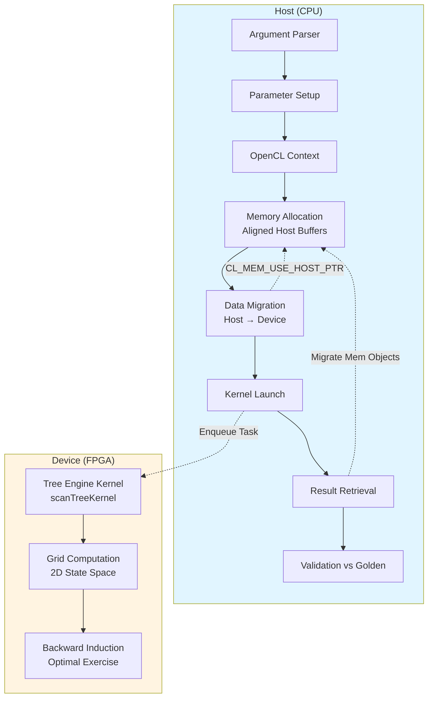
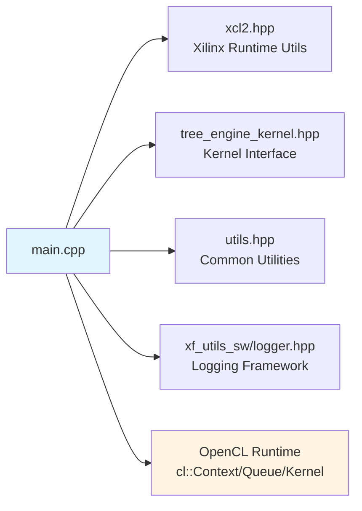

# Swaption Tree Engine (Two-Factor G2++ Model)

## 一句话概括

这是一个基于 FPGA 的百慕大式互换期权（Bermudan Swaption）定价引擎，采用双因子 G2++ 利率模型，通过树方法（Tree Method）在硬件上并行计算复杂衍生品的价格。你可以将其理解为一个专用金融计算器，它把原本需要在 CPU 上运行数分钟的蒙特卡洛模拟或有限差分计算，压缩到毫秒级的硬件加速执行。

## 问题空间与设计洞察

### 我们要解决什么核心问题？

百慕大式互换期权是一种允许持有人在多个预设日期（而不仅仅是到期日）行使权利的复杂利率衍生品。定价这类工具需要解决两个计算密集型挑战：

1. **高维状态空间**：双因子 G2++ 模型中，短期利率由两个相关随机因子驱动，形成二维扩散过程。传统闭式解不存在，必须通过数值方法求解。

2. **美式/百慕大最优执行边界**：需要在每个可行权时间点计算继续持有价值 vs 立即行权价值，这要求向后递归（Backward Induction）遍历整个时间-状态空间树。

在 CPU 上，这样的计算即使使用优化的 C++ 实现也可能需要数秒到数分钟，对于需要实时定价或风险敏感度分析（Greeks 计算）的交易场景来说太慢了。

### 为什么是 FPGA？为什么是树方法？

**设计洞察**：G2++ 模型的树方法具有高度规则的计算模式——在每个时间节点，我们需要对二维网格上的每个状态点执行相同的转移概率计算和期望值回推。这种数据并行性极其适合 FPGA 的 SIMD 架构。

与蒙特卡洛方法相比，树方法虽然内存密集度更高（需要存储整个网格），但提供了确定性的收敛性和更适合 FPGA 流水线处理的规则内存访问模式。我们选择了空间-时间权衡：用更多的片上内存带宽换取确定性的低延迟收敛。

## 架构全景

### 系统拓扑



### 角色分工

**Host (CPU) 端**：作为指挥者（Orchestrator），负责所有不适合硬连线逻辑的控制流任务：解析命令行参数、初始化 G2++ 模型参数（均值回归速度、波动率、初始利率曲线）、管理 OpenCL 运行时上下文、处理与 FPGA 之间的内存映射和 DMA 传输，以及最终的结果校验。Host 代码在 `main.cpp` 中实现，采用标准的 Xilinx XRT/OpenCL 编程模型。

**Device (FPGA) 端**：作为计算加速器（Accelerator Kernel），由 `scanTreeKernel` 实现核心的树方法算法。这个内核在一个二维状态空间网格上执行时间向后递归，在每个时间节点计算转移概率、更新状态值，并处理百慕大式期权的早期行权决策逻辑。内核高度流水线化，利用 FPGA 的 DSP 片进行浮点/定点运算，利用 Block RAM 存储中间网格状态。

## 核心组件深度解析

### 主程序控制流 (`main.cpp`)

主程序是 Host 端的入口点，采用经典的 OpenCL 主机端设计模式。它不包含复杂的业务逻辑，而是专注于**资源生命周期管理**和**执行流水线编排**。

**初始化阶段**：
- 使用 `ArgParser` 类解析命令行参数，特别是 `-xclbin` 参数指定 FPGA 二进制文件路径。
- 检测运行模式（硬件仿真 `hw_emu` vs 实际硬件 `hw`），根据模式调整计算时间步长（`timestep`）。这是重要的调试便利性设计：在仿真模式下使用更小的时间步长以加速验证。

**OpenCL 运行时搭建**：
- 通过 `xcl::get_xil_devices()` 发现 Xilinx 设备，创建设备上下文和命令队列。注意队列创建时的标志差异：软件仿真使用顺序队列，硬件运行使用**乱序执行队列**（`CL_QUEUE_OUT_OF_ORDER_EXEC_MODE_ENABLE`）以最大化吞吐量。
- 加载 `.xclbin` 文件，创建内核对象。特别值得注意的是对**多计算单元（Compute Units, CUs）**的支持：代码动态查询内核的 CU 数量（`CL_KERNEL_COMPUTE_UNIT_COUNT`），为每个 CU 创建独立的内核对象实例（`krnl_TreeEngine[i]`），实现任务级并行。

### 参数结构与内存布局

输入参数被分割到两个结构体 `ScanInputParam0` 和 `ScanInputParam1` 中（定义在 `tree_engine_kernel.hpp` 中，具体实现在本文件外）。这种分割可能是为了匹配 FPGA 内核的接口宽度或内存对齐要求。

**参数设置逻辑**：
代码中硬编码了一组特定的测试参数，这实际上是**回归测试**的典型模式：
- 固定利率（`fixedRate`）和初始时间数组（`initTime`）定义了一个特定的互换合约结构。
- 行权计数数组（`exerciseCnt`）、固定腿计数（`fixedCnt`）和浮动腿计数（`floatingCnt`）定义了百慕大式期权的行权时间表和现金流结构。
- 模型参数 `a`（均值回归速度）和 `sigma`（波动率）是 G2++ 模型的核心输入。

这种硬编码方式意味着该可执行文件实际上是一个**自包含的集成测试**，而非通用命令行工具。生产环境使用可能需要修改源码或扩展参数解析逻辑。

### 内存管理与零拷贝优化

内存管理是本模块性能的关键。代码采用了 Xilinx OpenCL 扩展实现**主机-设备零拷贝（Zero-Copy）**访问：

1. **对齐分配**：使用 `aligned_alloc<ScanInputParam0>(1)` 确保主机内存按照 FPGA 要求的边界对齐（通常是 4KB 页边界）。这是硬件 DMA 引擎的要求。

2. **扩展内存指针**：创建 `cl_mem_ext_ptr_t` 结构，将主机指针与特定的内核参数索引关联（`{1, inputParam0_alloc, krnl_TreeEngine[c]()}`）。这里的索引（1, 2, 3）对应内核的 `setArg` 位置。

3. **零拷贝缓冲区创建**：使用 `CL_MEM_EXT_PTR_XILINX | CL_MEM_USE_HOST_PTR` 标志创建 `cl::Buffer`。这告诉运行时：不要分配设备专用内存，而是直接使用主机指针指向的物理内存。FPGA 通过 PCIe 直接访问主机内存，避免昂贵的 `memcpy`。

4. **显式迁移**：尽管使用零拷贝，代码仍显式调用 `enqueueMigrateMemObjects` 来确保缓存一致性和数据同步。这是 OpenCL 标准与硬件实际行为之间的桥梁。

### 内核执行与流水线并行

内核启动部分展示了如何压榨 FPGA 的并行能力：

**参数绑定**：
通过 `setArg` 将缓冲区对象和标量（`len`）绑定到内核参数。注意 `len` 是通过值传递的标量，而缓冲区是通过 OpenCL 对象传递的引用。

**任务级并行**：
如果 FPGA 二进制文件包含多个计算单元（CUs），代码为每个 CU 独立入队任务（`enqueueTask`），每个任务附带独立的事件对象（`events_kernel[i]`）。这允许主机同时向多个硬件引擎提交工作，实现**多批次并行处理**。

**乱序执行**：
命令队列创建时启用了 `CL_QUEUE_OUT_OF_ORDER_EXEC_MODE_ENABLE`，这意味着 OpenCL 运行时可以根据依赖关系（通过事件链隐式或显式指定）乱序执行命令，最大化硬件利用率。

### 性能分析与结果验证

代码包含企业级性能分析基础设施：

**多层次计时**：
1. **主机端墙钟时间**：使用 `gettimeofday` 测量端到端延迟（包括内存迁移、内核启动开销）。
2. **OpenCL 事件分析**：通过 `CL_PROFILING_COMMAND_START/END` 获取纯内核执行时间（不包括 PCIe 传输和调度延迟）。
3. **区分多 CU**：为每个计算单元独立打印执行时间，便于识别负载不均或硬件瓶颈。

**结果正确性验证**：
代码不假设内核输出总是正确，而是执行严格的**回归测试**：
- 预计算不同时间步长（10, 50, 100）下的理论价格（`golden` 值），这些值来自高精度参考实现。
- 计算 FPGA 输出与金标准的相对误差 `(out - golden) / golden`。
- 使用容差 `minErr`（代码中为 `10e-10`，但实际比较时使用 `minErr` 变量，注意代码中 `minErr = 10e-10` 即 $10^{-9}$）判断测试通过/失败。
- 通过 `xf::common::utils_sw::Logger` 输出标准化的测试报告（TEST_PASS/TEST_FAIL）。

这种设计确保当硬件实现、编译器优化或数值精度设置改变时，能够立即检测到回归。

## 依赖关系与数据流

### 上游依赖（调用本模块的上下文）

本模块在组织上属于定量金融库的**二级（L2）基准测试层**。它通常不由其他生产代码直接调用，而是通过以下方式使用：

1. **持续集成/回归测试流水线**：作为 nightly build 的一部分运行，验证 FPGA 编译后的内核功能正确性。
2. **性能基准套件**：与其他单因子模型（Hull-White、Black-Karasinski、CIR）的实现进行对比，生成性能报告。
3. **开发调试**：量化开发者在调整模型参数或优化内核实现时，使用此主机代码作为快速验证工具。

### 下游依赖（本模块调用的组件）



**关键依赖详解**：

1. **Xilinx XRT (xcl2.hpp)**：提供高层 C++ 封装，简化设备发现、二进制加载和内存管理。这是 Xilinx 特定运行时，抽象了底层 OpenCL 的复杂性。

2. **Kernel Interface (tree_engine_kernel.hpp)**：定义 `ScanInputParam0`、`ScanInputParam1` 结构体和 `DT`（数据类型，可能是 `float` 或 `double` 的 typedef）、`K`、`N` 等常量。这是主机与 FPGA 内核之间的**二进制接口契约**——任何一方改变结构体布局都会导致未定义行为。

3. **Common Utilities (utils.hpp)**：可能包含 `aligned_alloc` 模板、计时辅助函数 `tvdiff` 等。这些跨模块共享的工具函数确保内存对齐和性能分析的一致性。

4. **Logger (xf_utils_sw/logger.hpp)**：标准化的日志和测试报告基础设施，提供 `TEST_PASS`/`TEST_FAIL` 语义，便于 CI 集成。

5. **OpenCL Runtime**：底层标准 API，用于命令队列管理、内存对象创建和内核执行同步。

### 数据流全景

一次完整的定价请求（从参数输入到结果输出）遵循以下数据路径：

```
[Model Parameters] 
    ↓ (Host CPU)
[ScanInputParam0/1 Structs] 
    ↓ aligned_alloc (Host Memory)
[CL Buffers with CL_MEM_USE_HOST_PTR] 
    ↓ enqueueMigrateMemObjects (PCIe DMA)
[FPGA On-Chip Memory/Global Memory] 
    ↓ scanTreeKernel Execution
[2D Grid Computation & Backward Induction] 
    ↓ Result Writeback
[Output Buffer (DT[N*K])] 
    ↓ enqueueMigrateMemObjects (Device→Host)
[Host Validation vs Golden Price]
```

关键设计决策在于**避免数据拷贝**：通过 `CL_MEM_USE_HOST_PTR`，OpenCL 缓冲区直接映射到主机已对齐分配的物理页，FPGA 通过 PCIe IOMMU 直接读写主机内存。这消除了传统 GPU 编程中常见的 `cudaMemcpy` 式显式传输开销。

## 设计决策与工程权衡

### 1. 计算分区：Host vs FPGA 边界划分

**决策**：将参数准备、结果验证和流程控制保留在 Host CPU，将树遍历的核心数值计算 offload 到 FPGA。

**权衡分析**：
- **替代方案 A**：完全在 FPGA 上运行，包括参数解析和验证。这会极大增加 FPGA 逻辑资源消耗（需要字符串解析、文件 I/O 等），且违背"控制平面与数据平面分离"的工程原则。
- **替代方案 B**：仅将矩阵运算 offload，保留树结构遍历在 Host。这会牺牲 FPGA 的最大优势——对不规则内存访问模式的流水线优化能力，导致 PCIe 传输瓶颈。

**当前选择的合理性**：Host 负责"什么"（Which swaption, what parameters）和"对不对"（Validation），FPGA 负责"算多快"（Number crunching）。这种边界使得 FPGA 二进制可以专注于固定功能的数值加速器，而 Host 代码可以灵活地集成到不同的交易系统工作流中。

### 2. 内存策略：零拷贝 vs 显式传输

**决策**：使用 `CL_MEM_USE_HOST_PTR` 和 Xilinx 扩展内存指针实现零拷贝（Zero-Copy）共享内存。

**权衡分析**：
- **替代方案**：使用 `CL_MEM_ALLOC_HOST_PTR` 或设备专用内存，配合显式的 `enqueueWriteBuffer`/`enqueueReadBuffer`。
  - *优点*：设备端访问速度最快，适合计算密集型且数据复用率高的场景。
  - *缺点*：引入额外的数据拷贝延迟（Host→Device 和 Device→Host 各一次 memcpy）。对于树方法，每次定价请求的数据集相对较小（参数结构体 + 结果数组），但延迟敏感，拷贝开销占比过高。

**当前选择的合理性**：百慕大式期权定价是延迟敏感型工作负载（Latency-sensitive），而非吞吐量敏感（Throughput-sensitive）。零拷贝确保 FPGA 可以直接通过 PCIe BAR 访问主机物理内存，消除了操作系统层面的 `memcpy`，将端到端延迟降到最低。代价是 FPGA 访问主机内存的带宽低于访问片上 HBM/GDDR，但对于本模块的数据规模（结构体大小约几百字节，结果数组大小取决于 `N*K` 配置），带宽不是瓶颈，延迟才是。

### 3. 精度与性能：浮点格式选择

**决策**：代码中通过 `DT` 类型别名（typedef）抽象数据类型，支持在 `float`（单精度）和 `double`（双精度）之间切换。

**权衡分析**：
- **单精度（float）**：
  - *优点*：FPGA DSP 片利用率更高（一个 DSP48 可以处理单精度浮点，双精度需要多个 DSP 级联），时钟频率更高，功耗更低。
  - *缺点*：累积数值误差在长时间步（timestep=100+）的向后递归中可能放大，导致与双精度金标准的价格偏差超过交易可接受阈值（通常要求误差 < 0.01%）。
- **双精度（double）**：
  - *优点*：数值稳定性最好，符合金融工程金标准实现。
  - *缺点*：FPGA 资源消耗增加 2-4 倍，时钟频率下降，内核布局布线难度增加。

**当前选择的合理性**：通过 `DT` 模板化，允许在编译时选择精度，适应不同场景：
- **开发/验证阶段**：使用 `double` 确保算法正确性，生成金标准（Golden）参考值。
- **生产部署阶段**：根据风险容忍度和 FPGA 资源预算，选择 `float` 并验证误差在可接受范围内。

代码中硬编码的 `golden` 值（如 `12.72099125492628`）具有约 14 位有效数字，暗示这些金标准是使用双精度计算生成的，用于验证单精度或双精度 FPGA 实现的正确性。

### 4. 计算单元并行化：单 CU vs 多 CU

**决策**：支持多计算单元（Multiple Compute Units）实例化，通过 `cu_number` 动态查询和循环入队实现任务级并行。

**权衡分析**：
- **单 CU 顺序执行**：
  - 实现简单，内核资源消耗最小（只占用一个 FPGA 区域）。
  - 但无法利用大型 FPGA（如 Alveo U200/U250）的充足资源，当需要定价多个独立期权（批量定价）时，必须串行处理，吞吐量受限。
- **多 CU 并行执行**：
  - 在 FPGA 上复制多个相同的 `scanTreeKernel` 实例，每个 CU 有独立的控制逻辑和内存接口。
  - 主机可以一次性入队多个任务，每个 CU 处理不同的输入参数集（例如不同的行权价格或到期日），实现真正的空间并行。
  - 代价是增加 FPGA 逻辑资源消耗（LUT/FF/BRAM/DSP 随 CU 数量线性增长），以及更复杂的布局布线挑战（时序收敛难度增加）。

**当前选择的合理性**：代码通过查询 `CL_KERNEL_COMPUTE_UNIT_COUNT` 动态适应 FPGA 二进制中实际包含的 CU 数量，而不是硬编码。这种设计允许：
- **可扩展性**：同一个主机可执行文件可以在不同容量的 FPGA 卡上运行（从单 CU 入门级卡到 8+ CU 高端卡），自动利用可用资源。
- **灵活性**：开发人员可以为特定吞吐量目标定制 FPGA 二进制（平衡 CU 数量和每个 CU 的时钟频率），而无需修改主机代码。

多 CU 支持对于生产环境中的**批量定价**（Batch Pricing）场景至关重要——当风险管理系统需要同时计算数千个不同情景（What-if scenarios）下的期权价格时，多 CU 提供了接近线性的吞吐量扩展能力。

## 组件深度剖析

### 参数初始化与合约结构定义

代码中参数设置部分虽然看起来是一系列简单的数组赋值，但实际上精确地定义了一个特定的百慕大式互换期权合约模板：

```cpp
// 行权时间表：在第 0, 2, 4, 6, 8 个时间点允许行权
int exerciseCnt[5] = {0, 2, 4, 6, 8};
// 固定腿支付时间点
int fixedCnt[5] = {0, 2, 4, 6, 8};  
// 浮动腿重置/支付时间点
int floatingCnt[10] = {0, 1, 2, 3, 4, 5, 6, 7, 8, 9};
```

这些数组索引指向 `initTime` 数组中定义的实际年份时间点（0年, 1年, 1.5年, 2年...）。这种设计允许灵活定义复杂的**非均匀时间网格**，适应真实市场中互换合约的不规则付息日（考虑周末、节假日调整）。

**G2++ 模型参数的经济学含义**：
- `a = 0.05`：均值回归速度，表示利率向长期均衡水平回归的速度。值越大，利率波动越容易被快速拉回，短期利率的波动范围受限。
- `sigma = 0.0094`：波动率参数，控制随机冲击的幅度。与 `a` 共同决定了利率期限结构的形状和波动率微笑。
- `flatRate = 0.0487`：初始远期利率曲线的平坦化近似，用于从即期利率曲线推导瞬时远期利率。

### OpenCL 资源生命周期管理

代码展示了企业级 OpenCL 应用的资源管理最佳实践，遵循**RAII（Resource Acquisition Is Initialization）**原则，尽管是在 C++ 中手动管理：

**上下文与队列创建**：
```cpp
cl::Context context(device, NULL, NULL, NULL, &cl_err);
logger.logCreateContext(cl_err);
```
上下文是 OpenCL 对象的容器，所有内存对象、内核和队列都在其范围内有效。代码通过 `logger` 封装检查 `cl_err`，确保在设备初始化失败时提供可读的诊断信息。

**多 CU 内核实例化**：
```cpp
for (cl_uint i = 0; i < cu_number; ++i) {
    std::string krnl_full_name = krnl_name + ":{" + krnl_name + "_" + std::to_string(i + 1) + "}";
    krnl_TreeEngine[i] = cl::Kernel(program, krnl_full_name.c_str(), &cl_err);
}
```
这段代码解析了 Xilinx FPGA 二进制中内核命名的特殊语法：`kernel_name:{kernel_name_1}` 表示第一个计算单元实例。通过循环创建多个 `cl::Kernel` 对象，主机端可以独立地向不同 CU 发送命令。

**内存对象生命周期**：
缓冲区创建使用了 Xilinx 特定的扩展标志：
```cpp
inputParam0_buf[i] = cl::Buffer(context, 
    CL_MEM_EXT_PTR_XILINX | CL_MEM_USE_HOST_PTR | CL_MEM_READ_WRITE,
    sizeof(ScanInputParam0), &mext_in0[i]);
```
- `CL_MEM_USE_HOST_PTR`：关键标志，指示 OpenCL 实现使用 `mext_in0[i]` 指向的已有主机内存，而非分配新设备内存。
- `CL_MEM_EXT_PTR_XILINX`：Xilinx 扩展，允许通过 `cl_mem_ext_ptr_t` 结构传递额外的内存属性，如与特定内核的关联。

这种设计的**所有权模型**是：主机代码通过 `aligned_alloc` 拥有物理内存的所有权；`cl::Buffer` 对象是一个**视图（View）**或**句柄**，代表 OpenCL 运行时对该内存区域的设备端可访问性封装。当 `cl::Buffer` 析构时（如果代码显式管理），不会释放底层主机内存——这与标准 `CL_MEM_COPY_HOST_PTR` 的行为有本质区别。

### 执行流水线与同步语义

代码展示了复杂 OpenCL 应用中的**显式同步策略**：

**内存迁移与内核启动的分离**：
```cpp
q.enqueueMigrateMemObjects(ob_in, 0, nullptr, nullptr);  // Host → Device
// ... 内核设置 ...
q.enqueueTask(krnl_TreeEngine[i], nullptr, &events_kernel[i]);  // 启动内核
q.finish();  // 全局同步点
```
虽然代码使用了零拷贝缓冲区，`enqueueMigrateMemObjects` 在这里的作用是**确保主机端缓存一致性**——强制将主机内存的脏页刷新到对设备可见的物理内存，或触发 PCIe 事务让设备侧缓存失效。

**两级计时策略**：
1. **粗粒度墙钟时间**：`gettimeofday` 包裹整个内核启动到完成的流程，测量端到端延迟（包括 OpenCL 运行时开销、PCIe 延迟、内核执行）。
2. **细粒度设备时间**：使用 OpenCL 事件分析（`CL_PROFILING_COMMAND_START/END`）获取纯内核在 FPGA 上的执行时间，不包括数据传输和队列调度延迟。

这种区分对于**性能剖析**至关重要：如果墙钟时间远大于设备时间，说明瓶颈在 PCIe 传输或主机端处理；如果两者接近，说明内核本身计算密集且已充分流水线化。

### 数值验证与容差管理

结果验证部分体现了金融软件对**数值稳定性**的严格要求：

```cpp
if (std::fabs(out - golden) > minErr) {
    err++;
    std::cout << "[ERROR] Kernel-" << i + 1 << ": NPV[" << j << "]= " 
              << std::setprecision(15) << out
              << " ,diff/NPV= " << (out - golden) / golden << std::endl;
}
```

**容差策略**：
- 使用绝对误差 `minErr`（$10^{-9}$ 量级）而非相对误差作为主要判断标准，因为在金融定价中，接近零的价格（深度虚值期权）使用相对误差会导致虚假的通过率。
- 但同时记录相对误差 `(out - golden) / golden` 用于诊断，帮助识别是精度问题（相对误差大）还是数值稳定性问题（绝对误差大但相对误差小，或反之）。

**高精度输出**：
使用 `std::setprecision(15)` 打印结果，因为金融价格通常要求至少 6-8 位有效数字的精度，而浮点数的内部表示（IEEE 754 double 有约 15-17 位有效数字）需要完整输出才能诊断微小的数值漂移。

## 关键设计模式与工程决策

### 编译时配置 vs 运行时配置

代码中大量使用了**预处理器宏**（`#ifndef HLS_TEST`, `#ifdef SW_EMU_TEST`）来控制代码路径。这反映了 FPGA 开发的工作流需求：

- **HLS_TEST**：当在 Vivado HLS 中进行 C 仿真时，排除所有 OpenCL 设备管理代码，允许纯 CPU 模式的算法验证。
- **SW_EMU_TEST**：软件仿真模式下使用顺序队列，简化调试；硬件运行时使用乱序队列最大化性能。

**权衡**：这种条件编译增加了代码复杂度（同一代码文件中有多个有效版本），但允许同一套源代码在算法开发、功能验证、性能优化三个阶段无缝切换，避免了维护多个分支的开销。

### 模板化与类型抽象

代码中使用了 `aligned_alloc<T>(n)` 模板函数，这封装了平台特定的对齐内存分配细节（POSIX `posix_memalign` 或 C11 `aligned_alloc`）。这种抽象确保：
- FPGA 所需的页对齐（通常 4KB）或缓存行对齐（64B）自动满足
- 代码可移植性（在不同 OS 或编译器间切换无需修改业务逻辑）

### 错误处理策略

错误处理采用了**分层策略**：

1. **致命错误**：如 `xclbin` 文件路径缺失，立即返回错误码（`return 1`），因为这是配置错误，无法恢复。
2. **OpenCL API 错误**：通过 `logger.logCreateContext` 等封装函数记录，但继续执行（或依赖后续同步点如 `q.finish()` 抛出异常）。这遵循 OpenCL 的延迟错误报告模型。
3. **数值验证错误**：收集所有错误（`err++` 计数），最后统一报告。这允许在测试中看到所有失败用例，而不是遇到第一个失败就退出，便于批量诊断模式问题。

## 使用模式与扩展指南

### 典型使用流程

对于新加入团队的开发者，运行和验证此模块的标准流程如下：

1. **环境准备**：
   - 确保 Xilinx Vitis/XRT 环境已正确设置（`XILINX_VITIS` 和 `XILINX_XRT` 环境变量）。
   - 准备目标 FPGA 卡（Alveo U50/U200/U250 等）和对应的 `xclbin` 文件。

2. **编译主机程序**：
   ```bash
   # 典型编译命令（假设使用 Xilinx 提供的 Makefile 模板）
   make HOST_ARCH=x86_64 TOOLS_VERSION=2022.1
   ```
   编译时会根据是否定义 `HLS_TEST` 宏包含/排除 OpenCL 代码路径。

3. **运行测试**：
   ```bash
   ./swaption_tree_g2 -xclbin /path/to/tree_g2.xclbin
   ```
   程序会自动检测是否处于仿真环境（通过检查 `XCL_EMULATION_MODE` 环境变量），并相应调整时间步长。

4. **结果解读**：
   输出中的关键信息：
   - `FPGA Execution time X ms`：端到端延迟
   - `Kernel-N Execution time Y ms`：纯内核执行时间
   - `NPV[0]= Z ,diff/NPV= W`：计算出的净现值及其与金标准的偏差
   - 最后的 `TEST_PASS` 或 `TEST_FAIL`：回归测试结果

### 扩展与定制路径

当需要将此模块适配到新的交易场景或模型变体时，考虑以下扩展点：

**1. 模型参数化**：
当前代码硬编码了特定的 G2++ 参数（`a=0.05`, `sigma=0.0094`）。要支持运行时参数化：
- 扩展 `ArgParser` 类添加 `--a`、`--sigma`、`--flat-rate` 等选项。
- 修改参数结构体的填充逻辑，使用解析值而非硬编码常量。
- **注意**：如果改变参数数量或类型，必须同步更新 FPGA 内核代码和 `tree_engine_kernel.hpp` 中的结构体定义，确保主机-设备接口 ABI 兼容。

**2. 合约结构灵活性**：
当前硬编码了特定的行权时间表（`exerciseCnt`）和付息结构。要支持任意百慕大式互换：
- 将合约参数（时间点数组、计数数组）从编译时常量改为动态分配的数组。
- 修改 `ScanInputParam0/1` 结构体，使用指针或可变长度数组（注意 FPGA 内核通常需要编译时确定的数组大小，可能需要设置最大上限并在运行时传递有效长度）。
- 在 FPGA 侧实现更通用的循环结构处理可变长度输入。

**3. 精度与性能调优**：
- 修改 `DT` 的 typedef 在 `float` 和 `double` 之间切换，重新编译主机和 FPGA 内核。
- 调整 `timestep` 参数：代码中根据 `run_mode` 自动减小仿真模式下的时间步长，但在生产硬件上可以通过命令行参数暴露 `timestep` 选择，允许用户在精度（更多时间步）和性能（更少时间步）之间权衡。

**4. 集成到更大系统**：
当前 `main.cpp` 是一个独立可执行文件。要将其集成到实时风险管理系统：
- 将 OpenCL 上下文和设备管理提升为**单例服务**或**连接池**，避免每次定价都重新初始化 FPGA 上下文（开销达数百毫秒）。
- 将参数填充、内核入队、结果提取封装为**线程安全的 API 函数**，允许多个交易线程并发提交定价请求。
- 实现**异步执行模型**：使用 OpenCL 事件回调（`clSetEventCallback`）或轮询机制，在 FPGA 计算期间释放主机线程处理其他任务，结果就绪时通知回调。

## 陷阱、边界情况与运维考量

### 内存对齐与段错误风险

**陷阱**：`aligned_alloc` 分配的内存必须在使用 `free` 释放前确保所有关联的 `cl::Buffer` 对象已销毁（或至少不再进行 DMA 操作）。如果在 OpenCL 队列仍在访问主机指针时调用 `free`，将导致**竞态条件**和未定义行为（通常是段错误或数据损坏）。

**当前代码风险**：提供的代码片段在 `main` 函数末尾（`#endif` 之后）似乎没有显式调用 `free` 释放 `inputParam0_alloc` 和 `inputParam1_alloc`，但也没有展示完整的清理代码。在生产环境中，必须确保：
1. 所有 `cl::Buffer` 对象离开作用域（析构）或显式调用 `release()`。
2. 调用 `q.finish()` 确保所有命令已完成。
3. 然后调用 `free(inputParam0_alloc)` 等释放主机内存。

### 时间步长与数值稳定性

**陷阱**：`timestep` 参数控制树模型的时间离散化粒度。虽然代码在硬件仿真模式下自动减小时间步长（`if (run_mode == "hw_emu") timestep = 10`），但在实际硬件上如果设置过大的时间步长（如 `timestep > 200`），可能导致：

1. **数值不稳定**：树方法的收敛性依赖于时间步长足够小以满足稳定性条件（CFL-like 条件）。过大的步长会导致价格计算出现振荡或发散。
2. **内存溢出**：二维树的状态空间大小与时间步长的平方成正比（$O(T^2)$）。过大的时间步长可能导致 FPGA 片上内存（BRAM/URAM）溢出，或主机端 `output` 数组索引越界（`output[i][j]` 中 `j` 超过 `N*K`）。

**建议**：生产环境中应实施 `timestep` 的范围检查（如 `assert(timestep <= MAX_TIMESTEP)`），并根据可用的 FPGA 内存资源动态计算最大支持的时间步长。

### 浮点精度累积误差

**陷阱**：当使用单精度（`float`）作为 `DT` 时，在长时间步（如 `timestep=100`）的向后递归过程中，浮点误差的累积可能变得显著。代码中 `minErr = 10e-10`（即 $10^{-9}$）的容差对于单精度来说可能过于严格。

**实际情况**：
- 单精度浮点有约 7 位有效数字。
- 百慕大式互换期权的典型价格可能在 10 到 100（货币单位）之间。
- 绝对容差 $10^{-9}$ 意味着相对误差要求 $< 10^{-10}$，这超出了单精度的表示能力（机器 epsilon 约 $10^{-7}$）。

**修正建议**：代码中的 `minErr` 应该根据 `DT` 的实际类型动态调整，或使用相对误差与绝对误差的组合判断（如 `max(abs_err, rel_err * price) < threshold`）。当前硬编码的容差实际上可能只在 `DT` 为 `double` 时有效。

### 多 CU 负载均衡假设

**陷阱**：代码假设所有计算单元（CUs）同质且可以独立处理相同的输入数据结构。但在实际使用中，如果 FPGA 二进制中的不同 CU 被编译为不同的优化版本（如一个针对低延迟优化，一个针对高吞吐量优化），或者由于 FPGA 布局布线的不对称性导致不同 CU 的实际时钟频率略有差异，代码中的简单轮询入队策略：

```cpp
for (int i = 0; i < cu_number; ++i) {
    q.enqueueTask(krnl_TreeEngine[i], nullptr, &events_kernel[i]);
}
```

可能导致**负载不均衡**——快速 CU 先完成任务等待，慢速 CU 成为瓶颈，降低整体吞吐量。

**改进方向**：对于生产级批量定价系统，应实现**动态任务分发**（Dynamic Task Distribution），使用 OpenCL 的用户事件（User Events）或回调机制，在 CU 完成前一个任务后立即分配下一个任务，而不是静态预分配。

## 总结与关键要点

`swaption_tree_engine_two_factor_g2_model` 模块代表了**领域特定计算架构**（Domain-Specific Architecture, DSA）在金融工程中的典型应用。它通过以下关键设计决策实现了数量级的性能提升：

1. **算法-硬件协同设计**：选择了适合 FPGA 流水线架构的树方法，而非适合 GPU 的蒙特卡洛方法，充分利用了 FPGA 对不规则内存访问模式的低延迟处理能力。

2. **零拷贝内存架构**：消除了主机-设备间显式数据拷贝的开销，使端到端延迟主要由纯计算时间决定，而非 PCIe 传输时间。

3. **可扩展的多 CU 架构**：通过动态计算单元发现和任务分发，支持从入门级到高端 FPGA 卡的透明扩展，实现吞吐量的近线性增长。

4. **严格的数值验证**：内置金标准回归测试机制，确保在浮点精度、时间步长、硬件优化等各种变量影响下，计算结果始终满足金融级的精度要求。

对于新加入团队的开发者，理解本模块的关键在于把握**"控制平面在 Host，数据平面在 FPGA"**的架构哲学，以及 FPGA 开发中**内存对齐、零拷贝、流水线并行**三大核心约束条件。在进行任何修改时，务必通过回归测试验证数值正确性，并注意 Host-FPGA 接口 ABI 的兼容性。
