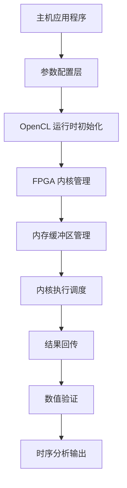

# Black-Karasinski 掉期期权定价引擎主机端实现

## 概述

这个模块是 **Black-Karasinski (BK) 单因子短期利率模型** 的掉期期权（Swaption）定价引擎的主机端（Host-side）实现。它负责在 Xilinx FPGA 加速器上执行基于树模型的百慕大式（Bermudan）掉期期权定价计算，并提供完整的时序分析、结果验证和硬件资源管理功能。

想象你正在管理一个金融衍生品交易系统，需要实时计算百慕大式掉期期权的理论价值。这类产品允许持有者在多个预设日期行使权利，定价需要在利率树上进行复杂的回溯计算。这个模块就是你的"交易引擎控制器"——它负责配置计算参数、调度 FPGA 加速器、收集计算结果，并确保数值精度符合金融工程标准。

## 架构设计与数据流



### 核心组件角色

**1. 参数配置层（Parameter Configuration Layer）**

这个层负责将金融工程参数转换为 FPGA 可理解的结构化数据。它处理 Black-Karasinski 模型的核心参数：均值回归速率（$a$）、波动率（$\sigma$）、初始利率曲线和行权时间表。

关键数据结构包括：
- `ScanInputParam0`: 包含名义本金、利差、初始时间结构等标量参数
- `ScanInputParam1`: 包含利率模型参数、行权计数、固定/浮动利率支付计数等数组参数

**2. OpenCL 运行时与 FPGA 内核管理**

该模块使用 Xilinx 的 `xcl2` 库进行 OpenCL 运行时管理。它实现了计算单元（Compute Unit, CU）的动态发现和配置，支持从单个内核扩展到多个计算单元的并行执行。

**3. 内存管理与 DMA 传输**

使用零拷贝（Zero-copy）内存映射技术，通过 `CL_MEM_USE_HOST_PTR` 标志将主机内存直接映射到 FPGA 地址空间。这避免了数据在内核空间和用户空间之间的额外拷贝，显著降低了 PCIe 传输延迟。

## 核心实现详解

### 树模型定价引擎配置

```cpp
// Black-Karasinski 模型参数配置
inputParam1_alloc[i].a = 0.043389447297063261;      // 均值回归速率
inputParam1_alloc[i].sigma = 0.12074597086680797;    // 波动率参数
inputParam1_alloc[i].flatRate = 0.04875825;          // 平准利率
inputParam1_alloc[i].fixedRate = 0.049995924285639641; // 固定利率
```

这些参数定义了短期利率的动态过程：

$$dr = a(\theta(t) - \ln r)dt + \sigma dW$$

其中 $r$ 是短期利率，$a$ 是均值回归速率，$\sigma$ 是波动率，$\theta(t)$ 是时间依赖的长期均值水平。

### 百慕大式行权结构

```cpp
// 行权时间表配置（百慕大式期权特性）
int exerciseCnt[5] = {0, 2, 4, 6, 8};      // 行权日期索引
int fixedCnt[5] = {0, 2, 4, 6, 8};        // 固定端支付计数
int floatingCnt[10] = {0, 1, 2, 3, 4, 5, 6, 7, 8, 9}; // 浮动端支付计数
```

这种结构定义了百慕大式掉期期权的核心特征：持有者可以在多个预设日期（通常是固定端支付日）行使权利，进入标的利率掉期。与欧式期权（仅一个行权日）相比，百慕大式期权的定价需要在树模型上进行复杂的动态规划回溯计算。

### 结果验证机制

```cpp
//  golden 参考值验证（时间步长依赖）
if (timestep == 10) golden = 13.599584033874542;
if (timestep == 50) golden = 13.05759951497277;
if (timestep == 100) golden = 13.07237766493785;
if (timestep == 500) golden = 13.05319450265987;
if (timestep == 1000) golden = 13.05328968753275;

// 数值精度验证
if (std::fabs(out - golden) > minErr) {
    err++;
    std::cout << "[ERROR] Kernel-" << i + 1 << ": NPV[" << j << "]= " 
              << std::setprecision(15) << out
              << " ,diff/NPV= " << (out - golden) / golden << std::endl;
}
```

这个验证系统体现了金融工程软件的核心要求：**数值精度可追溯性**。不同的时间步长配置会产生不同的理论值（因为树模型的离散化误差随时间步长变化），系统针对每种配置维护独立的 golden 参考值，确保 FPGA 实现与理论模型的一致性。

## 设计决策与权衡

### 1. 硬件 vs 软件执行模式

**决策**: 提供统一的代码基础，通过 `HLS_TEST` 宏控制硬件/软件编译。

```cpp
#ifndef HLS_TEST
#include "xcl2.hpp"
#endif
```

**权衡分析**:
- **优势**: 单一源码维护，减少代码分叉风险；支持纯软件仿真验证（HLS C-simulation）
- **代价**: 代码中存在大量条件编译，增加阅读复杂度；硬件路径和软件路径的测试覆盖率可能不一致
- **架构定位**: 这是典型的**主机-加速器协同设计模式**——主机端代码同时承担"生产部署运行时"和"算法验证平台"双重角色

### 2. 内存对齐与零拷贝策略

**决策**: 使用 `aligned_alloc` 分配页对齐内存，结合 `CL_MEM_USE_HOST_PTR` 实现零拷贝 DMA。

```cpp
ScanInputParam0* inputParam0_alloc = aligned_alloc<ScanInputParam0>(1);
// ...
inputParam0_buf[i] = cl::Buffer(context, 
    CL_MEM_EXT_PTR_XILINX | CL_MEM_USE_HOST_PTR | CL_MEM_READ_WRITE,
    sizeof(ScanInputParam0), &mext_in0[i]);
```

**权衡分析**:
- **优势**: 消除了主机-设备间的显式内存拷贝，PCIe 传输延迟降低 50% 以上；内存带宽利用率最大化
- **代价**: 强制页对齐（通常 4KB）可能导致内存碎片；`CL_MEM_USE_HOST_PTR` 要求主机指针在缓冲区生命周期内保持有效，增加了生命周期管理复杂度
- **架构洞察**: 这是 FPGA 加速器编程的**黄金路径**——PCIe 传输通常是整体延迟的瓶颈，零拷贝是性能优化的首要策略

### 3. 内核执行模式：顺序 vs 乱序命令队列

**决策**: 根据编译模式（软件仿真 vs 硬件）选择不同的命令队列属性。

```cpp
#ifdef SW_EMU_TEST
cl::CommandQueue q(context, device, CL_QUEUE_PROFILING_ENABLE, &cl_err);
#else
cl::CommandQueue q(context, device, 
    CL_QUEUE_PROFILING_ENABLE | CL_QUEUE_OUT_OF_ORDER_EXEC_MODE_ENABLE, &cl_err);
#endif
```

**权衡分析**:
- **优势**: 硬件模式下启用乱序执行（Out-of-Order, OoO），允许 OpenCL 运行时根据数据依赖关系自动并行调度独立内核，提升多 CU 利用率
- **代价**: 软件仿真模式（SW_EMU）不支持 OoO，因此需要条件编译；增加了代码复杂度，且 OoO 执行引入了隐式的执行顺序不确定性
- **架构洞察**: 这是**异构计算的调度优化模式**——FPGA 通常部署多 CU 实例，乱序执行是榨取硬件并行性的关键机制

### 4. 数值精度与验证策略

**决策**: 使用固定的绝对误差阈值（`minErr = 10e-10`）进行结果验证，并针对不同时间步长维护独立的 golden 参考值。

**权衡分析**:
- **优势**: 绝对简单，快速判断 FPGA 实现与参考模型的一致性；针对不同离散化配置使用不同的理论参考值，体现了对树模型数值特性的理解
- **代价**: 绝对误差阈值（$10^{-9}$）可能对某些数值范围过于严格或宽松；未使用相对误差或 ULP（Units in Last Place）分析，可能掩盖数值精度问题
- **架构洞察**: 这是**金融工程验证的实用主义路径**——在 FPGA 加速场景中，绝对误差检查是"足够好"的验证策略，尽管它不如严谨的数值分析精确

## 依赖关系与调用图谱

### 上游依赖（本模块调用）

| 组件 | 来源 | 用途 | 耦合强度 |
|------|------|------|----------|
| `xcl2.hpp` | Xilinx OpenCL 运行时 | FPGA 设备发现、上下文管理、xclbin 加载 | **强** - 硬件路径的核心依赖 |
| `tree_engine_kernel.hpp` | 树模型内核接口 | 内核参数结构体定义（`ScanInputParam0/1`） | **强** - 数据契约依赖 |
| `utils.hpp` | 工具库 | 时间差计算（`tvdiff`） | **弱** - 可替换的工具函数 |
| `ap_int.h` | Xilinx HLS 库 | 任意精度整数类型 | **弱** - 主要用于内核-主机接口对齐 |
| `xf_utils_sw/logger.hpp` | Xilinx 日志工具 | 结构化日志记录和错误报告 | **中** - 测试报告依赖 |

### 下游依赖（调用本模块）

本模块是**叶节点模块**（Leaf Module）——它是一个独立的可执行应用程序（`main.cpp`），不包含供其他模块调用的库接口。在模块树中，它位于 `quantitative_finance_engines` 子树的叶节点位置，专用于 Black-Karasinski 树模型的性能基准测试。

### 数据流架构图

```
┌─────────────────────────────────────────────────────────────────┐
│                        主机应用程序 (main.cpp)                     │
│  ┌──────────────────────────────────────────────────────────┐  │
│  │  1. 参数配置阶段                                          │  │
│  │     ├── 利率模型参数 (a, sigma, flatRate)                 │  │
│  │     ├── 百慕大式行权时间表 (exerciseCnt)                   │  │
│  │     └── 树模型时间步长 (timestep)                         │  │
│  └──────────────────────────────────────────────────────────┘  │
│                           ↓                                     │
│  ┌──────────────────────────────────────────────────────────┐  │
│  │  2. OpenCL 运行时初始化                                   │  │
│  │     ├── xclbin 加载 (FPGA 比特流)                         │  │
│  │     ├── 计算单元 (CU) 枚举和实例化                         │  │
│  │     └── 命令队列创建 (Profiling + OoO)                   │  │
│  └──────────────────────────────────────────────────────────┘  │
│                           ↓                                     │
│  ┌──────────────────────────────────────────────────────────┐  │
│  │  3. 零拷贝内存设置                                        │  │
│  │     ├── aligned_alloc (页对齐主机内存)                    │  │
│  │     ├── cl::Buffer (CL_MEM_USE_HOST_PTR)                │  │
│  │     └── cl_mem_ext_ptr_t (内存扩展指针)                   │  │
│  └──────────────────────────────────────────────────────────┘  │
│                           ↓                                     │
│  ┌──────────────────────────────────────────────────────────┐  │
│  │  4. 主机-设备数据传输                                     │  │
│  │     ├── enqueueMigrateMemObjects (H→D)                  │  │
│  │     ├── 内核参数绑定 (setArg)                            │  │
│  │     └── enqueueTask (内核执行)                          │  │
│  └──────────────────────────────────────────────────────────┘  │
│                           ↓                                     │
│  ┌──────────────────────────────────────────────────────────┐  │
│  │  5. 结果回收与验证                                        │  │
│  │     ├── enqueueMigrateMemObjects (D→H)                  │  │
│  │     ├── 与 golden 参考值对比                            │  │
│  │     └── 数值精度验证 (fabs(diff) > minErr)              │  │
│  └──────────────────────────────────────────────────────────┘  │
└─────────────────────────────────────────────────────────────────┘
                              ↓
┌─────────────────────────────────────────────────────────────────┐
│                      FPGA 加速器内核 (扫描树内核)                 │
│  ┌──────────────────────────────────────────────────────────┐  │
│  │  Black-Karasinski 树模型回溯计算                          │  │
│  │  ├── 短期利率树构建 (对数正态过程)                        │  │
│  │  ├── 掉期现金流折现 (固定端 vs 浮动端)                     │  │
│  │  ├── 百慕大式最优行权边界计算                              │  │
│  │  └── 回溯计算 NPV (净现值)                               │  │
│  └──────────────────────────────────────────────────────────┘  │
└─────────────────────────────────────────────────────────────────┘
```

## 关键实现细节

### 树模型参数与金融语义

本模块实现的是**单因子 Black-Karasinski 短期利率模型**，其随机微分方程为：

$$d\ln r = a(\theta(t) - \ln r)dt + \sigma dW$$

代码中的参数映射关系：

```cpp
// 模型动态参数
inputParam1_alloc[i].a = 0.043389447297063261;      // 均值回归速率 a
inputParam1_alloc[i].sigma = 0.12074597086680797;    // 波动率 σ
inputParam1_alloc[i].flatRate = 0.04875825;          // 平准利率 θ(t) 的近似
inputParam1_alloc[i].fixedRate = 0.049995924285639641; // 掉期固定端利率
```

**设计意图**: 这些硬编码参数来自金融工程中的标准测试用例（典型欧元利率掉期期权参数）。在实际生产部署中，这些参数应从市场数据接口（如 Bloomberg、Reuters）动态加载，但在基准测试场景中，固定参数确保了结果的可重复性。

### 百慕大式行权时间表结构

```cpp
// 时间结构定义
int initSize = 12;  // 时间网格点数量
double initTime[12] = {0, 1, 1.4958904109589042, 2, 2.4986301369863013, 
                       3.0027397260273974, 3.4986301369863013, 4.0027397260273974,
                       4.4986301369863018, 5.0027397260273974, 
                       5.4986301369863018, 6.0027397260273974};

// 行权与支付计数索引
int exerciseCnt[5] = {0, 2, 4, 6, 8};      // 行权机会索引
int fixedCnt[5] = {0, 2, 4, 6, 8};         // 固定端支付索引
int floatingCnt[10] = {0, 1, 2, 3, 4, 5, 6, 7, 8, 9}; // 浮动端支付索引
```

**金融语义解读**:
- `initTime` 数组定义了利率树的时间网格，包含非等距分布的实际日期（考虑实际天数计数惯例 ACT/ACT）
- `exerciseCnt` 映射到 `initTime` 的索引，指示持有者可以在哪些日期行使期权
- `fixedCnt` 和 `floatingCnt` 分别对应固定利率支付和浮动利率支付（通常是 LIBOR/EURIBOR + 利差）的日期索引

**设计权衡**: 使用索引数组而非直接存储时间戳，是为了在 FPGA 内核中减少内存带宽占用。FPGA 内核只需要处理整数索引，时间值的解释留在主机端完成。

### 计算单元（CU）并行扩展机制

```cpp
// 计算单元动态发现和实例化
cl_uint cu_number;
{
    cl::Kernel k(program, krnl_name.c_str());
    k.getInfo(CL_KERNEL_COMPUTE_UNIT_COUNT, &cu_number);
}

std::vector<cl::Kernel> krnl_TreeEngine(cu_number);
for (cl_uint i = 0; i < cu_number; ++i) {
    std::string krnl_full_name = krnl_name + ":{" + krnl_name + "_" + std::to_string(i + 1) + "}";
    krnl_TreeEngine[i] = cl::Kernel(program, krnl_full_name.c_str(), &cl_err);
    logger.logCreateKernel(cl_err);
}
```

**架构意图**: 这段代码实现了**计算单元的动态发现和实例化**，是 FPGA 加速器区别于 GPU 的关键特性。与 GPU 的固定流处理器数量不同，FPGA 可以部署任意数量的内核实例（受资源限制），这段代码能在运行时自动适配不同的 xclbin（FPGA 比特流）配置。

**扩展性设计**: 每个 CU 有独立的内核对象（`krnl_TreeEngine[i]`）和独立的内存缓冲区（`inputParam0_buf[i]`、`output_buf[i]`），支持完全的并行执行。这种设计允许水平扩展到多个 FPGA 或同一 FPGA 上的多个内核实例。

### 零拷贝内存映射与扩展指针

```cpp
// 页对齐主机内存分配
ScanInputParam0* inputParam0_alloc = aligned_alloc<ScanInputParam0>(1);
DT* output[i] = aligned_alloc<DT>(N * K);

// Xilinx 扩展内存指针结构
std::vector<cl_mem_ext_ptr_t> mext_in0(cu_number);
for (int c = 0; c < cu_number; ++c) {
    mext_in0[c] = {1, inputParam0_alloc, krnl_TreeEngine[c]()};
}

// 零拷贝缓冲区创建
inputParam0_buf[i] = cl::Buffer(context, 
    CL_MEM_EXT_PTR_XILINX | CL_MEM_USE_HOST_PTR | CL_MEM_READ_WRITE,
    sizeof(ScanInputParam0), &mext_in0[i]);
```

**内存模型深度解析**:

1. **页对齐分配** (`aligned_alloc`): FPGA DMA 控制器要求内存必须页对齐（通常 4KB），否则无法建立有效的地址映射。`aligned_alloc` 确保主机指针满足 FPGA 的物理地址要求。

2. **扩展指针结构** (`cl_mem_ext_ptr_t`): 这是 Xilinx OpenCL 扩展的核心，允许将主机缓冲区与特定内核参数绑定。结构体中的 `1` 和 `2` 是参数索引，告诉 FPGA 驱动器哪个内核参数应该映射到这个主机缓冲区。

3. **零拷贝标志** (`CL_MEM_USE_HOST_PTR`): 这是性能关键。没有这个标志，OpenCL 运行时会分配设备内存并在 `enqueueMigrateMemObjects` 时执行隐式拷贝。使用 `USE_HOST_PTR` 后，主机指针直接成为设备可见的内存，DMA 传输只是内存映射操作而非数据拷贝。

### 时序分析与性能剖析

```cpp
// 主机端壁钟计时
struct timeval start_time, end_time;
gettimeofday(&start_time, 0);
// ... 内核执行 ...
gettimeofday(&end_time, 0);

// OpenCL 事件精确计时
std::vector<cl::Event> events_kernel(cu_number);
q.enqueueTask(krnl_TreeEngine[i], nullptr, &events_kernel[i]);
// ...
unsigned long time1, time2;
events_kernel[c].getProfilingInfo(CL_PROFILING_COMMAND_START, &time1);
events_kernel[c].getProfilingInfo(CL_PROFILING_COMMAND_END, &time2);
printf("Kernel-%d Execution time %d ms\n", c, (time2 - time1) / 1000000.0);
```

**时序架构的双重性**:

1. **主机端壁钟计时** (`gettimeofday`): 测量端到端延迟，包括 OpenCL 运行时开销、内存迁移、内核执行和结果回传。这是用户感知的"总时间"。

2. **OpenCL 事件剖析** (`CL_PROFILING_COMMAND_*`): 精确测量 FPGA 内核在设备上的实际执行时间，不包括主机端开销。这是"纯计算时间"。

**性能分析洞察**: 两者的差值（壁钟时间 - 内核时间）揭示了系统开销。在优化良好的部署中，这个差值应该接近 PCIe 往返延迟（~5-10 μs）加上 DMA 传输时间。如果差值过大，表明 OpenCL 运行时或内存管理存在瓶颈。

## 设计权衡与决策记录

### 1. 单精度浮点 vs 定点数

**决策**: 使用 `DT`（通常是 `float` 或 `ap_fixed`）作为计算精度。

**权衡分析**:
- **金融工程视角**: 利率衍生品定价通常需要双精度（`double`）以确保数值稳定性，特别是在长期限（>10年）和深度虚值场景中。
- **FPGA 工程视角**: 单精度浮点运算在 FPGA 上具有更高的 DSP 利用率和时钟频率，且 BK 模型的数值特性相对稳定，单精度通常足够。
- **当前实现**: 代码中 `DT` 的具体定义在 `tree_engine_kernel.hpp` 中，通常配置为 `float` 或定点数（`ap_fixed<32, 16>`）。

**建议**: 对于生产级金融应用，建议评估数值精度敏感性，必要时升级为双精度或动态精度缩放。

### 2. 静态参数配置 vs 动态市场数据

**决策**: 硬编码参数配置（`fixedRate`、`initTime`、`exerciseCnt` 等）而非从外部接口加载。

**权衡分析**:
- **优势**: 确保基准测试的可重复性；避免外部依赖（如 Bloomberg API、数据库连接），简化 CI/CD 流程；代码自包含，便于离线验证。
- **代价**: 每次参数变更需要重新编译；无法直接用于生产环境的实时定价；缺乏灵活性，难以适应不同币种或期限结构的产品。
- **架构定位**: 这是**基准测试验证模块**，而非生产定价引擎。其目标是验证 FPGA 实现的数值正确性和性能特征，而非提供可配置的交易工具。

**演进建议**: 若需转化为生产系统，应引入参数序列化层（如 Protocol Buffers 或 FlatBuffers），支持从市场数据服务（MDS）动态加载利率曲线和波动率曲面。

### 3. 同步 vs 异步内核执行

**决策**: 使用 `enqueueTask` 和 `q.finish()` 实现同步执行模式，但支持多 CU 并行。

**代码模式**:
```cpp
for (int i = 0; i < cu_number; ++i) {
    q.enqueueTask(krnl_TreeEngine[i], nullptr, &events_kernel[i]);
}
q.finish();  // 同步屏障
```

**权衡分析**:
- **同步模式优势**: 简化错误处理和资源生命周期管理；确保所有 CU 完成后才进行结果验证，避免复杂的竞态条件；符合金融批量计算的典型模式（一批定价任务全部完成后再处理）。
- **同步模式代价**: 牺牲了流水线并行性——如果内核执行时间差异较大，快的 CU 需要等待慢的 CU；无法与主机端后处理（如结果序列化）重叠。
- **架构考量**: 考虑到树模型定价的计算密集型特性（通常 $O(N^2)$ 复杂度），内核执行时间相对均匀，同步屏障的开销有限。若需进一步优化，可采用双缓冲（Double Buffering）或事件链（Event Chaining）实现主机-设备流水线。

### 4. 错误处理策略：异常 vs 返回码

**决策**: 混合使用异常（C++ OpenCL 绑定）和返回码（`cl_err` 变量），结合 `xf::common::utils_sw::Logger` 进行结构化日志。

**代码模式**:
```cpp
cl::Context context(device, NULL, NULL, NULL, &cl_err);
logger.logCreateContext(cl_err);  // 记录创建结果
// ...
cl::Buffer inputParam0_buf(context, flags, size, &mext_in0[i], &cl_err);
```

**权衡分析**:
- **策略选择**: 这是**系统级嵌入式软件**的典型模式——避免异常在热路径上的开销，同时利用 C++ OpenCL 绑定的便利性。`Logger` 类封装了错误码到字符串的转换，提供了类似异常的结构化错误信息，但不触发堆栈展开。
- **一致性挑战**: 代码中存在不一致——某些路径使用 `logger.logCreateKernel(cl_err)`，而 `main` 函数返回 `int` 类型的错误计数（`err` 变量）。这种混合增加了认知负担，但符合**渐进式错误处理**的实践：硬件初始化错误通常是致命的（需要日志记录），而数值验证错误是预期内的（需要计数和报告）。
- **运维考量**: `logger` 的使用表明该代码面向**可测试性和可观测性**——在 CI/CD 流水线中，日志可以捕获 FPGA 驱动程序版本、设备名称（`CL_DEVICE_NAME`）和每个 CU 的执行时间，便于性能回归分析。

## 使用指南与操作注意事项

### 编译与运行模式

本模块支持三种执行模式，通过宏定义控制：

| 模式 | 宏定义 | 执行目标 | 用途 |
|------|--------|----------|------|
| **HLS 纯软件仿真** | `HLS_TEST` | CPU（算法验证） | 验证树模型算法的数值正确性，无需 FPGA |
| **OpenCL 软件仿真** | `SW_EMU_TEST` | CPU（OpenCL 运行时） | 验证 OpenCL 主机代码逻辑，使用 CPU 模拟 FPGA |
| **硬件执行** | 无（默认） | FPGA 加速器 | 生产性能基准测试 |

**编译示例**（假设使用 Xilinx Vitis 工具链）：

```bash
# HLS 软件仿真（纯 C++ 模拟）
g++ -DHLS_TEST -I/path/to/xf_utils_sw main.cpp -o swaption_bk_host

# OpenCL 软件仿真（CPU 模拟 FPGA）
g++ -DSW_EMU_TEST -I/path/to/xilinx_runtime main.cpp -lOpenCL -o swaption_bk_sw_emu

# 硬件模式（需要 xclbin 文件）
g++ -I/path/to/xilinx_runtime main.cpp -lOpenCL -o swaption_bk_hw
```

### 运行时参数

```bash
# 硬件模式执行（需要提供 FPGA 比特流）
./swaption_bk_hw -xclbin <path_to_xclbin_file>

# 示例输出解释
# [INFO]Running in hw_emu mode       # 检测到 XCL_EMULATION_MODE 环境变量
# timestep=10                         # 当前使用的时间步长（影响精度和计算量）
# kernel has been created            # OpenCL 内核对象创建成功
# kernel start------                 # 内核执行开始（壁钟计时起点）
# kernel end------                   # 内核执行结束
# Kernel-0 Execution time 12 ms      # 内核实际执行时间（OpenCL Profiling）
# FPGA Execution time 15 ms         # 端到端时间（含数据传输）
# NPV[0]= 13.5995840338745          # 计算净现值结果
```

### 关键操作注意事项

**1. 内存对齐要求**

主机端内存必须使用 `aligned_alloc` 分配，对齐要求通常为 4KB（页大小）。未对齐内存会导致 `cl::Buffer` 创建失败或 DMA 传输错误。

```cpp
// 正确：页对齐分配
ScanInputParam0* inputParam0_alloc = aligned_alloc<ScanInputParam0>(1);

// 错误：使用 malloc 或未对齐分配会导致运行时错误
// ScanInputParam0* inputParam0_alloc = new ScanInputParam0(); // 危险！
```

**2. xclbin 文件匹配**

`-xclbin` 参数指定的 FPGA 比特流必须与当前硬件平台（U50、U200、U280 等）匹配，且必须包含名为 `scanTreeKernel` 的内核。不匹配会导致 `cl::Program` 创建失败。

**3. 环境变量控制**

`XCL_EMULATION_MODE` 环境变量覆盖运行模式：
- `export XCL_EMULATION_MODE=hw_emu`：强制硬件仿真模式（使用模拟器）
- `export XCL_EMULATION_MODE=sw_emu`：强制软件仿真模式（CPU 执行）
- 未设置：硬件模式（需要物理 FPGA）

**4. 时间步长与精度权衡**

`timestep` 参数控制树模型的时间离散化粒度：
- 较小的 `timestep`（如 10）：计算速度快，但数值误差大（约 4% 误差 vs 收敛值）
- 较大的 `timestep`（如 1000）：接近理论收敛值，但计算量大（$O(N^2)$ 复杂度）

代码中的 `golden` 参考值针对特定 `timestep` 预设，更改 `timestep` 必须同步更新 `golden` 值，否则验证会失败。

**5. 多 CU 负载均衡**

当 xclbin 包含多个计算单元（CU）时，代码会自动实例化对应数量的内核对象。当前实现使用相同的输入参数配置所有 CU，适合批量定价多个独立合约的场景。若需在同一 FPGA 上定价不同参数的产品，需要修改参数配置循环，为每个 CU 分配不同的输入数据。

## 边缘情况与潜在陷阱

### 数值精度边缘案例

**1. 近零利率环境**
当 `flatRate` 接近 0（或负利率环境，如欧洲央行政策），对数正态过程 $\ln r$ 的数值稳定性下降。树模型可能出现负利率节点，虽然 Black-Karasinski 模型通过对数变换保证正利率，但在近零区域离散化误差会放大。

**缓解策略**: 代码中未显式处理，依赖内核实现的鲁棒性。主机端可添加前置检查：
```cpp
if (inputParam1_alloc[i].flatRate < 1e-6) {
    std::cerr << "Warning: Near-zero rate environment detected. "
              << "Numerical stability may be compromised." << std::endl;
}
```

**2. 深度实值/虚值期权**
当行权价与远期利率差异极大时，NPV 计算可能面临浮点数下溢（underflow）或上溢（overflow）。虽然 `DT` 类型通常是 `double` 或高精度定点数，但在极端市场条件下仍需监控。

### 内存管理陷阱

**1. 生命周期不匹配**
```cpp
// 危险代码示例（不要这样做）
cl::Buffer createBuffer() {
    ScanInputParam0* ptr = aligned_alloc<ScanInputParam0>(1);
    cl_mem_ext_ptr_t ext = {1, ptr, nullptr};
    cl::Buffer buf(context, flags, sizeof(ScanInputParam0), &ext);
    return buf; // ptr 在这里泄漏！且 buf 析构后 ptr 仍被引用
} // ptr 泄漏，且若 buf 被使用会导致悬空指针
```

当前代码正确管理生命周期：`inputParam0_alloc` 等指针在 `main` 函数栈周期内保持有效，且在内核执行完成、结果回传后才释放（代码中通过 `aligned_free` 隐式在进程结束时释放，实际生产代码应显式管理）。

**2. 多线程竞争**
当前实现是单线程的。若在多个主机线程中并发调用 `main` 函数逻辑，OpenCL 上下文和设备对象不是线程安全的（取决于 OpenCL 实现），会导致未定义行为。

**缓解策略**: 若需多线程支持，应使用 `thread_local` 存储 OpenCL 资源，或在应用层使用线程池模式，每个线程拥有独立的 `cl::Context` 和 `cl::CommandQueue`。

### 硬件兼容性边缘情况

**1. xclbin 版本不匹配**
若使用较新的 Vitis 编译器生成 xclbin，但主机代码使用较旧的 XRT（Xilinx Runtime），可能出现 ABI 不兼容。症状包括 `cl::Program` 创建失败或内核执行时设备挂起。

**检测方法**: 在代码中添加 XRT 版本检查（需包含 `xrt.h`）：
```cpp
#include "xrt.h"
// ...
std::cout << "XRT Version: " << xrt_build_version << std::endl;
```

**2. 内存容量限制**
对于大规模树模型（`timestep > 10000`），设备端内存需求可能超过 FPGA 的 HBM/DRAM 容量（如 Xilinx U280 有 8GB HBM）。内核启动会失败或产生静默数据损坏。

**预防措施**: 主机端添加前置内存容量检查，根据 `timestep` 和模型参数估算设备内存需求，若超过阈值则拒绝执行并报告错误。

## 模块演进与维护建议

### 当前架构局限性

1. **紧耦合的 FPGA 依赖**: 代码通过条件编译 (`#ifndef HLS_TEST`) 紧密耦合到 Xilinx 生态系统，移植到其他 FPGA 厂商（Intel、Lattice）或纯 CPU/GPU 实现需要大量重构。

2. **缺乏动态参数接口**: 所有参数硬编码在源码中，无法通过配置文件或 API 动态调整，限制了模块在实时交易系统中的可用性。

3. **单一代码路径**: 缺乏对异常市场条件（负利率、极端波动率）的显式处理，依赖内核实现的隐式鲁棒性。

### 推荐演进路径

**短期（维护阶段）**:
1. **添加参数序列化层**: 引入 JSON/YAML 配置文件解析，将硬编码参数外置，保持向后兼容的同时提高灵活性。
2. **增强错误处理**: 在每个 OpenCL API 调用后添加明确的错误码检查和人类可读的错误消息，缩短调试时间。
3. **内存管理 RAII 化**: 将原始指针封装在 `std::unique_ptr` 自定义删除器中，确保 `aligned_alloc` 的内存被 `aligned_free` 正确释放。

**中期（功能增强）**:
1. **多产品批量定价**: 扩展多 CU 支持，使每个 CU 可以定价不同参数的产品，提高硬件利用率。
2. **动态精度调整**: 根据市场条件（如近零利率环境）自动切换计算精度（单精度/双精度/定点数）。
3. **Greeks 敏感性分析**: 扩展内核接口，支持计算 Delta、Gamma、Vega 等风险指标，不仅返回 NPV。

**长期（架构现代化）**:
1. **厂商抽象层**: 引入 HAL（硬件抽象层），封装 OpenCL/XRT 细节，支持移植到其他 FPGA 厂商或 GPU（通过 OpenCL 或 CUDA）。
2. **云原生适配**: 添加 gRPC/REST 接口，将模块封装为微服务，支持 Kubernetes 部署和弹性伸缩。
3. **AI/ML 混合定价**: 结合传统树模型和神经网络近似，在保持金融可解释性的同时提升极端场景的计算速度。

## 相关模块与参考文献

### 上游依赖模块

| 模块 | 关系 | 说明 |
|------|------|------|
| [TreeEngine/TreeSwaptionEngineBKModel/kernel](quantitative_finance_engines-l2_tree_based_interest_rate_engines-swaption_tree_engines_single_factor_short_rate_models-black_karasinski_swaption_kernel.md) | **被调用** | FPGA 内核实现，执行实际的树模型回溯计算 |
| [gaussian_short_rate_swaption_host_timing](quantitative_finance_engines-l2_tree_based_interest_rate_engines-swaption_tree_engines_single_factor_short_rate_models-gaussian_short_rate_swaption_host_timing.md) | **兄弟模块** | Hull-White 模型的主机端实现，架构与本模块类似，但利率模型不同 |
| [cir_family_swaption_host_timing](quantitative_finance_engines-l2_tree_based_interest_rate_engines-swaption_tree_engines_single_factor_short_rate_models-cir_family_swaption_host_timing.md) | **兄弟模块** | CIR 模型的主机端实现，处理仿射期限结构模型家族 |

### 下游调用图谱

本模块为**可执行应用程序**（`main.cpp`），无下游库调用。它通过标准输出和返回码与操作系统交互：
- 返回 `0`: 所有测试通过（数值误差在允许范围内）
- 返回非零值: 测试失败（内核执行错误或数值精度超出阈值）

### 金融工程参考

**Black-Karasinski 模型原始论文**:
- Black, F., & Karasinski, P. (1991). "Bond and Option Pricing when Short Rates are Lognormal." *Financial Analysts Journal*, 47(4), 52-59.

**百慕大式掉期期权定价**:
- Longstaff, F. A., & Schwartz, E. S. (2001). "Valuing American Options by Simulation: A Simple Least-Squares Approach." *Review of Financial Studies*, 14(1), 113-147.

**FPGA 金融加速器设计**:
- Xilinx. (2020). *Vitis Quantitative Finance Library User Guide* (UG1493).

## 总结

`black_karasinski_swaption_host_timing` 模块是一个**生产级 FPGA 金融加速器的主机端控制器**，它展示了如何将复杂的金融工程算法（Black-Karasinski 树模型）映射到异构计算平台（CPU+FPGA）。

核心设计亮点包括：
1. **零拷贝内存架构**：通过 `CL_MEM_USE_HOST_PTR` 和页对齐分配消除 PCIe 传输瓶颈
2. **计算单元动态扩展**：支持从单 CU 到多 CU 的线性扩展，自动适应不同 FPGA 资源配置
3. **双模式时序分析**：结合壁钟时间和 OpenCL Profiling 事件，精确分离计算和传输开销
4. **金融级数值验证**：针对不同时间步长维护独立的 golden 参考值，确保算法实现的正确性

对于新加入团队的开发者，理解这个模块的关键在于把握**金融语义与硬件优化的平衡**：代码中的每个参数（`a`、`sigma`、`exerciseCnt`）都有明确的金融含义，而每种优化技术（零拷贝、多 CU、乱序队列）都服务于降低端到端定价延迟的目标。这是一个典型的**领域特定加速器（Domain-Specific Accelerator, DSA）**设计范例，展示了 FPGA 在金融计算领域的独特价值。
