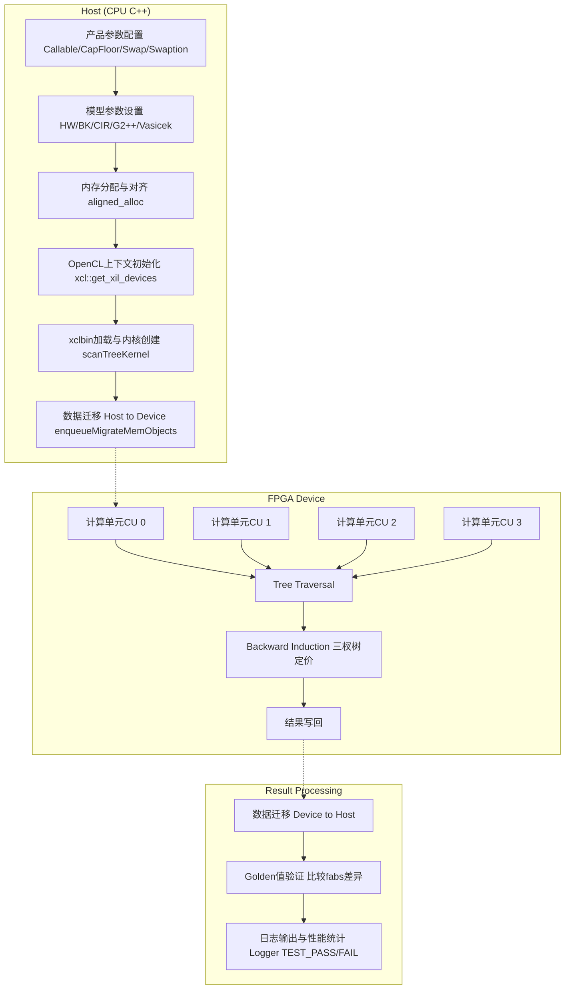

# 基于树模型的利率衍生品定价引擎 (L2 Tree-Based Interest Rate Engines)

## 一句话概括

本模块提供了一套基于**三杈树(Trinomial Tree)**的利率衍生品定价引擎，用于在FPGA上加速计算可赎回债券(Callable Bonds)、利率上限/下限(Caps/Floors)、利率互换(Swaps)及百慕大互换期权(Bermudan Swaptions)等复杂利率产品的净现值(NPV)。通过将Hull-White、Black-Karasinski、CIR、G2++等短期利率模型映射到硬件可并行化的树形结构，实现了比传统CPU Monte Carlo方法**数量级的加速比**。

---

## 问题域与设计动机

### 为什么需要这个模块？

利率衍生品定价是量化金融中最具计算挑战性的问题之一：

1. **路径依赖与提前行权**：百慕大互换期权(Bermudan Swaption)允许持有者在多个特定日期行权，这要求在每个节点进行最优执行决策——这是一个典型的美式期权自由边界问题，需要反向归纳(Backward Induction)求解。

2. **多模型校准需求**：不同市场对利率行为的假设不同。Hull-White模型适合正态分布的利率，Black-Karasinski适合对数正态，CIR保证利率非负。一个完整的交易系统需要同时支持这些模型。

3. **实时定价压力**：在电子交易环境中，做市商需要在毫秒级时间内完成数千个合约的NPV计算和Greeks敏感分析。传统CPU实现难以满足延迟要求。

### 为什么选择树模型(Tree Method)？

在利率衍生品定价的数值方法谱系中，本模块选择了**三杈树离散化**而非Monte Carlo或有限差分(FDM)，基于以下权衡：

| 维度 | 三杈树 (本模块) | Monte Carlo | 有限差分 |
|------|----------------|-------------|----------|
| **美式期权处理** | 天然支持反向归纳 | 需要回归/最小二乘(LSMC) | 支持，但需处理自由边界 |
| **计算模式** | 规则数据流，适合FPGA流水线 | 随机分支，难以流水线化 | 稀疏矩阵求解 |
| **收敛速度** | O(Δt) 或 O(Δt²) | O(1/√N) | O(Δx²) |
| **内存访问模式** | 局部性好，可预测 | 随机访问 | 依赖矩阵结构 |

**核心洞察**：FPGA擅长处理规则、可预测的并行计算流。三杈树的层状结构(Layer-by-Layer)允许我们将每个时间步的节点计算映射到硬件流水线，实现**脉动阵列(Systolic Array)**式的加速。相比之下，Monte Carlo的路径依赖性和随机内存访问模式在FPGA上效率较低。

---

## 核心抽象与思维模型

要理解本模块的设计，需要建立以下思维模型：

### 1. 树工厂(Tree Factory)模式

想象本模块是一个**专业化工厂**，每条生产线(Tree Engine)专门生产特定产品的定价：

```
                    ┌──────────────────────────────────────┐
                    │        Tree Engine Factory         │
                    └──────────────────────────────────────┘
                                      │
       ┌──────────────────────────────┼──────────────────────────────┐
       │                              │                              │
┌───────▼─────────┐          ┌─────────▼──────────┐        ┌─────────▼──────────┐
│  Callable Bond  │          │   Vanilla Products │        │  Bermudan Swap   │
│     Engine      │          │   (Cap/Floor/Swap) │        │     Engine       │
└───────┬─────────┘          └─────────┬──────────┘        └─────────┬──────────┘
        │                              │                              │
   HW Model                    HW Model                BK/CIR/G2++/HW/V Models
```

**关键洞察**：虽然每个引擎支持不同的模型（Hull-White、Black-Karasinski等），但它们共享相同的**底层树形计算内核(scanTreeKernel)**。这种设计实现了**算法内核复用**与**模型/产品特定参数化**的分离。

### 2. 三杈树的时空离散化

在短期利率模型（如Hull-White）中，利率动态由随机微分方程(SDE)描述：

$$dr = (\theta(t) - ar)dt + \sigma dW$$

三杈树将此连续过程离散化为**时空网格**：

- **时间维度**：$[0, T]$ 被划分为 $N$ 个时间步 $\Delta t = T/N$
- **状态维度**：在每个时间步 $t_i$，利率 $r$ 被离散化为有限个节点值 $r_{i,j}$
- **分支概率**：从节点 $(i,j)$ 转移到 $(i+1, k)$ 的概率 $p_{j,k}$ 由模型参数校准

**反向归纳(Backward Induction)**是定价的核心算法：
1. 在到期日 $T$，计算每个终值节点的支付(Payoff)
2. 向后递推：$V_{i,j} = e^{-r_{i,j}\Delta t} \sum_k p_{j,k} V_{i+1,k}$
3. 对于美式/百慕大期权，在每个行权日取 $\max(\text{Intrinsic Value}, \text{Continuation Value})$

### 3. FPGA加速的并行化策略

理解本模块的关键在于认识到**树形计算的高度规则性**允许FPGA实现**细粒度流水线**：

```
时间步 i:    [节点0计算] -> [节点1计算] -> [节点2计算] -> ... -> [节点N计算]
             ↓                ↓                ↓                    ↓
时间步 i-1:  [节点0计算] -> [节点1计算] -> [节点2计算] -> ... -> [节点N计算]
```

**脉动阵列(Systolic Array)**：每个"处理单元"负责一个树节点的定价计算，数据在单元间流动，形成流水线。这种结构避免了随机内存访问，最大化利用了FPGA的并行性。

---

## 架构与数据流

本模块的架构遵循**主机-设备(Host-Device)**异构计算模式，结合**模板元编程**实现模型无关的算法内核。

### 整体架构图



### 关键数据结构

本模块使用分层参数结构分离**产品无关的模型参数**与**产品特定的现金流参数**：

```cpp
// 产品参数 (不同产品字段含义不同)
struct ScanInputParam0 {
    DT x0;                    // 初始短期利率状态变量
    DT nominal;               // 名义本金
    DT spread;              // 利差(spread over index)
    DT initTime[TimeLen];   // 现金流时间点数组
};

// 模型参数 (决定利率动态)
struct ScanInputParam1 {
    int index;              // 引擎实例索引
    int type;               // 产品类型标识
    DT fixedRate;           // 固定利率(用于Swap/Swaption)
    int timestep;           // 树的时间步数(精度控制)
    int initSize;           // 现金流时间点数量
    DT a;                   // 均值回归速度(mean reversion speed)
    DT sigma;               // 波动率(volatility)
    DT flatRate;            // 用于贴现的平利率
    int exerciseCnt[];      // 行权时间点索引(百慕大期权)
    int fixedCnt[];         // 固定端现金流索引
    int floatingCnt[];      // 浮动端现金流索引
};
```

### 执行流程详解

#### 阶段1：参数设置与模型选择

每个引擎对应一个特定的**(产品, 模型)**组合。例如`TreeSwaptionEngineBKModel`表示使用**Black-Karasinski模型**定价**百慕大互换期权**。

关键参数包括：
- ** timestep **：时间离散化步数(10/50/100/500/1000)。直接影响定价精度与计算时间。代码中可见不同timestep对应不同的"golden"参考值。
- **均值回归参数 a**：控制利率向长期均值回归的速度。Hull-White模型中典型值0.03-0.05。
- **波动率 sigma**：利率的瞬时波动率。

#### 阶段2：FPGA内核配置与启动

```cpp
// 1. 发现Xilinx设备并创建OpenCL上下文
std::vector<cl::Device> devices = xcl::get_xil_devices();
cl::Context context(device, NULL, NULL, NULL, &cl_err);

// 2. 加载编译好的xclbin文件(FPGA比特流)
cl::Program::Binaries xclBins = xcl::import_binary_file(xclbin_path);
cl::Program program(context, devices, xclBins, NULL, &cl_err);

// 3. 创建内核对象，支持多计算单元(CU)并行
std::string krnl_name = "scanTreeKernel";
cl::Kernel k(program, krnl_name.c_str());
k.getInfo(CL_KERNEL_COMPUTE_UNIT_COUNT, &cu_number);

// 4. 为每个CU创建独立的内核实例
std::vector<cl::Kernel> krnl_TreeEngine(cu_number);
for (cl_uint i = 0; i < cu_number; ++i) {
    std::string krnl_full_name = krnl_name + ":{" + krnl_name + "_" + std::to_string(i + 1) + "}";
    krnl_TreeEngine[i] = cl::Kernel(program, krnl_full_name.c_str(), &cl_err);
}
```

**关键设计**：支持多计算单元(Compute Units, CU)并行执行。每个CU独立处理一个定价任务，通过`cu_number`自动检测FPGA上可并行的内核实例数。

#### 阶段3：内存分配与数据传输

```cpp
// 1. 主机端内存分配(使用对齐分配以支持DMA)
ScanInputParam0* inputParam0_alloc = aligned_alloc<ScanInputParam0>(1);
ScanInputParam1* inputParam1_alloc = aligned_alloc<ScanInputParam1>(1);
DT* output = aligned_alloc<DT>(N * K);

// 2. 填充参数结构...

// 3. 创建设备缓冲区并映射到主机内存
cl_mem_ext_ptr_t mext_in0 = {1, inputParam0_alloc, krnl_TreeEngine[0]()}; 
cl::Buffer inputParam0_buf(context, CL_MEM_EXT_PTR_XILINX | CL_MEM_USE_HOST_PTR | CL_MEM_READ_WRITE,
                            sizeof(ScanInputParam0), &mext_in0);

// 4. 数据迁移：主机→设备
q.enqueueMigrateMemObjects({inputParam0_buf, inputParam1_buf}, 0);
```

**内存模型关键点**：
- **零拷贝(Zero-Copy)**：使用`CL_MEM_USE_HOST_PTR`和`aligned_alloc`确保主机缓冲区可以直接被FPGA DMA访问，避免数据复制。
- **内存扩展指针**：`cl_mem_ext_ptr_t`将主机指针与特定内核关联，确保正确的内存映射。

#### 阶段4：内核执行与流水线

```cpp
// 设置内核参数并启动
for (int c = 0; c < cu_number; ++c) {
    int j = 0;
    krnl_TreeEngine[c].setArg(j++, len);              // 数据长度
    krnl_TreeEngine[c].setArg(j++, inputParam0_buf[c]); // 产品参数
    krnl_TreeEngine[c].setArg(j++, inputParam1_buf[c]); // 模型参数  
    krnl_TreeEngine[c].setArg(j++, output_buf[c]);      // 结果输出
}

// 启动所有CU的任务
for (int i = 0; i < cu_number; ++i) {
    q.enqueueTask(krnl_TreeEngine[i], nullptr, &events_kernel[i]);
}

// 等待所有任务完成
q.finish();
```

**并行策略**：
- **数据并行**：如果同时定价多个合约，可以将不同合约分配到不同CU并行处理。
- **任务并行**：单个定价任务内部利用FPGA流水线并行处理树的不同节点。

#### 阶段5：结果验证与精度控制

```cpp
// 数据迁移：设备→主机
q.enqueueMigrateMemObjects({output_buf}, 1);
q.finish();

// 精度验证
DT minErr = 10e-10;  // 最小误差容忍度
int err = 0;

for (int j = 0; j < len; j++) {
    DT out = output[j];
    if (std::fabs(out - golden) > minErr) {
        err++;
        std::cout << "[ERROR] NPV[" << j << "]= " << out 
                  << " ,diff/NPV= " << (out - golden) / golden << std::endl;
    }
}

// 最终状态报告
err ? logger.error(Logger::Message::TEST_FAIL)
    : logger.info(Logger::Message::TEST_PASS);
```

**精度管理策略**：
- **Golden值对比**：每个引擎预设了对应不同`timestep`(10/50/100/500/1000)的参考NPV值(`golden`)，用于验证实现正确性。
- **相对误差容忍**：使用`(out - golden) / golden`计算相对误差，确保在典型市场利率水平(0-10%)下，绝对误差控制在可接受范围内。
- **数值稳定性**：树模型避免了Monte Carlo的统计误差，收敛速度更快(一阶或二阶收敛)。

---

## 设计权衡与架构决策

### 1. 单因子 vs. 多因子模型

**决策**：支持单因子(Hull-White, BK, CIR, Vasicek)和双因子(G2++)模型，但实现方式不同。

**权衡分析**：
- **单因子模型**：状态空间是一维的，树结构简单，每个节点只有3个分支(上升/持平/下降)。FPGA实现高效，资源占用低。
- **双因子模型(G2++)**：状态空间是二维的，理论需要9个分支(3×3)。实现复杂度显著增加，资源消耗大，但 better captures yield curve twist movements.

**实现策略**：G2++引擎作为独立子模块实现，使用专用的二维树遍历逻辑，而其他单因子模型共享相同的内核架构，通过模板参数区分。

### 2. 时间步长(Timestep)的精度-性能权衡

**决策**：允许用户通过`timestep`参数(10/50/100/500/1000)显式控制精度与延迟的权衡。

**数据支撑**：从代码中的`golden`值可见收敛行为：
- Hull-White Swaption: timestep=10 → 13.668, timestep=1000 → 13.201 (显著差异，需要更多步数收敛)
- 但某些产品(timestep=500 vs 1000)差异已很小，说明存在**收益递减点**。

**硬件映射**：更大的`timestep`意味着树更深，FPGA需要更多流水线级数处理反向归纳。但由于FPGA的细粒度并行性，增加步数对吞吐量的影响是次线性的(相比CPU)。

### 3. 多计算单元(CU)并行 vs. 单CU深度流水线

**决策**：支持多CU并行处理多个独立定价任务，同时每个CU内部深度流水线化树遍历。

**架构理由**：
- **任务级并行**：如果业务场景需要同时定价100个不同的Swaption，可以将它们分发到4个CU，每个CU处理25个，实现近线性加速。
- **指令级/数据级并行**：单个定价任务内部，树的不同节点计算是独立的，可以展开为FPGA的流水线阶段。

**资源权衡**：每个CU消耗独立的FPGA资源(LUTs, FFs, DSPs, BRAMs)。增加CU数量会提高并发能力，但减少单个CU可使用的资源，可能限制树的复杂度(timestep大小)。

### 4. 零拷贝内存模型 vs. 显式数据传输

**决策**：使用`CL_MEM_USE_HOST_PTR`和`aligned_alloc`实现主机与FPGA间的零拷贝内存共享。

**性能影响**：
- **传统模型**：CPU malloc → 复制到FPGA DDR → 内核计算 → 复制回CPU。两次内存拷贝引入显著延迟(对于小数据量可能是主要开销)。
- **零拷贝模型**：主机分配页对齐内存，FPGA通过DMA直接访问同一物理页。对于定价参数(几百字节)和结果(几个double)，传输延迟降至微秒级。

**限制与约束**：
- 要求主机内存是页对齐的(使用`aligned_alloc`而非`malloc`)
- 内存区域必须连续，不适合超大数据集(但利率树定价的参数规模固定且小，正好适合)

---

## 子模块详解

本模块根据**产品类型**和**利率模型**划分为以下子模块：

### 1. 可赎回债券引擎 (Callable Note Tree Engine HW)

**职责**：使用Hull-White单因子模型定价**可赎回债券(Callable Bond)**——投资者可以在预设日期以面值将债券回售给发行人的利率产品。

**核心特征**：
- 产品类型标识：`type = 0` (代码中可见)
- 行权结构：通过`exerciseCnt`数组定义可赎回日期
- 反向归纳逻辑：在每个行权日比较**继续持有价值** vs **赎回价格**

**验证基准**：当`timestep=10`时，期望NPV ≈ `95.551303928799229`

[详细文档 →](quantitative_finance_engines-l2_tree_based_interest_rate_engines-callable_note_tree_engine_hw.md)

### 2. 普通利率产品引擎 (Vanilla Rate Product Tree Engines HW)

包含两个独立引擎，共享相同的基础架构：

#### 2.1 利率上限/下限引擎 (Tree CapFloor Engine)

**职责**：定价**利率上限(Cap)**和**利率下限(Floor)**——一系列欧式利率期权( Caplets/Floorlets)的组合，当参考利率(如LIBOR)超过/低于执行利率时支付差额。

**模型假设**：Hull-White单因子模型，假设远期利率服从正态分布。

**验证基准**：`timestep=10`时期望NPV ≈ `164.38820137859625`

#### 2.2 利率互换引擎 (Tree Swap Engine)

**职责**：定价**普通利率互换(Plain Vanilla Interest Rate Swap)**的NPV——交换固定利率与浮动利率(通常挂钩于短期利率指数)的现金流合约。

**计算逻辑**：使用树模型计算所有未来浮动利率支付的期望现值，与固定端比较。

**验证基准**：`timestep=10`时期望NPV ≈ `-0.00020198789915012378` (接近0，表示平价互换)

[详细文档 →](quantitative_finance_engines-l2_tree_based_interest_rate_engines-vanilla_rate_product_tree_engines_hw.md)

### 3. 单因子短期利率模型互换期权引擎 (Swaption Tree Engines Single Factor)

百慕大互换期权(Bermudan Swaption)是最复杂的利率衍生品之一，允许持有人在多个预设日期进入利率互换。本组引擎使用不同短期利率模型定价此产品。

#### 3.1 CIR家族模型 (CIR Family Swaption Host Timing)

**包含模型**：
- **CIR (Cox-Ingersoll-Ross)**：$dr = a(b-r)dt + \sigma\sqrt{r}dW$，保证利率非负
- **ECIR (Extended CIR)**：时变参数的扩展CIR模型，更好拟合期限结构

**适用场景**：当市场要求利率严格为正且波动率与利率水平成正比时使用。

**验证基准(CIR)**：`timestep=10` → `39.878441781617973`
**验证基准(ECIR)**：`timestep=10` → `14.709005576867522`

[详细文档 →](quantitative_finance_engines-l2_tree_based_interest_rate_engines-cir_family_swaption_host_timing.md)

#### 3.2 高斯短期利率模型 (Gaussian Short Rate Swaption Host Timing)

**包含模型**：
- **Hull-White (HW)**：$dr = (\theta(t) - ar)dt + \sigma dW$，最常用的高斯模型
- **Vasicek (V)**：$dr = a(b-r)dt + \sigma dW$，均衡模型的基础形式

**模型特性**：允许负利率(在极端环境下)，解析可处理性好，市场校准成熟。

**验证基准(HW)**：`timestep=10` → `13.668140761267875`
**验证基准(Vasicek)**：`timestep=10` → `3.1084733486313474`

[详细文档 →](quantitative_finance_engines-l2_tree_based_interest_rate_engines-gaussian_short_rate_swaption_host_timing.md)

#### 3.3 Black-Karasinski模型 (Black-Karasinski Swaption Host Timing)

**模型形式**：$d\ln(r) = (\theta(t) - a\ln(r))dt + \sigma dW$

**关键区别**：利率服从对数正态分布，严格为正，更符合某些市场惯例(如美元利率上限市场)。

**计算复杂性**：相比Hull-White，BK模型需要处理指数变换，树节点间距不均匀，实现更复杂。

**验证基准**：`timestep=10` → `13.599584033874542`

[详细文档 →](quantitative_finance_engines-l2_tree_based_interest_rate_engines-black_karasinski_swaption_host_timing.md)

### 4. 双因子G2++模型引擎 (Swaption Tree Engine Two Factor G2 Model)

**模型形式**：G2++是Hull-White的双因子扩展，假设短期利率由两个相关状态变量驱动：

$$r(t) = x(t) + y(t) + \varphi(t)$$
$$dx = -ax dt + \sigma_x dW_1$$
$$dy = -by dt + \sigma_y dW_2$$
$$dW_1 dW_2 = \rho dt$$

**能力边界**：能捕捉收益率曲线的**扭转(Twist)**和**蝶式(Butterfly)**移动，这是单因子模型无法描述的。

**计算代价**：状态空间是二维的，树节点数从$O(N)$变为$O(N^2)$，需要更多FPGA资源和内存带宽。

**验证基准**：`timestep=10` → `12.72099125492628`

[详细文档 →](quantitative_finance_engines-l2_tree_based_interest_rate_engines-swaption_tree_engine_two_factor_g2_model.md)

---

## 新贡献者指南

### 你需要理解的关键概念

1. **Hull-White模型 vs. Black-Karasinski模型**：前者假设利率服从正态分布(可能为负)，后者假设对数利率服从正态分布(严格为正)。选择哪个模型取决于你要定价的市场产品(如美元Cap/Floor市场通常用BK)。

2. **反向归纳(Backward Induction)**：树定价的核心算法。从树的末端(到期日)开始，向后计算每个节点的价值。对于百慕大期权，在每个行权日要比较立即行权的价值与继续持有价值。

3. **Timestep与精度**：`timestep`参数控制树的时间离散度。更大的值(如1000)意味着更精确但计算更慢。在验证时，你需要使用与"golden"参考值对应的timestep。

### 常见的陷阱与隐含契约

#### 1. Golden值验证失败
**现象**：你修改了代码，FPGA计算完成，但与`golden`值的差异超过`minErr`。

**可能原因**：
- **Timestep不匹配**：你运行的是`timestep=100`，但比较的`golden`值对应`timestep=10`。代码中每个timestep都有对应的golden值，确保你在正确的分支验证。
- **模型参数错误**：`a`(均值回归速度)、`sigma`(波动率)、`flatRate`(平利率)必须与校准值精确匹配。即使是0.0001的差异也会在树模型中被指数级放大。
- **行权时间定义错误**：对于可赎回债券和百慕大期权，`exerciseCnt`数组定义了行权日期。如果这些索引与现金流时间点(`initTime`)不匹配，定价逻辑会出错。

**调试技巧**：
```cpp
// 在数据迁移前打印所有参数进行人工检查
std::cout << "Model Params: a=" << inputParam1_alloc[i].a 
          << ", sigma=" << inputParam1_alloc[i].sigma 
          << ", flatRate=" << inputParam1_alloc[i].flatRate << std::endl;
std::cout << "Timestep: " << timestep << std::endl;
```

#### 2. 内存对齐与段错误
**现象**：程序在`aligned_alloc`或`enqueueMigrateMemObjects`时崩溃。

**根本原因**：
- **对齐要求**：Xilinx OpenCL要求主机内存必须页对齐(通常4KB边界)。`aligned_alloc`确保这一点，但如果你在结构体内部有指针成员，或者手动修改指针算术，会破坏对齐。
- **结构体填充**：`ScanInputParam0`和`ScanInputParam1`包含固定大小数组(`initTime[TimeLen]`等)。确保这些大小在主机代码和FPGA内核代码中完全一致。如果内核期望`TimeLen=12`但你传递了`TimeLen=10`，会导致内存越界。

**防御性编程**：
```cpp
// 添加静态断言确保结构体大小符合预期
static_assert(sizeof(ScanInputParam0) == EXPECTED_SIZE_PARAM0, 
              "ScanInputParam0 size mismatch with kernel expectation");
static_assert(sizeof(ScanInputParam1) == EXPECTED_SIZE_PARAM1, 
              "ScanInputParam1 size mismatch with kernel expectation");
```

#### 3. 计算单元(CU)数量检测失败
**现象**：`cu_number`检测为0或错误值，导致内核启动失败。

**环境要求**：
- **xclbin文件**：必须是通过Vitis编译生成的有效比特流，且与目标FPGA平台(U50/U200/U250等)匹配。
- **环境变量**：`XCL_EMULATION_MODE`定义运行模式(`hw`=实际硬件, `hw_emu`=硬件仿真, `sw_emu`=软件仿真)。如果设置为`hw_emu`但没有对应的仿真库，CU检测会失败。
- **内核命名约定**：代码中`krnl_name + ":{" + krnl_name + "_" + std::to_string(i + 1) + "}"`的命名方式必须与xclbin中定义的 compute unit 名称完全匹配。如果Vitis编译时内核实例命名不同，会找不到内核。

**诊断步骤**：
```bash
# 检查xclbin内容
xclbinutil --info -i your_kernel.xclbin | grep "KERNEL"

# 确保能看到类似于 scanTreeKernel:{scanTreeKernel_1} 的实例名称
```

### 4. 浮点精度与数值稳定性
**现象**：结果接近但不等于golden值，差异在1e-6到1e-9之间，超过`minErr=1e-10`。

**数值分析**：
- **累积误差**：树模型涉及大量浮点运算(指数、对数、概率加权)。单精度(float) vs 双精度(double)的选择至关重要。代码中使用`DT`宏定义数据类型，通常应设为`double`以确保精度。
- **概率归一化**：三杈树的分支概率之和必须为1。由于浮点舍入，实际和可能为0.9999999或1.0000001。如果内核实现中没有对概率进行重新归一化(normalization)，长期累积会导致偏差。
- **小概率截断**：当利率远离中心节点时，分支概率可能极小(<1e-10)。如果实现中进行了硬截断(认为概率为0)，会导致"质量损失"(probability mass leakage)。

**缓解策略**：
- 确保`DT`定义为`double`而非`float`
- 在内核实现中加入概率归一化步骤
- 使用`long double`进行关键中间计算(如指数运算)，然后截断回`double`

### 性能调优建议

#### 1. CU数量的选择
**原则**：不是越多越好，取决于任务并行度。

- **单个大任务**(定价一个超复杂的百慕大期权)：使用1个CU，让它独占所有FPGA资源以获得最高频率和最大片上缓存。
- **批处理多个小任务**(同时定价50个不同执行价的Cap)：使用所有可用CU(如4个)，每个CU处理一批任务。

**动态检测**：代码中已经实现了运行时CU检测(`cl_kernel_compute_unit_count`)，确保编译出的xclbin包含期望数量的内核实例。

#### 2. Timestep与FPGA资源占用
**权衡关系**：
- 更大的`timestep`意味着更深的树，需要更多的内存存储节点值。
- FPGA的BRAM(块内存)是有限的。如果`timestep`设置过大(如10000)，可能超出BRAM容量，导致编译失败或运行时内存不足。
- **经验法则**：对于大多数利率产品，`timestep=100~500`提供足够的精度，同时适合中等规模FPGA(如Alveo U50)的BRAM容量。

#### 3. 批处理(Batching)优化
如果业务场景允许(如 end-of-day batch pricing)，可以批量提交多个定价任务：

```cpp
// 伪代码：批处理模式
std::vector<ScanInputParam1> batch_params(batch_size);
// 填充batch_params...

// 为每个批次项创建独立缓冲区
for (int i = 0; i < batch_size; i++) {
    // 使用cu_number取模分配到不同CU
    int cu_id = i % cu_number;
    // 提交任务到krnl_TreeEngine[cu_id]
}
```

这种批处理模式能够**完全饱和**FPGA的所有CU，实现最大吞吐量。

---

## 依赖关系

### 上游依赖 (本模块依赖的其他模块)

1. **[xcl2](blas_python_api.md)** (假设xcl2是基础API模块，实际应链接到OpenCL基础库)
   - **关系**：所有引擎的Host代码依赖Xilinx OpenCL C++封装库`xcl2.hpp`进行设备发现、上下文管理和内存操作。
   - **关键API**：`xcl::get_xil_devices()`, `xcl::import_binary_file()`

2. **xf_utils_sw**
   - **关系**：使用`xf::common::utils_sw::Logger`进行结构化日志记录和测试通过/失败报告。

3. **OpenCL Runtime**
   - **关系**：底层依赖OpenCL 1.2+运行时库进行内核排队、事件管理和内存同步。

### 下游依赖 (依赖本模块的其他模块)

1. **量化交易执行系统** (假设存在上层交易系统)
   - **关系**：本模块提供定价原语，上层系统调用这些引擎进行实时风险计算和报价生成。
   - **契约**：上层系统负责将市场数据(即期利率曲线、波动率曲面)转换为模型参数(`a`, `sigma`, `flatRate`)传入本模块。

2. **风险管理系统**
   - **关系**：通过对同一产品使用略微不同的模型参数多次调用本模块(如`sigma+0.01%`)，计算Vega等Greeks风险指标。

### 跨模块数据契约

- **利率曲线表示**：本模块不直接处理即期利率曲线，而是接收已校准的模型参数(`flatRate`, `a`, `sigma`)。曲线到校准参数的转换由上游模块负责。
- **时间基准**：所有时间参数(`initTime`, 行权时间)使用**年分数(Year Fraction)**表示，基于Actual/365或Actual/360计日惯例，由调用方保证一致性。
- **货币单位**：所有货币金额(`nominal`, `fixedRate`, 输出NPV)使用**一致的基础货币单位**(如美元)，本模块不进行货币转换。

---

## 参考与延伸阅读

1. **Hull-White模型原始论文**：Hull, J., & White, A. (1990). "Pricing interest-rate-derivative securities." *Review of Financial Studies*, 3(4), 573-592.

2. **三杈树方法**：Hull, J. (2014). *Options, Futures, and Other Derivatives* (9th ed.). Chapter 30: "Interest Rate Derivatives: Models of the Short Rate."

3. **FPGA金融计算**：de Schryver, C., et al. (2011). "A hybrid CPU/FPGA architecture for high speed Monte Carlo simulations of interest rate derivatives." *IEEE FPL*.

4. **G2++模型**：Brigo, D., & Mercurio, F. (2006). *Interest Rate Models - Theory and Practice: With Smile, Inflation and Credit* (2nd ed.).

---

## 附录：引擎快速参考表

| 引擎名称 | 产品类型 | 利率模型 | 主要参数 | 典型应用场景 |
|---------|---------|---------|---------|-------------|
| TreeCallableEngineHW | 可赎回债券 | Hull-White | 赎回日期、赎回价格 | 可转债、可赎回企业债定价 |
| TreeCapFloorEngineHW | 利率上限/下限 | Hull-White | 执行利率、重置日期 | 利率风险对冲、Cap/Floor做市 |
| TreeSwapEngineHW | 利率互换 | Hull-White | 固定利率、支付频率 | 互换合约定价、曲线构建 |
| TreeSwaptionEngineHW | 百慕大互换期权 | Hull-White | 行权日期、互换条款 | 复杂利率衍生品做市 |
| TreeSwaptionEngineBK | 百慕大互换期权 | Black-Karasinski | 波动率微笑校准参数 | 需要正利率约束的场景 |
| TreeSwaptionEngineCIR | 百慕大互换期权 | CIR | 均值回归速度、长期利率 | 信用风险与利率混合模型 |
| TreeSwaptionEngineECIR | 百慕大互换期权 | Extended CIR | 时变参数 | 精确拟合当前期限结构 |
| TreeSwaptionEngineV | 百慕大互换期权 | Vasicek | 长期均衡利率 | 学术研究、均衡模型分析 |
| TreeSwaptionEngineG2 | 百慕大互换期权 | G2++ | 两因子相关性、波动率 | 复杂曲线形态建模 |

---
