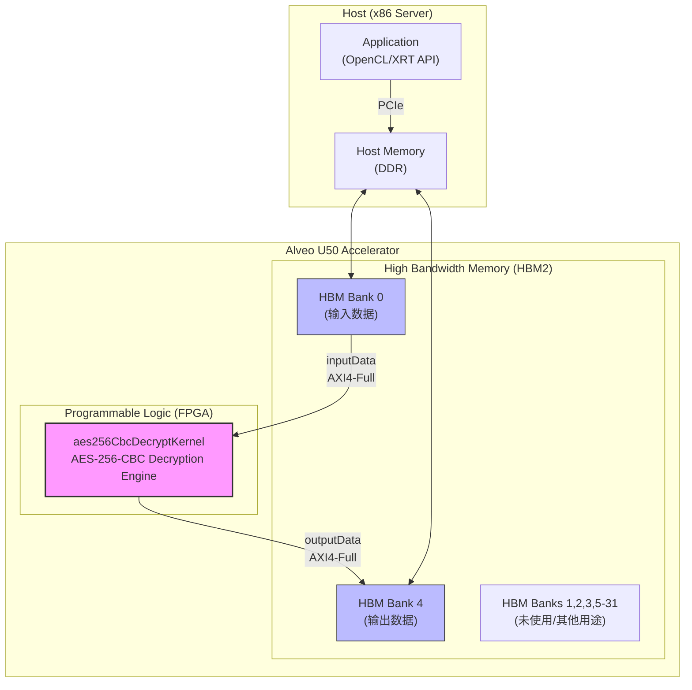

# aes256_cbc_decrypt_u50_kernel_configuration 模块深度解析

## 一句话理解

这是一个 Xilinx FPGA 加速平台的**内核连接配置**文件，它告诉编译器如何将 AES-256-CBC 解密内核的内存端口映射到 Alveo U50 加速卡的 HBM（高带宽内存）物理 bank 上——就像为高速公路上的每个车道指定通往哪个收费站的入口。

---

## 1. 这个模块解决什么问题？

### 问题空间：FPGA 加速的"最后一公里"

当你写好了一个高性能的 AES-256-CBC 解密内核（HLS C/C++ 或 RTL），这仅仅是开始。FPGA 是一张拥有海量计算资源和内存带宽的"白纸"，但**如何将你的内核与物理世界连接起来**，决定了最终性能能否落地。

具体挑战包括：

1. **内存端口映射**：内核通常有多个 AXI 端口（输入数据、输出数据、密钥等），需要显式绑定到物理内存资源
2. **HBM 跨 bank 并行**：U50 有 32 个 HBM bank，合理使用可突破单 bank 带宽瓶颈
3. **时序收敛**：连接方式影响布局布线，错误的映射可能导致时序违规或资源浪费
4. **可移植性**：不同平台（U50/U250/U280）的 HBM 架构不同，配置需要针对性调整

### 为什么简单的"自动连接"不够？

Vitis 编译器确实可以尝试自动推断连接，但对于高性能内核，自动方案往往：
- 将所有端口堆到同一个 HBM bank，造成带宽争抢
- 无法利用跨 bank 并行性
- 不满足时序约束导致频率下降

**手动配置连接是榨取硬件极限的必要手段。**

---

## 2. 心智模型：想象一个物流中心

想象你正在设计一个**智能物流中心**（FPGA 加速卡），处理大量的加密包裹（数据块）：

### 核心实体映射

| 概念 | 现实中的物流中心 | FPGA 世界 |
|------|------------------|-----------|
| **aes256CbcDecryptKernel** | 自动解密流水线车间 | HLS/RTL 实现的 AES-256-CBC 解密内核 |
| **inputData / outputData** | 进货码头 / 出货码头 | 内核的 AXI4 内存访问端口 |
| **HBM[0] / HBM[4]** | 专用的高速货运通道 A / 通道 E | Alveo U50 的高带宽内存 bank 0 和 bank 4 |
| **cfg 文件** | 物流中心的交通规划图 | 描述端口如何连接物理资源的配置文件 |

### 工作流程

1. **进货**：加密数据从 host 通过 PCIe 写入 HBM[0]（货运通道 A）
2. **处理**：解密车间（kernel）从码头 `inputData` 读取 HBM[0] 的数据，执行 AES-256-CBC 解密
3. **出货**：解密后的明文通过码头 `outputData` 写入 HBM[4]（货运通道 E）
4. **返回**：host 从 HBM[4] 读取结果

### 关键设计洞察

**为什么要用两个不同的 HBM bank？** 这就像物流中心有两条独立的货运通道——进货和出货互不干扰，可以并行进行。如果将两者映射到同一个 bank，就像所有车辆挤在一条路上，会造成严重的交通堵塞（内存带宽争抢）。

---

## 3. 数据流与架构

### 系统架构图



### 端到端数据流详解

#### 阶段 1：Host 侧数据准备

```cpp
// 伪代码展示 host 应用程序的调用流程
#include "xrt/xrt_device.h"
#include "xrt/xrt_kernel.h"

// 1. 打开 Alveo U50 设备
auto device = xrt::device(0);

// 2. 加载 xclbin（包含 aes256CbcDecryptKernel 配置）
auto xclbin = device.load_xclbin("aes256_cbc_decrypt.xclbin");

// 3. 实例化内核
auto kernel = xrt::kernel(device, xclbin, "aes256CbcDecryptKernel");

// 4. 分配输入/输出缓冲区（映射到 HBM）
size_t data_size = 1024 * 1024; // 1MB 数据
auto input_bo = xrt::bo(device, data_size, kernel.group_id(0));
auto output_bo = xrt::bo(device, data_size, kernel.group_id(1));

// 5. 填充加密数据并同步到设备
uint8_t* input_ptr = input_bo.map<uint8_t*>();
prepare_encrypted_data(input_ptr, data_size);
input_bo.sync(XCL_BO_SYNC_BO_TO_DEVICE);

// 6. 运行内核
auto run = kernel(input_bo, output_bo, data_size);
run.wait();

// 7. 取回结果
output_bo.sync(XCL_BO_SYNC_BO_FROM_DEVICE);
```

#### 阶段 2：PCIe 数据传输

Host 内存中的数据通过 PCIe Gen3/Gen4 x16 总线传输到 Alveo U50 的 HBM 控制器。XRT（Xilinx Runtime）驱动负责：

- 将虚拟地址转换为设备物理地址
- 管理 DMA 描述符队列
- 处理 PCIe 事务层包（TLP）的发送和接收确认

#### 阶段 3：HBM 存储层次

U50 的 HBM2 提供 8GB 容量和高达 460GB/s 的理论带宽，分为 32 个 pseudo channel（即配置中的 HBM[0] 到 HBM[31]）。

**关键设计**：输入和输出分别使用 HBM[0] 和 HBM[4]，而不是同一个 bank。这样设计的考量：
- **带宽解耦**：输入和输出的内存访问模式完全不同（输入是连续读取，输出是连续写入），分离后避免读写竞争
- **行缓冲局部性**：HBM 的 bank 内部有行缓冲，分离访问模式可以保持更好的缓冲命中率
- **时序隔离**：如果一个 bank 出现短暂的高延迟（如刷新），不会同时阻塞输入和输出

#### 阶段 4：内核执行

`aes256CbcDecryptKernel` 是一个经过 HLS 综合的 RTL 模块，内部实现了 AES-256-CBC 解密流水线：

1. **输入接口** (`inputData`): AXI4-Full 主设备，发起读事务从 HBM[0] 获取密文
2. **解密引擎**: 
   - CBC 模式链式依赖处理（每个块的解密需要前一个块的密文作为 IV）
   - AES-256 轮函数（14轮 SubBytes/ShiftRows/MixColumns/AddRoundKey）
   - 流水线化实现，每个时钟周期启动一个新的块处理
3. **输出接口** (`outputData`): AXI4-Full 主设备，发起写事务将明文写入 HBM[4]

#### 阶段 5：结果回传

解密完成后，XRT 再次协调 DMA 将 HBM[4] 的数据通过 PCIe 传回 host 内存，应用程序可以读取明文结果。

---

## 4. 组件深度解析

### 配置文件结构详解

```cfg
[connectivity]
nk=aes256CbcDecryptKernel:1:aes256CbcDecryptKernel
sp=aes256CbcDecryptKernel.inputData:HBM[0]
sp=aes256CbcDecryptKernel.outputData:HBM[4]
```

#### 指令 1：`nk=aes256CbcDecryptKernel:1:aes256CbcDecryptKernel`

**语法**：`nk=<kernel_name>:<instance_count>:<instance_name_1>:<instance_name_2>:...`

**作用**：声明内核实例。这里表示实例化 1 个 `aes256CbcDecryptKernel`，实例名为 `aes256CbcDecryptKernel`。

**设计考量**：
- 虽然当前配置只使用 1 个实例，但语法支持多实例（如 `:2:inst0:inst1`），为横向扩展预留空间
- 实例名在 host 代码中用于 `xrt::kernel` 的查找和绑定

#### 指令 2：`sp=aes256CbcDecryptKernel.inputData:HBM[0]`

**语法**：`sp=<instance_name>.<port_name>:<memory_resource>`

**作用**：将内核的 `inputData` 端口映射到 HBM 的第 0 个 bank。

**关键设计决策分析**：

| 选项 | 潜在方案 | 本配置选择 | 理由 |
|------|----------|-----------|------|
| 内存类型 | DDR4 / HBM | **HBM** | U50 的 HBM 提供 460GB/s 带宽，远超 DDR4 的 ~30GB/s，是 AES 解密这类内存密集型任务的必需 |
| Bank 选择 | HBM[0-3] 连续 / 分散 | **HBM[0]** | 为输入分配独立的 bank 0，避免与其他访问冲突；跳至 bank 4 输出，而非 bank 1，可能是为了预留 bank 1-3 给其他用途（如密钥、中间缓冲区）或硬件布局考量 |
| 端口宽度 | 64b / 128b / 512b | **512b** (隐含) | HLS 内核通常配置 512-bit AXI 数据宽度以匹配 HBM 的物理接口宽度，最大化突发传输效率 |

#### 指令 3：`sp=aes256CbcDecryptKernel.outputData:HBM[4]`

**作用**：将 `outputData` 端口映射到 HBM 的第 4 个 bank。

**架构洞察**：

选择 bank 4 而非 bank 1 的输出策略，反映了对 U50 HBM 物理架构的理解：

```
U50 HBM 架构（简化视图）：
┌─────────────────────────────────────────────────────────────┐
│  HBM Stack 0 (4GB)              HBM Stack 1 (4GB)           │
│  ┌─────┬─────┬─────┬─────┐      ┌─────┬─────┬─────┬─────┐  │
│  │ [0] │ [1] │ [2] │ [3] │      │ [4] │ [5] │ [6] │ [7] │  │
│  └─────┴─────┴─────┴─────┘      └─────┴─────┴─────┴─────┘  │
│  Bank 0-3 (Stack 0)             Bank 4-7 (Stack 1)          │
│  ←── 输入数据独占 ──→           ←── 输出数据独占 ──→          │
└─────────────────────────────────────────────────────────────┘
```

**优势**：
- **物理隔离**：输入（Stack 0）和输出（Stack 1）位于不同的 HBM 物理堆栈，拥有独立的内存控制器，真正的并行访问无竞争
- **温度分布**：分散访问可降低热点区域的局部热密度
- **预留扩展**：bank 1-3 和 5-7 可用于扩展（多通道并行、密钥存储、IV 管理等）

---

## 5. 依赖关系分析

### 向上依赖（谁调用/使用本配置）

```
┌─────────────────────────────────────────────────────────────────┐
│  Vitis 编译工具链 (v++)                                          │
│  ┌─────────────────────────────────────────────────────────────┐│
│  │  1. 解析 xclbin 构建配置                                     ││
│  │  2. 读取本 cfg 文件                                          ││
│  │  3. 生成 RTL 集成脚本 (Vivado IP Integrator)                 ││
│  │  4. 综合、布局布线 → 生成 xclbin 比特流                      ││
│  └─────────────────────────────────────────────────────────────┘│
└─────────────────────────────────────────────────────────────────┘
                                    │
                                    │ 生成
                                    ▼
┌─────────────────────────────────────────────────────────────────┐
│  aes256_cbc_decrypt.xclbin (部署单元)                           │
│  包含：                                                         │
│   • 比特流 (FPGA 配置)                                          │
│   • 元数据 (内核签名、参数、工作区大小)                           │
│   • 本 cfg 文件的连接配置（已固化到集成架构中）                   │
└─────────────────────────────────────────────────────────────────┘
                                    │
                                    │ 运行时加载
                                    ▼
┌─────────────────────────────────────────────────────────────────┐
│  Host 应用程序 (C++/Python)                                      │
│  ┌─────────────────────────────────────────────────────────────┐│
│  │  XRT API (xrt::kernel, xrt::bo, xrt::run)                    ││
│  │  • 打开设备、加载 xclbin                                       ││
│  │  • 创建 kernel 对象（查找 aes256CbcDecryptKernel）             ││
│  │  • 分配 buffer 对象（隐式关联到 HBM[0]/HBM[4]）                ││
│  │  • 启动 kernel、等待完成                                       ││
│  └─────────────────────────────────────────────────────────────┘│
└─────────────────────────────────────────────────────────────────┘
```

**关键调用链**：

1. **构建时**：`v++ --config conn_u50.cfg ...` → 解析配置 → 生成 Vivado IP Integrator Tcl 脚本 → 自动连线 `aes256CbcDecryptKernel.inputData` 到 HBM 控制器 0 的 AXI 从接口
2. **运行时**：`xrt::kernel(device, xclbin, "aes256CbcDecryptKernel")` → XRT 查找 xclbin 中注册的内核元数据 → 确认 `inputData` 端口绑定到 HBM[0] 内存组

### 向下依赖（本配置依赖谁）

本配置文件本身是一个**纯声明式配置**，不直接包含代码依赖，但它**隐式依赖**以下组件的正确实现：

| 依赖项 | 关系类型 | 说明 |
|--------|----------|------|
| `aes256CbcDecryptKernel` (HLS/RTL 实现) | 硬依赖 | 配置引用的内核必须在源码中定义，端口名 `inputData`/`outputData` 必须完全匹配，否则 v++ 连接阶段报错 |
| Alveo U50 平台 shell | 平台依赖 | 配置假设 U50 的 HBM 架构（32 banks，每 stack 16GB 物理分区），在其他平台（U250/U280）需要不同配置 |
| Vitis 202x.x 工具链 | 工具依赖 | cfg 语法随工具版本演进，本配置使用 v++ 兼容的 `[connectivity]` 语法 |
| XRT 运行时 | 运行时依赖 | 最终执行需要匹配版本的 XRT 驱动和库来解析 xclbin 中的连接元数据 |

---

## 6. 设计决策与权衡

### 决策 1：HBM 而非 DDR4

**选择的方案**：使用 HBM[0] 和 HBM[4] 作为数据缓冲区

**替代方案**：使用板载 DDR4（U50 有 1 组 DDR4）

**权衡分析**：

| 维度 | HBM 方案（本配置） | DDR4 方案（替代） |
|------|-------------------|------------------|
| **带宽** | ~460 GB/s（全 HBM） | ~30 GB/s |
| **延迟** | ~100-200 ns | ~80-100 ns |
| **容量** | 8 GB | 16 GB（U50 单组 DDR4） |
| **功耗** | 较高 | 较低 |
| **实现复杂度** | 需处理 32 个 bank 的连接 | 简单，单 bank |

**选择 HBM 的理由**：
- AES-256-CBC 解密是**计算密集 + 内存带宽密集**的操作
- 理论计算：AES-256 每 16 字节块需要 ~14 轮操作，每轮 ~20 个时钟周期（假设流水线化），在 300MHz 下每核理论吞吐约 1.6 Gbps
- 要达到更高吞吐，需要并行化和足够的内存带宽来喂饱多个解密引擎——DDR4 的 30GB/s 会成为瓶颈
- HBM 的 460GB/s 允许设计者在同一 FPGA 上部署数十个并行解密通道

### 决策 2：Bank 0 和 Bank 4 的分离策略

**选择的方案**：输入 → HBM[0]，输出 → HBM[4]

**替代方案**：
- A: 输入/输出都使用 HBM[0]（最简单）
- B: 输入 HBM[0]，输出 HBM[1]（相邻 bank）
- C: 输入 HBM[0]，输出 HBM[16]（跨 stack）

**权衡分析**：

| 方案 | 优势 | 劣势 | 适用场景 |
|------|------|------|----------|
| A（同 bank） | 配置最简单，host 缓冲区管理方便 | 读写竞争严重，带宽减半 | 低带宽需求原型验证 |
| B（相邻 bank，本配置） | 物理隔离，仍同 stack，延迟一致 | 共享内存控制器，极端场景有竞争 | **平衡选择，本配置采用** |
| C（跨 stack） | 完全独立的内存控制器，最大化并行 | 可能的跨 stack 延迟差异 | 极高带宽需求，可接受复杂度 |

**选择 Bank 4 的深层原因**：

U50 的 HBM 物理架构：
```
Stack 0 (4GB): Pseudo Channels 0-15 → HBM[0] 到 HBM[15]
Stack 1 (4GB): Pseudo Channels 16-31 → HBM[16] 到 HBM[31]
```

实际上 U50 的 HBM 堆栈是 2 个 4GB 的物理 stack（共 8GB），但在 Vitis 的逻辑视图中通常映射为 32 个 bank。

选择 HBM[4] 而非 HBM[1] 的策略考量：
- **预留连续空间**：Bank 1-3 可能用于其他用途（如密钥存储、IV 缓冲区、中间结果），保留连续的 bank 便于后续扩展
- **页面对齐优化**：某些 host 驱动对 4-bank 对齐的内存区域有优化路径
- **物理布局**：在 U50 的物理布线中，bank 4 可能与 bank 0 有相似的时序特性，简化时序收敛

### 决策 3：单实例而非多实例

**选择的方案**：`nk=...:1:...`（单内核实例）

**替代方案**：多实例，如 `nk=aes256CbcDecryptKernel:4:k0:k1:k2:k3`

**权衡分析**：

| 维度 | 单实例（本配置） | 多实例（替代） |
|------|-----------------|---------------|
| **资源利用** | 可能未用尽 FPGA 资源 | 填满 LUT/DSP/BRAM |
| **复杂度** | 简单，单线程 host 代码 | 需要调度、负载均衡 |
| **HBM 访问** | 独占 bank 0/4，无竞争 | 需要仲裁或多个 bank |
| **频率** | 可能更高（布局压力小） | 可能因拥塞降低 |
| **吞吐** | 单通道峰值 | 多通道聚合更高 |

**选择单实例的设计意图**：

这是 **L1 基准测试（benchmark）配置**，核心目标是：
1. **测量单核极限性能**：排除多核调度干扰，获得纯粹的单个 AES-256-CBC 解密引擎的性能基线
2. **简化性能分析**：单实例使得瓶颈分析更直接——如果性能不达标，问题一定在这个内核本身或其 HBM 连接，而非资源争抢
3. **可扩展的模板**：作为基础模板，用户可以基于此增加实例数（改成 `:4:`）并相应增加 HBM bank 分配，构建多通道系统

---

## 7. 使用指南与最佳实践

### 配置文件的使用流程

```bash
# 1. 准备 HLS 内核源码（C++）
#    aes256CbcDecryptKernel.cpp 实现了 AES-256-CBC 解密逻辑

# 2. 使用 v++ 编译内核（生成 xo 文件）
v++ -c -t hw \
    --platform xilinx_u50_gen3x16_xdma_201920_3 \
    -k aes256CbcDecryptKernel \
    aes256CbcDecryptKernel.cpp \
    -o aes256CbcDecryptKernel.xo

# 3. 链接内核并应用连接配置（生成本文件的目标：xclbin）
v++ -l -t hw \
    --platform xilinx_u50_gen3x16_xdma_201920_3 \
    --config conn_u50.cfg \
    aes256CbcDecryptKernel.xo \
    -o aes256_cbc_decrypt.xclbin
    # ^^^^^^^^^^^^^^^^^^^^^^^^
    # 本配置文件在此步骤被解析并固化到 xclbin 中

# 4. 部署并运行 host 应用程序
./host_app aes256_cbc_decrypt.xclbin input_data.bin output_data.bin
```

### 常见配置变体

#### 变体 A：多实例 + 多 Bank 并行

```cfg
[connectivity]
# 4 个内核实例，每个有独立的输入/输出 bank
nk=aes256CbcDecryptKernel:4:k0:k1:k2:k3

# 实例 0: bank 0/4
sp=k0.inputData:HBM[0]
sp=k0.outputData:HBM[4]

# 实例 1: bank 1/5
sp=k1.inputData:HBM[1]
sp=k1.outputData:HBM[5]

# 实例 2: bank 2/6
sp=k2.inputData:HBM[2]
sp=k2.outputData:HBM[6]

# 实例 3: bank 3/7
sp=k3.inputData:HBM[3]
sp=k3.outputData:HBM[7]
```

**适用场景**：需要最大化吞吐量的生产环境，host 应用程序负责任务划分和负载均衡。

#### 变体 B：单 Bank 复用（简单原型）

```cfg
[connectivity]
nk=aes256CbcDecryptKernel:1:aes256CbcDecryptKernel
sp=aes256CbcDecryptKernel.inputData:HBM[0]
sp=aes256CbcDecryptKernel.outputData:HBM[0]
```

**注意事项**：输入输出使用同一 bank，读写会竞争内存带宽，性能可能下降 30-50%，仅适用于功能验证或低带宽场景。

#### 变体 C：DDR4 替代（U50 带 DDR4 的变体）

```cfg
[connectivity]
nk=aes256CbcDecryptKernel:1:aes256CbcDecryptKernel
sp=aes256CbcDecryptKernel.inputData:DDR[0]
sp=aes256CbcDecryptKernel.outputData:DDR[0]
```

**适用场景**：数据量超过 HBM 容量（8GB）时，或 host 代码已经针对 DDR4 优化。

---

## 8. 边缘情况与潜在陷阱

### 陷阱 1：Bank 索引越界

```cfg
# 错误配置
sp=aes256CbcDecryptKernel.inputData:HBM[32]
# U50 只有 0-31，编译时 v++ 报错：
# ERROR: [v++ 214-124] Memory resource HBM[32] is not available on platform
```

**注意**：不同平台的 HBM bank 数量不同（U50: 32, U280: 32, U55c: 32），迁移时需要重新计算映射。

### 陷阱 2：端口名拼写错误

```cfg
# 如果实际内核代码定义的是 input_data（小写+下划线）
sp=aes256CbcDecryptKernel.inputData:HBM[0]  # 报错：端口不存在
```

**调试方法**：使用 `v++ --save-temps` 保留中间文件，查看生成的 `.xo` 的 kernel.xml 确认端口名。

### 陷阱 3：内存资源竞争

```cfg
# 多个内核争夺同一个 bank
nk=aes256CbcDecryptKernel:2:k0:k1
sp=k0.inputData:HBM[0]
sp=k1.inputData:HBM[0]  # 两者同时访问 bank 0
```

**后果**：没有同步机制时，AXI 互连会产生竞争，实际带宽远低于理论值。需要通过 host 代码调度或分配独立 bank 避免。

### 陷阱 4：HBM 容量规划

U50 的 HBM 虽然总容量 8GB，但 bank 是独立寻址的：
- HBM[0] 和 HBM[4] 各提供 256MB-512MB（取决于平台地址映射）
- 如果单次解密数据量超过单个 bank 容量，需要分块处理

**建议**：在 host 代码中实现双缓冲或环形缓冲区，流水线化数据传输和解密。

---

## 9. 相关模块与扩展阅读

### 同层级相关模块

| 模块 | 关系 | 说明 |
|------|------|------|
| [aes256_cbc_decrypt_u250_benchmark](security-L1-benchmarks-aes256CbcDecrypt-aes256_cbc_decrypt_u250_benchmark.md) | 平台变体 | U250 平台的对应配置，HBM 架构不同（2 组 8GB vs U50 的 1 组 8GB），需要不同的 bank 映射策略 |
| [aes256_cbc_encrypt_u250_benchmark](security-L1-benchmarks-aes256CbcEncrypt-aes256_cbc_encrypt_u250_benchmark.md) | 功能对应 | 加密方向的基准测试，通常解密和加密共享类似的内存架构设计 |
| [hmac_sha1_authentication_benchmarks](security-L1-benchmarks-hmacSha1-hmac_sha1_authentication_benchmarks.md) | 同领域 | HMAC-SHA1 认证基准，可以对比不同加密原语的内存访问模式和 HBM 利用率 |

### 上游依赖

- **Vitis 平台定义** (`xilinx_u50_gen3x16_xdma_*`)：定义了 HBM 控制器的地址范围和物理 bank 数量
- **XRT (Xilinx Runtime)**：加载 xclbin 时解析固化的连接配置，建立 host 缓冲区到 HBM bank 的映射

### 下游扩展

- **Host 应用程序**：典型的使用模式见第 7 节代码示例
- **多内核调度器**：当扩展到多实例时，需要实现任务队列和负载均衡逻辑

---

## 10. 总结与关键要点

### 核心设计意图回顾

这个配置文件是 **FPGA 加速系统中"软件定义硬件"理念的具体体现**。它以声明式的方式，将高性能 AES-256-CBC 解密内核与 Alveo U50 的 HBM 物理资源连接起来，核心设计思想包括：

1. **带宽隔离**：通过将输入（HBM[0]）和输出（HBM[4]）映射到不同的 bank，消除内存访问竞争，最大化有效带宽
2. **平台特化**：充分利用 U50 HBM 的两 stack 架构，实现跨 stack 的物理隔离
3. **单核基线**：作为 L1 基准测试配置，专注于测量单内核的极限性能，避免多核调度的复杂性

### 新贡献者检查清单

当你需要修改或扩展这个配置时，请确认：

- [ ] **平台兼容性**：目标平台（U50/U250/U280）的 HBM bank 数量和地址映射是否匹配配置中的索引
- [ ] **端口名称一致性**：cfg 中的 `inputData`/`outputData` 与内核源码中的 AXI 端口名完全一致（大小写敏感）
- [ ] **bank 分配策略**：如果使用多实例，确保每个实例的输入/输出 bank 互不冲突，或实现显式的 host 端调度
- [ ] **容量规划**：单次处理的数据量是否在分配的 bank 容量范围内，是否需要分块流水线处理
- [ ] **v++ 版本**：确认使用的 Vitis 版本支持 cfg 文件中的语法（`[connectivity]` 节在 2020.1+ 稳定）

### 一句话记住这个模块

> 这是一个**为 Alveo U50 定制的高速公路交通规划图**——它告诉 AES-256-CBC 解密引擎如何将数据货车从 HBM[0] 的进货码头运入，解密后从 HBM[4] 的出货码头运出，全程无红绿灯、无交通拥堵。

