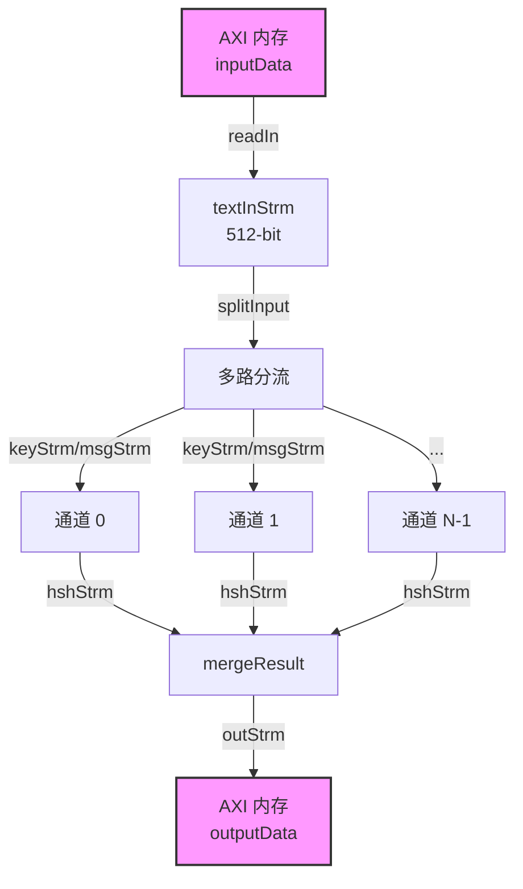

# hmacSha1Kernel1 技术深度解析

## 导语：这到底是什么？

想象你有一个保险箱，需要验证放进去的文件在运输过程中有没有被篡改。HMAC-SHA1 就是一种"数字指纹"算法——它用一把密钥对文件计算出一个 160 位的摘要。哪怕文件只改动了一个字节，摘要就会完全不同。

这个模块 (`hmacSha1Kernel1`) 是把上述过程做成了一块 FPGA 加速卡上的"流水线工厂"。它不是一次处理一个文件，而是同时开启多条流水线（多通道并行），每条流水线以流水线方式（stream 数据流）处理大量数据块。这种设计的核心洞察是：**密码学计算的瓶颈不是计算本身，而是数据搬运和并行度**。通过把内存读取、数据分片、并行计算、结果合并、写回内存做成一条深度流水线的不同阶段，我们既隐藏了内存延迟，又通过多通道并行榨干了 FPGA 的计算资源。

## 架构全景：数据如何流动？



### 架构叙事

这张图描绘的是一条**深度流水线（Deep Pipeline）**，你可以把它想象成一条汽车装配线。数据（待计算的消息和密钥）从左侧的仓库（AXI 内存）进来，经过多个工站（函数模块），最后从右侧出货（结果写回内存）。

**关键设计洞察**：这条流水线不是为了处理单个消息最快，而是为了**吞吐率最大化**——当第一条消息走到第二步时，第二条消息已经进入第一步。与此同时，多个并行的"装配车间"（通道）同时开工。这意味着我们牺牲了一点单消息延迟，换取了极高的批量处理吞吐量。

数据流的关键转换发生在 `splitInput` 阶段：512 位的 AXI 数据总线数据被拆分成 32 位的消息流，分发到各个并行通道。在 `mergeResult` 阶段，160 位的哈希结果从各通道收集，重新打包成 512 位总线数据。

## 核心组件深度解析

### 1. `sha1_wrapper` - 策略适配器模式

```cpp
template <int msgW, int lW, int hshW>
struct sha1_wrapper {
    static void hash(hls::stream<ap_uint<msgW> >& msgStrm,
                     hls::stream<ap_uint<64> >& lenStrm,
                     hls::stream<bool>& eLenStrm,
                     hls::stream<ap_uint<5 * msgW> >& hshStrm,
                     hls::stream<bool>& eHshStrm) {
        xf::security::sha1<msgW>(msgStrm, lenStrm, eLenStrm, hshStrm, eHshStrm);
    }
};
```

**设计意图与洞察**：

这个看似简单的包装器实际上运用的是**策略模式（Strategy Pattern）**。`xf::security::hmac` 是一个通用的 HMAC 实现，它并不直接依赖 SHA1、SHA256 或任何特定的哈希算法。相反，它通过模板参数接受一个"哈希策略"——只要这个策略提供了特定签名的 `hash` 静态方法，HMAC 就能工作。

`sha1_wrapper` 的存在让 SHA1 算法满足了 HMAC 的"契约"。这种设计的美妙之处在于**解耦**：哈希算法的实现细节与 HMAC 的高层逻辑完全分离。如果你想换成 SHA256，只需要提供一个类似的 `sha256_wrapper`，而 HMAC 的核心代码无需改动。

**为什么用静态方法？** 在 HLS（高层次综合）语境下，静态方法意味着没有对象状态需要维护，这有助于综合器生成更高效的硬件逻辑——不需要实例化对象，也不需要管理对象生命周期。

---

### 2. `readIn` - 内存到流的 DMA 引擎

```cpp
template <unsigned int _burstLength, unsigned int _channelNumber>
static void readIn(ap_uint<512>* ptr,
                   hls::stream<ap_uint<512> >& textInStrm,
                   hls::stream<ap_uint<64> >& textLengthStrm,
                   hls::stream<ap_uint<64> >& textNumStrm,
                   hls::stream<ap_uint<256> >& keyInStrm)
```

**设计意图与洞察**：

这个函数是**FPGA 加速卡的"前装码头""。** CPU 把数据放在 DDR 内存里，`readIn` 负责把这些数据搬进 FPGA 芯片内部的片上存储（通过 AXI 总线）。这里有两个层面的优化思考：

**批量传输（Burst Transfer）**：代码中的 `LOOP_READ_DATA` 没有逐个字节读取，而是以 `_burstLength` 为单位批量读取。这就像是货车运输——你不会为了送一个小包裹就派一辆卡车，而是等凑满一车再出发。在硬件层面，这减少了 AXI 总线的握手开销，显著提升了有效带宽。

**配置与数据分离**：前几个 512 位字（由 `_channelNumber` 控制）被解释为配置信息（消息长度、消息数量、密钥），后面的才是实际数据。这种设计让 CPU 可以通过同一个缓冲区一次性下发"任务描述"和"任务数据"，减少了主机到 FPGA 的往返通信。

---

### 3. `splitInput` - 数据分片与路由中枢

```cpp
template <unsigned int _channelNumber, unsigned int _burstLength>
void splitInput(...,
                hls::stream<ap_uint<32> > keyStrm[_channelNumber],
                hls::stream<ap_uint<32> > msgStrm[_channelNumber],
                ...)
```

**设计意图与洞察**：

这是整个架构的**"交通枢纽"**。想象一条宽阔的 16 车道高速公路（512 位 AXI 总线）需要分流到多个 narrower 的街道（32 位消息流，并行通道）。`splitInput` 执行了两个关键转换：

**位宽转换（512-bit → 32-bit）**：SHA1 算法通常处理 32 位字，而 AXI 总线为了带宽效率使用 512 位。`splitText` 内部通过位域操作（`.range()`）把 512 位切成 16 个 32 位块。

**空间并行化（Spatial Parallelism）**：`_channelNumber` 个并行通道意味着 FPGA 内部实际上例化了 `_channelNumber` 套独立的 HMAC-SHA1 计算单元。这不是时间上的复用（时分），而是真正的硬件复制（空分）。代价是消耗更多的 FPGA 逻辑资源（LUT、FF、DSP），收益是吞吐量随通道数线性增长。

---

### 4. `hmacSha1Parallel` - 并行计算引擎

```cpp
template <unsigned int _channelNumber>
static void hmacSha1Parallel(hls::stream<ap_uint<32> > keyStrm[_channelNumber],
                             hls::stream<ap_uint<32> > msgStrm[_channelNumber],
                             ...)
```

**设计意图与洞察**：

这是**"生产车间"**本身。`#pragma HLS dataflow` 是关键——它告诉 HLS 综合器：这个函数内部的多个调用应该以数据流（dataflow）方式并行执行，而不是顺序执行。

**Dataflow 语义**：当 `_channelNumber` 为 4 时，`test_hmac_sha1` 会被例化 4 次。在传统的 C 语义中，这 4 个调用会顺序执行（一个结束才开始下一个）。但在 HLS dataflow 模式下，这 4 个实例是**同时运行**的硬件流水线。每个实例消费自己的输入流，只要有数据就持续计算，不必等待其他实例。

**吞吐量公式**：理想情况下，整个 kernel 的吞吐量 = 单个 HMAC-SHA1 吞吐 × `_channelNumber`。这是典型的"横向扩展"（scale-out）思维，只不过扩展发生在单个芯片内部。

---

### 5. `mergeResult` - 结果汇聚与打包

```cpp
template <unsigned int _channelNumber, unsigned int _burstLen>
static void mergeResult(hls::stream<ap_uint<160> > hshStrm[_channelNumber],
                        hls::stream<bool> eHshStrm[_channelNumber],
                        hls::stream<ap_uint<512> >& outStrm,
                        hls::stream<unsigned int>& burstLenStrm)
```

**设计意图与洞察**：

这是**"包装车间"**。160 位的 HMAC 结果从各个并行通道流出，但 AXI 总线喜欢 512 位对齐的数据。`mergeResult` 解决了一个经典的生产者-消费者问题：**多个数据源，一个输出端口**。

**轮询仲裁（Round-robin Polling）**：`unfinish` 变量跟踪哪些通道还有未完成的数据。`LOOP_WHILE` 持续轮询所有通道，只要有数据就读取。这不是优先级仲裁，而是公平的轮询，确保所有通道的数据都能被及时消费，避免某个通道饿死。

**突发打包（Burst Packing）**：`counter` 跟踪已收集的哈希数量。当达到 `_burstLen` 时，触发一次突发写标记。这是为了配合下游的 `writeOut` 函数，让它能以高效的突发模式写入 DDR。

---

### 6. `writeOut` - 流式写回

```cpp
template <unsigned int _burstLength, unsigned int _channelNumber>
static void writeOut(hls::stream<ap_uint<512> >& outStrm, 
                     hls::stream<unsigned int>& burstLenStrm, 
                     ap_uint<512>* ptr)
```

**设计意图与洞察**：

这是**"发货码头"**。`mergeResult` 已经将数据打包成适合突发的形式，`writeOut` 只需要按标记的长度批量写入内存即可。

**流控制分离**：数据流 (`outStrm`) 和控制流 (`burstLenStrm`) 是分离的。这是 FPGA 数据流设计的惯用手法——数据持续流动，控制信息（突发长度）紧随其后。`burstLen == 0` 是终止信号，这是一个简单的流控制协议。

---

### 7. `hmacSha1Kernel_1` - 顶层编排

```cpp
extern "C" void hmacSha1Kernel_1(ap_uint<512> inputData[(1 << 20) + 100], 
                                  ap_uint<512> outputData[1 << 20])
```

**设计意图与洞察**：

这是**"工厂调度中心"**。所有之前的函数都是静态函数（内部链接），只有 `hmacSha1Kernel_1` 是 `extern "C"` 导出的，这是 Vitis 工具的硬性要求——只有这种函数才能被主机代码调用。

**流声明与资源绑定**：函数开头声明了大量的 `hls::stream` 变量，每个都带有 `#pragma HLS stream` 和 `#pragma HLS resource`。这些指令至关重要：
- `depth`：指定 FIFO 深度，影响流水线缓冲能力
- `FIFO_BRAM` vs `FIFO_LUTRAM`：选择存储介质。BRAM 容量大但延迟略高，LUTRAM 快速但占用逻辑资源。

**Dataflow 架构**：`#pragma HLS dataflow` 是整个 kernel 的核心。它允许 `readIn`、`splitInput`、`hmacSha1Parallel`、`mergeResult`、`writeOut` 以流水线方式重叠执行。想象五个人传水灭火：第一个人接水的同时，第二个人在倒水，第三个人在奔跑，第四个人在泼水，第五个人在返回。Dataflow 就是让这个"水桶接力"持续流动。

## 依赖关系与数据契约

### 上游依赖（谁调用它）

`hmacSha1Kernel_1` 是 Vitis kernel，由主机端（通常运行在 x86 或 ARM CPU 上）通过 OpenCL/XRT API 调用。典型的调用链是：

```
Python/C++ Host App 
    -> XRT OpenCL Runtime 
    -> XCLBIN (FPGA Bitstream) 
    -> hmacSha1Kernel_1
```

在模块树中，它属于 `hmac_sha1_authentication_benchmarks` 下的 `hmac_sha1_kernel_wrapper_instances_1_2`，与 `hmacSha1Kernel2` 构成一对并行 kernel。

### 下游依赖（它调用谁）

**核心库依赖**（来自 Vitis Security Library）：
- `xf::security::sha1<msgW>()` - SHA1 哈希核心算法
- `xf::security::hmac<...>()` - HMAC 高层封装

这两个函数定义在 `xf_security/sha1.hpp` 和 `xf_security/hmac.hpp` 中，是纯 C++ 模板实现，会被 HLS 综合成硬件电路。

**基础设施依赖**：
- `ap_int.h` - Xilinx 任意精度整数类型（`ap_uint<512>` 等）
- `hls_stream.h` - HLS 流式数据结构
- `kernel_config.hpp` - 本 kernel 的配置宏（`CH_NM`, `BURST_LEN`, `GRP_SIZE` 等）

### 数据契约（调用约定）

**输入数据布局（AXI 内存格式）**：

`inputData` 缓冲区的前 `_channelNumber` 个 512 位字是配置头，后面跟着实际数据：

```
[inputData[0]]: [textLength(64b) | textNum(64b) | reserved(128b) | key(256b)]
[inputData[1]]: [同上，用于 channel 1，实际与 channel 0 相同]
...
[inputData[_channelNumber-1]]: [channel N-1 配置]
[inputData[_channelNumber...]]: [实际消息数据...]
```

- `textLength`: 单条消息长度（字节）
- `textNum`: 每个通道处理多少条消息
- `key`: 256 位 HMAC 密钥

**输出数据布局**：

`outputData` 直接存放 160 位的 HMAC 结果，每个结果占一个 512 位字的低 160 位，高位补零。

**关键假设（前置条件）**：

1. **对齐要求**：`inputData` 和 `outputData` 必须 512 位（64 字节）对齐，这是 AXI 总线高效传输的前提。
2. **总大小限制**：`inputData` 大小为 `(1 << 20) + 100`（约 1M + 100 个 512 位字），`outputData` 为 `1 << 20`，这是硬编码的上限。
3. **数据完整性**：主机必须确保配置中的 `textLength` 和 `textNum` 与实际提供的数据量匹配，否则会导致读取越界或死锁。

## 设计决策与权衡

### 1. 并行策略：通道并行 vs. 任务并行

**决策**：采用**通道级空间并行**（`_channelNumber` 个独立通道），而非任务级流水线并行（单通道内部分阶段）。

**权衡分析**：

| 方案 | 优点 | 缺点 | 本模块选择 |
|------|------|------|-----------|
| 通道并行 | 吞吐率线性扩展，控制逻辑简单，资源利用可预测 | 单消息延迟不减，资源消耗大 | ✅ 采用 |
| 任务流水线 | 单消息延迟降低，资源占用少 | 控制复杂，吞吐受限于最慢阶段 | ❌ 未采用 |

**深层洞察**：HMAC-SHA1 的计算密度相对固定，没有明显的"长延迟阶段"适合流水线展开。相比之下，批量处理场景（如本 kernel 的目标场景）更看重整体吞吐。因此，复制多套计算单元（通道并行）比深挖单套单元的流水线深度更符合资源效率。

### 2. 数据通路宽度：512-bit AXI vs. 32-bit 算法接口

**决策**：内存接口使用 512 位（64 字节）AXI 总线，算法核心使用 32 位接口，中间通过 `splitText` 进行位宽转换。

**权衡分析**：

现代 FPGA 的 AXI 总线通常支持 512 位甚至更宽，这是为了匹配 DDR 内存的物理位宽和突发传输效率。然而，SHA1 算法基于 32 位字操作（标准定义）。强行让 SHA1 处理 512 位输入会导致内部逻辑极度复杂（需要一次处理 16 个 32 位字），且不符合标准算法的迭代结构。

因此，我们接受位宽转换的开销。`splitText` 通过 `#pragma HLS pipeline II = 1` 确保每个周期都能输出一个 32 位字，转换本身不会成为瓶颈。这是一个典型的"内存带宽 vs. 计算复杂度"权衡，我们选择了前者。

### 3. 存储资源分配：BRAM vs. LUTRAM

**决策**：深度大的流（如 `textInStrm`、`outStrm`）使用 `FIFO_BRAM`，小深度控制流（如 `textLengthStrm`、`keyInStrm`）使用 `FIFO_LUTRAM`。

**权衡分析**：

FPGA 片上存储有两种主要形式：
- **BRAM（Block RAM）**：容量大（通常 18Kb 或 36Kb 一块），但数量有限，访问有固定延迟。
- **LUTRAM（Distributed RAM）**：用查找表（LUT）实现，容量小（每位消耗一个 LUT），但分布广泛，访问灵活。

在流深度（`depth`）较大的场景（如 `_burstLength * fifobatch`，可能达到数百），使用 BRAM 是必要的，否则会耗尽 LUT 资源。而对于深度只有 `fifobatch`（如 4）的控制信号，使用 LUTRAM 更合理——它们不需要大块 BRAM，且分布式布局可能带来更短的路由延迟。

这是一个典型的"资源类型匹配"决策：大容量需求映射到大容量存储，小容量需求映射到灵活存储，以最大化整体资源利用率。

### 4. 同步机制：流（Stream）vs. 共享内存

**决策**：组件间完全通过 `hls::stream` 通信，不使用全局变量或共享内存。

**权衡分析**：

HLS 提供了两种主要的组件间通信方式：
- **流（Stream）**：FIFO 语义，天然支持阻塞/非阻塞读写，由 HLS 自动推断或显式声明。
- **共享内存（Array/Pointer）**：多个函数访问同一块存储，需要显式同步机制（如互斥锁）。

在 FPGA 语境下，**流是首选的"正确默认"**。原因有三：

1. **硬件自然映射**：FPGA 片上有很多专用 FIFO 资源，流可以直接映射为这些硬件 FIFO，无需复杂的仲裁逻辑。

2. **时序可预测性**：流的 FIFO 语义保证了数据依赖的显式表达，HLS 工具可以精确分析数据流，生成高效的流水线。共享内存则容易引入复杂的别名分析和数据竞争，限制优化空间。

3. **模块化与组合性**：流接口是清晰的契约——生产者推入，消费者拉出。这使得函数可以独立开发、测试，然后像乐高积木一样组合，无需关心对方内部状态。

代价是**数据局部性**：流是顺序访问，不适合随机访问模式。但在本模块的流式处理场景（数据从内存顺序流入，顺序流出），这完全不是问题。

## 关键实现细节与风险点

### 1. 模板参数与编译时常数

代码重度依赖模板参数（`_channelNumber`, `_burstLength`, `msgW` 等），这些参数在 `kernel_config.hpp` 中定义（如 `CH_NM`, `BURST_LEN`）。

**风险点**：
- 修改配置宏需要重新综合整个 kernel，因为模板参数影响硬件结构。
- 不同配置生成的 XCLBIN 不兼容，主机代码必须匹配。

### 2. 流深度与死锁风险

每个 `#pragma HLS stream depth = X` 都是精心计算的。如果深度设置过小，当上下游处理速率不匹配时，流会满（full）导致上游阻塞，如果下游也在等待上游，就会形成**死锁**。

**计算逻辑**：
```cpp
const unsigned int msgDepth = fifoDepth * (512 / 32 / CH_NM);
```
这考虑了 512 位到 32 位的转换比和通道数，确保在突发传输期间不会溢出。

### 3. 数据对齐与 AXI 协议

```cpp
#pragma HLS INTERFACE m_axi offset = slave latency = 64 \
    num_write_outstanding = 16 num_read_outstanding = 16 \
    max_write_burst_length = 64 max_read_burst_length = 64 \
    bundle = gmem0_0 port = inputData
```

这些 pragma 是与 AXI 总线握手的关键参数：
- `latency = 64`：告诉 HLS 从发起请求到数据返回大约 64 个周期，影响流水线调度。
- `num_read_outstanding = 16`：允许最多 16 个未完成的读请求，这是**请求流水线化**的关键——不需要等前一个请求返回就能发下一个。
- `max_read_burst_length = 64`：突发传输最大长度 64，配合 512 位数据宽，单次突发可传输 4KB 数据。

**风险点**：主机分配的缓冲区如果未对齐到 64 字节，或者大小不是 64 字节的倍数，AXI 协议可能行为未定义，或性能严重下降。

### 4. 并行度的隐藏限制

`_channelNumber` 受限于 FPGA 资源。SHA1 算法内部有大量位运算和查找表，每个通道消耗可观的 LUT 和 FF。如果 `CH_NM` 设置得太大，可能出现**布线拥塞**（routing congestion）——综合能通过，但布局布线失败，或时序无法闭合。

**调试建议**：资源报告（utilization report）中查看 LUT% 和 FF%，如果超过 70%，增加通道数需谨慎。

### 5. 密钥复用的隐式假设

在 `splitInput` 中，密钥 `key` 从 `keyInStrm` 读取一次，然后用于所有消息：

```cpp
ap_uint<256> key = keyInStrm.read();
// ... 在 LOOP_TEXTNUM 中使用同一个 key
```

这意味着**所有消息使用相同的 HMAC 密钥**。如果你需要每条消息使用不同密钥，这个 kernel 的设计不适用，需要重构 `splitInput` 的逻辑，让密钥流与消息流同步。

---

## 使用指南与集成模式

### 典型调用流程

```cpp
// 1. 分配对齐的缓冲区
size_t input_size = (1 << 20) * 64;  // 64 bytes per 512-bit word
auto input_buf = xrt::bo(device, input_size, 0);
auto output_buf = xrt::bo(device, (1 << 20) * 64, 0);

// 2. 准备输入数据
auto* input_ptr = input_buf.map<uint32_t*>();
// 填充配置头（前 _channelNumber 个 512-bit 字）
for (int ch = 0; ch < CH_NM; ch++) {
    // 每个 512-bit 字布局：textLength(64) | textNum(64) | reserved(128) | key(256)
    input_ptr[ch * 16 + 0] = msg_length;      // low 32 of textLength
    input_ptr[ch * 16 + 1] = 0;               // high 32 of textLength
    input_ptr[ch * 16 + 2] = msg_count;       // low 32 of textNum
    input_ptr[ch * 16 + 3] = 0;               // high 32 of textNum
    // ... 填充 key 到 words 4-11
}
// 填充实际消息数据（从 offset _channelNumber * 16 开始）
// ...

input_buf.sync(XCL_BO_SYNC_BO_TO_DEVICE);

// 3. 运行 kernel
auto run = kernel(input_buf, output_buf);
run.wait();

// 4. 读取结果
output_buf.sync(XCL_BO_SYNC_BO_FROM_DEVICE);
auto* output_ptr = output_buf.map<uint32_t*>();
// 每个结果是 160-bit（5 words），位于每个 512-bit 字的低 160 位
```

### 配置参数速查

| 参数名 | 典型值 | 说明 |
|--------|--------|------|
| `CH_NM` | 4, 8, 16 | 并行通道数，影响资源占用和吞吐 |
| `BURST_LEN` | 32, 64 | AXI 突发传输长度，影响内存带宽利用率 |
| `GRP_SIZE` | 16 | 512-bit 到 32-bit 的分组比（512/32=16） |
| `fifobatch` | 4 | 流深度计算的批次数 |

### 性能调优建议

1. **内存带宽瓶颈**：如果 `readIn` 或 `writeOut` 是瓶颈（通过 HLS 综合报告观察），增加 `BURST_LEN` 或优化主机端内存分配（使用 hugepage）。

2. **计算瓶颈**：如果 `hmacSha1Parallel` 是瓶颈，增加 `CH_NM`。但注意 FPGA 资源限制和时序收敛问题。

3. **流深度不足导致的死锁**：如果仿真或上板挂死，检查各流的 `depth` 计算是否合理。特别是 `msgDepth` 需要考虑最坏情况下的背压。

4. **密钥复用限制**：如需每消息不同密钥，需要修改 `splitInput` 让 `keyInStrm` 在 `LOOP_TEXTNUM` 内部读取，而不是外部。

## 总结

`hmacSha1Kernel1` 是一个典型的**高吞吐流式处理 FPGA kernel**，其设计哲学是：

1. **以空间换时间**：通过多通道并行（通道级并行）和数据流流水线（阶段级并行）最大化吞吐。
2. **以规则换效率**：固定的数据布局（512-bit AXI）、固定的处理流程（read → split → compute → merge → write）、固定的密钥复用策略，换取硬件实现的高效和确定性。
3. **以流控换简化**：完全基于 `hls::stream` 的通信，避免共享内存和复杂的同步原语，让 HLS 工具能自动推断流水线并行。

对于新加入团队的开发者，理解这个模块的关键是：**把它看作一条装配线，而不是一个函数调用栈**。数据是流水线上的工件，各个函数是工站，流（stream）是传送带。你的修改应该保持这条流水线的"流动性"，不要在传送带上设置"路障"（如随机访问、全局状态、不确定的循环边界）。
